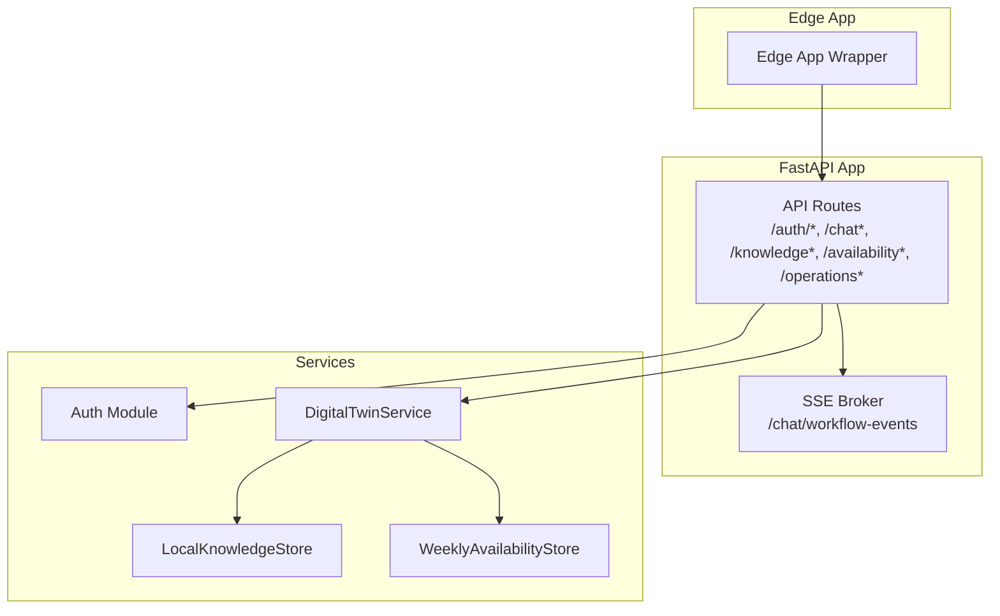
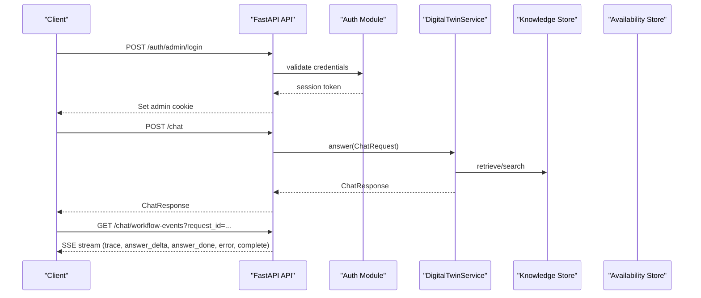
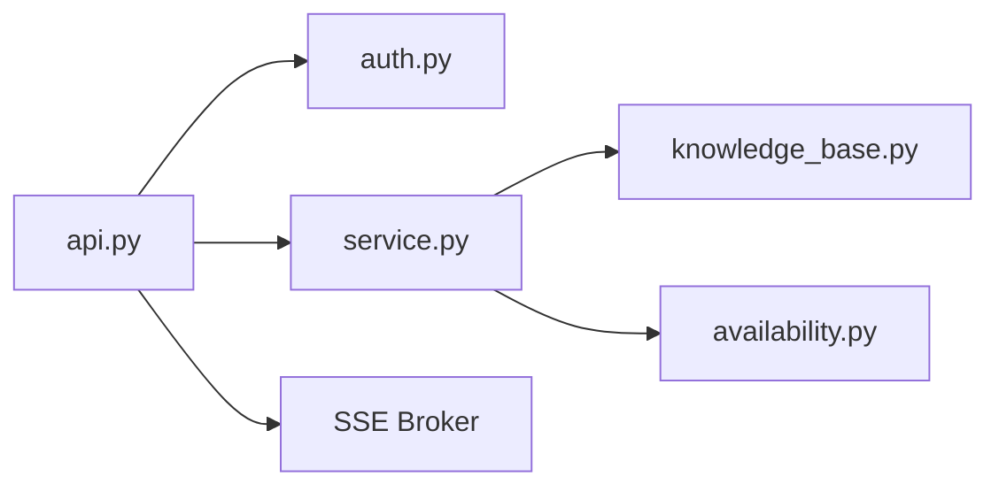

# API Reference

<cite>
**Referenced Files in This Document**
- [api.py](file://src/sage_faculty_twin/api.py)
- [auth.py](file://src/sage_faculty_twin/auth.py)
- [service.py](file://src/sage_faculty_twin/service.py)
- [models.py](file://src/sage_faculty_twin/models.py)
- [availability.py](file://src/sage_faculty_twin/availability.py)
- [knowledge_base.py](file://src/sage_faculty_twin/knowledge_base.py)
- [config.py](file://src/sage_faculty_twin/config.py)
- [index.html](file://src/sage_faculty_twin/web/index.html)
- [README.md](file://README.md)
</cite>

## Update Summary
**Changes Made**
- Removed all references to GraphQL API implementation as it has been completely removed from the codebase
- Updated architecture diagrams to reflect pure REST API structure
- Clarified that the API is now a standard FastAPI REST service without GraphQL integration
- Updated troubleshooting section to remove GraphQL-related error scenarios
- Enhanced security considerations to focus on REST API patterns

## Table of Contents
1. [Introduction](#introduction)
2. [Project Structure](#project-structure)
3. [Core Components](#core-components)
4. [Architecture Overview](#architecture-overview)
5. [Detailed Component Analysis](#detailed-component-analysis)
6. [Dependency Analysis](#dependency-analysis)
7. [Performance Considerations](#performance-considerations)
8. [Troubleshooting Guide](#troubleshooting-guide)
9. [Conclusion](#conclusion)
10. [Appendices](#appendices)

## Introduction
This document provides comprehensive API documentation for the Sage Faculty Twin REST endpoints. It covers:
- Authentication and session management
- Primary chat endpoint with streaming support via Server-Sent Events (SSE)
- Knowledge base management APIs
- Availability and scheduling endpoints
- Administrative operations
- Request/response schemas, parameters, error codes, and practical usage examples
- Security, rate limiting, and API versioning considerations

The API is built with FastAPI and served behind an edge app wrapper. It integrates with an LLM backend and optional web search, and exposes both JSON endpoints and an interactive frontend. **Note**: GraphQL API implementation has been removed from the codebase and is no longer available.

## Project Structure
Key API-related modules:
- API routing and endpoints: [api.py](file://src/sage_faculty_twin/api.py)
- Authentication and cookies: [auth.py](file://src/sage_faculty_twin/auth.py)
- Business logic and orchestration: [service.py](file://src/sage_faculty_twin/service.py)
- Data models and validation: [models.py](file://src/sage_faculty_twin/models.py)
- Availability schedule persistence: [availability.py](file://src/sage_faculty_twin/availability.py)
- Knowledge base storage and retrieval: [knowledge_base.py](file://src/sage_faculty_twin/knowledge_base.py)
- Application settings and environment: [config.py](file://src/sage_faculty_twin/config.py)
- Frontend assets and HTML shell: [index.html](file://src/sage_faculty_twin/web/index.html)
- Deployment and usage notes: [README.md](file://README.md)

**Diagram sources**
- [api.py:90-120](file://src/sage_faculty_twin/api.py#L90-L120)
- [auth.py:16-18](file://src/sage_faculty_twin/auth.py#L16-L18)
- [service.py:581-634](file://src/sage_faculty_twin/service.py#L581-L634)
- [knowledge_base.py:121-140](file://src/sage_faculty_twin/knowledge_base.py#L121-L140)
- [availability.py:11-26](file://src/sage_faculty_twin/availability.py#L11-L26)

**Section sources**
- [api.py:90-120](file://src/sage_faculty_twin/api.py#L90-L120)
- [README.md:1-126](file://README.md#L1-L126)

## Core Components
- FastAPI application with CORS and static asset serving
- Session-based authentication for admin and user modes
- Streaming workflow events via Server-Sent Events
- Knowledge base CRUD and search
- Availability schedule management
- Operational dashboards and analytics

Key constants and behaviors:
- Chat request timeout and SSE keepalive intervals are configurable via environment variables
- Attachment limits and supported types are enforced server-side
- Admin-only endpoints are protected by cookie-based session validation

**Section sources**
- [api.py:116-168](file://src/sage_faculty_twin/api.py#L116-L168)
- [auth.py:16-18](file://src/sage_faculty_twin/auth.py#L16-L18)
- [config.py:9-132](file://src/sage_faculty_twin/config.py#L9-L132)

## Architecture Overview
High-level flow:
- Clients call JSON endpoints for authentication, chat, knowledge, availability, and operations
- Admin endpoints require a valid admin session cookie
- Chat endpoint optionally streams workflow events via SSE when a request ID is provided
- The service orchestrates LLM calls, memory retrieval, knowledge search, web search, and follow-up actions

**Diagram sources**
- [api.py:479-510](file://src/sage_faculty_twin/api.py#L479-L510)
- [api.py:618-700](file://src/sage_faculty_twin/api.py#L618-L700)
- [api.py:597-609](file://src/sage_faculty_twin/api.py#L597-L609)
- [service.py:581-634](file://src/sage_faculty_twin/service.py#L581-L634)
- [knowledge_base.py:273-295](file://src/sage_faculty_twin/knowledge_base.py#L273-L295)
- [availability.py:17-26](file://src/sage_faculty_twin/availability.py#L17-L26)

## Detailed Component Analysis

### Authentication and Sessions
- Admin session cookie name: faculty_twin_admin
- User session cookie name: faculty_twin_user
- Admin login/logout and user registration/login/logout endpoints
- Session validation helpers and cookie setters/getters

Endpoints:
- POST /auth/admin/login
- POST /auth/admin/logout
- GET /auth/session
- POST /auth/user/register
- POST /auth/user/login
- POST /auth/user/logout
- GET /auth/user/session

Parameters and responses:
- Admin login: request body includes username and password; response includes admin session info
- User register/login: request body includes name/email/password/visitor_profile; response includes user session info
- Session endpoints return current session state

Security:
- Cookies are HttpOnly and SameSite lax; secure flag is false by default
- Admin and user session secrets are configured via environment variables
- Session TTLs are configurable

Example curl:
- Login admin: curl -X POST http://127.0.0.1:55601/auth/admin/login -H "Content-Type: application/json" -d '{"username":"admin","password":"..."}' -c cookies.txt
- Get user session: curl http://127.0.0.1:55601/auth/user/session -b cookies.txt

**Section sources**
- [auth.py:16-18](file://src/sage_faculty_twin/auth.py#L16-L18)
- [auth.py:57-86](file://src/sage_faculty_twin/auth.py#L57-L86)
- [auth.py:119-129](file://src/sage_faculty_twin/auth.py#L119-L129)
- [api.py:479-510](file://src/sage_faculty_twin/api.py#L479-L510)
- [models.py:728-761](file://src/sage_faculty_twin/models.py#L728-L761)

### Chat and Streaming (SSE)
Primary chat endpoint:
- POST /chat
  - Accepts multipart/form-data or JSON
  - Supports question, student_name, student_email, course_context, visitor_profile, conversation_id, attachments, deep_thinking, deep_thinking_explicit, web_search
  - Returns ChatResponse
  - Optional request_id query param enables SSE streaming

Streaming endpoint:
- GET /chat/workflow-events?request_id={id}
  - Server-Sent Events stream
  - Emits keepalive events periodically to prevent proxy timeouts
  - Emits trace-step, answer_delta, answer_done, error, complete events

Streaming behavior:
- When DIGITAL_TWIN_STREAM_CHAT_ANSWER is enabled, the service streams LLM token chunks as answer_delta events
- On completion, answer_done delivers the full ChatResponse payload
- Keepalive cadence controlled by DIGITAL_TWIN_CHAT_SSE_KEEPALIVE_SECONDS

Timeout and limits:
- Chat request timeout controlled by DIGITAL_TWIN_CHAT_REQUEST_TIMEOUT_SECONDS
- Attachment limits: up to 4 files, max 5MB each, supported types include PDF, TXT, MD, CSV, JSON, PY, YAML, LOG

Example curl:
- Non-streaming: curl -X POST http://127.0.0.1:55601/chat -H "Content-Type: application/json" -d '{"student_name":"Alice","question":"What is AI?"}'
- Streaming: curl -N http://127.0.0.1:55601/chat?request_id=abc123 -H "Content-Type: application/json" -d '{"student_name":"Alice","question":"Explain quantum computing"}'

Schemas:
- Request: ChatRequest
- Response: ChatResponse
- SSE events: trace-step, answer_delta, answer_done, error, complete

**Section sources**
- [api.py:618-700](file://src/sage_faculty_twin/api.py#L618-L700)
- [api.py:597-609](file://src/sage_faculty_twin/api.py#L597-L609)
- [api.py:116-168](file://src/sage_faculty_twin/api.py#L116-L168)
- [models.py:16-31](file://src/sage_faculty_twin/models.py#L16-L31)
- [models.py:199-221](file://src/sage_faculty_twin/models.py#L199-L221)

### Knowledge Base Management
Endpoints:
- POST /knowledge
- POST /knowledge/{document_id}/review
- DELETE /knowledge/{document_id}
- GET /knowledge
- GET /knowledge/search
- GET /knowledge/reviews/summary

Models:
- KnowledgeDocumentCreate, KnowledgeDocumentRecord, KnowledgeDocumentReviewRequest, KnowledgeDocumentActionResponse, KnowledgeSearchResponse

Behavior:
- Admin-only protection for write/update/delete/list operations
- Search supports visitor_profile and admin role scoping
- Reviews summary aggregates feedback-web and review statuses

Example curl:
- Create document: curl -X POST http://127.0.0.1:55601/knowledge -H "Content-Type: application/json" -d '{"title":"Guide","content":"...","tags":["help"],"source_name":"manual"}' -H "Cookie: faculty_twin_admin=..."
- List documents: curl http://127.0.0.1:55601/knowledge -H "Cookie: faculty_twin_admin=..."

**Section sources**
- [api.py:764-801](file://src/sage_faculty_twin/api.py#L764-L801)
- [api.py:804-817](file://src/sage_faculty_twin/api.py#L804-L817)
- [models.py:319-340](file://src/sage_faculty_twin/models.py#L319-L340)
- [models.py:379-398](file://src/sage_faculty_twin/models.py#L379-L398)
- [models.py:400-412](file://src/sage_faculty_twin/models.py#L400-L412)

### Availability and Scheduling
Endpoints:
- GET /availability
- PUT /availability
- GET /availability/previous-week

Models:
- AvailabilitySchedule, AvailabilityDay, AvailabilityWindow

Behavior:
- Admin-only protection
- Schedule persisted to JSON; includes timezone and weekly windows
- Previous week template helper for copying schedules

Example curl:
- Get schedule: curl http://127.0.0.1:55601/availability -H "Cookie: faculty_twin_admin=..."
- Update schedule: curl -X PUT http://127.0.0.1:55601/availability -H "Content-Type: application/json" -d '{"timezone":"Asia/Shanghai","days":[...]}' -H "Cookie: faculty_twin_admin=..."

**Section sources**
- [api.py:574-594](file://src/sage_faculty_twin/api.py#L574-L594)
- [models.py:313-317](file://src/sage_faculty_twin/models.py#L313-L317)
- [models.py:307-311](file://src/sage_faculty_twin/models.py#L307-L311)
- [models.py:292-305](file://src/sage_faculty_twin/models.py#L292-L305)
- [availability.py:17-45](file://src/sage_faculty_twin/availability.py#L17-L45)

### Administrative and Operational Endpoints
Endpoints:
- GET /admin/services
- POST /admin/services/{action}
- GET /operations/overview
- GET /operations/workbench
- PATCH /operations/tasks/{task_key}
- GET /analytics/questions
- GET /workflow/replay
- GET /memory/profiles
- GET /memory/artifact-drafts
- POST /memory/artifact-drafts/{draft_id}/accept
- POST /memory/artifact-drafts/{draft_id}/reject
- GET /analytics/questions/gap-drafts
- POST /analytics/questions/gap-drafts
- POST /analytics/questions/gap-drafts/{draft_id}/publish
- GET /escalations
- POST /escalations/{escalation_id}/resolve
- GET /follow-ups
- POST /follow-ups/dispatch
- GET /presence/heartbeat
- GET /lucky-question

Notes:
- Many endpoints require admin session cookie
- Workbench aggregates queues, tasks, satisfaction metrics, and drafts
- Presence heartbeat tracks online visitors and active conversations
- Lucky question endpoint generates contextual prompts

**Section sources**
- [api.py:461-477](file://src/sage_faculty_twin/api.py#L461-L477)
- [api.py:838-853](file://src/sage_faculty_twin/api.py#L838-L853)
- [api.py:862-868](file://src/sage_faculty_twin/api.py#L862-L868)
- [api.py:830-836](file://src/sage_faculty_twin/api.py#L830-L836)
- [api.py:855-859](file://src/sage_faculty_twin/api.py#L855-L859)
- [api.py:820-827](file://src/sage_faculty_twin/api.py#L820-L827)
- [api.py:881-907](file://src/sage_faculty_twin/api.py#L881-L907)
- [api.py:910-926](file://src/sage_faculty_twin/api.py#L910-L926)
- [api.py:929-944](file://src/sage_faculty_twin/api.py#L929-L944)
- [api.py:947-960](file://src/sage_faculty_twin/api.py#L947-L960)
- [api.py:542-546](file://src/sage_faculty_twin/api.py#L542-L546)
- [api.py:549-572](file://src/sage_faculty_twin/api.py#L549-L572)

### Bookings and Follow-ups
Endpoints:
- POST /bookings
- GET /bookings
- POST /bookings/{booking_id}/confirm
- POST /bookings/{booking_id}/reject

Models:
- BookingRequest, BookingResponse, BookingRecord, BookingStatusFilter, BookingDecisionRequest

Behavior:
- Bookings integrate with availability schedule and email notifications
- Follow-ups queue supports dispatching and filtering

**Section sources**
- [api.py:963-991](file://src/sage_faculty_twin/api.py#L963-L991)
- [models.py:257-282](file://src/sage_faculty_twin/models.py#L257-L282)

### Frontend Assets and Health
- GET / (returns index.html)
- GET /styles.css, /app.js (static assets)
- GET /health (service health and stack versions)
- GET /stack/versions, /stack/hardware (runtime metadata)

**Section sources**
- [api.py:429-449](file://src/sage_faculty_twin/api.py#L429-L449)
- [api.py:512-539](file://src/sage_faculty_twin/api.py#L512-L539)
- [service.py:250-266](file://src/sage_faculty_twin/service.py#L250-L266)
- [service.py:269-346](file://src/sage_faculty_twin/service.py#L269-L346)
- [index.html:1-20](file://src/sage_faculty_twin/web/index.html#L1-L20)

## Dependency Analysis
Internal dependencies:
- API routes depend on auth helpers and DigitalTwinService
- Service composes knowledge store, availability store, memory stores, LLM client, and workflow components
- SSE broker is decoupled from routes and used for streaming workflow events

**Diagram sources**
- [api.py:22-30](file://src/sage_faculty_twin/api.py#L22-L30)
- [service.py:39-51](file://src/sage_faculty_twin/service.py#L39-L51)
- [knowledge_base.py:10-15](file://src/sage_faculty_twin/knowledge_base.py#L10-L15)
- [availability.py:7-8](file://src/sage_faculty_twin/availability.py#L7-L8)

**Section sources**
- [api.py:22-30](file://src/sage_faculty_twin/api.py#L22-L30)
- [service.py:39-51](file://src/sage_faculty_twin/service.py#L39-L51)

## Performance Considerations
- Streaming chat answer: enable DIGITAL_TWIN_STREAM_CHAT_ANSWER to receive incremental tokens via SSE
- SSE keepalive: DIGITAL_TWIN_CHAT_SSE_KEEPALIVE_SECONDS controls heartbeat interval to prevent proxy timeouts
- Chat request timeout: DIGITAL_TWIN_CHAT_REQUEST_TIMEOUT_SECONDS bounds total request time
- Prompt soft cap and truncation reduce LLM context size when needed
- Knowledge base backends: choose appropriate embedding and index type for retrieval performance

## Troubleshooting Guide
Common issues and resolutions:
- 401 Unauthorized on admin endpoints: ensure admin cookie is present and valid
- 403 Forbidden on admin endpoints: session missing or invalid
- 422 Validation errors on chat: missing required fields or invalid attachment types/sizes
- 504 Gateway Timeout on /chat: exceeded DIGITAL_TWIN_CHAT_REQUEST_TIMEOUT_SECONDS; retry later
- No streaming output: verify DIGITAL_TWIN_STREAM_CHAT_ANSWER is enabled and upstream LLM supports chunked streaming

Operational checks:
- Verify /health responds with initialized status
- Confirm stack versions and hardware info via /stack/versions and /stack/hardware

**Section sources**
- [auth.py:119-129](file://src/sage_faculty_twin/auth.py#L119-L129)
- [api.py:641-645](file://src/sage_faculty_twin/api.py#L641-L645)
- [api.py:127-129](file://src/sage_faculty_twin/api.py#L127-L129)
- [README.md:111-117](file://README.md#L111-L117)

## Conclusion
The Sage Faculty Twin API provides a comprehensive set of endpoints for chat, knowledge management, scheduling, and administrative operations. It emphasizes robust session management, streaming chat responses, and modular backend integrations for knowledge and availability. Administrators can manage content and workflows, while users can engage in contextual, streamed conversations with optional attachments and web search.

**Updated**: GraphQL API implementation has been removed from the codebase. The API is now a pure REST service built with FastAPI, providing all functionality through standard HTTP endpoints without GraphQL integration.

## Appendices

### API Versioning
- FastAPI app defines a version string; stack versions are exposed separately via /stack/versions and /stack/hardware

**Section sources**
- [api.py](file://src/sage_faculty_twin/api.py#L90)
- [service.py:250-266](file://src/sage_faculty_twin/service.py#L250-L266)
- [service.py:269-346](file://src/sage_faculty_twin/service.py#L269-L346)

### Rate Limiting and Throttling
- No explicit global rate limiting is implemented in the API code
- Chat request timeout prevents long-running requests
- Consider deploying behind a gateway or CDN with rate limiting policies if needed

### Security Considerations
- Admin and user session cookies are HttpOnly and SameSite lax; adjust secure flag and domain as needed
- Session secrets and TTLs are configurable
- CORS is configured for local development origins
- Attachments are validated for type, size, and encoding
- All endpoints are RESTful JSON APIs without GraphQL attack surface

**Section sources**
- [auth.py:57-86](file://src/sage_faculty_twin/auth.py#L57-L86)
- [api.py:79-87](file://src/sage_faculty_twin/api.py#L79-L87)
- [api.py:328-367](file://src/sage_faculty_twin/api.py#L328-L367)

### Request/Response Schemas Overview
- ChatRequest: question, student_name, student_email, course_context, visitor_profile, conversation_id, attachments, deep_thinking, deep_thinking_explicit, web_search
- ChatResponse: answer, owner_name, used_model, knowledge_hits, web_search_hits, answer_basis, follow_up_actions, conversation_id, workflow_action, decision_mode, pending_fields, booking_result, escalation_record, planner_preview, shadow_planner_preview, planner_comparison, workflow_trace, memory_used, memory_write_back, retrieved_items
- KnowledgeDocumentCreate/Record: title, content, tags, source_name, metadata, created_at, review fields
- AvailabilitySchedule/Day/Window: timezone, week_of, days with date and windows

**Section sources**
- [models.py:16-31](file://src/sage_faculty_twin/models.py#L16-L31)
- [models.py:199-221](file://src/sage_faculty_twin/models.py#L199-L221)
- [models.py:319-340](file://src/sage_faculty_twin/models.py#L319-L340)
- [models.py:313-317](file://src/sage_faculty_twin/models.py#L313-L317)
- [models.py:307-311](file://src/sage_faculty_twin/models.py#L307-L311)
- [models.py:292-305](file://src/sage_faculty_twin/models.py#L292-L305)