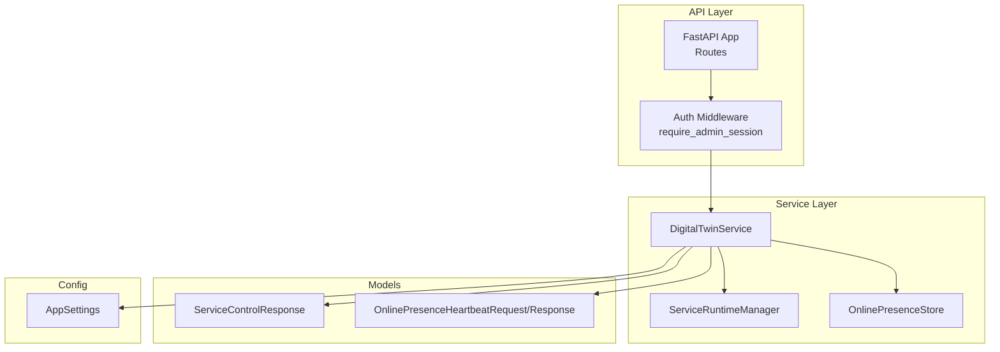
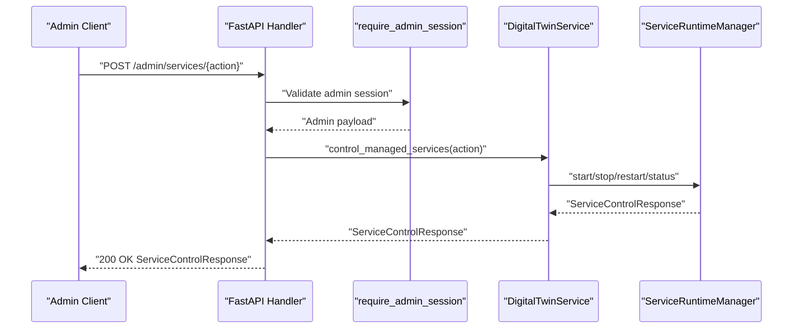
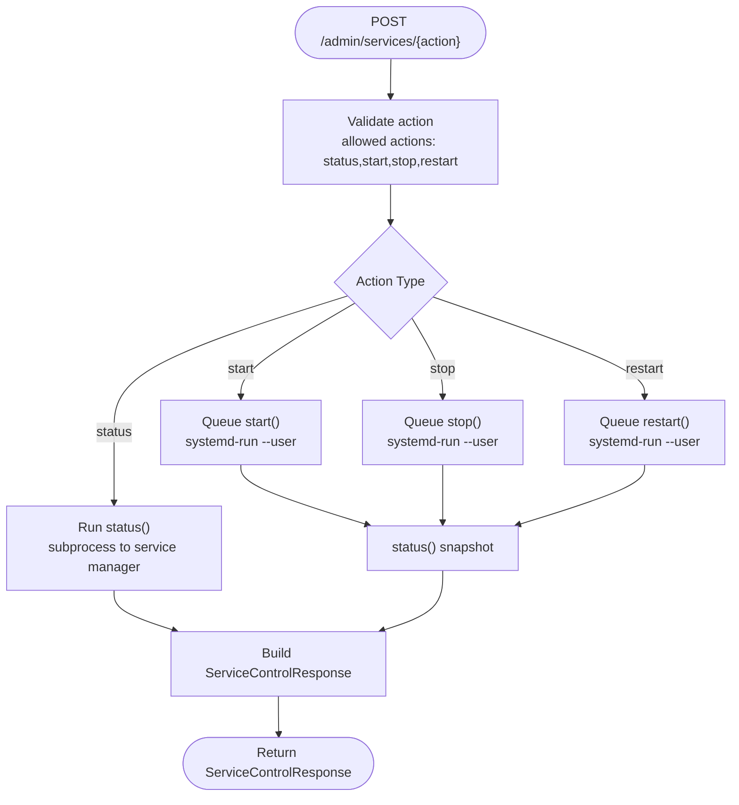
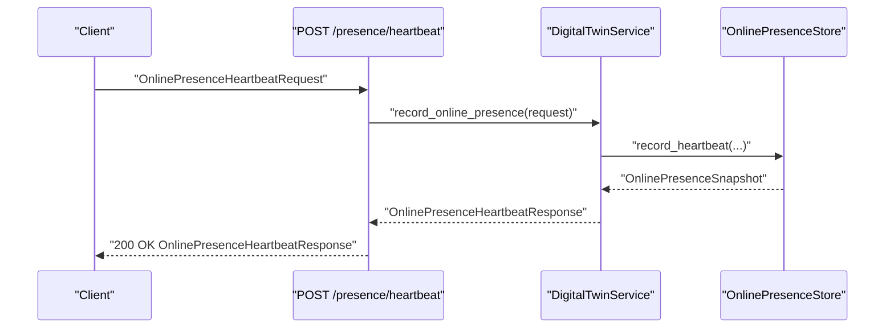
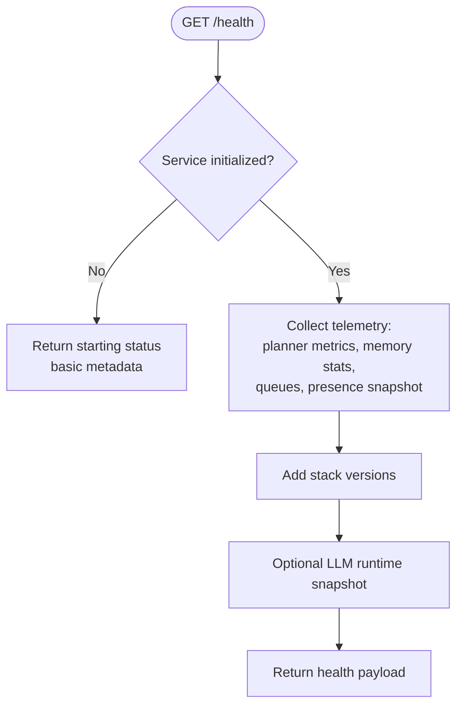
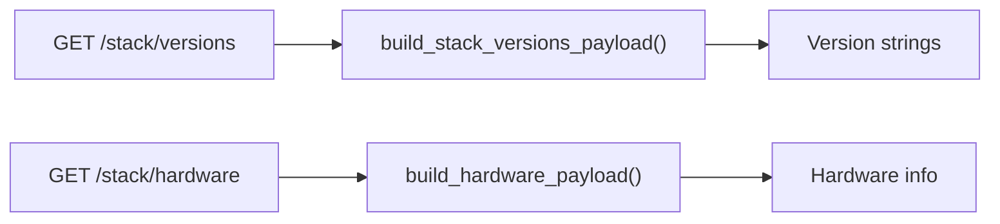
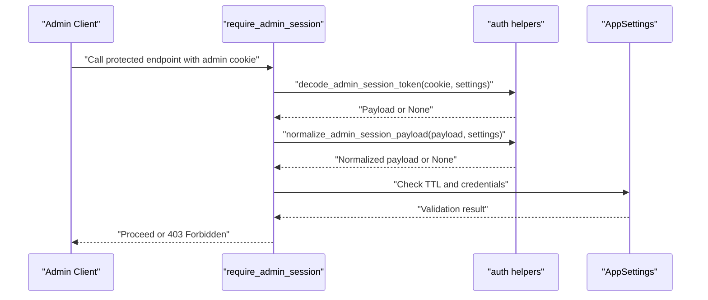
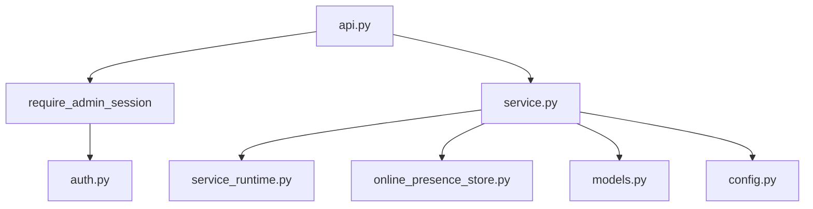

# Administrative Endpoints

<cite>
**Referenced Files in This Document**
- [api.py](file://src/sage_faculty_twin/api.py)
- [service.py](file://src/sage_faculty_twin/service.py)
- [service_runtime.py](file://src/sage_faculty_twin/service_runtime.py)
- [online_presence_store.py](file://src/sage_faculty_twin/online_presence_store.py)
- [models.py](file://src/sage_faculty_twin/models.py)
- [auth.py](file://src/sage_faculty_twin/auth.py)
- [config.py](file://src/sage_faculty_twin/config.py)
</cite>

## Table of Contents
1. [Introduction](#introduction)
2. [Project Structure](#project-structure)
3. [Core Components](#core-components)
4. [Architecture Overview](#architecture-overview)
5. [Detailed Component Analysis](#detailed-component-analysis)
6. [Dependency Analysis](#dependency-analysis)
7. [Performance Considerations](#performance-considerations)
8. [Troubleshooting Guide](#troubleshooting-guide)
9. [Conclusion](#conclusion)

## Introduction
This document provides comprehensive API documentation for administrative operations endpoints. It covers:
- Service control endpoints for managing managed services
- Online presence tracking via heartbeat
- System health monitoring
- System information endpoints for stack versions and hardware
- Administrative authentication and access control

It includes operation overviews, workflows, and practical examples for administrators to monitor, diagnose, and operate the system effectively.

## Project Structure
Administrative endpoints are implemented in the FastAPI application module and backed by the Digital Twin service layer. Key components:
- API routing and endpoint handlers
- Authentication and session management
- Service control via a runtime manager
- Online presence storage and snapshots
- System telemetry and hardware information

**Diagram sources**
- [api.py:422-424](file://src/sage_faculty_twin/api.py#L422-L424)
- [service.py:6409-6411](file://src/sage_faculty_twin/service.py#L6409-L6411)
- [service_runtime.py:13-69](file://src/sage_faculty_twin/service_runtime.py#L13-L69)
- [online_presence_store.py:18-71](file://src/sage_faculty_twin/online_presence_store.py#L18-L71)
- [models.py:778-783](file://src/sage_faculty_twin/models.py#L778-L783)
- [models.py:33-45](file://src/sage_faculty_twin/models.py#L33-L45)
- [config.py:120-128](file://src/sage_faculty_twin/config.py#L120-L128)

**Section sources**
- [api.py:422-424](file://src/sage_faculty_twin/api.py#L422-L424)
- [service.py:6409-6411](file://src/sage_faculty_twin/service.py#L6409-L6411)
- [service_runtime.py:13-69](file://src/sage_faculty_twin/service_runtime.py#L13-L69)
- [online_presence_store.py:18-71](file://src/sage_faculty_twin/online_presence_store.py#L18-L71)
- [models.py:778-783](file://src/sage_faculty_twin/models.py#L778-L783)
- [models.py:33-45](file://src/sage_faculty_twin/models.py#L33-L45)
- [config.py:120-128](file://src/sage_faculty_twin/config.py#L120-L128)

## Core Components
- Administrative authentication and session:
  - Admin cookie-based session with HMAC-signed tokens
  - Session validation and normalization
  - Admin credentials validation and role resolution
- Service control:
  - Status, start, stop, restart actions delegated to a runtime manager
  - systemd-based orchestration via a shell script
- Online presence:
  - Heartbeat recording and periodic snapshots
  - Aggregated metrics for visitors, authenticated users, and active conversations
- System health and telemetry:
  - Rich health payload with model, backends, planner metrics, and runtime stats
  - Stack versions and hardware information endpoints

**Section sources**
- [auth.py:16-117](file://src/sage_faculty_twin/auth.py#L16-L117)
- [auth.py:158-179](file://src/sage_faculty_twin/auth.py#L158-L179)
- [service_runtime.py:13-69](file://src/sage_faculty_twin/service_runtime.py#L13-L69)
- [service.py:6413-6434](file://src/sage_faculty_twin/service.py#L6413-L6434)
- [online_presence_store.py:18-124](file://src/sage_faculty_twin/online_presence_store.py#L18-L124)
- [service.py:6469-6594](file://src/sage_faculty_twin/service.py#L6469-L6594)

## Architecture Overview
Administrative endpoints are protected by an admin session dependency. Requests flow through the API layer to the service layer, which orchestrates runtime operations and persistence.

**Diagram sources**
- [api.py:468-477](file://src/sage_faculty_twin/api.py#L468-L477)
- [service.py:6458-6467](file://src/sage_faculty_twin/service.py#L6458-L6467)
- [service_runtime.py:19-48](file://src/sage_faculty_twin/service_runtime.py#L19-L48)

## Detailed Component Analysis

### Service Control Endpoints
- Endpoint: GET /admin/services
  - Purpose: Retrieve current status of managed services
  - Authentication: Admin session required
  - Response: ServiceControlResponse with action=status, success flag, message, and per-service status
- Endpoint: POST /admin/services/{action}
  - Purpose: Control managed services (start, stop, restart, status)
  - Authentication: Admin session required
  - Validation: Unsupported actions raise HTTP 400
  - Behavior:
    - status: synchronous status query
    - start/stop/restart: queue systemd-run jobs and return current status snapshot

Operational workflow:
- Use GET to discover current state
- Use POST with action=start/stop/restart to change state
- Use POST with action=status to refresh state

**Diagram sources**
- [api.py:468-477](file://src/sage_faculty_twin/api.py#L468-L477)
- [service.py:6458-6467](file://src/sage_faculty_twin/service.py#L6458-L6467)
- [service_runtime.py:31-69](file://src/sage_faculty_twin/service_runtime.py#L31-L69)

**Section sources**
- [api.py:461-477](file://src/sage_faculty_twin/api.py#L461-L477)
- [service.py:6409-6411](file://src/sage_faculty_twin/service.py#L6409-L6411)
- [service.py:6458-6467](file://src/sage_faculty_twin/service.py#L6458-L6467)
- [service_runtime.py:13-69](file://src/sage_faculty_twin/service_runtime.py#L13-L69)
- [models.py:778-783](file://src/sage_faculty_twin/models.py#L778-L783)

### Online Presence Tracking
- Endpoint: POST /presence/heartbeat
  - Purpose: Record client heartbeat and compute online presence snapshot
  - Request: OnlinePresenceHeartbeatRequest (client_id, conversation_id, student_email, is_authenticated)
  - Response: OnlinePresenceHeartbeatResponse (window_seconds, online_visitors, online_authenticated_users, active_conversations)
  - Storage: SQLite-backed store with pruning and retention policies

**Diagram sources**
- [api.py:542-547](file://src/sage_faculty_twin/api.py#L542-L547)
- [service.py:6413-6434](file://src/sage_faculty_twin/service.py#L6413-L6434)
- [online_presence_store.py:27-70](file://src/sage_faculty_twin/online_presence_store.py#L27-L70)

**Section sources**
- [api.py:542-547](file://src/sage_faculty_twin/api.py#L542-L547)
- [service.py:6413-6434](file://src/sage_faculty_twin/service.py#L6413-L6434)
- [online_presence_store.py:18-124](file://src/sage_faculty_twin/online_presence_store.py#L18-L124)
- [models.py:33-45](file://src/sage_faculty_twin/models.py#L33-L45)

### System Health Monitoring
- Endpoint: GET /health
  - Purpose: Comprehensive system health and telemetry
  - Behavior:
    - If service is not initialized: returns starting status with basic metadata
    - Otherwise: returns health payload with model, owner info, homepage URL, stack versions, planner metrics, memory stats, queue sizes, and runtime telemetry
  - Notes: Includes optional LLM runtime snapshot if available

**Diagram sources**
- [api.py:512-529](file://src/sage_faculty_twin/api.py#L512-L529)
- [service.py:6469-6594](file://src/sage_faculty_twin/service.py#L6469-L6594)

**Section sources**
- [api.py:512-529](file://src/sage_faculty_twin/api.py#L512-L529)
- [service.py:6469-6594](file://src/sage_faculty_twin/service.py#L6469-L6594)

### System Information Endpoints
- Endpoint: GET /stack/versions
  - Purpose: Return stack component versions (SAGE, neuromem, vLLM-HUST, sageVDB, sage-ANNs)
  - Implementation: Resolves versions from local source checkouts or pip metadata
- Endpoint: GET /stack/hardware
  - Purpose: Return host hardware info (NPU, CPU, memory)
  - Implementation: Uses system tools and procfs to gather hardware details

**Diagram sources**
- [api.py:532-539](file://src/sage_faculty_twin/api.py#L532-L539)
- [service.py:250-266](file://src/sage_faculty_twin/service.py#L250-L266)
- [service.py:269-346](file://src/sage_faculty_twin/service.py#L269-L346)

**Section sources**
- [api.py:532-539](file://src/sage_faculty_twin/api.py#L532-L539)
- [service.py:250-266](file://src/sage_faculty_twin/service.py#L250-L266)
- [service.py:269-346](file://src/sage_faculty_twin/service.py#L269-L346)

### Administrative Authentication and Access Controls
- Admin session cookie:
  - Cookie name: faculty_twin_admin
  - Token format: base64-encoded JSON payload + HMAC-SHA256 signature
  - Expiration: controlled by admin_session_ttl_seconds
- Session validation:
  - Decoding and signature verification
  - Expiration check
  - Normalization to enforce roles
- Role resolution:
  - super_admin and manager roles supported
  - Credentials validated against configured accounts
- Endpoint protection:
  - require_admin_session dependency enforces admin session for service control and presence endpoints

**Diagram sources**
- [api.py:422-424](file://src/sage_faculty_twin/api.py#L422-L424)
- [auth.py:20-38](file://src/sage_faculty_twin/auth.py#L20-L38)
- [auth.py:145-155](file://src/sage_faculty_twin/auth.py#L145-L155)
- [auth.py:158-179](file://src/sage_faculty_twin/auth.py#L158-L179)
- [config.py:120-128](file://src/sage_faculty_twin/config.py#L120-L128)

**Section sources**
- [auth.py:16-117](file://src/sage_faculty_twin/auth.py#L16-L117)
- [auth.py:158-179](file://src/sage_faculty_twin/auth.py#L158-L179)
- [api.py:422-424](file://src/sage_faculty_twin/api.py#L422-L424)
- [config.py:120-128](file://src/sage_faculty_twin/config.py#L120-L128)

## Dependency Analysis
Key dependencies and relationships:
- API handlers depend on require_admin_session for protection
- DigitalTwinService depends on ServiceRuntimeManager for service control
- DigitalTwinService depends on OnlinePresenceStore for presence tracking
- Health endpoint aggregates data from multiple stores and clients
- Stack versions and hardware endpoints rely on system introspection

**Diagram sources**
- [api.py:422-424](file://src/sage_faculty_twin/api.py#L422-L424)
- [auth.py:16-117](file://src/sage_faculty_twin/auth.py#L16-L117)
- [service.py:6409-6411](file://src/sage_faculty_twin/service.py#L6409-L6411)
- [service_runtime.py:13-69](file://src/sage_faculty_twin/service_runtime.py#L13-L69)
- [online_presence_store.py:18-71](file://src/sage_faculty_twin/online_presence_store.py#L18-L71)
- [models.py:778-783](file://src/sage_faculty_twin/models.py#L778-L783)
- [config.py:120-128](file://src/sage_faculty_twin/config.py#L120-L128)

**Section sources**
- [api.py:422-424](file://src/sage_faculty_twin/api.py#L422-L424)
- [service.py:6409-6411](file://src/sage_faculty_twin/service.py#L6409-L6411)
- [service_runtime.py:13-69](file://src/sage_faculty_twin/service_runtime.py#L13-L69)
- [online_presence_store.py:18-71](file://src/sage_faculty_twin/online_presence_store.py#L18-L71)
- [models.py:778-783](file://src/sage_faculty_twin/models.py#L778-L783)
- [config.py:120-128](file://src/sage_faculty_twin/config.py#L120-L128)

## Performance Considerations
- Service control actions are asynchronous when queuing via systemd-run; use status action to poll for completion
- Presence recording performs lightweight database inserts and computes snapshots; window and retention seconds are configurable
- Health endpoint aggregates multiple subsystems; consider caching or rate-limiting consumers
- Stack versions and hardware endpoints perform external process calls; cache results if called frequently

## Troubleshooting Guide
Common issues and resolutions:
- Unauthorized access to administrative endpoints:
  - Ensure admin cookie is present, valid, and not expired
  - Verify admin credentials and roles
- Service control failures:
  - Confirm service manager script path in settings
  - Check systemd-run availability and permissions
  - Review returned message and per-service status for actionable errors
- Presence tracking anomalies:
  - Adjust online_presence_window_seconds and online_presence_retention_seconds
  - Verify SQLite database connectivity and disk space
- Health endpoint timeouts or missing LLM metrics:
  - Confirm LLM client runtime snapshot capability
  - Reduce polling frequency or enable caching

**Section sources**
- [auth.py:119-129](file://src/sage_faculty_twin/auth.py#L119-L129)
- [service_runtime.py:31-48](file://src/sage_faculty_twin/service_runtime.py#L31-L48)
- [online_presence_store.py:126-154](file://src/sage_faculty_twin/online_presence_store.py#L126-L154)
- [service.py:6561-6593](file://src/sage_faculty_twin/service.py#L6561-L6593)

## Conclusion
Administrative endpoints provide a robust foundation for service control, presence monitoring, system health checks, and system information retrieval. Administrators should leverage admin sessions for access control, use service control actions judiciously with status polling, monitor presence metrics for real-time insights, and consult health and system information endpoints for diagnostics and capacity planning.