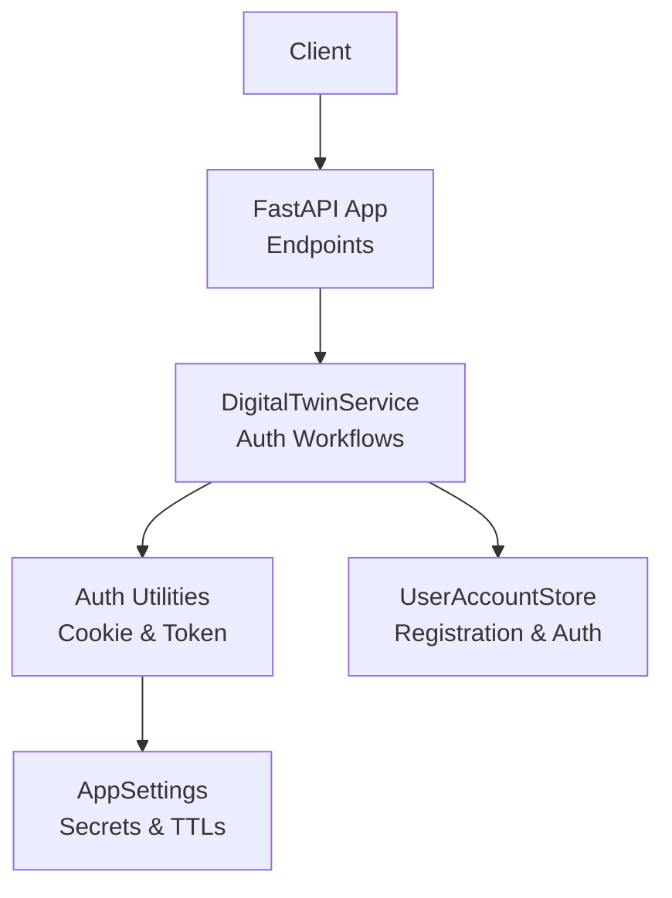
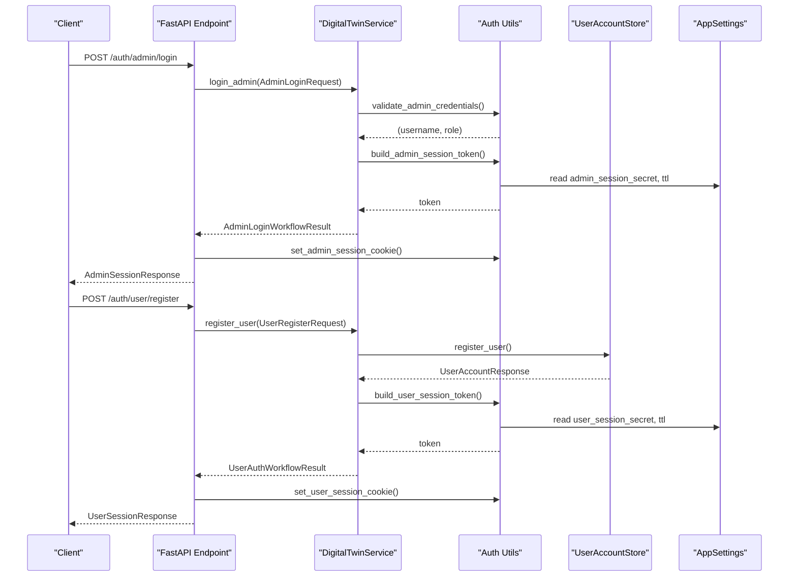
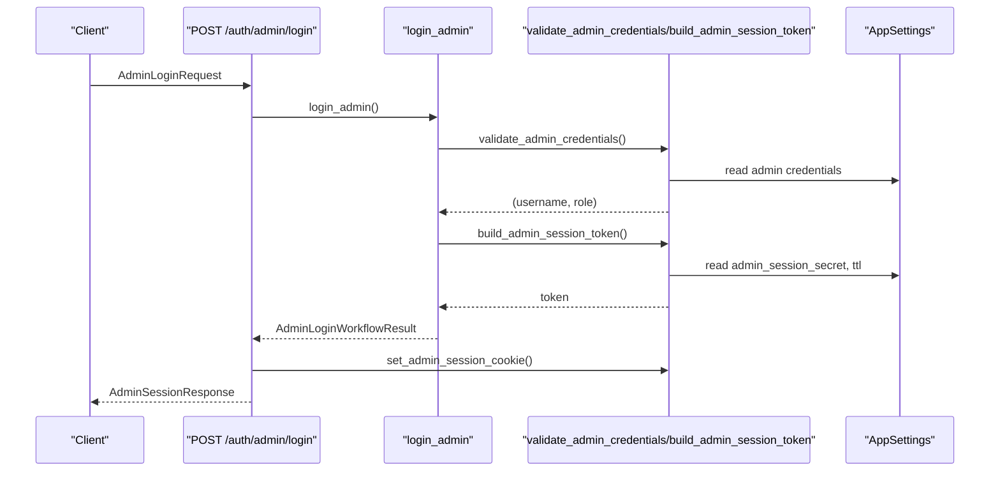
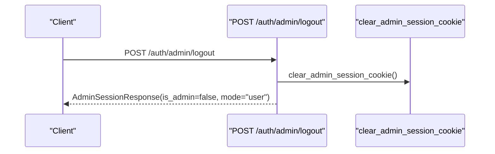
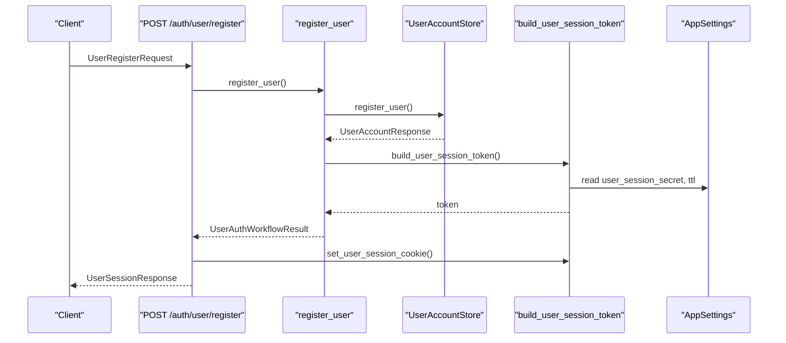
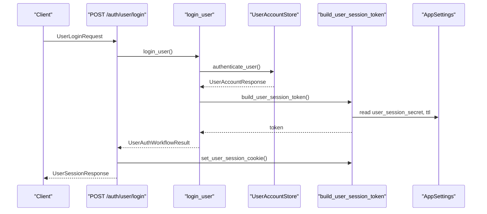
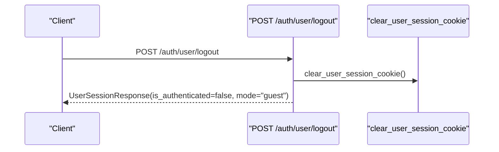
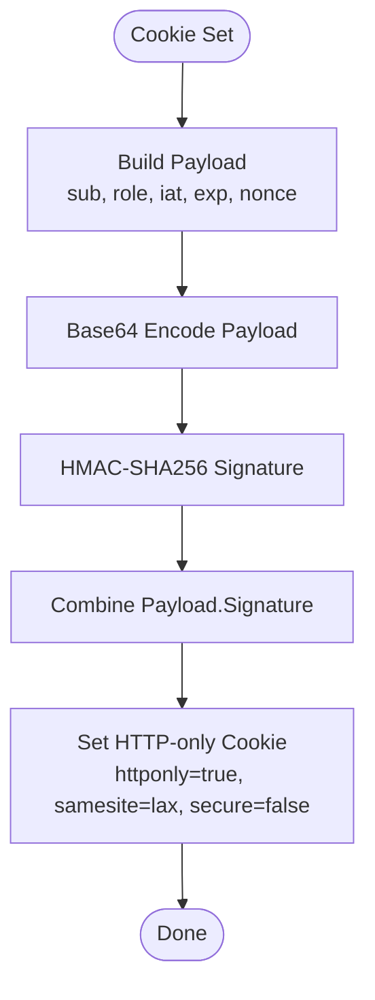
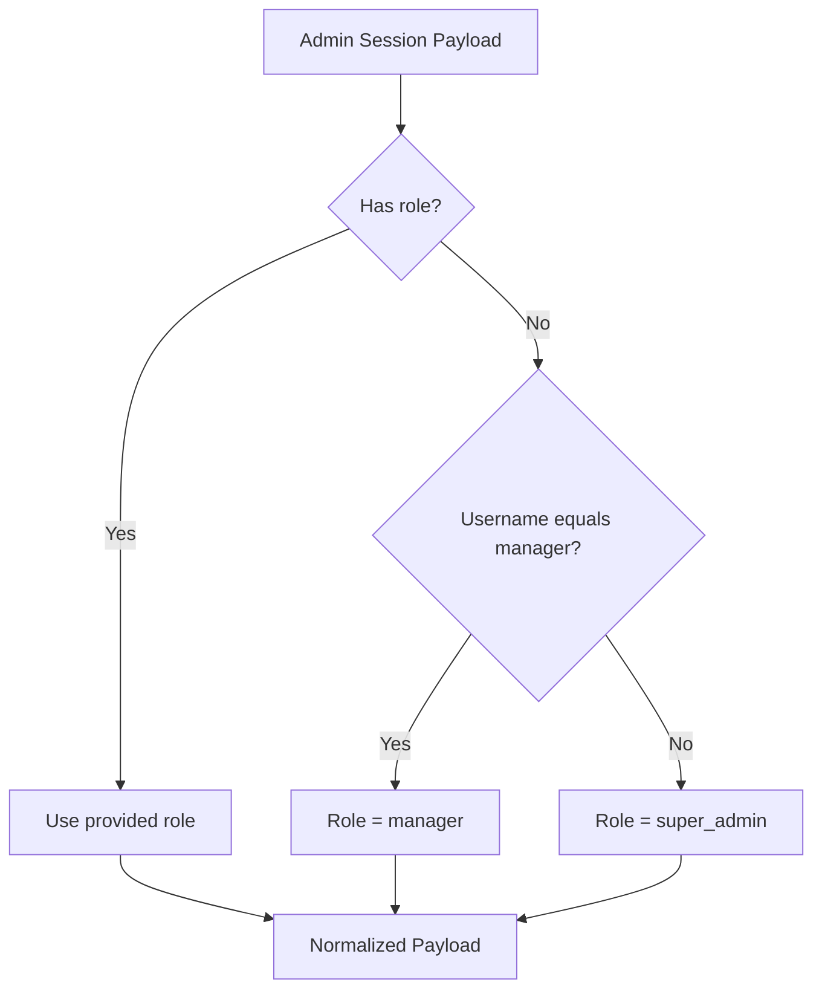
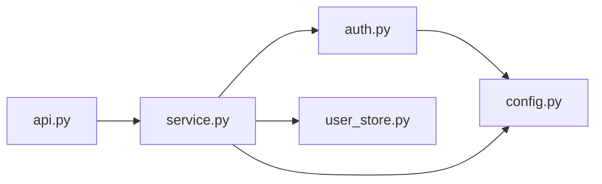

# Authentication Endpoints

<cite>
**Referenced Files in This Document**
- [api.py](file://src/sage_faculty_twin/api.py)
- [auth.py](file://src/sage_faculty_twin/auth.py)
- [service.py](file://src/sage_faculty_twin/service.py)
- [models.py](file://src/sage_faculty_twin/models.py)
- [config.py](file://src/sage_faculty_twin/config.py)
- [user_store.py](file://src/sage_faculty_twin/user_store.py)
- [test_admin_auth.py](file://tests/test_admin_auth.py)
</cite>

## Table of Contents
1. [Introduction](#introduction)
2. [Project Structure](#project-structure)
3. [Core Components](#core-components)
4. [Architecture Overview](#architecture-overview)
5. [Detailed Component Analysis](#detailed-component-analysis)
6. [Dependency Analysis](#dependency-analysis)
7. [Performance Considerations](#performance-considerations)
8. [Troubleshooting Guide](#troubleshooting-guide)
9. [Conclusion](#conclusion)

## Introduction
This document provides comprehensive API documentation for authentication endpoints focused on administrative and user authentication flows. It covers the following endpoints:
- POST /auth/admin/login
- POST /auth/admin/logout
- POST /auth/user/register
- POST /auth/user/login
- POST /auth/user/logout

It also documents session management, cookie handling, role-based access control, and security considerations. The models documented include AdminLoginRequest, UserRegisterRequest, UserLoginRequest, AdminSessionResponse, and UserSessionResponse. Examples of successful authentication flows, session persistence, and logout procedures are included, along with CORS configuration and cookie security settings.

## Project Structure
Authentication endpoints are implemented within the FastAPI application and orchestrated by the service layer. The primary files involved are:
- API routing and endpoint definitions
- Session token encoding/decoding and cookie management
- Service methods for login/register/logout and session validation
- Pydantic models for request/response schemas
- Configuration for session secrets and TTLs
- User storage for registration and authentication

**Diagram sources**
- [api.py:479-510](file://src/sage_faculty_twin/api.py#L479-L510)
- [service.py:2695-2745](file://src/sage_faculty_twin/service.py#L2695-L2745)
- [auth.py:57-87](file://src/sage_faculty_twin/auth.py#L57-L87)
- [config.py:121-128](file://src/sage_faculty_twin/config.py#L121-L128)
- [user_store.py:70-121](file://src/sage_faculty_twin/user_store.py#L70-L121)

**Section sources**
- [api.py:479-510](file://src/sage_faculty_twin/api.py#L479-L510)
- [service.py:2695-2745](file://src/sage_faculty_twin/service.py#L2695-L2745)
- [auth.py:57-87](file://src/sage_faculty_twin/auth.py#L57-L87)
- [config.py:121-128](file://src/sage_faculty_twin/config.py#L121-L128)
- [user_store.py:70-121](file://src/sage_faculty_twin/user_store.py#L70-L121)

## Core Components
- Admin authentication:
  - Credentials validated against configured admin accounts.
  - Session token built and stored in an HTTP-only cookie.
  - Role resolution supports super_admin and manager roles.
- User authentication:
  - Registration validates input and stores credentials securely.
  - Login authenticates credentials and issues a session token.
  - Session token stored in an HTTP-only cookie.
- Session management:
  - Tokens encoded with HMAC signatures and expiration checks.
  - Cookies configured with httponly and samesite lax.
- Role-based access control:
  - Admin endpoints require normalized admin session payload.
  - Manager role can access additional resources compared to super_admin.

**Section sources**
- [auth.py:158-179](file://src/sage_faculty_twin/auth.py#L158-L179)
- [auth.py:132-155](file://src/sage_faculty_twin/auth.py#L132-L155)
- [service.py:2695-2745](file://src/sage_faculty_twin/service.py#L2695-L2745)
- [user_store.py:70-121](file://src/sage_faculty_twin/user_store.py#L70-L121)

## Architecture Overview
The authentication flow integrates FastAPI endpoints, service-layer workflows, and cookie/token utilities. Requests are validated by Pydantic models, processed by service methods, and responses include signed session tokens stored as cookies.

**Diagram sources**
- [api.py:479-503](file://src/sage_faculty_twin/api.py#L479-L503)
- [service.py:2695-2745](file://src/sage_faculty_twin/service.py#L2695-L2745)
- [auth.py:24-54](file://src/sage_faculty_twin/auth.py#L24-L54)
- [config.py:125-128](file://src/sage_faculty_twin/config.py#L125-L128)
- [user_store.py:70-106](file://src/sage_faculty_twin/user_store.py#L70-L106)

## Detailed Component Analysis

### Endpoint: POST /auth/admin/login
- Purpose: Authenticate administrators and establish an admin session.
- Request body: AdminLoginRequest
  - username: string (min length 1, max 128)
  - password: string (min length 1, max 256)
- Response body: AdminSessionResponse
  - is_admin: boolean
  - mode: "admin"
  - username: string or null
  - role: "super_admin" | "manager" or null
- Behavior:
  - Validates credentials against configured admin accounts.
  - Builds an admin session token with exp and nonce.
  - Sets an HTTP-only cookie named "faculty_twin_admin".
  - Returns AdminSessionResponse indicating admin session established.

**Diagram sources**
- [api.py:479-484](file://src/sage_faculty_twin/api.py#L479-L484)
- [service.py:2695-2710](file://src/sage_faculty_twin/service.py#L2695-L2710)
- [auth.py:158-179](file://src/sage_faculty_twin/auth.py#L158-L179)
- [auth.py:24-38](file://src/sage_faculty_twin/auth.py#L24-L38)
- [config.py:125-126](file://src/sage_faculty_twin/config.py#L125-L126)

**Section sources**
- [api.py:479-484](file://src/sage_faculty_twin/api.py#L479-L484)
- [service.py:2695-2710](file://src/sage_faculty_twin/service.py#L2695-L2710)
- [auth.py:158-179](file://src/sage_faculty_twin/auth.py#L158-L179)
- [auth.py:24-38](file://src/sage_faculty_twin/auth.py#L24-L38)
- [models.py:728-731](file://src/sage_faculty_twin/models.py#L728-L731)
- [models.py:763-768](file://src/sage_faculty_twin/models.py#L763-L768)

### Endpoint: POST /auth/admin/logout
- Purpose: Clear admin session and return to guest mode.
- Request body: none
- Response body: AdminSessionResponse
  - is_admin: false
  - mode: "user"
- Behavior:
  - Deletes the admin session cookie.
  - Returns AdminSessionResponse indicating session cleared.

**Diagram sources**
- [api.py:486-489](file://src/sage_faculty_twin/api.py#L486-L489)
- [auth.py:69-70](file://src/sage_faculty_twin/auth.py#L69-L70)
- [models.py:763-768](file://src/sage_faculty_twin/models.py#L763-L768)

**Section sources**
- [api.py:486-489](file://src/sage_faculty_twin/api.py#L486-L489)
- [auth.py:69-70](file://src/sage_faculty_twin/auth.py#L69-L70)
- [models.py:763-768](file://src/sage_faculty_twin/models.py#L763-L768)

### Endpoint: POST /auth/user/register
- Purpose: Register a new user account and establish a user session.
- Request body: UserRegisterRequest
  - name: string (min length 1, max 128)
  - email: string (min length 3, max 256)
  - visitor_profile: "hust_undergraduate" | "paper_writing_student" | "lab_member" | "general_visitor"
  - password: string (min length 8, max 256)
- Response body: UserSessionResponse
  - is_authenticated: true
  - mode: "user"
  - account: UserAccountResponse (user_id, name, email, visitor_profile, created_at)
- Behavior:
  - Validates inputs and ensures email uniqueness.
  - Hashes password with salt and persists user record.
  - Builds a user session token with exp and nonce.
  - Sets an HTTP-only cookie named "faculty_twin_user".
  - Returns UserSessionResponse indicating authenticated session established.

**Diagram sources**
- [api.py:492-496](file://src/sage_faculty_twin/api.py#L492-L496)
- [service.py:2719-2732](file://src/sage_faculty_twin/service.py#L2719-L2732)
- [user_store.py:70-106](file://src/sage_faculty_twin/user_store.py#L70-L106)
- [auth.py:45-54](file://src/sage_faculty_twin/auth.py#L45-L54)
- [config.py:127-128](file://src/sage_faculty_twin/config.py#L127-L128)

**Section sources**
- [api.py:492-496](file://src/sage_faculty_twin/api.py#L492-L496)
- [service.py:2719-2732](file://src/sage_faculty_twin/service.py#L2719-L2732)
- [user_store.py:70-106](file://src/sage_faculty_twin/user_store.py#L70-L106)
- [auth.py:45-54](file://src/sage_faculty_twin/auth.py#L45-L54)
- [models.py:733-744](file://src/sage_faculty_twin/models.py#L733-L744)
- [models.py:747-761](file://src/sage_faculty_twin/models.py#L747-L761)
- [models.py:757-761](file://src/sage_faculty_twin/models.py#L757-L761)

### Endpoint: POST /auth/user/login
- Purpose: Authenticate an existing user and establish a user session.
- Request body: UserLoginRequest
  - email: string (min length 3, max 256)
  - password: string (min length 1, max 256)
- Response body: UserSessionResponse
  - is_authenticated: true
  - mode: "user"
  - account: UserAccountResponse
- Behavior:
  - Authenticates user credentials against stored records.
  - Builds a user session token with exp and nonce.
  - Sets an HTTP-only cookie named "faculty_twin_user".
  - Returns UserSessionResponse indicating authenticated session established.

**Diagram sources**
- [api.py:499-503](file://src/sage_faculty_twin/api.py#L499-L503)
- [service.py:2734-2742](file://src/sage_faculty_twin/service.py#L2734-L2742)
- [user_store.py:108-121](file://src/sage_faculty_twin/user_store.py#L108-L121)
- [auth.py:45-54](file://src/sage_faculty_twin/auth.py#L45-L54)
- [config.py:127-128](file://src/sage_faculty_twin/config.py#L127-L128)

**Section sources**
- [api.py:499-503](file://src/sage_faculty_twin/api.py#L499-L503)
- [service.py:2734-2742](file://src/sage_faculty_twin/service.py#L2734-L2742)
- [user_store.py:108-121](file://src/sage_faculty_twin/user_store.py#L108-L121)
- [auth.py:45-54](file://src/sage_faculty_twin/auth.py#L45-L54)
- [models.py:742-744](file://src/sage_faculty_twin/models.py#L742-L744)
- [models.py:757-761](file://src/sage_faculty_twin/models.py#L757-L761)

### Endpoint: POST /auth/user/logout
- Purpose: Clear user session and return to guest mode.
- Request body: none
- Response body: UserSessionResponse
  - is_authenticated: false
  - mode: "guest"
- Behavior:
  - Deletes the user session cookie.
  - Returns UserSessionResponse indicating session cleared.

**Diagram sources**
- [api.py:506-509](file://src/sage_faculty_twin/api.py#L506-L509)
- [auth.py:85-86](file://src/sage_faculty_twin/auth.py#L85-L86)
- [models.py:757-761](file://src/sage_faculty_twin/models.py#L757-L761)

**Section sources**
- [api.py:506-509](file://src/sage_faculty_twin/api.py#L506-L509)
- [auth.py:85-86](file://src/sage_faculty_twin/auth.py#L85-L86)
- [models.py:757-761](file://src/sage_faculty_twin/models.py#L757-L761)

### Session Management and Cookie Handling
- Admin cookie:
  - Name: "faculty_twin_admin"
  - Attributes: httponly=true, samesite="lax", secure=false, path="/", max_age from settings
- User cookie:
  - Name: "faculty_twin_user"
  - Attributes: httponly=true, samesite="lax", secure=false, path="/", max_age from settings
- Token format:
  - Base64-encoded JSON payload concatenated with HMAC-SHA256 signature.
  - Payload includes sub, role, iat, exp, nonce.
  - Expiration checked server-side; expired tokens are rejected.
- Secret management:
  - Admin session secret and TTL configured separately from user session secret and TTL.

**Diagram sources**
- [auth.py:182-190](file://src/sage_faculty_twin/auth.py#L182-L190)
- [auth.py:57-66](file://src/sage_faculty_twin/auth.py#L57-L66)
- [auth.py:73-82](file://src/sage_faculty_twin/auth.py#L73-L82)
- [config.py:125-128](file://src/sage_faculty_twin/config.py#L125-L128)

**Section sources**
- [auth.py:57-87](file://src/sage_faculty_twin/auth.py#L57-L87)
- [auth.py:182-214](file://src/sage_faculty_twin/auth.py#L182-L214)
- [config.py:125-128](file://src/sage_faculty_twin/config.py#L125-L128)

### Role-Based Access Control
- Admin identity resolution:
  - If role is "super_admin" or "manager", preserved.
  - If username equals manager username, role becomes "manager".
  - Otherwise, role becomes "super_admin".
- Admin session requirement:
  - Certain endpoints depend on require_admin, which validates the session payload and raises 403 if missing or invalid.

**Diagram sources**
- [auth.py:132-155](file://src/sage_faculty_twin/auth.py#L132-L155)
- [auth.py:119-129](file://src/sage_faculty_twin/auth.py#L119-L129)

**Section sources**
- [auth.py:132-155](file://src/sage_faculty_twin/auth.py#L132-L155)
- [auth.py:119-129](file://src/sage_faculty_twin/auth.py#L119-L129)

### Security Considerations
- Password hashing:
  - Users are stored with salted scrypt hashes.
- Credential validation:
  - Uses constant-time comparison for username and password checks.
- Token integrity:
  - HMAC-SHA256 signature prevents tampering.
  - Expiration enforced server-side.
- Cookie attributes:
  - httponly=true reduces XSS risk.
  - samesite="lax" mitigates CSRF for same-origin requests.
  - secure=false indicates non-TLS transport; in production, consider secure=true behind TLS termination.
- Secrets and TTLs:
  - Admin and user session secrets and TTLs are configurable.

**Section sources**
- [user_store.py:148-156](file://src/sage_faculty_twin/user_store.py#L148-L156)
- [auth.py:164-172](file://src/sage_faculty_twin/auth.py#L164-L172)
- [auth.py:182-214](file://src/sage_faculty_twin/auth.py#L182-L214)
- [auth.py:57-87](file://src/sage_faculty_twin/auth.py#L57-L87)
- [config.py:125-128](file://src/sage_faculty_twin/config.py#L125-L128)

### CORS Configuration
- Middleware:
  - CORSMiddleware configured with allow_origin_regex for localhost/127.0.0.1.
  - allow_credentials, allow_methods, allow_headers enabled.
- Implication:
  - Allows local development from http://localhost:* and http://127.0.0.1:* with credentials.

**Section sources**
- [api.py:79-91](file://src/sage_faculty_twin/api.py#L79-L91)

### Successful Authentication Flows and Examples
- Admin login flow:
  - Client posts AdminLoginRequest to /auth/admin/login.
  - Server responds with AdminSessionResponse and sets admin cookie.
  - Subsequent requests can access admin-protected endpoints.
- User registration flow:
  - Client posts UserRegisterRequest to /auth/user/register.
  - Server responds with UserSessionResponse and sets user cookie.
- User login flow:
  - Client posts UserLoginRequest to /auth/user/login.
  - Server responds with UserSessionResponse and sets user cookie.
- Logout flows:
  - Client posts to /auth/admin/logout or /auth/user/logout.
  - Server clears the respective cookie and returns a session response indicating logged out.

**Section sources**
- [api.py:479-510](file://src/sage_faculty_twin/api.py#L479-L510)
- [test_admin_auth.py:266-279](file://tests/test_admin_auth.py#L266-L279)
- [test_admin_auth.py:451-459](file://tests/test_admin_auth.py#L451-L459)

## Dependency Analysis
Authentication depends on:
- FastAPI endpoints for request routing and response serialization.
- Service layer for business logic and persistence.
- Auth utilities for token encoding/decoding and cookie management.
- Configuration for secrets and TTLs.
- User store for registration and authentication.

**Diagram sources**
- [api.py:22-29](file://src/sage_faculty_twin/api.py#L22-L29)
- [service.py:29-37](file://src/sage_faculty_twin/service.py#L29-L37)
- [auth.py:13-14](file://src/sage_faculty_twin/auth.py#L13-L14)
- [config.py:9-15](file://src/sage_faculty_twin/config.py#L9-L15)
- [user_store.py:62-68](file://src/sage_faculty_twin/user_store.py#L62-L68)

**Section sources**
- [api.py:22-29](file://src/sage_faculty_twin/api.py#L22-L29)
- [service.py:29-37](file://src/sage_faculty_twin/service.py#L29-L37)
- [auth.py:13-14](file://src/sage_faculty_twin/auth.py#L13-L14)
- [config.py:9-15](file://src/sage_faculty_twin/config.py#L9-L15)
- [user_store.py:62-68](file://src/sage_faculty_twin/user_store.py#L62-L68)

## Performance Considerations
- Token creation and verification are lightweight operations using HMAC and JSON encoding.
- Cookie-based session avoids frequent server-side session storage for admin and user sessions.
- Expiration enforcement prevents long-lived tokens from remaining valid indefinitely.

## Troubleshooting Guide
Common issues and resolutions:
- 401 Unauthorized during admin login:
  - Verify username and password match configured admin credentials.
  - Ensure admin credentials are not empty and correctly set in environment.
- 401 Unauthorized during user login/registration:
  - Confirm email uniqueness and valid format.
  - Ensure password meets minimum length requirements.
- 403 Forbidden on admin-protected endpoints:
  - Ensure admin cookie is present and not expired.
  - Verify session payload normalization and role resolution.
- Cookie not persisting:
  - Check httponly and samesite settings; ensure same-site requests.
  - Confirm secure setting aligns with deployment TLS configuration.

**Section sources**
- [auth.py:158-172](file://src/sage_faculty_twin/auth.py#L158-L172)
- [user_store.py:78-121](file://src/sage_faculty_twin/user_store.py#L78-L121)
- [auth.py:119-129](file://src/sage_faculty_twin/auth.py#L119-L129)
- [auth.py:57-87](file://src/sage_faculty_twin/auth.py#L57-L87)

## Conclusion
The authentication system provides robust admin and user authentication flows with secure session management via signed cookies. Admin and user sessions are handled separately with distinct secrets and TTLs. Role-based access control is enforced for admin endpoints, and the system includes strong password hashing and constant-time credential comparisons. CORS is configured for local development, and cookie attributes mitigate common web vulnerabilities.