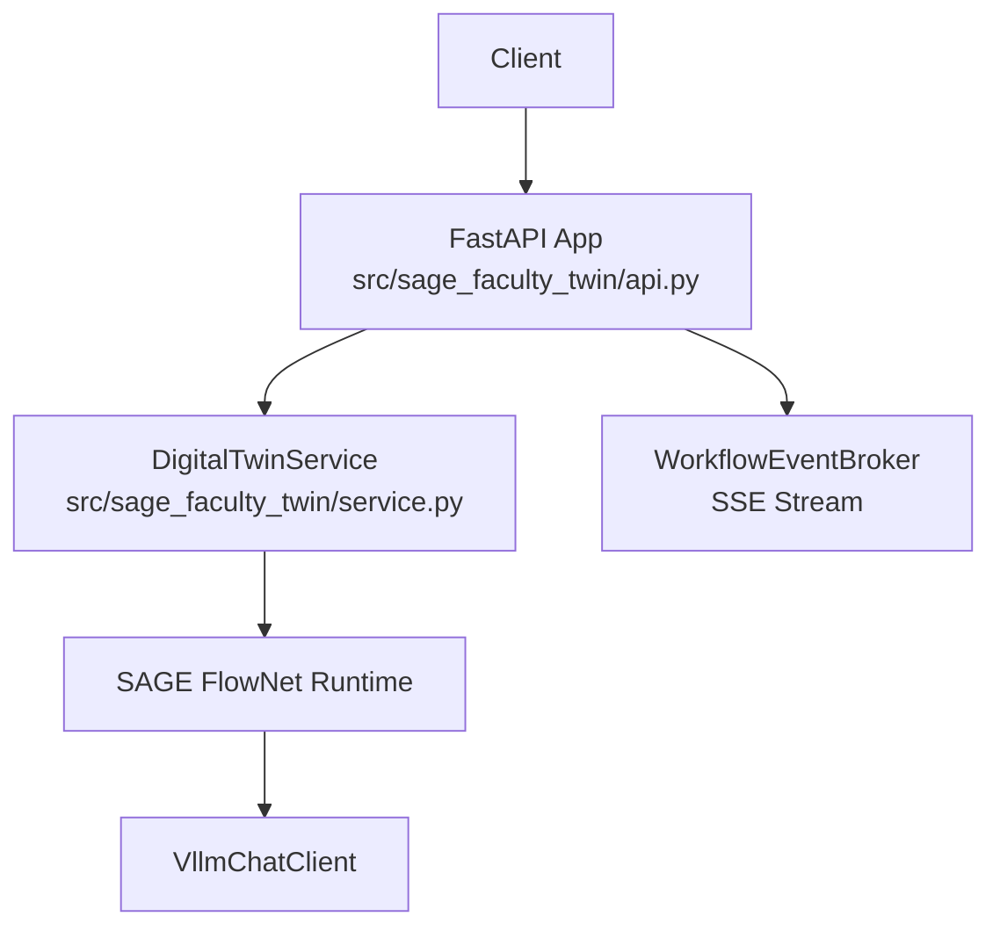
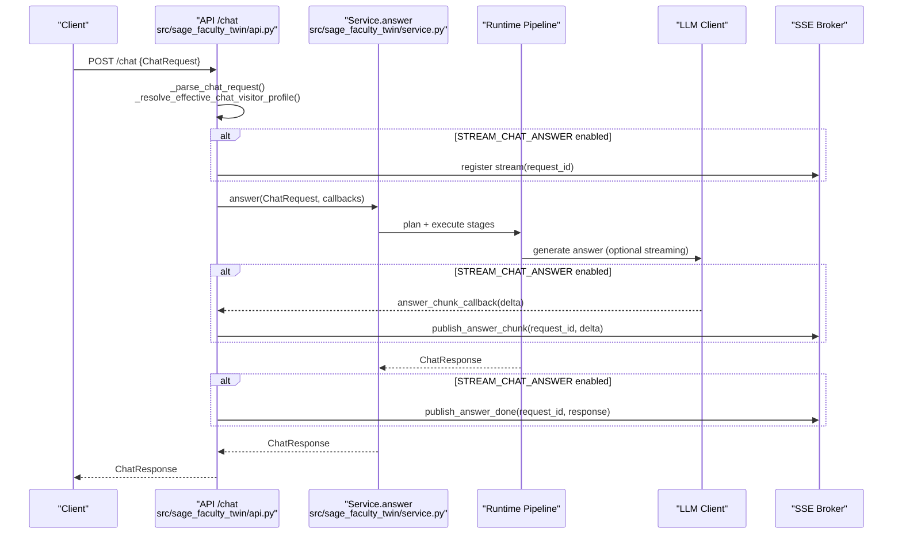
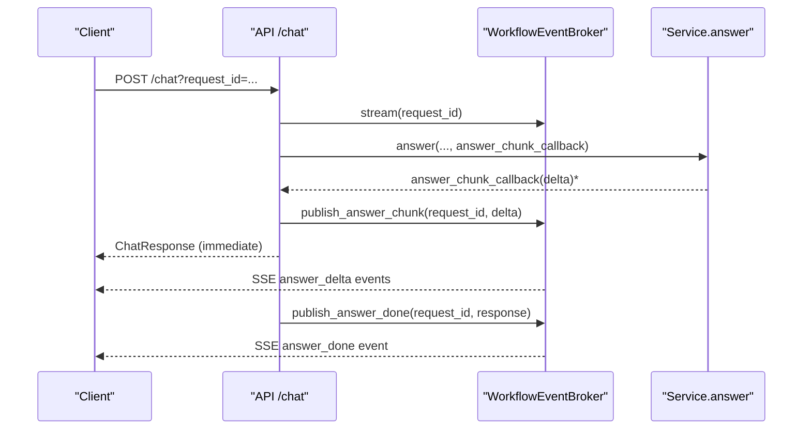
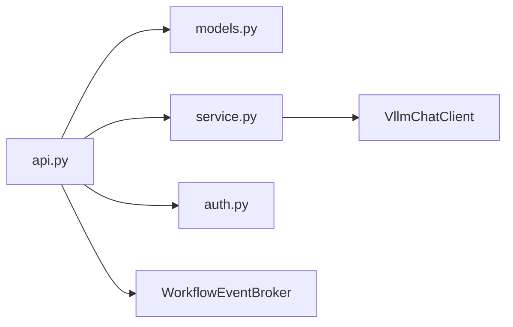

# Chat Endpoints

<cite>
**Referenced Files in This Document**
- [api.py](file://src/sage_faculty_twin/api.py)
- [models.py](file://src/sage_faculty_twin/models.py)
- [service.py](file://src/sage_faculty_twin/service.py)
- [auth.py](file://src/sage_faculty_twin/auth.py)
- [config.py](file://src/sage_faculty_twin/config.py)
- [test_chat_streaming.py](file://tests/test_chat_streaming.py)
- [test_chat_post_answer_background.py](file://tests/test_chat_post_answer_background.py)
- [README.md](file://README.md)
</cite>

## Update Summary
**Changes Made**
- Added authentication requirement section for context compression functionality
- Updated context compression endpoint documentation to reflect mandatory user authentication
- Enhanced security considerations for manual context compression operations
- Added practical curl examples demonstrating authentication requirements

## Table of Contents
1. [Introduction](#introduction)
2. [Project Structure](#project-structure)
3. [Core Components](#core-components)
4. [Architecture Overview](#architecture-overview)
5. [Detailed Component Analysis](#detailed-component-analysis)
6. [Dependency Analysis](#dependency-analysis)
7. [Performance Considerations](#performance-considerations)
8. [Security and Authentication](#security-and-authentication)
9. [Troubleshooting Guide](#troubleshooting-guide)
10. [Conclusion](#conclusion)
11. [Appendices](#appendices)

## Introduction
This document provides comprehensive API documentation for chat-related endpoints, focusing on:
- The primary POST /chat endpoint for conversational AI with optional streaming via Server-Sent Events
- Attachment handling for PDFs and text-based files
- Visitor profile adaptation based on authentication state
- Deep thinking mode controls and web search toggles
- **Enhanced authentication requirements for context compression functionality**
- Authentication requirements, rate-limiting considerations, and error handling
- Practical curl examples for common scenarios

## Project Structure
The chat functionality is implemented in the FastAPI application with clear separation of concerns:
- API layer: request parsing, validation, streaming, and response shaping
- Service layer: orchestrates the chat workflow using a deterministic planner and runtime pipeline
- Models: strongly typed request/response schemas and auxiliary data structures
- Auth: session-based cookie handling for admin and user contexts
- Config: environment-driven behavior such as timeouts, streaming flags, and limits



**Diagram sources**
- [api.py:597-700](file://src/sage_faculty_twin/api.py#L597-L700)
- [service.py:5338-5504](file://src/sage_faculty_twin/service.py#L5338-L5504)

**Section sources**
- [api.py:90-168](file://src/sage_faculty_twin/api.py#L90-L168)
- [service.py:5283-5310](file://src/sage_faculty_twin/service.py#L5283-L5310)

## Core Components
- ChatRequest: request schema validated by the API layer and consumed by the service
- ChatResponse: canonical response schema produced by the service
- WorkflowEventBroker: SSE publisher for streaming workflow events and answer deltas
- DigitalTwinService.answer: orchestrates the chat pipeline and optionally streams deltas
- **Context Compression Service**: manual conversation context compression with authentication requirements

Key behaviors:
- Streaming: controlled by DIGITAL_TWIN_STREAM_CHAT_ANSWER; when enabled, answer deltas are emitted as SSE events
- Visitor profile: resolved from authenticated user session when present, otherwise from request
- Attachments: parsed from multipart/form-data or JSON; supports PDF and text-like files with size/text limits
- Timeouts: global chat request timeout enforced at the API boundary
- **Context compression**: requires user authentication before allowing manual compression operations

**Section sources**
- [models.py:16-31](file://src/sage_faculty_twin/models.py#L16-L31)
- [models.py:199-221](file://src/sage_faculty_twin/models.py#L199-L221)
- [api.py:170-256](file://src/sage_faculty_twin/api.py#L170-L256)
- [api.py:618-700](file://src/sage_faculty_twin/api.py#L618-L700)
- [service.py:5338-5504](file://src/sage_faculty_twin/service.py#L5338-L5504)
- [service.py:1734-1786](file://src/sage_faculty_twin/service.py#L1734-L1786)

## Architecture Overview
The /chat endpoint integrates request parsing, validation, optional streaming, and the chat workflow execution.



**Diagram sources**
- [api.py:370-406](file://src/sage_faculty_twin/api.py#L370-L406)
- [api.py:618-700](file://src/sage_faculty_twin/api.py#L618-L700)
- [service.py:5338-5504](file://src/sage_faculty_twin/service.py#L5338-L5504)

## Detailed Component Analysis

### Endpoint: POST /chat
- Method: POST
- Path: /chat
- Content Types:
  - application/json (raw JSON payload)
  - multipart/form-data (form fields + files)
- Query Parameters:
  - request_id: optional string; when provided enables streaming via /chat/workflow-events
- Authentication:
  - Optional admin session cookie (faculty_twin_admin) influences behavior in the service
  - User session cookie (faculty_twin_user) affects visitor profile resolution
- Rate Limiting:
  - Not implemented at the API level; consider upstream rate limits or external middleware
- Timeout:
  - Enforced by CHAT_REQUEST_TIMEOUT_SECONDS (environment variable)
- Response:
  - ChatResponse model

Request body (ChatRequest):
- student_name: string (required)
- student_email: string | null
- question: string (required)
- course_context: string | null
- visitor_profile: string | null (enum: hust_undergraduate | paper_writing_student | lab_member | general_visitor)
- conversation_id: string | null
- attachments: array of ChatAttachment (max 4)
- deep_thinking: boolean (default true)
- deep_thinking_explicit: boolean (default false)
- web_search: boolean (default false)

Response body (ChatResponse):
- answer: string
- owner_name: string
- used_model: string
- exchange_id: string | null
- knowledge_hits: array of WebSearchHit
- web_search_hits: array of WebSearchHit
- answer_basis: array of AnswerBasisItem
- follow_up_actions: array of FollowUpAction
- conversation_id: string | null
- workflow_action: string
- decision_mode: string
- pending_fields: array of string
- booking_result: BookingResponse | null
- escalation_record: EscalationRecord | null
- planner_preview: WorkflowPlanPreview | null
- shadow_planner_preview: WorkflowPlanPreview | null
- planner_comparison: WorkflowPlanComparison | null
- workflow_trace: array of WorkflowTraceStep
- memory_used: boolean
- memory_write_back: boolean
- retrieved_items: array of MemoryAuditItem

Behavioral notes:
- Visitor profile is adapted from authenticated user session when available
- When request_id is provided, the API streams workflow events and answer deltas via SSE
- Streaming requires DIGITAL_TWIN_STREAM_CHAT_ANSWER=true

**Section sources**
- [api.py:618-700](file://src/sage_faculty_twin/api.py#L618-L700)
- [api.py:370-406](file://src/sage_faculty_twin/api.py#L370-L406)
- [api.py:408-416](file://src/sage_faculty_twin/api.py#L408-L416)
- [models.py:16-31](file://src/sage_faculty_twin/models.py#L16-L31)
- [models.py:199-221](file://src/sage_faculty_twin/models.py#L199-L221)

### Endpoint: POST /context/compress
- Method: POST
- Path: /context/compress
- Content Type: application/json
- Authentication: **Required** - User session cookie (faculty_twin_user) must be present and valid
- Purpose: Manually trigger context compression for a conversation
- Request Body: JSON object containing conversation_id
- Response: JSON object with compression results

Authentication Requirements:
- **Mandatory user authentication**: The endpoint explicitly checks for a valid user session
- **401 Unauthorized**: Returned when user is not authenticated
- **422 Unprocessable Entity**: Returned when conversation_id is missing or invalid

Response Body Structure:
- ok: boolean indicating success status
- turns_compressed: number of conversation turns processed
- total_turns: total turns in the updated digest
- digest_chars: length of the resulting digest text
- error: error message (when ok is false)

Behavioral Notes:
- Bypasses automatic threshold checking and immediately compresses all unsummarized turns
- Supports up to 32 turns per compression operation
- Requires context compression to be enabled in settings

**Updated** Enhanced authentication requirements for manual context compression functionality

**Section sources**
- [api.py:734-750](file://src/sage_faculty_twin/api.py#L734-L750)
- [service.py:1734-1786](file://src/sage_faculty_twin/service.py#L1734-L1786)

### Endpoint: GET /chat/workflow-events
- Method: GET
- Path: /chat/workflow-events
- Query Parameters:
  - request_id: string (required, length bounds enforced)
- Response:
  - Server-Sent Events stream with typed events:
    - trace-step
    - answer_delta
    - answer_done
    - error
    - complete
    - keepalive (typed heartbeat)
- Headers:
  - Connection: keep-alive
  - X-Accel-Buffering: no
  - Cache-Control: no-store

Purpose:
- Provides real-time visibility into the chat workflow and streaming answer chunks

**Section sources**
- [api.py:597-609](file://src/sage_faculty_twin/api.py#L597-L609)
- [api.py:170-256](file://src/sage_faculty_twin/api.py#L170-L256)

### Attachment Handling
Supported file types and constraints:
- Supported suffixes: .pdf, .txt, .md, .csv, .json, .py, .yaml, .yml, .log
- Supported media types: application/json, application/pdf, application/x-yaml, text/csv, text/markdown, text/plain, text/x-python
- Limits:
  - Maximum number of attachments: 4
  - Maximum size per attachment: 5 MB
  - Maximum text content length: 12,000 characters (truncated if exceeded)
- Parsing:
  - multipart/form-data: files collected from form key "files"
  - JSON: attachments embedded in ChatRequest.attachments

Validation and extraction:
- PDF: parsed via pypdf; requires extractable text
- Text: must be UTF-8 decodable; empty content raises error
- Unsupported types: rejected with 400

**Section sources**
- [api.py:148-167](file://src/sage_faculty_twin/api.py#L148-L167)
- [api.py:119-129](file://src/sage_faculty_twin/api.py#L119-L129)
- [api.py:270-326](file://src/sage_faculty_twin/api.py#L270-L326)
- [api.py:328-367](file://src/sage_faculty_twin/api.py#L328-L367)

### Visitor Profile Adaptation
- If a user session exists (faculty_twin_user cookie), visitor_profile is overridden by the authenticated user's profile
- Otherwise, the visitor_profile from the request is used
- This ensures personalized responses for logged-in users

**Section sources**
- [api.py:408-416](file://src/sage_faculty_twin/api.py#L408-L416)
- [auth.py:16-17](file://src/sage_faculty_twin/auth.py#L16-L17)

### Deep Thinking Mode and Web Search
- deep_thinking: boolean (default true); toggles reasoning depth
- deep_thinking_explicit: boolean (default false); explicit override for reasoning
- web_search: boolean (default false); triggers external web search when true

These fields are part of ChatRequest and influence the workflow planning and execution.

**Section sources**
- [models.py:28-30](file://src/sage_faculty_twin/models.py#L28-L30)
- [api.py:383-389](file://src/sage_faculty_twin/api.py#L383-L389)

### Streaming Support (Server-Sent Events)
- Feature flag: DIGITAL_TWIN_STREAM_CHAT_ANSWER
- When enabled:
  - API registers an SSE stream keyed by request_id
  - LLM client streams token chunks to answer_chunk_callback
  - Broker publishes answer_delta events; final answer_done includes the rendered ChatResponse
  - Keepalive events prevent proxy timeouts
- When disabled:
  - Standard JSON response returned synchronously



**Diagram sources**
- [api.py:618-700](file://src/sage_faculty_twin/api.py#L618-L700)
- [api.py:170-256](file://src/sage_faculty_twin/api.py#L170-L256)
- [test_chat_streaming.py:48-99](file://tests/test_chat_streaming.py#L48-L99)

**Section sources**
- [api.py:136-147](file://src/sage_faculty_twin/api.py#L136-L147)
- [api.py:659-699](file://src/sage_faculty_twin/api.py#L659-L699)
- [test_chat_streaming.py:175-201](file://tests/test_chat_streaming.py#L175-L201)

### Background Post-Answer Execution
- When background mode is enabled and a trace callback is present, the API returns the ChatResponse immediately after response_render and continues post-answer stages in the background
- The trace callback ensures SSE consumers still receive post-answer steps before the stream closes

**Section sources**
- [service.py:5459-5504](file://src/sage_faculty_twin/service.py#L5459-L5504)
- [test_chat_post_answer_background.py:69-165](file://tests/test_chat_post_answer_background.py#L69-L165)

## Dependency Analysis
- API depends on:
  - models.ChatRequest/ChatResponse for validation and serialization
  - service.DigitalTwinService for orchestration
  - auth cookies for session resolution
  - WorkflowEventBroker for SSE streaming
- Service depends on:
  - VllmChatClient for LLM interactions
  - Knowledge store, conversation memory, and other subsystems for retrieval and persistence
  - Workflow planner and runtime for deterministic DAG execution



**Diagram sources**
- [api.py:31-76](file://src/sage_faculty_twin/api.py#L31-L76)
- [service.py:5283-5310](file://src/sage_faculty_twin/service.py#L5283-L5310)

**Section sources**
- [api.py:31-76](file://src/sage_faculty_twin/api.py#L31-L76)
- [service.py:5283-5310](file://src/sage_faculty_twin/service.py#L5283-L5310)

## Performance Considerations
- Streaming latency optimizations:
  - Keepalive cadence via CHAT_SSE_KEEPALIVE_SECONDS prevents proxy timeouts
  - Token-level streaming reduces perceived latency when DIGITAL_TWIN_STREAM_CHAT_ANSWER is enabled
- Request timeout:
  - CHAT_REQUEST_TIMEOUT_SECONDS bounds total request time; exceeding it yields 504
- Background post-answer execution:
  - Reduces critical-path latency by deferring memory persistence, profiling, follow-up planning, and usefulness scoring to background tasks
- **Context compression performance**:
  - Manual compression bypasses automatic thresholds for immediate processing
  - Compression operations are optimized to process up to 32 turns per call

**Section sources**
- [api.py:136-147](file://src/sage_faculty_twin/api.py#L136-L147)
- [api.py:127-129](file://src/sage_faculty_twin/api.py#L127-L129)
- [service.py:5459-5504](file://src/sage_faculty_twin/service.py#L5459-L5504)
- [service.py:1734-1786](file://src/sage_faculty_twin/service.py#L1734-L1786)

## Security and Authentication

### User Session Management
The system implements robust session-based authentication for enhanced security:

- **User Session Cookies**:
  - Cookie name: faculty_twin_user
  - Payload includes user_id and email
  - TTL: 2592000 seconds (30 days)
  - Secure cookie configuration with httponly and samesite protection

- **Admin Session Management**:
  - Cookie name: faculty_twin_admin
  - Separate authentication flow for administrative functions
  - Different TTL and security policies

### Context Compression Authentication Requirements
**Enhanced Security Measures**:
- **Mandatory Authentication**: The /context/compress endpoint requires valid user authentication
- **Explicit 401 Response**: Returns unauthorized status when user session is missing or invalid
- **Session Validation**: Validates both presence and integrity of user session tokens
- **Error Handling**: Clear error messages for authentication failures

Authentication Flow:
1. Client sends request with user session cookie
2. API validates session token integrity
3. If valid: proceeds with compression operation
4. If invalid: returns 401 Unauthorized with localized error message

**Section sources**
- [auth.py:16-17](file://src/sage_faculty_twin/auth.py#L16-L17)
- [auth.py:41-54](file://src/sage_faculty_twin/auth.py#L41-L54)
- [api.py:734-750](file://src/sage_faculty_twin/api.py#L734-L750)

## Troubleshooting Guide
Common issues and resolutions:
- 400 Bad Request
  - Invalid JSON payload or missing required fields
  - Unsupported or empty attachment
  - Attachment exceeds size or text-length limits
- 400 Bad Request (PDF-specific)
  - Missing pypdf dependency or unreadable PDF
- 400 Bad Request (Text attachment)
  - Non-UTF-8 encoding or empty content
- 400 Bad Request (Attachments count)
  - Too many attachments (>4)
- 401 Unauthorized (Context Compression)
  - **User authentication required**: Include valid faculty_twin_user cookie
  - Session token expired or malformed
- 422 Unprocessable Entity
  - Validation errors on ChatRequest fields
  - **Missing conversation_id**: Provide valid conversation identifier
- 504 Gateway Timeout
  - Exceeded CHAT_REQUEST_TIMEOUT_SECONDS
- 500 Internal Server Error
  - Missing PDF parsing dependency or unexpected runtime errors

Operational tips:
- Enable streaming: set DIGITAL_TWIN_STREAM_CHAT_ANSWER=true and ensure upstream LLM supports chunked streaming
- Verify environment variables for LLM base URL and API key
- Confirm CORS and proxy settings if using Cloudflare tunnel
- **Authentication**: Ensure user session cookies are properly set for context compression operations

**Section sources**
- [api.py:259-260](file://src/sage_faculty_twin/api.py#L259-L260)
- [api.py:270-326](file://src/sage_faculty_twin/api.py#L270-L326)
- [api.py:328-367](file://src/sage_faculty_twin/api.py#L328-L367)
- [api.py:641-645](file://src/sage_faculty_twin/api.py#L641-L645)
- [api.py:734-750](file://src/sage_faculty_twin/api.py#L734-L750)
- [README.md:115-116](file://README.md#L115-L116)

## Conclusion
The chat endpoints provide a robust, extensible foundation for conversational AI with strong typing, streaming capabilities, and flexible attachment handling. By leveraging authentication-aware visitor profiles, configurable deep thinking modes, and optional web search, the system supports diverse user needs while maintaining clear observability through SSE events. **The enhanced authentication requirements for context compression functionality ensure secure access to advanced features while maintaining system integrity and user privacy.**

## Appendices

### API Definitions

- POST /chat
  - Body: ChatRequest
  - Query: request_id (optional)
  - Response: ChatResponse
  - Notes: When request_id is provided, SSE events are available at /chat/workflow-events

- POST /context/compress
  - Body: JSON with conversation_id
  - Authentication: Required (faculty_twin_user cookie)
  - Response: JSON with compression results
  - Notes: Manual context compression bypasses automatic thresholds

- GET /chat/workflow-events
  - Query: request_id (required)
  - Response: Server-Sent Events stream
  - Notes: Typed events include trace-step, answer_delta, answer_done, error, complete, keepalive

**Section sources**
- [api.py:618-700](file://src/sage_faculty_twin/api.py#L618-L700)
- [api.py:734-750](file://src/sage_faculty_twin/api.py#L734-L750)
- [api.py:597-609](file://src/sage_faculty_twin/api.py#L597-L609)

### Request/Response Schemas

- ChatRequest
  - Fields: student_name*, student_email?, question*, course_context?, visitor_profile?, conversation_id?, attachments? (max 4), deep_thinking? (default true), deep_thinking_explicit? (default false), web_search? (default false)
  - Validation: length/pattern constraints and enum restrictions

- ChatResponse
  - Fields: answer*, owner_name*, used_model*, exchange_id?, knowledge_hits?, web_search_hits?, answer_basis?, follow_up_actions?, conversation_id?, workflow_action?, decision_mode?, pending_fields?, booking_result?, escalation_record?, planner_preview?, shadow_planner_preview?, planner_comparison?, workflow_trace?, memory_used?, memory_write_back?, retrieved_items?

- ChatAttachment
  - Fields: file_name*, media_type*, text_content* (truncated), size_bytes?

- ContextCompressionRequest
  - Fields: conversation_id* (string)
  - Validation: non-empty string required

- ContextCompressionResponse
  - Fields: ok*, turns_compressed*, total_turns*, digest_chars*
  - Error cases: error* field with descriptive message

**Section sources**
- [models.py:16-31](file://src/sage_faculty_twin/models.py#L16-L31)
- [models.py:9-14](file://src/sage_faculty_twin/models.py#L9-L14)
- [models.py:199-221](file://src/sage_faculty_twin/models.py#L199-L221)
- [service.py:1734-1786](file://src/sage_faculty_twin/service.py#L1734-L1786)

### Authentication and Cookies
- Admin session cookie: faculty_twin_admin
- User session cookie: faculty_twin_user
- Visitor profile adaptation: uses user session when present
- **Context compression requires user authentication**

**Section sources**
- [auth.py:16-17](file://src/sage_faculty_twin/auth.py#L16-L17)
- [api.py:408-416](file://src/sage_faculty_twin/api.py#L408-L416)
- [api.py:734-750](file://src/sage_faculty_twin/api.py#L734-L750)

### Environment Variables and Limits
- DIGITAL_TWIN_STREAM_CHAT_ANSWER: enable streaming
- DIGITAL_TWIN_CHAT_REQUEST_TIMEOUT_SECONDS: request timeout (default ~80s)
- DIGITAL_TWIN_CHAT_SSE_KEEPALIVE_SECONDS: SSE keepalive interval
- Attachment limits: max 4 files, 5 MB each, 12,000 chars text content
- Supported attachment types: PDF, TXT, MD, CSV, JSON, PY, YAML, LOG
- **Context compression settings**: enabled by default, processes up to 32 turns per operation

**Section sources**
- [api.py:136-167](file://src/sage_faculty_twin/api.py#L136-L167)
- [config.py:99-128](file://src/sage_faculty_twin/config.py#L99-L128)
- [config.py:125-131](file://src/sage_faculty_twin/config.py#L125-L131)

### Practical curl Examples

- Basic chat (JSON)
  ```bash
  curl -X POST http://127.0.0.1:55601/chat \
    -H "Content-Type: application/json" \
    -d '{"student_name":"Alex","question":"Explain quantum computing"}'
  ```

- Chat with visitor profile and web search
  ```bash
  curl -X POST http://127.0.0.1:55601/chat \
    -H "Content-Type: application/json" \
    -d '{"student_name":"Alex","question":"Latest AI trends","visitor_profile":"general_visitor","web_search":true}'
  ```

- Chat with attachments (multipart/form-data)
  ```bash
  curl -F "student_name=Alex" \
    -F "question=Review this document" \
    -F "files=@/path/to/file.txt" \
    -F "files=@/path/to/report.pdf" \
    http://127.0.0.1:55601/chat
  ```

- Streamed chat (requires request_id and SSE client)
  ```bash
  curl -N "http://127.0.0.1:55601/chat?request_id=req123" \
    -H "Content-Type: application/json" \
    -d '{"student_name":"Alex","question":"Explain streaming"}'
  ```

- Subscribe to SSE events
  ```bash
  curl -N "http://127.0.0.1:55601/chat/workflow-events?request_id=req123"
  ```

- **Context compression with authentication**
  ```bash
  curl -X POST http://127.0.0.1:55601/context/compress \
    -H "Content-Type: application/json" \
    -H "Cookie: faculty_twin_user=your_valid_session_token" \
    -d '{"conversation_id":"valid-conversation-id-123"}'
  ```

**Section sources**
- [README.md:50-55](file://README.md#L50-L55)
- [api.py:618-700](file://src/sage_faculty_twin/api.py#L618-L700)
- [api.py:597-609](file://src/sage_faculty_twin/api.py#L597-L609)
- [api.py:734-750](file://src/sage_faculty_twin/api.py#L734-L750)