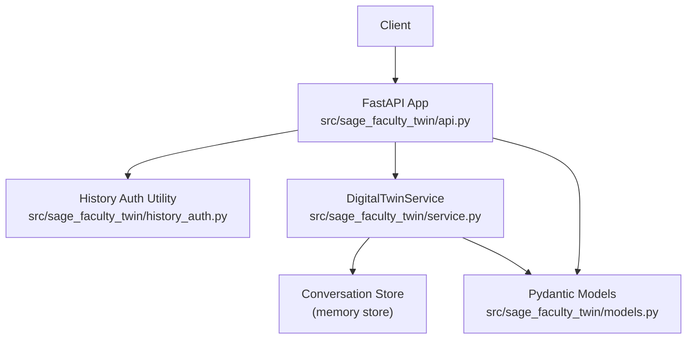
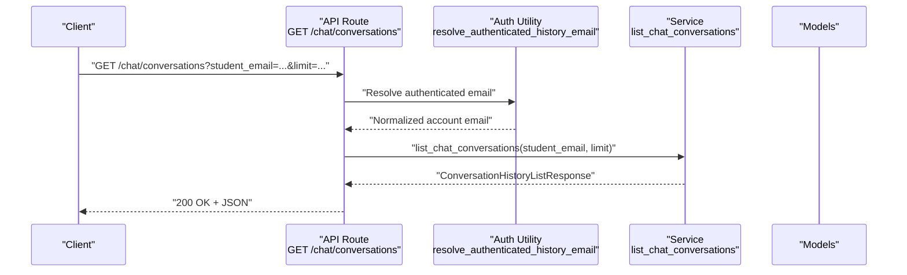
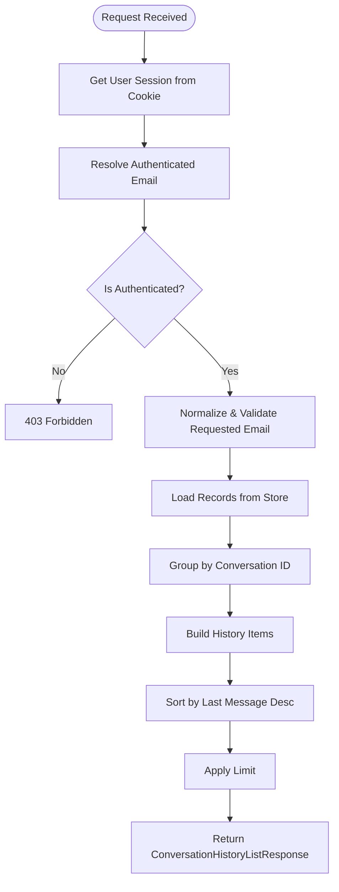
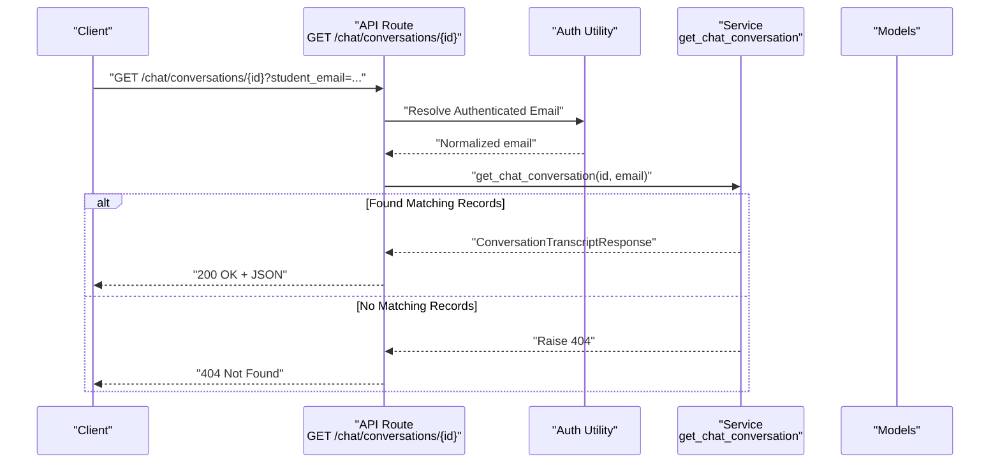
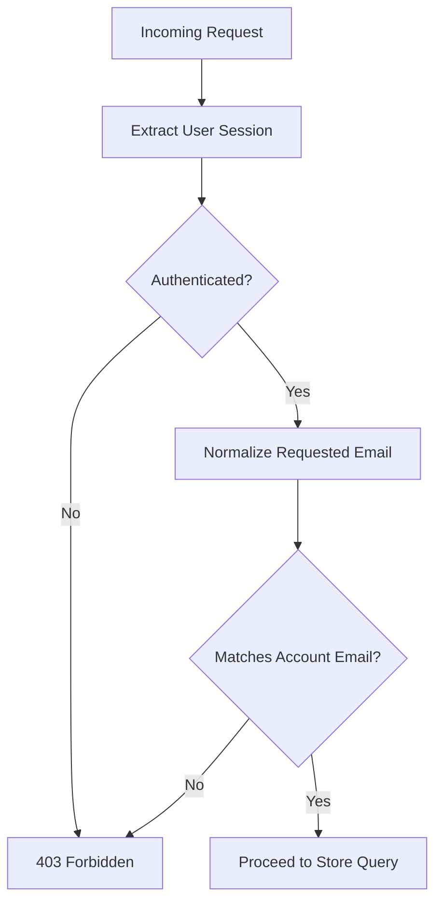
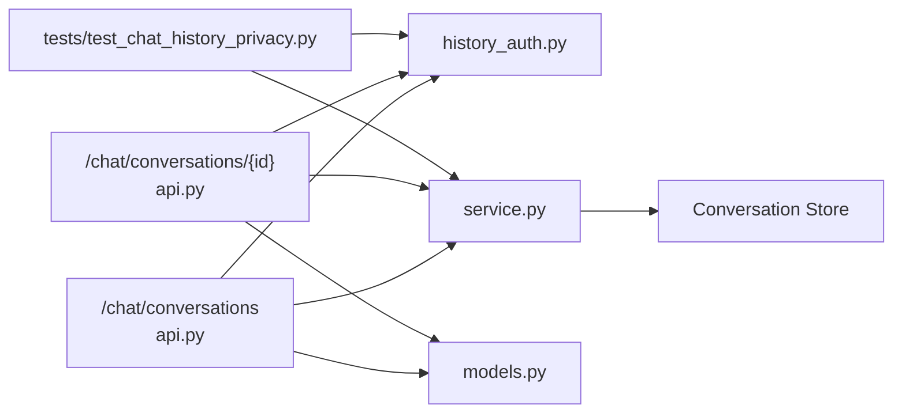

# Conversation History Endpoints

<cite>
**Referenced Files in This Document**
- [api.py](file://src/sage_faculty_twin/api.py)
- [models.py](file://src/sage_faculty_twin/models.py)
- [history_auth.py](file://src/sage_faculty_twin/history_auth.py)
- [service.py](file://src/sage_faculty_twin/service.py)
- [test_chat_history_privacy.py](file://tests/test_chat_history_privacy.py)
- [app.js](file://src/sage_faculty_twin/web/app.js)
</cite>

## Table of Contents
1. [Introduction](#introduction)
2. [Project Structure](#project-structure)
3. [Core Components](#core-components)
4. [Architecture Overview](#architecture-overview)
5. [Detailed Component Analysis](#detailed-component-analysis)
6. [Dependency Analysis](#dependency-analysis)
7. [Performance Considerations](#performance-considerations)
8. [Troubleshooting Guide](#troubleshooting-guide)
9. [Conclusion](#conclusion)

## Introduction
This document provides comprehensive API documentation for conversation history management endpoints. It covers:
- Listing conversations with pagination and filtering by student email
- Retrieving a specific conversation transcript
- Response models for history listings and transcripts
- Authentication and privacy controls for accessing historical data
- Practical workflows for browsing and retrieving conversation history

## Project Structure
The conversation history endpoints are implemented in the FastAPI application module and backed by the digital twin service. The relevant components include:
- API routes for listing and retrieving conversations
- Pydantic models for request/response shapes
- Authentication and privacy enforcement utilities
- Service layer implementations for history queries
- Tests validating privacy and access control

**Diagram sources**
- [api.py:708-740](file://src/sage_faculty_twin/api.py#L708-L740)
- [service.py:5746-5837](file://src/sage_faculty_twin/service.py#L5746-L5837)
- [models.py:223-254](file://src/sage_faculty_twin/models.py#L223-L254)
- [history_auth.py:6-27](file://src/sage_faculty_twin/history_auth.py#L6-L27)

**Section sources**
- [api.py:708-740](file://src/sage_faculty_twin/api.py#L708-L740)
- [models.py:223-254](file://src/sage_faculty_twin/models.py#L223-L254)
- [history_auth.py:6-27](file://src/sage_faculty_twin/history_auth.py#L6-L27)
- [service.py:5746-5837](file://src/sage_faculty_twin/service.py#L5746-L5837)

## Core Components
- Endpoint: GET /chat/conversations
  - Purpose: List recent conversations for the authenticated user
  - Query parameters:
    - student_email: Optional filter by student email (case-insensitive, normalized)
    - limit: Optional number of items to return (default 30, min 1, max 100)
  - Response: ConversationHistoryListResponse
  - Authentication: Requires a valid user session cookie
  - Privacy: Enforces that only records matching the authenticated account’s email are returned

- Endpoint: GET /chat/conversations/{conversation_id}
  - Purpose: Retrieve a specific conversation transcript
  - Path parameter:
    - conversation_id: Conversation identifier
  - Query parameters:
    - student_email: Optional filter by student email (case-insensitive, normalized)
  - Response: ConversationTranscriptResponse
  - Authentication: Requires a valid user session cookie
  - Privacy: Enforces that only records matching the authenticated account’s email are returned; legacy anonymous records are not exposed to authenticated users

- Response Models:
  - ConversationHistoryListResponse: Contains a list of ConversationHistoryItemResponse
  - ConversationHistoryItemResponse: Summarizes a conversation (id, title, preview, student info, exchange count, last message timestamp)
  - ConversationTranscriptResponse: Includes conversation metadata plus a list of ConversationExchangeResponse entries
  - ConversationExchangeResponse: Individual Q&A exchange with workflow action, knowledge hit count, and timestamps

- Authentication and Privacy Utilities:
  - resolve_authenticated_history_email: Validates session and enforces that requested email matches the authenticated account’s email; raises 403 for unauthorized access

**Section sources**
- [api.py:708-740](file://src/sage_faculty_twin/api.py#L708-L740)
- [models.py:223-254](file://src/sage_faculty_twin/models.py#L223-L254)
- [history_auth.py:6-27](file://src/sage_faculty_twin/history_auth.py#L6-L27)
- [service.py:5746-5837](file://src/sage_faculty_twin/service.py#L5746-L5837)

## Architecture Overview
The conversation history endpoints follow a layered architecture:
- Presentation Layer: FastAPI routes handle requests, extract cookies, normalize parameters, and enforce authentication
- Domain Layer: Service methods query the conversation store, group records by conversation_id, and construct response models
- Data Contracts: Pydantic models define strict schemas for requests and responses
- Privacy Enforcement: A dedicated utility validates session state and enforces email ownership

**Diagram sources**
- [api.py:708-721](file://src/sage_faculty_twin/api.py#L708-L721)
- [history_auth.py:6-27](file://src/sage_faculty_twin/history_auth.py#L6-L27)
- [service.py:5746-5788](file://src/sage_faculty_twin/service.py#L5746-L5788)
- [models.py:223-236](file://src/sage_faculty_twin/models.py#L223-L236)

## Detailed Component Analysis

### Endpoint: GET /chat/conversations
- Purpose: Return paginated list of conversation summaries for the authenticated user
- Behavior:
  - Extracts user session from cookie
  - Normalizes and validates requested email against authenticated account
  - Queries conversation store and groups records by conversation_id
  - Builds summary items with title, preview, exchange count, and last message timestamp
  - Sorts by last_message_at descending and applies limit
- Response Model: ConversationHistoryListResponse
- Access Control:
  - Must be authenticated; otherwise returns 403
  - If student_email is provided and does not match the authenticated account, returns 403
  - Legacy anonymous records are excluded from authenticated history

**Diagram sources**
- [api.py:708-721](file://src/sage_faculty_twin/api.py#L708-L721)
- [history_auth.py:6-27](file://src/sage_faculty_twin/history_auth.py#L6-L27)
- [service.py:5746-5788](file://src/sage_faculty_twin/service.py#L5746-L5788)

**Section sources**
- [api.py:708-721](file://src/sage_faculty_twin/api.py#L708-L721)
- [history_auth.py:6-27](file://src/sage_faculty_twin/history_auth.py#L6-L27)
- [service.py:5746-5788](file://src/sage_faculty_twin/service.py#L5746-L5788)
- [test_chat_history_privacy.py:53-93](file://tests/test_chat_history_privacy.py#L53-L93)

### Endpoint: GET /chat/conversations/{conversation_id}
- Purpose: Return a specific conversation transcript filtered by authenticated user
- Behavior:
  - Extracts user session from cookie
  - Normalizes requested email and validates presence
  - Filters records by conversation_id and matching email
  - Sorts exchanges chronologically and constructs transcript with metadata and exchange list
  - Returns 404 if no matching records found
- Response Model: ConversationTranscriptResponse
- Access Control:
  - Must be authenticated; otherwise returns 403
  - Legacy anonymous records are not exposed to authenticated users

**Diagram sources**
- [api.py:726-740](file://src/sage_faculty_twin/api.py#L726-L740)
- [history_auth.py:6-27](file://src/sage_faculty_twin/history_auth.py#L6-L27)
- [service.py:5790-5837](file://src/sage_faculty_twin/service.py#L5790-L5837)

**Section sources**
- [api.py:726-740](file://src/sage_faculty_twin/api.py#L726-L740)
- [service.py:5790-5837](file://src/sage_faculty_twin/service.py#L5790-L5837)
- [test_chat_history_privacy.py:95-132](file://tests/test_chat_history_privacy.py#L95-L132)

### Response Models
- ConversationHistoryListResponse
  - conversations: array of ConversationHistoryItemResponse
- ConversationHistoryItemResponse
  - conversation_id: string
  - title: string (min length 1, max 256)
  - preview: string (min length 1, max 512)
  - student_name: string (min length 1, max 128)
  - student_email: string | null (max 256)
  - course_context: string | null (max 512)
  - exchange_count: integer (>= 1)
  - last_message_at: datetime
- ConversationTranscriptResponse
  - conversation_id: string
  - title: string (min length 1, max 256)
  - preview: string (min length 1, max 512)
  - student_name: string (min length 1, max 128)
  - student_email: string | null (max 256)
  - course_context: string | null (max 512)
  - exchanges: array of ConversationExchangeResponse
- ConversationExchangeResponse
  - exchange_id: string
  - question: string (min length 1, max 4000)
  - answer: string (min length 1, max 12000)
  - workflow_action: string (min length 1, max 64)
  - knowledge_hit_count: integer (>= 0)
  - created_at: datetime

**Section sources**
- [models.py:223-254](file://src/sage_faculty_twin/models.py#L223-L254)

### Authentication and Privacy Controls
- User session requirement:
  - Both endpoints rely on a valid user session cookie to operate
  - The resolver enforces that the requesting email matches the authenticated account’s email
- Privacy safeguards:
  - Legacy anonymous records are excluded from authenticated history
  - Attempting to access another user’s history via mismatched email results in 403
  - Attempting to access non-existent history returns 404

**Diagram sources**
- [history_auth.py:6-27](file://src/sage_faculty_twin/history_auth.py#L6-L27)
- [api.py:708-740](file://src/sage_faculty_twin/api.py#L708-L740)

**Section sources**
- [history_auth.py:6-27](file://src/sage_faculty_twin/history_auth.py#L6-L27)
- [test_chat_history_privacy.py:53-132](file://tests/test_chat_history_privacy.py#L53-L132)

### Frontend Integration Notes
- The frontend periodically refreshes user session and synchronizes conversation history from the server
- Example usage patterns:
  - Fetching a specific transcript by conversation_id
  - Listing conversations with optional email filter and limit

**Section sources**
- [app.js:1979-1996](file://src/sage_faculty_twin/web/app.js#L1979-L1996)
- [app.js:4663-4702](file://src/sage_faculty_twin/web/app.js#L4663-L4702)

## Dependency Analysis
- API routes depend on:
  - User session extraction and normalization
  - Authentication resolver for email validation
  - Service methods for querying conversation store
  - Pydantic models for serialization
- Service methods depend on:
  - Conversation store for persisted records
  - Helper methods for building titles and previews
- Tests validate:
  - Correct filtering by exact email match
  - Exclusion of legacy anonymous records for authenticated users
  - Proper error responses for invalid or mismatched access

**Diagram sources**
- [api.py:708-740](file://src/sage_faculty_twin/api.py#L708-L740)
- [history_auth.py:6-27](file://src/sage_faculty_twin/history_auth.py#L6-L27)
- [service.py:5746-5837](file://src/sage_faculty_twin/service.py#L5746-L5837)
- [models.py:223-254](file://src/sage_faculty_twin/models.py#L223-L254)
- [test_chat_history_privacy.py:1-132](file://tests/test_chat_history_privacy.py#L1-L132)

**Section sources**
- [api.py:708-740](file://src/sage_faculty_twin/api.py#L708-L740)
- [service.py:5746-5837](file://src/sage_faculty_twin/service.py#L5746-L5837)
- [history_auth.py:6-27](file://src/sage_faculty_twin/history_auth.py#L6-L27)
- [models.py:223-254](file://src/sage_faculty_twin/models.py#L223-L254)
- [test_chat_history_privacy.py:1-132](file://tests/test_chat_history_privacy.py#L1-L132)

## Performance Considerations
- Pagination and limits:
  - The limit parameter caps the number of returned items (default 30, max 100), reducing payload size and server load
- Sorting and grouping:
  - Server-side sorting by last_message_at and grouping by conversation_id minimize client-side computation
- Streaming vs. batch:
  - While not applicable here, the broader system supports streaming for other endpoints; history endpoints return complete payloads suitable for caching and offline use

[No sources needed since this section provides general guidance]

## Troubleshooting Guide
Common issues and resolutions:
- 403 Forbidden when listing or retrieving history
  - Cause: Missing or invalid user session, or mismatched student_email
  - Resolution: Ensure the user is logged in and the student_email matches the authenticated account
- 404 Not Found when retrieving a specific transcript
  - Cause: Conversation does not exist or belongs to another user
  - Resolution: Verify the conversation_id and ensure the correct account is authenticated
- Legacy anonymous records not visible to authenticated users
  - Behavior: By design, legacy anonymous records are excluded from authenticated history
  - Resolution: Use the appropriate endpoint for anonymous suggestions if needed

**Section sources**
- [history_auth.py:6-27](file://src/sage_faculty_twin/history_auth.py#L6-L27)
- [service.py:5790-5837](file://src/sage_faculty_twin/service.py#L5790-L5837)
- [test_chat_history_privacy.py:95-132](file://tests/test_chat_history_privacy.py#L95-L132)

## Conclusion
The conversation history endpoints provide secure, authenticated access to chat transcripts with robust privacy controls. They support efficient browsing via pagination and filtering, and ensure that sensitive data is only accessible to the owning user. The documented models and workflows enable reliable integration and maintenance of history features.