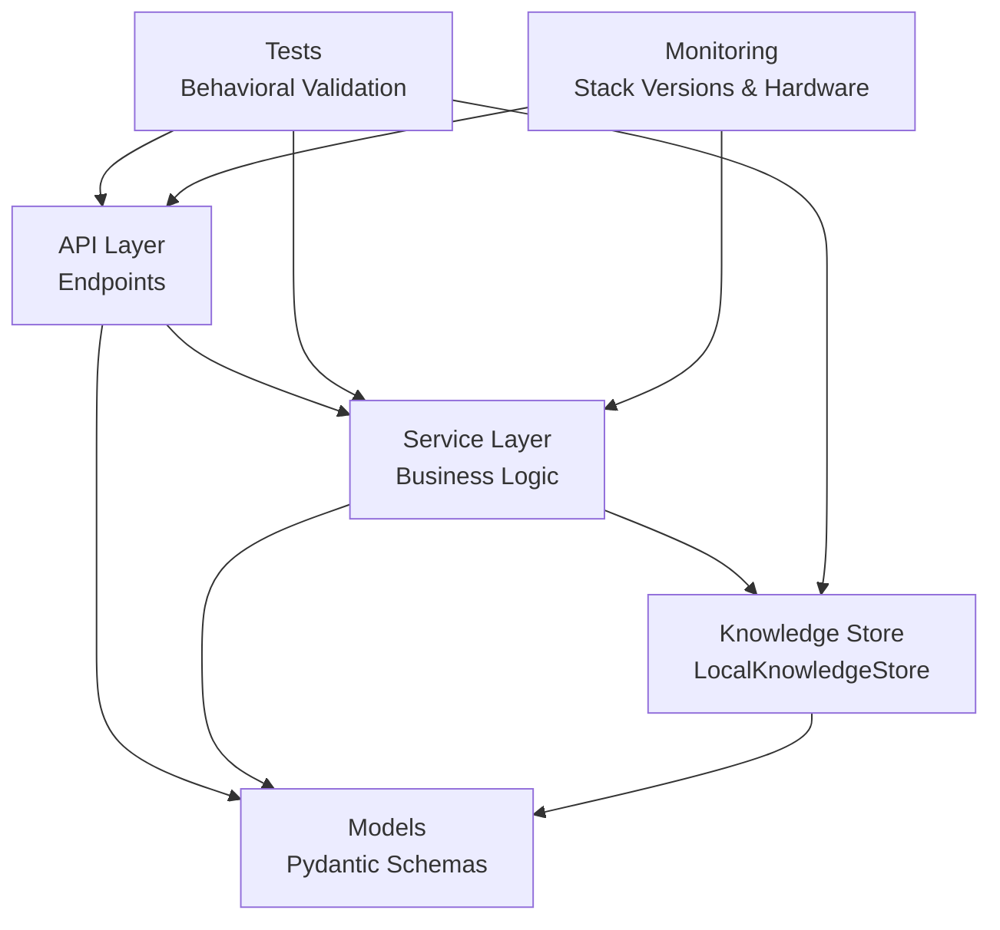
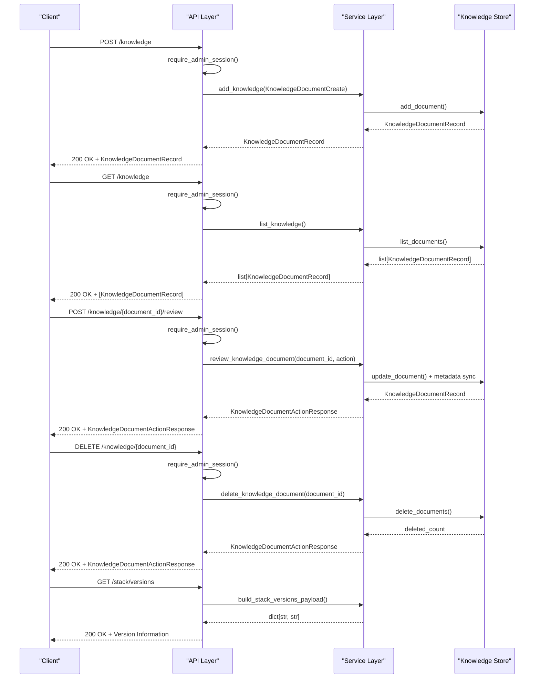
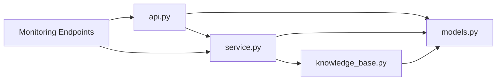

# Knowledge Management Endpoints

<cite>
**Referenced Files in This Document**
- [api.py](file://src/sage_faculty_twin/api.py)
- [service.py](file://src/sage_faculty_twin/service.py)
- [models.py](file://src/sage_faculty_twin/models.py)
- [knowledge_base.py](file://src/sage_faculty_twin/knowledge_base.py)
- [test_knowledge_base.py](file://tests/test_knowledge_base.py)
- [test_admin_auth.py](file://tests/test_admin_auth.py)
</cite>

## Update Summary
**Changes Made**
- Added new system monitoring endpoints documentation for /stack/versions and /stack/hardware
- Enhanced troubleshooting guide with monitoring and debugging capabilities
- Updated system administration section with monitoring endpoint usage
- Added application version exposure documentation

## Table of Contents
1. [Introduction](#introduction)
2. [Project Structure](#project-structure)
3. [Core Components](#core-components)
4. [Architecture Overview](#architecture-overview)
5. [Detailed Component Analysis](#detailed-component-analysis)
6. [System Monitoring and Debugging](#system-monitoring-and-debugging)
7. [Dependency Analysis](#dependency-analysis)
8. [Performance Considerations](#performance-considerations)
9. [Troubleshooting Guide](#troubleshooting-guide)
10. [Conclusion](#conclusion)

## Introduction
This document provides comprehensive API documentation for knowledge base management endpoints. It covers CRUD operations for knowledge documents, review workflows, and related administrative capabilities. The focus areas include:
- Document lifecycle: create, list, review, and delete
- Review workflows: approval and stale marking
- Knowledge gap management: draft creation and publishing
- System monitoring and debugging endpoints for operational visibility
- Administrative access requirements and security considerations
- Examples of document ingestion, metadata handling, and review status tracking

**Updated** Added system monitoring endpoints for application version exposure and hardware diagnostics to support operational management and debugging workflows.

## Project Structure
The knowledge management functionality spans several modules:
- API layer: endpoint definitions and request/response routing
- Service layer: business logic orchestration
- Models: request/response and domain data structures
- Knowledge store: persistence and retrieval engine
- Tests: behavioral validation and examples

**Diagram sources**
- [api.py:764-794](file://src/sage_faculty_twin/api.py#L764-L794)
- [service.py:5654-5687](file://src/sage_faculty_twin/service.py#L5654-L5687)
- [models.py:319-398](file://src/sage_faculty_twin/models.py#L319-L398)
- [knowledge_base.py:121-272](file://src/sage_faculty_twin/knowledge_base.py#L121-L272)

**Section sources**
- [api.py:764-794](file://src/sage_faculty_twin/api.py#L764-L794)
- [service.py:5654-5687](file://src/sage_faculty_twin/service.py#L5654-L5687)
- [models.py:319-398](file://src/sage_faculty_twin/models.py#L319-L398)
- [knowledge_base.py:121-272](file://src/sage_faculty_twin/knowledge_base.py#L121-L272)

## Core Components
This section outlines the primary models and endpoints used for knowledge management.

- KnowledgeDocumentCreate: Schema for creating new knowledge documents
- KnowledgeDocumentRecord: Schema representing stored knowledge documents
- KnowledgeDocumentReviewRequest: Schema for reviewing documents (approve/stale)
- KnowledgeDocumentActionResponse: Schema for responses to actions (create/update/delete)
- KnowledgeSearchResponse/KnowledgeSearchHit: Schema for search results
- KnowledgeDocumentReviewSummary: Schema for review statistics

Key endpoints:
- POST /knowledge: Create a new knowledge document
- GET /knowledge: List all knowledge documents
- DELETE /knowledge/{document_id}: Delete a knowledge document
- POST /knowledge/{document_id}/review: Review a knowledge document (approve or mark stale)
- GET /knowledge/reviews/summary: Retrieve review statistics
- GET /knowledge/search: Search knowledge with optional visitor/admin context

**New** Monitoring endpoints:
- GET /stack/versions: Expose application and stack component versions
- GET /stack/hardware: Retrieve system hardware information (NPU/CPU/Memory)

Administrative access:
- All knowledge management endpoints require admin authentication via cookies and session validation.

**Section sources**
- [models.py:319-398](file://src/sage_faculty_twin/models.py#L319-L398)
- [api.py:764-801](file://src/sage_faculty_twin/api.py#L764-L801)
- [api.py:554-561](file://src/sage_faculty_twin/api.py#L554-L561)

## Architecture Overview
The knowledge management flow integrates API endpoints, service orchestration, and the knowledge store. Administrative requests are validated before invoking service methods.

**Diagram sources**
- [api.py:764-794](file://src/sage_faculty_twin/api.py#L764-L794)
- [service.py:5654-5687](file://src/sage_faculty_twin/service.py#L5654-L5687)
- [knowledge_base.py:141-268](file://src/sage_faculty_twin/knowledge_base.py#L141-L268)
- [service.py:255-273](file://src/sage_faculty_twin/service.py#L255-L273)

## Detailed Component Analysis

### Endpoint: POST /knowledge
Purpose: Create a new knowledge document.

- Authentication: Requires admin session cookie
- Request body: KnowledgeDocumentCreate
- Response: KnowledgeDocumentRecord
- Behavior:
  - Validates input against KnowledgeDocumentCreate
  - Persists document to disk and updates in-memory cache
  - Initializes backend indexes if configured
  - Returns the created document record

Example usage:
- Submit a document with title, content, tags, and optional source_name/metadata
- Response includes document_id, created_at, and computed review/freshness status

**Section sources**
- [api.py:764-769](file://src/sage_faculty_twin/api.py#L764-L769)
- [service.py:5654-5662](file://src/sage_faculty_twin/service.py#L5654-L5662)
- [knowledge_base.py:141-165](file://src/sage_faculty_twin/knowledge_base.py#L141-L165)

### Endpoint: GET /knowledge
Purpose: List all knowledge documents.

- Authentication: Requires admin session cookie
- Response: Array of KnowledgeDocumentRecord
- Behavior:
  - Returns documents sorted by creation time
  - Includes review/freshness metadata and visibility filtering

**Section sources**
- [api.py:789-793](file://src/sage_faculty_twin/api.py#L789-L793)
- [service.py:5663-5666](file://src/sage_faculty_twin/service.py#L5663-L5666)
- [knowledge_base.py:243-244](file://src/sage_faculty_twin/knowledge_base.py#L243-L244)

### Endpoint: DELETE /knowledge/{document_id}
Purpose: Delete a knowledge document.

- Authentication: Requires admin session cookie
- Path parameter: document_id
- Response: KnowledgeDocumentActionResponse with deleted_count
- Behavior:
  - Removes document file and in-memory entry
  - Optionally rebuilds backend indexes

**Section sources**
- [api.py:781-786](file://src/sage_faculty_twin/api.py#L781-L786)
- [service.py:5687-5691](file://src/sage_faculty_twin/service.py#L5687-L5691)
- [knowledge_base.py:249-268](file://src/sage_faculty_twin/knowledge_base.py#L249-L268)

### Endpoint: POST /knowledge/{document_id}/review
Purpose: Review a knowledge document (approve or mark stale).

- Authentication: Requires admin session cookie
- Path parameter: document_id
- Request body: KnowledgeDocumentReviewRequest (action: approve or stale)
- Response: KnowledgeDocumentActionResponse
- Behavior:
  - Updates document metadata (review_status, freshness_status, reviewed_at)
  - Synchronizes reviewable flag based on source_name/tags
  - Returns updated document if applicable

Review status tracking:
- review_status: unknown → pending → approved or stale
- freshness_status: derived from review_status and metadata
- reviewed_at: ISO formatted timestamp stored in metadata

**Section sources**
- [api.py:772-778](file://src/sage_faculty_twin/api.py#L772-L778)
- [service.py:5675-5686](file://src/sage_faculty_twin/service.py#L5675-L5686)
- [models.py:379-398](file://src/sage_faculty_twin/models.py#L379-L398)
- [knowledge_base.py:341-376](file://src/sage_faculty_twin/knowledge_base.py#L341-L376)

### Endpoint: GET /knowledge/reviews/summary
Purpose: Retrieve review statistics and pending items.

- Authentication: Requires admin session cookie
- Query parameter: limit (default 20)
- Response: KnowledgeDocumentReviewSummary
- Behavior:
  - Aggregates counts for total, feedback_web, pending, approved, stale, and reviewable documents
  - Returns pending items list up to limit

**Section sources**
- [api.py:796-801](file://src/sage_faculty_twin/api.py#L796-L801)
- [service.py:5668-5673](file://src/sage_faculty_twin/service.py#L5668-L5673)
- [models.py:383-391](file://src/sage_faculty_twin/models.py#L383-L391)

### Endpoint: GET /knowledge/search
Purpose: Search knowledge with optional visitor/admin context.

- Authentication: Requires admin session cookie
- Query parameters:
  - query (required)
  - visitor_profile (optional)
- Response: KnowledgeSearchResponse with hits
- Behavior:
  - Delegates to service.search_knowledge with admin role inferred from session
  - Applies visibility rules based on visitor/admin context

**Section sources**
- [api.py:804-817](file://src/sage_faculty_twin/api.py#L804-L817)
- [service.py:5692-5700](file://src/sage_faculty_twin/service.py#L5692-L5700)
- [models.py:400-412](file://src/sage_faculty_twin/models.py#L400-L412)

### Knowledge Gap Management
While not part of the core /knowledge endpoints, knowledge gap management complements document review workflows:
- Draft creation and publishing for knowledge gaps
- Mapping between gap drafts and published documents
- Tag normalization and content generation for standardized documents

**Section sources**
- [service.py:7031-7047](file://src/sage_faculty_twin/service.py#L7031-L7047)
- [service.py:7050-7072](file://src/sage_faculty_twin/service.py#L7050-L7072)
- [service.py:7075-7082](file://src/sage_faculty_twin/service.py#L7075-L7082)

## System Monitoring and Debugging

### Endpoint: GET /stack/versions
Purpose: Expose application and stack component versions for operational monitoring.

- Authentication: No authentication required
- Response: Dictionary mapping component names to version strings
- Supported components:
  - app_version: Main application version
  - stack_version_sage: SAGE framework version
  - stack_version_neuromem: Neuromem library version
  - stack_version_vllm_hust: vLLM-HUST version
  - stack_version_sagevdb: sageVDB database version
  - stack_version_sage_anns: sage-ANNs vector search version

Usage scenarios:
- Deployment verification and validation
- Support ticket diagnostics
- Automated monitoring and alerting systems
- Development environment consistency checks

**Section sources**
- [api.py:554-556](file://src/sage_faculty_twin/api.py#L554-L556)
- [service.py:255-273](file://src/sage_faculty_twin/service.py#L255-L273)

### Endpoint: GET /stack/hardware
Purpose: Retrieve system hardware information for capacity planning and diagnostics.

- Authentication: No authentication required
- Response: Dictionary containing hardware specifications
- Supported metrics:
  - npu: Ascend NPU device information (count × model)
  - cpu: CPU model name and core count
  - memory: Total system memory in GiB/TiB

Hardware detection capabilities:
- Automatic NPU discovery via npu-smi utility
- CPU identification using lscpu or /proc/cpuinfo
- Memory capacity extraction from /proc/meminfo

**Section sources**
- [api.py:559-561](file://src/sage_faculty_twin/api.py#L559-L561)
- [service.py:276-353](file://src/sage_faculty_twin/service.py#L276-L353)

### Presence Heartbeat Monitoring
**New** The system includes online presence monitoring through heartbeat endpoints:

- POST /presence/heartbeat: Records user presence and activity
- Integrates with real-time monitoring dashboards
- Supports operational visibility and user engagement tracking

**Section sources**
- [api.py:564-568](file://src/sage_faculty_twin/api.py#L564-L568)
- [service.py:6778-6801](file://src/sage_faculty_twin/service.py#L6778-L6801)

## Dependency Analysis
The knowledge management endpoints depend on:
- API layer for routing and authentication
- Service layer for business logic and orchestration
- Knowledge store for persistence and retrieval
- Models for request/response validation

**Diagram sources**
- [api.py:764-817](file://src/sage_faculty_twin/api.py#L764-L817)
- [service.py:5654-5700](file://src/sage_faculty_twin/service.py#L5654-L5700)
- [knowledge_base.py:121-272](file://src/sage_faculty_twin/knowledge_base.py#L121-L272)
- [models.py:319-398](file://src/sage_faculty_twin/models.py#L319-L398)

**Section sources**
- [api.py:764-817](file://src/sage_faculty_twin/api.py#L764-L817)
- [service.py:5654-5700](file://src/sage_faculty_twin/service.py#L5654-L5700)
- [knowledge_base.py:121-272](file://src/sage_faculty_twin/knowledge_base.py#L121-L272)
- [models.py:319-398](file://src/sage_faculty_twin/models.py#L319-L398)

## Performance Considerations
- Index rebuilding: Adding/updating/deleting documents triggers index rebuilds when configured. Batch operations may benefit from disabling automatic rebuilds and triggering a single rebuild afterward.
- Backend selection: Choose appropriate knowledge backend (local, sagevdb, neuromem) based on scale and performance needs.
- Search limits: Use top_k parameters judiciously to balance relevance and performance.
- Monitoring overhead: Stack version and hardware endpoints are lightweight and suitable for frequent polling in monitoring systems.

## Troubleshooting Guide
Common issues and resolutions:
- Authentication failures: Ensure admin session cookie is present and valid. Verify admin login endpoint and session retrieval.
- Document not found: Confirm document_id exists and is accessible to the requesting admin role.
- Metadata inconsistencies: Review document metadata synchronization during review operations.
- Backend initialization: Confirm backend configuration (sagevdb/neuromem) and embedding settings.
- Monitoring endpoint failures: Stack versions endpoint returns "unknown" for components not installed. Hardware endpoint may return empty if system utilities are unavailable.

**New** Monitoring and debugging tips:
- Use GET /stack/versions to verify deployment consistency across environments
- Monitor hardware utilization through /stack/hardware endpoint integration
- Track system health via presence heartbeat monitoring
- Leverage version information for support ticket diagnostics

Validation references:
- Admin authentication and session handling
- Document ingestion and metadata derivation
- Review workflow and status transitions
- Monitoring endpoint implementations

**Section sources**
- [test_admin_auth.py:690-729](file://tests/test_admin_auth.py#L690-L729)
- [test_knowledge_base.py:15-94](file://tests/test_knowledge_base.py#L15-L94)
- [test_knowledge_base.py:59-94](file://tests/test_knowledge_base.py#L59-L94)
- [test_knowledge_base.py:369-447](file://tests/test_knowledge_base.py#L369-L447)

## Conclusion
The knowledge management endpoints provide a robust foundation for document lifecycle operations, review workflows, and administrative oversight. The addition of system monitoring endpoints enhances operational visibility with application version exposure and hardware diagnostics. By leveraging the documented models, endpoints, security requirements, and monitoring capabilities, administrators can effectively manage knowledge assets, track review status, maintain quality through metadata-driven workflows, and ensure optimal system performance through comprehensive monitoring and debugging support.