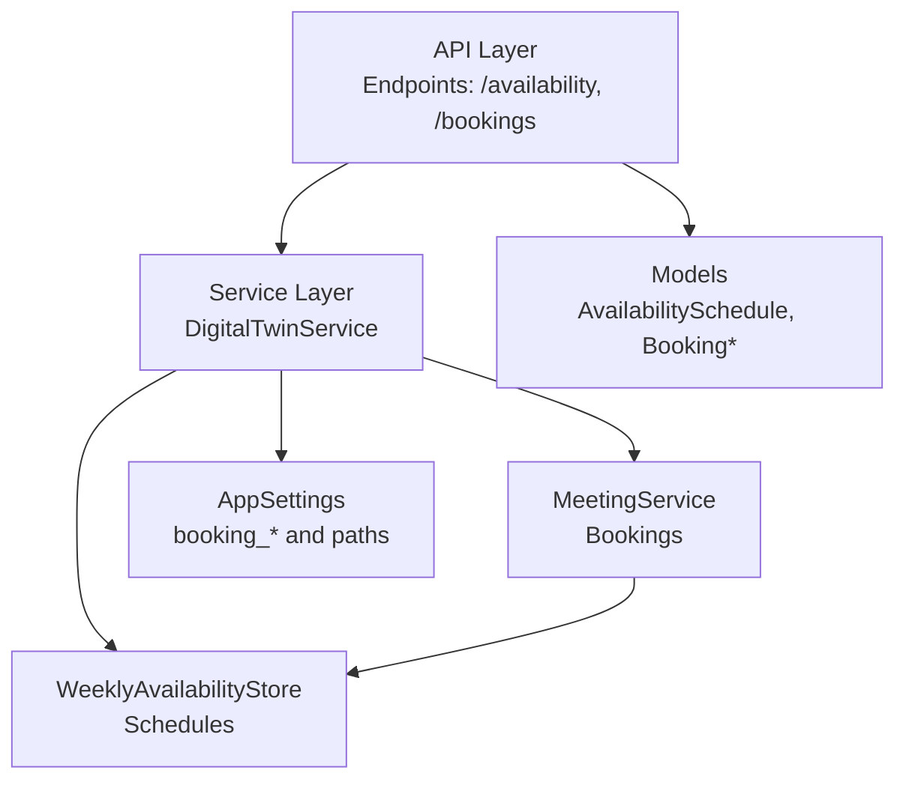
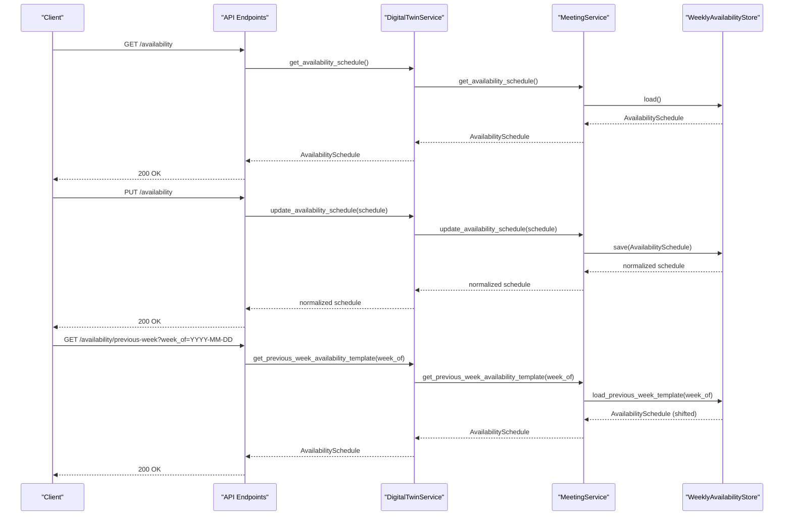
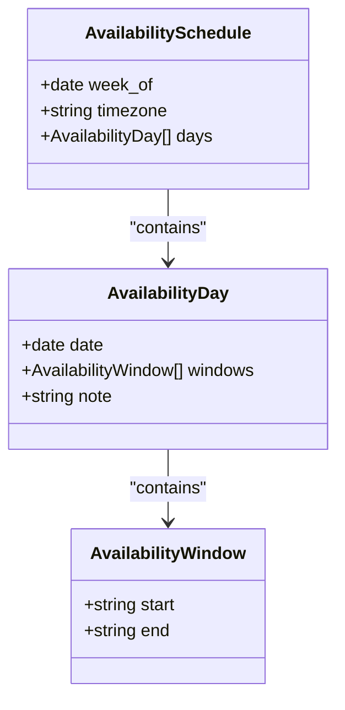
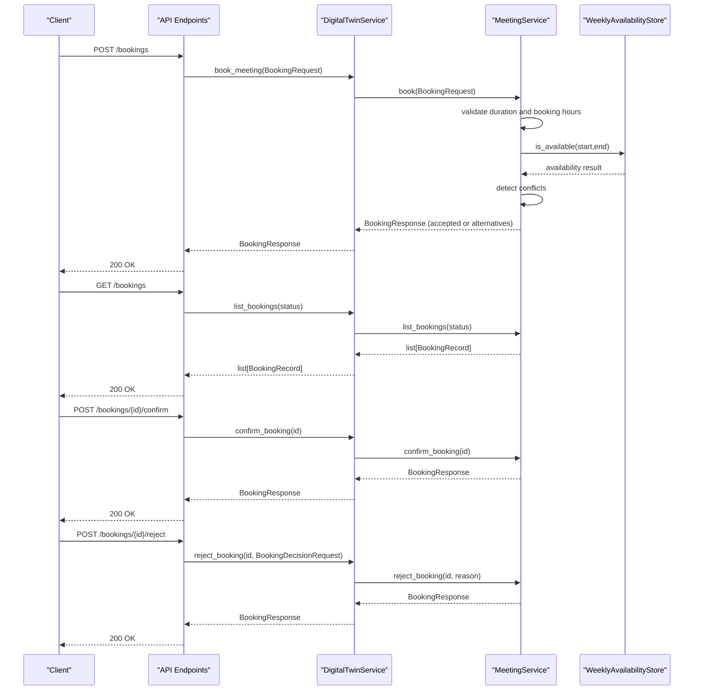
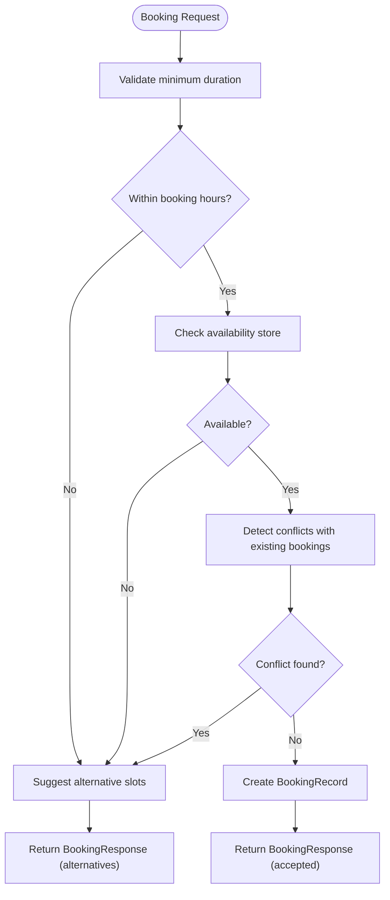
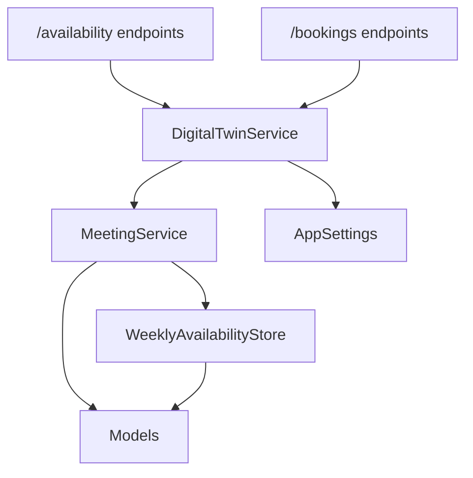

# Scheduling and Availability Endpoints

<cite>
**Referenced Files in This Document**
- [api.py](file://src/sage_faculty_twin/api.py)
- [availability.py](file://src/sage_faculty_twin/availability.py)
- [meeting.py](file://src/sage_faculty_twin/meeting.py)
- [models.py](file://src/sage_faculty_twin/models.py)
- [service.py](file://src/sage_faculty_twin/service.py)
- [config.py](file://src/sage_faculty_twin/config.py)
</cite>

## Table of Contents
1. [Introduction](#introduction)
2. [Project Structure](#project-structure)
3. [Core Components](#core-components)
4. [Architecture Overview](#architecture-overview)
5. [Detailed Component Analysis](#detailed-component-analysis)
6. [Dependency Analysis](#dependency-analysis)
7. [Performance Considerations](#performance-considerations)
8. [Troubleshooting Guide](#troubleshooting-guide)
9. [Conclusion](#conclusion)

## Introduction
This document provides comprehensive API documentation for scheduling and availability management endpoints. It covers:
- Availability endpoints: GET /availability, PUT /availability, and GET /availability/previous-week
- Availability data models: AvailabilitySchedule, AvailabilityDay, AvailabilityWindow
- Booking management workflows: creation, listing, confirmation, and rejection
- Booking models: BookingRequest, BookingDecisionRequest, BookingRecord, BookingResponse
- Availability validation, conflict detection, and booking confirmation processes
- Administrative access requirements and calendar integration considerations

## Project Structure
The scheduling and availability features are implemented across several modules:
- API layer: endpoint definitions and request/response handling
- Service layer: orchestration and workflow execution
- Domain services: MeetingService for bookings and WeeklyAvailabilityStore for schedules
- Data models: Pydantic models defining request/response structures
- Configuration: application settings controlling booking hours, durations, and storage paths

**Diagram sources**
- [api.py:574-595](file://src/sage_faculty_twin/api.py#L574-L595)
- [service.py:5284-5301](file://src/sage_faculty_twin/service.py#L5284-L5301)
- [meeting.py:11-16](file://src/sage_faculty_twin/meeting.py#L11-L16)
- [availability.py:11-16](file://src/sage_faculty_twin/availability.py#L11-L16)
- [models.py:257-282](file://src/sage_faculty_twin/models.py#L257-L282)
- [config.py:9-62](file://src/sage_faculty_twin/config.py#L9-L62)

**Section sources**
- [api.py:574-595](file://src/sage_faculty_twin/api.py#L574-L595)
- [service.py:5284-5301](file://src/sage_faculty_twin/service.py#L5284-L5301)
- [meeting.py:11-16](file://src/sage_faculty_twin/meeting.py#L11-L16)
- [availability.py:11-16](file://src/sage_faculty_twin/availability.py#L11-L16)
- [models.py:257-282](file://src/sage_faculty_twin/models.py#L257-L282)
- [config.py:9-62](file://src/sage_faculty_twin/config.py#L9-L62)

## Core Components
- AvailabilitySchedule: Top-level schedule container with week-of date, timezone, and list of AvailabilityDay entries
- AvailabilityDay: A single day’s availability with date, time windows, and optional note
- AvailabilityWindow: Time window with validated HH:MM start/end fields
- MeetingService: Manages booking lifecycle and integrates with WeeklyAvailabilityStore
- WeeklyAvailabilityStore: Persists and loads schedules, supports previous-week templates, availability checks, and slot suggestions
- DigitalTwinService: Coordinates booking workflows and integrates with MeetingService

Key models and their roles:
- AvailabilitySchedule: Defines the weekly availability structure
- AvailabilityDay: Encapsulates daily slots and notes
- AvailabilityWindow: Enforces time window validation
- BookingRequest: Describes a new booking request
- BookingRecord: Stores persisted booking state
- BookingResponse: Response for booking operations, including alternative slots and optional notification status
- BookingDecisionRequest: Provides rejection reason during rejection

**Section sources**
- [models.py:292-317](file://src/sage_faculty_twin/models.py#L292-L317)
- [models.py:307-311](file://src/sage_faculty_twin/models.py#L307-L311)
- [models.py:292-305](file://src/sage_faculty_twin/models.py#L292-L305)
- [models.py:257-263](file://src/sage_faculty_twin/models.py#L257-L263)
- [models.py:265-274](file://src/sage_faculty_twin/models.py#L265-L274)
- [models.py:276-282](file://src/sage_faculty_twin/models.py#L276-L282)
- [models.py:288-289](file://src/sage_faculty_twin/models.py#L288-L289)

## Architecture Overview
The availability and booking systems are integrated through the API layer, which delegates to DigitalTwinService. MeetingService handles booking logic and interacts with WeeklyAvailabilityStore for schedule validation and suggestions.

**Diagram sources**
- [api.py:574-595](file://src/sage_faculty_twin/api.py#L574-L595)
- [service.py:5284-5301](file://src/sage_faculty_twin/service.py#L5284-L5301)
- [meeting.py:127-135](file://src/sage_faculty_twin/meeting.py#L127-L135)
- [availability.py:47-69](file://src/sage_faculty_twin/availability.py#L47-L69)

## Detailed Component Analysis

### Availability Endpoints
- GET /availability
  - Purpose: Retrieve current weekly availability schedule
  - Authentication: Requires admin session cookie
  - Response: AvailabilitySchedule
  - Implementation: Delegates to DigitalTwinService.get_availability_schedule()

- PUT /availability
  - Purpose: Update current weekly availability schedule
  - Authentication: Requires admin session cookie
  - Request: AvailabilitySchedule
  - Response: Normalized AvailabilitySchedule (validated and saved)
  - Implementation: Delegates to DigitalTwinService.update_availability_schedule()

- GET /availability/previous-week
  - Purpose: Load previous week’s schedule as a template for the current week
  - Authentication: Requires admin session cookie
  - Query: week_of (optional date)
  - Response: AvailabilitySchedule (days shifted forward by 7 days)
  - Implementation: Delegates to DigitalTwinService.get_previous_week_availability_template()

Administrative access:
- Endpoints are protected by require_admin_session middleware
- Admin session cookies are validated server-side

Calendar integration considerations:
- Schedule persistence uses JSON files under data/availability
- Previous week templates are stored under data/availability/history
- Timezone and weekly boundary are derived from configuration and current week start

**Section sources**
- [api.py:574-595](file://src/sage_faculty_twin/api.py#L574-L595)
- [service.py:5284-5301](file://src/sage_faculty_twin/service.py#L5284-L5301)
- [meeting.py:127-135](file://src/sage_faculty_twin/meeting.py#L127-L135)
- [availability.py:47-69](file://src/sage_faculty_twin/availability.py#L47-L69)
- [config.py:53](file://src/sage_faculty_twin/config.py#L53)

### Availability Data Models
- AvailabilityWindow
  - Fields: start (HH:MM), end (HH:MM)
  - Validation: Ensures time values are within 00:00–23:59
  - Used by: AvailabilityDay

- AvailabilityDay
  - Fields: date, windows (list of AvailabilityWindow), note (optional)
  - Used by: AvailabilitySchedule

- AvailabilitySchedule
  - Fields: week_of (optional), timezone (optional), days (list of AvailabilityDay)
  - Persistence: Stored as JSON; loaded/saved via WeeklyAvailabilityStore
  - Used by: Availability endpoints and MeetingService

**Diagram sources**
- [models.py:292-317](file://src/sage_faculty_twin/models.py#L292-L317)
- [models.py:307-311](file://src/sage_faculty_twin/models.py#L307-L311)
- [models.py:292-305](file://src/sage_faculty_twin/models.py#L292-L305)

**Section sources**
- [models.py:292-317](file://src/sage_faculty_twin/models.py#L292-L317)
- [models.py:307-311](file://src/sage_faculty_twin/models.py#L307-L311)
- [models.py:292-305](file://src/sage_faculty_twin/models.py#L292-L305)

### Booking Management Workflows
Endpoints:
- POST /bookings: Create a new booking
- GET /bookings: List bookings (admin-only)
- POST /bookings/{booking_id}/confirm: Confirm a booking (admin-only)
- POST /bookings/{booking_id}/reject: Reject a booking with optional reason (admin-only)

Models:
- BookingRequest: student_name, student_email, topic, preferred_start, preferred_end
- BookingRecord: booking_id, student_name, student_email, topic, start_at, end_at, status, rejection_reason
- BookingResponse: accepted, message, booking (optional), alternative_slots (optional), notification (optional)
- BookingDecisionRequest: rejection_reason (optional)

Validation and conflict detection:
- Minimum duration enforced by configuration
- Booking hours constrained by configuration (booking_start_hour, booking_end_hour)
- Availability checked against WeeklyAvailabilityStore.is_available
- Conflicts detected against existing bookings
- Alternative slots suggested using WeeklyAvailabilityStore.suggest_slots

**Diagram sources**
- [api.py:963-990](file://src/sage_faculty_twin/api.py#L963-L990)
- [service.py:5711-5732](file://src/sage_faculty_twin/service.py#L5711-L5732)
- [meeting.py:17-67](file://src/sage_faculty_twin/meeting.py#L17-L67)
- [meeting.py:69-125](file://src/sage_faculty_twin/meeting.py#L69-L125)
- [availability.py:71-114](file://src/sage_faculty_twin/availability.py#L71-L114)

**Section sources**
- [api.py:963-990](file://src/sage_faculty_twin/api.py#L963-L990)
- [service.py:5711-5732](file://src/sage_faculty_twin/service.py#L5711-L5732)
- [meeting.py:17-67](file://src/sage_faculty_twin/meeting.py#L17-L67)
- [meeting.py:69-125](file://src/sage_faculty_twin/meeting.py#L69-L125)
- [models.py:257-282](file://src/sage_faculty_twin/models.py#L257-L282)
- [models.py:288-289](file://src/sage_faculty_twin/models.py#L288-L289)

### Availability Validation and Conflict Detection
WeeklyAvailabilityStore performs:
- Availability checks: is_available(start_at, end_at) validates against configured windows
- Slot suggestions: suggest_slots(anchor, duration_minutes, existing_bookings, limit) proposes alternative times
- Previous week template: load_previous_week_template shifts dates by 7 days and normalizes schedule

MeetingService enforces:
- Minimum meeting duration from configuration
- Booking hours boundaries
- Conflict detection against existing bookings
- Alternative slot generation when conflicts occur

**Diagram sources**
- [meeting.py:17-67](file://src/sage_faculty_twin/meeting.py#L17-L67)
- [meeting.py:148-159](file://src/sage_faculty_twin/meeting.py#L148-L159)
- [availability.py:71-114](file://src/sage_faculty_twin/availability.py#L71-L114)

**Section sources**
- [meeting.py:17-67](file://src/sage_faculty_twin/meeting.py#L17-L67)
- [meeting.py:148-159](file://src/sage_faculty_twin/meeting.py#L148-L159)
- [availability.py:71-114](file://src/sage_faculty_twin/availability.py#L71-L114)

### Administrative Access Requirements
- All availability and booking admin endpoints require an admin session cookie
- require_admin_session middleware validates the session and returns authorization context
- Admin credentials and session secrets are configured via AppSettings

**Section sources**
- [api.py:422-424](file://src/sage_faculty_twin/api.py#L422-L424)
- [api.py:576](file://src/sage_faculty_twin/api.py#L576)
- [api.py:584](file://src/sage_faculty_twin/api.py#L584)
- [api.py:592](file://src/sage_faculty_twin/api.py#L592)
- [api.py:971](file://src/sage_faculty_twin/api.py#L971)
- [api.py:979](file://src/sage_faculty_twin/api.py#L979)
- [api.py:988](file://src/sage_faculty_twin/api.py#L988)
- [config.py:121-128](file://src/sage_faculty_twin/config.py#L121-L128)

### Calendar Integration Considerations
- Schedule persistence: JSON files in data/availability/current_week.json and data/availability/history/<YYYY-MM-DD>.json
- Timezone handling: schedule timezone defaults to AppSettings.booking_timezone if unspecified
- Weekly boundary: current week start computed as Monday of the current week
- Email notifications: configurable SMTP settings for booking reminders

**Section sources**
- [availability.py:17-45](file://src/sage_faculty_twin/availability.py#L17-L45)
- [availability.py:47-69](file://src/sage_faculty_twin/availability.py#L47-L69)
- [availability.py:152-154](file://src/sage_faculty_twin/availability.py#L152-L154)
- [config.py:49-62](file://src/sage_faculty_twin/config.py#L49-L62)

## Dependency Analysis
The following diagram shows key dependencies among components involved in scheduling and booking:

**Diagram sources**
- [api.py:574-595](file://src/sage_faculty_twin/api.py#L574-L595)
- [api.py:963-990](file://src/sage_faculty_twin/api.py#L963-L990)
- [service.py:5284-5301](file://src/sage_faculty_twin/service.py#L5284-L5301)
- [meeting.py:11-16](file://src/sage_faculty_twin/meeting.py#L11-L16)
- [availability.py:11-16](file://src/sage_faculty_twin/availability.py#L11-L16)
- [models.py:257-282](file://src/sage_faculty_twin/models.py#L257-L282)
- [config.py:9-62](file://src/sage_faculty_twin/config.py#L9-L62)

**Section sources**
- [api.py:574-595](file://src/sage_faculty_twin/api.py#L574-L595)
- [api.py:963-990](file://src/sage_faculty_twin/api.py#L963-L990)
- [service.py:5284-5301](file://src/sage_faculty_twin/service.py#L5284-L5301)
- [meeting.py:11-16](file://src/sage_faculty_twin/meeting.py#L11-L16)
- [availability.py:11-16](file://src/sage_faculty_twin/availability.py#L11-L16)
- [models.py:257-282](file://src/sage_faculty_twin/models.py#L257-L282)
- [config.py:9-62](file://src/sage_faculty_twin/config.py#L9-L62)

## Performance Considerations
- Availability checks and slot suggestions iterate over weekly windows; complexity proportional to number of windows per day and days in schedule
- Conflict detection scans existing bookings; complexity proportional to number of existing bookings
- Recommendations:
  - Keep weekly schedules concise (limit number of windows per day)
  - Use appropriate meeting_duration_minutes to reduce slot enumeration
  - Consider caching frequently accessed schedules if traffic is high

## Troubleshooting Guide
Common issues and resolutions:
- Admin session invalid or missing
  - Symptom: 401/403 responses on admin endpoints
  - Resolution: Ensure admin cookie is present and valid; re-authenticate if needed

- Booking outside allowed hours
  - Symptom: Rejection with suggestion to change time
  - Resolution: Adjust preferred_start/preferred_end to fall within booking_start_hour and booking_end_hour

- No availability in selected window
  - Symptom: Rejection with alternative slots
  - Resolution: Choose one of the suggested ISO timestamps or adjust topic/duration

- Conflicting booking exists
  - Symptom: Rejection indicating conflict
  - Resolution: Select an alternative slot from suggestions or wait until the conflict resolves

- Persistence failures
  - Symptom: Schedule updates not reflected
  - Resolution: Verify write permissions to data/availability and data/availability/history; check filesystem quotas

**Section sources**
- [meeting.py:17-67](file://src/sage_faculty_twin/meeting.py#L17-L67)
- [meeting.py:148-159](file://src/sage_faculty_twin/meeting.py#L148-L159)
- [availability.py:71-114](file://src/sage_faculty_twin/availability.py#L71-L114)

## Conclusion
The scheduling and availability system provides robust APIs for managing weekly schedules and booking workflows. Administrators can maintain availability and process booking requests with built-in validation, conflict detection, and alternative slot suggestions. Configuration controls booking hours, durations, and persistence locations, enabling flexible deployment and integration with external calendars through file-based persistence.