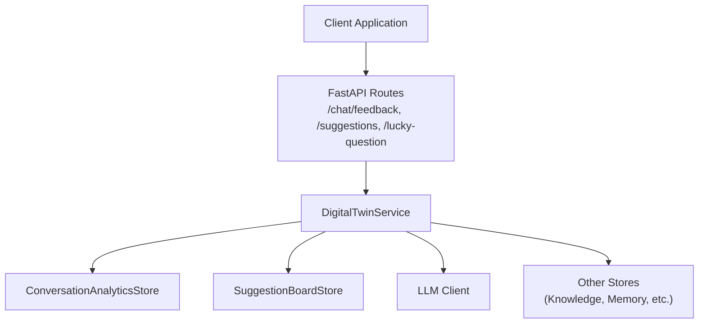
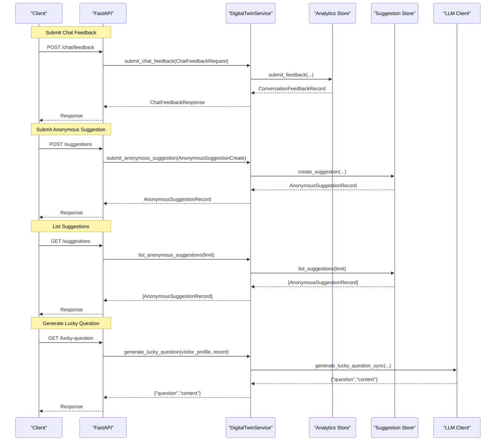
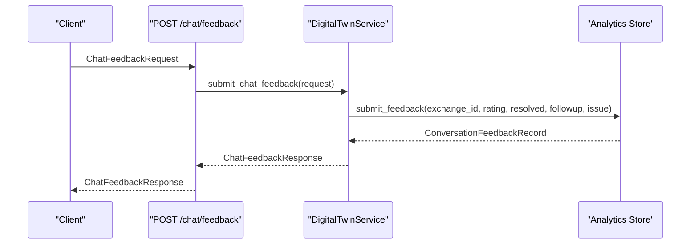
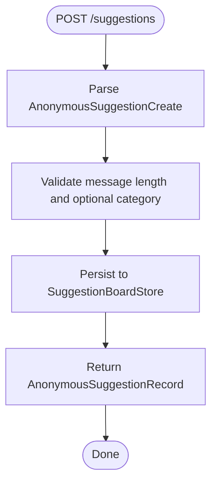
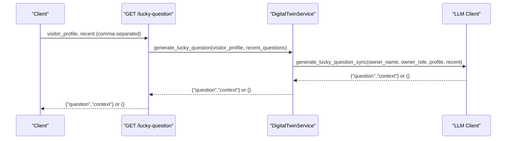
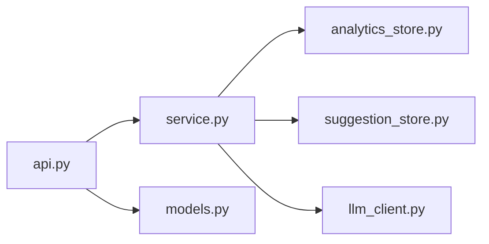

# Support and Feedback Endpoints

<cite>
**Referenced Files in This Document**
- [api.py](file://src/sage_faculty_twin/api.py)
- [models.py](file://src/sage_faculty_twin/models.py)
- [service.py](file://src/sage_faculty_twin/service.py)
- [suggestion_store.py](file://src/sage_faculty_twin/suggestion_store.py)
- [analytics_store.py](file://src/sage_faculty_twin/analytics_store.py)
- [llm_client.py](file://src/sage_faculty_twin/llm_client.py)
</cite>

## Table of Contents
1. [Introduction](#introduction)
2. [Project Structure](#project-structure)
3. [Core Components](#core-components)
4. [Architecture Overview](#architecture-overview)
5. [Detailed Component Analysis](#detailed-component-analysis)
6. [Dependency Analysis](#dependency-analysis)
7. [Performance Considerations](#performance-considerations)
8. [Troubleshooting Guide](#troubleshooting-guide)
9. [Conclusion](#conclusion)

## Introduction
This document provides comprehensive API documentation for support and feedback endpoints focused on:
- Chat feedback collection via `/chat/feedback`
- Anonymous suggestions via `/suggestions` endpoints
- Contextual question generation via `/lucky-question`

It covers request/response models, workflows, privacy considerations, moderation, and analytics implications. The goal is to help developers and operators implement, integrate, and maintain these features effectively.

## Project Structure
The support and feedback features are implemented within the FastAPI application (`api.py`) and backed by a service layer (`service.py`). Data models are defined centrally (`models.py`), while specialized stores handle persistence for suggestions (`suggestion_store.py`) and feedback analytics (`analytics_store.py`). Contextual question generation is delegated to the LLM client (`llm_client.py`).

**Diagram sources**
- [api.py:500-762](file://src/sage_faculty_twin/api.py#L500-L762)
- [service.py:2397-2467](file://src/sage_faculty_twin/service.py#L2397-L2467)
- [suggestion_store.py:45-84](file://src/sage_faculty_twin/suggestion_store.py#L45-L84)
- [analytics_store.py:99-142](file://src/sage_faculty_twin/analytics_store.py#L99-L142)
- [llm_client.py:440-516](file://src/sage_faculty_twin/llm_client.py#L440-L516)

**Section sources**
- [api.py:500-762](file://src/sage_faculty_twin/api.py#L500-L762)
- [service.py:2397-2467](file://src/sage_faculty_twin/service.py#L2397-L2467)

## Core Components
This section outlines the primary models and endpoints involved in support and feedback workflows.

- ChatFeedbackRequest and ChatFeedbackResponse
  - Used to submit feedback for a specific chat exchange and receive a structured response.
  - Validation ensures exchange_id exists and rating is constrained.

- AnonymousSuggestionCreate and AnonymousSuggestionRecord
  - Anonymous suggestions are persisted without user identification.
  - Records include creation timestamps and optional categorization.

- Lucky Question Generation
  - Endpoint `/lucky-question` generates contextual questions for "I'm feeling lucky".
  - Delegates to the LLM client with visitor profile and recent question avoidance.

Key endpoint definitions and handlers:
- POST `/chat/feedback`: Submits feedback for a chat exchange
- POST `/suggestions`: Creates an anonymous suggestion
- GET `/suggestions`: Lists recent anonymous suggestions
- GET `/lucky-question`: Generates a contextual question

**Section sources**
- [models.py:431-448](file://src/sage_faculty_twin/models.py#L431-L448)
- [models.py:450-460](file://src/sage_faculty_twin/models.py#L450-L460)
- [api.py:703-706](file://src/sage_faculty_twin/api.py#L703-L706)
- [api.py:743-751](file://src/sage_faculty_twin/api.py#L743-L751)
- [api.py:753-762](file://src/sage_faculty_twin/api.py#L753-L762)
- [api.py:549-572](file://src/sage_faculty_twin/api.py#L549-L572)

## Architecture Overview
The support and feedback architecture follows a layered design:
- API layer validates requests and delegates to the service
- Service orchestrates analytics, suggestion storage, and LLM interactions
- Stores persist feedback and suggestions to disk
- Moderation and analytics are integrated into feedback processing

**Diagram sources**
- [api.py:703-706](file://src/sage_faculty_twin/api.py#L703-L706)
- [api.py:743-751](file://src/sage_faculty_twin/api.py#L743-L751)
- [api.py:753-762](file://src/sage_faculty_twin/api.py#L753-L762)
- [api.py:549-572](file://src/sage_faculty_twin/api.py#L549-L572)
- [service.py:2397-2467](file://src/sage_faculty_twin/service.py#L2397-L2467)
- [service.py:6436-6457](file://src/sage_faculty_twin/service.py#L6436-L6457)
- [analytics_store.py:111-142](file://src/sage_faculty_twin/analytics_store.py#L111-L142)
- [suggestion_store.py:52-67](file://src/sage_faculty_twin/suggestion_store.py#L52-L67)
- [llm_client.py:440-516](file://src/sage_faculty_twin/llm_client.py#L440-L516)

## Detailed Component Analysis

### Chat Feedback Endpoint
Purpose:
- Collect feedback for a specific chat exchange, enabling analytics and potential knowledge write-back.

Key behaviors:
- Validates that the exchange exists; otherwise returns 404
- Persists feedback with timestamps and normalization of resolved state based on rating
- Optionally writes knowledge entries from web search references when feedback is positive and resolved

Privacy and moderation considerations:
- Feedback is associated with the exchange_id; administrators can review per-exchange feedback
- No personally identifiable information is stored with feedback itself
- Moderation workflows can be triggered by needs_human_followup and issue_summary

**Diagram sources**
- [api.py:703-706](file://src/sage_faculty_twin/api.py#L703-L706)
- [service.py:2397-2423](file://src/sage_faculty_twin/service.py#L2397-L2423)
- [analytics_store.py:111-142](file://src/sage_faculty_twin/analytics_store.py#L111-L142)

**Section sources**
- [api.py:703-706](file://src/sage_faculty_twin/api.py#L703-L706)
- [service.py:2397-2423](file://src/sage_faculty_twin/service.py#L2397-L2423)
- [models.py:431-448](file://src/sage_faculty_twin/models.py#L431-L448)

### Anonymous Suggestions Endpoints
Purpose:
- Allow users to submit anonymous suggestions without authentication
- Provide listing of recent suggestions for moderation and triage

Endpoints:
- POST `/suggestions`: Create a new anonymous suggestion
- GET `/suggestions`: List recent suggestions (admin-protected via session)

Processing logic:
- SuggestionBoardStore creates unique identifiers, strips whitespace, and persists to disk
- Listing is sorted by creation time (newest first) with configurable limits

**Diagram sources**
- [api.py:743-751](file://src/sage_faculty_twin/api.py#L743-L751)
- [service.py:2461-2467](file://src/sage_faculty_twin/service.py#L2461-L2467)
- [suggestion_store.py:52-67](file://src/sage_faculty_twin/suggestion_store.py#L52-L67)

**Section sources**
- [api.py:743-751](file://src/sage_faculty_twin/api.py#L743-L751)
- [api.py:753-762](file://src/sage_faculty_twin/api.py#L753-L762)
- [service.py:2461-2467](file://src/sage_faculty_twin/service.py#L2461-L2467)
- [models.py:450-460](file://src/sage_faculty_twin/models.py#L450-L460)
- [suggestion_store.py:45-84](file://src/sage_faculty_twin/suggestion_store.py#L45-L84)

### Contextual Question Generation (/lucky-question)
Purpose:
- Provide a contextual question for the "I'm feeling lucky" feature
- Avoid repeating recent questions and tailor to visitor profiles

Algorithm highlights:
- Accepts visitor_profile and recent questions as query parameters
- Calls service.generate_lucky_question which delegates to LLM client
- LLM client constructs system/user prompts tailored to the owner's work and visitor profile
- Returns JSON with question and context; falls back to empty dict on error

Privacy considerations:
- No personal data is captured; questions are generated based on visitor profile and recent history
- Recent questions are filtered locally to avoid repetition

**Diagram sources**
- [api.py:549-572](file://src/sage_faculty_twin/api.py#L549-L572)
- [service.py:6436-6457](file://src/sage_faculty_twin/service.py#L6436-L6457)
- [llm_client.py:440-516](file://src/sage_faculty_twin/llm_client.py#L440-L516)

**Section sources**
- [api.py:549-572](file://src/sage_faculty_twin/api.py#L549-L572)
- [service.py:6436-6457](file://src/sage_faculty_twin/service.py#L6436-L6457)
- [llm_client.py:440-516](file://src/sage_faculty_twin/llm_client.py#L440-L516)

## Dependency Analysis
The following diagram shows how the API routes depend on the service layer and underlying stores:

**Diagram sources**
- [api.py:500-762](file://src/sage_faculty_twin/api.py#L500-L762)
- [service.py:2397-2467](file://src/sage_faculty_twin/service.py#L2397-L2467)
- [analytics_store.py:99-142](file://src/sage_faculty_twin/analytics_store.py#L99-L142)
- [suggestion_store.py:45-84](file://src/sage_faculty_twin/suggestion_store.py#L45-L84)
- [llm_client.py:440-516](file://src/sage_faculty_twin/llm_client.py#L440-L516)
- [models.py:431-460](file://src/sage_faculty_twin/models.py#L431-L460)

**Section sources**
- [api.py:500-762](file://src/sage_faculty_twin/api.py#L500-L762)
- [service.py:2397-2467](file://src/sage_faculty_twin/service.py#L2397-L2467)

## Performance Considerations
- Feedback submission is synchronous and lightweight; analytics persistence is local-file based
- Suggestion creation and listing are bounded by configured limits and local disk I/O
- Lucky question generation is delegated to the LLM client with timeouts and graceful fallbacks
- Streaming answer delivery is supported for chat; feedback endpoints return immediate responses

[No sources needed since this section provides general guidance]

## Troubleshooting Guide
Common issues and resolutions:
- Feedback submission returns 404: The exchange_id does not correspond to an existing record
  - Verify the exchange_id and ensure the conversation exists
- Lucky question endpoint returns empty: LLM generation failed or timed out
  - Retry or fall back to static question bank
- Suggestion listing returns empty: No suggestions found or insufficient permissions
  - Confirm admin session cookie and limit values

Operational checks:
- Health endpoint indicates service readiness and backend metrics
- Analytics store maintains feedback counts and recent activity snapshots

**Section sources**
- [service.py:2406-2410](file://src/sage_faculty_twin/service.py#L2406-L2410)
- [llm_client.py:513-516](file://src/sage_faculty_twin/llm_client.py#L513-L516)
- [analytics_store.py:146-148](file://src/sage_faculty_twin/analytics_store.py#L146-L148)

## Conclusion
The support and feedback endpoints provide a robust foundation for collecting user sentiment, managing anonymous suggestions, and generating contextual assistance. The design emphasizes privacy (anonymous submissions), resilience (graceful fallbacks), and operability (local persistence and admin controls). Integrators should focus on proper validation, moderation workflows, and analytics alignment to maximize value from these features.