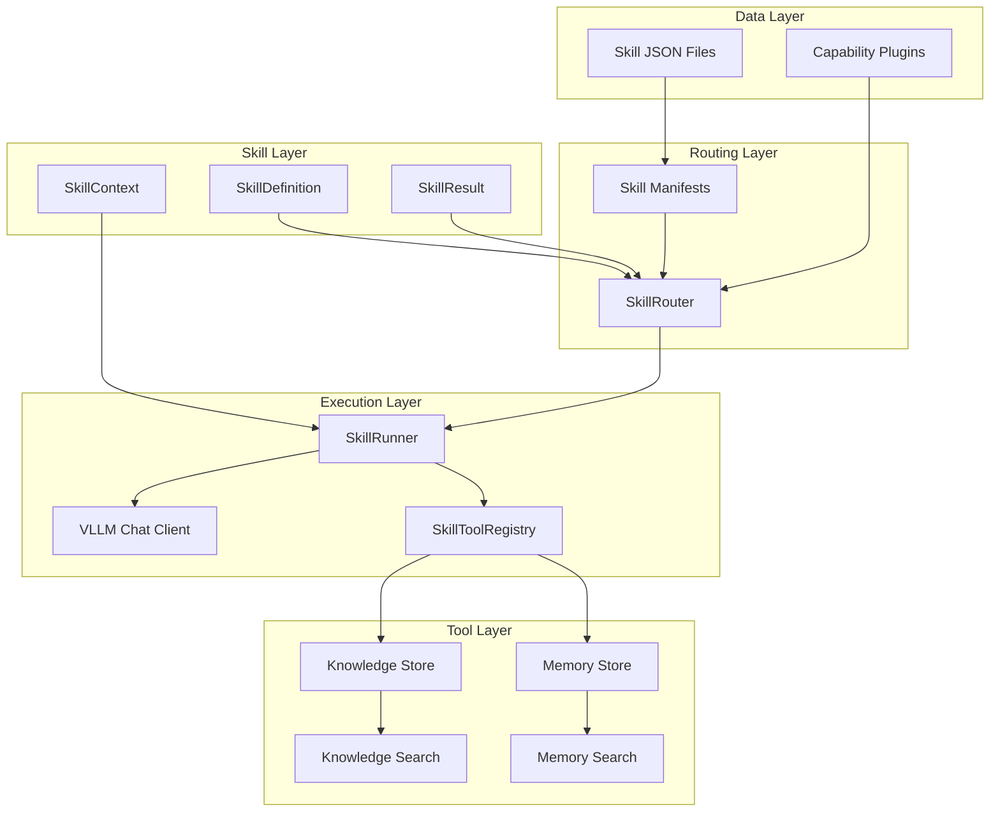
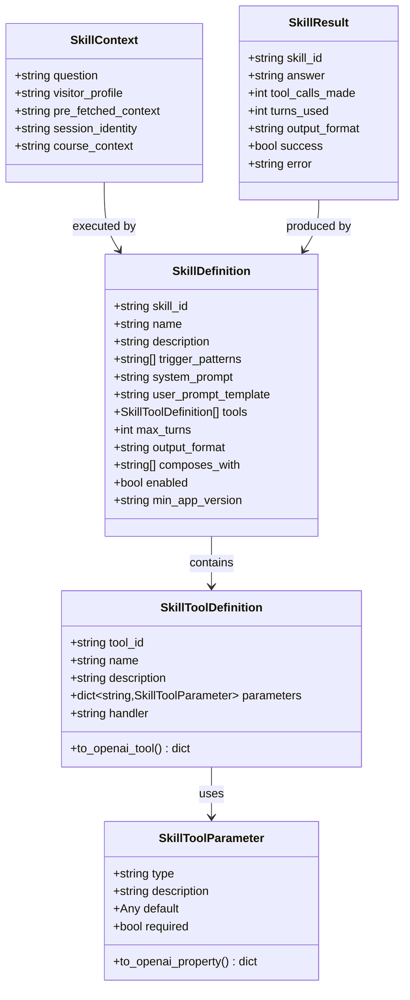
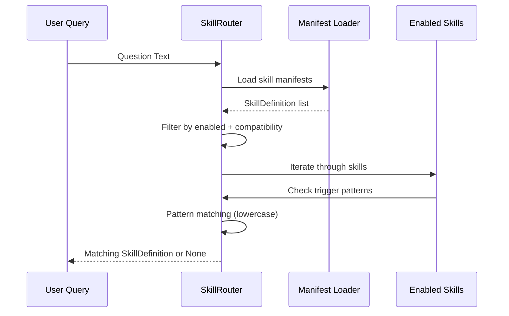
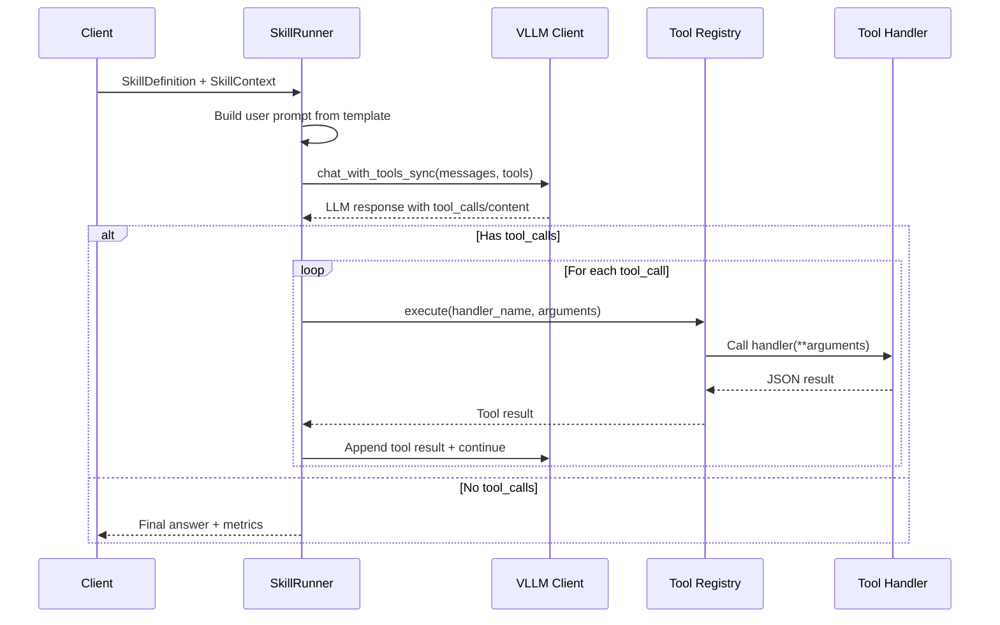
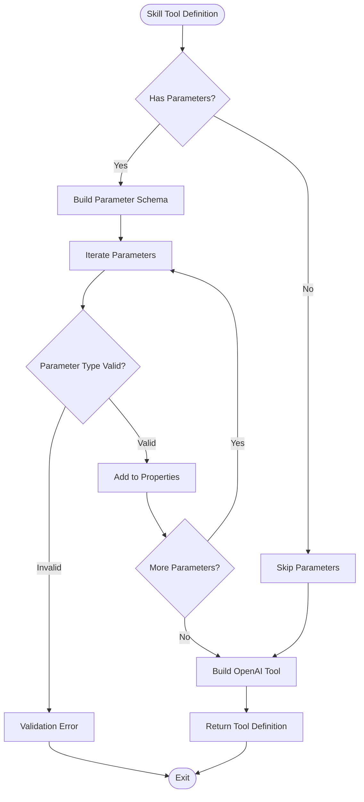
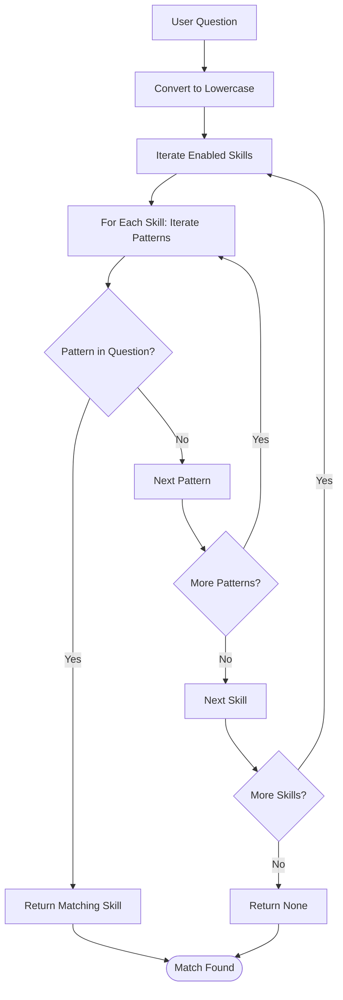
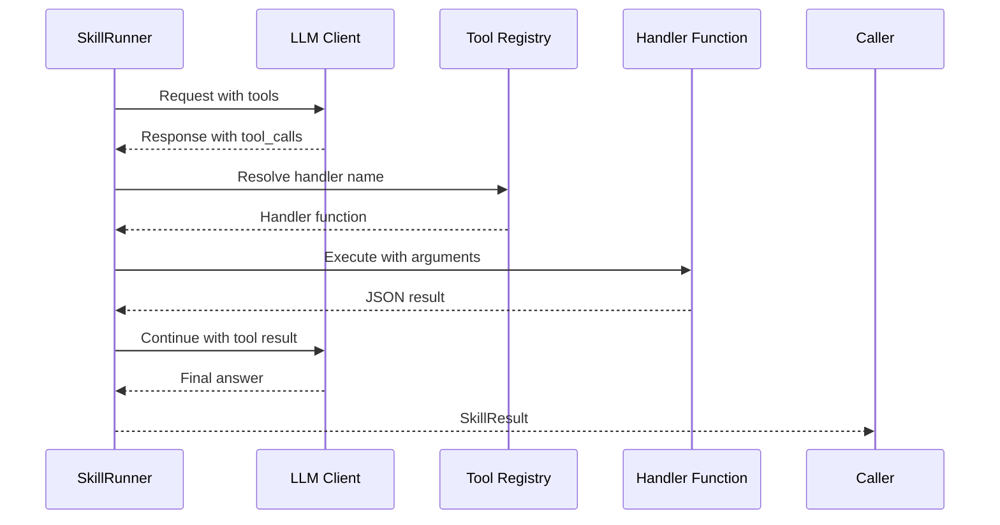

# Agent Skill System

<cite>
**Referenced Files in This Document**
- [skills.py](file://src/sage_faculty_twin/skills.py)
- [skill_router.py](file://src/sage_faculty_twin/skill_router.py)
- [skill_runner.py](file://src/sage_faculty_twin/skill_runner.py)
- [skill_tools.py](file://src/sage_faculty_twin/skill_tools.py)
- [capability_plugins.py](file://src/sage_faculty_twin/capability_plugins.py)
- [workflow_steps.py](file://src/sage_faculty_twin/workflow_steps.py)
- [course_advising.json](file://data/skills/course_advising.json)
- [meeting_prep.json](file://data/skills/meeting_prep.json)
- [paper_feedback.json](file://data/skills/paper_feedback.json)
- [research_mentoring.json](file://data/skills/research_mentoring.json)
- [thesis_review.json](file://data/skills/thesis_review.json)
</cite>

## Table of Contents
1. [Introduction](#introduction)
2. [System Architecture](#system-architecture)
3. [Core Components](#core-components)
4. [Skill Definition Schema](#skill-definition-schema)
5. [Skill Router](#skill-router)
6. [Skill Runner](#skill-runner)
7. [Skill Tools Registry](#skill-tools-registry)
8. [Capability Plugins](#capability-plugins)
9. [Workflow Steps Integration](#workflow-steps-integration)
10. [Skill Manifest Examples](#skill-manifest-examples)
11. [Performance Considerations](#performance-considerations)
12. [Troubleshooting Guide](#troubleshooting-guide)
13. [Conclusion](#conclusion)

## Introduction

The Agent Skill System is a modular, manifest-driven framework that enables the Sage Faculty Twin platform to deliver specialized AI capabilities through self-contained skill units. Each skill represents a focused agent capability with built-in prompts, tool definitions, and composability features. The system supports five primary academic domains: Course Advising, Meeting Preparation, Paper Writing Feedback, Research Mentoring, and Thesis Review.

The framework leverages modern AI patterns including function-calling with tool execution, multi-turn reasoning loops, and structured output formats. Skills are designed to be version-compatible, enabling gradual feature rollout and backward compatibility maintenance.

## System Architecture

The Agent Skill System follows a layered architecture that separates concerns between skill definition, routing, execution, and tool management.



**Diagram sources**
- [skills.py:70-120](file://src/sage_faculty_twin/skills.py#L70-L120)
- [skill_router.py:22-103](file://src/sage_faculty_twin/skill_router.py#L22-L103)
- [skill_runner.py:24-50](file://src/sage_faculty_twin/skill_runner.py#L24-L50)
- [skill_tools.py:22-71](file://src/sage_faculty_twin/skill_tools.py#L22-L71)

## Core Components

### Skill Definition Schema

The foundation of the skill system is built around Pydantic models that enforce strict validation and type safety. The core schema defines the structure for skill manifests, tool definitions, and runtime contexts.



**Diagram sources**
- [skills.py:70-120](file://src/sage_faculty_twin/skills.py#L70-L120)
- [skills.py:19-68](file://src/sage_faculty_twin/skills.py#L19-L68)
- [skills.py:96-120](file://src/sage_faculty_twin/skills.py#L96-L120)

**Section sources**
- [skills.py:19-164](file://src/sage_faculty_twin/skills.py#L19-L164)

### Skill Router

The SkillRouter component handles the intelligent dispatching of user queries to appropriate skills based on trigger patterns. It maintains separate lists for all loaded skills and only enabled, compatible skills for matching.



**Diagram sources**
- [skill_router.py:35-87](file://src/sage_faculty_twin/skill_router.py#L35-L87)

**Section sources**
- [skill_router.py:22-123](file://src/sage_faculty_twin/skill_router.py#L22-L123)

### Skill Runner

The SkillRunner orchestrates the execution of skills through multi-turn tool-calling reasoning loops. It manages the conversation flow between the LLM and tool handlers, handling both tool-enabled and single-turn scenarios.



**Diagram sources**
- [skill_runner.py:35-178](file://src/sage_faculty_twin/skill_runner.py#L35-L178)

**Section sources**
- [skill_runner.py:24-219](file://src/sage_faculty_twin/skill_runner.py#L24-L219)

## Skill Definition Schema

The skill system employs a comprehensive schema that defines the structure and behavior of each skill unit. The schema ensures type safety and provides clear contracts for skill development.

### Core Skill Properties

Each SkillDefinition contains essential metadata and behavioral configuration:

- **skill_id**: Unique identifier for the skill
- **name**: Human-readable skill name
- **description**: Purpose and capabilities description
- **trigger_patterns**: Case-insensitive keywords for activation
- **system_prompt**: Role definition and behavior guidelines
- **user_prompt_template**: Template for dynamic context injection
- **tools**: Function-calling tool definitions
- **max_turns**: Maximum reasoning loop iterations
- **output_format**: Response format specification
- **composes_with**: Composable skill dependencies
- **enabled**: Activation status
- **min_app_version**: Version compatibility requirement

### Tool Definition System

Skills declare their tool requirements through a structured interface that supports OpenAI-style function calling:



**Diagram sources**
- [skills.py:37-68](file://src/sage_faculty_twin/skills.py#L37-L68)

**Section sources**
- [skills.py:70-94](file://src/sage_faculty_twin/skills.py#L70-L94)

## Skill Router

The SkillRouter implements intelligent pattern-based skill selection with comprehensive filtering and logging capabilities.

### Loading and Filtering Process

The router performs multi-stage filtering to ensure only suitable skills are considered:

1. **Manifest Loading**: Load all skill JSON files from the configured directory
2. **Compatibility Check**: Verify minimum app version requirements
3. **Enabled Status**: Filter out disabled skills
4. **Pattern Matching**: Case-insensitive substring matching

### Matching Algorithm

The router uses a greedy matching approach that returns the first skill with a successful pattern match:



**Diagram sources**
- [skill_router.py:65-87](file://src/sage_faculty_twin/skill_router.py#L65-L87)

**Section sources**
- [skill_router.py:22-123](file://src/sage_faculty_twin/skill_router.py#L22-L123)

## Skill Runner

The SkillRunner manages the complete execution lifecycle of skills, implementing sophisticated multi-turn reasoning with tool integration.

### Execution Flow

The runner implements a robust execution loop that handles both tool-enabled and single-turn scenarios:

1. **Prompt Construction**: Dynamic template formatting with context injection
2. **Tool Registration**: Conversion of skill tools to OpenAI-compatible format
3. **Multi-turn Loop**: Iterative reasoning with tool execution
4. **Result Processing**: Structured response assembly and metrics collection

### Tool Execution Protocol

When tool calls are detected, the runner follows a standardized protocol:



**Diagram sources**
- [skill_runner.py:82-162](file://src/sage_faculty_twin/skill_runner.py#L82-L162)

**Section sources**
- [skill_runner.py:24-219](file://src/sage_faculty_twin/skill_runner.py#L24-L219)

## Skill Tools Registry

The SkillToolRegistry provides a centralized mechanism for registering and executing tool handlers that skills can invoke during execution.

### Built-in Tool Handlers

The registry includes comprehensive coverage of academic domain tools:

- **Knowledge Search**: Semantic search across the knowledge base
- **Memory Search**: Conversation history retrieval
- **Team Schedule**: Meeting and availability lookup
- **Blockers**: Unresolved issues tracking
- **Paper Digest**: Academic paper summarization
- **Courseware**: Educational resource discovery
- **Writing Rubric**: Evaluation criteria retrieval

### Handler Execution Model

The registry implements a robust handler execution model with error handling and JSON serialization:

```mermaid
flowchart TD
HandlerCall[execute(handler_name, arguments)] --> Lookup{Handler Exists?}
Lookup --> |No| UnknownError[Return Unknown Tool Error]
Lookup --> |Yes| TryExecute[Try Handler Execution]
TryExecute --> Success{Execution Success?}
Success --> |Yes| Serialize[Serialize Result]
Success --> |No| ErrorHandler[Log Error + Return JSON]
Serialize --> ReturnResult[Return JSON String]
ErrorHandler --> ReturnResult
UnknownError --> ReturnResult
```

**Diagram sources**
- [skill_tools.py:53-66](file://src/sage_faculty_twin/skill_tools.py#L53-L66)

**Section sources**
- [skill_tools.py:22-284](file://src/sage_faculty_twin/skill_tools.py#L22-L284)

## Capability Plugins

While primarily focused on skills, the system integrates with capability plugins that extend workflow functionality through manifest-driven registration.

### Plugin Architecture

Capability plugins introduce additional workflow steps and policy requirements:

- **Manifest Validation**: Pydantic-based schema validation
- **Version Compatibility**: SemVer-based compatibility checking
- **Step Registration**: Dynamic workflow step integration
- **Policy Enforcement**: Administrative and ownership requirements

**Section sources**
- [capability_plugins.py:173-217](file://src/sage_faculty_twin/capability_plugins.py#L173-L217)

## Workflow Steps Integration

The skill system integrates with the broader workflow orchestration through shared step definitions and execution patterns.

### Default Step Registry

The system provides a comprehensive set of default workflow steps covering the complete interaction lifecycle:

- **Context Detection**: Profile and course context normalization
- **Intent Classification**: Interaction purpose determination
- **Knowledge Retrieval**: Grounded information fetching
- **Response Generation**: Citated answer creation
- **Memory Management**: Conversation and artifact persistence
- **Quality Assurance**: Knowledge gap detection and follow-up

**Section sources**
- [workflow_steps.py:23-174](file://src/sage_faculty_twin/workflow_steps.py#L23-L174)

## Skill Manifest Examples

The system includes five comprehensive skill manifests that demonstrate the full spectrum of capabilities:

### Course Advising

Focuses on academic course selection and study planning with integrated course material discovery.

### Meeting Preparation

Supports structured meeting coordination with team scheduling and progress tracking.

### Paper Writing Feedback

Provides detailed writing assistance with rubric-based evaluation and improvement suggestions.

### Research Mentoring

Guides graduate students through research methodology and literature review processes.

### Thesis Review

Delivers comprehensive manuscript evaluation with comparative analysis capabilities.

**Section sources**
- [course_advising.json:1-77](file://data/skills/course_advising.json#L1-L77)
- [meeting_prep.json:1-85](file://data/skills/meeting_prep.json#L1-L85)
- [paper_feedback.json:1-58](file://data/skills/paper_feedback.json#L1-L58)
- [research_mentoring.json:1-76](file://data/skills/research_mentoring.json#L1-L76)
- [thesis_review.json:1-77](file://data/skills/thesis_review.json#L1-L77)

## Performance Considerations

The skill system is designed with several performance optimization strategies:

### Asynchronous Operations
- Non-blocking tool execution through registry pattern
- Concurrent skill loading and validation
- Efficient pattern matching with early termination

### Resource Management
- Configurable maximum turns to prevent runaway execution
- Temperature control for deterministic responses
- Memory-efficient context building

### Caching Strategies
- Tool result caching through registry handlers
- Manifest validation caching
- Compatible skill filtering optimization

## Troubleshooting Guide

Common issues and their resolution strategies:

### Skill Loading Failures
- **Manifest Validation Errors**: Check JSON schema compliance
- **File Access Issues**: Verify file permissions and paths
- **Version Compatibility**: Ensure minimum app version requirements

### Execution Problems
- **Template Variable Errors**: Validate required context variables
- **Tool Handler Failures**: Check handler registration and dependencies
- **LLM Integration Issues**: Verify client connectivity and credentials

### Performance Issues
- **Slow Response Times**: Monitor tool execution latency
- **Memory Leaks**: Check for proper resource cleanup
- **High Turn Counts**: Adjust max_turns configuration

**Section sources**
- [skills.py:122-164](file://src/sage_faculty_twin/skills.py#L122-L164)
- [skill_runner.py:91-98](file://src/sage_faculty_twin/skill_runner.py#L91-L98)

## Conclusion

The Agent Skill System represents a sophisticated, modular approach to AI capability delivery in academic environments. Through its manifest-driven design, comprehensive tool integration, and robust execution framework, it provides a scalable foundation for specialized AI services.

The system's strength lies in its separation of concerns, enabling independent development and deployment of skill capabilities while maintaining consistent behavior and quality standards. The integration with workflow orchestration and capability plugins creates a comprehensive ecosystem for academic AI applications.

Future enhancements could include dynamic skill composition, advanced caching mechanisms, and expanded tool handler capabilities to further enhance the system's adaptability and performance.