# Authentication System

<cite>
**Referenced Files in This Document**
- [auth.py](file://src/sage_faculty_twin/auth.py)
- [user_store.py](file://src/sage_faculty_twin/user_store.py)
- [models.py](file://src/sage_faculty_twin/models.py)
- [api.py](file://src/sage_faculty_twin/api.py)
- [config.py](file://src/sage_faculty_twin/config.py)
- [service.py](file://src/sage_faculty_twin/service.py)
- [history_auth.py](file://src/sage_faculty_twin/history_auth.py)
- [app.js](file://src/sage_faculty_twin/web/app.js)
- [index.html](file://src/sage_faculty_twin/web/index.html)
- [test_admin_auth.py](file://tests/test_admin_auth.py)
- [test_history_auth.py](file://tests/test_history_auth.py)
</cite>

## Update Summary
**Changes Made**
- Added new authentication endpoints: /auth/user/register and /auth/user/login
- Enhanced error handling with automatic scrolling to inline status elements
- Implemented progressive onboarding for newly authenticated users
- Updated session management with enhanced user authentication workflows
- Improved frontend integration with automatic onboarding triggers

## Table of Contents
1. [Introduction](#introduction)
2. [Project Structure](#project-structure)
3. [Core Components](#core-components)
4. [Architecture Overview](#architecture-overview)
5. [Detailed Component Analysis](#detailed-component-analysis)
6. [Dependency Analysis](#dependency-analysis)
7. [Performance Considerations](#performance-considerations)
8. [Troubleshooting Guide](#troubleshooting-guide)
9. [Conclusion](#conclusion)

## Introduction
This document provides comprehensive documentation for the authentication and authorization system. It explains session token generation and validation for both users and administrators, the authentication middleware, token encoding/decoding processes, and session management lifecycle. It also covers user registration and login workflows, credential validation, role-based access control, implementation examples for authentication decorators, session handling, security best practices, token expiration and refresh mechanisms, audit logging for authentication events, and integration with user stores and session persistence.

**Updated** Enhanced with new user authentication endpoints, improved error handling with automatic scrolling, and progressive onboarding for newly authenticated users.

## Project Structure
The authentication system spans several modules with integrated frontend components:
- Token encoding/decoding and session cookie management
- User account storage and password hashing with invitation code validation
- API endpoints for authentication and protected routes
- Configuration for session secrets, TTLs, and invitation code policies
- Service layer orchestrating authentication workflows with invitation code processing
- Authorization helpers for resource access control
- Progressive onboarding system for new user authentication
- Enhanced error handling with automatic UI feedback

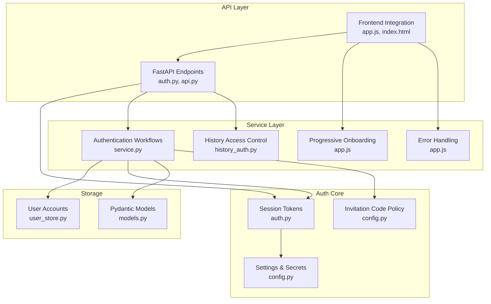

**Diagram sources**
- [auth.py:1-214](file://src/sage_faculty_twin/auth.py#L1-L214)
- [user_store.py:1-208](file://src/sage_faculty_twin/user_store.py#L1-L208)
- [models.py:741-755](file://src/sage_faculty_twin/models.py#L741-L755)
- [api.py:510-521](file://src/sage_faculty_twin/api.py#L510-L521)
- [config.py:140-148](file://src/sage_faculty_twin/config.py#L140-L148)
- [service.py:2914-2942](file://src/sage_faculty_twin/service.py#L2914-L2942)
- [history_auth.py:6-27](file://src/sage_faculty_twin/history_auth.py#L6-L27)
- [app.js:8021-8051](file://src/sage_faculty_twin/web/app.js#L8021-L8051)
- [index.html:184-202](file://src/sage_faculty_twin/web/index.html#L184-L202)

**Section sources**
- [auth.py:1-214](file://src/sage_faculty_twin/auth.py#L1-L214)
- [user_store.py:1-208](file://src/sage_faculty_twin/user_store.py#L1-L208)
- [models.py:741-755](file://src/sage_faculty_twin/models.py#L741-L755)
- [api.py:510-521](file://src/sage_faculty_twin/api.py#L510-L521)
- [config.py:140-148](file://src/sage_faculty_twin/config.py#L140-L148)
- [service.py:2914-2942](file://src/sage_faculty_twin/service.py#L2914-L2942)
- [history_auth.py:6-27](file://src/sage_faculty_twin/history_auth.py#L6-L27)
- [app.js:8021-8051](file://src/sage_faculty_twin/web/app.js#L8021-L8051)
- [index.html:184-202](file://src/sage_faculty_twin/web/index.html#L184-L202)

## Core Components
- Session token encoding/decoding for administrators and users
- Cookie-based session management with HttpOnly and SameSite policies
- User registration with secure password hashing, email normalization, and invitation code validation
- Login validation with timing-safe comparisons and optional invitation code-based profile upgrades
- Role-based access control for administrative endpoints
- Protected resource access control for user history
- Invitation code enforcement for lab member registration and profile upgrades
- Configuration-driven session secrets, TTLs, and invitation code policies
- Progressive onboarding system for newly authenticated users
- Enhanced error handling with automatic UI feedback and smooth scrolling

**Updated** Added new user authentication endpoints (/auth/user/register, /auth/user/login) and progressive onboarding system for enhanced user experience.

**Section sources**
- [auth.py:16-214](file://src/sage_faculty_twin/auth.py#L16-L214)
- [user_store.py:71-161](file://src/sage_faculty_twin/user_store.py#L71-L161)
- [models.py:741-755](file://src/sage_faculty_twin/models.py#L741-L755)
- [api.py:510-521](file://src/sage_faculty_twin/api.py#L510-L521)
- [config.py:140-148](file://src/sage_faculty_twin/config.py#L140-L148)
- [service.py:2914-2942](file://src/sage_faculty_twin/service.py#L2914-L2942)
- [history_auth.py:6-27](file://src/sage_faculty_twin/history_auth.py#L6-L27)
- [app.js:8021-8051](file://src/sage_faculty_twin/web/app.js#L8021-L8051)

## Architecture Overview
The authentication system follows a layered architecture with enhanced user authentication endpoints and progressive onboarding:
- API layer exposes endpoints for user registration/login and protected resources with invitation code support
- Service layer validates credentials, processes invitation codes, builds sessions, and enforces RBAC
- Auth module handles token encoding/decoding and cookie management
- Storage layer persists user accounts, manages password hashes, and validates invitation codes
- Configuration module defines secrets, session lifetimes, and invitation code policies
- Progressive onboarding system provides guided user experience for new authenticated users
- Enhanced error handling with automatic UI feedback and smooth scrolling

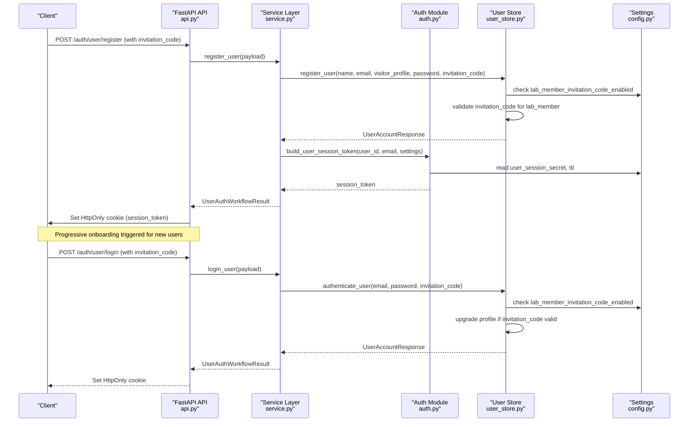

**Diagram sources**
- [api.py:510-521](file://src/sage_faculty_twin/api.py#L510-L521)
- [service.py:2914-2928](file://src/sage_faculty_twin/service.py#L2914-L2928)
- [auth.py:45-54](file://src/sage_faculty_twin/auth.py#L45-L54)
- [user_store.py:71-121](file://src/sage_faculty_twin/user_store.py#L71-L121)
- [config.py:140-148](file://src/sage_faculty_twin/config.py#L140-L148)

## Detailed Component Analysis

### New User Authentication Endpoints
The system now includes dedicated endpoints for user authentication with enhanced error handling:
- POST /auth/user/register: Creates new user accounts with validation and invitation code processing
- POST /auth/user/login: Authenticates existing users with optional profile upgrades
- POST /auth/user/logout: Clears user session cookies and resets state
- Enhanced error handling with automatic UI feedback and smooth scrolling

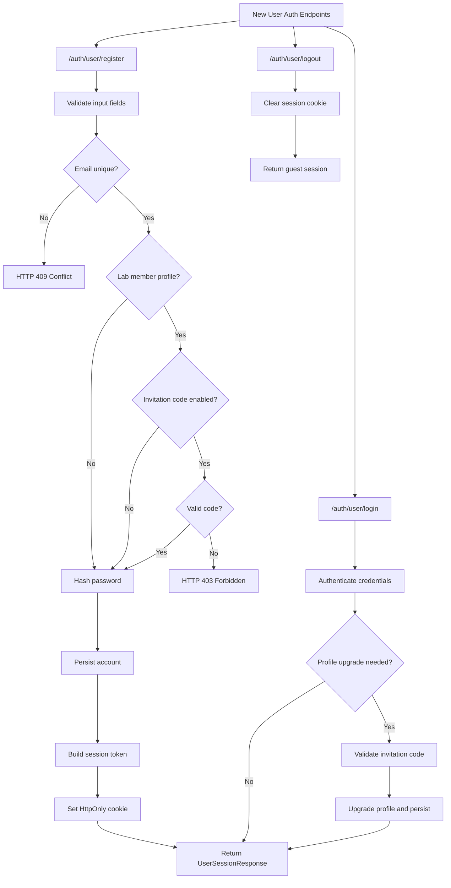

**Diagram sources**
- [api.py:512-523](file://src/sage_faculty_twin/api.py#L512-L523)
- [service.py:2915-2943](file://src/sage_faculty_twin/service.py#L2915-L2943)
- [user_store.py:71-161](file://src/sage_faculty_twin/user_store.py#L71-L161)

**Section sources**
- [api.py:512-523](file://src/sage_faculty_twin/api.py#L512-L523)
- [service.py:2915-2943](file://src/sage_faculty_twin/service.py#L2915-L2943)
- [user_store.py:71-161](file://src/sage_faculty_twin/user_store.py#L71-L161)

### Progressive Onboarding System
The authentication system now includes a progressive onboarding system for newly authenticated users:
- Automatic onboarding initiation for new users who haven't completed the process
- Profile-specific onboarding steps with completion tracking
- Smooth user experience with guided setup and helpful hints
- Local storage persistence for onboarding state across sessions

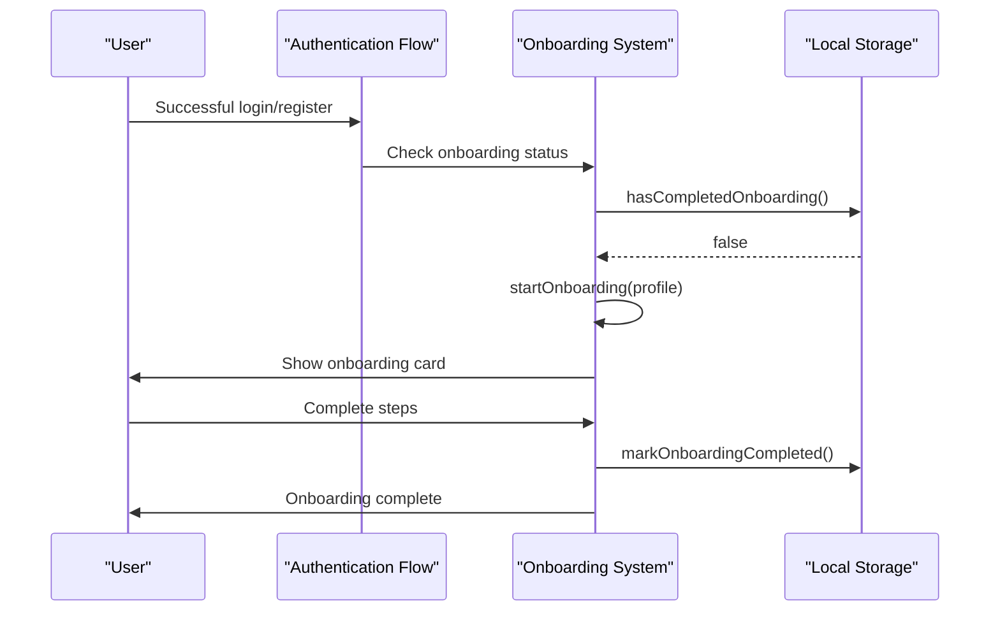

**Diagram sources**
- [app.js:2832-2837](file://src/sage_faculty_twin/web/app.js#L2832-L2837)
- [app.js:795-807](file://src/sage_faculty_twin/web/app.js#L795-L807)
- [app.js:653-693](file://src/sage_faculty_twin/web/app.js#L653-L693)

**Section sources**
- [app.js:2832-2837](file://src/sage_faculty_twin/web/app.js#L2832-L2837)
- [app.js:795-807](file://src/sage_faculty_twin/web/app.js#L795-L807)
- [app.js:653-693](file://src/sage_faculty_twin/web/app.js#L653-L693)

### Enhanced Error Handling with Automatic Scrolling
The system now includes improved error handling with automatic UI feedback:
- Inline status elements with automatic scrolling to error messages
- Smooth scrolling behavior for better user experience
- Context-aware error messaging for authentication failures
- Consistent error presentation across all authentication flows

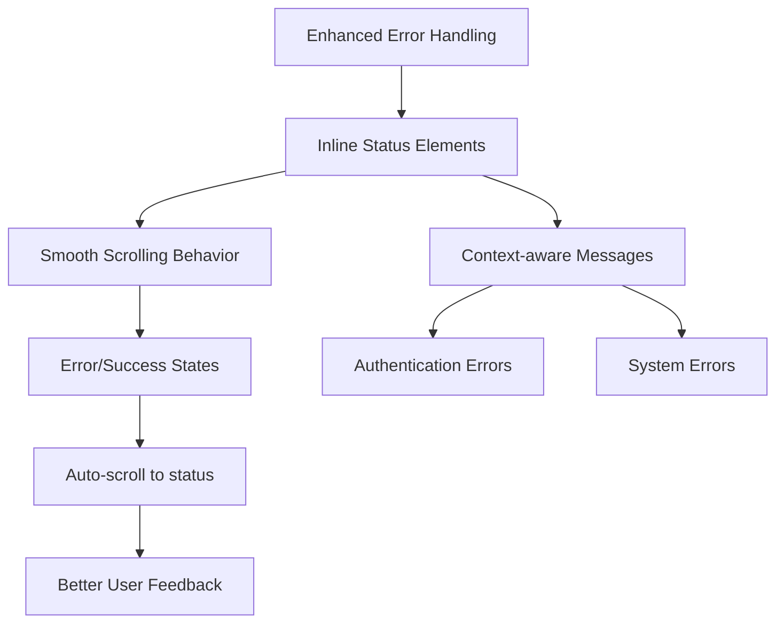

**Diagram sources**
- [app.js:4992-5000](file://src/sage_faculty_twin/web/app.js#L4992-L5000)
- [app.js:2832-2837](file://src/sage_faculty_twin/web/app.js#L2832-L2837)

**Section sources**
- [app.js:4992-5000](file://src/sage_faculty_twin/web/app.js#L4992-L5000)
- [app.js:2832-2837](file://src/sage_faculty_twin/web/app.js#L2832-L2837)

### Session Token Generation and Validation
- Administrator and user sessions use distinct cookies and secrets
- Tokens are JSON payloads encoded with URL-safe base64 and signed with HMAC-SHA256
- Expiration is enforced by comparing exp against current Unix time
- Nonces are included to mitigate replay risks

**Diagram sources**
- [auth.py:193-214](file://src/sage_faculty_twin/auth.py#L193-L214)

**Section sources**
- [auth.py:182-214](file://src/sage_faculty_twin/auth.py#L182-L214)

### Authentication Middleware and Decorators
- API endpoints use dependency injection to enforce admin sessions
- The require_admin_session dependency decodes and normalizes admin payloads
- Protected routes depend on require_admin_session to gate access

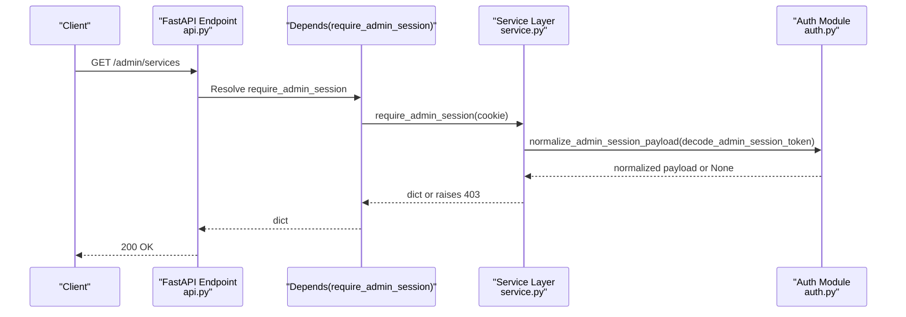

**Diagram sources**
- [api.py:497-507](file://src/sage_faculty_twin/api.py#L497-L507)
- [api.py:490-492](file://src/sage_faculty_twin/api.py#L490-L492)
- [service.py:5600-5609](file://src/sage_faculty_twin/service.py#L5600-L5609)
- [auth.py:119-129](file://src/sage_faculty_twin/auth.py#L119-L129)

**Section sources**
- [api.py:490-492](file://src/sage_faculty_twin/api.py#L490-L492)
- [api.py:497-507](file://src/sage_faculty_twin/api.py#L497-L507)
- [service.py:5600-5609](file://src/sage_faculty_twin/service.py#L5600-L5609)
- [auth.py:119-129](file://src/sage_faculty_twin/auth.py#L119-L129)

### Token Encoding/Decoding Processes
- Payload construction includes subject, email/role, issued-at, expiration, and nonce
- Secret is per-role (admin vs user) and configurable
- Signature uses HMAC-SHA256 over base64-encoded payload
- Decoding validates signature and checks expiration

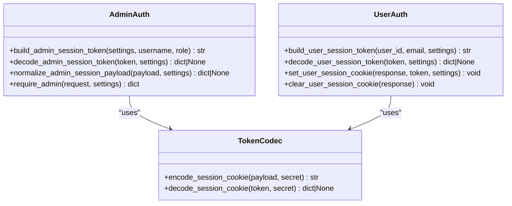

**Diagram sources**
- [auth.py:24-86](file://src/sage_faculty_twin/auth.py#L24-L86)
- [auth.py:182-214](file://src/sage_faculty_twin/auth.py#L182-L214)

**Section sources**
- [auth.py:24-86](file://src/sage_faculty_twin/auth.py#L24-L86)
- [auth.py:182-214](file://src/sage_faculty_twin/auth.py#L182-L214)

### Session Management Lifecycle
- User registration creates a new account with hashed password, normalized email, and optional invitation code validation
- Login authenticates credentials and optionally upgrades profile based on invitation code
- Session cookie is validated on subsequent requests
- Logout clears the session cookie and returns anonymous state
- Progressive onboarding triggers for newly authenticated users

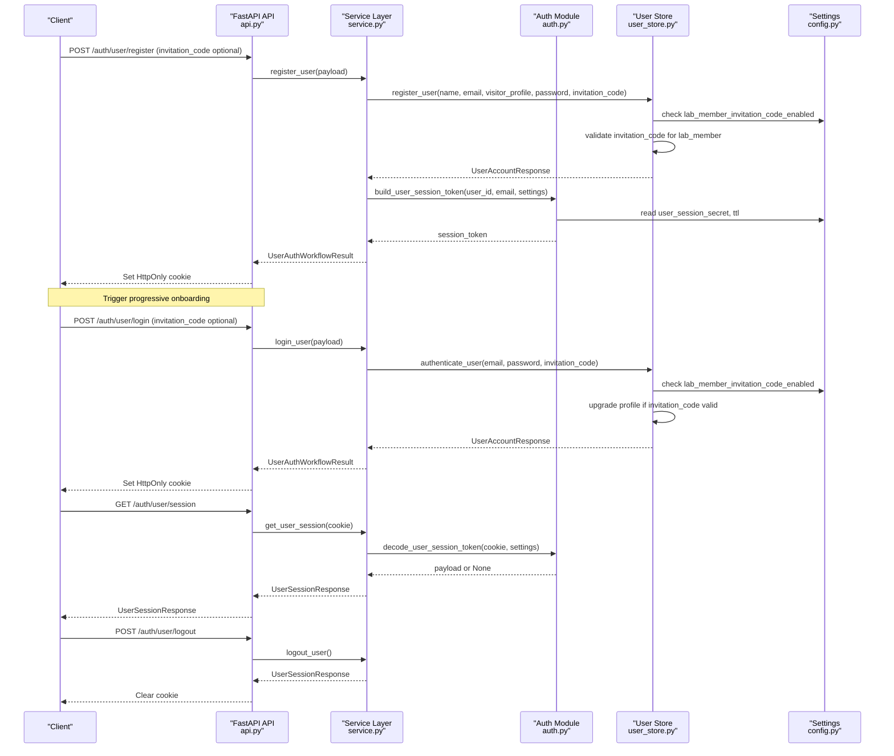

**Diagram sources**
- [api.py:510-521](file://src/sage_faculty_twin/api.py#L510-L521)
- [service.py:2914-2942](file://src/sage_faculty_twin/service.py#L2914-L2942)
- [auth.py:45-86](file://src/sage_faculty_twin/auth.py#L45-L86)
- [user_store.py:71-161](file://src/sage_faculty_twin/user_store.py#L71-L161)
- [config.py:140-148](file://src/sage_faculty_twin/config.py#L140-L148)

**Section sources**
- [api.py:510-521](file://src/sage_faculty_twin/api.py#L510-L521)
- [service.py:2914-2942](file://src/sage_faculty_twin/service.py#L2914-L2942)
- [auth.py:45-86](file://src/sage_faculty_twin/auth.py#L45-L86)
- [user_store.py:71-161](file://src/sage_faculty_twin/user_store.py#L71-L161)
- [config.py:140-148](file://src/sage_faculty_twin/config.py#L140-L148)

### Enhanced User Registration and Login Workflows
- Registration validates inputs, normalizes email, checks uniqueness, validates invitation code for lab members, and stores hashed credentials
- Login validates credentials using timing-safe comparison and optionally upgrades profile based on invitation code
- Both workflows issue session cookies and return session responses
- Invitation code validation is configurable and can be enabled/disabled
- Progressive onboarding triggers automatically for new users

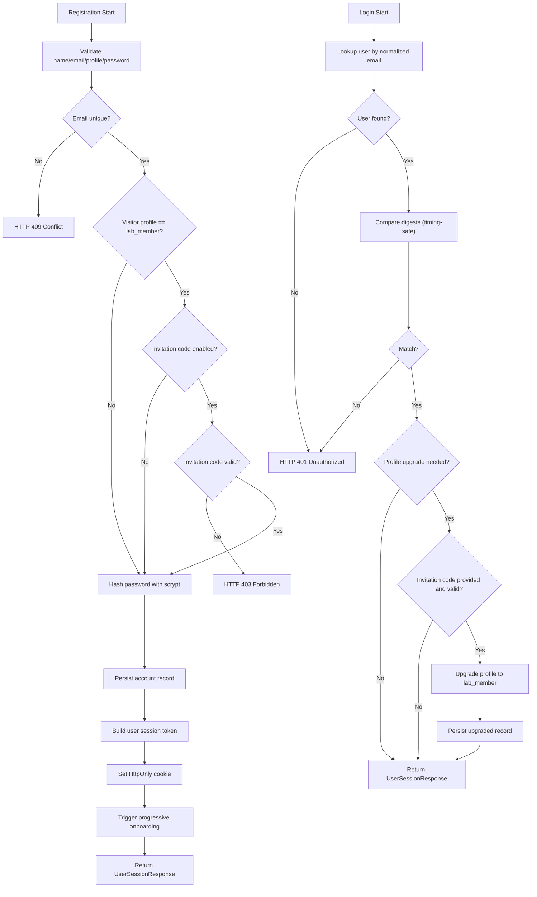

**Diagram sources**
- [user_store.py:71-161](file://src/sage_faculty_twin/user_store.py#L71-L161)
- [auth.py:158-173](file://src/sage_faculty_twin/auth.py#L158-L173)

**Section sources**
- [user_store.py:71-161](file://src/sage_faculty_twin/user_store.py#L71-L161)
- [auth.py:158-173](file://src/sage_faculty_twin/auth.py#L158-L173)

### Invitation Code Functionality
- Invitation code validation occurs during user registration for lab member profiles
- Invitation code validation can trigger profile upgrades during login for non-lab members
- Configuration controls whether invitation code enforcement is enabled and what the expected code is
- Frontend automatically sets visitor profile to lab_member when invitation code is provided

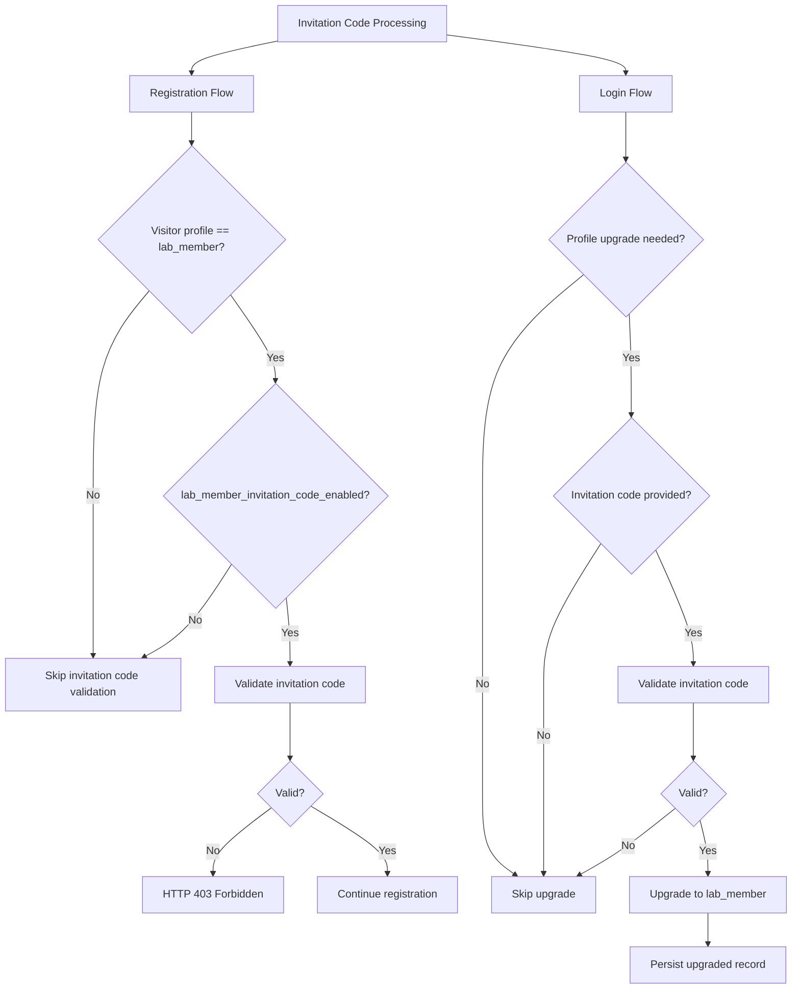

**Diagram sources**
- [user_store.py:92-161](file://src/sage_faculty_twin/user_store.py#L92-L161)
- [config.py:140-148](file://src/sage_faculty_twin/config.py#L140-L148)
- [app.js:807-808](file://src/sage_faculty_twin/web/app.js#L807-L808)

**Section sources**
- [user_store.py:92-161](file://src/sage_faculty_twin/user_store.py#L92-L161)
- [config.py:140-148](file://src/sage_faculty_twin/config.py#L140-L148)
- [app.js:807-808](file://src/sage_faculty_twin/web/app.js#L807-L808)

### Credential Validation and Security Best Practices
- Timing-safe digest comparison prevents timing attacks
- Password hashing uses scrypt with configurable cost parameters
- Email normalization ensures case-insensitive uniqueness
- Session cookies use HttpOnly and SameSite lax; secure flag is disabled by default
- Secrets and TTLs are configurable via environment-backed settings
- Invitation code validation uses constant-time comparison to prevent timing attacks

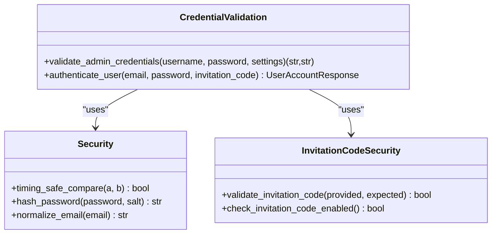

**Diagram sources**
- [auth.py:158-173](file://src/sage_faculty_twin/auth.py#L158-L173)
- [user_store.py:123-161](file://src/sage_faculty_twin/user_store.py#L123-L161)
- [user_store.py:140-161](file://src/sage_faculty_twin/user_store.py#L140-L161)

**Section sources**
- [auth.py:158-173](file://src/sage_faculty_twin/auth.py#L158-L173)
- [user_store.py:123-161](file://src/sage_faculty_twin/user_store.py#L123-L161)
- [user_store.py:140-161](file://src/sage_faculty_twin/user_store.py#L140-L161)

### Role-Based Access Control (RBAC)
- Admin roles: super_admin and manager
- Manager privileges are elevated for specific endpoints
- Identity resolution maps usernames to roles with fallback logic
- Normalized payloads expose consistent role claims

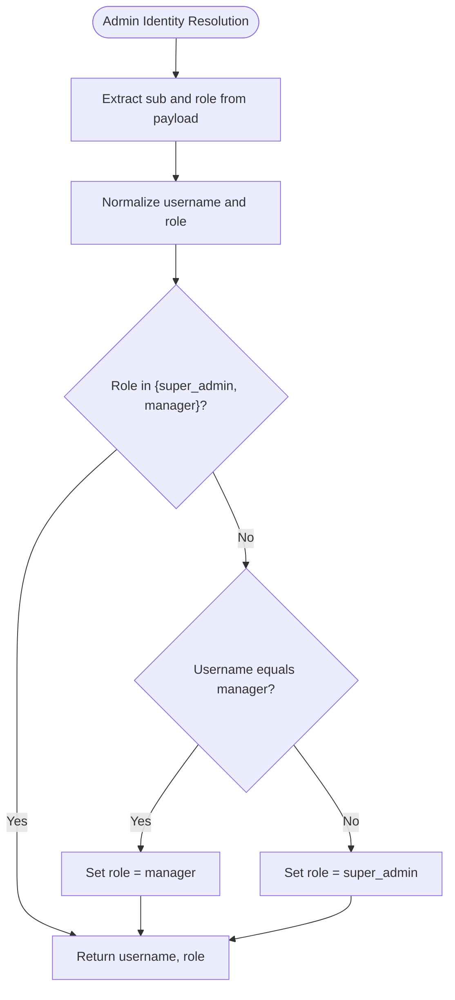

**Diagram sources**
- [auth.py:132-155](file://src/sage_faculty_twin/auth.py#L132-L155)

**Section sources**
- [auth.py:132-155](file://src/sage_faculty_twin/auth.py#L132-L155)

### Session Handling and Cookies
- Separate cookies for admin and user sessions
- Cookies set with HttpOnly, SameSite lax, and configurable TTL
- Logout endpoints clear cookies and reset session state

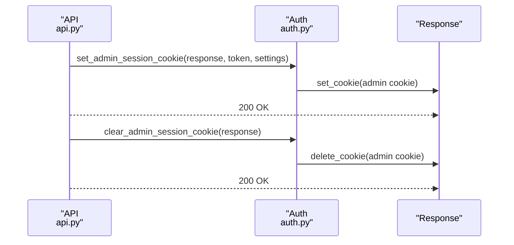

**Diagram sources**
- [api.py:497-507](file://src/sage_faculty_twin/api.py#L497-L507)
- [auth.py:57-86](file://src/sage_faculty_twin/auth.py#L57-L86)

**Section sources**
- [api.py:497-507](file://src/sage_faculty_twin/api.py#L497-L507)
- [auth.py:57-86](file://src/sage_faculty_twin/auth.py#L57-L86)

### Token Expiration and Refresh Mechanisms
- Tokens carry exp timestamps and are validated at decode time
- Current implementation does not include automatic token refresh
- TTLs are configured per role via settings

**Section sources**
- [auth.py:20-54](file://src/sage_faculty_twin/auth.py#L20-L54)
- [config.py:136-139](file://src/sage_faculty_twin/config.py#L136-L139)

### Audit Logging for Authentication Events
- Authentication endpoints return session state responses
- Tests demonstrate successful login/logout flows and session state transitions
- No dedicated audit log file is implemented in the referenced code

**Section sources**
- [test_admin_auth.py:254-280](file://tests/test_admin_auth.py#L254-L280)
- [test_admin_auth.py:563-621](file://tests/test_admin_auth.py#L563-L621)

### Integration with User Stores and Session Persistence
- User accounts stored as JSON files keyed by UUID
- Records indexed by ID and normalized email for fast lookup
- Session persistence relies on cookies; no server-side session store
- Invitation code validation occurs during registration and login workflows
- Progressive onboarding state stored in local storage for persistence

**Section sources**
- [user_store.py:62-208](file://src/sage_faculty_twin/user_store.py#L62-L208)
- [auth.py:57-86](file://src/sage_faculty_twin/auth.py#L57-L86)

### Enhanced Frontend Authentication Experience
The authentication system now provides an enhanced user experience with progressive onboarding and improved error handling:
- New dedicated endpoints for user registration and login
- Automatic progressive onboarding for newly authenticated users
- Enhanced error handling with automatic UI feedback and smooth scrolling
- Improved user guidance through onboarding steps
- Persistent onboarding state across sessions

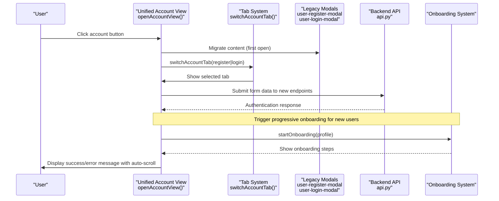

**Diagram sources**
- [app.js:8021-8051](file://src/sage_faculty_twin/web/app.js#L8021-L8051)
- [index.html:184-202](file://src/sage_faculty_twin/web/index.html#L184-L202)
- [api.py:512-523](file://src/sage_faculty_twin/api.py#L512-L523)

**Section sources**
- [app.js:8021-8051](file://src/sage_faculty_twin/web/app.js#L8021-L8051)
- [index.html:184-202](file://src/sage_faculty_twin/web/index.html#L184-L202)
- [api.py:512-523](file://src/sage_faculty_twin/api.py#L512-L523)

## Dependency Analysis
The authentication system exhibits clear separation of concerns with enhanced user authentication endpoints and progressive onboarding:
- API depends on Service for orchestration
- Service depends on Auth for token handling, User Store for credentials, and Config for policies
- Auth depends on Config for secrets and TTLs
- Models define request/response contracts used across layers
- Progressive onboarding system integrates frontend components with backend authentication
- Enhanced error handling provides automatic UI feedback

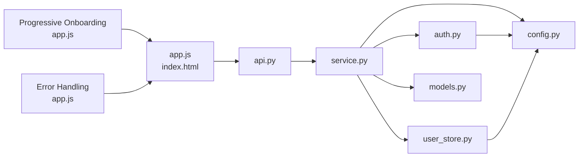

**Diagram sources**
- [api.py:22-76](file://src/sage_faculty_twin/api.py#L22-L76)
- [service.py:29-131](file://src/sage_faculty_twin/service.py#L29-L131)
- [auth.py:13-15](file://src/sage_faculty_twin/auth.py#L13-L15)
- [config.py:9-15](file://src/sage_faculty_twin/config.py#L9-L15)
- [models.py:741-755](file://src/sage_faculty_twin/models.py#L741-L755)
- [app.js:8021-8051](file://src/sage_faculty_twin/web/app.js#L8021-L8051)
- [index.html:184-202](file://src/sage_faculty_twin/web/index.html#L184-L202)

**Section sources**
- [api.py:22-76](file://src/sage_faculty_twin/api.py#L22-L76)
- [service.py:29-131](file://src/sage_faculty_twin/service.py#L29-L131)
- [auth.py:13-15](file://src/sage_faculty_twin/auth.py#L13-L15)
- [config.py:9-15](file://src/sage_faculty_twin/config.py#L9-L15)
- [models.py:741-755](file://src/sage_faculty_twin/models.py#L741-L755)
- [app.js:8021-8051](file://src/sage_faculty_twin/web/app.js#L8021-L8051)
- [index.html:184-202](file://src/sage_faculty_twin/web/index.html#L184-L202)

## Performance Considerations
- Token signing and verification are lightweight; negligible overhead
- Password hashing uses scrypt with tunable cost parameters
- Cookie-based sessions eliminate server-side state, improving scalability
- Invitation code validation adds minimal overhead with constant-time comparison
- Progressive onboarding uses local storage for persistence, minimizing server load
- Enhanced error handling with automatic scrolling provides better UX without performance impact
- Consider adding refresh tokens and sliding expiration for long-lived sessions

## Troubleshooting Guide
Common issues and resolutions:
- 401 Unauthorized on login: incorrect email/password
- 403 Forbidden on admin endpoints: missing or invalid admin session cookie
- 409 Conflict on registration: duplicate email address
- 403 Forbidden accessing user history: must be logged in with matching email
- 403 Forbidden on lab member registration: incorrect or missing invitation code
- 400 Bad Request on registration: invalid visitor profile for invitation code flow
- New user onboarding not triggering: check localStorage permissions and onboarding state
- Error messages not appearing: verify inline status element IDs and CSS classes
- Progressive onboarding steps not loading: ensure profile-specific onboarding configuration exists

**Updated** Added troubleshooting for new user authentication endpoints, progressive onboarding system, and enhanced error handling.

**Section sources**
- [user_store.py:87-161](file://src/sage_faculty_twin/user_store.py#L87-L161)
- [auth.py:119-129](file://src/sage_faculty_twin/auth.py#L119-L129)
- [user_store.py:86-89](file://src/sage_faculty_twin/user_store.py#L86-L89)
- [history_auth.py:15-26](file://src/sage_faculty_twin/history_auth.py#L15-L26)
- [app.js:8021-8051](file://src/sage_faculty_twin/web/app.js#L8021-L8051)

## Conclusion
The authentication system provides robust session-based authentication for both users and administrators with enhanced user authentication endpoints, progressive onboarding, and improved error handling. The system now features dedicated endpoints (/auth/user/register, /auth/user/login) that streamline the user authentication process while maintaining backward compatibility. The progressive onboarding system enhances user experience by providing guided setup for new authenticated users, with persistent state tracking across sessions. Enhanced error handling with automatic UI feedback and smooth scrolling improves the overall user experience during authentication flows. The system leverages secure token encoding, timing-safe credential validation, and role-based access control. The invitation code system allows for gated access to lab member profiles while maintaining security through constant-time validation. The integration of progressive onboarding and enhanced error handling demonstrates a commitment to user experience optimization while maintaining strong security practices. While the current implementation focuses on cookie-based sessions without server-side persistence, it offers a solid foundation for extending with refresh tokens, audit logging, and enhanced invitation code management as needed.