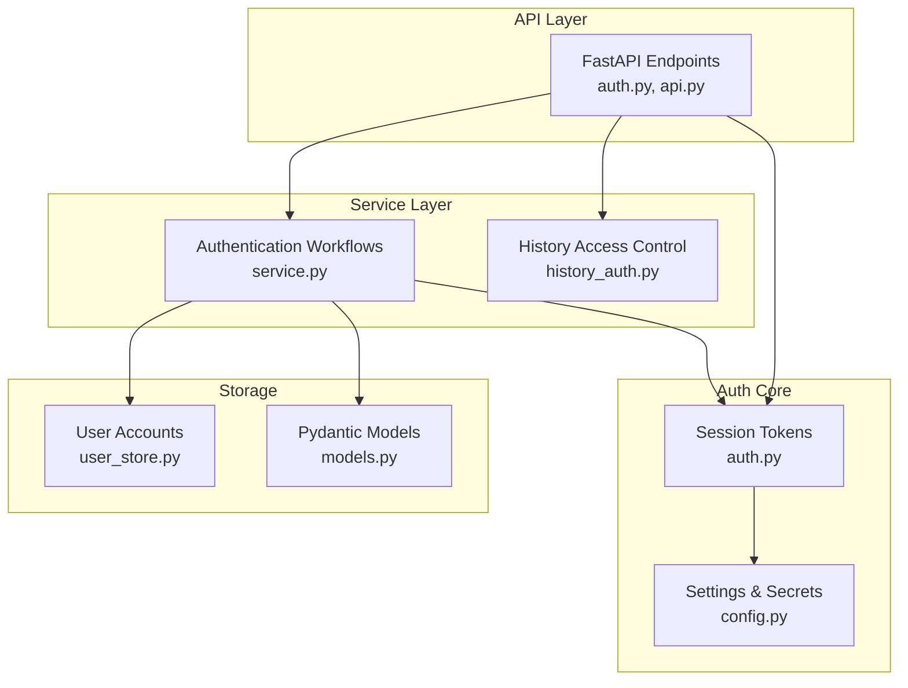
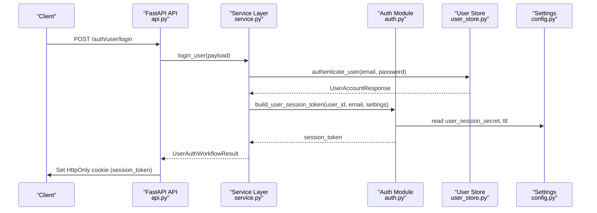
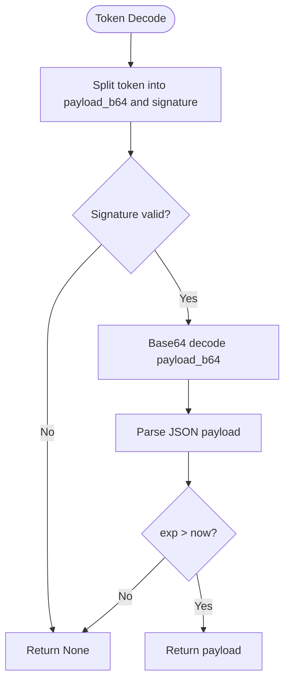
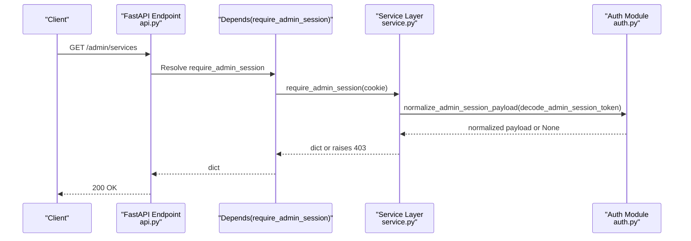
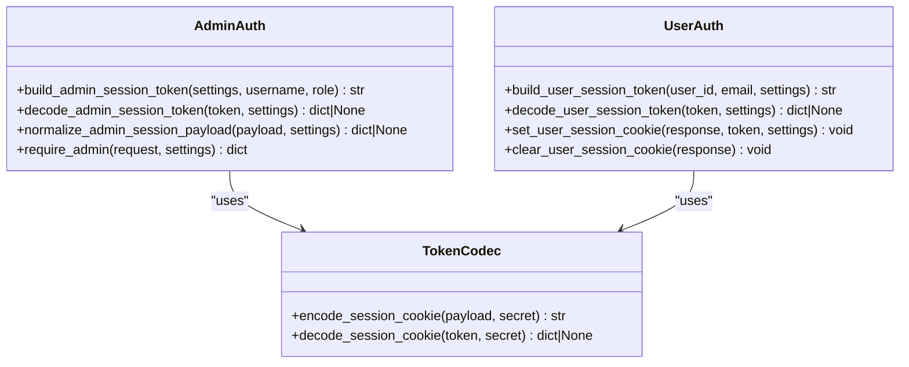
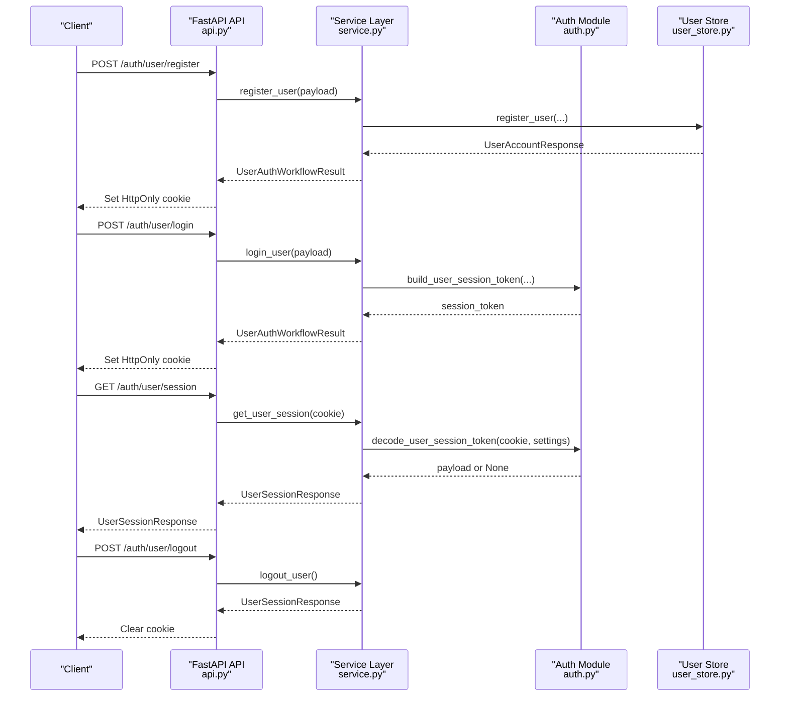
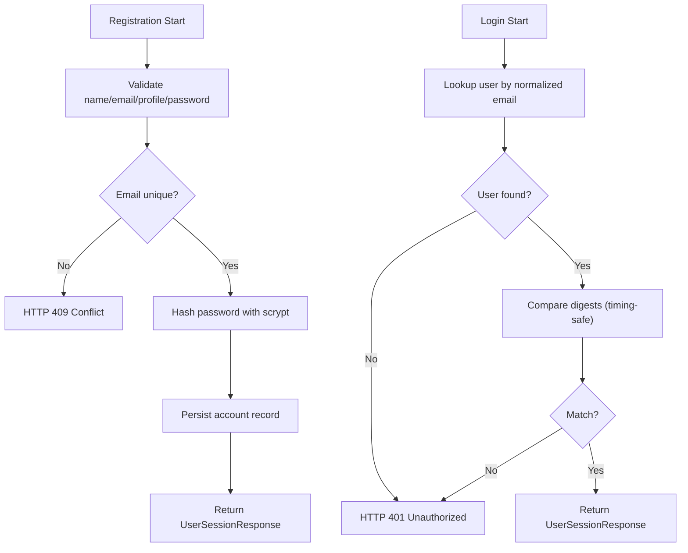
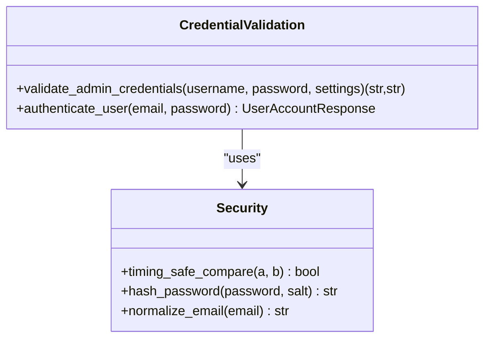
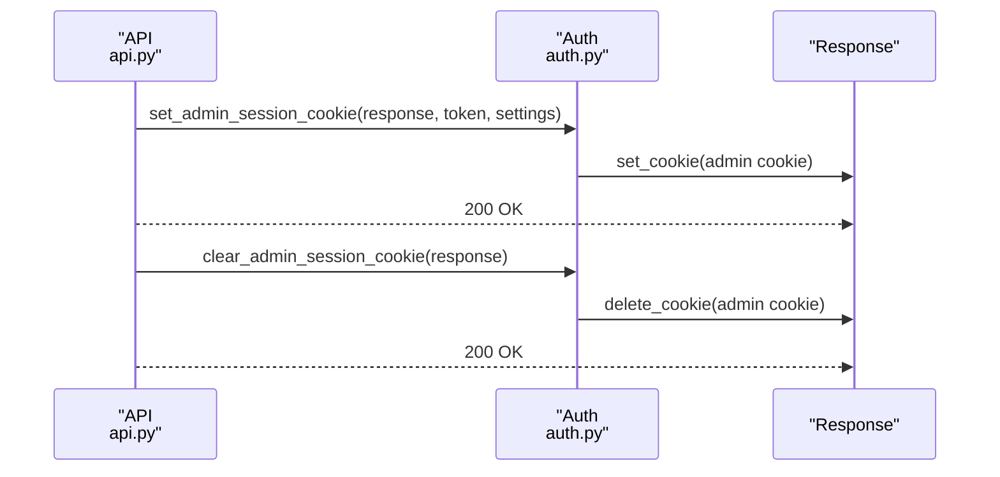
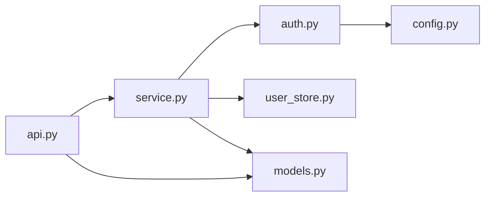

# Authentication System

<cite>
**Referenced Files in This Document**
- [auth.py](file://src/sage_faculty_twin/auth.py)
- [user_store.py](file://src/sage_faculty_twin/user_store.py)
- [models.py](file://src/sage_faculty_twin/models.py)
- [api.py](file://src/sage_faculty_twin/api.py)
- [config.py](file://src/sage_faculty_twin/config.py)
- [service.py](file://src/sage_faculty_twin/service.py)
- [history_auth.py](file://src/sage_faculty_twin/history_auth.py)
- [test_admin_auth.py](file://tests/test_admin_auth.py)
- [test_history_auth.py](file://tests/test_history_auth.py)
</cite>

## Table of Contents
1. [Introduction](#introduction)
2. [Project Structure](#project-structure)
3. [Core Components](#core-components)
4. [Architecture Overview](#architecture-overview)
5. [Detailed Component Analysis](#detailed-component-analysis)
6. [Dependency Analysis](#dependency-analysis)
7. [Performance Considerations](#performance-considerations)
8. [Troubleshooting Guide](#troubleshooting-guide)
9. [Conclusion](#conclusion)

## Introduction
This document provides comprehensive documentation for the authentication and authorization system. It explains session token generation and validation for both users and administrators, the authentication middleware, token encoding/decoding processes, and session management lifecycle. It also covers user registration and login workflows, credential validation, role-based access control, implementation examples for authentication decorators, session handling, security best practices, token expiration and refresh mechanisms, audit logging for authentication events, and integration with user stores and session persistence.

## Project Structure
The authentication system spans several modules:
- Token encoding/decoding and session cookie management
- User account storage and password hashing
- API endpoints for authentication and protected routes
- Configuration for session secrets and TTLs
- Service layer orchestrating authentication workflows
- Authorization helpers for resource access control

**Diagram sources**
- [auth.py:1-214](file://src/sage_faculty_twin/auth.py#L1-L214)
- [user_store.py:1-168](file://src/sage_faculty_twin/user_store.py#L1-L168)
- [models.py:728-768](file://src/sage_faculty_twin/models.py#L728-L768)
- [api.py:422-510](file://src/sage_faculty_twin/api.py#L422-L510)
- [config.py:121-129](file://src/sage_faculty_twin/config.py#L121-L129)
- [service.py:2694-2745](file://src/sage_faculty_twin/service.py#L2694-L2745)
- [history_auth.py:6-27](file://src/sage_faculty_twin/history_auth.py#L6-L27)

**Section sources**
- [auth.py:1-214](file://src/sage_faculty_twin/auth.py#L1-L214)
- [user_store.py:1-168](file://src/sage_faculty_twin/user_store.py#L1-L168)
- [models.py:728-768](file://src/sage_faculty_twin/models.py#L728-L768)
- [api.py:422-510](file://src/sage_faculty_twin/api.py#L422-L510)
- [config.py:121-129](file://src/sage_faculty_twin/config.py#L121-L129)
- [service.py:2694-2745](file://src/sage_faculty_twin/service.py#L2694-L2745)
- [history_auth.py:6-27](file://src/sage_faculty_twin/history_auth.py#L6-L27)

## Core Components
- Session token encoding/decoding for administrators and users
- Cookie-based session management with HttpOnly and SameSite policies
- User registration with secure password hashing and email normalization
- Login validation with timing-safe comparisons
- Role-based access control for administrative endpoints
- Protected resource access control for user history
- Configuration-driven session secrets and TTLs

**Section sources**
- [auth.py:16-214](file://src/sage_faculty_twin/auth.py#L16-L214)
- [user_store.py:62-168](file://src/sage_faculty_twin/user_store.py#L62-L168)
- [models.py:728-768](file://src/sage_faculty_twin/models.py#L728-L768)
- [api.py:479-510](file://src/sage_faculty_twin/api.py#L479-L510)
- [config.py:121-129](file://src/sage_faculty_twin/config.py#L121-L129)
- [service.py:2694-2745](file://src/sage_faculty_twin/service.py#L2694-L2745)
- [history_auth.py:6-27](file://src/sage_faculty_twin/history_auth.py#L6-L27)

## Architecture Overview
The authentication system follows a layered architecture:
- API layer exposes endpoints for login/logout and protected resources
- Service layer validates credentials, builds sessions, and enforces RBAC
- Auth module handles token encoding/decoding and cookie management
- Storage layer persists user accounts and manages password hashes
- Configuration module defines secrets and session lifetimes

**Diagram sources**
- [api.py:499-504](file://src/sage_faculty_twin/api.py#L499-L504)
- [service.py:5636-5645](file://src/sage_faculty_twin/service.py#L5636-L5645)
- [auth.py:45-54](file://src/sage_faculty_twin/auth.py#L45-L54)
- [user_store.py:108-121](file://src/sage_faculty_twin/user_store.py#L108-L121)
- [config.py:127-128](file://src/sage_faculty_twin/config.py#L127-L128)

## Detailed Component Analysis

### Session Token Generation and Validation
- Administrator and user sessions use distinct cookies and secrets
- Tokens are JSON payloads encoded with URL-safe base64 and signed with HMAC-SHA256
- Expiration is enforced by comparing exp against current Unix time
- Nonces are included to mitigate replay risks

**Diagram sources**
- [auth.py:193-214](file://src/sage_faculty_twin/auth.py#L193-L214)

**Section sources**
- [auth.py:182-214](file://src/sage_faculty_twin/auth.py#L182-L214)

### Authentication Middleware and Decorators
- API endpoints use dependency injection to enforce admin sessions
- The require_admin_session dependency decodes and normalizes admin payloads
- Protected routes depend on require_admin_session to gate access

**Diagram sources**
- [api.py:461-477](file://src/sage_faculty_twin/api.py#L461-L477)
- [api.py:422-424](file://src/sage_faculty_twin/api.py#L422-L424)
- [service.py:5600-5609](file://src/sage_faculty_twin/service.py#L5600-L5609)
- [auth.py:119-129](file://src/sage_faculty_twin/auth.py#L119-L129)

**Section sources**
- [api.py:422-424](file://src/sage_faculty_twin/api.py#L422-L424)
- [api.py:461-477](file://src/sage_faculty_twin/api.py#L461-L477)
- [service.py:5600-5609](file://src/sage_faculty_twin/service.py#L5600-L5609)
- [auth.py:119-129](file://src/sage_faculty_twin/auth.py#L119-L129)

### Token Encoding/Decoding Processes
- Payload construction includes subject, email/role, issued-at, expiration, and nonce
- Secret is per-role (admin vs user) and configurable
- Signature uses HMAC-SHA256 over base64-encoded payload
- Decoding validates signature and checks expiration

**Diagram sources**
- [auth.py:24-86](file://src/sage_faculty_twin/auth.py#L24-L86)
- [auth.py:182-214](file://src/sage_faculty_twin/auth.py#L182-L214)

**Section sources**
- [auth.py:24-86](file://src/sage_faculty_twin/auth.py#L24-L86)
- [auth.py:182-214](file://src/sage_faculty_twin/auth.py#L182-L214)

### Session Management Lifecycle
- User registration creates a new account with hashed password and normalized email
- Login authenticates credentials and issues a session cookie
- Session cookie is validated on subsequent requests
- Logout clears the session cookie and returns anonymous state

**Diagram sources**
- [api.py:492-510](file://src/sage_faculty_twin/api.py#L492-L510)
- [service.py:5627-5645](file://src/sage_faculty_twin/service.py#L5627-L5645)
- [auth.py:45-86](file://src/sage_faculty_twin/auth.py#L45-L86)
- [user_store.py:70-106](file://src/sage_faculty_twin/user_store.py#L70-L106)

**Section sources**
- [api.py:492-510](file://src/sage_faculty_twin/api.py#L492-L510)
- [service.py:5627-5645](file://src/sage_faculty_twin/service.py#L5627-L5645)
- [auth.py:45-86](file://src/sage_faculty_twin/auth.py#L45-L86)
- [user_store.py:70-106](file://src/sage_faculty_twin/user_store.py#L70-L106)

### User Registration and Login Workflows
- Registration validates inputs, normalizes email, checks uniqueness, and stores hashed credentials
- Login validates credentials using timing-safe comparison and returns account info
- Both workflows issue session cookies and return session responses

**Diagram sources**
- [user_store.py:70-121](file://src/sage_faculty_twin/user_store.py#L70-L121)
- [auth.py:108-121](file://src/sage_faculty_twin/auth.py#L108-L121)

**Section sources**
- [user_store.py:70-121](file://src/sage_faculty_twin/user_store.py#L70-L121)
- [auth.py:108-121](file://src/sage_faculty_twin/auth.py#L108-L121)

### Credential Validation and Security Best Practices
- Timing-safe digest comparison prevents timing attacks
- Password hashing uses scrypt with configurable cost parameters
- Email normalization ensures case-insensitive uniqueness
- Session cookies use HttpOnly and SameSite lax; secure flag is disabled by default
- Secrets and TTLs are configurable via environment-backed settings

**Diagram sources**
- [auth.py:158-173](file://src/sage_faculty_twin/auth.py#L158-L173)
- [user_store.py:108-121](file://src/sage_faculty_twin/user_store.py#L108-L121)
- [user_store.py:148-156](file://src/sage_faculty_twin/user_store.py#L148-L156)

**Section sources**
- [auth.py:158-173](file://src/sage_faculty_twin/auth.py#L158-L173)
- [user_store.py:108-121](file://src/sage_faculty_twin/user_store.py#L108-L121)
- [user_store.py:148-156](file://src/sage_faculty_twin/user_store.py#L148-L156)

### Role-Based Access Control (RBAC)
- Admin roles: super_admin and manager
- Manager privileges are elevated for specific endpoints
- Identity resolution maps usernames to roles with fallback logic
- Normalized payloads expose consistent role claims

**Diagram sources**
- [auth.py:132-142](file://src/sage_faculty_twin/auth.py#L132-L142)
- [auth.py:145-155](file://src/sage_faculty_twin/auth.py#L145-L155)

**Section sources**
- [auth.py:132-155](file://src/sage_faculty_twin/auth.py#L132-L155)

### Session Handling and Cookies
- Separate cookies for admin and user sessions
- Cookies set with HttpOnly, SameSite lax, and configurable TTL
- Logout endpoints clear cookies and reset session state

**Diagram sources**
- [api.py:486-489](file://src/sage_faculty_twin/api.py#L486-L489)
- [auth.py:57-70](file://src/sage_faculty_twin/auth.py#L57-L70)

**Section sources**
- [api.py:486-489](file://src/sage_faculty_twin/api.py#L486-L489)
- [auth.py:57-70](file://src/sage_faculty_twin/auth.py#L57-L70)

### Token Expiration and Refresh Mechanisms
- Tokens carry exp timestamps and are validated at decode time
- Current implementation does not include automatic token refresh
- TTLs are configured per role via settings

**Section sources**
- [auth.py:20-54](file://src/sage_faculty_twin/auth.py#L20-L54)
- [config.py:125-129](file://src/sage_faculty_twin/config.py#L125-L129)

### Audit Logging for Authentication Events
- Authentication endpoints return session state responses
- Tests demonstrate successful login/logout flows and session state transitions
- No dedicated audit log file is implemented in the referenced code

**Section sources**
- [test_admin_auth.py:254-280](file://tests/test_admin_auth.py#L254-L280)
- [test_admin_auth.py:563-621](file://tests/test_admin_auth.py#L563-L621)

### Integration with User Stores and Session Persistence
- User accounts stored as JSON files keyed by UUID
- Records indexed by ID and normalized email for fast lookup
- Session persistence relies on cookies; no server-side session store

**Section sources**
- [user_store.py:62-168](file://src/sage_faculty_twin/user_store.py#L62-L168)
- [auth.py:57-86](file://src/sage_faculty_twin/auth.py#L57-L86)

## Dependency Analysis
The authentication system exhibits clear separation of concerns:
- API depends on Service for orchestration
- Service depends on Auth for token handling and on User Store for credentials
- Auth depends on Config for secrets and TTLs
- Models define request/response contracts used across layers

**Diagram sources**
- [api.py:22-76](file://src/sage_faculty_twin/api.py#L22-L76)
- [service.py:29-131](file://src/sage_faculty_twin/service.py#L29-L131)
- [auth.py:13-15](file://src/sage_faculty_twin/auth.py#L13-L15)
- [config.py:9-15](file://src/sage_faculty_twin/config.py#L9-L15)
- [models.py:728-768](file://src/sage_faculty_twin/models.py#L728-L768)

**Section sources**
- [api.py:22-76](file://src/sage_faculty_twin/api.py#L22-L76)
- [service.py:29-131](file://src/sage_faculty_twin/service.py#L29-L131)
- [auth.py:13-15](file://src/sage_faculty_twin/auth.py#L13-L15)
- [config.py:9-15](file://src/sage_faculty_twin/config.py#L9-L15)
- [models.py:728-768](file://src/sage_faculty_twin/models.py#L728-L768)

## Performance Considerations
- Token signing and verification are lightweight; negligible overhead
- Password hashing uses scrypt with tunable cost parameters
- Cookie-based sessions eliminate server-side state, improving scalability
- Consider adding refresh tokens and sliding expiration for long-lived sessions

## Troubleshooting Guide
Common issues and resolutions:
- 401 Unauthorized on login: incorrect email/password
- 403 Forbidden on admin endpoints: missing or invalid admin session cookie
- 409 Conflict on registration: duplicate email address
- 403 Forbidden accessing user history: must be logged in with matching email

**Section sources**
- [user_store.py:111-121](file://src/sage_faculty_twin/user_store.py#L111-L121)
- [auth.py:119-129](file://src/sage_faculty_twin/auth.py#L119-L129)
- [user_store.py:86-89](file://src/sage_faculty_twin/user_store.py#L86-L89)
- [history_auth.py:15-26](file://src/sage_faculty_twin/history_auth.py#L15-L26)

## Conclusion
The authentication system provides robust session-based authentication for both users and administrators. It leverages secure token encoding, timing-safe credential validation, and role-based access control. While the current implementation focuses on cookie-based sessions without server-side persistence, it offers a solid foundation for extending with refresh tokens and audit logging as needed.