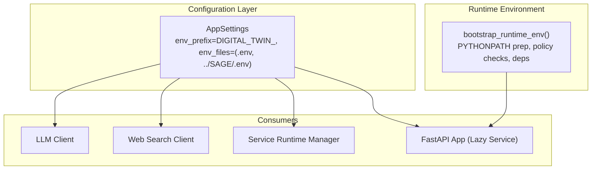
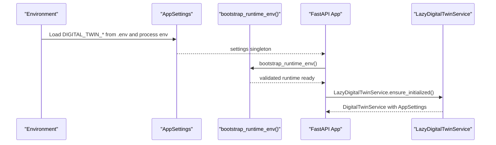
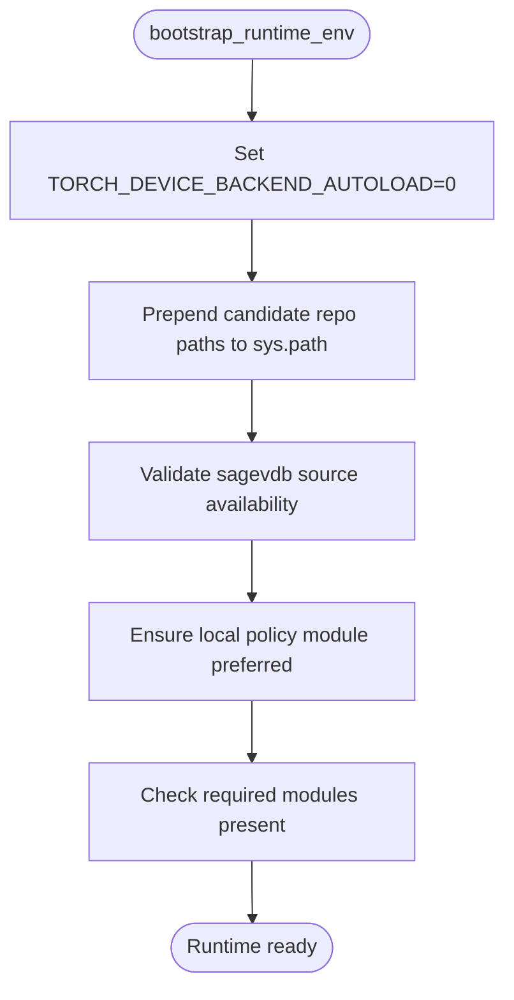
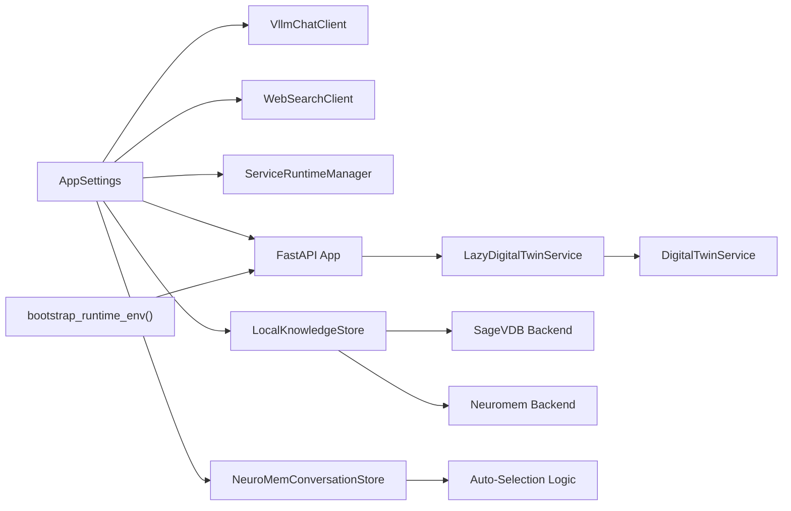

# Configuration Management

<cite>
**Referenced Files in This Document**
- [config.py](file://src/sage_faculty_twin/config.py)
- [runtime_env.py](file://src/sage_faculty_twin/runtime_env.py)
- [service_runtime.py](file://src/sage_faculty_twin/service_runtime.py)
- [api.py](file://src/sage_faculty_twin/api.py)
- [web_search.py](file://src/sage_faculty_twin/web_search.py)
- [llm_client.py](file://src/sage_faculty_twin/llm_client.py)
- [knowledge_base.py](file://src/sage_faculty_twin/knowledge_base.py)
- [memory_store.py](file://src/sage_faculty_twin/memory_store.py)
- [deployment.md](file://docs/deployment.md)
- [manage.sh](file://manage.sh)
</cite>

## Update Summary
**Changes Made**
- Updated SageVDB backend configuration section to reflect new backend preferences and enhanced selection logic
- Added comprehensive documentation for SageVDB-specific configuration fields
- Enhanced backend selection logic documentation covering both knowledge base and conversation memory auto-selection
- Updated BM25 backend configuration to reflect current implementation and defaults
- Added new SageVDB ANN algorithm configuration options

## Table of Contents
1. [Introduction](#introduction)
2. [Project Structure](#project-structure)
3. [Core Components](#core-components)
4. [Architecture Overview](#architecture-overview)
5. [Detailed Component Analysis](#detailed-component-analysis)
6. [Dependency Analysis](#dependency-analysis)
7. [Performance Considerations](#performance-considerations)
8. [Troubleshooting Guide](#troubleshooting-guide)
9. [Conclusion](#conclusion)

## Introduction
This document explains the configuration management system in Sage Faculty Twin. It focuses on the AppSettings class, environment variable handling, configuration loading mechanisms, runtime environment detection, and how configuration values influence LLM settings, database and memory backends, web search parameters, and operational flags. It also covers configuration precedence, default values, validation, and best practices for managing sensitive configuration data.

**Updated** The configuration system now includes enhanced SageVDB backend preferences and sophisticated backend selection logic that automatically chooses optimal backends based on environment capabilities and dependencies.

## Project Structure
The configuration system centers around a single Pydantic-based settings class that loads values from environment variables and .env files, and is consumed by services and clients across the application. Additional runtime checks ensure the environment is properly prepared for dependent libraries and services.

**Diagram sources**
- [config.py:9-131](file://src/sage_faculty_twin/config.py#L9-L131)
- [runtime_env.py:102-130](file://src/sage_faculty_twin/runtime_env.py#L102-L130)
- [service_runtime.py:13-69](file://src/sage_faculty_twin/service_runtime.py#L13-L69)
- [api.py:94-116](file://src/sage_faculty_twin/api.py#L94-L116)

**Section sources**
- [config.py:9-131](file://src/sage_faculty_twin/config.py#L9-L131)
- [runtime_env.py:102-130](file://src/sage_faculty_twin/runtime_env.py#L102-L130)
- [service_runtime.py:13-69](file://src/sage_faculty_twin/service_runtime.py#L13-L69)
- [api.py:94-116](file://src/sage_faculty_twin/api.py#L94-L116)

## Core Components
- AppSettings: Centralized configuration container using Pydantic settings with environment variable binding and validation.
- Environment loading: Uses an explicit env prefix and two .env locations to support development and integration with external stacks.
- Runtime environment bootstrapping: Prepares Python path, validates optional source packages, and ensures local policy preference.
- Consumers: LLM client, web search client, service runtime manager, and FastAPI app lazily initialize services using AppSettings.

Key configuration categories:
- LLM settings: base URL, API key, timeouts, retries, policy controls, cache TTL and capacity, model names, and intent classifier overrides.
- Knowledge/memory backends: knowledge base directory, backend selection, index type, embedding model/dimension, and related tuning knobs.
- Web search: enable/disable, timeout, max results, and auto-trigger flags.
- Operational storage: conversation memory, online presence, artifact drafts, knowledge gaps, escalations, follow-ups, operations task state, suggestions, user accounts, and workflow policy path.
- Session and admin credentials: admin/manager usernames/passwords and session secrets/time-to-live.
- Service orchestration: path to the service manager script used to control systemd user units.

**Updated** Enhanced backend configuration with SageVDB preferences and automatic backend selection logic.

**Section sources**
- [config.py:9-131](file://src/sage_faculty_twin/config.py#L9-L131)
- [runtime_env.py:102-130](file://src/sage_faculty_twin/runtime_env.py#L102-L130)
- [service_runtime.py:13-69](file://src/sage_faculty_twin/service_runtime.py#L13-L69)
- [api.py:94-116](file://src/sage_faculty_twin/api.py#L94-L116)

## Architecture Overview
The configuration architecture integrates environment-driven settings with runtime environment validation and consumer initialization.

**Diagram sources**
- [config.py:9-131](file://src/sage_faculty_twin/config.py#L9-L131)
- [runtime_env.py:102-130](file://src/sage_faculty_twin/runtime_env.py#L102-L130)
- [api.py:94-116](file://src/sage_faculty_twin/api.py#L94-L116)

## Detailed Component Analysis

### AppSettings: Class Structure and Validation
AppSettings defines strongly typed configuration fields with defaults, bounds, and enums. It uses:
- env_prefix to bind environment variables with a consistent namespace.
- env_file to load from .env files in predictable locations.
- env_file_encoding to ensure UTF-8 parsing.
- extra="ignore" to tolerate unknown keys.

Highlights:
- LLM settings: base URL, API key, timeouts, retry attempts/backoff, policy flags and thresholds, cache TTL/capacity, system prompt, and model names.
- Knowledge/memory backends: knowledge base directory, backend type, index type, embedding model and dimension, retrieval top-K, and conversation memory tuning.
- Web search: enable flag, timeout, max results, auto-trigger.
- Storage paths: conversation memory, online presence, drafts, escalations, follow-ups, operations task state, suggestions, user accounts, workflow policy path.
- Sessions/admin: admin/manager credentials and session secrets/TTL.
- Service manager script path.

**Updated** Added comprehensive SageVDB backend configuration fields including embedding backend, model, dimension, backend type, and ANN algorithm settings.

Validation characteristics:
- Numeric fields enforce inclusive min/max bounds.
- String fields enforce allowed values via patterns and enums.
- Paths are typed as Path for safe filesystem usage.

**Section sources**
- [config.py:9-131](file://src/sage_faculty_twin/config.py#L9-L131)

### Environment Variable Handling and Loading Mechanisms
- Prefix and files: DIGITAL_TWIN_* variables are loaded from .env and ../SAGE/.env. The loader respects the order and last-writer wins for duplicates.
- Import-time environment flags: Some streaming and latency knobs are read directly from os.environ at module import time and are not managed by AppSettings. These include streaming answer toggles and chat request/keepalive timeouts. The deployment guide explains that these must be exported into the process environment by launchers.

Operational implications:
- To ensure these flags are effective, launchers must export .env into the process environment before starting the server.
- For production deployments, ensure the process environment contains the desired values; .env files alone are insufficient.

**Section sources**
- [config.py:10-15](file://src/sage_faculty_twin/config.py#L10-L15)
- [deployment.md:254-264](file://docs/deployment.md#L254-L264)
- [api.py:127-147](file://src/sage_faculty_twin/api.py#L127-L147)

### Runtime Environment Detection and Hardware Capability Assessment
The runtime environment bootstrapper performs:
- Prepending repository roots to sys.path to ensure local packages are preferred.
- Validating that the local sageVDB source tree exposes the compiled API (critical for native extensions).
- Ensuring the policy module is loaded from a local checkout to prevent accidental drift.
- Verifying required Python modules are present.

While explicit hardware capability probing is not implemented in this module, the environment checks prevent misconfiguration that could lead to degraded performance or failures.

**Diagram sources**
- [runtime_env.py:102-130](file://src/sage_faculty_twin/runtime_env.py#L102-L130)

**Section sources**
- [runtime_env.py:102-130](file://src/sage_faculty_twin/runtime_env.py#L102-L130)

### Version Resolution for Stack Components
Version-related metadata is exposed by the service layer and includes stack component versions and hardware capabilities. This allows operators to track and validate deployed versions.

**Section sources**
- [api.py:76-76](file://src/sage_faculty_twin/api.py#L76-L76)

### LLM Settings and Clients
- AppSettings provides LLM base URL, API key, timeouts, retry parameters, policy flags/thresholds, and cache settings.
- The LLM client constructs HTTP clients using these settings, including separate intent classification client when configured.
- Model name auto-detection occurs when not explicitly set.

Operational guidance:
- Configure llm_base_url and api_key to match your inference endpoint.
- Adjust llm_timeout_seconds and llm_retry_attempts according to network conditions and latency targets.
- Use intent_llm_base_url/intent_model_name to route intent classification to a lighter model if desired.

**Section sources**
- [config.py:20-45](file://src/sage_faculty_twin/config.py#L20-L45)
- [llm_client.py:68-96](file://src/sage_faculty_twin/llm_client.py#L68-L96)

### Database Connections and Knowledge Backends
**Updated** Enhanced knowledge backend configuration with SageVDB preferences and automatic backend selection logic.

- Knowledge base directory and backend type are configurable.
- **SageVDB Backend**: Configurable embedding backend (sentence-transformers), embedding model, dimension, backend type (cpp/native), and ANN algorithm selection.
- **Neuromem Backend**: Supports automatic index type selection ("auto" prefers faiss for dense retrieval via sentence-transformers and falls back to bm25 when unavailable).
- Index type supports lexical and dense retrieval modes; embedding model and dimension are configurable.
- Retrieval top-K controls the number of results returned.

**Enhanced Backend Selection Logic**:
- Knowledge base auto-selection: "auto" mode checks for sentence-transformers availability and selects faiss for dense retrieval or bm25 for sparse retrieval.
- Conversation memory auto-selection: "auto" mode prioritizes vector-capable indexes (sage_vdb_ann/sagedb_ann/faiss) and falls back to segment/fifo when unavailable.
- SageVDB ANN algorithm selection: Supports faiss_hnsw and other algorithms when using ANN backends.

Best practices:
- Choose index type based on available compute and accuracy needs.
- Align embedding model and dimension with the chosen backend's supported configurations.
- For SageVDB, select appropriate backend type (cpp/native) based on deployment environment.
- Use ANN algorithms for large-scale vector search scenarios.

**Section sources**
- [config.py:63-70](file://src/sage_faculty_twin/config.py#L63-L70)
- [config.py:115-119](file://src/sage_faculty_twin/config.py#L115-L119)
- [knowledge_base.py:127-139](file://src/sage_faculty_twin/knowledge_base.py#L127-L139)
- [knowledge_base.py:417-421](file://src/sage_faculty_twin/knowledge_base.py#L417-L421)
- [memory_store.py:257-293](file://src/sage_faculty_twin/memory_store.py#L257-L293)

### Web Search Parameters
- Enable/disable web search globally.
- Control per-request timeout and maximum results.
- Auto-trigger flag influences whether web search is initiated automatically.

Implementation note:
- The web search client enforces minimum/maximum values for timeout and max results internally.

**Section sources**
- [config.py:71-74](file://src/sage_faculty_twin/config.py#L71-L74)
- [web_search.py:96-104](file://src/sage_faculty_twin/web_search.py#L96-L104)
- [web_search.py:109-126](file://src/sage_faculty_twin/web_search.py#L109-L126)

### Operational Flags and Storage Paths
- Conversation memory tuning: collection/index types, feature dimension, learning rate, weight decay, replay buffer size, batch size, and scoring blend/recency biases.
- Online presence window and retention windows.
- Draft and queue directories for artifacts, knowledge gaps, escalations, follow-ups, operations tasks, suggestions, and user accounts.
- Workflow policy path for default policy loading.

Recommendations:
- Use "auto" for collection/index types to allow automatic selection based on environment capabilities.
- Tune memory replay and scoring parameters to balance responsiveness and stability.

**Section sources**
- [config.py:75-128](file://src/sage_faculty_twin/config.py#L75-L128)

### Service Orchestration and Systemd Integration
- The service manager script controls systemd user units for the application and optional supporting services.
- The ServiceRuntimeManager executes actions against the script and parses JSON-formatted status payloads.

Operational guidance:
- Use the service manager to start/stop/restart services and to inspect status.
- Queue actions via systemd-run to decouple long-running operations from the immediate request lifecycle.

**Section sources**
- [config.py:120-120](file://src/sage_faculty_twin/config.py#L120-L120)
- [service_runtime.py:13-69](file://src/sage_faculty_twin/service_runtime.py#L13-L69)
- [manage.sh:55-87](file://manage.sh#L55-L87)

### Session and Admin Credentials
- Admin and manager usernames/passwords are configurable along with session secrets and TTLs.
- Session TTLs are bounded to protect against excessively long-lived sessions.

Security guidance:
- Change default passwords and secrets in production.
- Keep session TTLs reasonable to minimize exposure windows.

**Section sources**
- [config.py:121-128](file://src/sage_faculty_twin/config.py#L121-L128)

## Dependency Analysis
Configuration consumers and their relationships:

**Diagram sources**
- [config.py:9-131](file://src/sage_faculty_twin/config.py#L9-L131)
- [llm_client.py:68-96](file://src/sage_faculty_twin/llm_client.py#L68-L96)
- [web_search.py:93-127](file://src/sage_faculty_twin/web_search.py#L93-L127)
- [service_runtime.py:13-69](file://src/sage_faculty_twin/service_runtime.py#L13-L69)
- [api.py:94-116](file://src/sage_faculty_twin/api.py#L94-L116)
- [runtime_env.py:102-130](file://src/sage_faculty_twin/runtime_env.py#L102-L130)
- [knowledge_base.py:127-148](file://src/sage_faculty_twin/knowledge_base.py#L127-L148)
- [memory_store.py:257-293](file://src/sage_faculty_twin/memory_store.py#L257-L293)

**Section sources**
- [config.py:9-131](file://src/sage_faculty_twin/config.py#L9-L131)
- [llm_client.py:68-96](file://src/sage_faculty_twin/llm_client.py#L68-L96)
- [web_search.py:93-127](file://src/sage_faculty_twin/web_search.py#L93-L127)
- [service_runtime.py:13-69](file://src/sage_faculty_twin/service_runtime.py#L13-L69)
- [api.py:94-116](file://src/sage_faculty_twin/api.py#L94-L116)
- [runtime_env.py:102-130](file://src/sage_faculty_twin/runtime_env.py#L102-L130)

## Performance Considerations
- LLM throughput and latency: tune llm_timeout_seconds, llm_retry_attempts, and llm_retry_backoff_seconds to balance reliability and responsiveness.
- Cache effectiveness: adjust llm_cache_ttl_seconds and llm_cache_max_entries to reduce repeated inference workloads.
- Retrieval scale: control retrieval_top_k and embedding dimension to trade off relevance and speed.
- Web search overhead: disable web_search_enabled or reduce web_search_max_results when not needed.
- Memory tuning: adjust conversation memory neural parameters to stabilize long conversations without excessive resource usage.

**Updated** SageVDB backend performance considerations:
- **ANN Algorithm Selection**: Choose appropriate ANN algorithms (faiss_hnsw) for large-scale vector search to optimize query performance.
- **Backend Type**: Use "cpp" backend for native performance or "native" for different optimization characteristics.
- **Dimension Tuning**: Balance embedding dimension with available memory and computational resources.
- **Auto-Selection Benefits**: Leverage automatic backend selection to optimize for available hardware capabilities.

## Troubleshooting Guide
Common configuration issues and resolutions:
- Streaming and latency flags not taking effect:
  - Ensure the launcher exports .env into the process environment before starting the server. These flags are read from os.environ at import time and are not loaded by AppSettings.
  - Reference: [deployment.md:254-264](file://docs/deployment.md#L254-L264)
- Missing runtime dependencies:
  - The runtime bootstrapper verifies required modules and raises explicit errors if missing. Install the project in editable mode or ensure dependencies are available.
  - Reference: [runtime_env.py:116-119](file://src/sage_faculty_twin/runtime_env.py#L116-L119)
- sageVDB compiled extension missing:
  - If sageVDB is on PYTHONPATH but DatabaseConfig is not available, link the shared libraries as indicated by the bootstrapper.
  - Reference: [runtime_env.py:75-90](file://src/sage_faculty_twin/runtime_env.py#L75-L90)
- Policy module not from local checkout:
  - The bootstrapper enforces that the policy module is loaded from the expected local path; otherwise, it raises an error.
  - Reference: [runtime_env.py:34-56](file://src/sage_faculty_twin/runtime_env.py#L34-L56)
- Service control failures:
  - Verify the service manager script path and permissions. Use the script to inspect and control systemd user units.
  - Reference: [config.py:120-120](file://src/sage_faculty_twin/config.py#L120-L120), [manage.sh:55-87](file://manage.sh#L55-L87)

**Updated** SageVDB-specific troubleshooting:
- **SageVDB Backend Not Available**: When knowledge_backend is set to "sagevdb" but sagevdb is not available, install isage-vdb or expose the local sageVDB checkout on PYTHONPATH.
- **ANN Algorithm Issues**: If using "sage-anns" backend, ensure DIGITAL_TWIN_SAGEVDB_ANNS_ALGORITHM is set to a valid algorithm name.
- **Auto-Selection Failures**: If auto-selection fails to find suitable backends, manually specify backend types or install required dependencies.

**Section sources**
- [deployment.md:254-264](file://docs/deployment.md#L254-L264)
- [runtime_env.py:116-119](file://src/sage_faculty_twin/runtime_env.py#L116-L119)
- [runtime_env.py:75-90](file://src/sage_faculty_twin/runtime_env.py#L75-L90)
- [runtime_env.py:34-56](file://src/sage_faculty_twin/runtime_env.py#L34-L56)
- [config.py:120-120](file://src/sage_faculty_twin/config.py#L120-L120)
- [manage.sh:55-87](file://manage.sh#L55-L87)
- [knowledge_base.py:436-439](file://src/sage_faculty_twin/knowledge_base.py#L436-L439)
- [knowledge_base.py:456-459](file://src/sage_faculty_twin/knowledge_base.py#L456-L459)

## Conclusion
Sage Faculty Twin's configuration system combines a centralized Pydantic settings class with environment-driven loading and strict validation, ensuring reliable operation across diverse environments. Runtime environment checks further harden the system by validating optional dependencies and enforcing local policy preferences.

**Updated** The system now features enhanced SageVDB backend preferences with comprehensive configuration options and sophisticated auto-selection logic that intelligently chooses optimal backends based on environment capabilities. This includes automatic backend selection for both knowledge bases and conversation memory, supporting both dense vector retrieval (faiss) and sparse lexical retrieval (bm25) with seamless fallback mechanisms.

By following the guidance here—especially around environment variable precedence, sensitive data handling, and troubleshooting—the system can be safely tuned and operated at scale, leveraging the full power of modern vector databases and intelligent backend selection.