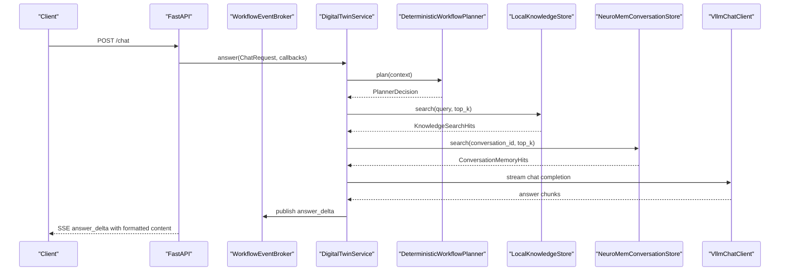
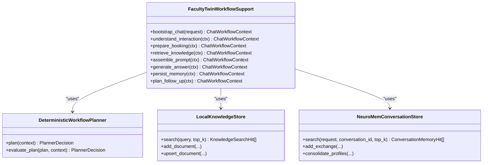
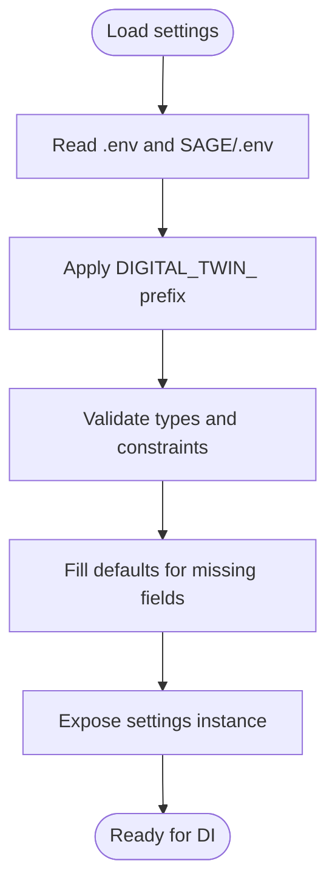
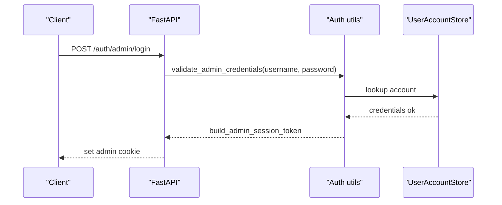
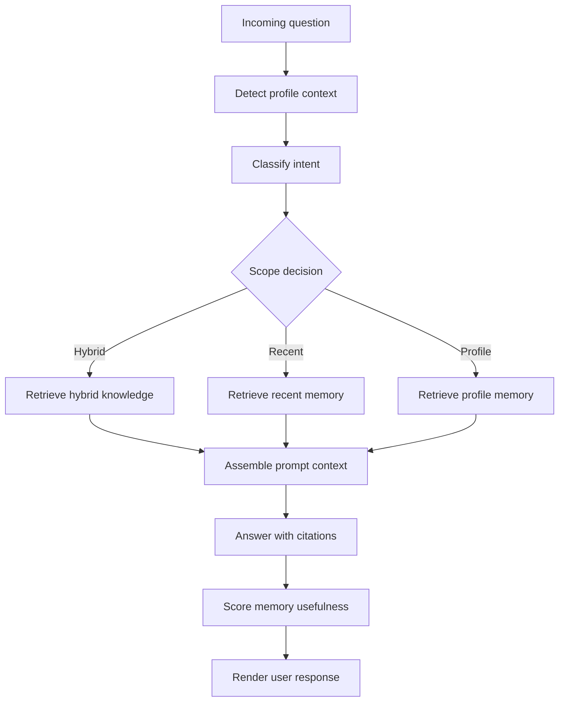
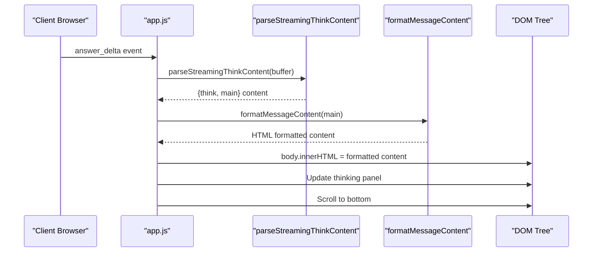
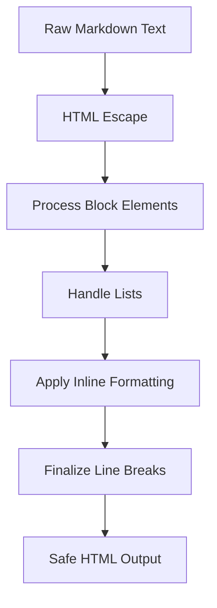
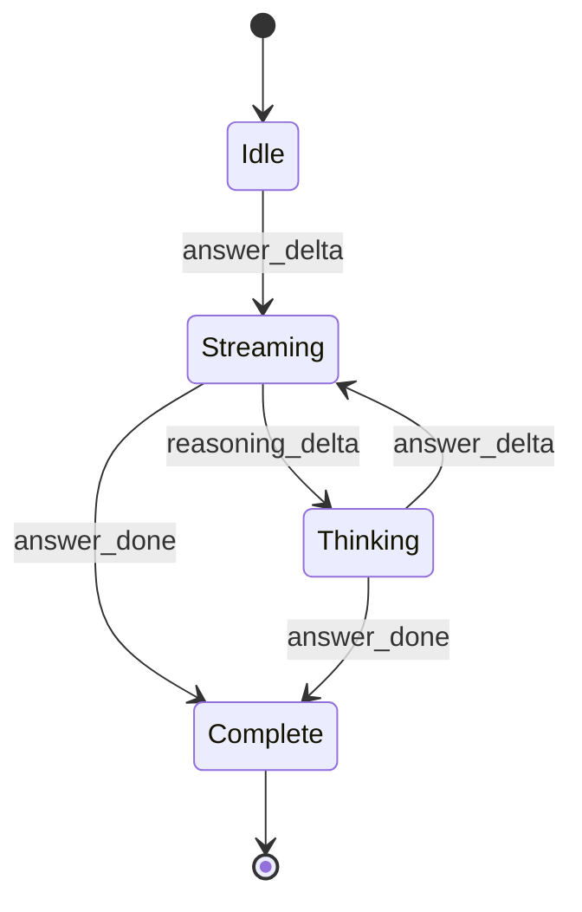
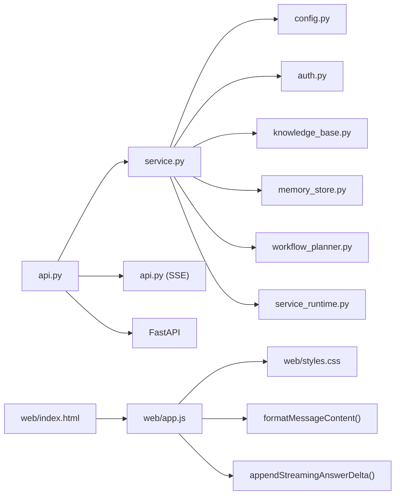

# Core Components

<cite>
**Referenced Files in This Document**
- [service.py](file://src/sage_faculty_twin/service.py)
- [config.py](file://src/sage_faculty_twin/config.py)
- [runtime_env.py](file://src/sage_faculty_twin/runtime_env.py)
- [auth.py](file://src/sage_faculty_twin/auth.py)
- [knowledge_base.py](file://src/sage_faculty_twin/knowledge_base.py)
- [service_runtime.py](file://src/sage_faculty_twin/service_runtime.py)
- [workflow_planner.py](file://src/sage_faculty_twin/workflow_planner.py)
- [memory_store.py](file://src/sage_faculty_twin/memory_store.py)
- [api.py](file://src/sage_faculty_twin/api.py)
- [models.py](file://src/sage_faculty_twin/models.py)
- [index.html](file://src/sage_faculty_twin/web/index.html)
- [app.js](file://src/sage_faculty_twin/web/app.js)
- [styles.css](file://src/sage_faculty_twin/web/styles.css)
</cite>

## Update Summary
**Changes Made**
- Enhanced web interface documentation with comprehensive markdown rendering capabilities
- Added detailed streaming response handling with formatted innerHTML implementation
- Updated frontend architecture to reflect improved markdown processing pipeline
- Expanded streaming optimization documentation with real-time content rendering

## Table of Contents
1. [Introduction](#introduction)
2. [Project Structure](#project-structure)
3. [Core Components](#core-components)
4. [Architecture Overview](#architecture-overview)
5. [Detailed Component Analysis](#detailed-component-analysis)
6. [Enhanced Web Interface Architecture](#enhanced-web-interface-architecture)
7. [Markdown Rendering Pipeline](#markdown-rendering-pipeline)
8. [Streaming Response Handling](#streaming-response-handling)
9. [Dependency Analysis](#dependency-analysis)
10. [Performance Considerations](#performance-considerations)
11. [Troubleshooting Guide](#troubleshooting-guide)
12. [Conclusion](#conclusion)

## Introduction
This document explains the core backend components of Sage Faculty Twin, focusing on the service layer architecture, configuration management, authentication and authorization, runtime environment handling, workflow orchestration, memory management integration, and knowledge base connectivity. The system has been enhanced with comprehensive web interface capabilities including advanced markdown rendering and optimized streaming response handling with formatted innerHTML.

## Project Structure
The backend is organized around a FastAPI application that exposes REST endpoints and an internal service layer responsible for orchestrating workflows. The frontend has been significantly enhanced with comprehensive markdown rendering capabilities and real-time streaming optimizations. Key modules include:
- Configuration and environment bootstrap
- Authentication and session management
- Knowledge base and memory stores
- Workflow planner and policy enforcement
- Runtime service control
- API entrypoints and SSE event streaming
- Enhanced web interface with markdown rendering

```mermaid
graph TB
subgraph "HTTP Layer"
API["FastAPI app<br/>routes and SSE"]
end
subgraph "Service Layer"
SVC["DigitalTwinService<br/>orchestrator"]
PLANNER["DeterministicWorkflowPlanner"]
AUTH["Auth utilities"]
CFG["AppSettings"]
RTENV["RuntimeEnv bootstrap"]
END
subgraph "Data Stores"
KB["LocalKnowledgeStore"]
MEM["NeuroMemConversationStore"]
END
subgraph "External Integrations"
LLM["VllmChatClient"]
EMAIL["BookingEmailNotifier"]
SYS["ServiceRuntimeManager"]
END
subgraph "Enhanced Frontend"
WEB["Web Interface<br/>Markdown Renderer"]
STREAM["Streaming Handler<br/>Formatted innerHTML"]
MARKDOWN["Markdown Pipeline<br/>Comprehensive Formatting"]
END
API --> SVC
SVC --> PLANNER
SVC --> AUTH
SVC --> CFG
SVC --> RTENV
SVC --> KB
SVC --> MEM
SVC --> LLM
SVC --> EMAIL
SVC --> SYS
WEB --> STREAM
STREAM --> MARKDOWN
```

**Diagram sources**
- [api.py:90-116](file://src/sage_faculty_twin/api.py#L90-L116)
- [service.py:581-634](file://src/sage_faculty_twin/service.py#L581-L634)
- [workflow_planner.py:90-133](file://src/sage_faculty_twin/workflow_planner.py#L90-L133)
- [auth.py:19-214](file://src/sage_faculty_twin/auth.py#L19-L214)
- [config.py:9-132](file://src/sage_faculty_twin/config.py#L9-L132)
- [runtime_env.py:102-131](file://src/sage_faculty_twin/runtime_env.py#L102-L131)
- [knowledge_base.py:121-140](file://src/sage_faculty_twin/knowledge_base.py#L121-L140)
- [memory_store.py:223-257](file://src/sage_faculty_twin/memory_store.py#L223-L257)
- [service_runtime.py:13-69](file://src/sage_faculty_twin/service_runtime.py#L13-L69)
- [index.html](file://src/sage_faculty_twin/web/index.html)
- [app.js](file://src/sage_faculty_twin/web/app.js)

**Section sources**
- [api.py:90-116](file://src/sage_faculty_twin/api.py#L90-L116)
- [service.py:581-634](file://src/sage_faculty_twin/service.py#L581-L634)
- [config.py:9-132](file://src/sage_faculty_twin/config.py#L9-L132)
- [runtime_env.py:102-131](file://src/sage_faculty_twin/runtime_env.py#L102-L131)

## Core Components
- Configuration Management (AppSettings)
  - Centralized settings with environment variable support and sensible defaults for LLM, retrieval, memory, SMTP, and operational paths.
  - Example paths:
    - [AppSettings class:9-132](file://src/sage_faculty_twin/config.py#L9-L132)
    - [settings instance:131-132](file://src/sage_faculty_twin/config.py#L131-L132)

- Runtime Environment Bootstrap
  - Prepares project and sibling repositories to Python path, validates optional dependencies, and ensures local policy precedence.
  - Example paths:
    - [bootstrap_runtime_env:102-131](file://src/sage_faculty_twin/runtime_env.py#L102-L131)

- Authentication and Authorization
  - Session cookie management for admin and user roles, HMAC-signed payloads, and normalized identity resolution.
  - Example paths:
    - [Admin session token helpers:20-54](file://src/sage_faculty_twin/auth.py#L20-L54)
    - [User session token helpers:41-54](file://src/sage_faculty_twin/auth.py#L41-L54)
    - [Admin session cookie setters/getters:57-86](file://src/sage_faculty_twin/auth.py#L57-L86)
    - [Identity normalization and validation:119-172](file://src/sage_faculty_twin/auth.py#L119-L172)

- Knowledge Base Connectivity
  - Local knowledge store supporting multiple backends (sagevdb, neuromem) with lexical and dense retrieval modes.
  - Example paths:
    - [LocalKnowledgeStore:121-140](file://src/sage_faculty_twin/knowledge_base.py#L121-L140)
    - [Search and indexing:273-295](file://src/sage_faculty_twin/knowledge_base.py#L273-L295)

- Memory Management Integration
  - Short-term and long-term memory collections backed by layered storage and telemetry.
  - Example paths:
    - [NeuroMemConversationStore:223-257](file://src/sage_faculty_twin/memory_store.py#L223-L257)
    - [Add exchange and consolidate profiles:380-444](file://src/sage_faculty_twin/memory_store.py#L380-L444)

- Workflow Orchestration and Planning
  - Deterministic planner with policy-driven plans, evidence contracts, and risk-level mapping.
  - Example paths:
    - [DeterministicWorkflowPlanner:90-133](file://src/sage_faculty_twin/workflow_planner.py#L90-L133)
    - [Plan building heuristics:179-425](file://src/sage_faculty_twin/workflow_planner.py#L179-L425)

- Service Runtime Control
  - Wrapper around system service scripts to start/stop/restart managed services.
  - Example paths:
    - [ServiceRuntimeManager:13-69](file://src/sage_faculty_twin/service_runtime.py#L13-L69)

- API Entrypoints and SSE Streaming
  - Lazy initialization of the service, SSE broker for workflow events, and endpoint routing.
  - Example paths:
    - [LazyDigitalTwinService:94-116](file://src/sage_faculty_twin/api.py#L94-L116)
    - [WorkflowEventBroker:170-256](file://src/sage_faculty_twin/api.py#L170-L256)
    - [Chat endpoint with streaming:618-700](file://src/sage_faculty_twin/api.py#L618-L700)

**Section sources**
- [config.py:9-132](file://src/sage_faculty_twin/config.py#L9-L132)
- [runtime_env.py:102-131](file://src/sage_faculty_twin/runtime_env.py#L102-L131)
- [auth.py:19-214](file://src/sage_faculty_twin/auth.py#L19-L214)
- [knowledge_base.py:121-140](file://src/sage_faculty_twin/knowledge_base.py#L121-L140)
- [memory_store.py:223-257](file://src/sage_faculty_twin/memory_store.py#L223-L257)
- [workflow_planner.py:90-133](file://src/sage_faculty_twin/workflow_planner.py#L90-L133)
- [service_runtime.py:13-69](file://src/sage_faculty_twin/service_runtime.py#L13-L69)
- [api.py:94-116](file://src/sage_faculty_twin/api.py#L94-L116)

## Architecture Overview
The system follows a layered architecture with enhanced web interface capabilities:
- HTTP layer (FastAPI) handles requests, cookies, and SSE streaming.
- Service layer orchestrates planning, retrieval, LLM invocation, persistence, and notifications.
- Data stores encapsulate knowledge and memory with pluggable backends.
- Runtime manager coordinates external services.
- Enhanced frontend with comprehensive markdown rendering and streaming optimizations.



**Diagram sources**
- [api.py:618-700](file://src/sage_faculty_twin/api.py#L618-L700)
- [service.py:581-634](file://src/sage_faculty_twin/service.py#L581-L634)
- [workflow_planner.py:110-133](file://src/sage_faculty_twin/workflow_planner.py#L110-L133)
- [knowledge_base.py:273-295](file://src/sage_faculty_twin/knowledge_base.py#L273-L295)
- [memory_store.py:446-489](file://src/sage_faculty_twin/memory_store.py#L446-L489)

## Detailed Component Analysis

### Service Layer Orchestrator
- Responsibilities
  - Build workflow context from incoming requests.
  - Delegate planning, retrieval, and generation to specialized components.
  - Persist memory and artifacts, dispatch follow-ups, and notify escalations.
  - Stream workflow events and answer deltas via SSE.
- Key patterns
  - Dependency injection via constructor parameters for stores, clients, and policies.
  - Callback hooks for tracing and streaming.
- Implementation references
  - [FacultyTwinWorkflowSupport:581-634](file://src/sage_faculty_twin/service.py#L581-L634)
  - [bootstrap_chat:635-678](file://src/sage_faculty_twin/service.py#L635-L678)
  - [understand_interaction:696-775](file://src/sage_faculty_twin/service.py#L696-L775)
  - [prepare_booking:777-860](file://src/sage_faculty_twin/service.py#L777-L860)



**Diagram sources**
- [service.py:581-634](file://src/sage_faculty_twin/service.py#L581-L634)
- [workflow_planner.py:90-133](file://src/sage_faculty_twin/workflow_planner.py#L90-L133)
- [knowledge_base.py:121-140](file://src/sage_faculty_twin/knowledge_base.py#L121-L140)
- [memory_store.py:223-257](file://src/sage_faculty_twin/memory_store.py#L223-L257)

**Section sources**
- [service.py:581-634](file://src/sage_faculty_twin/service.py#L581-L634)
- [workflow_planner.py:90-133](file://src/sage_faculty_twin/workflow_planner.py#L90-L133)
- [knowledge_base.py:121-140](file://src/sage_faculty_twin/knowledge_base.py#L121-L140)
- [memory_store.py:223-257](file://src/sage_faculty_twin/memory_store.py#L223-L257)

### Configuration Management System
- Design
  - Pydantic BaseSettings with environment prefix DIGITAL_TWIN_.
  - Loads from .env and sibling SAGE/.env for layered overrides.
  - Provides defaults for LLM, retrieval, memory, SMTP, and operational paths.
- Usage
  - Centralized access via settings instance.
- Implementation references
  - [AppSettings:9-132](file://src/sage_faculty_twin/config.py#L9-L132)
  - [settings instance:131-132](file://src/sage_faculty_twin/config.py#L131-L132)



**Diagram sources**
- [config.py:9-132](file://src/sage_faculty_twin/config.py#L9-L132)

**Section sources**
- [config.py:9-132](file://src/sage_faculty_twin/config.py#L9-L132)

### Authentication and Authorization Mechanisms
- Admin and user sessions
  - Signed cookies with HMAC-SHA256 signatures and expiration.
  - Normalization resolves effective roles and usernames.
- Endpoints
  - Login/logout routes set/clear cookies.
- Implementation references
  - [Admin session helpers:20-54](file://src/sage_faculty_twin/auth.py#L20-L54)
  - [User session helpers:41-54](file://src/sage_faculty_twin/auth.py#L41-L54)
  - [Cookie setters/getters:57-86](file://src/sage_faculty_twin/auth.py#L57-L86)
  - [Identity resolution:119-172](file://src/sage_faculty_twin/auth.py#L119-L172)
  - [API auth endpoints:479-510](file://src/sage_faculty_twin/api.py#L479-L510)



**Diagram sources**
- [auth.py:158-172](file://src/sage_faculty_twin/auth.py#L158-L172)
- [api.py:479-483](file://src/sage_faculty_twin/api.py#L479-L483)

**Section sources**
- [auth.py:19-214](file://src/sage_faculty_twin/auth.py#L19-L214)
- [api.py:479-510](file://src/sage_faculty_twin/api.py#L479-L510)

### Runtime Environment Handling
- Bootstrapping tasks
  - Prepend sibling repos to sys.path.
  - Validate sageVDB source presence and compiled extensions.
  - Ensure local policy module is preferred.
  - Require optional dependencies.
- Implementation references
  - [bootstrap_runtime_env:102-131](file://src/sage_faculty_twin/runtime_env.py#L102-L131)

**Section sources**
- [runtime_env.py:102-131](file://src/sage_faculty_twin/runtime_env.py#L102-L131)

### Workflow Orchestration
- Planner
  - Heuristic-driven plan building with evidence contracts and risk levels.
  - Acceptance or fallback to templates.
- Implementation references
  - [DeterministicWorkflowPlanner.plan:110-133](file://src/sage_faculty_twin/workflow_planner.py#L110-L133)
  - [Plan building heuristics:179-425](file://src/sage_faculty_twin/workflow_planner.py#L179-L425)



**Diagram sources**
- [workflow_planner.py:179-425](file://src/sage_faculty_twin/workflow_planner.py#L179-L425)

**Section sources**
- [workflow_planner.py:90-133](file://src/sage_faculty_twin/workflow_planner.py#L90-L133)
- [workflow_planner.py:179-425](file://src/sage_faculty_twin/workflow_planner.py#L179-L425)

### Memory Management Integration
- Short-term conversation memory
  - Indexed collections with configurable index types and neural configs.
  - Telemetry for reads/writes and usefulness scoring.
- Long-term profile memory
  - Summarization and categorization for student contexts.
- Implementation references
  - [NeuroMemConversationStore:223-257](file://src/sage_faculty_twin/memory_store.py#L223-L257)
  - [Add exchange:380-424](file://src/sage_faculty_twin/memory_store.py#L380-L424)
  - [Consolidate profiles:426-444](file://src/sage_faculty_twin/memory_store.py#L426-L444)
  - [Search:446-489](file://src/sage_faculty_twin/memory_store.py#L446-L489)

**Section sources**
- [memory_store.py:223-257](file://src/sage_faculty_twin/memory_store.py#L223-L257)
- [memory_store.py:380-444](file://src/sage_faculty_twin/memory_store.py#L380-L444)
- [memory_store.py:446-489](file://src/sage_faculty_twin/memory_store.py#L446-L489)

### Knowledge Base Connectivity
- Backends
  - sagevdb: flat or ANN indices with configurable embedding backends.
  - neuromem: bm25 or FAISS dense index with sentence-transformers.
- Implementation references
  - [LocalKnowledgeStore:121-140](file://src/sage_faculty_twin/knowledge_base.py#L121-L140)
  - [Search:273-295](file://src/sage_faculty_twin/knowledge_base.py#L273-L295)
  - [Neuromem FAISS batch indexing:522-560](file://src/sage_faculty_twin/knowledge_base.py#L522-L560)

**Section sources**
- [knowledge_base.py:121-140](file://src/sage_faculty_twin/knowledge_base.py#L121-L140)
- [knowledge_base.py:273-295](file://src/sage_faculty_twin/knowledge_base.py#L273-L295)
- [knowledge_base.py:522-560](file://src/sage_faculty_twin/knowledge_base.py#L522-L560)

### Inter-Component Communication
- Dependency Injection
  - Constructor injection of stores, clients, and settings into the orchestrator.
- Event Streaming
  - SSE broker publishes trace steps and answer deltas during chat.
- Implementation references
  - [LazyDigitalTwinService:94-116](file://src/sage_faculty_twin/api.py#L94-L116)
  - [WorkflowEventBroker:170-256](file://src/sage_faculty_twin/api.py#L170-L256)
  - [Chat endpoint wiring:618-700](file://src/sage_faculty_twin/api.py#L618-L700)

**Section sources**
- [api.py:94-116](file://src/sage_faculty_twin/api.py#L94-L116)
- [api.py:170-256](file://src/sage_faculty_twin/api.py#L170-L256)
- [api.py:618-700](file://src/sage_faculty_twin/api.py#L618-L700)

### Service Lifecycle Management
- Initialization
  - LazyDigitalTwinService defers instantiation until first use.
- Shutdown
  - Graceful teardown on FastAPI shutdown event.
- Implementation references
  - [LazyDigitalTwinService:94-116](file://src/sage_faculty_twin/api.py#L94-L116)
  - [Shutdown handler:612-616](file://src/sage_faculty_twin/api.py#L612-L616)

**Section sources**
- [api.py:94-116](file://src/sage_faculty_twin/api.py#L94-L116)
- [api.py:612-616](file://src/sage_faculty_twin/api.py#L612-L616)

## Enhanced Web Interface Architecture

### Web Interface Components
The enhanced web interface consists of three main components working together to provide comprehensive markdown rendering and optimized streaming:

- **Frontend Shell (index.html)**: Main HTML structure with responsive design, accessibility features, and modular UI components.
- **Application Logic (app.js)**: Comprehensive JavaScript implementation handling streaming responses, markdown processing, and real-time updates.
- **Styling (styles.css)**: CSS framework supporting the enhanced interface with modern design patterns.

### Streaming Response Handling
The system implements sophisticated streaming response handling with real-time content rendering:



**Diagram sources**
- [app.js:6701-6729](file://src/sage_faculty_twin/web/app.js#L6701-L6729)
- [app.js:6732-6753](file://src/sage_faculty_twin/web/app.js#L6732-L6753)
- [app.js:7749-7809](file://src/sage_faculty_twin/web/app.js#L7749-L7809)

### Markdown Rendering Pipeline
The enhanced markdown rendering system processes content through a comprehensive pipeline supporting all major markdown features:

#### Block-Level Elements Processing
- **Fenced Code Blocks**: ```language\ncontent``` becomes `<pre>content</pre>`
- **Headings**: `### Header` → `<h3>Header</h3>`, `## Header` → `<h2>Header</h2>`, `# Header` → `<h1>Header</h1>`
- **Horizontal Rules**: `---` becomes `<hr>`
- **Blockquotes**: `> Quote` transforms to `<blockquote>Quote</blockquote>`

#### List Processing
- **Unordered Lists**: Lines starting with `- ` grouped into `<ul>` blocks
- **Ordered Lists**: Lines starting with `N. ` grouped into `<ol>` blocks

#### Inline Formatting
- **Inline Code**: `` `code` `` → `<code>code</code>`
- **Bold Text**: `**bold**` → `<strong>bold</strong>`
- **Italic Text**: `*italic*` → `<em>italic</em>`
- **Links**: `[text](url)` → `<a href="url" target="_blank" rel="noopener noreferrer">text</a>`

#### Safety and Formatting
- **XSS Prevention**: All content is HTML-escaped before processing
- **JavaScript URI Blocking**: Prevents dangerous `javascript:` links
- **Line Break Handling**: Converts newlines to `<br>` except after block tags

**Section sources**
- [app.js:7749-7809](file://src/sage_faculty_twin/web/app.js#L7749-L7809)
- [app.js:6701-6729](file://src/sage_faculty_twin/web/app.js#L6701-L6729)
- [app.js:6732-6753](file://src/sage_faculty_twin/web/app.js#L6732-L6753)

## Markdown Rendering Pipeline

### Comprehensive Feature Support
The enhanced markdown renderer supports a complete set of formatting features:

#### Advanced Code Block Handling
- **Syntax Highlighting Ready**: Code blocks preserve language information for future enhancements
- **Multi-language Support**: Automatic detection and formatting for various programming languages
- **Clean Output**: Trims whitespace and maintains code formatting integrity

#### Hierarchical Headings
- **Triple Level Support**: H1, H2, and H3 headings with proper semantic markup
- **Responsive Design**: Headings adapt to different screen sizes and contexts

#### Content Organization Features
- **Horizontal Dividers**: Clear section separation with `<hr>` elements
- **Quoted Content**: Properly formatted blockquotes for emphasis and citations
- **Structured Lists**: Both ordered and unordered lists with intelligent grouping

#### Text Formatting Capabilities
- **Monospace Typography**: Inline code blocks for technical terms and commands
- **Emphasis Systems**: Strong and em text for varying degrees of emphasis
- **Hyperlink Safety**: Secure link handling with proper attributes and security measures

#### Processing Pipeline
The renderer follows a strict processing order to ensure proper content transformation:



**Diagram sources**
- [app.js:7749-7809](file://src/sage_faculty_twin/web/app.js#L7749-L7809)

**Section sources**
- [app.js:7749-7809](file://src/sage_faculty_twin/web/app.js#L7749-L7809)

## Streaming Response Handling

### Real-Time Content Delivery
The streaming response system optimizes user experience through progressive content delivery:

#### Streaming Buffer Management
- **Dual Buffer System**: Separate buffers for main content and thinking process
- **Incremental Parsing**: Real-time extraction of `<think>` blocks from streaming data
- **Content Separation**: Automatic splitting of reasoning text from main response

#### Progressive Rendering
- **Thought Process Visibility**: Real-time display of reasoning in dedicated panel
- **Main Content Streaming**: Progressive rendering of primary response content
- **Dynamic DOM Updates**: Efficient DOM manipulation for minimal layout thrashing

#### Event Stream Processing
The system processes multiple event types for comprehensive interaction:



**Diagram sources**
- [app.js:6808-6841](file://src/sage_faculty_twin/web/app.js#L6808-L6841)

### Performance Optimizations
- **Keepalive Handling**: Backend emits periodic keepalive events to prevent connection drops
- **Buffer Management**: Efficient string concatenation and cleanup for streaming data
- **DOM Optimization**: Minimal DOM operations during frequent updates
- **Scroll Management**: Automatic scrolling to newly added content

**Section sources**
- [app.js:6701-6729](file://src/sage_faculty_twin/web/app.js#L6701-L6729)
- [app.js:6732-6753](file://src/sage_faculty_twin/web/app.js#L6732-L6753)
- [app.js:6808-6841](file://src/sage_faculty_twin/web/app.js#L6808-L6841)

## Dependency Analysis
- Internal dependencies
  - API depends on LazyDigitalTwinService and WorkflowEventBroker.
  - Service orchestrator composes planner, knowledge store, memory store, and clients.
- External dependencies
  - FastAPI for routing and middleware.
  - Optional PDF parsing for attachments.
  - Enhanced frontend with comprehensive JavaScript dependencies.
- Runtime checks
  - Runtime environment validates optional packages and enforces local policy precedence.
- Frontend dependencies
  - Modern JavaScript features for streaming and DOM manipulation.
  - CSS Grid and Flexbox for responsive layouts.
  - Accessibility features for inclusive design.



**Diagram sources**
- [api.py:90-116](file://src/sage_faculty_twin/api.py#L90-L116)
- [service.py:581-634](file://src/sage_faculty_twin/service.py#L581-L634)
- [config.py:9-132](file://src/sage_faculty_twin/config.py#L9-L132)
- [auth.py:19-214](file://src/sage_faculty_twin/auth.py#L19-L214)
- [knowledge_base.py:121-140](file://src/sage_faculty_twin/knowledge_base.py#L121-L140)
- [memory_store.py:223-257](file://src/sage_faculty_twin/memory_store.py#L223-L257)
- [workflow_planner.py:90-133](file://src/sage_faculty_twin/workflow_planner.py#L90-L133)
- [service_runtime.py:13-69](file://src/sage_faculty_twin/service_runtime.py#L13-L69)
- [index.html](file://src/sage_faculty_twin/web/index.html)
- [app.js](file://src/sage_faculty_twin/web/app.js)

**Section sources**
- [api.py:90-116](file://src/sage_faculty_twin/api.py#L90-L116)
- [service.py:581-634](file://src/sage_faculty_twin/service.py#L581-L634)

## Performance Considerations
- Prompt soft caps and truncation
  - Soft cap on assembled prompts to bound decode latency; truncation order prioritizes memory hits, knowledge excerpts, and attachment bodies.
  - References:
    - [Prompt soft cap constants:441-444](file://src/sage_faculty_twin/service.py#L441-L444)
    - [Canonical trace ordering and groups:375-423](file://src/sage_faculty_twin/service.py#L375-L423)
- Background post-answer stages
  - Enable background persistence and follow-up planning to reduce initial latency; controlled by environment flags.
  - References:
    - [Background default and toggles:428-430](file://src/sage_faculty_twin/service.py#L428-L430)
- Streaming answers
  - Optional streaming of LLM tokens over SSE to improve perceived latency.
  - References:
    - [Streaming toggle and SSE broker:145-147](file://src/sage_faculty_twin/api.py#L145-L147)
    - [WorkflowEventBroker.publish_answer_chunk:218-226](file://src/sage_faculty_twin/api.py#L218-L226)
- Memory and knowledge backends
  - Choose appropriate index types and embedding backends for retrieval throughput.
  - References:
    - [NeuroMem FAISS batch indexing:522-560](file://src/sage_faculty_twin/knowledge_base.py#L522-L560)
    - [NeuroMem bm25 index:512-518](file://src/sage_faculty_twin/knowledge_base.py#L512-L518)
- Enhanced frontend performance
  - Optimized markdown processing with efficient regex patterns and DOM manipulation.
  - Streaming response handling with minimal layout recalculations.
  - Real-time content updates with debounced scroll positioning.

[No sources needed since this section provides general guidance]

## Troubleshooting Guide
- Missing runtime dependencies
  - Runtime bootstrap raises explicit errors when required modules or compiled extensions are missing.
  - References:
    - [Runtime validation:116-130](file://src/sage_faculty_twin/runtime_env.py#L116-L130)
- Authentication failures
  - Admin login raises 401 for invalid credentials; session decoding rejects expired or tampered tokens.
  - References:
    - [Credential validation:158-172](file://src/sage_faculty_twin/auth.py#L158-L172)
    - [Session decoding:193-214](file://src/sage_faculty_twin/auth.py#L193-L214)
- Chat timeouts
  - Requests exceeding configured timeout return 504 with workflow trace context.
  - References:
    - [Timeout configuration and handling:127-129](file://src/sage_faculty_twin/api.py#L127-L129)
    - [Timeout handling in chat:641-645](file://src/sage_faculty_twin/api.py#L641-L645)
- SSE connection drops
  - Keepalive events prevent proxy timeouts during long LLM decoding windows.
  - References:
    - [Keepalive cadence:136-137](file://src/sage_faculty_twin/api.py#L136-L137)
    - [WorkflowEventBroker keepalive:194-200](file://src/sage_faculty_twin/api.py#L194-L200)
- Frontend markdown rendering issues
  - XSS prevention blocks unsafe content; verify input sanitization.
  - Streaming buffer overflow protection prevents memory leaks.
  - DOM manipulation errors handled gracefully with fallback rendering.

**Section sources**
- [runtime_env.py:116-130](file://src/sage_faculty_twin/runtime_env.py#L116-L130)
- [auth.py:158-172](file://src/sage_faculty_twin/auth.py#L158-L172)
- [auth.py:193-214](file://src/sage_faculty_twin/auth.py#L193-L214)
- [api.py:127-129](file://src/sage_faculty_twin/api.py#L127-L129)
- [api.py:641-645](file://src/sage_faculty_twin/api.py#L641-L645)
- [api.py:136-137](file://src/sage_faculty_twin/api.py#L136-L137)
- [api.py:194-200](file://src/sage_faculty_twin/api.py#L194-L200)

## Conclusion
Sage Faculty Twin's backend is a modular, configuration-driven system centered on a service orchestrator that integrates planning, retrieval, memory, and notifications. The enhanced web interface provides comprehensive markdown rendering capabilities with sophisticated streaming response handling, featuring real-time content delivery, progressive rendering, and extensive formatting support. The system emphasizes operability through environment-based configuration, robust authentication, and streaming-first UX patterns with optimized frontend performance. The architecture supports extensibility via pluggable backends, policy-driven planning, and clear dependency boundaries, now augmented with advanced web interface capabilities for rich content presentation.