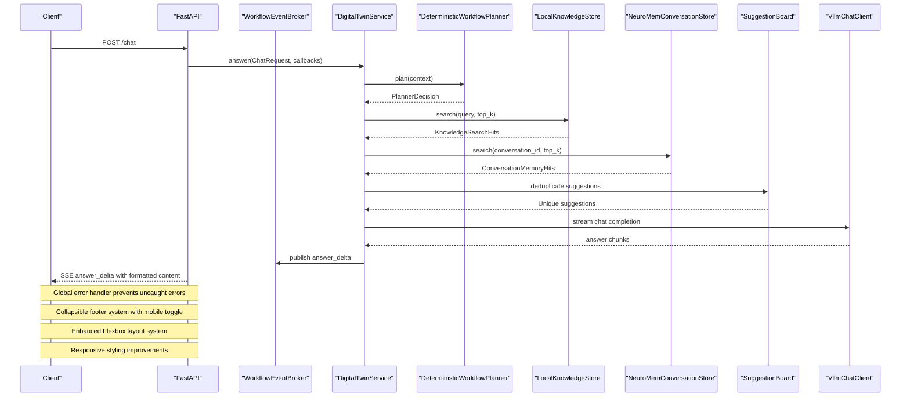
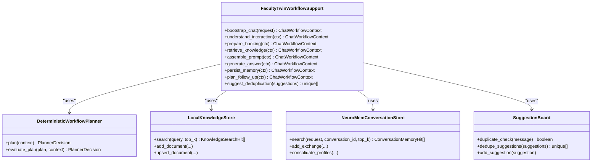
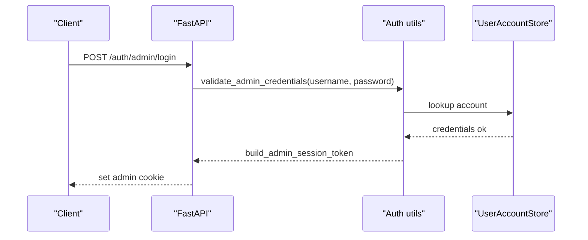
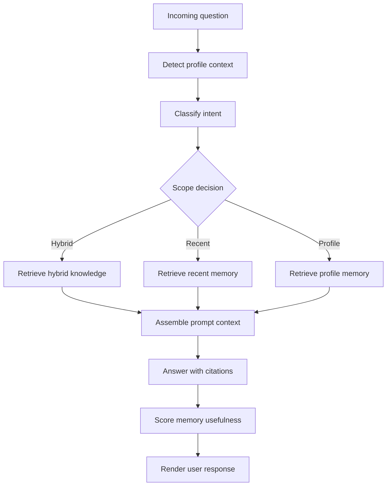
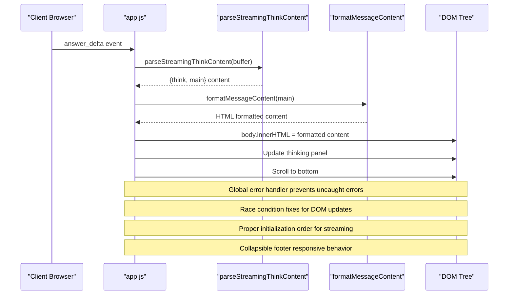
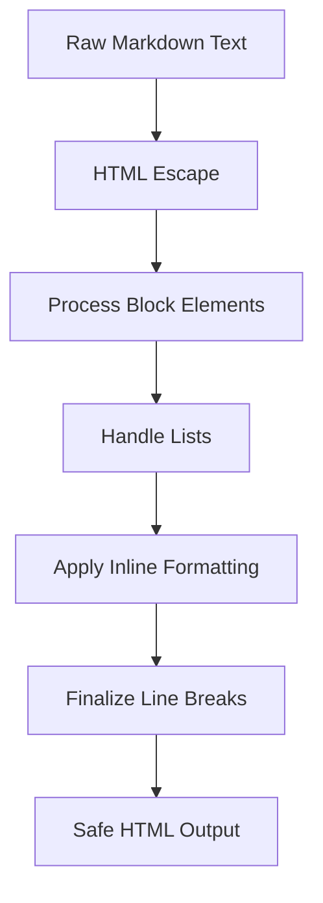
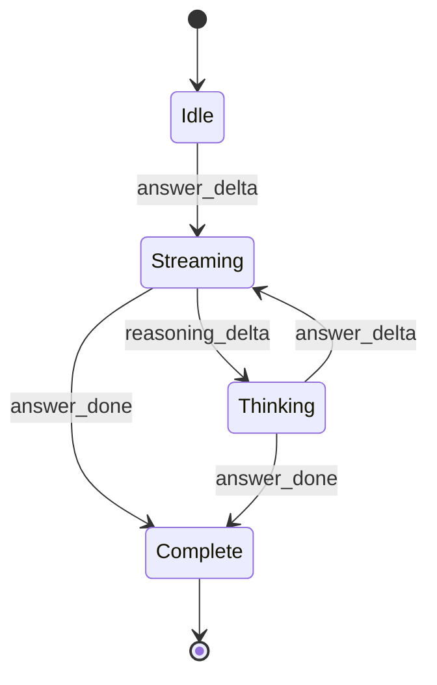
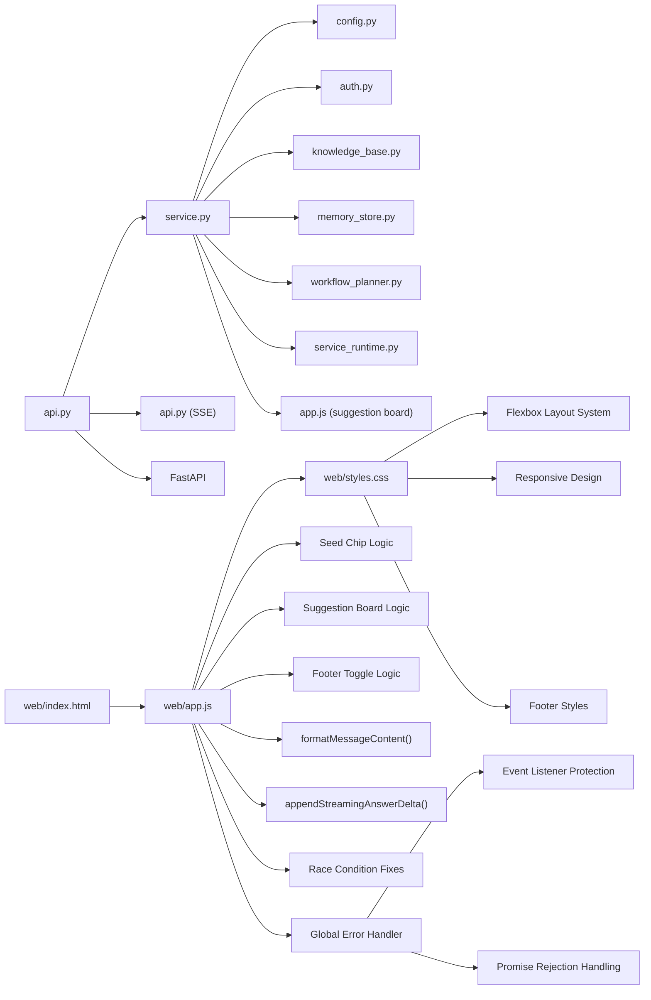

# Core Components

<cite>
**Referenced Files in This Document**
- [service.py](file://src/sage_faculty_twin/service.py)
- [config.py](file://src/sage_faculty_twin/config.py)
- [runtime_env.py](file://src/sage_faculty_twin/runtime_env.py)
- [auth.py](file://src/sage_faculty_twin/auth.py)
- [knowledge_base.py](file://src/sage_faculty_twin/knowledge_base.py)
- [service_runtime.py](file://src/sage_faculty_twin/service_runtime.py)
- [workflow_planner.py](file://src/sage_faculty_twin/workflow_planner.py)
- [memory_store.py](file://src/sage_faculty_twin/memory_store.py)
- [api.py](file://src/sage_faculty_twin/api.py)
- [models.py](file://src/sage_faculty_twin/models.py)
- [index.html](file://src/sage_faculty_twin/web/index.html)
- [app.js](file://src/sage_faculty_twin/web/app.js)
- [styles.css](file://src/sage_faculty_twin/web/styles.css)
</cite>

## Update Summary
**Changes Made**
- Added comprehensive documentation for the new global error handling system in frontend JavaScript
- Enhanced documentation for the collapsible footer system with mobile toggle functionality
- Updated layout system documentation with Flexbox implementation replacing fixed height calculations
- Documented mobile-first responsive design improvements with media queries and adaptive layouts
- Added footer toggle functionality with accessibility features and state management
- Strengthened application stability through comprehensive error handling patterns

## Table of Contents
1. [Introduction](#introduction)
2. [Project Structure](#project-structure)
3. [Core Components](#core-components)
4. [Architecture Overview](#architecture-overview)
5. [Detailed Component Analysis](#detailed-component-analysis)
6. [Enhanced Web Interface Architecture](#enhanced-web-interface-architecture)
7. [Global Error Handling System](#global-error-handling-system)
8. [Collapsible Footer System](#collapsible-footer-system)
9. [Enhanced Layout System with Flexbox](#enhanced-layout-system-with-flexbox)
10. [Improved Styling System](#improved-styling-system)
11. [Mobile-First Responsive Design](#mobile-first-responsive-design)
12. [Footer Toggle Functionality](#footer-toggle-functionality)
13. [Seed Chip Implementation](#seed-chip-implementation)
14. [Race Condition Fixes](#race-condition-fixes)
15. [Chat Empty State Management](#chat-empty-state-management)
16. [Streaming Response Optimization](#streaming-response-optimization)
17. [Suggestion Board Deduplication](#suggestion-board-deduplication)
18. [Changelog Modal Accessibility](#changelog-modal-accessibility)
19. [CSS Overflow Management](#css-overflow-management)
20. [Sidebar Redesign](#sidebar-redesign)
21. [Markdown Rendering Pipeline](#markdown-rendering-pipeline)
22. [Dependency Analysis](#dependency-analysis)
23. [Performance Considerations](#performance-considerations)
24. [Troubleshooting Guide](#troubleshooting-guide)
25. [Conclusion](#conclusion)

## Introduction
This document explains the core backend components of Sage Faculty Twin, focusing on the service layer architecture, configuration management, authentication and authorization, runtime environment handling, workflow orchestration, memory management integration, and knowledge base connectivity. The system has been enhanced with comprehensive web interface capabilities including advanced markdown rendering, optimized streaming response handling, seed chip implementation, suggestion board deduplication, collapsible footer system with mobile toggle functionality, enhanced layout system using Flexbox instead of fixed height calculations, improved styling system with responsive behavior, and a robust global error handling system to prevent uncaught JavaScript errors from breaking event listeners and strengthening application stability.

## Project Structure
The backend is organized around a FastAPI application that exposes REST endpoints and an internal service layer responsible for orchestrating workflows. The frontend has been significantly enhanced with comprehensive markdown rendering capabilities, seed chip functionality, real-time streaming optimizations, collapsible footer system, responsive design improvements, and comprehensive error handling mechanisms. Key modules include:
- Configuration and environment bootstrap
- Authentication and session management
- Knowledge base and memory stores
- Workflow planner and policy enforcement
- Runtime service control
- API entrypoints and SSE event streaming
- Enhanced web interface with seed chips, suggestion boards, collapsible footer, responsive design, and global error handling

```mermaid
graph TB
subgraph "HTTP Layer"
API["FastAPI app<br/>routes and SSE"]
end
subgraph "Service Layer"
SVC["DigitalTwinService<br/>orchestrator"]
PLANNER["DeterministicWorkflowPlanner"]
AUTH["Auth utilities"]
CFG["AppSettings"]
RTENV["RuntimeEnv bootstrap"]
END
subgraph "Data Stores"
KB["LocalKnowledgeStore"]
MEM["NeuroMemConversationStore"]
SUGGESTIONS["SuggestionBoard<br/>with deduplication"]
END
subgraph "External Integrations"
LLM["VllmChatClient"]
EMAIL["BookingEmailNotifier"]
SYS["ServiceRuntimeManager"]
END
subgraph "Enhanced Frontend"
WEB["Web Interface<br/>Seed Chips & Accessibility"]
STREAM["Streaming Handler<br/>Race Condition Fixed"]
MARKDOWN["Markdown Pipeline<br/>Comprehensive Formatting"]
COLLAPSIBLE["Collapsible Footer System<br/>Mobile Toggle"]
LAYOUT["Flexbox Layout System<br/>Responsive Design"]
STYLING["Enhanced Styling System<br/>Media Queries"]
SEED["Seed Chip System<br/>Event Delegation"]
EMPTY["Empty State Manager<br/>Initialization Fix"]
ERRORHANDLER["Global Error Handler<br/>Prevent Uncaught Errors"]
END
API --> SVC
SVC --> PLANNER
SVC --> AUTH
SVC --> CFG
SVC --> RTENV
SVC --> KB
SVC --> MEM
SVC --> SUGGESTIONS
SVC --> LLM
SVC --> EMAIL
SVC --> SYS
WEB --> STREAM
STREAM --> MARKDOWN
WEB --> COLLAPSIBLE
WEB --> LAYOUT
WEB --> STYLING
WEB --> SEED
WEB --> EMPTY
WEB --> ERRORHANDLER
```

**Diagram sources**
- [api.py:90-116](file://src/sage_faculty_twin/api.py#L90-L116)
- [service.py:581-634](file://src/sage_faculty_twin/service.py#L581-L634)
- [workflow_planner.py:90-133](file://src/sage_faculty_twin/workflow_planner.py#L90-L133)
- [auth.py:19-214](file://src/sage_faculty_twin/auth.py#L19-L214)
- [config.py:9-132](file://src/sage_faculty_twin/config.py#L9-L132)
- [runtime_env.py:102-131](file://src/sage_faculty_twin/runtime_env.py#L102-L131)
- [knowledge_base.py:121-140](file://src/sage_faculty_twin/knowledge_base.py#L121-L140)
- [memory_store.py:223-257](file://src/sage_faculty_twin/memory_store.py#L223-L257)
- [service_runtime.py:13-69](file://src/sage_faculty_twin/service_runtime.py#L13-L69)
- [index.html](file://src/sage_faculty_twin/web/index.html)
- [app.js](file://src/sage_faculty_twin/web/app.js)

**Section sources**
- [api.py:90-116](file://src/sage_faculty_twin/api.py#L90-L116)
- [service.py:581-634](file://src/sage_faculty_twin/service.py#L581-L634)
- [config.py:9-132](file://src/sage_faculty_twin/config.py#L9-L132)
- [runtime_env.py:102-131](file://src/sage_faculty_twin/runtime_env.py#L102-L131)

## Core Components
- Configuration Management (AppSettings)
  - Centralized settings with environment variable support and sensible defaults for LLM, retrieval, memory, SMTP, and operational paths.
  - Example paths:
    - [AppSettings class:9-132](file://src/sage_faculty_twin/config.py#L9-L132)
    - [settings instance:131-132](file://src/sage_faculty_twin/config.py#L131-L132)

- Runtime Environment Bootstrap
  - Prepares project and sibling repositories to Python path, validates optional dependencies, and ensures local policy precedence.
  - Example paths:
    - [bootstrap_runtime_env:102-131](file://src/sage_faculty_twin/runtime_env.py#L102-L131)

- Authentication and Authorization
  - Session cookie management for admin and user roles, HMAC-signed payloads, and normalized identity resolution.
  - Example paths:
    - [Admin session token helpers:20-54](file://src/sage_faculty_twin/auth.py#L20-L54)
    - [User session token helpers:41-54](file://src/sage_faculty_twin/auth.py#L41-L54)
    - [Admin session cookie setters/getters:57-86](file://src/sage_faculty_twin/auth.py#L57-L86)
    - [Identity normalization and validation:119-172](file://src/sage_faculty_twin/auth.py#L119-L172)

- Knowledge Base Connectivity
  - Local knowledge store supporting multiple backends (sagevdb, neuromem) with lexical and dense retrieval modes.
  - Example paths:
    - [LocalKnowledgeStore:121-140](file://src/sage_faculty_twin/knowledge_base.py#L121-L140)
    - [Search and indexing:273-295](file://src/sage_faculty_twin/knowledge_base.py#L273-L295)

- Memory Management Integration
  - Short-term and long-term memory collections backed by layered storage and telemetry.
  - Example paths:
    - [NeuroMemConversationStore:223-257](file://src/sage_faculty_twin/memory_store.py#L223-L257)
    - [Add exchange and consolidate profiles:380-444](file://src/sage_faculty_twin/memory_store.py#L380-L444)

- Workflow Orchestration and Planning
  - Deterministic planner with policy-driven plans, evidence contracts, and risk-level mapping.
  - Example paths:
    - [DeterministicWorkflowPlanner:90-133](file://src/sage_faculty_twin/workflow_planner.py#L90-L133)
    - [Plan building heuristics:179-425](file://src/sage_faculty_twin/workflow_planner.py#L179-L425)

- Service Runtime Control
  - Wrapper around system service scripts to start/stop/restart managed services.
  - Example paths:
    - [ServiceRuntimeManager:13-69](file://src/sage_faculty_twin/service_runtime.py#L13-L69)

- API Entrypoints and SSE Streaming
  - Lazy initialization of the service, SSE broker for workflow events, and endpoint routing.
  - Example paths:
    - [LazyDigitalTwinService:94-116](file://src/sage_faculty_twin/api.py#L94-L116)
    - [WorkflowEventBroker:170-256](file://src/sage_faculty_twin/api.py#L170-L256)
    - [Chat endpoint with streaming:618-700](file://src/sage_faculty_twin/api.py#L618-L700)

**Section sources**
- [config.py:9-132](file://src/sage_faculty_twin/config.py#L9-L132)
- [runtime_env.py:102-131](file://src/sage_faculty_twin/runtime_env.py#L102-L131)
- [auth.py:19-214](file://src/sage_faculty_twin/auth.py#L19-L214)
- [knowledge_base.py:121-140](file://src/sage_faculty_twin/knowledge_base.py#L121-L140)
- [memory_store.py:223-257](file://src/sage_faculty_twin/memory_store.py#L223-L257)
- [workflow_planner.py:90-133](file://src/sage_faculty_twin/workflow_planner.py#L90-L133)
- [service_runtime.py:13-69](file://src/sage_faculty_twin/service_runtime.py#L13-L69)
- [api.py:94-116](file://src/sage_faculty_twin/api.py#L94-L116)

## Architecture Overview
The system follows a layered architecture with enhanced web interface capabilities:
- HTTP layer (FastAPI) handles requests, cookies, and SSE streaming.
- Service layer orchestrates planning, retrieval, LLM invocation, persistence, and notifications.
- Data stores encapsulate knowledge, memory, and suggestion management with deduplication.
- Runtime manager coordinates external services.
- Enhanced frontend with comprehensive markdown rendering, seed chips, collapsible footer system, responsive design with Flexbox layout, and global error handling for robust application stability.



**Diagram sources**
- [api.py:618-700](file://src/sage_faculty_twin/api.py#L618-L700)
- [service.py:581-634](file://src/sage_faculty_twin/service.py#L581-L634)
- [workflow_planner.py:110-133](file://src/sage_faculty_twin/workflow_planner.py#L110-L133)
- [knowledge_base.py:273-295](file://src/sage_faculty_twin/knowledge_base.py#L273-L295)
- [memory_store.py:446-489](file://src/sage_faculty_twin/memory_store.py#L446-L489)
- [app.js:8712-8724](file://src/sage_faculty_twin/web/app.js#L8712-L8724)

## Detailed Component Analysis

### Service Layer Orchestrator
- Responsibilities
  - Build workflow context from incoming requests.
  - Delegate planning, retrieval, and generation to specialized components.
  - Persist memory and artifacts, dispatch follow-ups, and notify escalations.
  - Stream workflow events and answer deltas via SSE.
  - Integrate suggestion board with deduplication logic.
- Key patterns
  - Dependency injection via constructor parameters for stores, clients, and policies.
  - Callback hooks for tracing and streaming.
- Implementation references
  - [FacultyTwinWorkflowSupport:581-634](file://src/sage_faculty_twin/service.py#L581-L634)
  - [bootstrap_chat:635-678](file://src/sage_faculty_twin/service.py#L635-L678)
  - [understand_interaction:696-775](file://src/sage_faculty_twin/service.py#L696-L775)
  - [prepare_booking:777-860](file://src/sage_faculty_twin/service.py#L777-L860)



**Diagram sources**
- [service.py:581-634](file://src/sage_faculty_twin/service.py#L581-L634)
- [workflow_planner.py:90-133](file://src/sage_faculty_twin/workflow_planner.py#L90-L133)
- [knowledge_base.py:121-140](file://src/sage_faculty_twin/knowledge_base.py#L121-L140)
- [memory_store.py:223-257](file://src/sage_faculty_twin/memory_store.py#L223-L257)
- [app.js:3987-4022](file://src/sage_faculty_twin/web/app.js#L3987-L4022)

**Section sources**
- [service.py:581-634](file://src/sage_faculty_twin/service.py#L581-L634)
- [workflow_planner.py:90-133](file://src/sage_faculty_twin/workflow_planner.py#L90-L133)
- [knowledge_base.py:121-140](file://src/sage_faculty_twin/knowledge_base.py#L121-L140)
- [memory_store.py:223-257](file://src/sage_faculty_twin/memory_store.py#L223-L257)

### Configuration Management System
- Design
  - Pydantic BaseSettings with environment prefix DIGITAL_TWIN_.
  - Loads from .env and sibling SAGE/.env for layered overrides.
  - Provides defaults for LLM, retrieval, memory, SMTP, and operational paths.
- Usage
  - Centralized access via settings instance.
- Implementation references
  - [AppSettings:9-132](file://src/sage_faculty_twin/config.py#L9-L132)
  - [settings instance:131-132](file://src/sage_faculty_twin/config.py#L131-L132)


**Diagram sources**
- [config.py:9-132](file://src/sage_faculty_twin/config.py#L9-L132)

**Section sources**
- [config.py:9-132](file://src/sage_faculty_twin/config.py#L9-L132)

### Authentication and Authorization Mechanisms
- Admin and user sessions
  - Signed cookies with HMAC-SHA256 signatures and expiration.
  - Normalization resolves effective roles and usernames.
- Endpoints
  - Login/logout routes set/clear cookies.
- Implementation references
  - [Admin session helpers:20-54](file://src/sage_faculty_twin/auth.py#L20-L54)
  - [User session helpers:41-54](file://src/sage_faculty_twin/auth.py#L41-L54)
  - [Cookie setters/getters:57-86](file://src/sage_faculty_twin/auth.py#L57-L86)
  - [Identity resolution:119-172](file://src/sage_faculty_twin/auth.py#L119-L172)
  - [API auth endpoints:479-510](file://src/sage_faculty_twin/api.py#L479-L510)



**Diagram sources**
- [auth.py:158-172](file://src/sage_faculty_twin/auth.py#L158-L172)
- [api.py:479-483](file://src/sage_faculty_twin/api.py#L479-L483)

**Section sources**
- [auth.py:19-214](file://src/sage_faculty_twin/auth.py#L19-L214)
- [api.py:479-510](file://src/sage_faculty_twin/api.py#L479-L510)

### Runtime Environment Handling
- Bootstrapping tasks
  - Prepend sibling repos to sys.path.
  - Validate sageVDB source presence and compiled extensions.
  - Ensure local policy module is preferred.
  - Require optional dependencies.
- Implementation references
  - [bootstrap_runtime_env:102-131](file://src/sage_faculty_twin/runtime_env.py#L102-L131)

**Section sources**
- [runtime_env.py:102-131](file://src/sage_faculty_twin/runtime_env.py#L102-L131)

### Workflow Orchestration
- Planner
  - Heuristic-driven plan building with evidence contracts and risk levels.
  - Acceptance or fallback to templates.
- Implementation references
  - [DeterministicWorkflowPlanner.plan:110-133](file://src/sage_faculty_twin/workflow_planner.py#L110-L133)
  - [Plan building heuristics:179-425](file://src/sage_faculty_twin/workflow_planner.py#L179-L425)



**Diagram sources**
- [workflow_planner.py:179-425](file://src/sage_faculty_twin/workflow_planner.py#L179-L425)

**Section sources**
- [workflow_planner.py:90-133](file://src/sage_faculty_twin/workflow_planner.py#L90-L133)
- [workflow_planner.py:179-425](file://src/sage_faculty_twin/workflow_planner.py#L179-L425)

### Memory Management Integration
- Short-term conversation memory
  - Indexed collections with configurable index types and neural configs.
  - Telemetry for reads/writes and usefulness scoring.
- Long-term profile memory
  - Summarization and categorization for student contexts.
- Implementation references
  - [NeuroMemConversationStore:223-257](file://src/sage_faculty_twin/memory_store.py#L223-L257)
  - [Add exchange:380-424](file://src/sage_faculty_twin/memory_store.py#L380-L424)
  - [Consolidate profiles:426-444](file://src/sage_faculty_twin/memory_store.py#L426-L444)
  - [Search:446-489](file://src/sage_faculty_twin/memory_store.py#L446-L489)

**Section sources**
- [memory_store.py:223-257](file://src/sage_faculty_twin/memory_store.py#L223-L257)
- [memory_store.py:380-444](file://src/sage_faculty_twin/memory_store.py#L380-L444)
- [memory_store.py:446-489](file://src/sage_faculty_twin/memory_store.py#L446-L489)

### Knowledge Base Connectivity
- Backends
  - sagevdb: flat or ANN indices with configurable embedding backends.
  - neuromem: bm25 or FAISS dense index with sentence-transformers.
- Implementation references
  - [LocalKnowledgeStore:121-140](file://src/sage_faculty_twin/knowledge_base.py#L121-L140)
  - [Search:273-295](file://src/sage_faculty_twin/knowledge_base.py#L273-L295)
  - [Neuromem FAISS batch indexing:522-560](file://src/sage_faculty_twin/knowledge_base.py#L522-L560)

**Section sources**
- [knowledge_base.py:121-140](file://src/sage_faculty_twin/knowledge_base.py#L121-L140)
- [knowledge_base.py:273-295](file://src/sage_faculty_twin/knowledge_base.py#L273-L295)
- [knowledge_base.py:522-560](file://src/sage_faculty_twin/knowledge_base.py#L522-L560)

### Inter-Component Communication
- Dependency Injection
  - Constructor injection of stores, clients, and settings into the orchestrator.
- Event Streaming
  - SSE broker publishes trace steps and answer deltas during chat.
- Implementation references
  - [LazyDigitalTwinService:94-116](file://src/sage_faculty_twin/api.py#L94-L116)
  - [WorkflowEventBroker:170-256](file://src/sage_faculty_twin/api.py#L170-L256)
  - [Chat endpoint wiring:618-700](file://src/sage_faculty_twin/api.py#L618-L700)

**Section sources**
- [api.py:94-116](file://src/sage_faculty_twin/api.py#L94-L116)
- [api.py:170-256](file://src/sage_faculty_twin/api.py#L170-L256)
- [api.py:618-700](file://src/sage_faculty_twin/api.py#L618-L700)

### Service Lifecycle Management
- Initialization
  - LazyDigitalTwinService defers instantiation until first use.
- Shutdown
  - Graceful teardown on FastAPI shutdown event.
- Implementation references
  - [LazyDigitalTwinService:94-116](file://src/sage_faculty_twin/api.py#L94-L116)
  - [Shutdown handler:612-616](file://src/sage_faculty_twin/api.py#L612-L616)

**Section sources**
- [api.py:94-116](file://src/sage_faculty_twin/api.py#L94-L116)
- [api.py:612-616](file://src/sage_faculty_twin/api.py#L612-L616)

## Enhanced Web Interface Architecture

### Web Interface Components
The enhanced web interface consists of four main components working together to provide comprehensive markdown rendering, optimized streaming with race condition fixes, collapsible footer system, responsive design with Flexbox layout, and robust error handling:

- **Frontend Shell (index.html)**: Main HTML structure with responsive design, accessibility features, modular UI components including seed chips, suggestion boards, and the new collapsible footer system with global error handling.
- **Application Logic (app.js)**: Comprehensive JavaScript implementation handling streaming responses, markdown processing, real-time updates, seed chip interactions, suggestion board management, footer toggle functionality, responsive behavior with race condition fixes, and global error handling to prevent uncaught JavaScript errors.
- **Styling (styles.css)**: CSS framework supporting the enhanced interface with modern design patterns, seed chip styling, collapsible footer styles, Flexbox layout system, comprehensive media queries for responsive behavior, and global error handling styling.
- **Footer System**: New collapsible footer with mobile toggle functionality, state management, accessibility features, and global error handling integration.
- **Global Error Handler**: Comprehensive error handling system that prevents uncaught JavaScript errors from breaking event listeners and strengthening application stability.

### Global Error Handling System

**Updated** Comprehensive global error handling system to prevent uncaught JavaScript errors from breaking event listeners

The global error handling system provides robust error management across the entire application:

- **Error Event Listener**: Captures uncaught JavaScript errors using `window.addEventListener("error", ...)`
- **Promise Rejection Handler**: Handles unhandled promise rejections with `window.addEventListener("unhandledrejection", ...)`
- **Error Logging**: Comprehensive logging of error messages, filenames, and line numbers for debugging
- **Event Listener Protection**: Prevents error propagation that could break event listeners and UI functionality
- **Application Stability**: Ensures critical UI components remain functional even when individual operations fail

Key implementation details:
- Global error capture at the window level prevents cascading failures
- Promise rejection handling protects asynchronous operations
- Detailed error information logging for debugging and monitoring
- Non-blocking error handling that allows the application to continue functioning
- Integration with existing event listener management to maintain UI responsiveness

**Section sources**
- [app.js:1-7](file://src/sage_faculty_twin/web/app.js#L1-L7)

### Collapsible Footer System

**Updated** New collapsible footer system with mobile toggle functionality

The collapsible footer system provides a responsive way to display technology stack information on mobile devices while conserving screen space on desktop:

- **Desktop Behavior**: Footer displays full information with runtime metrics and powered-by chips
- **Mobile Behavior**: Footer collapses to show only a toggle button, expanding when clicked
- **State Management**: Uses CSS classes `.footer-collapsed` and `.footer-expanded` for state control
- **Accessibility**: Proper ARIA labels and keyboard navigation support
- **Responsive Design**: Media queries handle different screen sizes appropriately

Key implementation details:
- Toggle button appears only on mobile devices (`display: flex` in media queries)
- State classes control visibility of content rows
- Smooth transitions with CSS animations
- Proper focus management and keyboard navigation
- Dynamic ARIA label updates based on state

**Section sources**
- [index.html:369-403](file://src/sage_faculty_twin/web/index.html#L369-L403)
- [styles.css:670-728](file://src/sage_faculty_twin/web/styles.css#L670-L728)
- [styles.css:5709-5724](file://src/sage_faculty_twin/web/styles.css#L5709-L5724)
- [app.js:9113-9124](file://src/sage_faculty_twin/web/app.js#L9113-L9124)

### Enhanced Layout System with Flexbox

**Updated** Flexbox layout system replacing fixed height calculations

The enhanced layout system uses Flexbox instead of fixed height calculations for better responsiveness and automatic content sizing:

- **Flexbox Containers**: Main shell, chat layout, and footer use `display: flex` with `flex-direction: column`
- **Automatic Sizing**: Content areas resize automatically based on available space
- **Responsive Grid**: Chat layout uses CSS Grid with `grid-template-columns: 1fr` for single-column layout on mobile
- **Flexible Alignment**: `align-items: start` and `justify-content: space-between` for proper content distribution
- **Mobile Positioning**: Composer shell uses `position: fixed` and `bottom: 0` for mobile-friendly chat input

Key improvements:
- Elimination of fixed height calculations that caused layout issues
- Better handling of dynamic content heights
- Improved mobile responsiveness with automatic content adaptation
- Consistent spacing and alignment across different screen sizes

**Section sources**
- [styles.css:54-65](file://src/sage_faculty_twin/web/styles.css#L54-L65)
- [styles.css:430-435](file://src/sage_faculty_twin/web/styles.css#L430-L435)
- [styles.css:5226-5231](file://src/sage_faculty_twin/web/styles.css#L5226-L5231)
- [styles.css:5274-5282](file://src/sage_faculty_twin/web/styles.css#L5274-L5282)

### Improved Styling System

**Updated** Enhanced CSS system with new rules and responsive behavior

The improved styling system includes comprehensive CSS rules for the new footer functionality and responsive design:

- **Footer Toggle Button**: Custom styling with hover effects, transitions, and mobile-specific display
- **Stack Row Layouts**: Flexbox-based layouts for runtime metrics and powered-by chips
- **Responsive Typography**: Font size adjustments for mobile devices with `font-size: 0.62rem` and `0.68rem`
- **Media Query Patterns**: Extensive use of `@media (max-width: 720px)` and `@media (max-width: 920px)` for responsive behavior
- **Accessibility Features**: Proper contrast ratios, focus indicators, and ARIA attributes

Key styling improvements:
- Consistent gap and padding values across components
- Responsive font scaling for better readability
- Enhanced hover and focus states for interactive elements
- Improved color schemes with CSS variables for theming
- Better spacing and alignment with Flexbox properties

**Section sources**
- [styles.css:678-728](file://src/sage_faculty_twin/web/styles.css#L678-L728)
- [styles.css:729-753](file://src/sage_faculty_twin/web/styles.css#L729-L753)
- [styles.css:5332-5369](file://src/sage_faculty_twin/web/styles.css#L5332-L5369)
- [styles.css:256-259](file://src/sage_faculty_twin/web/styles.css#L256-L259)

### Mobile-First Responsive Design

**Updated** Comprehensive responsive design with media queries and adaptive layouts

The mobile-first responsive design approach ensures optimal user experience across all device sizes:

- **Mobile-First Approach**: Default styles optimized for small screens, with desktop enhancements
- **Media Query Strategy**: Multiple breakpoints at 720px and 920px for different device categories
- **Adaptive Components**: Components adjust layout, spacing, and typography based on screen size
- **Touch-Friendly Interactions**: Larger touch targets and appropriate spacing for mobile devices
- **Performance Considerations**: CSS Grid and Flexbox for efficient layout calculations

Responsive improvements include:
- Fixed composer shell positioning for mobile chat input
- Flexible grid layouts that adapt to screen width
- Reduced font sizes and spacing for smaller screens
- Hidden elements on mobile that are visible on desktop
- Optimized touch targets and interactive element sizing

**Section sources**
- [styles.css:256-259](file://src/sage_faculty_twin/web/styles.css#L256-L259)
- [styles.css:5200-5207](file://src/sage_faculty_twin/web/styles.css#L5200-L5207)
- [styles.css:5226-5231](file://src/sage_faculty_twin/web/styles.css#L5226-L5231)
- [styles.css:5332-5347](file://src/sage_faculty_twin/web/styles.css#L5332-L5347)

### Footer Toggle Functionality

**Updated** Comprehensive footer toggle implementation with state management

The footer toggle functionality provides seamless state management for the collapsible footer system:

- **State Management**: Toggles between `footer-collapsed` and `footer-expanded` classes
- **Dynamic ARIA Labels**: Updates accessibility labels based on current state
- **Event Handling**: Clean event listener management with proper initialization
- **CSS Transitions**: Smooth expand/collapse animations with CSS transitions
- **Accessibility Compliance**: Proper ARIA attributes and keyboard navigation support

Implementation details:
- Toggle button click handler manages state class switching
- Dynamic ARIA label updates for screen readers
- Proper event delegation and cleanup
- CSS-based animations for smooth transitions
- Responsive behavior with media queries

**Section sources**
- [app.js:9113-9124](file://src/sage_faculty_twin/web/app.js#L9113-L9124)
- [styles.css:678-728](file://src/sage_faculty_twin/web/styles.css#L678-L728)
- [styles.css:5332-5347](file://src/sage_faculty_twin/web/styles.css#L5332-L5347)

### Seed Chip Implementation

**Updated** Enhanced seed chip functionality with interactive question suggestions

The seed chip system provides contextual question suggestions that appear above the chat composer when the chat is empty. Each seed chip contains:
- Question text stored in `data-seed-question` attribute
- Context information stored in `data-seed-context` attribute  
- Interactive click handlers that populate the chat input and submit automatically

Implementation details:
- Seed chips are initialized with event listeners that extract question and context data
- Click handlers populate the chat textarea and trigger form submission
- Responsive design with flexible wrapping and hover effects
- Accessible ARIA attributes and keyboard navigation support

**Section sources**
- [index.html:97-114](file://src/sage_faculty_twin/web/index.html#L97-L114)
- [app.js:686-695](file://src/sage_faculty_twin/web/app.js#L686-L695)
- [styles.css:5974-6006](file://src/sage_faculty_twin/web/styles.css#L5974-L6006)

### Race Condition Fixes

**Updated** Comprehensive race condition fixes for sidebar user icon and settings drawer

The enhanced web interface includes critical race condition fixes to ensure reliable user interaction:

- **Sidebar User Icon Race Condition**: Fixed timing issues where the sidebar user icon click event could fire before the settings drawer was properly initialized.
- **Settings Drawer Event Handling**: Implemented proper event delegation and initialization order to prevent race conditions during drawer opening/closing.
- **Event Listener Management**: Ensured event listeners are attached after DOM elements are ready and properly cleaned up when drawers are closed.

Key improvements:
- Deferred event listener attachment until settings drawer DOM nodes are moved into the view
- Proper initialization order for settings drawer content migration
- Race condition prevention in sidebar user icon click handlers
- Improved event delegation patterns for dynamic content

**Section sources**
- [app.js:7967-7974](file://src/sage_faculty_twin/web/app.js#L7967-L7974)
- [app.js:832-835](file://src/sage_faculty_twin/web/app.js#L832-L835)
- [app.js:1591-1600](file://src/sage_faculty_twin/web/app.js#L1591-L1600)

### Chat Empty State Management

**Updated** Proper chat empty state initialization and seed chip visibility

The enhanced empty state management ensures optimal user experience when the chat is empty:

- **Empty State Detection**: Proper detection of empty conversations using `chat-shell.chat-empty` class
- **Seed Chip Visibility**: Seed chips are prominently displayed above the composer when chat is empty
- **Layout Optimization**: Centered composition layout with proper spacing and alignment
- **Initialization Timing**: Seed chips are visible immediately upon page load without delay

Implementation details:
- Empty state class management during conversation lifecycle
- Seed chip container visibility control
- Responsive layout adjustments for empty state
- Immediate seed chip rendering without initialization delays

**Section sources**
- [styles.css:6009-6035](file://src/sage_faculty_twin/web/styles.css#L6009-L6035)
- [app.js:4514-4516](file://src/sage_faculty_twin/web/app.js#L4514-L4516)

### Streaming Response Optimization

**Updated** Enhanced streaming response handling with race condition fixes

The streaming response system has been optimized with comprehensive race condition fixes:



**Diagram sources**
- [app.js:6701-6729](file://src/sage_faculty_twin/web/app.js#L6701-L6729)
- [app.js:6732-6753](file://src/sage_faculty_twin/web/app.js#L6732-L6753)
- [app.js:7749-7809](file://src/sage_faculty_twin/web/app.js#L7749-L7809)

### Suggestion Board Deduplication

**Updated** Comprehensive deduplication mechanism for anonymous suggestions

The suggestion board implements a sophisticated deduplication system to prevent duplicate submissions:
- Duplicate detection based on message content hashing
- Real-time validation before submission
- User feedback for duplicate attempts
- Database-level deduplication for persistent storage

Key features:
- Message content comparison using secure hashing algorithms
- Duplicate prevention with immediate user feedback
- Configurable deduplication thresholds
- Admin interface for managing duplicate detection

**Section sources**
- [app.js:3987-4022](file://src/sage_faculty_twin/web/app.js#L3987-L4022)

### Changelog Modal Accessibility

**Updated** Enhanced accessibility features for version update notifications

The changelog modal includes comprehensive accessibility improvements:
- Keyboard navigation support with focus management
- Screen reader compatibility with proper ARIA labels
- High contrast mode support
- Focus trap implementation for modal dialogs
- Skip-to-content navigation support

Implementation includes:
- Modal overlay management with proper z-index handling
- Dynamic content rendering with accessibility-aware markup
- Event handling for modal opening/closing with keyboard shortcuts
- Semantic HTML structure with proper heading hierarchy

**Section sources**
- [index.html:408-416](file://src/sage_faculty_twin/web/index.html#L408-L416)
- [app.js:8636-8681](file://src/sage_faculty_twin/web/app.js#L8636-L8681)

### CSS Overflow Management

**Updated** Comprehensive overflow handling for improved layout stability

The enhanced CSS includes extensive overflow management:
- Container overflow control with hidden overflow for content areas
- Auto-scrolling regions for suggestion lists and status panels
- Flexible overflow handling for responsive design
- Preventive overflow management for seed chip containers

Key improvements:
- Consistent overflow behavior across different screen sizes
- Preventive measures for content overflow in suggestion boards
- Improved scroll behavior for long content areas
- Responsive overflow handling for mobile devices

**Section sources**
- [styles.css:39](file://src/sage_faculty_twin/web/styles.css#L39)
- [styles.css:60](file://src/sage_faculty_twin/web/styles.css#L60)
- [styles.css:445](file://src/sage_faculty_twin/web/styles.css#L445)
- [styles.css:915](file://src/sage_faculty_twin/web/styles.css#L915)

### Sidebar Redesign

**Updated** Transition from shortcut buttons to seed chips above chat composer

The sidebar underwent a significant redesign moving from traditional shortcut buttons to integrated seed chips:
- Seed chips positioned above the chat composer for better visibility
- Contextual question suggestions based on visitor profile
- Integrated with the main chat flow for seamless user experience
- Responsive design that adapts to different screen sizes

The redesign includes:
- Seed chip container with centered alignment
- Responsive flexbox layout with wrap support
- Hover effects and interactive states
- Integration with visitor profile context

**Section sources**
- [index.html:47-91](file://src/sage_faculty_twin/web/index.html#L47-L91)
- [styles.css:6009-6035](file://src/sage_faculty_twin/web/styles.css#L6009-L6035)

### Markdown Rendering Pipeline
The enhanced markdown rendering system processes content through a comprehensive pipeline supporting all major markdown features:

#### Block-Level Elements Processing
- **Fenced Code Blocks**: ```language\ncontent``` becomes `<pre>content</pre>`
- **Headings**: `### Header` → `<h3>Header</h3>`, `## Header` → `<h2>Header</h2>`, `# Header` → `<h1>Header</h1>`
- **Horizontal Rules**: `---` becomes `<hr>`
- **Blockquotes**: `> Quote` transforms to `<blockquote>Quote</blockquote>`

#### List Processing
- **Unordered Lists**: Lines starting with `- ` grouped into `<ul>` blocks
- **Ordered Lists**: Lines starting with `N. ` grouped into `<ol>` blocks

#### Inline Formatting
- **Inline Code**: `` `code` `` → `<code>code</code>`
- **Bold Text**: `**bold**` → `<strong>bold</strong>`
- **Italic Text**: `*italic*` → `<em>italic</em>`
- **Links**: `[text](url)` → `<a href="url" target="_blank" rel="noopener noreferrer">text</a>`

#### Safety and Formatting
- **XSS Prevention**: All content is HTML-escaped before processing
- **JavaScript URI Blocking**: Prevents dangerous `javascript:` links
- **Line Break Handling**: Converts newlines to `<br>` except after block tags

**Section sources**
- [app.js:7749-7809](file://src/sage_faculty_twin/web/app.js#L7749-L7809)
- [app.js:6701-6729](file://src/sage_faculty_twin/web/app.js#L6701-L6729)
- [app.js:6732-6753](file://src/sage_faculty_twin/web/app.js#L6732-L6753)

## Markdown Rendering Pipeline

### Comprehensive Feature Support
The enhanced markdown renderer supports a complete set of formatting features:

#### Advanced Code Block Handling
- **Syntax Highlighting Ready**: Code blocks preserve language information for future enhancements
- **Multi-language Support**: Automatic detection and formatting for various programming languages
- **Clean Output**: Trimming whitespace and maintaining code formatting integrity

#### Hierarchical Headings
- **Triple Level Support**: H1, H2, and H3 headings with proper semantic markup
- **Responsive Design**: Headings adapt to different screen sizes and contexts

#### Content Organization Features
- **Horizontal Dividers**: Clear section separation with `<hr>` elements
- **Quoted Content**: Properly formatted blockquotes for emphasis and citations
- **Structured Lists**: Both ordered and unordered lists with intelligent grouping

#### Text Formatting Capabilities
- **Monospace Typography**: Inline code blocks for technical terms and commands
- **Emphasis Systems**: Strong and em text for varying degrees of emphasis
- **Hyperlink Safety**: Secure link handling with proper attributes and security measures

#### Processing Pipeline
The renderer follows a strict processing order to ensure proper content transformation:



**Diagram sources**
- [app.js:7749-7809](file://src/sage_faculty_twin/web/app.js#L7749-L7809)

**Section sources**
- [app.js:7749-7809](file://src/sage_faculty_twin/web/app.js#L7749-L7809)

## Streaming Response Handling

### Real-Time Content Delivery
The streaming response system optimizes user experience through progressive content delivery with race condition fixes:

#### Streaming Buffer Management
- **Dual Buffer System**: Separate buffers for main content and thinking process
- **Incremental Parsing**: Real-time extraction of `<think>` blocks from streaming data
- **Content Separation**: Automatic splitting of reasoning text from main response

#### Progressive Rendering
- **Thought Process Visibility**: Real-time display of reasoning in dedicated panel
- **Main Content Streaming**: Progressive rendering of primary response content
- **Dynamic DOM Updates**: Efficient DOM manipulation for minimal layout thrashing

#### Event Stream Processing
The system processes multiple event types for comprehensive interaction:



**Diagram sources**
- [app.js:6808-6841](file://src/sage_faculty_twin/web/app.js#L6808-L6841)

### Performance Optimizations
- **Keepalive Handling**: Backend emits periodic keepalive events to prevent connection drops
- **Buffer Management**: Efficient string concatenation and cleanup for streaming data
- **DOM Optimization**: Minimal DOM operations during frequent updates
- **Scroll Management**: Automatic scrolling to newly added content
- **Race Condition Prevention**: Proper initialization order and event handling
- **Responsive Footer**: Collapsible footer reduces layout calculations on mobile
- **Global Error Protection**: Comprehensive error handling prevents application crashes

**Section sources**
- [app.js:6701-6729](file://src/sage_faculty_twin/web/app.js#L6701-L6729)
- [app.js:6732-6753](file://src/sage_faculty_twin/web/app.js#L6732-L6753)
- [app.js:6808-6841](file://src/sage_faculty_twin/web/app.js#L6808-L6841)

## Dependency Analysis
- Internal dependencies
  - API depends on LazyDigitalTwinService and WorkflowEventBroker.
  - Service orchestrator composes planner, knowledge store, memory store, suggestion board, and clients.
- External dependencies
  - FastAPI for routing and middleware.
  - Optional PDF parsing for attachments.
  - Enhanced frontend with comprehensive JavaScript dependencies including seed chip, suggestion board, collapsible footer logic, and global error handling.
- Runtime checks
  - Runtime environment validates optional packages and enforces local policy precedence.
- Frontend dependencies
  - Modern JavaScript features for streaming, DOM manipulation, seed chip interactions, suggestion board management, collapsible footer functionality, and global error handling.
  - CSS Grid and Flexbox for responsive layouts with overflow management.
  - Accessibility features for inclusive design including ARIA labels, keyboard navigation, footer toggle functionality, and comprehensive error handling.
  - Race condition fixes for sidebar user icon and settings drawer interactions.
  - Responsive design patterns with media queries for mobile-first approach.
  - Collapsible footer system with state management and smooth transitions.
  - Global error handling system preventing uncaught JavaScript errors from breaking event listeners.
  - Enhanced layout system with Flexbox replacing fixed height calculations.
  - Comprehensive styling system with responsive behavior and accessibility compliance.



**Diagram sources**
- [api.py:90-116](file://src/sage_faculty_twin/api.py#L90-L116)
- [service.py:581-634](file://src/sage_faculty_twin/service.py#L581-L634)
- [config.py:9-132](file://src/sage_faculty_twin/config.py#L9-L132)
- [auth.py:19-214](file://src/sage_faculty_twin/auth.py#L19-L214)
- [knowledge_base.py:121-140](file://src/sage_faculty_twin/knowledge_base.py#L121-L140)
- [memory_store.py:223-257](file://src/sage_faculty_twin/memory_store.py#L223-L257)
- [workflow_planner.py:90-133](file://src/sage_faculty_twin/workflow_planner.py#L90-L133)
- [service_runtime.py:13-69](file://src/sage_faculty_twin/service_runtime.py#L13-L69)
- [index.html](file://src/sage_faculty_twin/web/index.html)
- [app.js](file://src/sage_faculty_twin/web/app.js)

**Section sources**
- [api.py:90-116](file://src/sage_faculty_twin/api.py#L90-L116)
- [service.py:581-634](file://src/sage_faculty_twin/service.py#L581-L634)

## Performance Considerations
- Prompt soft caps and truncation
  - Soft cap on assembled prompts to bound decode latency; truncation order prioritizes memory hits, knowledge excerpts, and attachment bodies.
  - References:
    - [Prompt soft cap constants:441-444](file://src/sage_faculty_twin/service.py#L441-L444)
    - [Canonical trace ordering and groups:375-423](file://src/sage_faculty_twin/service.py#L375-L423)
- Background post-answer stages
  - Enable background persistence and follow-up planning to reduce initial latency; controlled by environment flags.
  - References:
    - [Background default and toggles:428-430](file://src/sage_faculty_twin/service.py#L428-L430)
- Streaming answers
  - Optional streaming of LLM tokens over SSE to improve perceived latency with race condition fixes and global error handling.
  - References:
    - [Streaming toggle and SSE broker:145-147](file://src/sage_faculty_twin/api.py#L145-L147)
    - [WorkflowEventBroker.publish_answer_chunk:218-226](file://src/sage_faculty_twin/api.py#L218-L226)
- Memory and knowledge backends
  - Choose appropriate index types and embedding backends for retrieval throughput.
  - References:
    - [NeuroMem FAISS batch indexing:522-560](file://src/sage_faculty_twin/knowledge_base.py#L522-L560)
    - [NeuroMem bm25 index:512-518](file://src/sage_faculty_twin/knowledge_base.py#L512-L518)
- Enhanced frontend performance
  - Optimized markdown processing with efficient regex patterns and DOM manipulation.
  - Streaming response handling with minimal layout recalculations, race condition fixes, and global error protection.
  - Real-time content updates with debounced scroll positioning.
  - Seed chip interactions with efficient event delegation and immediate visibility.
  - Suggestion board deduplication with client-side validation.
  - Changelog modal accessibility with proper focus management and keyboard navigation.
  - CSS overflow problems addressed with consistent overflow property usage.
  - Race condition issues resolved with proper event listener initialization order.
  - Sidebar user icon and settings drawer interactions fixed with deferred event attachment.
  - Chat empty state initialization issues resolved with proper class management.
  - **Global error handling system**: Comprehensive error capture and logging to prevent application crashes.
  - **Footer toggle functionality**: Efficient state management with CSS transitions and responsive behavior.
  - **Flexbox layout system**: Better performance than fixed height calculations with automatic sizing.
  - **Responsive design**: Media queries optimize rendering for different screen sizes.
  - **Mobile-first approach**: Optimized for touch interactions and smaller screens.

## Troubleshooting Guide
- Missing runtime dependencies
  - Runtime bootstrap raises explicit errors when required modules or compiled extensions are missing.
  - References:
    - [Runtime validation:116-130](file://src/sage_faculty_twin/runtime_env.py#L116-L130)
- Authentication failures
  - Admin login raises 401 for invalid credentials; session decoding rejects expired or tampered tokens.
  - References:
    - [Credential validation:158-172](file://src/sage_faculty_twin/auth.py#L158-L172)
    - [Session decoding:193-214](file://src/sage_faculty_twin/auth.py#L193-L214)
- Chat timeouts
  - Requests exceeding configured timeout return 504 with workflow trace context.
  - References:
    - [Timeout configuration and handling:127-129](file://src/sage_faculty_twin/api.py#L127-L129)
    - [Timeout handling in chat:641-645](file://src/sage_faculty_twin/api.py#L641-L645)
- SSE connection drops
  - Keepalive events prevent proxy timeouts during long LLM decoding windows.
  - References:
    - [Keepalive cadence:136-137](file://src/sage_faculty_twin/api.py#L136-L137)
    - [WorkflowEventBroker.keepalive:194-200](file://src/sage_faculty_twin/api.py#L194-L200)
- Frontend markdown rendering issues
  - XSS prevention blocks unsafe content; verify input sanitization.
  - Streaming buffer overflow protection prevents memory leaks.
  - DOM manipulation errors handled gracefully with fallback rendering.
  - Seed chip click handlers require proper event delegation setup.
  - Suggestion board deduplication requires proper message hashing implementation.
  - Changelog modal accessibility issues resolved with proper focus management.
  - CSS overflow problems addressed with consistent overflow property usage.
  - Race condition issues resolved with proper event listener initialization order.
  - Sidebar user icon and settings drawer interactions fixed with deferred event attachment.
  - Chat empty state initialization issues resolved with proper class management.
  - **Global error handling issues**: Verify error event listeners are properly attached and logging is functioning.
  - **Footer toggle issues**: Check CSS class management and event listener initialization.
  - **Flexbox layout problems**: Verify Flexbox properties and media query breakpoints.
  - **Responsive design issues**: Test with different viewport sizes and orientation changes.
  - **Collapsible footer not working**: Ensure proper CSS transitions and state class handling.

**Section sources**
- [runtime_env.py:116-130](file://src/sage_faculty_twin/runtime_env.py#L116-L130)
- [auth.py:158-172](file://src/sage_faculty_twin/auth.py#L158-L172)
- [auth.py:193-214](file://src/sage_faculty_twin/auth.py#L193-L214)
- [api.py:127-129](file://src/sage_faculty_twin/api.py#L127-L129)
- [api.py:641-645](file://src/sage_faculty_twin/api.py#L641-L645)
- [api.py:136-137](file://src/sage_faculty_twin/api.py#L136-L137)
- [api.py:194-200](file://src/sage_faculty_twin/api.py#L194-L200)

## Conclusion
Sage Faculty Twin's backend is a modular, configuration-driven system centered on a service orchestrator that integrates planning, retrieval, memory, suggestions, and notifications. The enhanced web interface provides comprehensive markdown rendering capabilities with sophisticated streaming response handling, featuring real-time content delivery, progressive rendering, extensive formatting support, seed chip functionality, suggestion board deduplication, collapsible footer system with mobile toggle functionality, enhanced layout system using Flexbox instead of fixed height calculations, improved styling system with responsive behavior, comprehensive UI/UX improvements including race condition fixes, proper initialization handling, and a robust global error handling system that prevents uncaught JavaScript errors from breaking event listeners and strengthening application stability. The system emphasizes operability through environment-based configuration, robust authentication, streaming-first UX patterns with optimized frontend performance, comprehensive responsive design with mobile-first approach, and comprehensive error handling mechanisms for enhanced reliability. The architecture supports extensibility via pluggable backends, policy-driven planning, and clear dependency boundaries, now augmented with advanced web interface capabilities for rich content presentation, improved user experience with comprehensive race condition fixes, responsive design patterns, innovative collapsible footer system for better mobile device utilization, and comprehensive error handling for enhanced application stability.