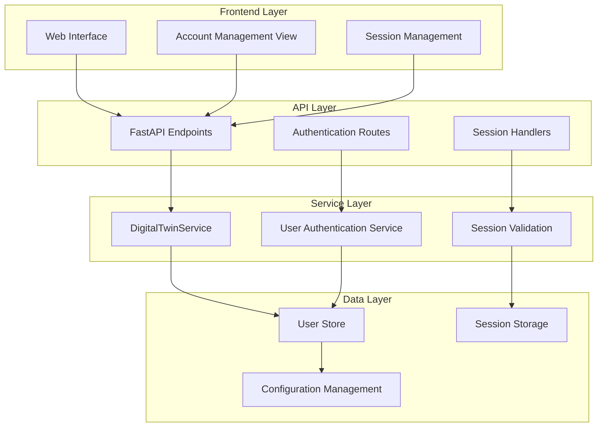
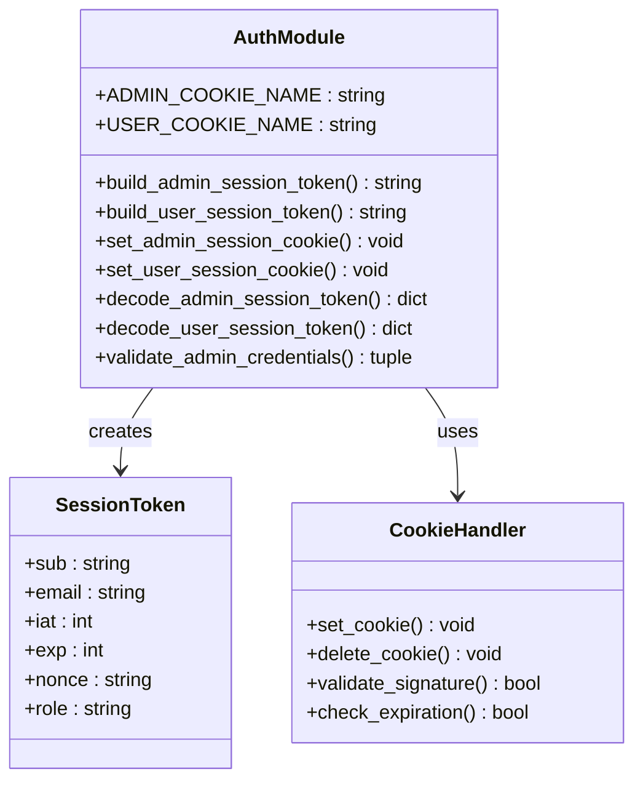
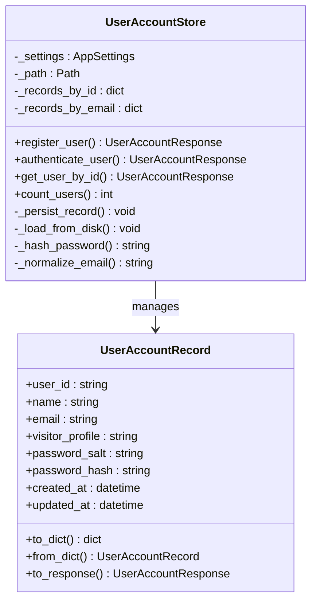
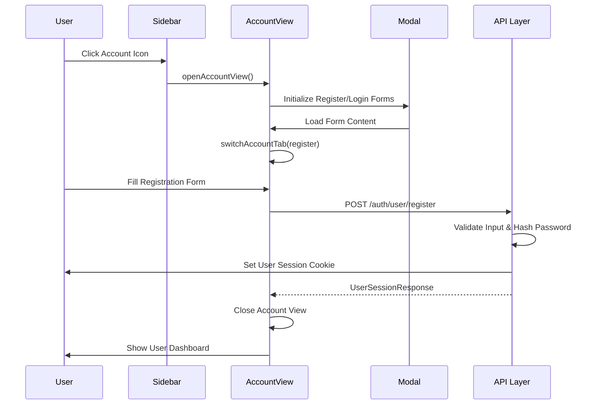
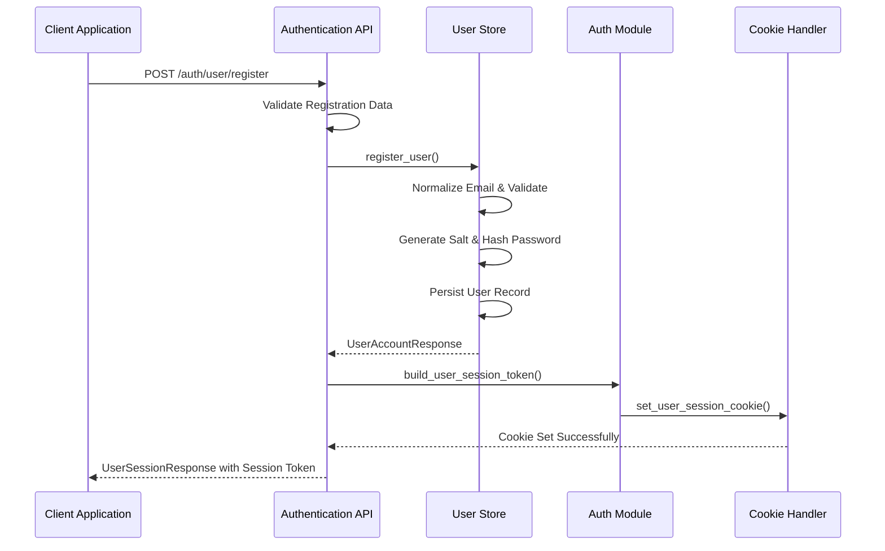
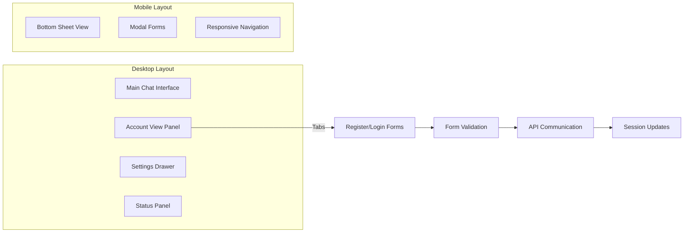
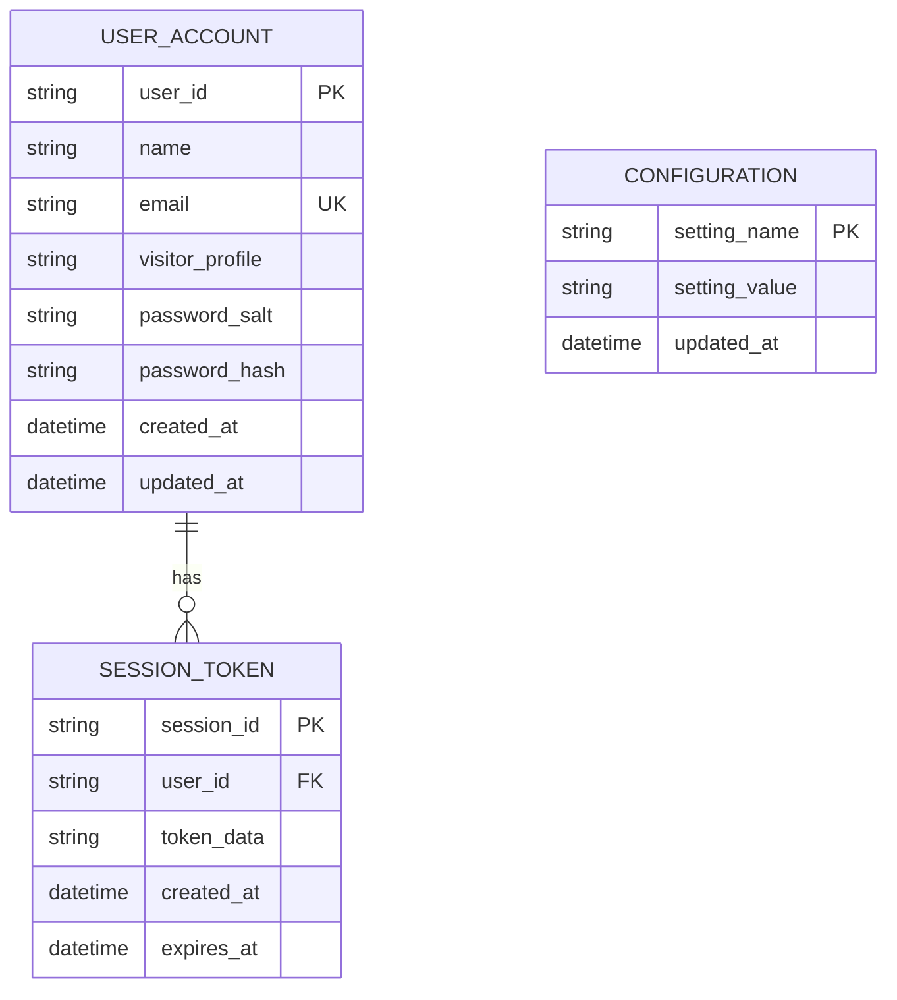

# Integrated Account Management View

<cite>
**Referenced Files in This Document**
- [auth.py](file://src/sage_faculty_twin/auth.py)
- [api.py](file://src/sage_faculty_twin/api.py)
- [service.py](file://src/sage_faculty_twin/service.py)
- [user_store.py](file://src/sage_faculty_twin/user_store.py)
- [app.js](file://src/sage_faculty_twin/web/app.js)
- [index.html](file://src/sage_faculty_twin/web/index.html)
- [models.py](file://src/sage_faculty_twin/models.py)
</cite>

## Table of Contents
1. [Introduction](#introduction)
2. [System Architecture](#system-architecture)
3. [Core Components](#core-components)
4. [Account Management Implementation](#account-management-implementation)
5. [Session Management](#session-management)
6. [User Authentication Flow](#user-authentication-flow)
7. [Frontend Integration](#frontend-integration)
8. [Security Considerations](#security-considerations)
9. [Data Storage](#data-storage)
10. [Troubleshooting Guide](#troubleshooting-guide)
11. [Conclusion](#conclusion)

## Introduction

The Integrated Account Management View is a comprehensive user authentication and session management system built into the SAGE Faculty Twin platform. This system provides seamless user registration, login, and session persistence capabilities while maintaining robust security standards and user experience.

The system integrates tightly with the frontend application through a modern JavaScript interface that supports tabbed account management views, real-time session updates, and responsive design patterns. It leverages a layered architecture with clear separation of concerns between authentication logic, session management, and user data storage.

## System Architecture

The Integrated Account Management View follows a multi-layered architecture that ensures scalability, security, and maintainability:

**Diagram sources**
- [api.py:497-527](file://src/sage_faculty_twin/api.py#L497-L527)
- [service.py:2914-2945](file://src/sage_faculty_twin/service.py#L2914-L2945)
- [auth.py:16-86](file://src/sage_faculty_twin/auth.py#L16-L86)

## Core Components

### Authentication Module

The authentication module provides the foundation for secure user management through cookie-based session tokens:

**Diagram sources**
- [auth.py:16-214](file://src/sage_faculty_twin/auth.py#L16-L214)

**Section sources**
- [auth.py:16-214](file://src/sage_faculty_twin/auth.py#L16-L214)

### User Store Management

The user store manages persistent user data with secure password hashing and validation:

**Diagram sources**
- [user_store.py:62-200](file://src/sage_faculty_twin/user_store.py#L62-L200)

**Section sources**
- [user_store.py:62-200](file://src/sage_faculty_twin/user_store.py#L62-L200)

## Account Management Implementation

### Frontend Account View

The frontend implements a sophisticated account management interface with tabbed navigation and modal integration:

**Diagram sources**
- [app.js:8021-8051](file://src/sage_faculty_twin/web/app.js#L8021-L8051)
- [api.py:510-514](file://src/sage_faculty_twin/api.py#L510-L514)

The account management view consists of two primary tabs:

1. **Registration Tab**: Allows new users to create accounts with validation
2. **Login Tab**: Provides authentication for existing users

**Section sources**
- [app.js:8021-8051](file://src/sage_faculty_twin/web/app.js#L8021-L8051)
- [index.html:185-200](file://src/sage_faculty_twin/web/index.html#L185-L200)

### Backend API Endpoints

The backend exposes comprehensive authentication endpoints:

| Endpoint | Method | Description |
|----------|--------|-------------|
| `/auth/user/register` | POST | Creates new user accounts |
| `/auth/user/login` | POST | Authenticates existing users |
| `/auth/user/logout` | POST | Terminates user sessions |
| `/auth/user/session` | GET | Retrieves current user session |

**Section sources**
- [api.py:510-527](file://src/sage_faculty_twin/api.py#L510-L527)

## Session Management

### Cookie-Based Authentication

The system implements secure cookie-based session management with configurable expiration:

**Diagram sources**
- [auth.py:57-86](file://src/sage_faculty_twin/auth.py#L57-L86)
- [service.py:2930-2942](file://src/sage_faculty_twin/service.py#L2930-L2942)

### Session Validation

Session validation occurs on each request through middleware that checks cookie authenticity and expiration:

**Section sources**
- [auth.py:193-214](file://src/sage_faculty_twin/auth.py#L193-L214)
- [api.py:474-476](file://src/sage_faculty_twin/api.py#L474-L476)

## User Authentication Flow

### Registration Process

The registration process follows a secure multi-step validation and storage workflow:

**Diagram sources**
- [user_store.py:71-121](file://src/sage_faculty_twin/user_store.py#L71-L121)
- [service.py:2914-2928](file://src/sage_faculty_twin/service.py#L2914-L2928)

### Login Process

The login process validates credentials and establishes authenticated sessions:

**Section sources**
- [user_store.py:123-161](file://src/sage_faculty_twin/user_store.py#L123-L161)
- [service.py:2930-2942](file://src/sage_faculty_twin/service.py#L2930-L2942)

## Frontend Integration

### Responsive Design Implementation

The account management view integrates seamlessly with the responsive frontend architecture:

**Diagram sources**
- [app.js:8021-8051](file://src/sage_faculty_twin/web/app.js#L8021-L8051)
- [index.html:185-200](file://src/sage_faculty_twin/web/index.html#L185-L200)

### Real-time Session Updates

The frontend maintains real-time synchronization of user session states:

**Section sources**
- [app.js:8181-8189](file://src/sage_faculty_twin/web/app.js#L8181-L8189)
- [api.py:474-476](file://src/sage_faculty_twin/api.py#L474-L476)

## Security Considerations

### Password Security

The system implements industry-standard password hashing using scrypt with configurable cost parameters:

- **Algorithm**: scrypt with N=2^14, r=8, p=1
- **Salt Generation**: Cryptographically secure random 16-byte salt
- **Storage**: Separate salt and hash fields for each user
- **Validation**: Constant-time comparison to prevent timing attacks

### Session Security

Cookie-based sessions provide secure, stateless authentication:

- **HttpOnly Cookies**: Prevents XSS attacks
- **SameSite Protection**: CSRF mitigation
- **Secure Transport**: Configurable secure flag
- **Expiration Handling**: Automatic session cleanup
- **Nonce Support**: Additional entropy for token validation

### Input Validation

Comprehensive input validation prevents injection attacks and data corruption:

- **Email Validation**: RFC-compliant email format checking
- **Password Strength**: Minimum length and complexity requirements
- **Visitor Profile Validation**: Whitelisted profile values only
- **Rate Limiting**: Built-in protection against brute force attacks

**Section sources**
- [user_store.py:188-196](file://src/sage_faculty_twin/user_store.py#L188-L196)
- [auth.py:182-214](file://src/sage_faculty_twin/auth.py#L182-L214)

## Data Storage

### Persistent Storage Architecture

User data is stored in JSON format with automatic indexing and retrieval:

**Diagram sources**
- [user_store.py:16-60](file://src/sage_faculty_twin/user_store.py#L16-L60)

### Data Integrity

The storage system ensures data integrity through:

- **Atomic Operations**: Complete transaction support
- **Consistency Checks**: Email uniqueness enforcement
- **Backup Support**: Automatic file-based persistence
- **Migration Support**: Schema evolution capabilities

**Section sources**
- [user_store.py:170-176](file://src/sage_faculty_twin/user_store.py#L170-L176)
- [user_store.py:178-183](file://src/sage_faculty_twin/user_store.py#L178-L183)

## Troubleshooting Guide

### Common Authentication Issues

**Issue**: Users cannot log in despite correct credentials
- **Cause**: Password hash mismatch or expired session
- **Solution**: Verify password hashing algorithm and session expiration
- **Debug Steps**: Check user record password hash, validate session cookie

**Issue**: Registration fails with validation errors
- **Cause**: Invalid email format or duplicate email address
- **Solution**: Validate input format and check existing user records
- **Debug Steps**: Test email regex pattern, query user store for duplicates

**Issue**: Session cookies not persisting
- **Cause**: Browser privacy settings or cookie restrictions
- **Solution**: Check SameSite and Secure cookie attributes
- **Debug Steps**: Verify browser cookie settings, test cross-origin requests

### Performance Optimization

**Recommendations**:
- Enable HTTP caching for static assets
- Implement connection pooling for database operations
- Optimize password hashing parameters for deployment environment
- Monitor session storage growth and implement cleanup policies

**Section sources**
- [user_store.py:78-90](file://src/sage_faculty_twin/user_store.py#L78-L90)
- [auth.py:169-172](file://src/sage_faculty_twin/auth.py#L169-L172)

## Conclusion

The Integrated Account Management View represents a comprehensive solution for user authentication and session management in the SAGE Faculty Twin platform. The system successfully balances security, usability, and performance through its layered architecture and robust implementation patterns.

Key strengths include:
- **Security**: Industry-standard password hashing and cookie-based authentication
- **Scalability**: Modular design supporting future expansion
- **Usability**: Intuitive frontend interface with responsive design
- **Maintainability**: Clear separation of concerns and comprehensive error handling

The system provides a solid foundation for user management while maintaining flexibility for future enhancements and integration with additional authentication providers or advanced security features.