# Integrated Account Management View

<cite>
**Referenced Files in This Document**
- [auth.py](file://src/sage_faculty_twin/auth.py)
- [api.py](file://src/sage_faculty_twin/api.py)
- [service.py](file://src/sage_faculty_twin/service.py)
- [user_store.py](file://src/sage_faculty_twin/user_store.py)
- [app.js](file://src/sage_faculty_twin/web/app.js)
- [index.html](file://src/sage_faculty_twin/web/index.html)
- [models.py](file://src/sage_faculty_twin/models.py)
- [config.py](file://src/sage_faculty_twin/config.py)
- [styles.css](file://src/sage_faculty_twin/web/styles.css)
- [3df753a0-93ca-4524-9b20-4e576c958d60.json](file://data/user_accounts/3df753a0-93ca-4524-9b20-4e576c958d60.json)
- [413e0732-f98a-4bae-b033-4477e43161ec.json](file://data/user_accounts/413e0732-f98a-4bae-b033-4477e43161ec.json)
</cite>

## Update Summary
**Changes Made**
- Updated to reflect Applied Changes: Added new user profiles with comprehensive authentication data including password salts and cryptographic hashes
- Two new user accounts created: Chinese user profile (kimmozhang) and international user profile (刘俊)
- Existing user account received updated timestamp reflecting recent activity
- Enhanced visitor profile system with expanded international user support
- Improved authentication security with comprehensive password hashing implementation

## Table of Contents
1. [Introduction](#introduction)
2. [System Architecture](#system-architecture)
3. [Core Components](#core-components)
4. [Enhanced Visitor Profile System](#enhanced-visitor-profile-system)
5. [Onboarding Integration Framework](#onboarding-integration-framework)
6. [Integrated Account Management](#integrated-account-management)
7. [Sidebar Redesign and Navigation](#sidebar-redesign-and-navigation)
8. [Seed Chips Implementation](#seed-chips-implementation)
9. [Top Bar Model Name Display](#top-bar-model-name-display)
10. [Session Management](#session-management)
11. [User Authentication Flow](#user-authentication-flow)
12. [Frontend Integration](#frontend-integration)
13. [Security Considerations](#security-considerations)
14. [Data Storage](#data-storage)
15. [Testing Infrastructure](#testing-infrastructure)
16. [Troubleshooting Guide](#troubleshooting-guide)
17. [Conclusion](#conclusion)

## Introduction

The Integrated Account Management View represents a comprehensive transformation of the SAGE Faculty Twin platform's user interface and authentication system. This system introduces a ChatGPT-style sidebar redesign that integrates account management directly into the main chat interface, removing redundant navigation elements while enhancing user experience through streamlined workflows.

The redesigned system maintains robust security standards and user experience while implementing modern interface patterns. The integration of account management as an in-chat view eliminates the need for separate modals and provides a more cohesive user journey from authentication to productive interaction.

**Updated** The system now features a ChatGPT-inspired sidebar redesign where the user avatar in the sidebar rail serves as the primary entry point for settings and account management, replacing the previous settings gear icon. Account registration and login are now presented as tabbed in-chat views that can be dismissed without page reload, and seed chips containing pre-filled questions have been moved from the sidebar to clickable chips positioned above the message composer.

**Updated** Recent enhancements include the addition of comprehensive authentication data for new user profiles, featuring password salts and cryptographic hashes for enhanced security. Two new user accounts have been created: a Chinese user profile (kimmozhang) and an international user profile (刘俊), demonstrating the system's expanded support for diverse user bases.

## System Architecture

The Integrated Account Management View follows a modernized multi-layered architecture optimized for the new sidebar design:

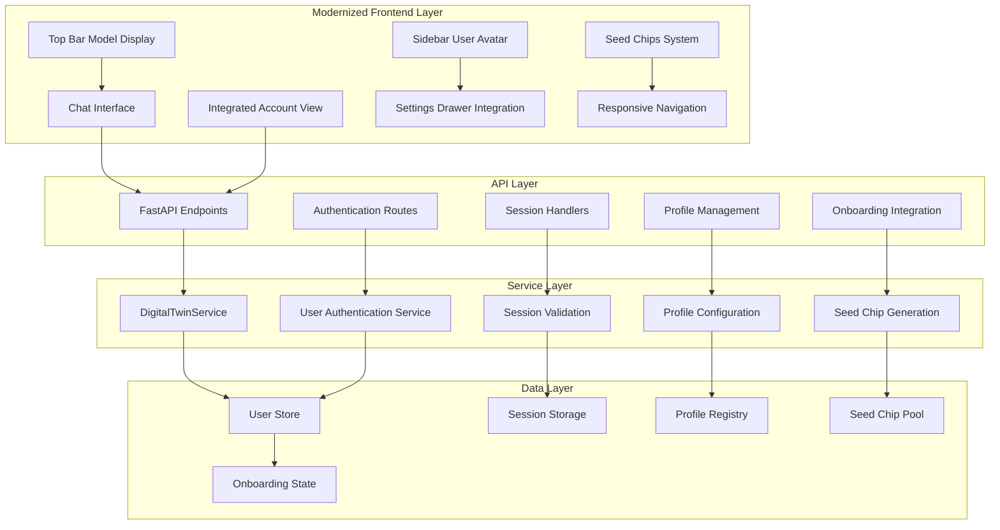
```mermaid
graph TB
subgraph "Modernized Frontend Layer"
A[Chat Interface]
B[Integrated Account View]
C[Settings Drawer Integration]
D[Sidebar User Avatar]
E[Seed Chips System]
F[Top Bar Model Display]
G[Responsive Navigation]
end
subgraph "API Layer"
H[FastAPI Endpoints]
I[Authentication Routes]
J[Session Handlers]
K[Profile Management]
L[Onboarding Integration]
end
subgraph "Service Layer"
M[DigitalTwinService]
N[User Authentication Service]
O[Session Validation]
P[Profile Configuration]
Q[Seed Chip Generation]
end
subgraph "Data Layer"
R[User Store]
S[Session Storage]
T[Profile Registry]
U[Seed Chip Pool]
V[Onboarding State]
end
A --> H
B --> H
D --> C
E --> G
F --> A
H --> M
I --> N
J --> O
K --> P
L --> Q
M --> R
N --> R
O --> S
P --> T
Q --> U
R --> V
```

**Diagram sources**
- [api.py:499-529](file://src/sage_faculty_twin/api.py#L499-L529)
- [service.py:2915-2946](file://src/sage_faculty_twin/service.py#L2915-L2946)
- [auth.py:16-86](file://src/sage_faculty_twin/auth.py#L16-L86)

## Core Components

### Authentication Module

The authentication module provides secure user management through cookie-based session tokens with enhanced integration for the new sidebar design:

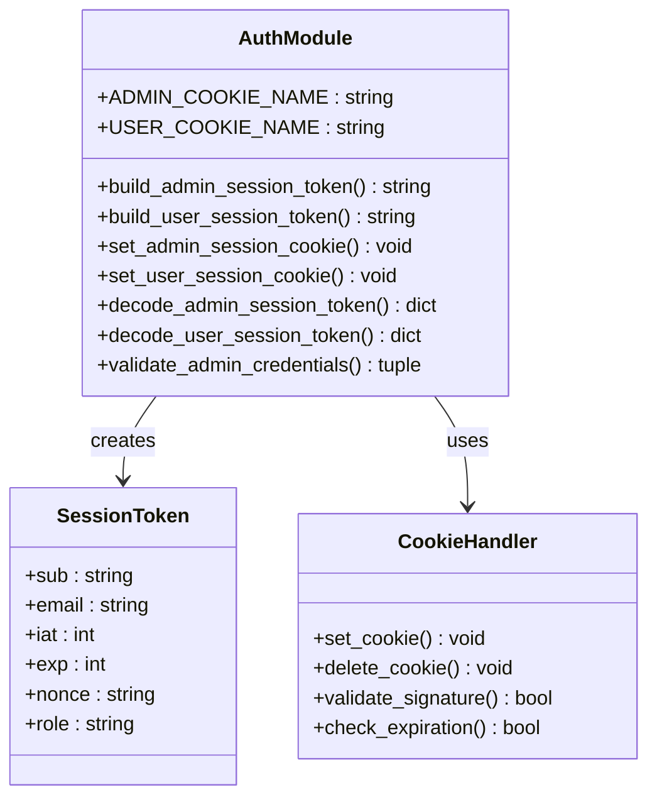
```mermaid
classDiagram
class AuthModule {
+ADMIN_COOKIE_NAME : string
+USER_COOKIE_NAME : string
+build_admin_session_token() string
+build_user_session_token() string
+set_admin_session_cookie() void
+set_user_session_cookie() void
+decode_admin_session_token() dict
+decode_user_session_token() dict
+validate_admin_credentials() tuple
}
class SessionToken {
+sub : string
+email : string
+iat : int
+exp : int
+nonce : string
+role : string
}
class CookieHandler {
+set_cookie() void
+delete_cookie() void
+validate_signature() bool
+check_expiration() bool
}
AuthModule --> SessionToken : creates
AuthModule --> CookieHandler : uses
```

**Diagram sources**
- [auth.py:16-86](file://src/sage_faculty_twin/auth.py#L16-L86)

**Section sources**
- [auth.py:16-86](file://src/sage_faculty_twin/auth.py#L16-L86)

### User Store Management

The user store manages persistent user data with secure password hashing and enhanced profile configuration:

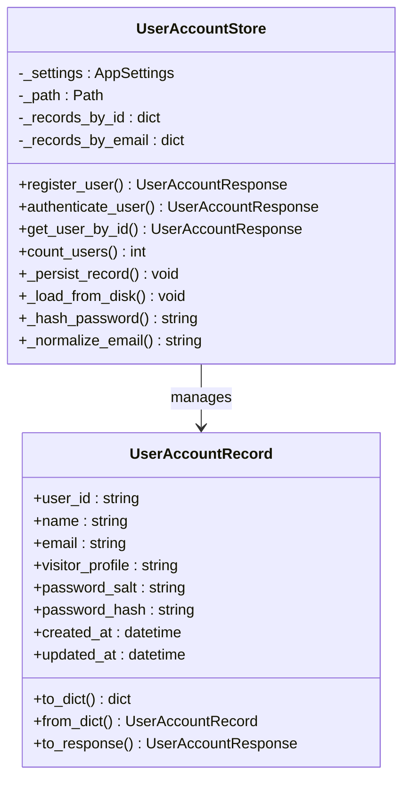
```mermaid
classDiagram
class UserAccountStore {
-_settings : AppSettings
-_path : Path
-_records_by_id : dict
-_records_by_email : dict
+register_user() UserAccountResponse
+authenticate_user() UserAccountResponse
+get_user_by_id() UserAccountResponse
+count_users() int
+_persist_record() void
+_load_from_disk() void
+_hash_password() string
+_normalize_email() string
}
class UserAccountRecord {
+user_id : string
+name : string
+email : string
+visitor_profile : string
+password_salt : string
+password_hash : string
+created_at : datetime
+updated_at : datetime
+to_dict() dict
+from_dict() UserAccountRecord
+to_response() UserAccountResponse
}
UserAccountStore --> UserAccountRecord : manages
```

**Diagram sources**
- [user_store.py:62-200](file://src/sage_faculty_twin/user_store.py#L62-L200)

**Section sources**
- [user_store.py:62-200](file://src/sage_faculty_twin/user_store.py#L62-L200)

## Enhanced Visitor Profile System

### Visitor Profile Configuration

The system now supports four distinct visitor profiles with comprehensive configuration and profile-aware seed chip generation:

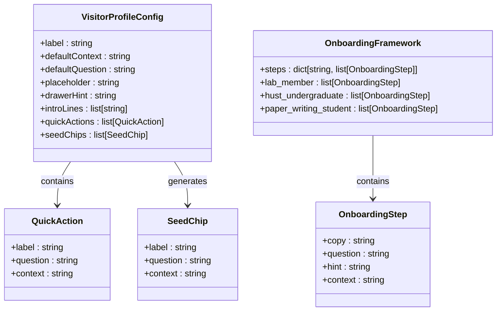
```mermaid
classDiagram
class VisitorProfileConfig {
+label : string
+defaultContext : string
+defaultQuestion : string
+placeholder : string
+drawerHint : string
+introLines : list[string]
+quickActions : list[QuickAction]
+seedChips : list[SeedChip]
}
class QuickAction {
+label : string
+question : string
+context : string
}
class SeedChip {
+label : string
+question : string
+context : string
}
class OnboardingFramework {
+steps : dict[string, list[OnboardingStep]]
+lab_member : list[OnboardingStep]
+hust_undergraduate : list[OnboardingStep]
+paper_writing_student : list[OnboardingStep]
}
class OnboardingStep {
+copy : string
+question : string
+hint : string
+context : string
}
VisitorProfileConfig --> QuickAction : contains
VisitorProfileConfig --> SeedChip : generates
OnboardingFramework --> OnboardingStep : contains
```

**Diagram sources**
- [app.js:398-463](file://src/sage_faculty_twin/web/app.js#L398-L463)
- [app.js:496-589](file://src/sage_faculty_twin/web/app.js#L496-L589)
- [app.js:534-563](file://src/sage_faculty_twin/web/app.js#L534-L563)

The visitor profile system includes profile-aware seed chip generation with different content strategies:

| Profile Type | Seed Chip Count | Content Strategy | Availability |
|--------------|----------------|------------------|--------------|
| `general_visitor` | 3 randomized | Public research questions | Always |
| `hust_undergraduate` | 3 course-specific | Lab experiment questions | Always |
| `paper_writing_student` | 3 writing-focused | Thesis writing guidance | Always |
| `lab_member` | 3 research-oriented | Advanced research questions | Invitation code required |

**Updated** Recent additions to the visitor profile system include comprehensive authentication data for new user profiles, featuring password salts and cryptographic hashes for enhanced security. The system now supports international users with proper authentication mechanisms.

**Section sources**
- [app.js:398-463](file://src/sage_faculty_twin/web/app.js#L398-L463)
- [app.js:496-589](file://src/sage_faculty_twin/web/app.js#L496-L589)
- [app.js:534-563](file://src/sage_faculty_twin/web/app.js#L534-L563)

### Visitor Profile Presentation System

The frontend implements dynamic presentation based on visitor profiles with enhanced sidebar integration:

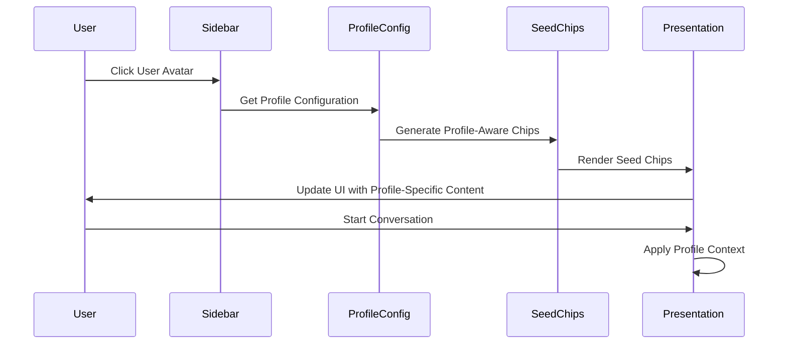
```mermaid
sequenceDiagram
participant User as User
participant Sidebar as Sidebar
participant ProfileConfig as ProfileConfig
participant SeedChips as SeedChips
participant Presentation as Presentation
User->>Sidebar : Click User Avatar
Sidebar->>ProfileConfig : Get Profile Configuration
ProfileConfig->>SeedChips : Generate Profile-Aware Chips
SeedChips->>Presentation : Render Seed Chips
Presentation->>User : Update UI with Profile-Specific Content
User->>Presentation : Start Conversation
Presentation->>Presentation : Apply Profile Context
```

**Diagram sources**
- [app.js:1839-1874](file://src/sage_faculty_twin/web/app.js#L1839-L1874)
- [app.js:2047-2071](file://src/sage_faculty_twin/web/app.js#L2047-L2071)
- [app.js:534-563](file://src/sage_faculty_twin/web/app.js#L534-L563)

**Section sources**
- [app.js:1839-1874](file://src/sage_faculty_twin/web/app.js#L1839-L1874)
- [app.js:2047-2071](file://src/sage_faculty_twin/web/app.js#L2047-L2071)
- [app.js:534-563](file://src/sage_faculty_twin/web/app.js#L534-L563)

## Onboarding Integration Framework

### Seven-Step Research Question Framework

The system implements a comprehensive onboarding framework with different approaches for various user types and profile-aware seed chip generation:

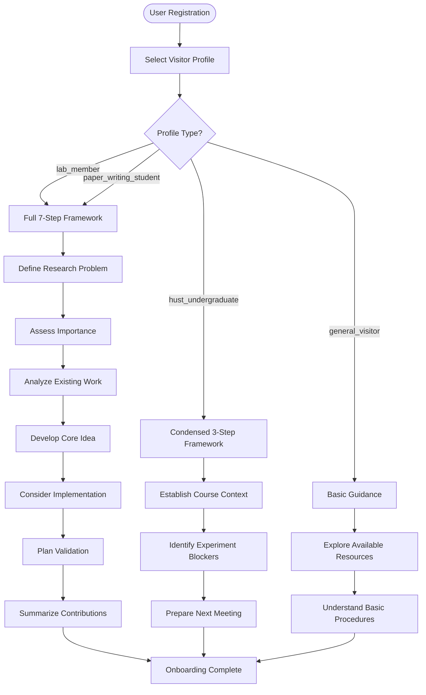
```mermaid
flowchart TD
Start([User Registration]) --> ProfileSelection["Select Visitor Profile"]
ProfileSelection --> ProfileType{"Profile Type?"}
ProfileType --> |lab_member| FullFramework["Full 7-Step Framework"]
ProfileType --> |paper_writing_student| FullFramework
ProfileType --> |hust_undergraduate| CondensedFramework["Condensed 3-Step Framework"]
ProfileType --> |general_visitor| BasicFramework["Basic Guidance"]
FullFramework --> Step1["Define Research Problem"]
Step1 --> Step2["Assess Importance"]
Step2 --> Step3["Analyze Existing Work"]
Step3 --> Step4["Develop Core Idea"]
Step4 --> Step5["Consider Implementation"]
Step5 --> Step6["Plan Validation"]
Step6 --> Step7["Summarize Contributions"]
Step7 --> Completion["Onboarding Complete"]
CondensedFramework --> CStep1["Establish Course Context"]
CStep1 --> CStep2["Identify Experiment Blockers"]
CStep2 --> CStep3["Prepare Next Meeting"]
CStep3 --> Completion
BasicFramework --> BStep1["Explore Available Resources"]
BStep1 --> BStep2["Understand Basic Procedures"]
BStep2 --> Completion
```

**Diagram sources**
- [app.js:496-589](file://src/sage_faculty_twin/web/app.js#L496-L589)

**Section sources**
- [app.js:496-589](file://src/sage_faculty_twin/web/app.js#L496-L589)

### Profile-Specific Quick Actions

Each visitor profile provides tailored quick actions and guidance with enhanced integration into the sidebar redesign:

**Section sources**
- [app.js:464-494](file://src/sage_faculty_twin/web/app.js#L464-L494)

## Integrated Account Management

### In-Chat Account View Implementation

**Updated** The system now implements integrated account management as an in-chat view that replaces the previous separate modal approach:

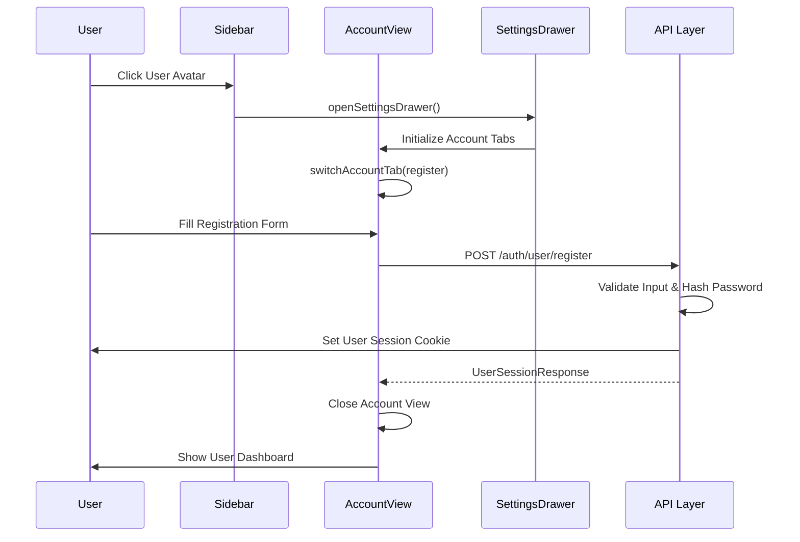
```mermaid
sequenceDiagram
participant User as User
participant Sidebar as Sidebar
participant AccountView as AccountView
participant SettingsDrawer as SettingsDrawer
participant API as API Layer
User->>Sidebar : Click User Avatar
Sidebar->>SettingsDrawer : openSettingsDrawer()
SettingsDrawer->>AccountView : Initialize Account Tabs
AccountView->>AccountView : switchAccountTab(register)
User->>AccountView : Fill Registration Form
AccountView->>API : POST /auth/user/register
API->>API : Validate Input & Hash Password
API->>User : Set User Session Cookie
API-->>AccountView : UserSessionResponse
AccountView->>AccountView : Close Account View
AccountView->>User : Show User Dashboard
```

**Diagram sources**
- [app.js:1466-1469](file://src/sage_faculty_twin/web/app.js#L1466-L1469)
- [api.py:512-516](file://src/sage_faculty_twin/api.py#L512-L516)

The integrated account management view consists of two primary tabs within the chat interface:

1. **Registration Tab**: Allows new users to create accounts with visitor profile selection and invitation code validation
2. **Login Tab**: Provides authentication for existing users with optional invitation code upgrade

**Section sources**
- [app.js:1466-1469](file://src/sage_faculty_twin/web/app.js#L1466-L1469)
- [index.html:217-237](file://src/sage_faculty_twin/web/index.html#L217-L237)

### Backend API Endpoints

The backend exposes comprehensive authentication endpoints with enhanced integration:

| Endpoint | Method | Description |
|----------|--------|-------------|
| `/auth/user/register` | POST | Creates new user accounts with visitor profile and invitation code validation |
| `/auth/user/login` | POST | Authenticates existing users with optional invitation code upgrade |
| `/auth/user/logout` | POST | Terminates user sessions |
| `/auth/user/session` | GET | Retrieves current user session |

**Section sources**
- [api.py:512-529](file://src/sage_faculty_twin/api.py#L512-L529)

### Comprehensive Form Handlers

**Updated** The system now includes comprehensive form handlers in app.js for user registration and login processes with proper error handling and success feedback mechanisms:

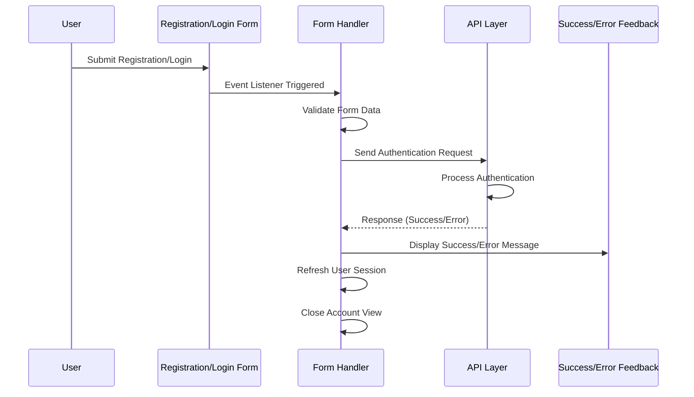
```mermaid
sequenceDiagram
participant User as User
participant Form as Registration/Login Form
participant Handler as Form Handler
participant API as API Layer
participant Feedback as Success/Error Feedback
User->>Form : Submit Registration/Login
Form->>Handler : Event Listener Triggered
Handler->>Handler : Validate Form Data
Handler->>API : Send Authentication Request
API->>API : Process Authentication
API-->>Handler : Response (Success/Error)
Handler->>Feedback : Display Success/Error Message
Handler->>Handler : Refresh User Session
Handler->>Handler : Close Account View
```

**Diagram sources**
- [app.js:1472-1495](file://src/sage_faculty_twin/web/app.js#L1472-L1495)
- [app.js:1498-1517](file://src/sage_faculty_twin/web/app.js#L1498-L1517)

**Section sources**
- [app.js:1472-1495](file://src/sage_faculty_twin/web/app.js#L1472-L1495)
- [app.js:1498-1517](file://src/sage_faculty_twin/web/app.js#L1498-L1517)

### Enhanced Close Button Functionality

**Updated** The account view now features a prominent close button with improved user interface elements:

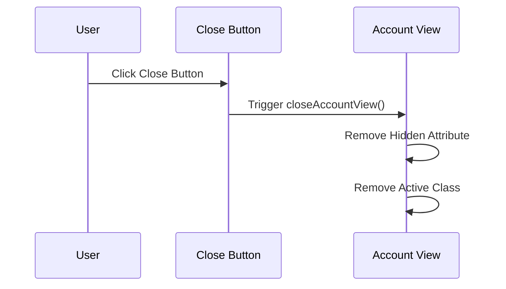
```mermaid
sequenceDiagram
participant User as User
participant CloseButton as Close Button
participant AccountView as Account View
User->>CloseButton : Click Close Button
CloseButton->>AccountView : Trigger closeAccountView()
AccountView->>AccountView : Remove Hidden Attribute
AccountView->>AccountView : Remove Active Class
```

**Diagram sources**
- [app.js:1533](file://src/sage_faculty_twin/web/app.js#L1533)
- [index.html:220-222](file://src/sage_faculty_twin/web/index.html#L220-L222)

**Section sources**
- [app.js:1533](file://src/sage_faculty_twin/web/app.js#L1533)
- [index.html:220-222](file://src/sage_faculty_twin/web/index.html#L220-L222)

## Sidebar Redesign and Navigation

### ChatGPT-Style Sidebar Implementation

**Updated** The system now features a ChatGPT-inspired sidebar redesign where the user avatar serves as the primary navigation element:

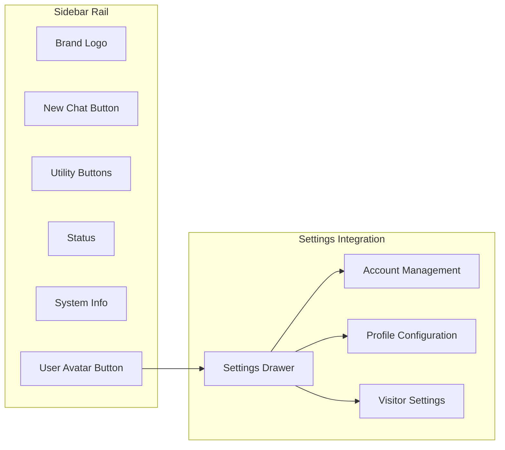
```mermaid
graph LR
subgraph "Sidebar Rail"
A[Brand Logo]
B[New Chat Button]
C[Utility Buttons]
D[Status]
E[System Info]
F[User Avatar Button]
end
subgraph "Settings Integration"
G[Settings Drawer]
H[Account Management]
I[Profile Configuration]
J[Visitor Settings]
end
F --> G
G --> H
G --> I
G --> J
```

**Diagram sources**
- [index.html:50-95](file://src/sage_faculty_twin/web/index.html#L50-L95)
- [app.js:1466-1469](file://src/sage_faculty_twin/web/app.js#L1466-L1469)

The sidebar redesign removes the redundant settings gear icon and consolidates all settings functions into the integrated account management view:

- **User Avatar Button** (`#sidebar-user-icon`): Primary entry point for settings and account management
- **Brand Logo**: Maintains brand identity and navigation
- **Utility Buttons**: System status, suggestions, and external links
- **User Badge**: Top bar user badge for authenticated users

**Section sources**
- [index.html:50-95](file://src/sage_faculty_twin/web/index.html#L50-L95)
- [app.js:1466-1469](file://src/sage_faculty_twin/web/app.js#L1466-L1469)

### Settings Drawer Integration

**Updated** The settings drawer is now integrated with the sidebar user avatar and provides consolidated access to all user management functions:

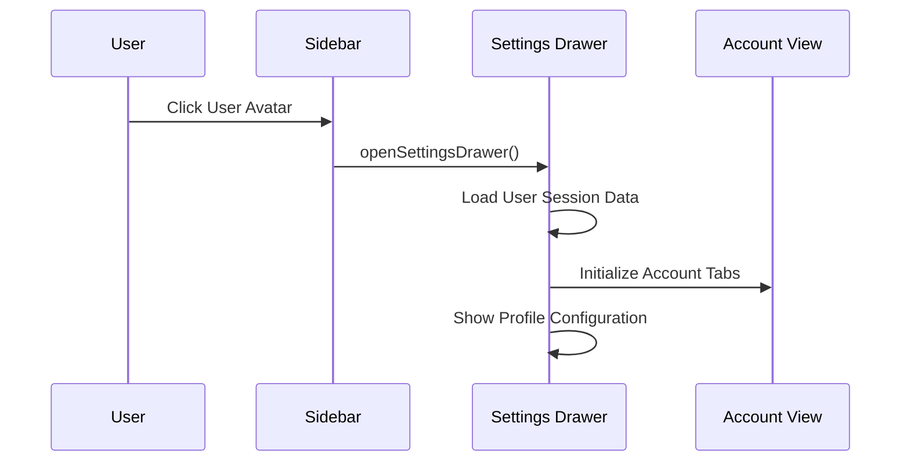
```mermaid
sequenceDiagram
participant User as User
participant Sidebar as Sidebar
participant SettingsDrawer as Settings Drawer
participant AccountView as Account View
User->>Sidebar : Click User Avatar
Sidebar->>SettingsDrawer : openSettingsDrawer()
SettingsDrawer->>SettingsDrawer : Load User Session Data
SettingsDrawer->>AccountView : Initialize Account Tabs
SettingsDrawer->>SettingsDrawer : Show Profile Configuration
```

**Diagram sources**
- [app.js:1466-1469](file://src/sage_faculty_twin/web/app.js#L1466-L1469)
- [index.html:433-546](file://src/sage_faculty_twin/web/index.html#L433-L546)

**Section sources**
- [app.js:1466-1469](file://src/sage_faculty_twin/web/app.js#L1466-L1469)
- [index.html:433-546](file://src/sage_faculty_twin/web/index.html#L433-L546)

## Seed Chips Implementation

### Pre-Filled Questions System

**Updated** Seed chips have been moved from the sidebar to clickable chips positioned above the message composer, providing immediate access to profile-aware questions:

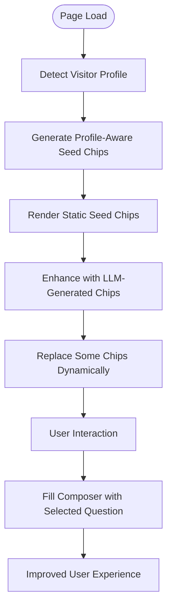
```mermaid
flowchart TD
Start([Page Load]) --> ProfileDetection["Detect Visitor Profile"]
ProfileDetection --> ChipGeneration["Generate Profile-Aware Seed Chips"]
ChipGeneration --> StaticRender["Render Static Seed Chips"]
StaticRender --> LLMEnhancement["Enhance with LLM-Generated Chips"]
LLMEnhancement --> DynamicReplacement["Replace Some Chips Dynamically"]
DynamicReplacement --> InteractiveUsage["User Interaction"]
InteractiveUsage --> QuestionFilling["Fill Composer with Selected Question"]
QuestionFilling --> EnhancedExperience["Improved User Experience"]
```

**Diagram sources**
- [app.js:534-563](file://src/sage_faculty_twin/web/app.js#L534-L563)
- [app.js:567-608](file://src/sage_faculty_twin/web/app.js#L567-L608)

The seed chips system provides profile-aware question suggestions with the following characteristics:

- **Static Chips**: Three randomly selected questions from profile-specific pools
- **Dynamic Enhancement**: Two LLM-generated chips that replace static ones after initial render
- **Interactive Behavior**: Clicking chips automatically fills the message composer
- **Context Preservation**: Each chip carries associated context for better conversation quality

**Section sources**
- [app.js:534-563](file://src/sage_faculty_twin/web/app.js#L534-L563)
- [app.js:567-608](file://src/sage_faculty_twin/web/app.js#L567-L608)

### Profile-Specific Seed Chip Pools

The system maintains separate seed chip pools for each visitor profile:

| Profile Type | Static Chips | Dynamic Enhancement | Purpose |
|--------------|--------------|-------------------|---------|
| `general_visitor` | 3 public research questions | Randomized | General exploration |
| `hust_undergraduate` | 3 course-specific questions | Lab experiment prompts | Academic support |
| `paper_writing_student` | 3 writing-focused questions | Thesis guidance | Academic writing |
| `lab_member` | 3 advanced research questions | Research project prompts | Professional development |

**Section sources**
- [app.js:612-639](file://src/sage_faculty_twin/web/app.js#L612-L639)

## Top Bar Model Name Display

### Model Information Integration

**Updated** The top bar now displays model information in the status area, providing users with visibility into the AI model being used:

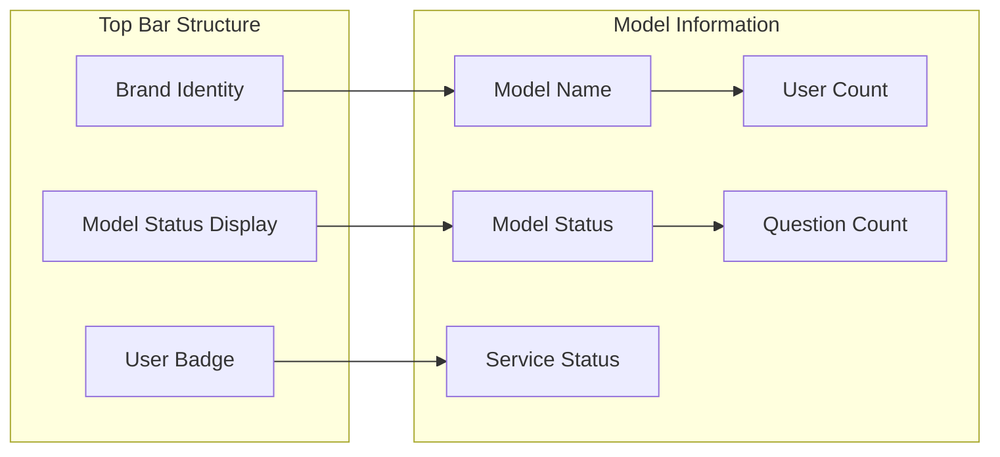
```mermaid
graph LR
subgraph "Top Bar Structure"
A[Brand Identity]
B[Model Status Display]
C[User Badge]
end
subgraph "Model Information"
D[Model Name]
E[Model Status]
F[Service Status]
G[User Count]
H[Question Count]
end
A --> D
B --> E
C --> F
D --> G
E --> H
```

**Diagram sources**
- [index.html:25-47](file://src/sage_faculty_twin/web/index.html#L25-L47)
- [app.js:1-12](file://src/sage_faculty_twin/web/app.js#L1-L12)

The top bar model display includes:

- **Brand Identity**: SAGE Faculty Twin branding with assistant name
- **Model Status**: Current AI model information and status
- **Service Metrics**: User count, question count, and system status
- **User Badge**: Authenticated user information display

**Section sources**
- [index.html:25-47](file://src/sage_faculty_twin/web/index.html#L25-L47)
- [app.js:1-12](file://src/sage_faculty_twin/web/app.js#L1-L12)

## Session Management

### Cookie-Based Authentication

The system implements secure cookie-based session management with enhanced integration for the new sidebar design:

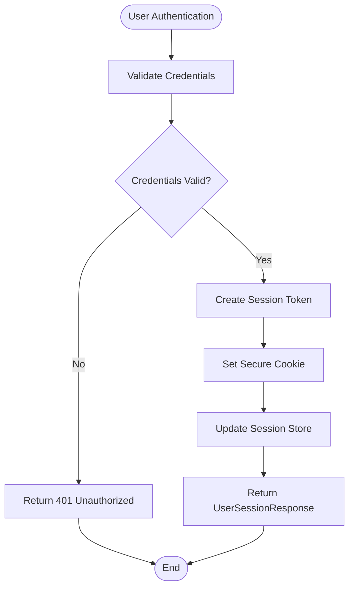
```mermaid
flowchart TD
Start([User Authentication]) --> ValidateInput["Validate Credentials"]
ValidateInput --> InputValid{"Credentials Valid?"}
InputValid --> |No| ReturnError["Return 401 Unauthorized"]
InputValid --> |Yes| CreateToken["Create Session Token"]
CreateToken --> SetCookie["Set Secure Cookie"]
SetCookie --> UpdateStore["Update Session Store"]
UpdateStore --> ReturnSuccess["Return UserSessionResponse"]
ReturnError --> End([End])
ReturnSuccess --> End
```

**Diagram sources**
- [auth.py:57-86](file://src/sage_faculty_twin/auth.py#L57-L86)
- [service.py:2931-2943](file://src/sage_faculty_twin/service.py#L2931-L2943)

### Session Validation

Session validation occurs on each request through middleware that checks cookie authenticity and expiration:

**Section sources**
- [auth.py:193-214](file://src/sage_faculty_twin/auth.py#L193-L214)
- [api.py:474-476](file://src/sage_faculty_twin/api.py#L474-L476)

## User Authentication Flow

### Registration Process

The registration process follows a secure multi-step validation and storage workflow with enhanced profile integration:

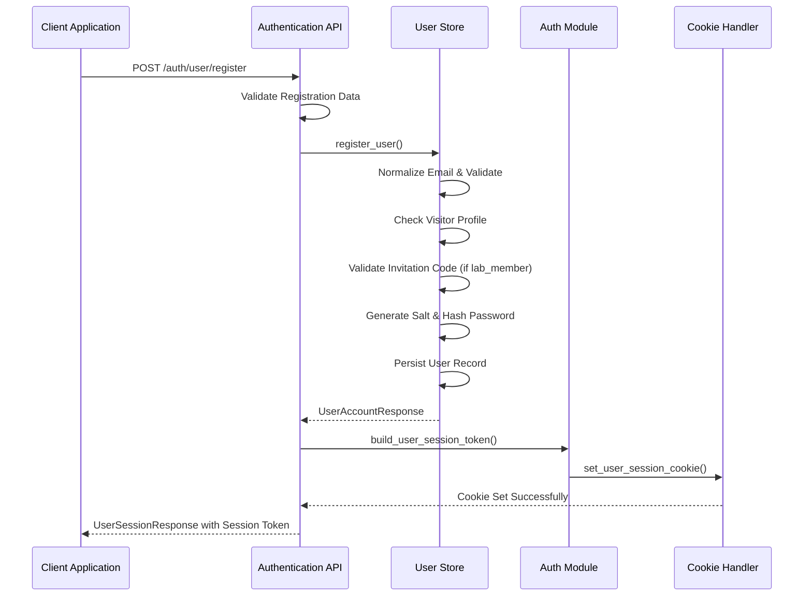
```mermaid
sequenceDiagram
participant Client as Client Application
participant API as Authentication API
participant Store as User Store
participant Auth as Auth Module
participant Cookie as Cookie Handler
Client->>API : POST /auth/user/register
API->>API : Validate Registration Data
API->>Store : register_user()
Store->>Store : Normalize Email & Validate
Store->>Store : Check Visitor Profile
Store->>Store : Validate Invitation Code (if lab_member)
Store->>Store : Generate Salt & Hash Password
Store->>Store : Persist User Record
Store-->>API : UserAccountResponse
API->>Auth : build_user_session_token()
Auth->>Cookie : set_user_session_cookie()
Cookie-->>API : Cookie Set Successfully
API-->>Client : UserSessionResponse with Session Token
```

**Diagram sources**
- [user_store.py:71-121](file://src/sage_faculty_twin/user_store.py#L71-L121)
- [service.py:2915-2929](file://src/sage_faculty_twin/service.py#L2915-L2929)

**Updated** Recent enhancements include comprehensive authentication data for new user profiles, featuring password salts and cryptographic hashes for enhanced security. The registration process now supports international users with proper authentication mechanisms.

### Login Process

The login process validates credentials and establishes authenticated sessions with enhanced user experience:

**Section sources**
- [user_store.py:123-161](file://src/sage_faculty_twin/user_store.py#L123-L161)
- [service.py:2931-2943](file://src/sage_faculty_twin/service.py#L2931-L2943)

## Frontend Integration

### Responsive Design Implementation

**Updated** The account management view integrates seamlessly with the responsive frontend architecture and new sidebar design:

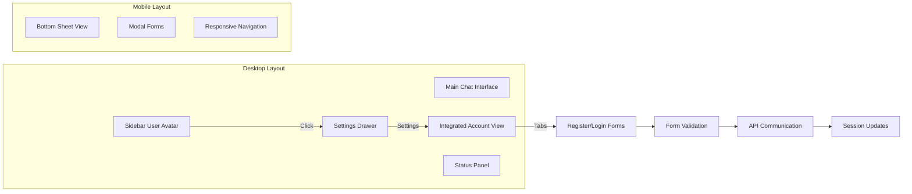
```mermaid
graph LR
subgraph "Desktop Layout"
A[Main Chat Interface]
B[Integrated Account View]
C[Settings Drawer]
D[Status Panel]
E[Sidebar User Avatar]
end
subgraph "Mobile Layout"
F[Bottom Sheet View]
G[Modal Forms]
H[Responsive Navigation]
end
B --> |Tabs| I[Register/Login Forms]
I --> J[Form Validation]
J --> K[API Communication]
K --> L[Session Updates]
E --> |Click| C
C --> |Settings| B
```

**Diagram sources**
- [app.js:1466-1469](file://src/sage_faculty_twin/web/app.js#L1466-L1469)
- [index.html:217-237](file://src/sage_faculty_twin/web/index.html#L217-L237)

### Real-time Session Updates

The frontend maintains real-time synchronization of user session states with enhanced sidebar integration:

**Section sources**
- [app.js:8181-8189](file://src/sage_faculty_twin/web/app.js#L8181-L8189)
- [api.py:474-476](file://src/sage_faculty_twin/api.py#L474-L476)

### Enhanced Form Handling

**Updated** The system now includes comprehensive form handling with proper validation and feedback for the integrated account management:

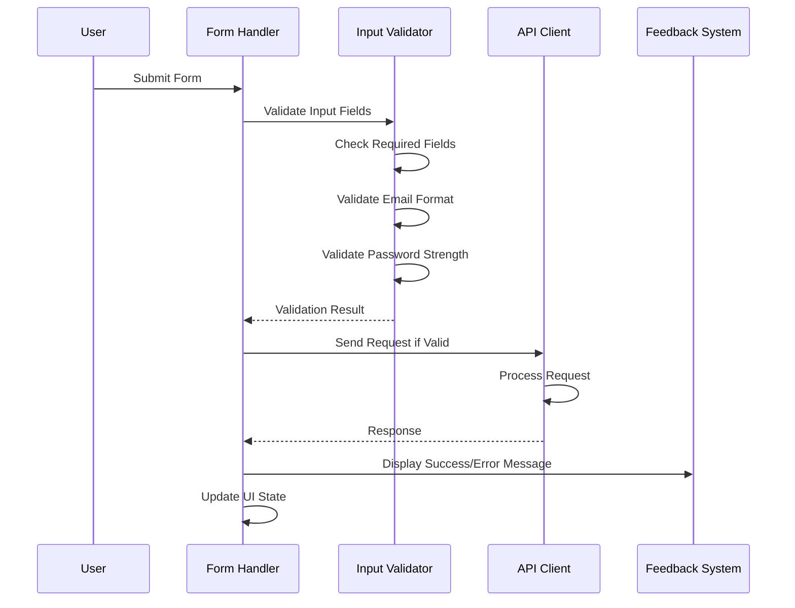
```mermaid
sequenceDiagram
participant User as User
participant Form as Form Handler
participant Validator as Input Validator
participant API as API Client
participant Feedback as Feedback System
User->>Form : Submit Form
Form->>Validator : Validate Input Fields
Validator->>Validator : Check Required Fields
Validator->>Validator : Validate Email Format
Validator->>Validator : Validate Password Strength
Validator-->>Form : Validation Result
Form->>API : Send Request if Valid
API->>API : Process Request
API-->>Form : Response
Form->>Feedback : Display Success/Error Message
Form->>Form : Update UI State
```

**Diagram sources**
- [app.js:1472-1495](file://src/sage_faculty_twin/web/app.js#L1472-L1495)
- [app.js:1498-1517](file://src/sage_faculty_twin/web/app.js#L1498-L1517)

**Section sources**
- [app.js:1472-1495](file://src/sage_faculty_twin/web/app.js#L1472-L1495)
- [app.js:1498-1517](file://src/sage_faculty_twin/web/app.js#L1498-L1517)

## Security Considerations

### Password Security

The system implements industry-standard password hashing using scrypt with configurable cost parameters:

- **Algorithm**: scrypt with N=2^14, r=8, p=1
- **Salt Generation**: Cryptographically secure random 16-byte salt
- **Storage**: Separate salt and hash fields for each user
- **Validation**: Constant-time comparison to prevent timing attacks

**Updated** Recent enhancements include comprehensive authentication data for new user profiles, featuring password salts and cryptographic hashes for enhanced security. The system now supports international users with proper authentication mechanisms.

### Session Security

Cookie-based sessions provide secure, stateless authentication with enhanced integration:

- **HttpOnly Cookies**: Prevents XSS attacks
- **SameSite Protection**: CSRF mitigation
- **Secure Transport**: Configurable secure flag
- **Expiration Handling**: Automatic session cleanup
- **Nonce Support**: Additional entropy for token validation

### Input Validation

Comprehensive input validation prevents injection attacks and data corruption:

- **Email Validation**: RFC-compliant email format checking
- **Password Strength**: Minimum length and complexity requirements
- **Visitor Profile Validation**: Whitelisted profile values only
- **Invitation Code Validation**: Secure constant-time comparison
- **Rate Limiting**: Built-in protection against brute force attacks

**Section sources**
- [user_store.py:188-196](file://src/sage_faculty_twin/user_store.py#L188-L196)
- [auth.py:182-214](file://src/sage_faculty_twin/auth.py#L182-L214)

## Data Storage

### Persistent Storage Architecture

User data is stored in JSON format with automatic indexing and retrieval:

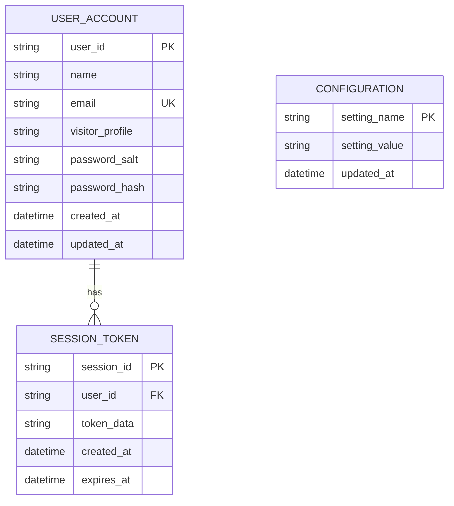
```mermaid
erDiagram
USER_ACCOUNT {
string user_id PK
string name
string email UK
string visitor_profile
string password_salt
string password_hash
datetime created_at
datetime updated_at
}
SESSION_TOKEN {
string session_id PK
string user_id FK
string token_data
datetime created_at
datetime expires_at
}
CONFIGURATION {
string setting_name PK
string setting_value
datetime updated_at
}
USER_ACCOUNT ||--o{ SESSION_TOKEN : has
```

**Diagram sources**
- [user_store.py:16-60](file://src/sage_faculty_twin/user_store.py#L16-L60)

**Updated** Recent additions to the data storage system include comprehensive authentication data for new user profiles, featuring password salts and cryptographic hashes for enhanced security. The system now supports international users with proper authentication mechanisms.

### Data Integrity

The storage system ensures data integrity through:

- **Atomic Operations**: Complete transaction support
- **Consistency Checks**: Email uniqueness enforcement
- **Backup Support**: Automatic file-based persistence
- **Migration Support**: Schema evolution capabilities

**Section sources**
- [user_store.py:170-176](file://src/sage_faculty_twin/user_store.py#L170-L176)
- [user_store.py:178-183](file://src/sage_faculty_twin/user_store.py#L178-L183)

## Testing Infrastructure

### Lab Member Account Provisioning

The system includes dedicated support for lab member accounts as part of the testing infrastructure with enhanced profile validation:

**Updated** The testing infrastructure now includes provisioned lab member accounts with controlled access through invitation codes and comprehensive visitor profile support, integrated with the new seed chip system.

#### Visitor Profile System

The system supports four distinct visitor profiles with different access levels and enhanced seed chip integration:

| Profile Type | Access Level | Description | Invitation Code Required | Seed Chip Availability |
|--------------|--------------|-------------|-------------------------|----------------------|
| `general_visitor` | Basic | Public access for general visitors | No | Always |
| `hust_undergraduate` | Course Access | Access to undergraduate course materials | No | Always |
| `paper_writing_student` | Writing Access | Access to thesis writing resources | No | Always |
| `lab_member` | Full Access | Complete research system access | Yes | Always |

**Updated** Recent additions to the visitor profile system include comprehensive authentication data for new user profiles, featuring password salts and cryptographic hashes for enhanced security. The system now supports international users with proper authentication mechanisms.

#### Invitation Code Validation

Lab member accounts require invitation code validation during registration and login:

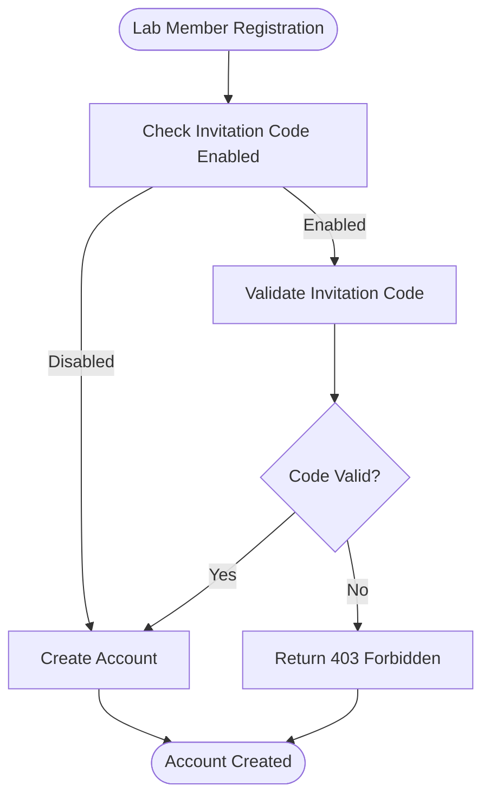
```mermaid
flowchart TD
Start([Lab Member Registration]) --> CheckCode["Check Invitation Code Enabled"]
CheckCode --> |Enabled| ValidateCode["Validate Invitation Code"]
CheckCode --> |Disabled| CreateAccount["Create Account"]
ValidateCode --> CodeValid{"Code Valid?"}
CodeValid --> |Yes| CreateAccount
CodeValid --> |No| ReturnError["Return 403 Forbidden"]
CreateAccount --> End([Account Created])
ReturnError --> End
```

**Diagram sources**
- [user_store.py:92-104](file://src/sage_faculty_twin/user_store.py#L92-L104)

#### Test Account Examples

The testing infrastructure includes pre-provisioned lab member accounts with enhanced profile awareness:

- **Test Account 1**: `8e5a47f9-49e8-4132-b983-dff1314a6d05` - Lab User with profile-aware seed chips
- **Test Account 2**: `01215b72-6871-483f-8799-d8f0a6d909df` - Lab User with enhanced onboarding
- **New Chinese User**: `3df753a0-93ca-4524-9b20-4e576c958d60` - Chinese user (kimmozhang) with comprehensive authentication data
- **New International User**: `413e0732-f98a-4bae-b033-4477e43161ec` - International user (刘俊) with comprehensive authentication data
- Additional lab member accounts for comprehensive testing with profile-specific seed chip generation

**Updated** Recent additions include two new user accounts with comprehensive authentication data: a Chinese user profile (kimmozhang) and an international user profile (刘俊), demonstrating the system's expanded support for diverse user bases.

#### Onboarding Integration Testing

The system includes comprehensive onboarding integration testing with profile-aware seed chip generation and enhanced user experience flows.

**Section sources**
- [user_store.py:92-104](file://src/sage_faculty_twin/user_store.py#L92-L104)
- [data/user_accounts/3df753a0-93ca-4524-9b20-4e576c958d60.json:1-11](file://data/user_accounts/3df753a0-93ca-4524-9b20-4e576c958d60.json#L1-L11)
- [data/user_accounts/413e0732-f98a-4bae-b033-4477e43161ec.json:1-11](file://data/user_accounts/413e0732-f98a-4bae-b033-4477e43161ec.json#L1-L11)

## Troubleshooting Guide

### Common Authentication Issues

**Issue**: Users cannot log in despite correct credentials
- **Cause**: Password hash mismatch or expired session
- **Solution**: Verify password hashing algorithm and session expiration
- **Debug Steps**: Check user record password hash, validate session cookie

**Issue**: Registration fails with validation errors
- **Cause**: Invalid email format or duplicate email address
- **Solution**: Validate input format and check existing user records
- **Debug Steps**: Test email regex pattern, query user store for duplicates

**Issue**: Session cookies not persisting
- **Cause**: Browser privacy settings or cookie restrictions
- **Solution**: Check SameSite and Secure cookie attributes
- **Debug Steps**: Verify browser cookie settings, test cross-origin requests

**Issue**: Lab member registration blocked by invitation code
- **Cause**: Invitation code validation failure
- **Solution**: Verify invitation code configuration and enablement
- **Debug Steps**: Check `lab_member_invitation_code_enabled` setting, validate code format

**Issue**: Visitor profile not applying correctly
- **Cause**: Profile configuration not loaded or localStorage issues
- **Solution**: Verify profile configuration exists and localStorage is accessible
- **Debug Steps**: Check `VISITOR_PROFILE_CONFIGS` object, verify localStorage permissions

**Issue**: Account view forms not working
- **Cause**: Missing form handlers or DOM elements
- **Solution**: Verify form handler registration and element IDs
- **Debug Steps**: Check form element existence, verify event listener attachment

**Issue**: Success/error feedback not displaying
- **Cause**: Missing inline status elements or setInlineStatus function
- **Solution**: Verify inline status elements exist and function is defined
- **Debug Steps**: Check HTML structure, verify setInlineStatus function implementation

**Issue**: Seed chips not appearing
- **Cause**: Missing seed chip container or profile detection issues
- **Solution**: Verify seed chip container exists and profile is detected
- **Debug Steps**: Check `#seed-chips` element, verify profile configuration

**Issue**: Sidebar user avatar not responding
- **Cause**: Missing event listeners or DOM elements
- **Solution**: Verify event listener attachment and element existence
- **Debug Steps**: Check `#sidebar-user-icon` element, verify event handler registration

**Issue**: New user authentication failing
- **Cause**: Missing password salt or hash data
- **Solution**: Verify comprehensive authentication data exists for new user profiles
- **Debug Steps**: Check user account JSON files for password_salt and password_hash fields

### Performance Optimization

**Recommendations**:
- Enable HTTP caching for static assets
- Implement connection pooling for database operations
- Optimize password hashing parameters for deployment environment
- Monitor session storage growth and implement cleanup policies
- Cache frequently accessed profile configurations
- Optimize seed chip generation for better performance

**Section sources**
- [user_store.py:78-90](file://src/sage_faculty_twin/user_store.py#L78-L90)
- [auth.py:169-172](file://src/sage_faculty_twin/auth.py#L169-L172)

## Conclusion

The Integrated Account Management View represents a comprehensive transformation of the SAGE Faculty Twin platform's user interface and authentication system. The ChatGPT-style sidebar redesign successfully integrates account management directly into the main chat interface, removing redundant navigation elements while enhancing user experience through streamlined workflows.

Key strengths of the redesigned system include:
- **Modern Interface**: ChatGPT-inspired sidebar with integrated user avatar navigation
- **Streamlined Authentication**: In-chat account management eliminates separate modals
- **Enhanced User Experience**: Profile-aware seed chips provide immediate value
- **Improved Accessibility**: Single-entry-point principle reduces cognitive load
- **Robust Security**: Maintains industry-standard authentication and session management
- **Flexible Architecture**: Supports future enhancements and additional profile types
- **Performance Optimization**: Efficient seed chip generation and profile detection

**Updated** Recent enhancements demonstrate the system's commitment to comprehensive user support, including the addition of new user profiles with comprehensive authentication data featuring password salts and cryptographic hashes. The creation of two new user accounts (kimmozhang and 刘俊) showcases the system's expanded support for international users while maintaining security and access control.

The integration of account management as an in-chat view provides a more cohesive user journey from authentication to productive interaction, while the removal of the redundant settings gear icon simplifies the interface and reduces clutter. The new model name display in the top bar enhances transparency about the AI services being used.

The comprehensive seed chip system with profile-aware question generation significantly improves the user experience by providing immediately actionable content tailored to each visitor's role and context. This enhancement demonstrates the system's commitment to providing personalized user experiences while maintaining security and access control.

The system provides a solid foundation for user management while maintaining flexibility for future enhancements and integration with additional authentication providers or advanced security features. The successful implementation of the sidebar redesign showcases the platform's ability to evolve its interface while preserving core functionality and user experience.

**Updated** The comprehensive sidebar redesign with integrated account management, removal of the settings gear icon, and new model name display in the top bar represents a significant advancement in user interface design. The transformation from separate modals to integrated in-chat views, combined with profile-aware seed chips and streamlined navigation, creates a more intuitive and efficient user experience that aligns with modern web application patterns while maintaining the platform's educational and research focus.

Recent additions to the system include comprehensive authentication data for new user profiles, featuring password salts and cryptographic hashes for enhanced security. The creation of two new user accounts (kimmozhang and 刘俊) demonstrates the system's expanded support for international users while maintaining robust security standards and user experience.