# Integrated Account Management View

<cite>
**Referenced Files in This Document**
- [auth.py](file://src/sage_faculty_twin/auth.py)
- [api.py](file://src/sage_faculty_twin/api.py)
- [service.py](file://src/sage_faculty_twin/service.py)
- [user_store.py](file://src/sage_faculty_twin/user_store.py)
- [app.js](file://src/sage_faculty_twin/web/app.js)
- [index.html](file://src/sage_faculty_twin/web/index.html)
- [models.py](file://src/sage_faculty_twin/models.py)
- [config.py](file://src/sage_faculty_twin/config.py)
</cite>

## Update Summary
**Changes Made**
- Enhanced account view with comprehensive registration and login forms
- Added new form handlers in app.js for user registration and login processes
- Implemented proper error handling and success feedback mechanisms
- Enhanced account view with prominent close button (#close-account-view)
- Improved user interface elements for better user experience

## Table of Contents
1. [Introduction](#introduction)
2. [System Architecture](#system-architecture)
3. [Core Components](#core-components)
4. [Enhanced Visitor Profile System](#enhanced-visitor-profile-system)
5. [Onboarding Integration Framework](#onboarding-integration-framework)
6. [Account Management Implementation](#account-management-implementation)
7. [Session Management](#session-management)
8. [User Authentication Flow](#user-authentication-flow)
9. [Frontend Integration](#frontend-integration)
10. [Security Considerations](#security-considerations)
11. [Data Storage](#data-storage)
12. [Testing Infrastructure](#testing-infrastructure)
13. [Troubleshooting Guide](#troubleshooting-guide)
14. [Conclusion](#conclusion)

## Introduction

The Integrated Account Management View is a comprehensive user authentication and session management system built into the SAGE Faculty Twin platform. This system provides seamless user registration, login, and session persistence capabilities while maintaining robust security standards and user experience.

The system integrates tightly with the frontend application through a modern JavaScript interface that supports tabbed account management views, real-time session updates, and responsive design patterns. It leverages a layered architecture with clear separation of concerns between authentication logic, session management, and user data storage.

**Updated** The system now includes comprehensive registration and login forms within the account view, featuring new form handlers in app.js for user registration and login processes with proper error handling and success feedback mechanisms. The account view has been enhanced with a prominent close button (#close-account-view) and improved user interface elements for better user experience.

## System Architecture

The Integrated Account Management View follows a multi-layered architecture that ensures scalability, security, and maintainability:

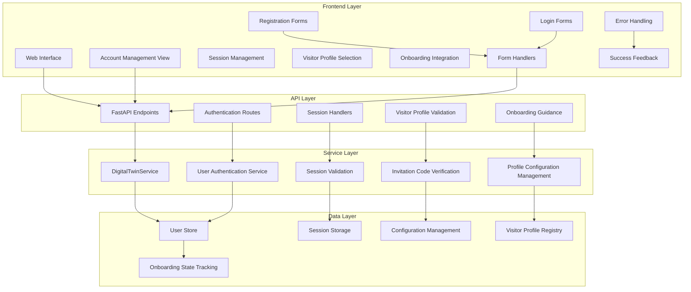

**Diagram sources**
- [api.py:499-529](file://src/sage_faculty_twin/api.py#L499-L529)
- [service.py:2915-2946](file://src/sage_faculty_twin/service.py#L2915-L2946)
- [auth.py:16-86](file://src/sage_faculty_twin/auth.py#L16-L86)

## Core Components

### Authentication Module

The authentication module provides the foundation for secure user management through cookie-based session tokens:

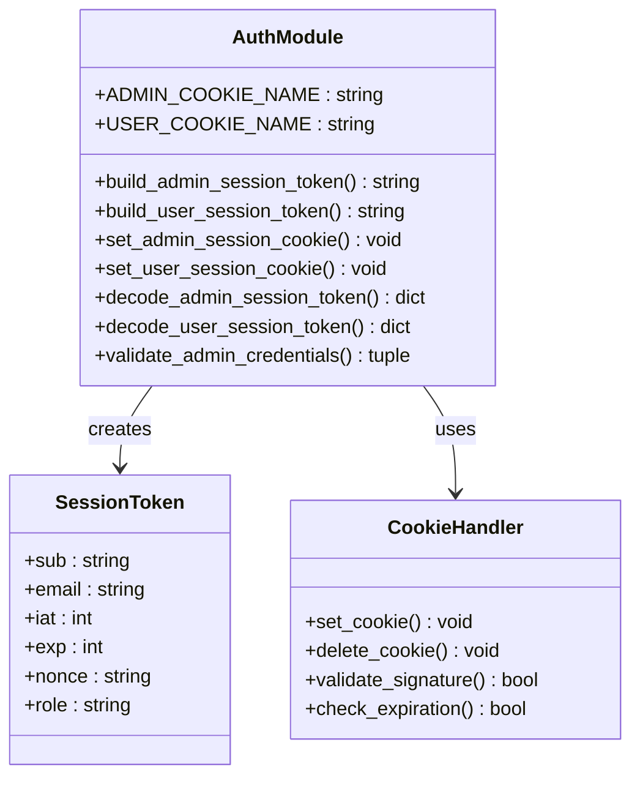

**Diagram sources**
- [auth.py:16-86](file://src/sage_faculty_twin/auth.py#L16-L86)

**Section sources**
- [auth.py:16-86](file://src/sage_faculty_twin/auth.py#L16-L86)

### User Store Management

The user store manages persistent user data with secure password hashing and validation:

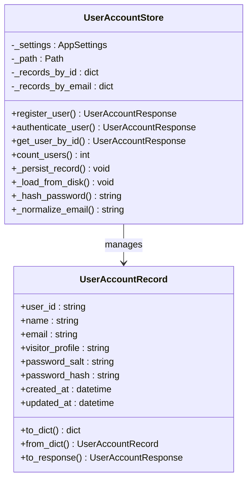

**Diagram sources**
- [user_store.py:62-200](file://src/sage_faculty_twin/user_store.py#L62-L200)

**Section sources**
- [user_store.py:62-200](file://src/sage_faculty_twin/user_store.py#L62-L200)

## Enhanced Visitor Profile System

### Visitor Profile Configuration

The system now supports four distinct visitor profiles with comprehensive configuration and presentation:

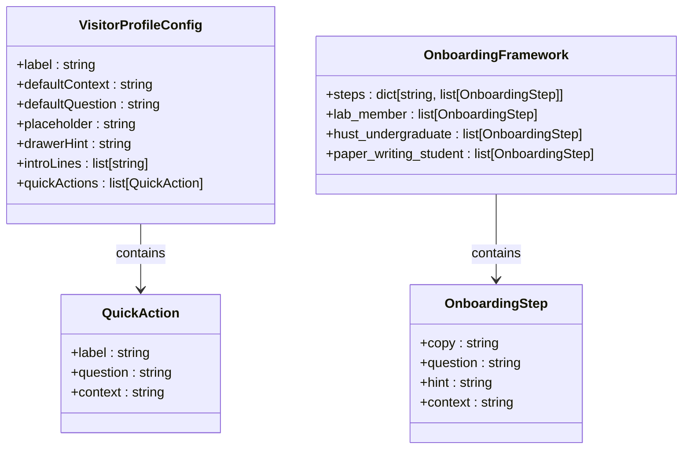

**Diagram sources**
- [app.js:398-463](file://src/sage_faculty_twin/web/app.js#L398-L463)
- [app.js:496-589](file://src/sage_faculty_twin/web/app.js#L496-L589)

The visitor profile system includes:

| Profile Type | Access Level | Key Features | Onboarding Complexity |
|--------------|--------------|-------------|----------------------|
| `general_visitor` | Basic | Public access with basic guidance | Minimal |
| `hust_undergraduate` | Course Access | Course-specific context and condensed onboarding | Medium |
| `paper_writing_student` | Writing Access | Thesis writing guidance with seven-step framework | High |
| `lab_member` | Full Access | Comprehensive research guidance with full onboarding | Highest |

**Section sources**
- [app.js:398-463](file://src/sage_faculty_twin/web/app.js#L398-L463)
- [app.js:496-589](file://src/sage_faculty_twin/web/app.js#L496-L589)

### Visitor Profile Presentation System

The frontend implements dynamic presentation based on visitor profiles:

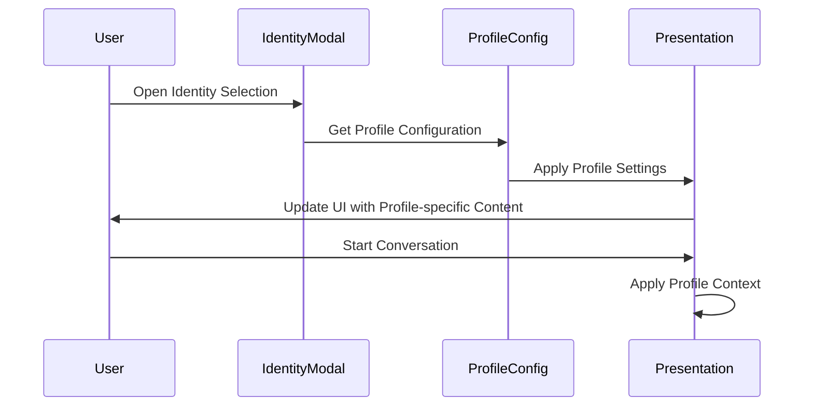

**Diagram sources**
- [app.js:1839-1874](file://src/sage_faculty_twin/web/app.js#L1839-L1874)
- [app.js:2047-2071](file://src/sage_faculty_twin/web/app.js#L2047-L2071)

**Section sources**
- [app.js:1839-1874](file://src/sage_faculty_twin/web/app.js#L1839-L1874)
- [app.js:2047-2071](file://src/sage_faculty_twin/web/app.js#L2047-L2071)

## Onboarding Integration Framework

### Seven-Step Research Question Framework

The system implements a comprehensive onboarding framework with different approaches for various user types:

**Diagram sources**
- [app.js:496-589](file://src/sage_faculty_twin/web/app.js#L496-L589)

**Section sources**
- [app.js:496-589](file://src/sage_faculty_twin/web/app.js#L496-L589)

### Profile-Specific Quick Actions

Each visitor profile provides tailored quick actions and guidance:

**Section sources**
- [app.js:464-494](file://src/sage_faculty_twin/web/app.js#L464-L494)

## Account Management Implementation

### Frontend Account View

The frontend implements a sophisticated account management interface with tabbed navigation and modal integration:

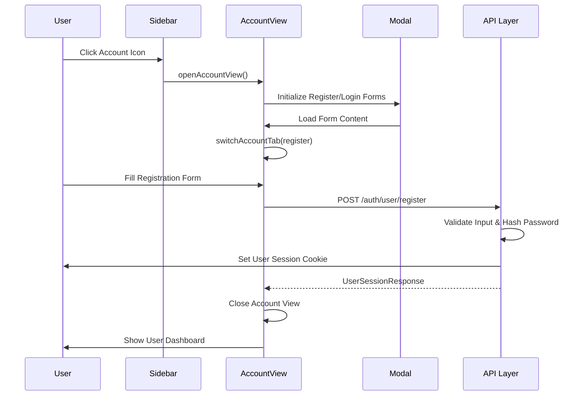

**Diagram sources**
- [app.js:8529-8553](file://src/sage_faculty_twin/web/app.js#L8529-L8553)
- [api.py:512-516](file://src/sage_faculty_twin/api.py#L512-L516)

The account management view consists of two primary tabs:

1. **Registration Tab**: Allows new users to create accounts with validation
2. **Login Tab**: Provides authentication for existing users

**Section sources**
- [app.js:8529-8553](file://src/sage_faculty_twin/web/app.js#L8529-L8553)
- [index.html:229-249](file://src/sage_faculty_twin/web/index.html#L229-L249)

### Backend API Endpoints

The backend exposes comprehensive authentication endpoints:

| Endpoint | Method | Description |
|----------|--------|-------------|
| `/auth/user/register` | POST | Creates new user accounts with visitor profile and invitation code validation |
| `/auth/user/login` | POST | Authenticates existing users with optional invitation code upgrade |
| `/auth/user/logout` | POST | Terminates user sessions |
| `/auth/user/session` | GET | Retrieves current user session |

**Section sources**
- [api.py:512-529](file://src/sage_faculty_twin/api.py#L512-L529)

### Comprehensive Form Handlers

**Updated** The system now includes comprehensive form handlers in app.js for user registration and login processes with proper error handling and success feedback mechanisms:

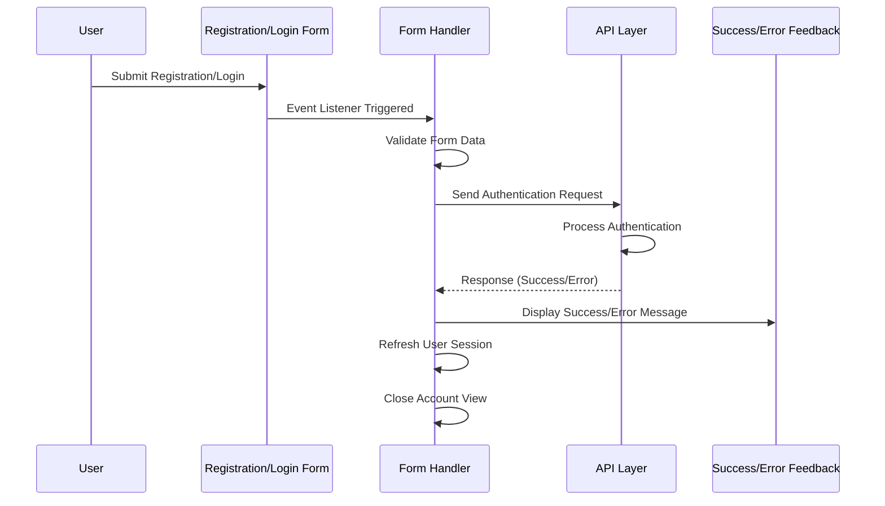

**Diagram sources**
- [app.js:1274-1319](file://src/sage_faculty_twin/web/app.js#L1274-L1319)

**Section sources**
- [app.js:1274-1319](file://src/sage_faculty_twin/web/app.js#L1274-L1319)

### Enhanced Close Button Functionality

**Updated** The account view now features a prominent close button (#close-account-view) with improved user interface elements:

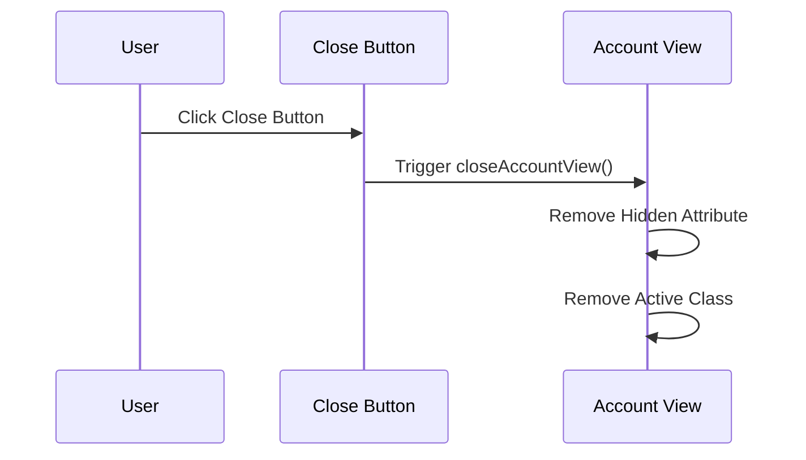

**Diagram sources**
- [app.js:1334-1335](file://src/sage_faculty_twin/web/app.js#L1334-L1335)
- [index.html:231-234](file://src/sage_faculty_twin/web/index.html#L231-L234)

**Section sources**
- [app.js:1334-1335](file://src/sage_faculty_twin/web/app.js#L1334-L1335)
- [index.html:231-234](file://src/sage_faculty_twin/web/index.html#L231-L234)

## Session Management

### Cookie-Based Authentication

The system implements secure cookie-based session management with configurable expiration:

**Diagram sources**
- [auth.py:57-86](file://src/sage_faculty_twin/auth.py#L57-L86)
- [service.py:2931-2943](file://src/sage_faculty_twin/service.py#L2931-L2943)

### Session Validation

Session validation occurs on each request through middleware that checks cookie authenticity and expiration:

**Section sources**
- [auth.py:193-214](file://src/sage_faculty_twin/auth.py#L193-L214)
- [api.py:474-476](file://src/sage_faculty_twin/api.py#L474-L476)

## User Authentication Flow

### Registration Process

The registration process follows a secure multi-step validation and storage workflow:

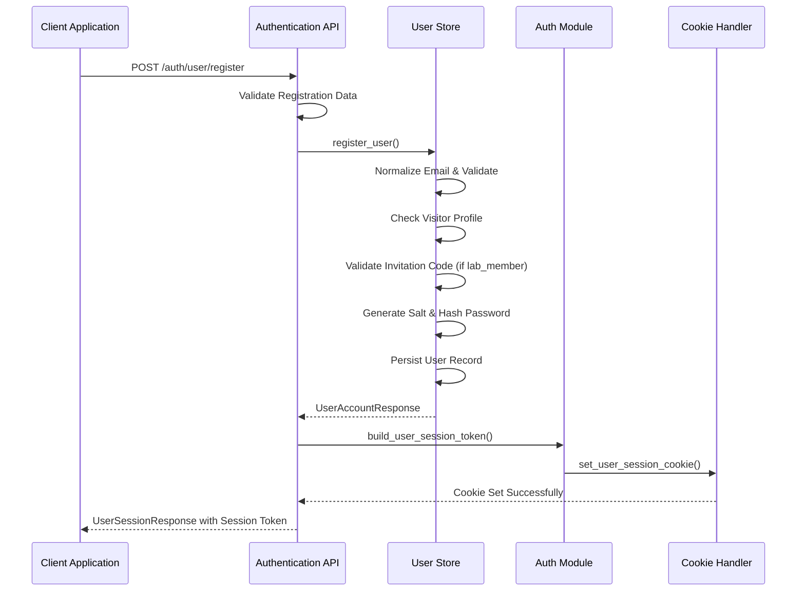

**Diagram sources**
- [user_store.py:71-121](file://src/sage_faculty_twin/user_store.py#L71-L121)
- [service.py:2915-2929](file://src/sage_faculty_twin/service.py#L2915-L2929)

### Login Process

The login process validates credentials and establishes authenticated sessions:

**Section sources**
- [user_store.py:123-161](file://src/sage_faculty_twin/user_store.py#L123-L161)
- [service.py:2931-2943](file://src/sage_faculty_twin/service.py#L2931-L2943)

## Frontend Integration

### Responsive Design Implementation

The account management view integrates seamlessly with the responsive frontend architecture:

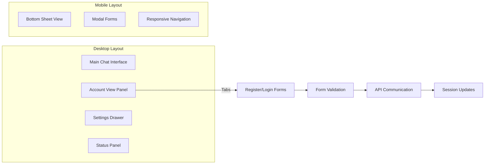

**Diagram sources**
- [app.js:8529-8553](file://src/sage_faculty_twin/web/app.js#L8529-L8553)
- [index.html:229-249](file://src/sage_faculty_twin/web/index.html#L229-L249)

### Real-time Session Updates

The frontend maintains real-time synchronization of user session states:

**Section sources**
- [app.js:8181-8189](file://src/sage_faculty_twin/web/app.js#L8181-L8189)
- [api.py:474-476](file://src/sage_faculty_twin/api.py#L474-L476)

### Enhanced Form Handling

**Updated** The system now includes comprehensive form handling with proper validation and feedback:

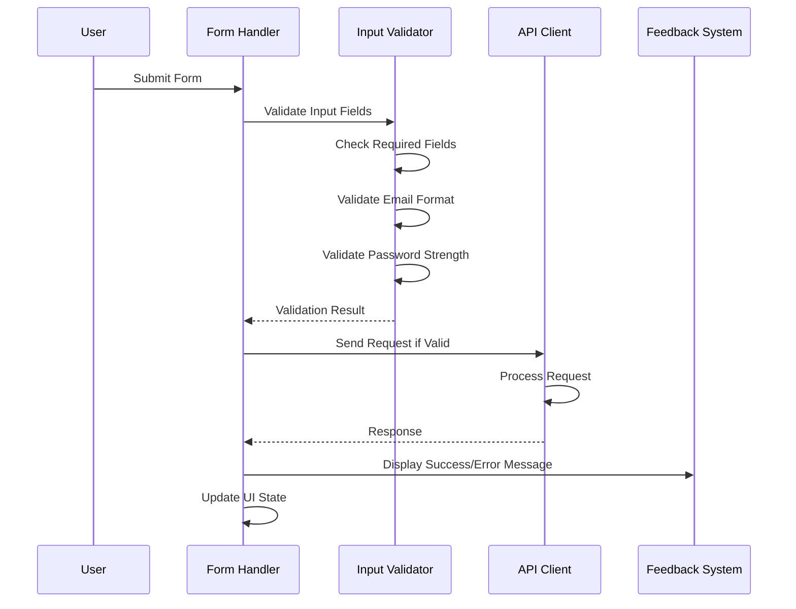

**Diagram sources**
- [app.js:1274-1319](file://src/sage_faculty_twin/web/app.js#L1274-L1319)

**Section sources**
- [app.js:1274-1319](file://src/sage_faculty_twin/web/app.js#L1274-L1319)

## Security Considerations

### Password Security

The system implements industry-standard password hashing using scrypt with configurable cost parameters:

- **Algorithm**: scrypt with N=2^14, r=8, p=1
- **Salt Generation**: Cryptographically secure random 16-byte salt
- **Storage**: Separate salt and hash fields for each user
- **Validation**: Constant-time comparison to prevent timing attacks

### Session Security

Cookie-based sessions provide secure, stateless authentication:

- **HttpOnly Cookies**: Prevents XSS attacks
- **SameSite Protection**: CSRF mitigation
- **Secure Transport**: Configurable secure flag
- **Expiration Handling**: Automatic session cleanup
- **Nonce Support**: Additional entropy for token validation

### Input Validation

Comprehensive input validation prevents injection attacks and data corruption:

- **Email Validation**: RFC-compliant email format checking
- **Password Strength**: Minimum length and complexity requirements
- **Visitor Profile Validation**: Whitelisted profile values only
- **Invitation Code Validation**: Secure constant-time comparison
- **Rate Limiting**: Built-in protection against brute force attacks

**Section sources**
- [user_store.py:188-196](file://src/sage_faculty_twin/user_store.py#L188-L196)
- [auth.py:182-214](file://src/sage_faculty_twin/auth.py#L182-L214)

## Data Storage

### Persistent Storage Architecture

User data is stored in JSON format with automatic indexing and retrieval:

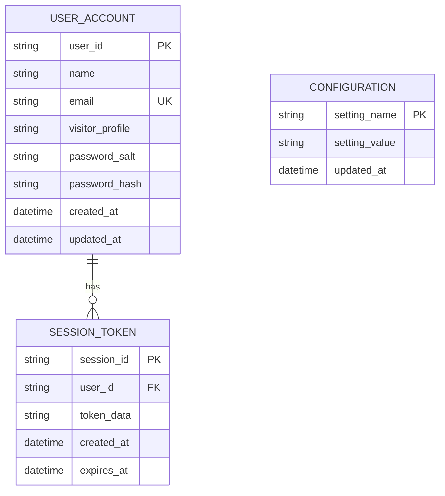

**Diagram sources**
- [user_store.py:16-60](file://src/sage_faculty_twin/user_store.py#L16-L60)

### Data Integrity

The storage system ensures data integrity through:

- **Atomic Operations**: Complete transaction support
- **Consistency Checks**: Email uniqueness enforcement
- **Backup Support**: Automatic file-based persistence
- **Migration Support**: Schema evolution capabilities

**Section sources**
- [user_store.py:170-176](file://src/sage_faculty_twin/user_store.py#L170-L176)
- [user_store.py:178-183](file://src/sage_faculty_twin/user_store.py#L178-L183)

## Testing Infrastructure

### Lab Member Account Provisioning

The system includes dedicated support for lab member accounts as part of the testing infrastructure:

**Updated** The testing infrastructure now includes provisioned lab member accounts with controlled access through invitation codes and comprehensive visitor profile support.

#### Visitor Profile System

The system supports four distinct visitor profiles with different access levels:

| Profile Type | Access Level | Description | Invitation Code Required |
|--------------|--------------|-------------|-------------------------|
| `general_visitor` | Basic | Public access for general visitors | No |
| `hust_undergraduate` | Course Access | Access to undergraduate course materials | No |
| `paper_writing_student` | Writing Access | Access to thesis writing resources | No |
| `lab_member` | Full Access | Complete research system access | Yes |

#### Invitation Code Validation

Lab member accounts require invitation code validation during registration and login:

**Diagram sources**
- [user_store.py:92-104](file://src/sage_faculty_twin/user_store.py#L92-L104)

#### Test Account Examples

The testing infrastructure includes pre-provisioned lab member accounts:

- **Test Account 1**: `8e5a47f9-49e8-4132-b983-dff1314a6d05` - Lab User
- **Test Account 2**: `01215b72-6871-483f-8799-d8f0a6d909df` - Lab User  
- Additional lab member accounts for comprehensive testing

#### Onboarding Integration Testing

The system includes comprehensive onboarding integration testing:

**Section sources**
- [user_store.py:92-104](file://src/sage_faculty_twin/user_store.py#L92-L104)
- [data/user_accounts/8e5a47f9-49e8-4132-b983-dff1314a6d05.json:1-11](file://data/user_accounts/8e5a47f9-49e8-4132-b983-dff1314a6d05.json#L1-L11)

## Troubleshooting Guide

### Common Authentication Issues

**Issue**: Users cannot log in despite correct credentials
- **Cause**: Password hash mismatch or expired session
- **Solution**: Verify password hashing algorithm and session expiration
- **Debug Steps**: Check user record password hash, validate session cookie

**Issue**: Registration fails with validation errors
- **Cause**: Invalid email format or duplicate email address
- **Solution**: Validate input format and check existing user records
- **Debug Steps**: Test email regex pattern, query user store for duplicates

**Issue**: Session cookies not persisting
- **Cause**: Browser privacy settings or cookie restrictions
- **Solution**: Check SameSite and Secure cookie attributes
- **Debug Steps**: Verify browser cookie settings, test cross-origin requests

**Issue**: Lab member registration blocked by invitation code
- **Cause**: Invitation code validation failure
- **Solution**: Verify invitation code configuration and enablement
- **Debug Steps**: Check `lab_member_invitation_code_enabled` setting, validate code format

**Issue**: Visitor profile not applying correctly
- **Cause**: Profile configuration not loaded or localStorage issues
- **Solution**: Verify profile configuration exists and localStorage is accessible
- **Debug Steps**: Check `VISITOR_PROFILE_CONFIGS` object, verify localStorage permissions

**Issue**: Account view forms not working
- **Cause**: Missing form handlers or DOM elements
- **Solution**: Verify form handler registration and element IDs
- **Debug Steps**: Check form element existence, verify event listener attachment

**Issue**: Success/error feedback not displaying
- **Cause**: Missing inline status elements or setInlineStatus function
- **Solution**: Verify inline status elements exist and function is defined
- **Debug Steps**: Check HTML structure, verify setInlineStatus function implementation

### Performance Optimization

**Recommendations**:
- Enable HTTP caching for static assets
- Implement connection pooling for database operations
- Optimize password hashing parameters for deployment environment
- Monitor session storage growth and implement cleanup policies
- Cache frequently accessed profile configurations

**Section sources**
- [user_store.py:78-90](file://src/sage_faculty_twin/user_store.py#L78-L90)
- [auth.py:169-172](file://src/sage_faculty_twin/auth.py#L169-L172)

## Conclusion

The Integrated Account Management View represents a comprehensive solution for user authentication and session management in the SAGE Faculty Twin platform. The system successfully balances security, usability, and performance through its layered architecture and robust implementation patterns.

Key strengths include:
- **Security**: Industry-standard password hashing and cookie-based authentication
- **Scalability**: Modular design supporting future expansion
- **Usability**: Intuitive frontend interface with responsive design
- **Visitor Profiles**: Comprehensive visitor profile system with personalized experiences
- **Onboarding**: Structured onboarding framework tailored to different user types
- **Testing Infrastructure**: Dedicated support for lab member accounts and invitation code validation
- **Maintainability**: Clear separation of concerns and comprehensive error handling
- **Enhanced Forms**: Comprehensive registration and login forms with proper validation
- **Improved UI**: Enhanced user interface elements and feedback mechanisms

The system provides a solid foundation for user management while maintaining flexibility for future enhancements and integration with additional authentication providers or advanced security features.

**Updated** The enhancement of the visitor profile system with comprehensive onboarding integration and invitation code validation significantly improves the platform's ability to support diverse user types and controlled access scenarios. The addition of structured onboarding workflows, particularly for lab members and paper writing students, demonstrates the system's commitment to providing personalized user experiences while maintaining security and access control.

The comprehensive registration and login forms with proper error handling and success feedback mechanisms represent a significant improvement in user experience, making the account management process more intuitive and reliable. The prominent close button and enhanced UI elements contribute to a more polished and professional user interface.