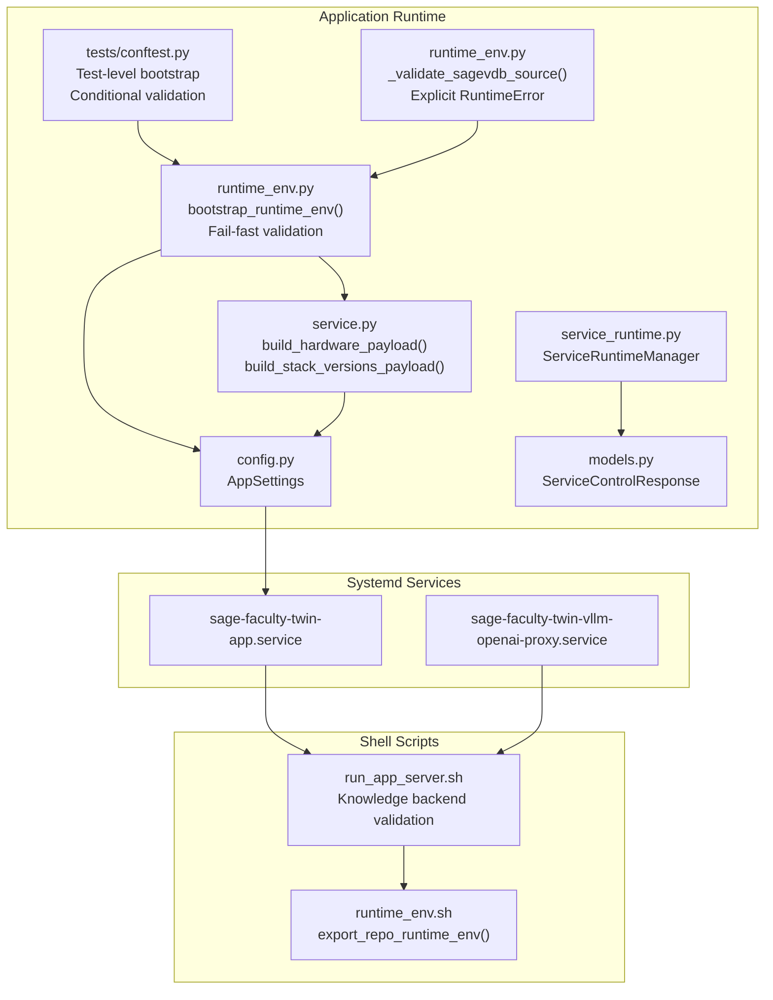
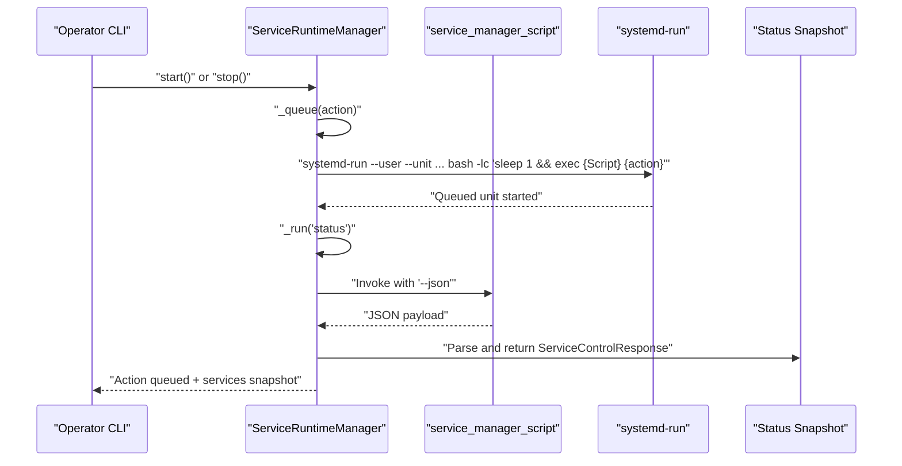
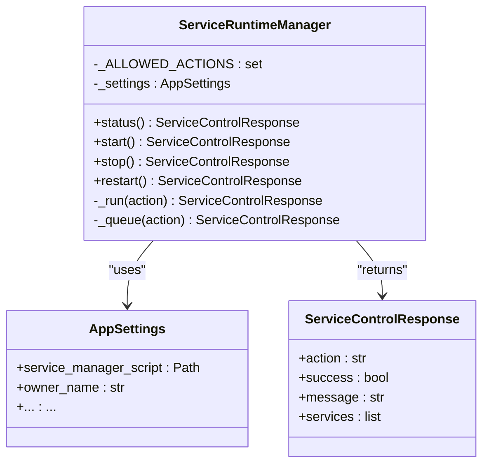
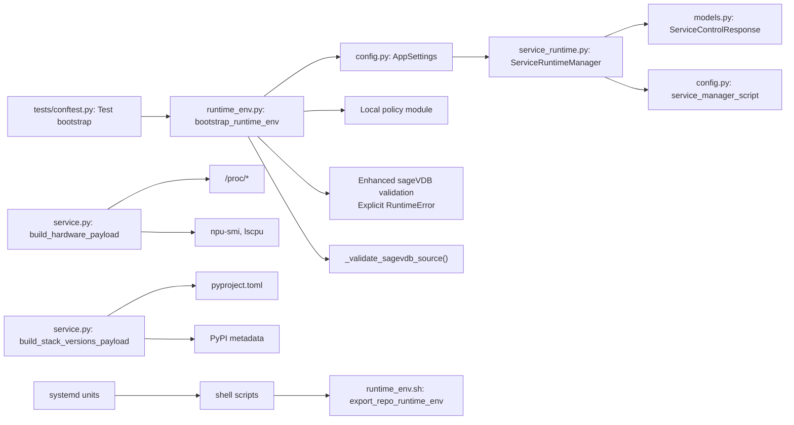

# Runtime Environment

<cite>
**Referenced Files in This Document**
- [runtime_env.py](file://src/sage_faculty_twin/runtime_env.py)
- [service_runtime.py](file://src/sage_faculty_twin/service_runtime.py)
- [service.py](file://src/sage_faculty_twin/service.py)
- [config.py](file://src/sage_faculty_twin/config.py)
- [models.py](file://src/sage_faculty_twin/models.py)
- [conftest.py](file://tests/conftest.py)
- [sage-faculty-twin-app.service](file://deploy/systemd/user/sage-faculty-twin-app.service)
- [sage-faculty-twin-vllm-openai-proxy.service](file://deploy/systemd/user/sage-faculty-twin-vllm-openai-proxy.service)
- [run_app_server.sh](file://tools/run_app_server.sh)
- [runtime_env.sh](file://tools/lib/runtime_env.sh)
- [test_systemd_service_scripts.py](file://tests/test_systemd_service_scripts.py)
</cite>

## Update Summary
**Changes Made**
- Enhanced runtime environment with hardened fail-fast strategy for sageVDB source validation
- Added explicit RuntimeError exceptions for broken sageVDB source checkout requiring manual intervention
- Improved error reporting with detailed guidance for missing compiled C extensions and unavailable database configurations
- Strengthened policy module validation with clear error messaging for non-local imports
- Enhanced test-level runtime bootstrap with conditional policy validation

## Table of Contents
1. [Introduction](#introduction)
2. [Project Structure](#project-structure)
3. [Core Components](#core-components)
4. [Architecture Overview](#architecture-overview)
5. [Detailed Component Analysis](#detailed-component-analysis)
6. [Dependency Analysis](#dependency-analysis)
7. [Performance Considerations](#performance-considerations)
8. [Troubleshooting Guide](#troubleshooting-guide)
9. [Conclusion](#conclusion)
10. [Appendices](#appendices)

## Introduction
This document describes the runtime environment management system for the Sage Faculty Twin project. It focuses on how the application initializes, validates its environment, detects and reports hardware resources (including NPUs), resolves stack component versions, and integrates with systemd-managed services. The system now employs a hardened fail-fast strategy to prevent silent failures and provides explicit error reporting for critical dependency issues.

**Updated** Enhanced with hardened runtime environment validation that prevents silent failures through explicit RuntimeError exceptions. The system now requires manual intervention for broken sageVDB source checkouts and provides detailed guidance for resolving missing compiled C extensions and unavailable database configurations.

## Project Structure
The runtime environment spans several layers:
- Application runtime bootstrap and environment validation with fail-fast error handling
- Hardware detection and reporting with comprehensive system introspection
- Version resolution for stack components with fallback mechanisms
- Service orchestration via systemd units and shell scripts with enhanced error reporting
- Operational diagnostics and tests with improved test collection handling
- Sophisticated test-level runtime bootstrap through conftest.py with conditional validation
- **Enhanced sageVDB dependency management**: Explicit RuntimeError exceptions for broken source checkouts requiring manual intervention

**Diagram sources**
- [runtime_env.py:102-136](file://src/sage_faculty_twin/runtime_env.py#L102-L136)
- [service_runtime.py:13-69](file://src/sage_faculty_twin/service_runtime.py#L13-L69)
- [service.py:250-266](file://src/sage_faculty_twin/service.py#L250-L266)
- [service.py:269-346](file://src/sage_faculty_twin/service.py#L269-L346)
- [config.py:9-132](file://src/sage_faculty_twin/config.py#L9-L132)
- [models.py:1-200](file://src/sage_faculty_twin/models.py#L1-L200)
- [conftest.py:1-68](file://tests/conftest.py#L1-L68)
- [runtime_env.py:59-91](file://src/sage_faculty_twin/runtime_env.py#L59-L91)
- [sage-faculty-twin-app.service:1-18](file://deploy/systemd/user/sage-faculty-twin-app.service#L1-L18)
- [sage-faculty-twin-vllm-openai-proxy.service:1-20](file://deploy/systemd/user/sage-faculty-twin-vllm-openai-proxy.service#L1-L20)
- [run_app_server.sh:1-60](file://tools/run_app_server.sh#L1-L60)
- [runtime_env.sh:62-92](file://tools/lib/runtime_env.sh#L62-L92)

**Section sources**
- [runtime_env.py:102-136](file://src/sage_faculty_twin/runtime_env.py#L102-L136)
- [service_runtime.py:13-69](file://src/sage_faculty_twin/service_runtime.py#L13-L69)
- [service.py:250-346](file://src/sage_faculty_twin/service.py#L250-L346)
- [config.py:9-132](file://src/sage_faculty_twin/config.py#L9-L132)
- [models.py:1-200](file://src/sage_faculty_twin/models.py#L1-L200)
- [conftest.py:1-68](file://tests/conftest.py#L1-L68)
- [runtime_env.py:59-91](file://src/sage_faculty_twin/runtime_env.py#L59-L91)
- [sage-faculty-twin-app.service:1-18](file://deploy/systemd/user/sage-faculty-twin-app.service#L1-L18)
- [sage-faculty-twin-vllm-openai-proxy.service:1-20](file://deploy/systemd/user/sage-faculty-twin-vllm-openai-proxy.service#L1-L20)
- [run_app_server.sh:1-60](file://tools/run_app_server.sh#L1-L60)
- [runtime_env.sh:62-92](file://tools/lib/runtime_env.sh#L62-L92)

## Core Components
- ServiceRuntimeManager: Orchestrates service actions (status, start, stop, restart) by invoking a service manager script and parsing JSON responses into typed models.
- Runtime environment bootstrap: Prepares Python path, enforces local policy preference, validates external dependencies, and sets environment variables for device backends with fail-fast error handling.
- **Enhanced sageVDB dependency validation**: Validates source installations for compiled C extensions and raises explicit RuntimeError exceptions requiring manual intervention when source checkouts are broken.
- Hardware detection: Gathers NPU, CPU, and memory details from system tools and procfs with comprehensive error handling.
- Stack version resolution: Resolves versions for SAGE, neuromem, vLLM-HUST, sageVDB, and sage-anns from local pyproject.toml or PyPI metadata.
- Systemd integration: Units define service lifecycles and ExecStart scripts that initialize runtime environment and start processes with enhanced error reporting.
- **Enhanced Test Collection Handling**: Sophisticated test-level runtime bootstrap through conftest.py that ensures PYTHONPATH includes local source checkouts before test modules are collected with conditional policy validation.

**Updated** Enhanced with hardened fail-fast strategy that prevents silent failures by raising explicit RuntimeError exceptions for broken dependencies. The sageVDB validation now requires manual intervention through bash ../sageVDB/scripts/link_shared_libs.sh when compiled C extensions are missing. Test collection is protected through conditional validation that only triggers full policy checks when SAGE source is available.

**Section sources**
- [service_runtime.py:13-69](file://src/sage_faculty_twin/service_runtime.py#L13-L69)
- [runtime_env.py:102-136](file://src/sage_faculty_twin/runtime_env.py#L102-L136)
- [runtime_env.py:59-91](file://src/sage_faculty_twin/runtime_env.py#L59-L91)
- [service.py:250-346](file://src/sage_faculty_twin/service.py#L250-L346)
- [config.py:9-132](file://src/sage_faculty_twin/config.py#L9-L132)
- [models.py:1-200](file://src/sage_faculty_twin/models.py#L1-L200)
- [conftest.py:1-68](file://tests/conftest.py#L1-L68)

## Architecture Overview
The runtime environment integrates application logic, system services, shell scripts, and enhanced test collection handling to deliver a robust deployment and diagnostics framework with fail-fast error handling.

**Diagram sources**
- [service_runtime.py:31-69](file://src/sage_faculty_twin/service_runtime.py#L31-L69)

**Section sources**
- [service_runtime.py:13-69](file://src/sage_faculty_twin/service_runtime.py#L13-L69)

## Detailed Component Analysis

### ServiceRuntimeManager
Responsibilities:
- Validates allowed actions and raises errors for unsupported operations.
- Executes synchronous status queries against the service manager script and parses JSON into typed models.
- Queues asynchronous actions via systemd-run with a randomized unit name and captures a post-queue status snapshot.

Key behaviors:
- Action validation prevents misuse.
- Queueing ensures non-blocking start/stop/restart operations.
- Status snapshots provide immediate feedback after queuing.

**Diagram sources**
- [service_runtime.py:13-69](file://src/sage_faculty_twin/service_runtime.py#L13-L69)
- [config.py:9-132](file://src/sage_faculty_twin/config.py#L9-L132)
- [models.py:1-200](file://src/sage_faculty_twin/models.py#L1-L200)

**Section sources**
- [service_runtime.py:13-69](file://src/sage_faculty_twin/service_runtime.py#L13-L69)
- [config.py:9-132](file://src/sage_faculty_twin/config.py#L9-L132)
- [models.py:1-200](file://src/sage_faculty_twin/models.py#L1-L200)

### Runtime Environment Bootstrap
Responsibilities:
- Determine repository root and candidate Python path entries.
- Prepend local repositories to sys.path to prefer local development.
- **Enhanced sageVDB validation**: Validate source installations for compiled C extensions and raise explicit RuntimeError exceptions requiring manual intervention.
- Enforce local policy module origin to prevent unintended overrides with clear error messaging.
- Require modules such as pydantic_settings and optionally FastAPI and policy with fail-fast error handling.

**Updated** Enhanced with hardened fail-fast strategy that prevents silent failures. The sageVDB validation now explicitly raises RuntimeError exceptions when compiled C extensions are missing, requiring users to run bash ../sageVDB/scripts/link_shared_libs.sh to fix compilation problems. Policy module validation provides clear guidance for avoiding interpreter/path drift.

Operational notes:
- Sets TORCH_DEVICE_BACKEND_AUTOLOAD to 0 to avoid automatic loading of optional device backends.
- Provides explicit RuntimeError exceptions with actionable steps for dependency failures.
- Conditional policy enforcement reduces overhead when SAGE source is not present.
- **Enhanced sageVDB handling**: Requires manual intervention for broken source checkouts with specific remediation steps.

**Section sources**
- [runtime_env.py:102-136](file://src/sage_faculty_twin/runtime_env.py#L102-L136)
- [runtime_env.py:59-91](file://src/sage_faculty_twin/runtime_env.py#L59-L91)

### Enhanced sageVDB Dependency Management
**New Section** The runtime environment now includes sophisticated validation for sageVDB source installations with explicit RuntimeError exceptions for broken source checkouts.

Key responsibilities:
- Detect when sageVDB source checkout is present but lacks compiled extensions.
- Validate that DatabaseConfig is accessible from the sagevdb module.
- Raise explicit RuntimeError exceptions with detailed guidance for missing compiled extensions.
- Allow fallback to PyPI package when source checkout is absent.
- Prevent "notoriously confusing failure" where __all__ becomes empty and DatabaseConfig is unavailable.

Validation mechanics:
- Checks for the presence of the sageVDB source package directory.
- Attempts to import the sagevdb module and validate DatabaseConfig accessibility.
- Raises explicit RuntimeError with guidance for running `bash ../sageVDB/scripts/link_shared_libs.sh`.
- Provides fallback behavior when source checkout is not present.

Error handling improvements:
- Clear distinction between import failures and missing compiled extensions.
- Specific guidance for linking shared libraries when source is available.
- Graceful fallback to PyPI package when source is not present.
- **Fail-fast strategy**: Prevents silent failures by requiring manual intervention for broken source checkouts.

**Section sources**
- [runtime_env.py:59-91](file://src/sage_faculty_twin/runtime_env.py#L59-L91)

### Enhanced Test Collection Handling
**New Section** The tests/conftest.py file provides sophisticated test-level runtime bootstrap that ensures PYTHONPATH includes local source checkouts before test modules are collected.

Key responsibilities:
- Ensures the project src directory is importable before any test module is collected.
- Prepend sibling source checkouts (SAGE/src, sageVDB, neuromem) to sys.path.
- Delegates to the same bootstrap_runtime_env used at runtime with require_policy=False.
- Prevents import failures when SAGE source dependencies are unavailable during test collection.

Behavioral improvements:
- Lightweight implementation that delegates to runtime bootstrap logic.
- Prevents test collection failures by ensuring local source checkouts are available.
- Allows tests to import modules like sage_faculty_twin.llm_client without triggering full policy validation during collection.
- **Conditional validation**: Only performs full policy validation when SAGE source is present.

**Section sources**
- [conftest.py:1-68](file://tests/conftest.py#L1-L68)

### Hardware Detection and Reporting
Capabilities:
- NPU detection via npu-smi: Parses device info to report counts and model names.
- CPU detection via lscpu or /proc/cpuinfo: Extracts model name and core count.
- Memory detection via /proc/meminfo: Reports total memory in GiB or TiB.

**Diagram sources**
- [service.py:269-346](file://src/sage_faculty_twin/service.py#L269-L346)

**Section sources**
- [service.py:269-346](file://src/sage_faculty_twin/service.py#L269-L346)

### Version Resolution System
Purpose:
- Provide accurate stack component versions for diagnostics and support.

Mechanics:
- Resolve versions from local pyproject.toml when available; otherwise fall back to PyPI metadata.
- Special-case vLLM-HUST to use setuptools-scm-derived version strings.
- Build a consolidated payload for telemetry and diagnostics.

**Diagram sources**
- [service.py:250-266](file://src/sage_faculty_twin/service.py#L250-L266)
- [service.py:236-247](file://src/sage_faculty_twin/service.py#L236-L247)

**Section sources**
- [service.py:236-266](file://src/sage_faculty_twin/service.py#L236-L266)

### Systemd Services and Deployment
Service units define:
- Application server and OpenAI-compatible vLLM proxy with enhanced error reporting.
- ExecStart scripts that initialize runtime environment and start processes.
- Dependencies and restart policies for resilience.

Integration points:
- Units depend on network-online.target and each other to enforce startup order.
- Proxy service includes port conflict detection with explicit error messages.

**Section sources**
- [sage-faculty-twin-app.service:1-18](file://deploy/systemd/user/sage-faculty-twin-app.service#L1-L18)
- [sage-faculty-twin-vllm-openai-proxy.service:1-20](file://deploy/systemd/user/sage-faculty-twin-vllm-openai-proxy.service#L1-L20)

### Shell Scripts and Runtime Environment
- run_app_server.sh: Exports repository runtime environment, loads .env, validates and installs knowledge backend dependencies, then starts the Uvicorn server with enhanced error reporting.
- runtime_env.sh: Exports repository runtime environment variables (PYTHON_BIN, PYTHONPATH, TORCH_DEVICE_BACKEND_AUTOLOAD) and prints a runtime summary.

**Section sources**
- [run_app_server.sh:1-60](file://tools/run_app_server.sh#L1-L60)
- [runtime_env.sh:62-92](file://tools/lib/runtime_env.sh#L62-L92)

## Dependency Analysis
High-level dependencies:
- ServiceRuntimeManager depends on AppSettings for the service manager script path and returns ServiceControlResponse models.
- Runtime bootstrap depends on repository layout and sibling repositories for policy and data with fail-fast error handling.
- **Enhanced sageVDB validation**: Runtime environment validation now includes explicit RuntimeError exceptions for broken source checkouts.
- Hardware and version resolution functions depend on system tools and filesystem metadata.
- Systemd units depend on shell scripts and environment variables exported by runtime_env.sh.
- **Enhanced Test Collection**: conftest.py depends on runtime_env.py for test-level bootstrap and ensures PYTHONPATH is properly configured before test collection.

**Diagram sources**
- [service_runtime.py:13-69](file://src/sage_faculty_twin/service_runtime.py#L13-L69)
- [config.py:9-132](file://src/sage_faculty_twin/config.py#L9-L132)
- [models.py:1-200](file://src/sage_faculty_twin/models.py#L1-L200)
- [runtime_env.py:102-136](file://src/sage_faculty_twin/runtime_env.py#L102-L136)
- [runtime_env.py:59-91](file://src/sage_faculty_twin/runtime_env.py#L59-L91)
- [conftest.py:1-68](file://tests/conftest.py#L1-L68)
- [service.py:250-346](file://src/sage_faculty_twin/service.py#L250-L346)
- [sage-faculty-twin-app.service:1-18](file://deploy/systemd/user/sage-faculty-twin-app.service#L1-L18)
- [run_app_server.sh:1-60](file://tools/run_app_server.sh#L1-L60)
- [runtime_env.sh:62-92](file://tools/lib/runtime_env.sh#L62-L92)

**Section sources**
- [service_runtime.py:13-69](file://src/sage_faculty_twin/service_runtime.py#L13-L69)
- [config.py:9-132](file://src/sage_faculty_twin/config.py#L9-L132)
- [models.py:1-200](file://src/sage_faculty_twin/models.py#L1-L200)
- [runtime_env.py:102-136](file://src/sage_faculty_twin/runtime_env.py#L102-L136)
- [runtime_env.py:59-91](file://src/sage_faculty_twin/runtime_env.py#L59-L91)
- [conftest.py:1-68](file://tests/conftest.py#L1-L68)
- [service.py:250-346](file://src/sage_faculty_twin/service.py#L250-L346)
- [sage-faculty-twin-app.service:1-18](file://deploy/systemd/user/sage-faculty-twin-app.service#L1-L18)
- [run_app_server.sh:1-60](file://tools/run_app_server.sh#L1-L60)
- [runtime_env.sh:62-92](file://tools/lib/runtime_env.sh#L62-L92)

## Performance Considerations
- Hardware detection is lightweight and guarded by timeouts and safe parsing to avoid blocking.
- Version resolution prefers local pyproject.toml for deterministic builds; falls back to PyPI metadata for installed packages.
- Runtime environment exports minimize unnecessary environment variable churn and avoids auto-loading of optional device backends.
- Service queueing via systemd-run enables non-blocking control operations, improving responsiveness during maintenance windows.
- **Enhanced Test Collection**: The conftest.py approach prevents test collection failures and reduces import overhead by ensuring local source checkouts are available before test modules are processed.
- **Enhanced sageVDB validation**: Runtime validation is performed efficiently and only when source installations are detected, minimizing overhead in production environments.
- **Fail-fast strategy**: Prevents wasted resources on broken configurations by immediately raising explicit errors instead of attempting graceful degradation.

**Updated** Enhanced test collection handling reduces overhead by ensuring local source checkouts are available before test collection, preventing import failures and reducing test startup time. SageVDB validation is optimized to only run when source installations are present. The fail-fast strategy prevents wasted resources on broken configurations.

## Troubleshooting Guide
Common scenarios and diagnostics:
- Missing runtime dependencies: The bootstrap routine raises explicit RuntimeError when required modules are absent, guiding installation via editable installs.
- Non-local policy import: The bootstrap routine verifies that the policy module originates from the expected local checkout to prevent accidental overrides, raising clear RuntimeError with actionable steps.
- **Enhanced sageVDB dependency issues**: The bootstrap routine now detects missing compiled C extensions and raises explicit RuntimeError with clear guidance for linking shared libraries using bash ../sageVDB/scripts/link_shared_libs.sh.
- Port conflicts for proxies: The vLLM proxy script validates bind availability and exits with a clear message when the port is already in use.
- systemd service installation flags: Tests demonstrate that optional services are only enabled when explicitly requested.
- **Enhanced Test Collection Issues**: The conftest.py ensures PYTHONPATH includes local source checkouts before test modules are collected, preventing import failures when SAGE source dependencies are unavailable.

**Updated** Enhanced error messages now provide clearer guidance for policy module validation failures and conditional validation behavior. Test collection issues are prevented by the sophisticated conftest.py bootstrap. SageVDB dependency issues are handled with explicit RuntimeError exceptions requiring manual intervention through specific remediation steps.

Operational tips:
- Use ServiceRuntimeManager to queue actions and immediately fetch a status snapshot for confirmation.
- Review systemd journal logs for units to diagnose startup failures.
- Verify environment variables exported by runtime_env.sh and ensure PYTHON_BIN points to a working interpreter.
- **Test Collection**: Ensure conftest.py is properly configured to handle test-level runtime bootstrap and PYTHONPATH management.
- **SageVDB Troubleshooting**: When encountering "missing compiled C extension" errors, run `bash ../sageVDB/scripts/link_shared_libs.sh` to link the required shared libraries. The system now requires this manual intervention instead of graceful degradation.

**Section sources**
- [runtime_env.py:102-136](file://src/sage_faculty_twin/runtime_env.py#L102-L136)
- [runtime_env.py:59-91](file://src/sage_faculty_twin/runtime_env.py#L59-L91)
- [conftest.py:1-68](file://tests/conftest.py#L1-L68)
- [test_systemd_service_scripts.py:162-192](file://tests/test_systemd_service_scripts.py#L162-L192)

## Conclusion
The runtime environment management system provides a cohesive foundation for deploying, diagnosing, and operating the Sage Faculty Twin application. It centralizes environment bootstrapping, hardware and version introspection, and service control, while integrating seamlessly with systemd and shell-based deployment scripts. The recent enhancements strengthen the system with a hardened fail-fast strategy that prevents silent failures and provides explicit error reporting for critical dependency issues.

**Updated** Recent enhancements strengthen policy module validation and dependency resolution with explicit RuntimeError exceptions for broken configurations. The sophisticated test-level runtime bootstrap through conftest.py ensures reliable test collection even when SAGE source dependencies are unavailable. Enhanced sageVDB dependency management provides automatic detection of missing compiled extensions with clear remediation steps requiring manual intervention.

## Appendices

### Appendix A: Example Workflows

#### Diagnose Hardware and Stack Versions
- Invoke hardware payload collection to obtain NPU/CPU/memory details.
- Invoke stack versions payload to retrieve component versions for telemetry.

**Section sources**
- [service.py:269-346](file://src/sage_faculty_twin/service.py#L269-L346)
- [service.py:250-266](file://src/sage_faculty_twin/service.py#L250-L266)

#### Environment Validation Checklist
- Confirm local policy module is loaded from the expected path.
- **Enhanced sageVDB validation**: Ensure sageVDB compiled extension is available or link shared libraries as instructed.
- Verify required modules are installed per bootstrap diagnostics.
- Check that policy validation only occurs when SAGE source is present.
- **Test Collection**: Verify that conftest.py properly configures PYTHONPATH for test modules before collection.

**Updated** Added conditional policy validation check for SAGE source directory presence and test collection validation. Enhanced sageVDB validation now includes explicit RuntimeError exceptions requiring manual intervention.

**Section sources**
- [runtime_env.py:102-136](file://src/sage_faculty_twin/runtime_env.py#L102-L136)
- [runtime_env.py:59-91](file://src/sage_faculty_twin/runtime_env.py#L59-L91)
- [conftest.py:1-68](file://tests/conftest.py#L1-L68)

#### Containerization Considerations
- Export runtime environment variables using the provided helper to ensure consistent interpreter and path resolution.
- Mount writable caches for model downloads and runtime artifacts.
- Configure systemd user services inside containers using appropriate init systems or alternatives.
- **Test Collection**: Ensure containerized environments include proper PYTHONPATH configuration for test modules.
- **SageVDB in Containers**: When using containerized deployments, ensure compiled C extensions are available or configure the container to link shared libraries appropriately. The system now requires explicit manual intervention for broken source checkouts.

**Section sources**
- [runtime_env.sh:62-92](file://tools/lib/runtime_env.sh#L62-L92)
- [run_app_server.sh:13-31](file://tools/run_app_server.sh#L13-L31)
- [conftest.py:1-68](file://tests/conftest.py#L1-L68)

### Appendix B: Enhanced Test Collection Handling

**New Section** The conftest.py file provides sophisticated test-level runtime bootstrap that ensures PYTHONPATH includes local source checkouts before test modules are collected.

Key benefits:
- Prevents import failures when SAGE source dependencies are unavailable during test collection.
- Ensures local source checkouts are available for modules like sage_faculty_twin.llm_client.
- Reduces test startup time by delegating to the same bootstrap logic used at runtime.
- Provides graceful handling of missing dependencies during test collection phase.
- **Conditional validation**: Only performs full policy validation when SAGE source is present.

Implementation details:
- Prepend project src directory to sys.path before any test module is collected.
- Add sibling source checkouts (SAGE/src, sageVDB, neuromem) to sys.path if they exist.
- Call bootstrap_runtime_env(require_policy=False, require_fastapi=False) to avoid full policy validation during collection.
- Allows subsequent test execution to trigger full validation when SAGE source is available.

**Section sources**
- [conftest.py:1-68](file://tests/conftest.py#L1-L68)

### Appendix C: Enhanced sageVDB Dependency Management

**New Section** The runtime environment now includes sophisticated validation for sageVDB source installations with explicit RuntimeError exceptions for broken source checkouts.

Key improvements:
- Automatic detection of missing compiled C extensions in source installations.
- Clear error messages with actionable steps to resolve the issue.
- Graceful fallback to PyPI package when source checkout is absent.
- Prevention of "notoriously confusing failure" where __all__ becomes empty and DatabaseConfig is unavailable.
- **Fail-fast strategy**: Requires manual intervention instead of graceful degradation.

Validation workflow:
- Detect presence of sageVDB source package directory.
- Attempt to import sagevdb module and validate DatabaseConfig accessibility.
- Raise explicit RuntimeError with guidance for linking shared libraries.
- Allow fallback to PyPI package when source is not present.

Remediation steps:
- Run `bash ../sageVDB/scripts/link_shared_libs.sh` to link required shared libraries.
- Ensure compiled C extensions are available in the source checkout.
- Verify that the sagevdb module exports DatabaseConfig, DistanceMetric, IndexType, and create_database.
- **Manual intervention required**: The system now prevents silent failures by requiring explicit user action.

**Section sources**
- [runtime_env.py:59-91](file://src/sage_faculty_twin/runtime_env.py#L59-L91)