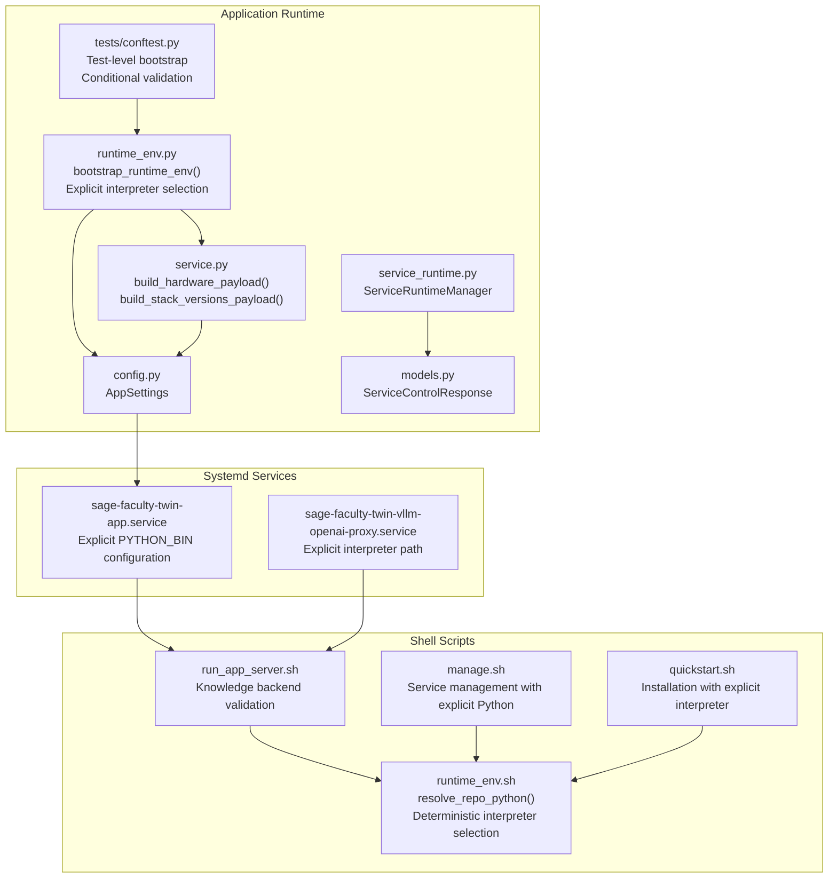
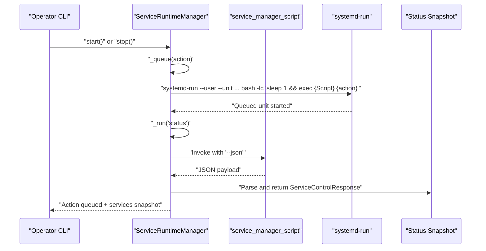
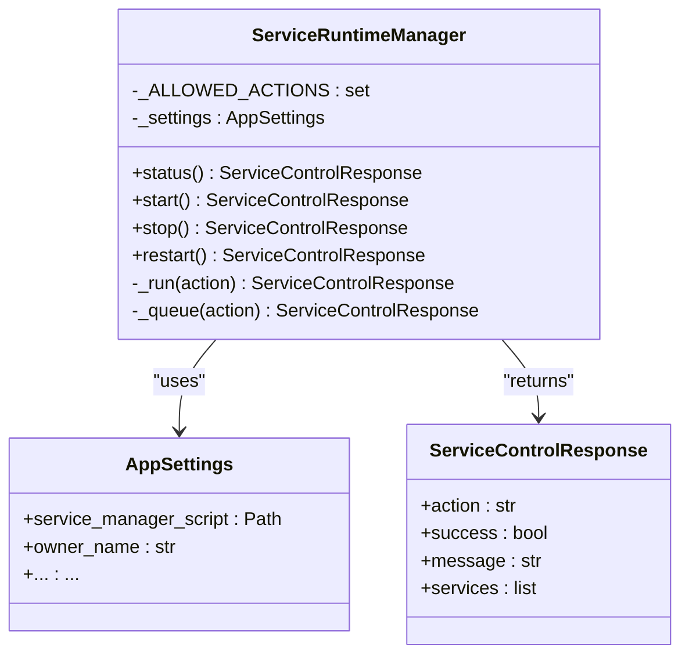
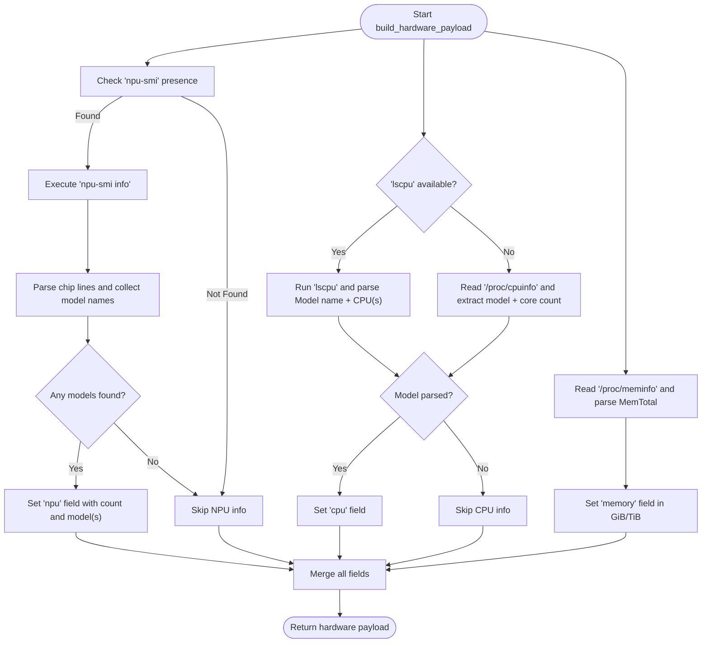
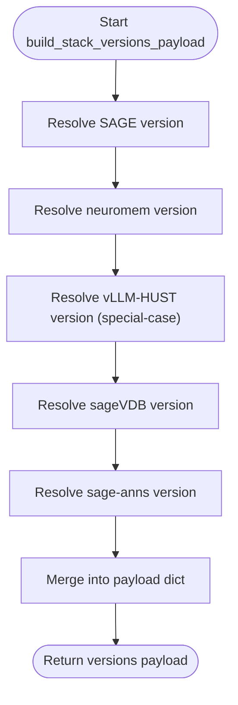
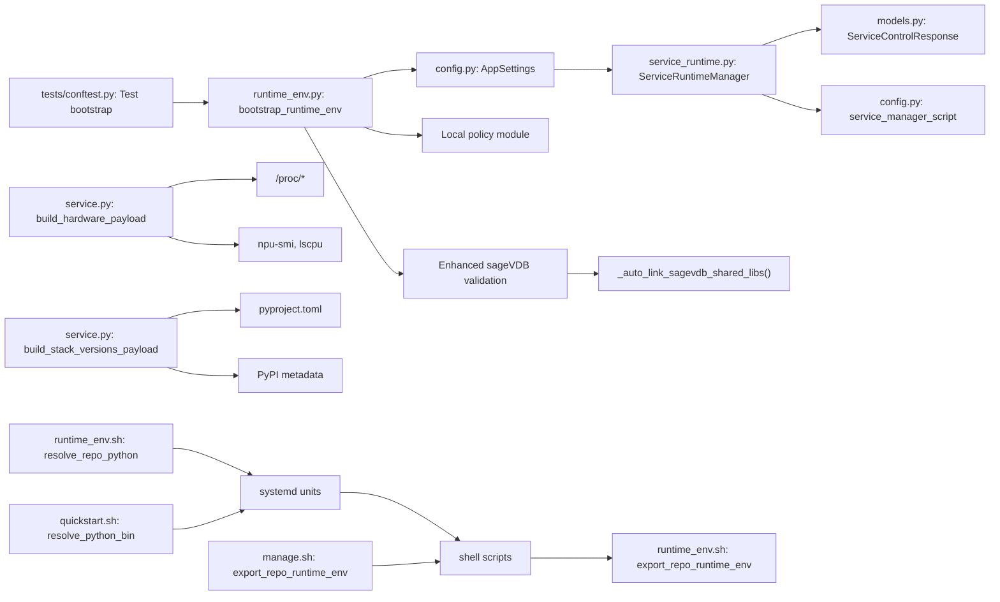

# Runtime Environment

<cite>
**Referenced Files in This Document**
- [runtime_env.py](file://src/sage_faculty_twin/runtime_env.py)
- [service_runtime.py](file://src/sage_faculty_twin/service_runtime.py)
- [service.py](file://src/sage_faculty_twin/service.py)
- [config.py](file://src/sage_faculty_twin/config.py)
- [models.py](file://src/sage_faculty_twin/models.py)
- [conftest.py](file://tests/conftest.py)
- [sage-faculty-twin-app.service](file://deploy/systemd/user/sage-faculty-twin-app.service)
- [sage-faculty-twin-vllm-openai-proxy.service](file://deploy/systemd/user/sage-faculty-twin-vllm-openai-proxy.service)
- [run_app_server.sh](file://tools/run_app_server.sh)
- [runtime_env.sh](file://tools/lib/runtime_env.sh)
- [manage.sh](file://manage.sh)
- [quickstart.sh](file://quickstart.sh)
- [test_systemd_service_scripts.py](file://tests/test_systemd_service_scripts.py)
- [test_sagevdb_knowledge_store.py](file://tests/test_sagevdb_knowledge_store.py)
</cite>

## Update Summary
**Changes Made**
- Removed all virtual environment support and marker file detection mechanisms
- Python binary resolution now prioritizes explicit environment variables over automatic detection
- Streamlined Docker-only deployment architecture with deterministic interpreter selection
- Enhanced runtime environment validation with fail-fast error handling
- Simplified service orchestration through systemd units with explicit interpreter configuration

## Table of Contents
1. [Introduction](#introduction)
2. [Project Structure](#project-structure)
3. [Core Components](#core-components)
4. [Architecture Overview](#architecture-overview)
5. [Detailed Component Analysis](#detailed-component-analysis)
6. [Dependency Analysis](#dependency-analysis)
7. [Performance Considerations](#performance-considerations)
8. [Troubleshooting Guide](#troubleshooting-guide)
9. [Conclusion](#conclusion)
10. [Appendices](#appendices)

## Introduction
This document describes the runtime environment management system for the Sage Faculty Twin project. The system has been streamlined to support Docker-only deployment architectures with explicit Python interpreter resolution and comprehensive environment validation. The runtime environment now employs a fail-fast strategy to prevent silent failures and provides detailed error reporting for critical dependency issues.

**Updated** Complete removal of virtual environment support and marker file detection mechanisms. Python binary resolution now prioritizes explicit environment variables over automatic detection, streamlining deployment for Docker-only architectures.

## Project Structure
The runtime environment spans several layers designed for Docker-native deployment:
- Application runtime bootstrap with explicit interpreter selection and fail-fast validation
- Comprehensive environment detection with deterministic Python path resolution
- Version resolution for stack components with fallback mechanisms
- Service orchestration via systemd units with explicit interpreter configuration
- Operational diagnostics and tests with enhanced error reporting
- Sophisticated test-level runtime bootstrap through conftest.py with conditional validation

**Diagram sources**
- [runtime_env.py:152-186](file://src/sage_faculty_twin/runtime_env.py#L152-L186)
- [service_runtime.py:13-69](file://src/sage_faculty_twin/service_runtime.py#L13-L69)
- [service.py:250-266](file://src/sage_faculty_twin/service.py#L250-L266)
- [service.py:269-346](file://src/sage_faculty_twin/service.py#L269-L346)
- [config.py:9-132](file://src/sage_faculty_twin/config.py#L9-L132)
- [models.py:1-200](file://src/sage_faculty_twin/models.py#L1-L200)
- [conftest.py:1-68](file://tests/conftest.py#L1-L68)
- [runtime_env.sh:8-27](file://tools/lib/runtime_env.sh#L8-L27)
- [runtime_env.sh:52-74](file://tools/lib/runtime_env.sh#L52-L74)
- [sage-faculty-twin-app.service:11](file://deploy/systemd/user/sage-faculty-twin-app.service#L11)
- [sage-faculty-twin-vllm-openai-proxy.service:9](file://deploy/systemd/user/sage-faculty-twin-vllm-openai-proxy.service#L9)
- [run_app_server.sh:10-11](file://tools/run_app_server.sh#L10-L11)
- [manage.sh:43](file://manage.sh#L43)
- [quickstart.sh:17](file://quickstart.sh#L17)

**Section sources**
- [runtime_env.py:152-186](file://src/sage_faculty_twin/runtime_env.py#L152-L186)
- [service_runtime.py:13-69](file://src/sage_faculty_twin/service_runtime.py#L13-L69)
- [service.py:250-346](file://src/sage_faculty_twin/service.py#L250-L346)
- [config.py:9-132](file://src/sage_faculty_twin/config.py#L9-L132)
- [models.py:1-200](file://src/sage_faculty_twin/models.py#L1-L200)
- [conftest.py:1-68](file://tests/conftest.py#L1-L68)
- [runtime_env.sh:8-27](file://tools/lib/runtime_env.sh#L8-L27)
- [runtime_env.sh:52-74](file://tools/lib/runtime_env.sh#L52-L74)
- [sage-faculty-twin-app.service:11](file://deploy/systemd/user/sage-faculty-twin-app.service#L11)
- [sage-faculty-twin-vllm-openai-proxy.service:9](file://deploy/systemd/user/sage-faculty-twin-vllm-openai-proxy.service#L9)
- [run_app_server.sh:10-11](file://tools/run_app_server.sh#L10-L11)
- [manage.sh:43](file://manage.sh#L43)
- [quickstart.sh:17](file://quickstart.sh#L17)

## Core Components
- ServiceRuntimeManager: Orchestrates service actions (status, start, stop, restart) by invoking a service manager script and parsing JSON responses into typed models.
- Runtime environment bootstrap: Prepares Python path, enforces explicit interpreter selection, validates external dependencies, and sets environment variables for device backends with fail-fast error handling.
- **Enhanced Python interpreter resolution**: Explicit environment variable priority over automatic detection, eliminating virtual environment complexity for Docker-only deployments.
- Hardware detection: Gathers NPU, CPU, and memory details from system tools and procfs with comprehensive error handling.
- Stack version resolution: Resolves versions for SAGE, neuromem, vLLM-HUST, sageVDB, and sage-anns from local pyproject.toml or PyPI metadata.
- Systemd integration: Units define service lifecycles with explicit PYTHON_BIN configuration and shell scripts with enhanced error reporting.
- **Enhanced Test Collection Handling**: Sophisticated test-level runtime bootstrap through conftest.py that ensures PYTHONPATH includes local source checkouts before test modules are collected with conditional validation.

**Updated** Complete removal of virtual environment support and marker file detection. Python binary resolution now prioritizes explicit environment variables over automatic detection, streamlining Docker-only deployment architecture. Enhanced runtime environment validation prevents silent failures through explicit error reporting.

**Section sources**
- [service_runtime.py:13-69](file://src/sage_faculty_twin/service_runtime.py#L13-L69)
- [runtime_env.py:152-186](file://src/sage_faculty_twin/runtime_env.py#L152-L186)
- [runtime_env.sh:8-27](file://tools/lib/runtime_env.sh#L8-L27)
- [service.py:250-346](file://src/sage_faculty_twin/service.py#L250-L346)
- [config.py:9-132](file://src/sage_faculty_twin/config.py#L9-L132)
- [models.py:1-200](file://src/sage_faculty_twin/models.py#L1-L200)
- [conftest.py:1-68](file://tests/conftest.py#L1-L68)

## Architecture Overview
The runtime environment integrates application logic, system services, shell scripts, and enhanced test collection handling to deliver a robust Docker-native deployment framework with explicit interpreter selection and comprehensive error reporting.

**Diagram sources**
- [service_runtime.py:31-69](file://src/sage_faculty_twin/service_runtime.py#L31-L69)

**Section sources**
- [service_runtime.py:13-69](file://src/sage_faculty_twin/service_runtime.py#L13-L69)

## Detailed Component Analysis

### ServiceRuntimeManager
Responsibilities:
- Validates allowed actions and raises errors for unsupported operations.
- Executes synchronous status queries against the service manager script and parses JSON into typed models.
- Queues asynchronous actions via systemd-run with a randomized unit name and captures a post-queue status snapshot.

Key behaviors:
- Action validation prevents misuse.
- Queueing ensures non-blocking start/stop/restart operations.
- Status snapshots provide immediate feedback after queuing.

**Diagram sources**
- [service_runtime.py:13-69](file://src/sage_faculty_twin/service_runtime.py#L13-L69)
- [config.py:9-132](file://src/sage_faculty_twin/config.py#L9-L132)
- [models.py:1-200](file://src/sage_faculty_twin/models.py#L1-L200)

**Section sources**
- [service_runtime.py:13-69](file://src/sage_faculty_twin/service_runtime.py#L13-L69)
- [config.py:9-132](file://src/sage_faculty_twin/config.py#L9-L132)
- [models.py:1-200](file://src/sage_faculty_twin/models.py#L1-L200)

### Runtime Environment Bootstrap
Responsibilities:
- Determine repository root and candidate Python path entries.
- Prepend local repositories to sys.path to prefer local development.
- **Enhanced Python interpreter resolution**: Explicit environment variable priority over automatic detection eliminates virtual environment complexity.
- Enforce local policy module origin to prevent unintended overrides with clear error messaging.
- Require modules such as pydantic_settings and optionally FastAPI and policy with fail-fast error handling.

**Updated** Complete removal of virtual environment support and marker file detection. Python binary resolution now prioritizes explicit environment variables over automatic detection, streamlining Docker-only deployment architecture. Enhanced runtime environment validation prevents silent failures through explicit error reporting.

Operational notes:
- Sets TORCH_DEVICE_BACKEND_AUTOLOAD to 0 to avoid automatic loading of optional device backends.
- Provides explicit RuntimeError exceptions with actionable steps for dependency failures.
- Conditional policy enforcement reduces overhead when SAGE source is not present.
- **Explicit interpreter selection**: PYTHON_BIN environment variable takes priority over automatic detection.

**Section sources**
- [runtime_env.py:152-186](file://src/sage_faculty_twin/runtime_env.py#L152-L186)
- [runtime_env.sh:8-27](file://tools/lib/runtime_env.sh#L8-L27)

### Enhanced Python Interpreter Resolution
**New Section** The runtime environment now implements explicit Python interpreter resolution prioritizing environment variables over automatic detection mechanisms.

Key responsibilities:
- Resolve Python interpreter path with explicit environment variable priority.
- Eliminate virtual environment support and marker file detection complexity.
- Support Docker-only deployment architecture with deterministic interpreter selection.
- Provide clear error messages when interpreter cannot be located.

Explicit resolution mechanics:
- **Priority 1**: PYTHON_BIN environment variable if executable and exists.
- **Priority 2**: python3 command if available in PATH.
- **Priority 3**: python command if available in PATH.
- **Failure**: Return error with guidance to set PYTHON_BIN explicitly.

Docker deployment benefits:
- Consistent interpreter selection across container deployments.
- Elimination of virtual environment drift issues.
- Simplified CI/CD pipeline configuration.
- Deterministic behavior in containerized environments.

**Section sources**
- [runtime_env.sh:8-27](file://tools/lib/runtime_env.sh#L8-L27)
- [runtime_env.sh:52-74](file://tools/lib/runtime_env.sh#L52-L74)
- [quickstart.sh:17](file://quickstart.sh#L17)
- [quickstart.sh:173-180](file://quickstart.sh#L173-L180)

### Enhanced Test Collection Handling
**New Section** The tests/conftest.py file provides sophisticated test-level runtime bootstrap that ensures PYTHONPATH includes local source checkouts before test modules are collected.

Key responsibilities:
- Ensures the project src directory is importable before any test module is collected.
- Prepend sibling source checkouts (SAGE/src, sageVDB, neuromem) to sys.path.
- Delegates to the same bootstrap_runtime_env used at runtime with require_policy=False.
- Prevents import failures when SAGE source dependencies are unavailable during test collection.

Behavioral improvements:
- Lightweight implementation that delegates to runtime bootstrap logic.
- Prevents test collection failures by ensuring local source checkouts are available.
- Allows tests to import modules like sage_faculty_twin.llm_client without triggering full policy validation during collection.
- **Conditional validation**: Only performs full policy validation when SAGE source is present.

**Section sources**
- [conftest.py:1-68](file://tests/conftest.py#L1-L68)

### Hardware Detection and Reporting
Capabilities:
- NPU detection via npu-smi: Parses device info to report counts and model names.
- CPU detection via lscpu or /proc/cpuinfo: Extracts model name and core count.
- Memory detection via /proc/meminfo: Reports total memory in GiB or TiB.

**Diagram sources**
- [service.py:269-346](file://src/sage_faculty_twin/service.py#L269-L346)

**Section sources**
- [service.py:269-346](file://src/sage_faculty_twin/service.py#L269-L346)

### Version Resolution System
Purpose:
- Provide accurate stack component versions for diagnostics and support.

Mechanics:
- Resolve versions from local pyproject.toml when available; otherwise fall back to PyPI metadata.
- Special-case vLLM-HUST to use setuptools-scm-derived version strings.
- Build a consolidated payload for telemetry and diagnostics.

**Diagram sources**
- [service.py:250-266](file://src/sage_faculty_twin/service.py#L250-L266)
- [service.py:236-247](file://src/sage_faculty_twin/service.py#L236-L247)

**Section sources**
- [service.py:236-266](file://src/sage_faculty_twin/service.py#L236-L266)

### Systemd Services and Deployment
Service units define:
- Application server and OpenAI-compatible vLLM proxy with explicit interpreter configuration.
- ExecStart scripts that initialize runtime environment and start processes.
- Dependencies and restart policies for resilience.

Integration points:
- Units depend on network-online.target and each other to enforce startup order.
- Proxy service includes port conflict detection with explicit error messages.
- **Explicit interpreter configuration**: PYTHON_BIN environment variable embedded in service definitions.

**Section sources**
- [sage-faculty-twin-app.service:1-18](file://deploy/systemd/user/sage-faculty-twin-app.service#L1-L18)
- [sage-faculty-twin-vllm-openai-proxy.service:1-20](file://deploy/systemd/user/sage-faculty-twin-vllm-openai-proxy.service#L1-L20)

### Shell Scripts and Runtime Environment
- run_app_server.sh: Exports repository runtime environment, loads .env, validates and installs knowledge backend dependencies, then starts the Uvicorn server with enhanced error reporting.
- runtime_env.sh: Exports repository runtime environment variables (PYTHON_BIN, PYTHONPATH, TORCH_DEVICE_BACKEND_AUTOLOAD) and prints a runtime summary.
- **Enhanced interpreter resolution**: resolve_repo_python() function prioritizes explicit environment variables over automatic detection.

**Section sources**
- [run_app_server.sh:1-60](file://tools/run_app_server.sh#L1-L60)
- [runtime_env.sh:62-92](file://tools/lib/runtime_env.sh#L62-L92)

## Dependency Analysis
High-level dependencies:
- ServiceRuntimeManager depends on AppSettings for the service manager script path and returns ServiceControlResponse models.
- Runtime bootstrap depends on repository layout and sibling repositories for policy and data with fail-fast error handling.
- **Enhanced Python interpreter resolution**: Runtime environment validation now prioritizes explicit environment variables over automatic detection.
- Hardware and version resolution functions depend on system tools and filesystem metadata.
- Systemd units depend on shell scripts and environment variables exported by runtime_env.sh.
- **Enhanced Test Collection**: conftest.py depends on runtime_env.py for test-level bootstrap and ensures PYTHONPATH is properly configured before test collection.

**Diagram sources**
- [service_runtime.py:13-69](file://src/sage_faculty_twin/service_runtime.py#L13-L69)
- [config.py:9-132](file://src/sage_faculty_twin/config.py#L9-L132)
- [models.py:1-200](file://src/sage_faculty_twin/models.py#L1-L200)
- [runtime_env.py:152-186](file://src/sage_faculty_twin/runtime_env.py#L152-L186)
- [runtime_env.sh:8-27](file://tools/lib/runtime_env.sh#L8-L27)
- [runtime_env.sh:52-74](file://tools/lib/runtime_env.sh#L52-L74)
- [conftest.py:1-68](file://tests/conftest.py#L1-L68)
- [service.py:250-346](file://src/sage_faculty_twin/service.py#L250-L346)
- [sage-faculty-twin-app.service:1-18](file://deploy/systemd/user/sage-faculty-twin-app.service#L1-L18)
- [run_app_server.sh:1-60](file://tools/run_app_server.sh#L1-L60)
- [runtime_env.sh:62-92](file://tools/lib/runtime_env.sh#L62-L92)
- [quickstart.sh:173-180](file://quickstart.sh#L173-L180)
- [manage.sh:43](file://manage.sh#L43)

**Section sources**
- [service_runtime.py:13-69](file://src/sage_faculty_twin/service_runtime.py#L13-L69)
- [config.py:9-132](file://src/sage_faculty_twin/config.py#L9-L132)
- [models.py:1-200](file://src/sage_faculty_twin/models.py#L1-L200)
- [runtime_env.py:152-186](file://src/sage_faculty_twin/runtime_env.py#L152-L186)
- [runtime_env.sh:8-27](file://tools/lib/runtime_env.sh#L8-L27)
- [runtime_env.sh:52-74](file://tools/lib/runtime_env.sh#L52-L74)
- [conftest.py:1-68](file://tests/conftest.py#L1-L68)
- [service.py:250-346](file://src/sage_faculty_twin/service.py#L250-L346)
- [sage-faculty-twin-app.service:1-18](file://deploy/systemd/user/sage-faculty-twin-app.service#L1-L18)
- [run_app_server.sh:1-60](file://tools/run_app_server.sh#L1-L60)
- [runtime_env.sh:62-92](file://tools/lib/runtime_env.sh#L62-L92)
- [quickstart.sh:173-180](file://quickstart.sh#L173-L180)
- [manage.sh:43](file://manage.sh#L43)

## Performance Considerations
- Hardware detection is lightweight and guarded by timeouts and safe parsing to avoid blocking.
- Version resolution prefers local pyproject.toml for deterministic builds; falls back to PyPI metadata for installed packages.
- Runtime environment exports minimize unnecessary environment variable churn and avoids auto-loading of optional device backends.
- Service queueing via systemd-run enables non-blocking control operations, improving responsiveness during maintenance windows.
- **Enhanced Test Collection**: The conftest.py approach prevents test collection failures and reduces import overhead by ensuring local source checkouts are available before test modules are processed.
- **Enhanced Python interpreter resolution**: Deterministic interpreter selection eliminates virtual environment overhead and provides consistent performance across deployments.
- **Fail-fast strategy**: Prevents wasted resources on broken configurations by immediately raising explicit errors instead of attempting graceful degradation.

**Updated** Enhanced test collection handling reduces overhead by ensuring local source checkouts are available before test collection, preventing import failures and reducing test startup time. Enhanced Python interpreter resolution eliminates virtual environment complexity and provides consistent performance. The fail-fast strategy prevents wasted resources on broken configurations while providing clear guidance for manual intervention.

## Troubleshooting Guide
Common scenarios and diagnostics:
- Missing runtime dependencies: The bootstrap routine raises explicit RuntimeError when required modules are absent, guiding installation via editable installs.
- Non-local policy import: The bootstrap routine verifies that the policy module originates from the expected local checkout to prevent accidental overrides, raising clear RuntimeError with actionable steps.
- **Enhanced Python interpreter issues**: The resolve_repo_python() function prioritizes explicit environment variables over automatic detection. If interpreter cannot be located, set PYTHON_BIN explicitly or ensure python3 is available in PATH.
- Port conflicts for proxies: The vLLM proxy script validates bind availability and exits with a clear message when the port is already in use.
- systemd service installation flags: Tests demonstrate that optional services are only enabled when explicitly requested.
- **Enhanced Test Collection Issues**: The conftest.py ensures PYTHONPATH includes local source checkouts before test modules are collected, preventing import failures when SAGE source dependencies are unavailable.

**Updated** Enhanced error messages now provide clearer guidance for policy module validation failures and conditional validation behavior. Test collection issues are prevented by the sophisticated conftest.py bootstrap. Enhanced Python interpreter resolution eliminates virtual environment complexity and provides explicit guidance for interpreter configuration.

Operational tips:
- Use ServiceRuntimeManager to queue actions and immediately fetch a status snapshot for confirmation.
- Review systemd journal logs for units to diagnose startup failures.
- Verify environment variables exported by runtime_env.sh and ensure PYTHON_BIN points to a working interpreter.
- **Test Collection**: Ensure conftest.py is properly configured to handle test-level runtime bootstrap and PYTHONPATH management.
- **Python Interpreter**: Set PYTHON_BIN environment variable explicitly for deterministic interpreter selection in containerized deployments.

**Section sources**
- [runtime_env.py:152-186](file://src/sage_faculty_twin/runtime_env.py#L152-L186)
- [runtime_env.sh:8-27](file://tools/lib/runtime_env.sh#L8-L27)
- [conftest.py:1-68](file://tests/conftest.py#L1-L68)
- [test_systemd_service_scripts.py:162-192](file://tests/test_systemd_service_scripts.py#L162-L192)

## Conclusion
The runtime environment management system provides a cohesive foundation for deploying, diagnosing, and operating the Sage Faculty Twin application in Docker-native environments. It centralizes environment bootstrapping, hardware and version introspection, and service control, while integrating seamlessly with systemd and shell-based deployment scripts. The recent enhancements strengthen the system with explicit interpreter selection, fail-fast error handling, and comprehensive validation for critical dependency issues.

**Updated** Recent enhancements eliminate virtual environment support and streamline deployment for Docker-only architectures. Enhanced Python interpreter resolution provides deterministic behavior across all deployment environments. The sophisticated test-level runtime bootstrap through conftest.py ensures reliable test collection even when SAGE source dependencies are unavailable.

## Appendices

### Appendix A: Example Workflows

#### Diagnose Hardware and Stack Versions
- Invoke hardware payload collection to obtain NPU/CPU/memory details.
- Invoke stack versions payload to retrieve component versions for telemetry.

**Section sources**
- [service.py:269-346](file://src/sage_faculty_twin/service.py#L269-L346)
- [service.py:250-266](file://src/sage_faculty_twin/service.py#L250-L266)

#### Environment Validation Checklist
- Confirm local policy module is loaded from the expected path.
- **Enhanced Python interpreter validation**: Ensure PYTHON_BIN environment variable is set or interpreter is available in PATH.
- Verify required modules are installed per bootstrap diagnostics.
- Check that policy validation only occurs when SAGE source is present.
- **Test Collection**: Verify that conftest.py properly configures PYTHONPATH for test modules before collection.

**Updated** Added conditional policy validation check for SAGE source directory presence and test collection validation. Enhanced Python interpreter validation ensures deterministic behavior through explicit environment variable configuration.

**Section sources**
- [runtime_env.py:152-186](file://src/sage_faculty_twin/runtime_env.py#L152-L186)
- [runtime_env.sh:8-27](file://tools/lib/runtime_env.sh#L8-L27)
- [conftest.py:1-68](file://tests/conftest.py#L1-L68)

#### Containerization Considerations
- Export runtime environment variables using the provided helper to ensure consistent interpreter and path resolution.
- Mount writable caches for model downloads and runtime artifacts.
- Configure systemd user services inside containers using appropriate init systems or alternatives.
- **Test Collection**: Ensure containerized environments include proper PYTHONPATH configuration for test modules.
- **Python Interpreter**: Set PYTHON_BIN environment variable explicitly for deterministic interpreter selection in containerized deployments.

**Section sources**
- [runtime_env.sh:62-92](file://tools/lib/runtime_env.sh#L62-L92)
- [run_app_server.sh:13-31](file://tools/run_app_server.sh#L13-L31)
- [conftest.py:1-68](file://tests/conftest.py#L1-L68)

### Appendix B: Enhanced Python Interpreter Resolution

**New Section** The runtime environment now implements explicit Python interpreter resolution prioritizing environment variables over automatic detection mechanisms.

Key improvements:
- **Explicit environment variable priority**: PYTHON_BIN environment variable takes precedence over automatic detection.
- **Elimination of virtual environment complexity**: No more marker file detection or virtual environment support.
- **Docker-native deployment**: Consistent interpreter selection across container deployments.
- **Clear error reporting**: Explicit guidance when interpreter cannot be located.

Resolution algorithm:
- **Priority 1**: PYTHON_BIN environment variable if executable and exists.
- **Priority 2**: python3 command if available in PATH.
- **Priority 3**: python command if available in PATH.
- **Failure**: Return error with guidance to set PYTHON_BIN explicitly.

Benefits for Docker deployments:
- Deterministic interpreter selection in containerized environments.
- Elimination of virtual environment drift issues.
- Simplified CI/CD pipeline configuration.
- Consistent behavior across development and production environments.

**Section sources**
- [runtime_env.sh:8-27](file://tools/lib/runtime_env.sh#L8-L27)
- [runtime_env.sh:52-74](file://tools/lib/runtime_env.sh#L52-L74)
- [quickstart.sh:17](file://quickstart.sh#L17)
- [quickstart.sh:173-180](file://quickstart.sh#L173-L180)

### Appendix C: Enhanced Test Collection Handling

**New Section** The conftest.py file provides sophisticated test-level runtime bootstrap that ensures PYTHONPATH includes local source checkouts before test modules are collected.

Key benefits:
- Prevents import failures when SAGE source dependencies are unavailable during test collection.
- Ensures local source checkouts are available for modules like sage_faculty_twin.llm_client.
- Reduces test startup time by delegating to the same bootstrap logic used at runtime.
- Provides graceful handling of missing dependencies during test collection phase.
- **Conditional validation**: Only performs full policy validation when SAGE source is present.

Implementation details:
- Prepend project src directory to sys.path before any test module is collected.
- Add sibling source checkouts (SAGE/src, sageVDB, neuromem) to sys.path if they exist.
- Call bootstrap_runtime_env(require_policy=False, require_fastapi=False) to avoid full policy validation during collection.
- Allows subsequent test execution to trigger full validation when SAGE source is available.

**Section sources**
- [conftest.py:1-68](file://tests/conftest.py#L1-L68)