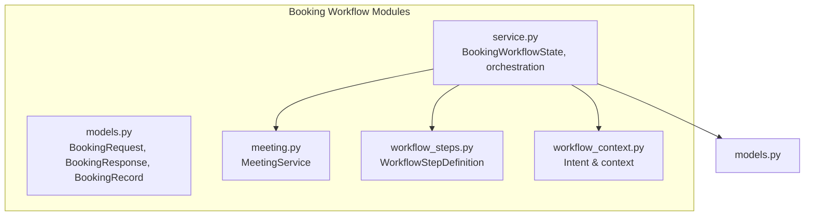
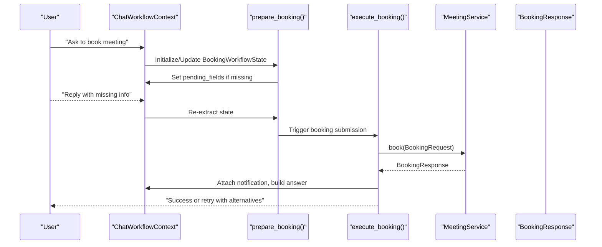
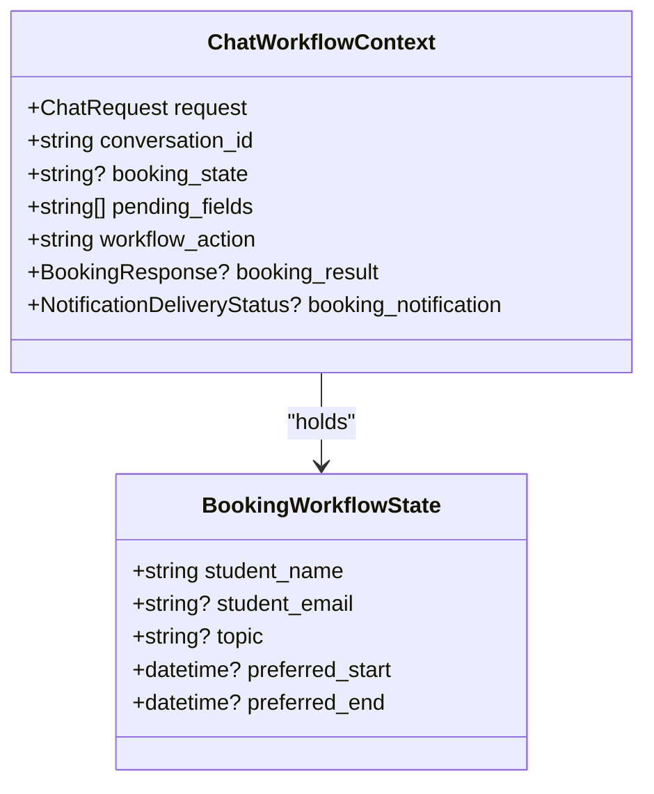
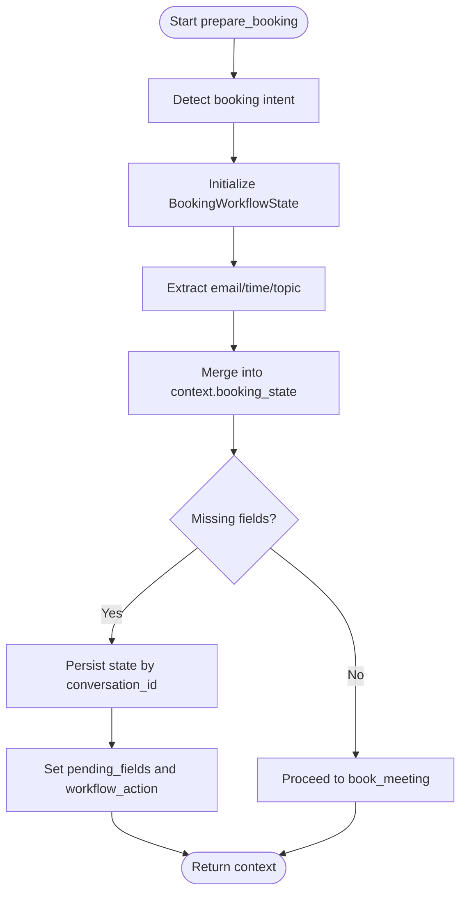
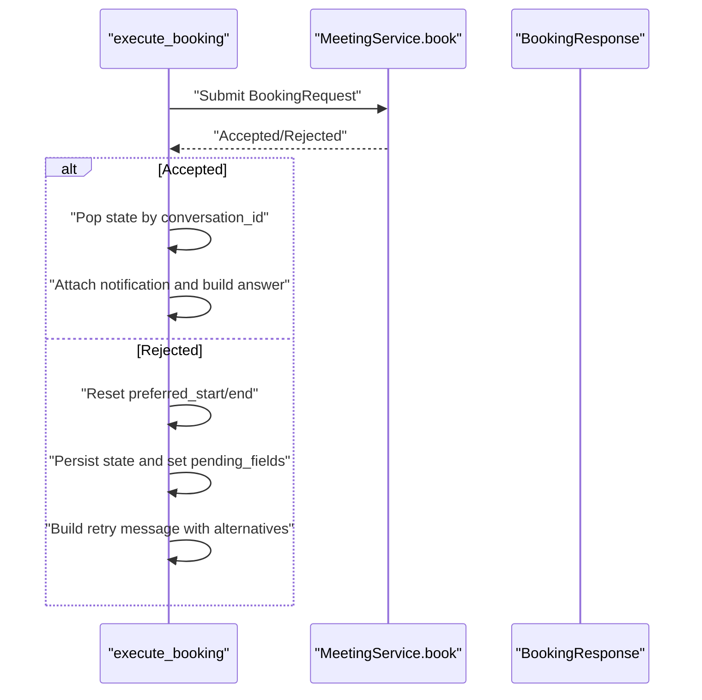
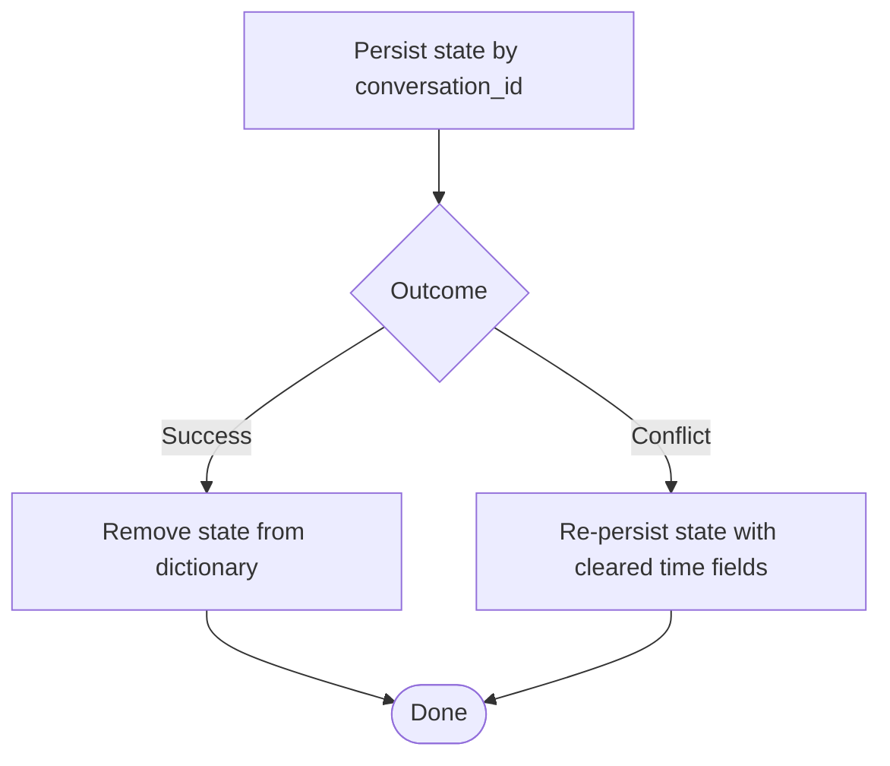
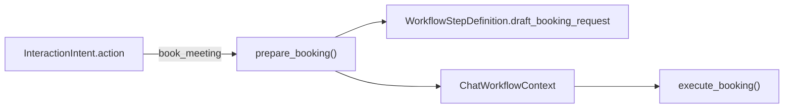
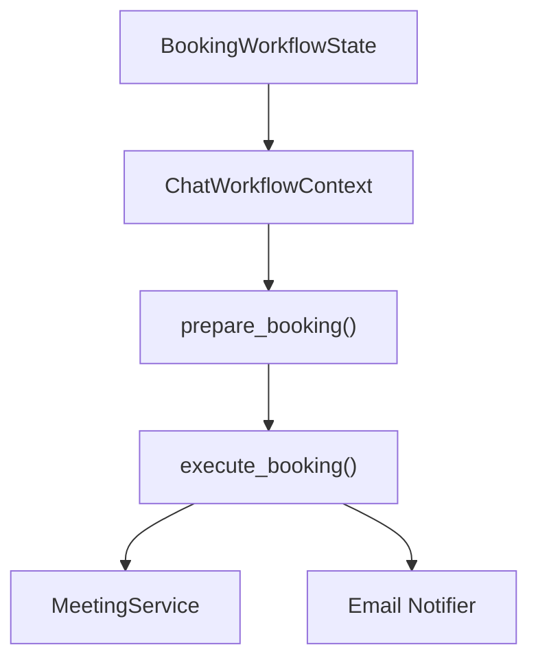

# Booking Workflow State

<cite>
**Referenced Files in This Document**
- [service.py](file://src/sage_faculty_twin/service.py)
- [models.py](file://src/sage_faculty_twin/models.py)
- [meeting.py](file://src/sage_faculty_twin/meeting.py)
- [workflow_steps.py](file://src/sage_faculty_twin/workflow_steps.py)
- [workflow_context.py](file://src/sage_faculty_twin/workflow_context.py)
</cite>

## Table of Contents
1. [Introduction](#introduction)
2. [Project Structure](#project-structure)
3. [Core Components](#core-components)
4. [Architecture Overview](#architecture-overview)
5. [Detailed Component Analysis](#detailed-component-analysis)
6. [Dependency Analysis](#dependency-analysis)
7. [Performance Considerations](#performance-considerations)
8. [Troubleshooting Guide](#troubleshooting-guide)
9. [Conclusion](#conclusion)

## Introduction
This document explains the BookingWorkflowState dataclass and its central role in managing booking-related workflow data. It covers how booking state is created, updated, and managed across the preparation, execution, and completion phases of a booking request. It also documents state persistence, cleanup, error handling, and integration with the broader workflow orchestration system.

## Project Structure
The booking workflow spans several modules:
- State definition and orchestration: service.py
- Data models and response structures: models.py
- Meeting scheduling and availability: meeting.py
- Workflow step registry and booking-related steps: workflow_steps.py
- Request context and intent classification: workflow_context.py

**Diagram sources**
- [service.py:496-547](file://src/sage_faculty_twin/service.py#L496-L547)
- [models.py:257-282](file://src/sage_faculty_twin/models.py#L257-L282)
- [meeting.py:11-180](file://src/sage_faculty_twin/meeting.py#L11-L180)
- [workflow_steps.py:139-146](file://src/sage_faculty_twin/workflow_steps.py#L139-L146)
- [workflow_context.py:12-112](file://src/sage_faculty_twin/workflow_context.py#L12-L112)

**Section sources**
- [service.py:496-547](file://src/sage_faculty_twin/service.py#L496-L547)
- [models.py:257-282](file://src/sage_faculty_twin/models.py#L257-L282)
- [meeting.py:11-180](file://src/sage_faculty_twin/meeting.py#L11-L180)
- [workflow_steps.py:139-146](file://src/sage_faculty_twin/workflow_steps.py#L139-L146)
- [workflow_context.py:12-112](file://src/sage_faculty_twin/workflow_context.py#L12-L112)

## Core Components
- BookingWorkflowState: Holds the minimal, transient booking state for a conversation until submission.
- ChatWorkflowContext: Carries the booking state along with orchestration metadata and results.
- BookingRequest/BookingResponse/BookingRecord: Persistent data models for booking creation, responses, and storage.
- MeetingService: Validates and persists bookings against availability and policies.

Key responsibilities:
- Prepare booking state from incoming requests and extract missing fields.
- Persist state per conversation while collecting missing details.
- Execute booking submission and handle acceptance/rejection outcomes.
- Attach notification delivery status and produce user-facing messages.

**Section sources**
- [service.py:496-547](file://src/sage_faculty_twin/service.py#L496-L547)
- [service.py:780-845](file://src/sage_faculty_twin/service.py#L780-L845)
- [service.py:847-906](file://src/sage_faculty_twin/service.py#L847-L906)
- [models.py:257-282](file://src/sage_faculty_twin/models.py#L257-L282)
- [meeting.py:17-67](file://src/sage_faculty_twin/meeting.py#L17-L67)

## Architecture Overview
The booking workflow integrates intent detection, state extraction, orchestration, and external services.

**Diagram sources**
- [service.py:780-845](file://src/sage_faculty_twin/service.py#L780-L845)
- [service.py:847-906](file://src/sage_faculty_twin/service.py#L847-L906)
- [meeting.py:17-67](file://src/sage_faculty_twin/meeting.py#L17-L67)
- [models.py:257-282](file://src/sage_faculty_twin/models.py#L257-L282)

## Detailed Component Analysis

### BookingWorkflowState
- Purpose: Transient state container for a single conversation’s booking intent.
- Fields:
  - student_name: Required identifier for the requester.
  - student_email: Optional; collected if present in initial request or question.
  - topic: Optional; derived from question or course context.
  - preferred_start/preferred_end: Optional datetime pair; extracted from natural language time expressions.

Lifecycle:
- Created on first booking intent detection for a conversation.
- Updated incrementally as information is extracted from the request and replies.
- Removed upon successful booking submission.

**Diagram sources**
- [service.py:496-503](file://src/sage_faculty_twin/service.py#L496-L503)
- [service.py:506-547](file://src/sage_faculty_twin/service.py#L506-L547)

**Section sources**
- [service.py:496-503](file://src/sage_faculty_twin/service.py#L496-L503)
- [service.py:506-547](file://src/sage_faculty_twin/service.py#L506-L547)

### State Creation and Updates
- On booking intent detection, a new state is created with student_name and optional student_email.
- Information extraction routines update student_email, preferred_start/end, and topic.
- Missing fields are computed and stored in context.pending_fields; the workflow switches to “collect_booking_details”.

**Diagram sources**
- [service.py:780-845](file://src/sage_faculty_twin/service.py#L780-L845)

**Section sources**
- [service.py:780-845](file://src/sage_faculty_twin/service.py#L780-L845)

### Execution and Completion
- When ready, execute_booking constructs a BookingRequest from the state and calls MeetingService.book.
- Acceptance clears the persisted state and builds a success message with optional notification status.
- Rejection resets preferred_start/end, persists state, and prompts the user to select alternative slots.

**Diagram sources**
- [service.py:847-906](file://src/sage_faculty_twin/service.py#L847-L906)
- [meeting.py:17-67](file://src/sage_faculty_twin/meeting.py#L17-L67)

**Section sources**
- [service.py:847-906](file://src/sage_faculty_twin/service.py#L847-L906)
- [meeting.py:17-67](file://src/sage_faculty_twin/meeting.py#L17-L67)

### Persistence and Cleanup
- Persistence: The orchestrator maintains a dictionary keyed by conversation_id storing BookingWorkflowState until completion.
- Cleanup: On successful booking, the state is removed from the dictionary. On rejection with missing time, the state is re-persisted with cleared time fields.

**Diagram sources**
- [service.py:821](file://src/sage_faculty_twin/service.py#L821)
- [service.py:892](file://src/sage_faculty_twin/service.py#L892)
- [service.py:875](file://src/sage_faculty_twin/service.py#L875)

**Section sources**
- [service.py:821](file://src/sage_faculty_twin/service.py#L821)
- [service.py:892](file://src/sage_faculty_twin/service.py#L892)
- [service.py:875](file://src/sage_faculty_twin/service.py#L875)

### Integration with Workflow Orchestration
- Intent detection: BookingWorkflowState is only created when intent.action indicates booking.
- Step registry: A dedicated step exists to draft booking requests for owner/admin review.
- Context propagation: The state is carried in ChatWorkflowContext and influences routing and user-facing messages.

**Diagram sources**
- [workflow_context.py:47-62](file://src/sage_faculty_twin/workflow_context.py#L47-L62)
- [workflow_steps.py:139-146](file://src/sage_faculty_twin/workflow_steps.py#L139-L146)
- [service.py:780-845](file://src/sage_faculty_twin/service.py#L780-L845)
- [service.py:847-906](file://src/sage_faculty_twin/service.py#L847-L906)

**Section sources**
- [workflow_context.py:47-62](file://src/sage_faculty_twin/workflow_context.py#L47-L62)
- [workflow_steps.py:139-146](file://src/sage_faculty_twin/workflow_steps.py#L139-L146)
- [service.py:780-845](file://src/sage_faculty_twin/service.py#L780-L845)
- [service.py:847-906](file://src/sage_faculty_twin/service.py#L847-L906)

## Dependency Analysis
- BookingWorkflowState depends on:
  - ChatWorkflowContext for lifecycle management.
  - Extraction helpers for incremental updates.
  - MeetingService for submission and validation.
  - Notification subsystem for outcome delivery status.

**Diagram sources**
- [service.py:496-547](file://src/sage_faculty_twin/service.py#L496-L547)
- [service.py:780-906](file://src/sage_faculty_twin/service.py#L780-L906)
- [meeting.py:17-67](file://src/sage_faculty_twin/meeting.py#L17-L67)

**Section sources**
- [service.py:496-547](file://src/sage_faculty_twin/service.py#L496-L547)
- [service.py:780-906](file://src/sage_faculty_twin/service.py#L780-L906)
- [meeting.py:17-67](file://src/sage_faculty_twin/meeting.py#L17-L67)

## Performance Considerations
- State updates are lightweight and in-memory; persistence is only needed for continuity across turns.
- Time extraction and topic extraction are O(n) over the question text; keep question length reasonable.
- MeetingService validation checks availability and conflicts; avoid repeated submissions for the same time window.

## Troubleshooting Guide
Common failure modes and recovery strategies:
- Validation failures (duration too short, outside booking hours, outside availability):
  - The system returns alternative slots and keeps the state with cleared preferred_start/end to guide the user.
- Conflicting bookings:
  - The system suggests alternative slots and re-persists state for further refinement.
- Email notification failures:
  - The booking is still recorded; the response includes a notification status indicating failure with guidance to retry later.

Operational tips:
- Ensure the meeting duration and booking hours settings align with the availability schedule.
- Monitor alternative slot suggestions to improve user experience.
- Verify email notifier configuration to prevent notification failures.

**Section sources**
- [meeting.py:17-67](file://src/sage_faculty_twin/meeting.py#L17-L67)
- [service.py:889-903](file://src/sage_faculty_twin/service.py#L889-L903)
- [service.py:908-936](file://src/sage_faculty_twin/service.py#L908-L936)

## Conclusion
BookingWorkflowState is a focused, transient data structure that enables incremental collection of booking details, safe persistence across conversation turns, and robust execution against the meeting service. Its integration with intent detection, step definitions, and notification systems ensures a smooth, recoverable booking experience with clear user guidance at each stage.