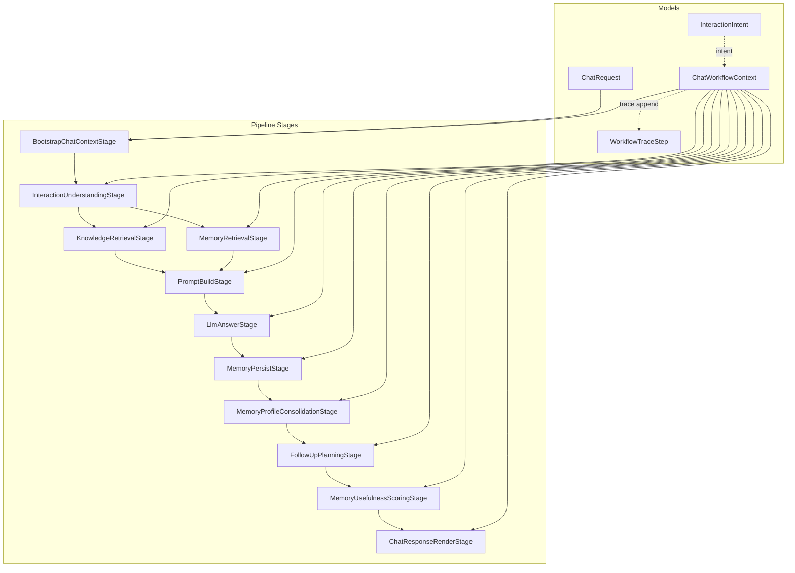
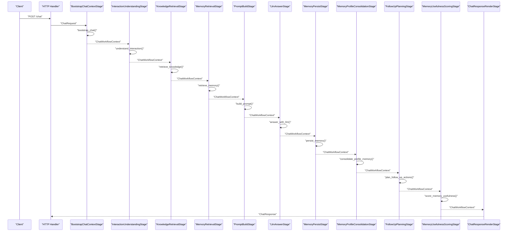
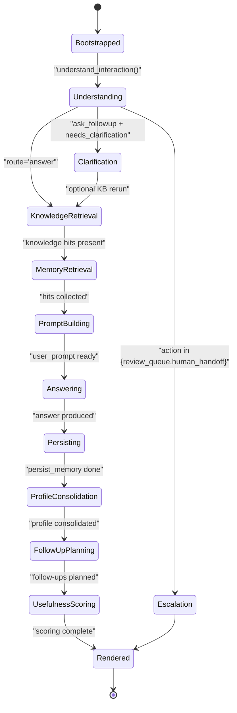
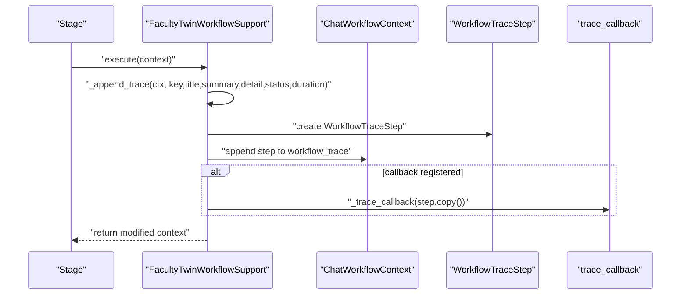
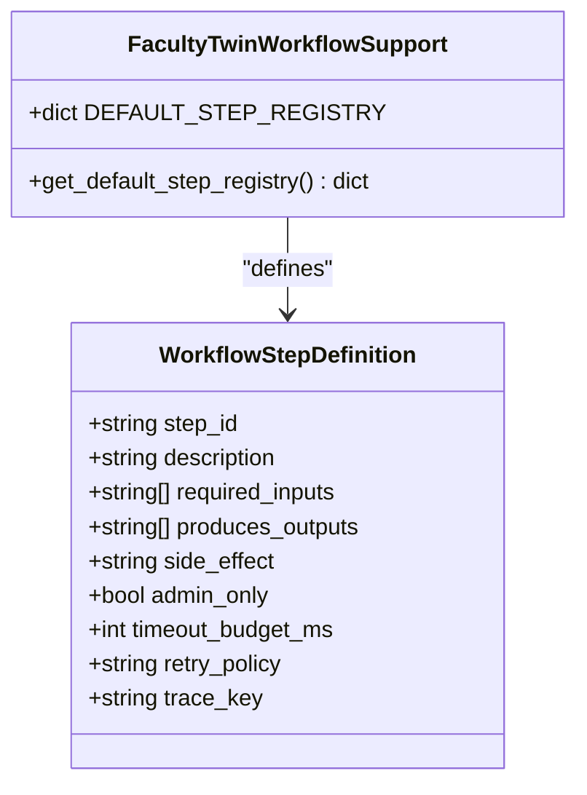
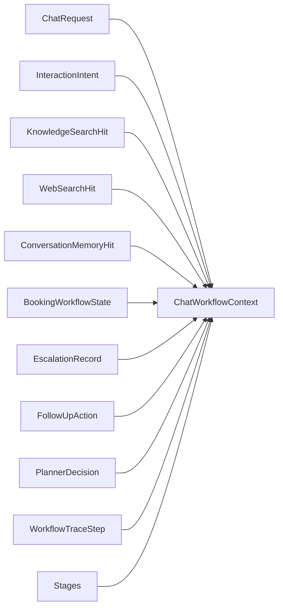

# Chat Workflow Context

<cite>
**Referenced Files in This Document**
- [service.py](file://src/sage_faculty_twin/service.py)
- [models.py](file://src/sage_faculty_twin/models.py)
- [workflow_context.py](file://src/sage_faculty_twin/workflow_context.py)
- [workflow_steps.py](file://src/sage_faculty_twin/workflow_steps.py)
- [api.py](file://src/sage_faculty_twin/api.py)
</cite>

## Table of Contents
1. [Introduction](#introduction)
2. [Project Structure](#project-structure)
3. [Core Components](#core-components)
4. [Architecture Overview](#architecture-overview)
5. [Detailed Component Analysis](#detailed-component-analysis)
6. [Dependency Analysis](#dependency-analysis)
7. [Performance Considerations](#performance-considerations)
8. [Troubleshooting Guide](#troubleshooting-guide)
9. [Conclusion](#conclusion)

## Introduction
This document explains the ChatWorkflowContext dataclass and its central role in managing chat session state across the workflow execution pipeline. It documents all context fields, their semantics, and how they evolve through each workflow stage. It also describes the relationship between context and trace logging, how workflow steps are recorded and tracked, and provides practical examples of context manipulation, state transitions, and debugging techniques for workflow execution tracking.

## Project Structure
The chat workflow is implemented as a staged pipeline orchestrated by a support class. The ChatWorkflowContext is the single mutable state container threaded through each stage. Supporting models define request payloads, intents, and trace/logging structures.

**Diagram sources**
- [service.py:4943-5057](file://src/sage_faculty_twin/service.py#L4943-L5057)
- [models.py:16-31](file://src/sage_faculty_twin/models.py#L16-L31)
- [models.py:47-63](file://src/sage_faculty_twin/models.py#L47-L63)
- [models.py:65-80](file://src/sage_faculty_twin/models.py#L65-L80)

**Section sources**
- [service.py:4943-5057](file://src/sage_faculty_twin/service.py#L4943-L5057)
- [models.py:16-31](file://src/sage_faculty_twin/models.py#L16-L31)

## Core Components
- ChatWorkflowContext: The central state container holding request data, conversation identifiers, model information, workflow routing/action/decision mode, prompts, retrieval results, booking/escalation state, follow-up actions, persistence records, planner metadata, and workflow trace entries.
- ChatRequest: The immutable request payload parsed from incoming requests, including question, course context, visitor profile, conversation identifier, attachments, and flags.
- InteractionIntent: Structured intent classification with action, domain, retrieval scopes, decision mode, and confidence.
- WorkflowTraceStep: Step-level trace entry for UI rendering and debugging.

Key context fields and roles:
- Identity and routing: conversation_id, owner_name, used_model, is_admin_request, admin_username, route, workflow_action, decision_mode
- Prompts and grounding: system_prompt, user_prompt, prompt_truncated, recent_session_context
- Retrieval results: knowledge_hits, web_search_hits, memory_hits
- Booking/escalation: booking_state, booking_result, booking_notification, escalation_record
- Follow-ups and persistence: follow_up_actions, persisted_memory_record, persisted_artifact_drafts
- Planner and tracing: planner_decision, shadow_planner_* fields, planner_comparison, workflow_trace

**Section sources**
- [service.py:505-546](file://src/sage_faculty_twin/service.py#L505-L546)
- [models.py:16-31](file://src/sage_faculty_twin/models.py#L16-L31)
- [models.py:47-63](file://src/sage_faculty_twin/models.py#L47-L63)
- [models.py:65-80](file://src/sage_faculty_twin/models.py#L65-L80)

## Architecture Overview
The workflow is a deterministic DAG with stages that mutate ChatWorkflowContext. Each stage appends a WorkflowTraceStep to the context’s trace list. The pipeline supports booking, escalation, knowledge/memory retrieval, prompt construction, LLM answering, memory persistence, follow-up planning, usefulness scoring, and response rendering.

**Diagram sources**
- [service.py:4943-5057](file://src/sage_faculty_twin/service.py#L4943-L5057)
- [service.py:635-775](file://src/sage_faculty_twin/service.py#L635-L775)
- [service.py:955-1121](file://src/sage_faculty_twin/service.py#L955-L1121)
- [service.py:1193-1289](file://src/sage_faculty_twin/service.py#L1193-L1289)
- [service.py:1354-1479](file://src/sage_faculty_twin/service.py#L1354-L1479)
- [service.py:1640-1738](file://src/sage_faculty_twin/service.py#L1640-L1738)
- [service.py:1481-1542](file://src/sage_faculty_twin/service.py#L1481-L1542)
- [service.py:1769-1825](file://src/sage_faculty_twin/service.py#L1769-L1825)
- [service.py:1827-1891](file://src/sage_faculty_twin/service.py#L1827-L1891)
- [service.py:1893-1950](file://src/sage_faculty_twin/service.py#L1893-L1950)

## Detailed Component Analysis

### ChatWorkflowContext: Lifecycle and State Management
- Initialization: The context is bootstrapped from a ChatRequest, with conversation_id generated if absent, owner_name and used_model set, and optional planner metadata injected. A bootstrap trace step is appended immediately.
- Evolution across stages:
  - Intent understanding updates route, workflow_action, decision_mode, and may set escalation or pending clarification.
  - Knowledge and memory retrieval populate knowledge_hits, web_search_hits, and memory_hits.
  - Prompt building sets system_prompt and user_prompt, tracks prompt_truncated, and may truncate memory/knowledge/attachments.
  - LLM answering sets answer and may trigger booking or escalation flows.
  - Persistence stages write memory and artifact drafts and update persisted records.
  - Follow-up planning computes suggested actions.
  - Usefulness scoring records signals for memory quality.
  - Rendering finalizes the response.

**Diagram sources**
- [service.py:635-775](file://src/sage_faculty_twin/service.py#L635-L775)
- [service.py:955-1121](file://src/sage_faculty_twin/service.py#L955-L1121)
- [service.py:1193-1289](file://src/sage_faculty_twin/service.py#L1193-L1289)
- [service.py:1354-1479](file://src/sage_faculty_twin/service.py#L1354-L1479)
- [service.py:1640-1738](file://src/sage_faculty_twin/service.py#L1640-L1738)
- [service.py:1481-1542](file://src/sage_faculty_twin/service.py#L1481-L1542)
- [service.py:1769-1825](file://src/sage_faculty_twin/service.py#L1769-L1825)
- [service.py:1827-1891](file://src/sage_faculty_twin/service.py#L1827-L1891)
- [service.py:1893-1950](file://src/sage_faculty_twin/service.py#L1893-L1950)

**Section sources**
- [service.py:505-546](file://src/sage_faculty_twin/service.py#L505-L546)
- [service.py:635-775](file://src/sage_faculty_twin/service.py#L635-L775)
- [service.py:955-1121](file://src/sage_faculty_twin/service.py#L955-L1121)
- [service.py:1193-1289](file://src/sage_faculty_twin/service.py#L1193-L1289)
- [service.py:1354-1479](file://src/sage_faculty_twin/service.py#L1354-L1479)
- [service.py:1640-1738](file://src/sage_faculty_twin/service.py#L1640-L1738)
- [service.py:1481-1542](file://src/sage_faculty_twin/service.py#L1481-L1542)
- [service.py:1769-1825](file://src/sage_faculty_twin/service.py#L1769-L1825)
- [service.py:1827-1891](file://src/sage_faculty_twin/service.py#L1827-L1891)
- [service.py:1893-1950](file://src/sage_faculty_twin/service.py#L1893-L1950)

### Relationship Between Context and Trace Logging
- Each stage calls a trace append helper that creates a WorkflowTraceStep and adds it to context.workflow_trace.
- Traces include key, title, summary, detail, status, and duration_ms, and optionally a parallel_group for fan-out visualization.
- The trace callback mechanism forwards copies of steps to external observers.

**Diagram sources**
- [service.py:4222-4244](file://src/sage_faculty_twin/service.py#L4222-L4244)
- [models.py:65-80](file://src/sage_faculty_twin/models.py#L65-L80)

**Section sources**
- [service.py:4222-4244](file://src/sage_faculty_twin/service.py#L4222-L4244)
- [models.py:65-80](file://src/sage_faculty_twin/models.py#L65-L80)

### Context Fields Reference and Semantics
- Identity and routing
  - request: ChatRequest
  - conversation_id: str
  - owner_name: str
  - used_model: str
  - is_admin_request: bool
  - admin_username: str | None
  - route: str ("answer" | "book_meeting" | "done")
  - workflow_action: str ("answer" | "ask_follow_up" | "review_queue" | "human_handoff" | "admin_add_knowledge" | "advise_only" | "collect_booking_details")
  - decision_mode: str ("direct_answer" | "advise_only" | "review_queue" | "human_handoff")
- Prompts and grounding
  - system_prompt: str | None
  - user_prompt: str | None
  - prompt_truncated: bool
  - recent_session_context: str
- Retrieval results
  - knowledge_hits: list[KnowledgeSearchHit]
  - web_search_hits: list[WebSearchHit]
  - memory_hits: list[ConversationMemoryHit]
- Booking and escalation
  - booking_state: BookingWorkflowState | None
  - booking_result: BookingResponse | None
  - booking_notification: NotificationDeliveryStatus | None
  - escalation_record: EscalationRecord | None
- Follow-ups and persistence
  - follow_up_actions: list[FollowUpAction]
  - persisted_memory_record: ConversationMemoryRecord | None
  - persisted_artifact_drafts: list[ArtifactMemoryDraftRecord]
- Planner and tracing
  - planner_decision: PlannerDecision | None
  - shadow_planner_decision: PlannerDecision | None
  - shadow_planner_status: str
  - shadow_planner_message: str | None
  - planner_comparison: WorkflowPlanComparison | None
  - memory_usefulness_signal: str | None
  - memory_usefulness_reason: str | None
  - workflow_trace: list[WorkflowTraceStep]

**Section sources**
- [service.py:505-546](file://src/sage_faculty_twin/service.py#L505-L546)

### Workflow Planning and Step Definitions
- The planner defines default steps and their required inputs/produced outputs, timeouts, and trace keys.
- The runtime stages align with planner step ids, enabling trace correlation and UI rendering.

**Diagram sources**
- [workflow_steps.py:9-184](file://src/sage_faculty_twin/workflow_steps.py#L9-L184)

**Section sources**
- [workflow_steps.py:9-184](file://src/sage_faculty_twin/workflow_steps.py#L9-L184)

### Context Manipulation Examples
- Setting route and workflow_action:
  - Route to “done” and set answer when a direct session meta answer is found during intent understanding.
  - Set workflow_action to “ask_follow_up” and stash a pending clarification message when intent requires clarification.
  - Set workflow_action to “human_handoff” or “review_queue” and create an escalation record when escalation is needed.
- Updating retrieval results:
  - Populate knowledge_hits and web_search_hits after knowledge retrieval.
  - Extend memory_hits with historical and artifact hits after memory retrieval.
- Constructing prompts:
  - Build system_prompt and user_prompt; mark prompt_truncated when soft-cap truncation applies.
- Managing booking:
  - Prepare booking_state, collect missing fields, and route to “done” with a follow-up message until sufficient information is gathered.
- Admin knowledge ingestion:
  - Switch workflow_action to “admin_add_knowledge” and write to knowledge store, then finish the workflow.

**Section sources**
- [service.py:696-775](file://src/sage_faculty_twin/service.py#L696-L775)
- [service.py:955-1121](file://src/sage_faculty_twin/service.py#L955-L1121)
- [service.py:1193-1289](file://src/sage_faculty_twin/service.py#L1193-L1289)
- [service.py:1354-1479](file://src/sage_faculty_twin/service.py#L1354-L1479)
- [service.py:777-834](file://src/sage_faculty_twin/service.py#L777-L834)
- [service.py:635-678](file://src/sage_faculty_twin/service.py#L635-L678)

### Debugging Techniques for Workflow Execution Tracking
- Inspect workflow_trace:
  - Each stage appends a WorkflowTraceStep with key, title, summary, detail, status, and duration_ms.
  - Use the trace callback to stream live updates to the UI or external systems.
- Correlate planner steps with runtime:
  - Planner step ids map to runtime trace keys for visualization and progress tracking.
- Identify bottlenecks:
  - Check duration_ms and status for skipped/completed steps.
- Validate grounding:
  - Confirm knowledge_hits, web_search_hits, and memory_hits counts and top scores.
- Verify prompt truncation:
  - prompt_truncated indicates soft-cap truncation occurred; inspect detail for truncation actions.

**Section sources**
- [service.py:4222-4244](file://src/sage_faculty_twin/service.py#L4222-L4244)
- [workflow_steps.py:23-174](file://src/sage_faculty_twin/workflow_steps.py#L23-L174)

## Dependency Analysis
- ChatWorkflowContext depends on:
  - ChatRequest for initial inputs
  - InteractionIntent for intent classification
  - Knowledge/Web/Memory hit types for retrieval results
  - Booking/Escalation/Action types for side effects
  - Planner types for plan preview and comparison
  - WorkflowTraceStep for trace logging
- Pipeline stages depend on the support class methods that mutate context and append traces.

**Diagram sources**
- [models.py:16-31](file://src/sage_faculty_twin/models.py#L16-L31)
- [models.py:47-63](file://src/sage_faculty_twin/models.py#L47-L63)
- [models.py:185-189](file://src/sage_faculty_twin/models.py#L185-L189)
- [models.py:122-134](file://src/sage_faculty_twin/models.py#L122-L134)
- [models.py:89-98](file://src/sage_faculty_twin/models.py#L89-L98)
- [models.py:149-173](file://src/sage_faculty_twin/models.py#L149-L173)
- [models.py:65-80](file://src/sage_faculty_twin/models.py#L65-L80)
- [service.py:505-546](file://src/sage_faculty_twin/service.py#L505-L546)

**Section sources**
- [models.py:16-31](file://src/sage_faculty_twin/models.py#L16-L31)
- [models.py:47-63](file://src/sage_faculty_twin/models.py#L47-L63)
- [models.py:185-189](file://src/sage_faculty_twin/models.py#L185-L189)
- [models.py:122-134](file://src/sage_faculty_twin/models.py#L122-L134)
- [models.py:89-98](file://src/sage_faculty_twin/models.py#L89-L98)
- [models.py:149-173](file://src/sage_faculty_twin/models.py#L149-L173)
- [models.py:65-80](file://src/sage_faculty_twin/models.py#L65-L80)
- [service.py:505-546](file://src/sage_faculty_twin/service.py#L505-L546)

## Performance Considerations
- Prompt truncation:
  - The prompt builder applies a soft-cap truncation chain in a specific order to reduce latency while preserving signal quality. This is reflected in prompt_truncated and the trace detail.
- Retrieval prioritization:
  - Memory hits beyond a keep count are dropped first, then knowledge excerpts are capped, then attachment bodies are capped.
- Conditional execution:
  - Many stages skip when not applicable (e.g., memory retrieval when planner does not request it), reducing unnecessary work.

**Section sources**
- [service.py:1354-1479](file://src/sage_faculty_twin/service.py#L1354-L1479)

## Troubleshooting Guide
- No answer produced:
  - Ensure route remains “answer” and answer is populated by the LLM stage; otherwise, the renderer will raise an error.
- Unexpected escalation:
  - Review escalation_record creation and intent action/domain; confirm confidence thresholds and escalation reasons.
- Missing retrieval results:
  - Check knowledge and memory retrieval stages’ statuses and counts; verify planner decisions enabled the steps.
- Prompt too long:
  - Inspect prompt_truncated and trace detail for truncation actions; consider reducing attachments or memory hits.
- Booking stuck:
  - Confirm pending_fields and booking_state updates; ensure route transitions to “done” only after sufficient information.

**Section sources**
- [service.py:1893-1950](file://src/sage_faculty_twin/service.py#L1893-L1950)
- [service.py:733-752](file://src/sage_faculty_twin/service.py#L733-L752)
- [service.py:1193-1289](file://src/sage_faculty_twin/service.py#L1193-L1289)
- [service.py:1354-1479](file://src/sage_faculty_twin/service.py#L1354-L1479)
- [service.py:777-834](file://src/sage_faculty_twin/service.py#L777-L834)

## Conclusion
ChatWorkflowContext is the immutable request plus mutable state container that orchestrates the entire chat workflow. Its fields capture intent, retrieval grounding, prompts, side effects, and planner/tracing metadata. The pipeline stages mutate context predictably, and each stage appends a trace step for observability. By leveraging the trace logs, planner alignment, and context inspection, developers can debug and optimize workflow execution effectively.