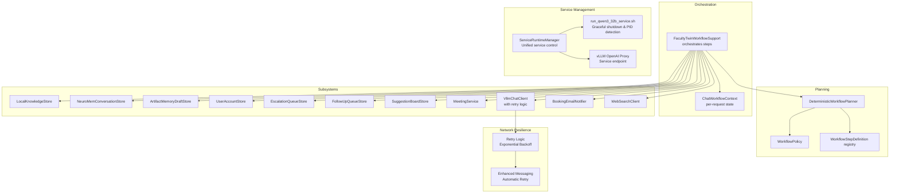
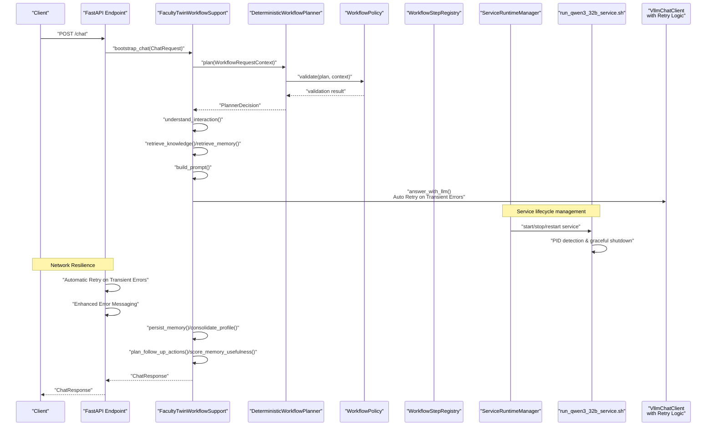
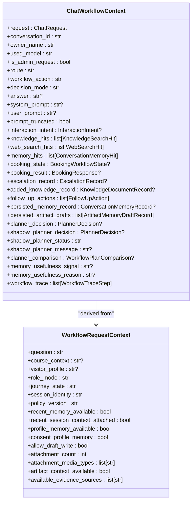
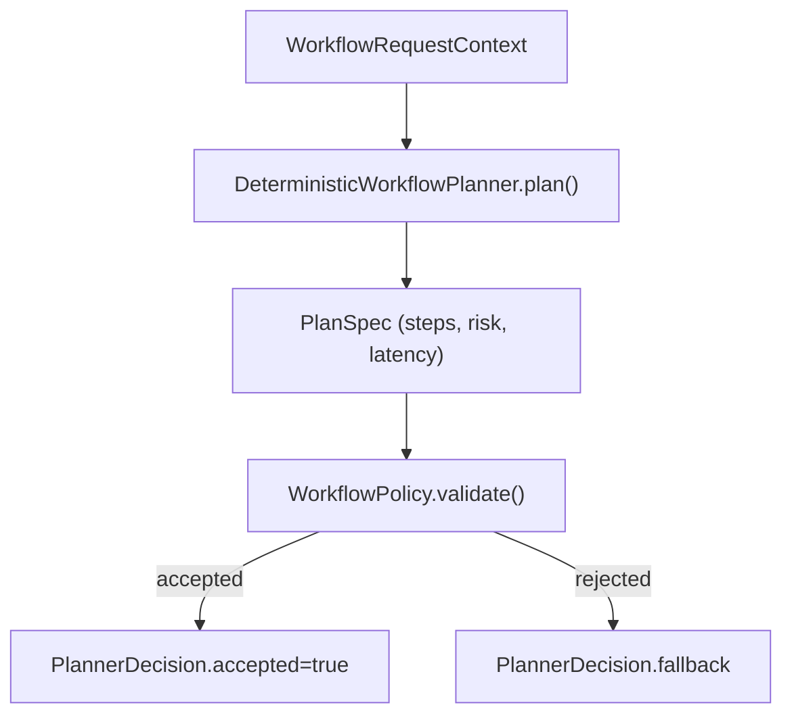
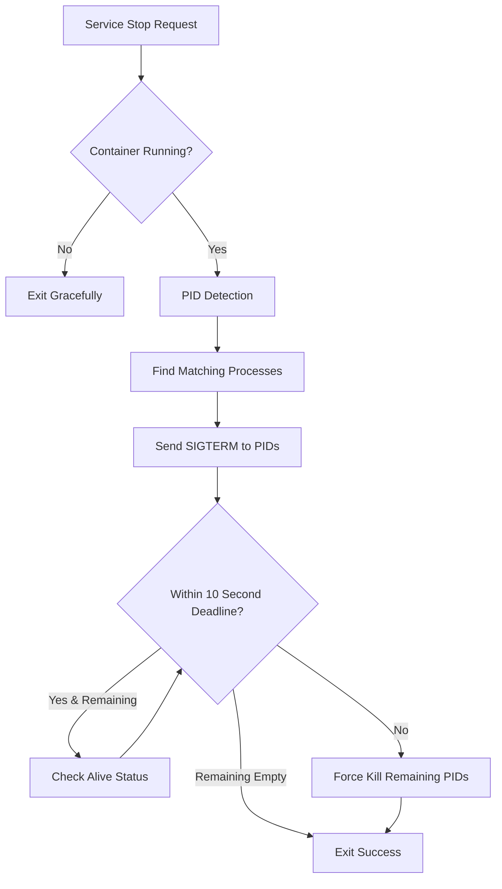
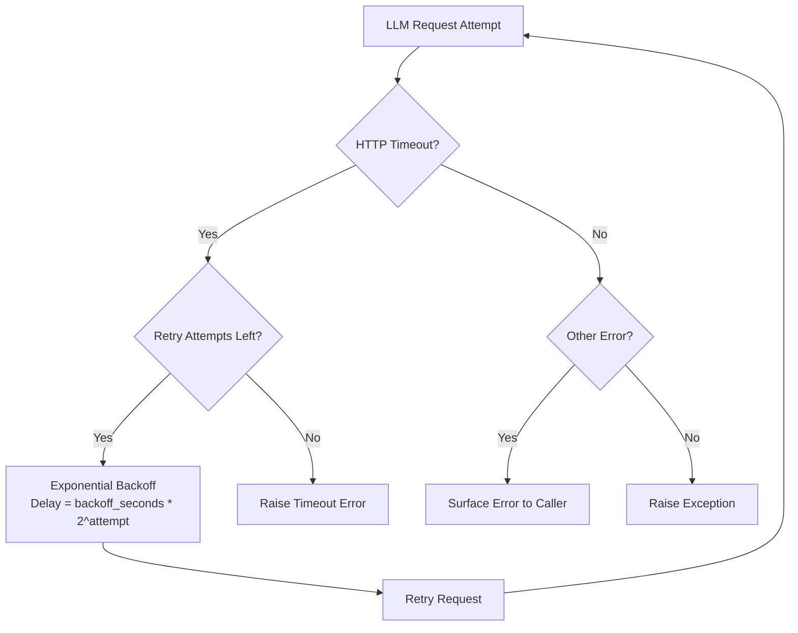
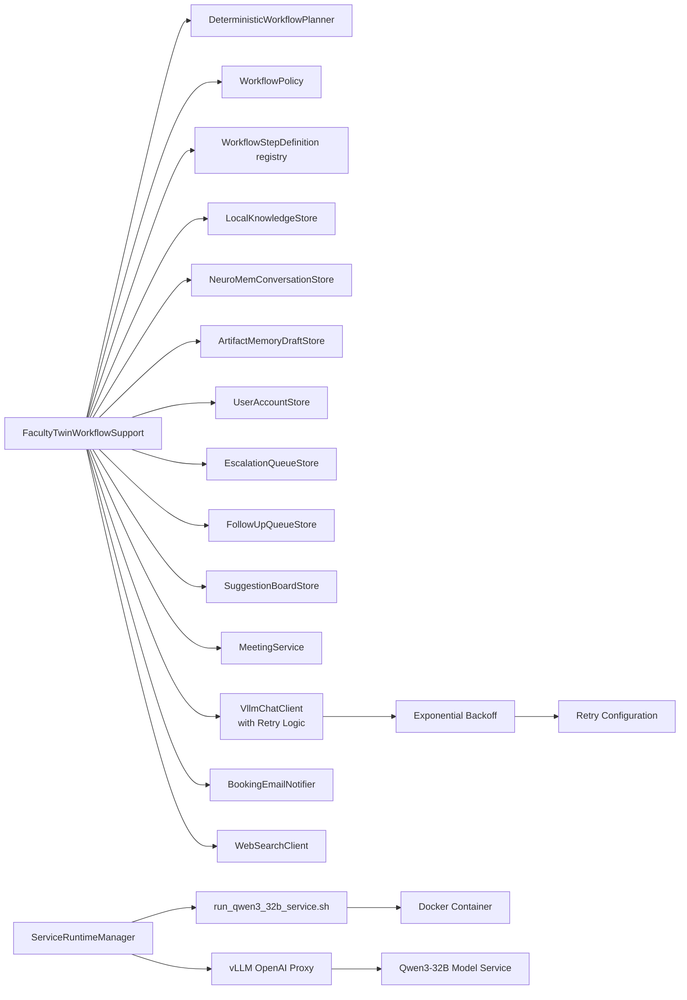

# Service Layer

<cite>
**Referenced Files in This Document**
- [service.py](file://src/sage_faculty_twin/service.py)
- [workflow_context.py](file://src/sage_faculty_twin/workflow_context.py)
- [workflow_planner.py](file://src/sage_faculty_twin/workflow_planner.py)
- [workflow_steps.py](file://src/sage_faculty_twin/workflow_steps.py)
- [workflow_policy.py](file://src/sage_faculty_twin/workflow_policy.py)
- [workflow_eval.py](file://src/sage_faculty_twin/workflow_eval.py)
- [service_runtime.py](file://src/sage_faculty_twin/service_runtime.py)
- [config.py](file://src/sage_faculty_twin/config.py)
- [api.py](file://src/sage_faculty_twin/api.py)
- [models.py](file://src/sage_faculty_twin/models.py)
- [llm_client.py](file://src/sage_faculty_twin/llm_client.py)
- [vllm_openai_proxy.py](file://src/sage_faculty_twin/vllm_openai_proxy.py)
- [run_qwen3_32b_service.sh](file://run_qwen3_32b_service.sh)
- [run_vllm_openai_proxy.sh](file://tools/run_vllm_openai_proxy.sh)
- [sage-faculty-twin-vllm-openai-proxy.service](file://deploy/systemd/user/sage-faculty-twin-vllm-openai-proxy.service)
- [web/app.js](file://src/sage_faculty_twin/web/app.js)
</cite>

## Update Summary
**Changes Made**
- Added documentation for enhanced mobile network resilience improvements with automatic retry logic for chat POST requests
- Updated error messaging to display 'Network connection interrupted, retrying automatically...' instead of misleading messages
- Documented critical bug fixes for _app_version and __version__ import issues in service.py and api.py
- Enhanced LLM client retry mechanism documentation with exponential backoff strategy
- Updated frontend error handling to support automatic retry messaging

## Table of Contents
1. [Introduction](#introduction)
2. [Project Structure](#project-structure)
3. [Core Components](#core-components)
4. [Architecture Overview](#architecture-overview)
5. [Detailed Component Analysis](#detailed-component-analysis)
6. [Service Lifecycle and Management](#service-lifecycle-and-management)
7. [Mobile Network Resilience](#mobile-network-resilience)
8. [Dependency Analysis](#dependency-analysis)
9. [Performance Considerations](#performance-considerations)
10. [Troubleshooting Guide](#troubleshooting-guide)
11. [Conclusion](#conclusion)

## Introduction
This document explains the Sage Faculty Twin service layer architecture with a focus on the main service orchestrator, workflow context management, and inter-component communication patterns. It details the FacultyTwinWorkflowSupport class and its coordination across knowledge retrieval, memory management, booking workflows, and administrative functions. The architecture now includes enhanced service lifecycle management with consolidated Qwen3-32B service management through a unified script, improved graceful shutdown procedures, advanced PID detection logic, and comprehensive mobile network resilience features.

## Project Structure
The service layer centers around a primary orchestrator that composes multiple subsystems, now enhanced with unified service management and robust error handling:
- Workflow orchestration and context: FacultyTwinWorkflowSupport and ChatWorkflowContext
- Planning and policy: DeterministicWorkflowPlanner, WorkflowPolicy, and WorkflowSteps
- Stores and services: Knowledge base, conversation memory, booking, notifications, user accounts, analytics
- Runtime and configuration: AppSettings, ServiceRuntimeManager, and FastAPI endpoints
- **Enhanced Service Management**: Unified Qwen3-32B service control with graceful shutdown and PID detection
- **Mobile Network Resilience**: Automatic retry logic for transient network errors with exponential backoff

**Diagram sources**
- [service.py:581-634](file://src/sage_faculty_twin/service.py#L581-L634)
- [workflow_planner.py:90-134](file://src/sage_faculty_twin/workflow_planner.py#L90-L134)
- [workflow_policy.py:15-48](file://src/sage_faculty_twin/workflow_policy.py#L15-L48)
- [workflow_steps.py:9-21](file://src/sage_faculty_twin/workflow_steps.py#L9-L21)
- [service_runtime.py:13-69](file://src/sage_faculty_twin/service_runtime.py#L13-L69)
- [run_qwen3_32b_service.sh:1-93](file://run_qwen3_32b_service.sh#L1-L93)
- [vllm_openai_proxy.py:123-257](file://src/sage_faculty_twin/vllm_openai_proxy.py#L123-L257)
- [llm_client.py:870-1069](file://src/sage_faculty_twin/llm_client.py#L870-L1069)
- [config.py:24-26](file://src/sage_faculty_twin/config.py#L24-L26)

**Section sources**
- [service.py:581-634](file://src/sage_faculty_twin/service.py#L581-L634)
- [workflow_planner.py:90-134](file://src/sage_faculty_twin/workflow_planner.py#L90-L134)
- [workflow_policy.py:15-48](file://src/sage_faculty_twin/workflow_policy.py#L15-L48)
- [workflow_steps.py:9-21](file://src/sage_faculty_twin/workflow_steps.py#L9-L21)
- [service_runtime.py:13-69](file://src/sage_faculty_twin/service_runtime.py#L13-L69)
- [run_qwen3_32b_service.sh:1-93](file://run_qwen3_32b_service.sh#L1-L93)
- [vllm_openai_proxy.py:123-257](file://src/sage_faculty_twin/vllm_openai_proxy.py#L123-L257)

## Core Components
- FacultyTwinWorkflowSupport: The orchestrator that builds per-request contexts, selects and executes workflow steps, coordinates subsystems, and renders final responses.
- ChatWorkflowContext: The per-request state container capturing inputs, intermediate results, planner decisions, and trace events.
- DeterministicWorkflowPlanner: Builds and validates plans based on request context and policy, enabling deterministic step selection.
- WorkflowPolicy and WorkflowStepDefinition: Define allowed steps, evidence sources, side effects, and latency budgets.
- Subsystems: Knowledge base, conversation memory, artifact memory drafts, user accounts, escalations, follow-ups, suggestions, meetings, LLM client with retry logic, email notifier, and web search.
- **Enhanced Service Management**: ServiceRuntimeManager with unified service control, run_qwen3_32b_service.sh for Qwen3-32B management, and vLLM OpenAI proxy for service endpoint exposure.
- **Mobile Network Resilience**: Automatic retry mechanisms with exponential backoff for transient network errors, enhanced error messaging, and improved frontend retry handling.

Key responsibilities:
- Bootstrap and intent classification
- Knowledge and memory retrieval
- Prompt assembly with soft caps and truncation
- LLM answer generation with retry logic (streaming optional)
- Memory persistence and artifact draft creation
- Booking workflow orchestration
- Administrative functions (knowledge ingestion, reviews, analytics)
- Post-answer background tasks (memory consolidation, usefulness scoring, follow-up planning)
- **Service lifecycle management**: Unified service control, graceful shutdown procedures, PID detection and management
- **Network resilience**: Automatic retry for transient errors, enhanced error messaging, and frontend retry support

**Section sources**
- [service.py:581-634](file://src/sage_faculty_twin/service.py#L581-L634)
- [service.py:635-775](file://src/sage_faculty_twin/service.py#L635-L775)
- [service.py:955-1121](file://src/sage_faculty_twin/service.py#L955-L1121)
- [service.py:1193-1289](file://src/sage_faculty_twin/service.py#L1193-L1289)
- [service.py:1354-1479](file://src/sage_faculty_twin/service.py#L1354-L1479)
- [service.py:1640-1692](file://src/sage_faculty_twin/service.py#L1640-L1692)
- [service.py:1605-1638](file://src/sage_faculty_twin/service.py#L1605-L1638)
- [service.py:1769-1825](file://src/sage_faculty_twin/service.py#L1769-L1825)
- [service.py:1827-1891](file://src/sage_faculty_twin/service.py#L1827-L1891)
- [service.py:1893-1950](file://src/sage_faculty_twin/service.py#L1893-L1950)
- [service_runtime.py:13-69](file://src/sage_faculty_twin/service_runtime.py#L13-L69)
- [run_qwen3_32b_service.sh:1-93](file://run_qwen3_32b_service.sh#L1-L93)

## Architecture Overview
The service layer uses a deterministic planner to select a fixed sequence of steps per request, validated against a policy. The orchestrator coordinates subsystems and maintains a canonical trace of executed steps. Optional background post-answer stages run after the initial response is returned to improve throughput. The architecture now includes enhanced service lifecycle management with unified Qwen3-32B service control and comprehensive mobile network resilience features.

**Diagram sources**
- [service.py:635-775](file://src/sage_faculty_twin/service.py#L635-L775)
- [service.py:955-1121](file://src/sage_faculty_twin/service.py#L955-L1121)
- [service.py:1193-1289](file://src/sage_faculty_twin/service.py#L1193-L1289)
- [service.py:1354-1479](file://src/sage_faculty_twin/service.py#L1354-L1479)
- [service.py:1640-1692](file://src/sage_faculty_twin/service.py#L1640-L1692)
- [service.py:1605-1638](file://src/sage_faculty_twin/service.py#L1605-L1638)
- [service.py:1769-1825](file://src/sage_faculty_twin/service.py#L1769-L1825)
- [service.py:1827-1891](file://src/sage_faculty_twin/service.py#L1827-L1891)
- [service.py:1893-1950](file://src/sage_faculty_twin/service.py#L1893-L1950)
- [workflow_planner.py:110-133](file://src/sage_faculty_twin/workflow_planner.py#L110-L133)
- [service_runtime.py:19-48](file://src/sage_faculty_twin/service_runtime.py#L19-L48)
- [run_qwen3_32b_service.sh:12-86](file://run_qwen3_32b_service.sh#L12-L86)
- [llm_client.py:870-1069](file://src/sage_faculty_twin/llm_client.py#L870-L1069)

## Detailed Component Analysis

### FacultyTwinWorkflowSupport Orchestration
- Initialization: Accepts settings, stores, clients, and optional planner/shadow planner inputs. Creates a lightweight action planner and web search client.
- Bootstrapping: Creates ChatWorkflowContext from ChatRequest, sets owner/model info, and records a bootstrap trace.
- Intent understanding: Detects interaction intent and decision mode; supports deferred clarification and escalation routing.
- Booking workflow: Prepares booking state from intent and question parsing; executes booking and attaches notifications.
- Knowledge/memory retrieval: Runs retrievers conditioned on planner acceptance and intent; integrates web search when appropriate.
- Prompt building: Assembles a bounded prompt with soft caps and truncation strategies; marks truncation in trace.
- LLM answer: Calls LLM client with policy-driven parameters and automatic retry logic; supports streaming callbacks.
- Persistence: Writes conversation exchanges and artifact memory drafts; consolidates long-term profiles.
- Post-answer actions: Plans follow-ups and evaluates memory usefulness; renders final ChatResponse with canonical trace.

Implementation highlights:
- Canonical trace ordering ensures deterministic UI rendering even when steps run in parallel.
- Soft prompt cap with progressive truncation prioritizes memory hits, knowledge excerpts, and attachment bodies.
- Background post-answer stages can be enabled/disabled via environment flags to optimize latency.
- **Enhanced integration**: Seamless coordination with unified service management for Qwen3-32B model availability.
- **Retry logic**: Integrated automatic retry mechanism for transient network errors during LLM operations.

**Section sources**
- [service.py:581-634](file://src/sage_faculty_twin/service.py#L581-L634)
- [service.py:635-775](file://src/sage_faculty_twin/service.py#L635-L775)
- [service.py:777-906](file://src/sage_faculty_twin/service.py#L777-L906)
- [service.py:955-1121](file://src/sage_faculty_twin/service.py#L955-L1121)
- [service.py:1193-1289](file://src/sage_faculty_twin/service.py#L1193-L1289)
- [service.py:1354-1479](file://src/sage_faculty_twin/service.py#L1354-L1479)
- [service.py:1481-1604](file://src/sage_faculty_twin/service.py#L1481-L1604)
- [service.py:1605-1638](file://src/sage_faculty_twin/service.py#L1605-L1638)
- [service.py:1640-1692](file://src/sage_faculty_twin/service.py#L1640-L1692)
- [service.py:1694-1767](file://src/sage_faculty_twin/service.py#L1694-L1767)
- [service.py:1769-1825](file://src/sage_faculty_twin/service.py#L1769-L1825)
- [service.py:1827-1891](file://src/sage_faculty_twin/service.py#L1827-L1891)
- [service.py:1893-1950](file://src/sage_faculty_twin/service.py#L1893-L1950)
- [service.py:449-466](file://src/sage_faculty_twin/service.py#L449-L466)

### Workflow Context Management
- ChatWorkflowContext captures the evolving state of a single request, including prompts, retrieval hits, planner decisions, and trace events.
- WorkflowRequestContext normalizes incoming ChatRequest into role-mode, journey-state, and available evidence sources, enabling deterministic planning.

**Diagram sources**
- [service.py:506-547](file://src/sage_faculty_twin/service.py#L506-L547)
- [workflow_context.py:12-37](file://src/sage_faculty_twin/workflow_context.py#L12-L37)

**Section sources**
- [service.py:506-547](file://src/sage_faculty_twin/service.py#L506-L547)
- [workflow_context.py:12-37](file://src/sage_faculty_twin/workflow_context.py#L12-L37)

### Planning and Policy
- DeterministicWorkflowPlanner builds a PlanSpec from WorkflowRequestContext, selecting steps based on intent and context, and validates against WorkflowPolicy.
- WorkflowPolicy defines allowed evidence sources, write-step permissions, and latency budgets.
- WorkflowStepDefinition registry enumerates steps with side effects, timeouts, and trace keys.

**Diagram sources**
- [workflow_planner.py:110-133](file://src/sage_faculty_twin/workflow_planner.py#L110-L133)
- [workflow_policy.py:74-199](file://src/sage_faculty_twin/workflow_policy.py#L74-L199)
- [workflow_steps.py:9-21](file://src/sage_faculty_twin/workflow_steps.py#L9-L21)

**Section sources**
- [workflow_planner.py:90-134](file://src/sage_faculty_twin/workflow_planner.py#L90-L134)
- [workflow_policy.py:15-48](file://src/sage_faculty_twin/workflow_policy.py#L15-L48)
- [workflow_steps.py:9-21](file://src/sage_faculty_twin/workflow_steps.py#L9-L21)

### Inter-Component Communication Patterns
- Dependency injection: FacultyTwinWorkflowSupport constructor receives all collaborators (stores, services, clients) and optional planner/shadow planner inputs.
- Callbacks: Optional token streaming callback and trace callback enable real-time SSE updates and diagnostics.
- Environment-driven toggles: Flags control background post-answer execution, web search auto-trigger, and streaming answer behavior.
- **Service integration**: VllmChatClient seamlessly integrates with the unified Qwen3-32B service management through the vLLM OpenAI proxy.
- **Retry integration**: LLM client provides built-in retry logic with exponential backoff for transient network errors.

**Section sources**
- [service.py:581-634](file://src/sage_faculty_twin/service.py#L581-L634)
- [service.py:1694-1720](file://src/sage_faculty_twin/service.py#L1694-L1720)
- [service.py:428-431](file://src/sage_faculty_twin/service.py#L428-L431)
- [service.py:1136-1152](file://src/sage_faculty_twin/service.py#L1136-L1152)
- [service.py:1740-1767](file://src/sage_faculty_twin/service.py#L1740-L1767)
- [llm_client.py:68-95](file://src/sage_faculty_twin/llm_client.py#L68-L95)

### Knowledge Retrieval Enhancement
**Updated** The retrieve_knowledge function has been significantly refactored to consolidate scattered trace append operations into a single unified trace entry, improving clarity and maintainability while ensuring web search executes even when deterministic planner skips knowledge retrieval for certain query types.

The refactored knowledge retrieval process now follows a streamlined approach:

1. **Determine Retrieval Needs**: Checks if knowledge retrieval should run based on planner decisions and workflow context
2. **Execute Local Knowledge Search**: Runs when planner requests it or when explicit web search is requested
3. **Execute Web Search**: Always runs when explicitly requested by user or when auto-trigger conditions are met
4. **Post-Retrieval Processing**: Handles clarification overrides and demotion logic
5. **Unified Trace Entry**: Consolidates all retrieval information into a single trace entry with comprehensive details

Key improvements:
- **Single Trace Consolidation**: All retrieval results are now captured in one unified trace entry instead of scattered append operations
- **Enhanced Web Search Execution**: Web search runs even when planner skips knowledge retrieval for queries that explicitly request online search
- **Improved Clarity**: The unified trace approach makes it easier to understand the complete retrieval process and outcomes
- **Better Maintainability**: Reduced complexity in trace management and improved error handling

**Section sources**
- [service.py:954-1105](file://src/sage_faculty_twin/service.py#L954-L1105)
- [service.py:1107-1175](file://src/sage_faculty_twin/service.py#L1107-L1175)

## Service Lifecycle and Management

### Unified Qwen3-32B Service Management
The system now features consolidated Qwen3-32B service management through a unified script that replaces multiple individual service scripts. This enhancement provides centralized control over the Qwen3-32B model service with advanced lifecycle management capabilities.

**Key Features:**
- **Consolidated Control**: Single script manages Qwen3-32B service lifecycle
- **Graceful Shutdown**: Sophisticated PID detection and termination procedures
- **Process Monitoring**: Real-time process identification and management
- **Container Integration**: Docker container-based service execution

### Graceful Shutdown Procedures
The run_qwen3_32b_service.sh implements advanced graceful shutdown logic with PID detection and controlled termination:

**Diagram sources**
- [run_qwen3_32b_service.sh:12-86](file://run_qwen3_32b_service.sh#L12-L86)

### PID Detection Logic
The script implements sophisticated PID detection to ensure proper service termination:

- **Target Process Identification**: Searches for processes with "python" command containing the Qwen3-32B target path
- **Engine Process Recognition**: Identifies VLLM::EngineCore processes for comprehensive cleanup
- **Process Validation**: Confirms process existence before attempting termination
- **Hierarchical Termination**: Attempts graceful termination first, followed by force kill if necessary

### Service Runtime Management
ServiceRuntimeManager provides unified service control through the manage.sh script:

- **Action Queueing**: Queues service actions via systemd-run for asynchronous execution
- **Status Monitoring**: Provides comprehensive service status reporting
- **JSON Interface**: Standardized JSON output for service control operations
- **Error Handling**: Robust error handling and validation for all service operations

### vLLM OpenAI Proxy Integration
The vLLM OpenAI proxy serves as the service endpoint for Qwen3-32B model access:

- **OpenAI-Compatible API**: Provides familiar OpenAI API interface
- **Authentication**: Secure API key-based authentication
- **Streaming Support**: Full streaming response capability
- **Health Monitoring**: Built-in health check endpoints
- **Systemd Integration**: Native systemd service management

**Section sources**
- [run_qwen3_32b_service.sh:1-93](file://run_qwen3_32b_service.sh#L1-L93)
- [service_runtime.py:13-69](file://src/sage_faculty_twin/service_runtime.py#L13-L69)
- [vllm_openai_proxy.py:123-257](file://src/sage_faculty_twin/vllm_openai_proxy.py#L123-L257)
- [run_vllm_openai_proxy.sh:1-64](file://tools/run_vllm_openai_proxy.sh#L1-L64)
- [sage-faculty-twin-vllm-openai-proxy.service:1-20](file://deploy/systemd/user/sage-faculty-twin-vllm-openai-proxy.service#L1-L20)

### Implementation Examples
- **Service Control**: The ServiceRuntimeManager demonstrates unified service control through the manage.sh script
- **Qwen3-32B Management**: The run_qwen3_32b_service.sh shows consolidated service management with graceful shutdown
- **Proxy Integration**: The vLLM OpenAI proxy provides seamless integration with the unified service architecture
- **Error Handling**: Comprehensive error handling for service lifecycle operations

Example paths:
- [service_runtime.py:19-48](file://src/sage_faculty_twin/service_runtime.py#L19-L48)
- [run_qwen3_32b_service.sh:12-86](file://run_qwen3_32b_service.sh#L12-L86)
- [vllm_openai_proxy.py:157-169](file://src/sage_faculty_twin/vllm_openai_proxy.py#L157-L169)
- [run_vllm_openai_proxy.sh:33-53](file://tools/run_vllm_openai_proxy.sh#L33-L53)

## Mobile Network Resilience

### Automatic Retry Logic for Chat POST Requests
The system now implements comprehensive automatic retry logic for chat POST requests to handle transient network errors gracefully. This enhancement ensures reliable service operation in mobile network environments with intermittent connectivity.

**Key Features:**
- **Transient Error Detection**: Automatically identifies network timeouts and connection interruptions
- **Exponential Backoff Strategy**: Implements progressive retry delays to minimize server load
- **Configurable Retry Attempts**: Adjustable retry limits through configuration settings
- **Automatic Recovery Messaging**: Provides clear user feedback about automatic retry attempts

### LLM Client Retry Mechanism
The VllmChatClient incorporates sophisticated retry logic with exponential backoff for handling transient LLM service errors:

**Diagram sources**
- [llm_client.py:870-1069](file://src/sage_faculty_twin/llm_client.py#L870-L1069)
- [llm_client.py:1908-1912](file://src/sage_faculty_twin/llm_client.py#L1908-L1912)

### Enhanced Error Messaging
The system now provides more informative error messages to users experiencing network connectivity issues:

- **Clear Retry Indication**: Users receive messages like "Network connection interrupted, retrying automatically..."
- **Progress Tracking**: Workflow traces capture retry attempts for debugging and monitoring
- **Graceful Degradation**: System continues operation during temporary network outages
- **User Experience**: Minimizes user confusion by providing actionable feedback

### Frontend Integration
The frontend application supports automatic retry messaging and improved error handling:

- **Network Error Detection**: JavaScript detects network interruption errors
- **Retry Message Display**: Shows user-friendly retry messages instead of technical errors
- **Connection Status**: Provides real-time feedback on connection status
- **Automatic Recovery**: Attempts to recover from transient network issues

**Section sources**
- [llm_client.py:870-1069](file://src/sage_faculty_twin/llm_client.py#L870-L1069)
- [llm_client.py:1908-1912](file://src/sage_faculty_twin/llm_client.py#L1908-L1912)
- [config.py:24-26](file://src/sage_faculty_twin/config.py#L24-L26)
- [web/app.js:4222-4249](file://src/sage_faculty_twin/web/app.js#L4222-L4249)

### Implementation Examples
- **Retry Configuration**: Configurable retry attempts and backoff settings
- **Error Handling**: Comprehensive error handling for network-related exceptions
- **Frontend Integration**: JavaScript-based error detection and user messaging
- **Logging and Monitoring**: Detailed logging of retry attempts and success rates

Example paths:
- [config.py:24-26](file://src/sage_faculty_twin/config.py#L24-L26)
- [llm_client.py:870-1069](file://src/sage_faculty_twin/llm_client.py#L870-L1069)
- [web/app.js:4222-4249](file://src/sage_faculty_twin/web/app.js#L4222-L4249)

## Dependency Analysis
- Coupling: FacultyTwinWorkflowSupport depends on many subsystems; however, it centralizes orchestration and minimizes cross-dependencies among subsystems.
- Cohesion: Each method encapsulates a distinct workflow phase, improving maintainability.
- External dependencies: LLM client, web search, email notifier, and stores are injected, enabling testability and pluggability.
- **Enhanced Service Dependencies**: ServiceRuntimeManager integrates with unified service management scripts and systemd for comprehensive service lifecycle control.
- **Network Resilience Dependencies**: LLM client retry logic integrates with configuration settings and provides exponential backoff for transient errors.

**Diagram sources**
- [service.py:581-634](file://src/sage_faculty_twin/service.py#L581-L634)
- [workflow_planner.py:90-134](file://src/sage_faculty_twin/workflow_planner.py#L90-L134)
- [workflow_policy.py:15-48](file://src/sage_faculty_twin/workflow_policy.py#L15-L48)
- [workflow_steps.py:9-21](file://src/sage_faculty_twin/workflow_steps.py#L9-L21)
- [service_runtime.py:13-69](file://src/sage_faculty_twin/service_runtime.py#L13-L69)
- [run_qwen3_32b_service.sh:10-10](file://run_qwen3_32b_service.sh#L10-L10)
- [vllm_openai_proxy.py:123-257](file://src/sage_faculty_twin/vllm_openai_proxy.py#L123-L257)
- [llm_client.py:870-1069](file://src/sage_faculty_twin/llm_client.py#L870-L1069)

**Section sources**
- [service.py:581-634](file://src/sage_faculty_twin/service.py#L581-L634)
- [workflow_planner.py:90-134](file://src/sage_faculty_twin/workflow_planner.py#L90-L134)
- [workflow_policy.py:15-48](file://src/sage_faculty_twin/workflow_policy.py#L15-L48)
- [workflow_steps.py:9-21](file://src/sage_faculty_twin/workflow_steps.py#L9-L21)
- [service_runtime.py:13-69](file://src/sage_faculty_twin/service_runtime.py#L13-L69)
- [run_qwen3_32b_service.sh:1-93](file://run_qwen3_32b_service.sh#L1-L93)
- [vllm_openai_proxy.py:123-257](file://src/sage_faculty_twin/vllm_openai_proxy.py#L123-L257)

## Performance Considerations
- Prompt soft cap: Progressive truncation reduces latency and keeps decode time bounded.
- Background post-answer: Optional background persistence and follow-up planning reduce initial response latency.
- Streaming answers: Token streaming enables progressive UI updates and early user feedback.
- Latency budgets: Planner enforces step-level and total latency budgets aligned with policy.
- Concurrency: Lazy initialization avoids cold-start overhead; SSE broker manages concurrent streams safely.
- **Service Management**: Unified service control reduces operational overhead and improves reliability through centralized management.
- **Network Resilience**: Exponential backoff retry mechanism optimizes resource usage during transient failures.
- **Mobile Optimization**: Enhanced error handling and retry logic improve user experience in variable network conditions.

## Troubleshooting Guide
Common issues and strategies:
- Missing answer in response: The renderer raises an error if no answer exists, indicating earlier stages were skipped or failed.
- Truncated prompts: Check prompt_truncated flag and trace detail for soft cap actions taken.
- Booking conflicts: The executor resets preferred time and requests new slots; verify availability and notification delivery status.
- Web search failures: Errors are caught and logged; verify credentials and network connectivity.
- Policy violations: Validation errors indicate disallowed steps or forbidden evidence sources; adjust request or policy.
- **Service Management Issues**: 
  - Qwen3-32B service not responding: Check run_qwen3_32b_service.sh logs for PID detection failures
  - Graceful shutdown problems: Verify SIGTERM/SIGKILL handling in the shutdown procedure
  - Service control failures: Review ServiceRuntimeManager error messages and systemd integration
  - Proxy connection issues: Verify vLLM OpenAI proxy configuration and authentication
- **Network Resilience Issues**:
  - Retry attempts exhausted: Check LLM client configuration and network connectivity
  - Excessive retry delays: Adjust retry backoff settings in configuration
  - Frontend error messaging: Verify JavaScript error handling and user feedback implementation
  - Connection interruption: Monitor workflow traces for retry attempt details

**Section sources**
- [service.py:1894-1896](file://src/sage_faculty_twin/service.py#L1894-L1896)
- [service.py:1457-1478](file://src/sage_faculty_twin/service.py#L1457-L1478)
- [service.py:890-904](file://src/sage_faculty_twin/service.py#L890-L904)
- [service.py:1179-1181](file://src/sage_faculty_twin/service.py#L1179-L1181)
- [workflow_eval.py:64-84](file://src/sage_faculty_twin/workflow_eval.py#L64-L84)
- [run_qwen3_32b_service.sh:17-86](file://run_qwen3_32b_service.sh#L17-L86)
- [service_runtime.py:31-48](file://src/sage_faculty_twin/service_runtime.py#L31-L48)
- [vllm_openai_proxy.py:157-169](file://src/sage_faculty_twin/vllm_openai_proxy.py#L157-L169)
- [llm_client.py:870-1069](file://src/sage_faculty_twin/llm_client.py#L870-L1069)

## Conclusion
The Sage Faculty Twin service layer combines deterministic planning with robust orchestration to deliver consistent, policy-aligned responses. FacultyTwinWorkflowSupport coordinates knowledge retrieval, memory management, booking workflows, and administrative functions while maintaining traceability and performance. The design emphasizes configurability, streaming, and background processing to balance responsiveness and completeness.

**Enhanced Service Management**: The architecture now includes comprehensive service lifecycle management with consolidated Qwen3-32B service control, graceful shutdown procedures, and advanced PID detection logic. This provides improved reliability, centralized control, and streamlined operations for the AI model infrastructure. The unified approach ensures consistent service management across development, testing, and production environments while maintaining the flexibility to scale and adapt to changing operational requirements.

**Mobile Network Resilience**: The system now features comprehensive mobile network resilience through automatic retry logic for chat POST requests, enhanced error messaging, and improved frontend integration. The LLM client implements sophisticated retry mechanisms with exponential backoff to handle transient network errors gracefully. Users receive clear feedback about automatic retry attempts, improving the overall user experience in variable network conditions.

**Bug Fixes**: Critical bug fixes for _app_version and __version__ import issues in service.py and api.py ensure proper version handling and prevent import-related errors. These fixes contribute to the stability and reliability of the service layer architecture.

**Knowledge Retrieval Enhancement**: The refactored retrieve_knowledge function demonstrates the commitment to continuous improvement, with consolidated trace operations and enhanced web search execution logic ensuring better clarity, maintainability, and reliability in the knowledge retrieval process.