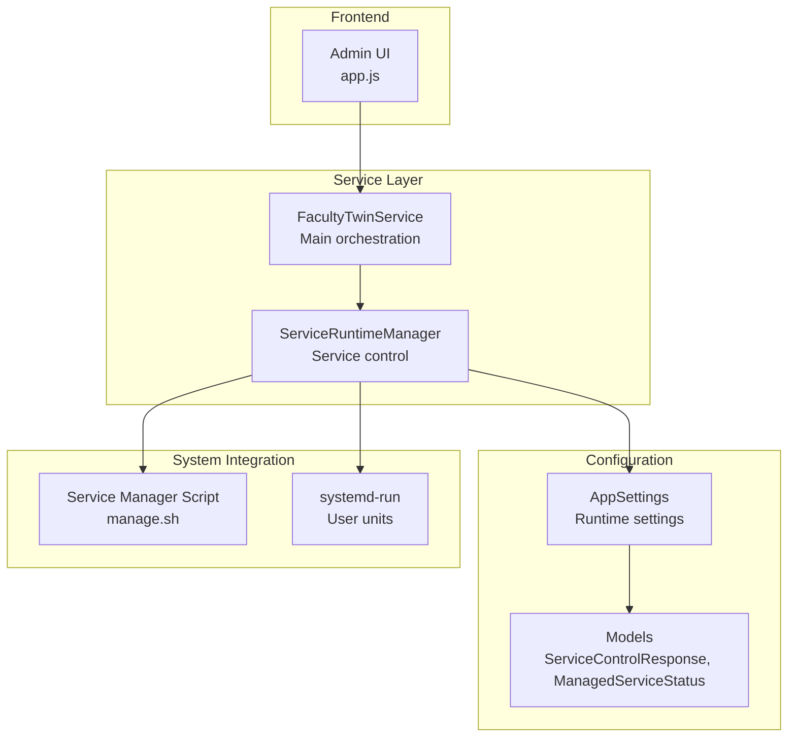
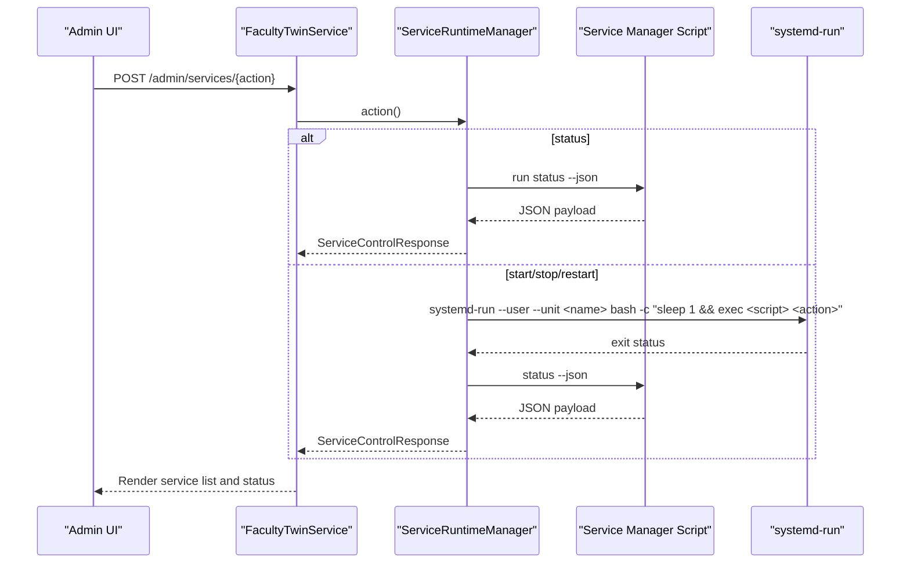
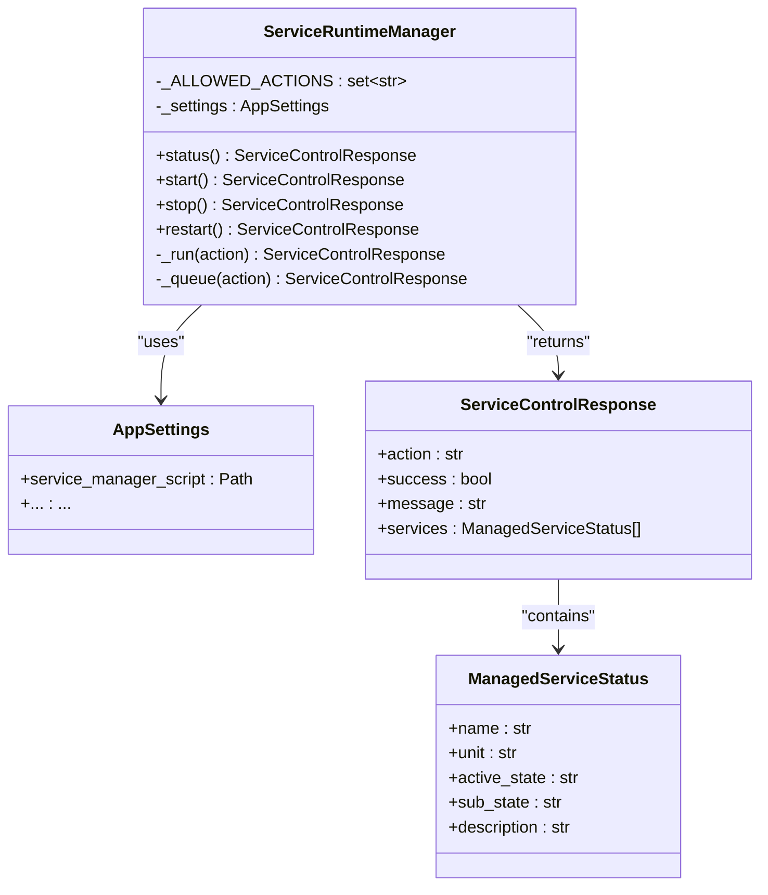
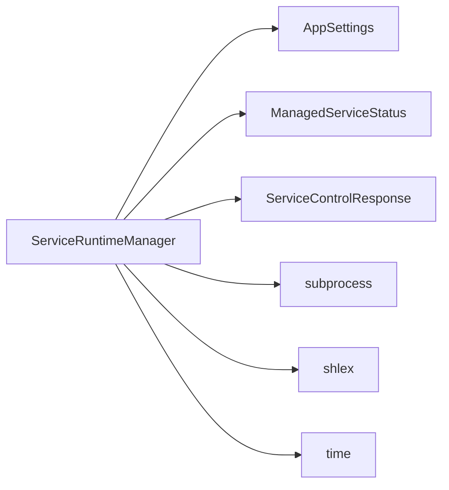

# Service Runtime Management

<cite>
**Referenced Files in This Document**
- [service_runtime.py](file://src/sage_faculty_twin/service_runtime.py)
- [service.py](file://src/sage_faculty_twin/service.py)
- [config.py](file://src/sage_faculty_twin/config.py)
- [models.py](file://src/sage_faculty_twin/models.py)
- [runtime_env.py](file://src/sage_faculty_twin/runtime_env.py)
- [app.js](file://src/sage_faculty_twin/web/app.js)
</cite>

## Table of Contents
1. [Introduction](#introduction)
2. [Project Structure](#project-structure)
3. [Core Components](#core-components)
4. [Architecture Overview](#architecture-overview)
5. [Detailed Component Analysis](#detailed-component-analysis)
6. [Dependency Analysis](#dependency-analysis)
7. [Performance Considerations](#performance-considerations)
8. [Troubleshooting Guide](#troubleshooting-guide)
9. [Conclusion](#conclusion)

## Introduction
This document explains the ServiceRuntimeManager class and its role in managing service lifecycle and runtime configuration for the Faculty Twin system. It covers responsibilities such as service initialization, configuration loading, dependency resolution, and graceful shutdown procedures. It also documents the relationship between runtime management and the main service layer, how runtime settings influence workflow execution, and how monitoring and operational observability are integrated.

## Project Structure
The runtime management capability is implemented as a focused subsystem within the service layer:
- ServiceRuntimeManager encapsulates service control operations and integrates with the system's service manager script.
- The main service layer composes runtime settings and orchestrates workflow execution modes.
- Configuration and models define runtime-related settings and response structures.
- Frontend integration exposes administrative controls for service actions.

**Diagram sources**
- [service_runtime.py:13-69](file://src/sage_faculty_twin/service_runtime.py#L13-L69)
- [service.py:5302-5303](file://src/sage_faculty_twin/service.py#L5302-L5303)
- [config.py:9-132](file://src/sage_faculty_twin/config.py#L9-L132)
- [models.py:769-783](file://src/sage_faculty_twin/models.py#L769-L783)
- [app.js:2090-2129](file://src/sage_faculty_twin/web/app.js#L2090-L2129)

**Section sources**
- [service_runtime.py:13-69](file://src/sage_faculty_twin/service_runtime.py#L13-L69)
- [service.py:5290-5303](file://src/sage_faculty_twin/service.py#L5290-L5303)
- [config.py:9-132](file://src/sage_faculty_twin/config.py#L9-L132)
- [models.py:769-783](file://src/sage_faculty_twin/models.py#L769-L783)
- [app.js:2090-2129](file://src/sage_faculty_twin/web/app.js#L2090-L2129)

## Core Components
- ServiceRuntimeManager: Provides service lifecycle control (status, start, stop, restart) by invoking a service manager script and parsing structured JSON responses into typed models.
- AppSettings: Centralized runtime configuration including service manager script path and environment-specific settings.
- Models: Typed response structures for service control operations and managed service status reporting.
- FacultyTwinService: Integrates runtime management into the main service layer and selects execution modes for workflow pipelines.

Key responsibilities:
- Service initialization: Validates configuration and prepares runtime environment.
- Configuration loading: Reads environment variables and external settings files.
- Dependency resolution: Ensures required modules and local source paths are available.
- Graceful shutdown procedures: Delegates to the underlying service manager script.

**Section sources**
- [service_runtime.py:13-69](file://src/sage_faculty_twin/service_runtime.py#L13-L69)
- [config.py:9-132](file://src/sage_faculty_twin/config.py#L9-L132)
- [models.py:769-783](file://src/sage_faculty_twin/models.py#L769-L783)
- [service.py:5290-5303](file://src/sage_faculty_twin/service.py#L5290-L5303)

## Architecture Overview
The runtime manager sits between the main service layer and the system service manager. It translates high-level service actions into low-level systemd operations and returns structured responses consumed by the service layer and frontend.

**Diagram sources**
- [service_runtime.py:19-69](file://src/sage_faculty_twin/service_runtime.py#L19-L69)
- [service.py:5302-5303](file://src/sage_faculty_twin/service.py#L5302-L5303)
- [app.js:2090-2129](file://src/sage_faculty_twin/web/app.js#L2090-L2129)

## Detailed Component Analysis

### ServiceRuntimeManager
Responsibilities:
- Validate allowed actions and enforce supported operations.
- Execute synchronous status queries against the service manager script.
- Queue asynchronous start/stop/restart actions via systemd-run with user units.
- Parse JSON responses into ManagedServiceStatus and ServiceControlResponse models.

Implementation highlights:
- Action validation prevents unsupported operations.
- Status action executes the service manager script directly and parses the JSON output.
- Queue action schedules a future execution using systemd-run with a generated unit name and captures the resulting service snapshot.

**Diagram sources**
- [service_runtime.py:13-69](file://src/sage_faculty_twin/service_runtime.py#L13-L69)
- [models.py:769-783](file://src/sage_faculty_twin/models.py#L769-L783)
- [config.py:120-120](file://src/sage_faculty_twin/config.py#L120-L120)

**Section sources**
- [service_runtime.py:13-69](file://src/sage_faculty_twin/service_runtime.py#L13-L69)
- [models.py:769-783](file://src/sage_faculty_twin/models.py#L769-L783)
- [config.py:120-120](file://src/sage_faculty_twin/config.py#L120-L120)

### Relationship Between Runtime Management and Main Service Layer
Integration points:
- FacultyTwinService instantiates ServiceRuntimeManager during initialization.
- Runtime settings influence workflow execution mode selection and background processing behavior.
- Administrative UI triggers service actions that are handled by the runtime manager.

Operational impact:
- Service status affects readiness checks and UI availability.
- Asynchronous service actions are queued via systemd-run, ensuring non-blocking admin operations.
- Structured responses enable consistent rendering and error handling in the admin interface.

**Section sources**
- [service.py:5290-5303](file://src/sage_faculty_twin/service.py#L5290-L5303)
- [service.py:5338-5489](file://src/sage_faculty_twin/service.py#L5338-L5489)
- [app.js:2090-2129](file://src/sage_faculty_twin/web/app.js#L2090-L2129)

### Runtime Configuration and Startup Sequences
Configuration loading:
- AppSettings reads environment variables prefixed with DIGITAL_TWIN_ and loads from .env files located in the repository root and sibling SAGE checkout.
- service_manager_script points to manage.sh by default, enabling centralized service control.

Startup sequence:
- The runtime manager validates configuration and ensures required dependencies are available.
- Service actions are executed through the service manager script, which coordinates systemd units and reports status.

**Section sources**
- [config.py:9-132](file://src/sage_faculty_twin/config.py#L9-L132)
- [runtime_env.py:102-131](file://src/sage_faculty_twin/runtime_env.py#L102-L131)

### Monitoring Integration and Observability
Monitoring integration:
- ServiceControlResponse aggregates action outcomes and service snapshots for UI rendering.
- ManagedServiceStatus provides active_state and sub_state for real-time monitoring dashboards.
- The admin UI displays service lists and inline status updates after each action.

Operational observability:
- Structured JSON payloads from the service manager script are parsed and validated.
- Error messages and success flags propagate to the UI for user feedback.
- Background tasks and post-answer processing are coordinated with workflow tracing for end-to-end observability.

**Section sources**
- [models.py:769-783](file://src/sage_faculty_twin/models.py#L769-L783)
- [app.js:2090-2129](file://src/sage_faculty_twin/web/app.js#L2090-L2129)

## Dependency Analysis
ServiceRuntimeManager depends on:
- AppSettings for configuration (e.g., service_manager_script path).
- ManagedServiceStatus and ServiceControlResponse models for typed responses.
- Subprocess execution to invoke the service manager script and systemd-run for asynchronous actions.

**Diagram sources**
- [service_runtime.py:3-10](file://src/sage_faculty_twin/service_runtime.py#L3-L10)
- [service_runtime.py:16-17](file://src/sage_faculty_twin/service_runtime.py#L16-L17)
- [models.py:769-783](file://src/sage_faculty_twin/models.py#L769-L783)

**Section sources**
- [service_runtime.py:3-10](file://src/sage_faculty_twin/service_runtime.py#L3-L10)
- [models.py:769-783](file://src/sage_faculty_twin/models.py#L769-L783)

## Performance Considerations
- Asynchronous service actions are queued via systemd-run, preventing blocking of the main service thread.
- Status queries execute the service manager script synchronously and parse JSON responses, minimizing overhead.
- Background post-answer processing reduces initial response latency while maintaining trace completeness.

## Troubleshooting Guide
Common issues and resolutions:
- Unsupported action: The runtime manager raises an error for unsupported actions; ensure only status, start, stop, and restart are used.
- Service manager script failures: Verify the service manager script path in AppSettings and ensure manage.sh is executable.
- Missing dependencies: The runtime environment bootstrap enforces required modules and local source preferences; confirm PYTHONPATH and module availability.
- systemd-run errors: Check user unit creation and permissions; ensure the user systemd instance is available.

**Section sources**
- [service_runtime.py:31-33](file://src/sage_faculty_twin/service_runtime.py#L31-L33)
- [service_runtime.py:50-62](file://src/sage_faculty_twin/service_runtime.py#L50-L62)
- [runtime_env.py:102-131](file://src/sage_faculty_twin/runtime_env.py#L102-L131)

## Conclusion
ServiceRuntimeManager provides a robust abstraction for service lifecycle management, integrating tightly with the main service layer and the system's service manager. It enables safe, observable, and efficient control of managed services, supporting both synchronous status queries and asynchronous action queuing. Together with typed models and administrative UI integration, it delivers a cohesive runtime management experience for the Faculty Twin system.