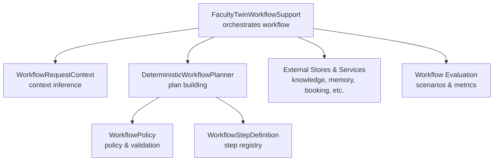
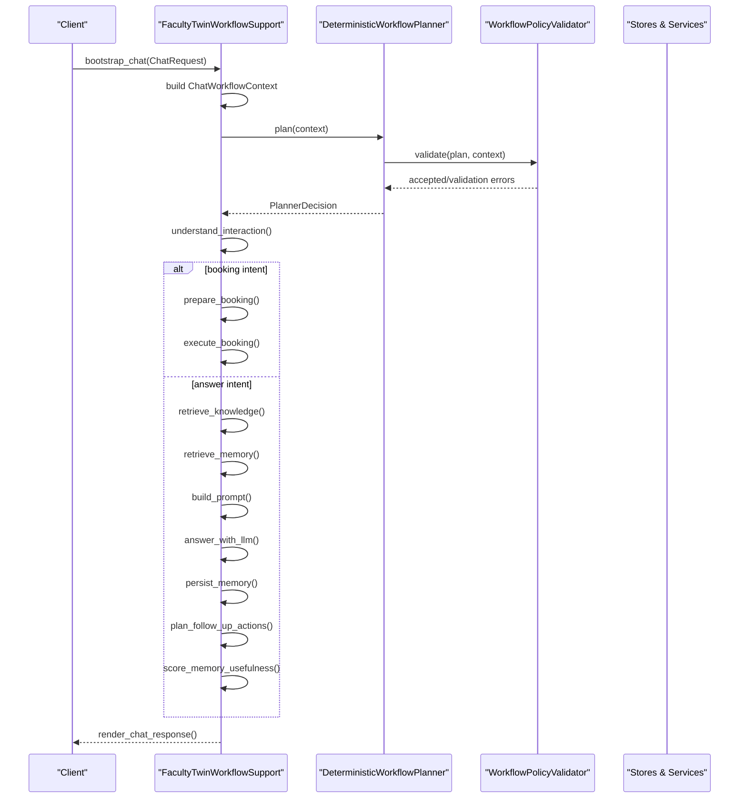
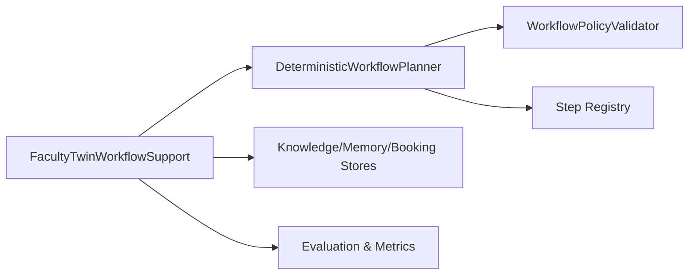

# Workflow Support System

<cite>
**Referenced Files in This Document**
- [service.py](file://src/sage_faculty_twin/service.py)
- [workflow_context.py](file://src/sage_faculty_twin/workflow_context.py)
- [workflow_planner.py](file://src/sage_faculty_twin/workflow_planner.py)
- [workflow_policy.py](file://src/sage_faculty_twin/workflow_policy.py)
- [workflow_steps.py](file://src/sage_faculty_twin/workflow_steps.py)
- [workflow_eval.py](file://src/sage_faculty_twin/workflow_eval.py)
- [planner_comparison_store.py](file://src/sage_faculty_twin/planner_comparison_store.py)
- [planner_metrics_store.py](file://src/sage_faculty_twin/planner_metrics_store.py)
</cite>

## Table of Contents
1. [Introduction](#introduction)
2. [Project Structure](#project-structure)
3. [Core Components](#core-components)
4. [Architecture Overview](#architecture-overview)
5. [Detailed Component Analysis](#detailed-component-analysis)
6. [Dependency Analysis](#dependency-analysis)
7. [Performance Considerations](#performance-considerations)
8. [Troubleshooting Guide](#troubleshooting-guide)
9. [Conclusion](#conclusion)
10. [Appendices](#appendices)

## Introduction
This document explains the FacultyTwinWorkflowSupport class and its workflow orchestration capabilities. It covers constructor parameters, dependency injection patterns, coordination among knowledge retrieval, memory management, booking workflows, and administrative functions. It also documents the workflow lifecycle from bootstrap to completion, including context management, trace callbacks, and decision-making processes. Implementation examples demonstrate instantiation, planner mode configuration, and handling various workflow scenarios. Thread-safety considerations, error handling strategies, and performance optimization techniques are included.

## Project Structure
The workflow orchestration spans several modules:
- service.py: Implements FacultyTwinWorkflowSupport, orchestrating the end-to-end chat workflow and integrating external subsystems.
- workflow_context.py: Defines request context and inference helpers for role-mode, journey-state, and evidence sources.
- workflow_planner.py: Provides deterministic planner, plan building, and policy validation.
- workflow_policy.py: Encapsulates policy definitions and validation logic.
- workflow_steps.py: Declares step registry and step definitions used by the planner.
- workflow_eval.py: Supports evaluation and replay of workflow scenarios.
- Additional stores and services integrate with knowledge, memory, booking, notifications, and analytics.

**Diagram sources**
- [service.py:581-634](file://src/sage_faculty_twin/service.py#L581-L634)
- [workflow_context.py:12-112](file://src/sage_faculty_twin/workflow_context.py#L12-L112)
- [workflow_planner.py:90-134](file://src/sage_faculty_twin/workflow_planner.py#L90-L134)
- [workflow_policy.py:64-199](file://src/sage_faculty_twin/workflow_policy.py#L64-L199)
- [workflow_steps.py:179-184](file://src/sage_faculty_twin/workflow_steps.py#L179-L184)
- [workflow_eval.py:1-200](file://src/sage_faculty_twin/workflow_eval.py#L1-L200)

**Section sources**
- [service.py:581-634](file://src/sage_faculty_twin/service.py#L581-L634)
- [workflow_context.py:12-112](file://src/sage_faculty_twin/workflow_context.py#L12-L112)
- [workflow_planner.py:90-134](file://src/sage_faculty_twin/workflow_planner.py#L90-L134)
- [workflow_policy.py:64-199](file://src/sage_faculty_twin/workflow_policy.py#L64-L199)
- [workflow_steps.py:179-184](file://src/sage_faculty_twin/workflow_steps.py#L179-L184)
- [workflow_eval.py:1-200](file://src/sage_faculty_twin/workflow_eval.py#L1-L200)

## Core Components
- FacultyTwinWorkflowSupport: Central orchestrator managing the chat workflow lifecycle, integrating planning, retrieval, LLM answering, persistence, and post-answer actions.
- WorkflowRequestContext: Normalizes incoming requests into structured context with role-mode, journey-state, and evidence-source inference.
- DeterministicWorkflowPlanner: Builds plans from context, validates against policy, and supports shadow planning comparisons.
- WorkflowPolicy and Validator: Enforce constraints on plan stages, side effects, latency budgets, and evidence sources.
- Step Registry: Defines executable stages (e.g., retrieval, prompting, answering, persistence) with timeouts and side effects.
- Stores and Services: Knowledge store, conversation memory, artifact memory drafts, escalation queues, follow-ups, meeting service, LLM client, and email notifier.

Key constructor parameters of FacultyTwinWorkflowSupport include:
- settings: Application settings controlling behavior and limits.
- booking_workflows: In-memory state for multi-step booking workflows.
- knowledge_store, conversation_store, analytics_store: Backing stores for knowledge, memory, and analytics.
- artifact_memory_draft_store, knowledge_gap_draft_store, escalation_store, follow_up_store, suggestion_store: Draft and queue management.
- user_store, meeting_service, llm_client, email_notifier: Identity, scheduling, language model, and notification integrations.
- Optional callbacks: trace_callback, answer_chunk_callback for streaming and tracing.
- Planner inputs: planner_decision, shadow_planner_decision/status/message, planner_comparison for planning visibility and comparison.

**Section sources**
- [service.py:581-634](file://src/sage_faculty_twin/service.py#L581-L634)
- [workflow_context.py:12-112](file://src/sage_faculty_twin/workflow_context.py#L12-L112)
- [workflow_planner.py:90-134](file://src/sage_faculty_twin/workflow_planner.py#L90-L134)
- [workflow_policy.py:64-199](file://src/sage_faculty_twin/workflow_policy.py#L64-L199)
- [workflow_steps.py:179-184](file://src/sage_faculty_twin/workflow_steps.py#L179-L184)

## Architecture Overview
The workflow follows a deterministic planner-driven orchestration with optional shadow planning and strict policy enforcement. The system builds a plan from the request context, executes steps conditionally based on planner acceptance, and persists outcomes.

**Diagram sources**
- [service.py:635-1950](file://src/sage_faculty_twin/service.py#L635-L1950)
- [workflow_planner.py:110-134](file://src/sage_faculty_twin/workflow_planner.py#L110-L134)
- [workflow_policy.py:74-199](file://src/sage_faculty_twin/workflow_policy.py#L74-L199)

## Detailed Component Analysis

### FacultyTwinWorkflowSupport Orchestration
Responsibilities:
- Bootstrap: Establishes ChatWorkflowContext, admin session identity, and planner preview.
- Intent understanding: Resolves interaction intent, routes to answer, escalation, or booking.
- Booking workflow: Collects details, validates availability, and executes booking.
- Retrieval: Chooses between knowledge store and web search based on intent and thresholds.
- Prompt assembly: Assembles system and user prompts with soft caps and truncation.
- LLM answering: Calls LLM with deadline/priority policies and optional streaming.
- Persistence: Writes conversation exchanges, artifact memory drafts, and consolidates profiles.
- Post-answer actions: Plans follow-ups, evaluates memory usefulness, and renders response.
- Tracing: Emits canonical trace steps with parallel groups and background post-answer stages.

Constructor highlights:
- Dependency injection: All major stores/services are injected via constructor for testability and modularity.
- Optional planner inputs: Allows precomputed planner decisions and shadow planner previews for comparison and auditing.
- Callbacks: trace_callback enables external tracing; answer_chunk_callback enables streaming.

Lifecycle stages:
- bootstrap_chat → understand_interaction → [prepare_booking]/[execute_booking] or [retrieve_knowledge] → [retrieve_memory] → build_prompt → answer_with_llm → persist_memory → plan_follow_up_actions → score_memory_usefulness → render_chat_response

Implementation examples:
- Instantiation with default dependencies and optional planner decision:
  - [service.py:581-634](file://src/sage_faculty_twin/service.py#L581-L634)
- Configuring planner modes:
  - Deterministic planner mode is used by default; shadow planner preview is supported via constructor parameters.
  - [workflow_planner.py:110-134](file://src/sage_faculty_twin/workflow_planner.py#L110-L134)
- Handling booking scenarios:
  - [service.py:777-906](file://src/sage_faculty_twin/service.py#L777-L906)
- Handling knowledge and memory retrieval:
  - [service.py:955-1289](file://src/sage_faculty_twin/service.py#L955-L1289)
- Rendering response and tracing:
  - [service.py:1893-1950](file://src/sage_faculty_twin/service.py#L1893-L1950)

Thread-safety considerations:
- The class is stateful per request via ChatWorkflowContext; avoid sharing mutable context across threads.
- Stores and services are assumed to be thread-safe; ensure proper synchronization if accessed externally.
- Streaming callbacks must be safe to call concurrently from LLM client.

Error handling strategies:
- Validation failures produce fallback templates and planner previews.
- Web search failures are logged and gracefully skipped.
- Missing records raise HTTP exceptions with clear messages.
- Booking conflicts reset state and request new time windows.

Performance optimization techniques:
- Soft prompt caps and progressive truncation reduce LLM cost and latency.
- Background post-answer stages minimize end-to-end latency for streaming responses.
- Planner latency budgets constrain step execution time.
- Parallel trace groups and canonical ordering optimize UI rendering and testing.

**Section sources**
- [service.py:581-1950](file://src/sage_faculty_twin/service.py#L581-L1950)
- [workflow_planner.py:110-134](file://src/sage_faculty_twin/workflow_planner.py#L110-L134)

### WorkflowRequestContext and Evidence Inference
Purpose:
- Normalize incoming ChatRequest into a structured context.
- Infer role-mode, journey-state, and available evidence sources.
- Compute attachment-related flags and artifact context availability.

Key behaviors:
- Role-mode inference considers keywords in question, course context, and visitor profile.
- Journey-state inference detects urgency, meeting intent, and recurring collaboration.
- Evidence-source inference combines course context, meeting keywords, memory availability, and artifact mentions.

Implementation references:
- [workflow_context.py:12-112](file://src/sage_faculty_twin/workflow_context.py#L12-L112)
- [workflow_context.py:115-262](file://src/sage_faculty_twin/workflow_context.py#L115-L262)

**Section sources**
- [workflow_context.py:12-112](file://src/sage_faculty_twin/workflow_context.py#L12-L112)
- [workflow_context.py:115-262](file://src/sage_faculty_twin/workflow_context.py#L115-L262)

### DeterministicWorkflowPlanner and Plan Building
Purpose:
- Build plans from context using deterministic rules.
- Evaluate plans against policy and produce PlannerDecision.
- Support shadow planning for comparison.

Key behaviors:
- Goal selection based on question patterns (admin-only, artifact record, booking preparation/request, research, greeting, grounded answer).
- Step inclusion guided by context flags (recent memory, profile memory, artifact memory).
- Risk level computed from strongest side effect across steps.
- Evidence contract constrains allowed and forbidden sources.

Implementation references:
- [workflow_planner.py:90-425](file://src/sage_faculty_twin/workflow_planner.py#L90-L425)
- [workflow_planner.py:427-476](file://src/sage_faculty_twin/workflow_planner.py#L427-L476)
- [workflow_planner.py:503-659](file://src/sage_faculty_twin/workflow_planner.py#L503-L659)

**Section sources**
- [workflow_planner.py:90-425](file://src/sage_faculty_twin/workflow_planner.py#L90-L425)
- [workflow_planner.py:427-476](file://src/sage_faculty_twin/workflow_planner.py#L427-L476)
- [workflow_planner.py:503-659](file://src/sage_faculty_twin/workflow_planner.py#L503-L659)

### WorkflowPolicy and Validation
Purpose:
- Define policy constraints (stage counts, latency budgets, allowed evidence sources).
- Validate plans against policy and context.

Key behaviors:
- Enforces acyclicity, step registration, inputs/outputs, side effects, admin-only constraints, and draft-write permissions.
- Validates evidence contracts against allowed and forbidden sources.
- Computes risk level from strongest side effect.

Implementation references:
- [workflow_policy.py:15-48](file://src/sage_faculty_twin/workflow_policy.py#L15-L48)
- [workflow_policy.py:64-199](file://src/sage_faculty_twin/workflow_policy.py#L64-L199)

**Section sources**
- [workflow_policy.py:15-48](file://src/sage_faculty_twin/workflow_policy.py#L15-L48)
- [workflow_policy.py:64-199](file://src/sage_faculty_twin/workflow_policy.py#L64-L199)

### Step Registry and Side Effects
Purpose:
- Define executable workflow steps with inputs, outputs, side effects, timeouts, and retry policies.
- Enable deterministic planning and policy validation.

Key behaviors:
- Steps include detection, classification, retrieval, prompting, answering, persistence, and follow-up planning.
- Side effects range from none to admin-only, driving risk level and policy gating.

Implementation references:
- [workflow_steps.py:9-21](file://src/sage_faculty_twin/workflow_steps.py#L9-L21)
- [workflow_steps.py:23-174](file://src/sage_faculty_twin/workflow_steps.py#L23-L174)
- [workflow_steps.py:179-184](file://src/sage_faculty_twin/workflow_steps.py#L179-L184)

**Section sources**
- [workflow_steps.py:9-21](file://src/sage_faculty_twin/workflow_steps.py#L9-L21)
- [workflow_steps.py:23-174](file://src/sage_faculty_twin/workflow_steps.py#L23-L174)
- [workflow_steps.py:179-184](file://src/sage_faculty_twin/workflow_steps.py#L179-L184)

### Workflow Evaluation and Comparison
Purpose:
- Evaluate and compare planner decisions, including shadow planner proposals.
- Provide planner comparison and metrics snapshots.

Key behaviors:
- Build planner previews and comparison summaries.
- Track planner metrics and maintain comparison store entries.

Implementation references:
- [service.py:2026-2188](file://src/sage_faculty_twin/service.py#L2026-L2188)
- [service.py:2120-2210](file://src/sage_faculty_twin/service.py#L2120-L2210)
- [planner_comparison_store.py:1-200](file://src/sage_faculty_twin/planner_comparison_store.py#L1-L200)
- [planner_metrics_store.py:1-200](file://src/sage_faculty_twin/planner_metrics_store.py#L1-L200)

**Section sources**
- [service.py:2026-2188](file://src/sage_faculty_twin/service.py#L2026-L2188)
- [service.py:2120-2210](file://src/sage_faculty_twin/service.py#L2120-L2210)
- [planner_comparison_store.py:1-200](file://src/sage_faculty_twin/planner_comparison_store.py#L1-L200)
- [planner_metrics_store.py:1-200](file://src/sage_faculty_twin/planner_metrics_store.py#L1-L200)

## Dependency Analysis
The orchestration depends on:
- Planner and policy for deterministic plan construction and validation.
- Step registry for executable stages and side-effect enforcement.
- Stores and services for knowledge, memory, booking, and notifications.
- Evaluation and comparison modules for auditing and metrics.

**Diagram sources**
- [service.py:581-634](file://src/sage_faculty_twin/service.py#L581-L634)
- [workflow_planner.py:90-134](file://src/sage_faculty_twin/workflow_planner.py#L90-L134)
- [workflow_policy.py:64-199](file://src/sage_faculty_twin/workflow_policy.py#L64-L199)
- [workflow_steps.py:179-184](file://src/sage_faculty_twin/workflow_steps.py#L179-L184)

**Section sources**
- [service.py:581-634](file://src/sage_faculty_twin/service.py#L581-L634)
- [workflow_planner.py:90-134](file://src/sage_faculty_twin/workflow_planner.py#L90-L134)
- [workflow_policy.py:64-199](file://src/sage_faculty_twin/workflow_policy.py#L64-L199)
- [workflow_steps.py:179-184](file://src/sage_faculty_twin/workflow_steps.py#L179-L184)

## Performance Considerations
- Prompt soft caps: Progressive truncation prioritizes dropping oldest memory hits, then knowledge excerpts, then attachment bodies to keep prompt sizes manageable.
- Background post-answer: Enables non-blocking persistence and follow-up planning after the initial response is ready.
- Planner latency budgets: Sum of step timeouts informs risk level and policy validation.
- Streaming LLM responses: Reduces perceived latency for interactive sessions.
- Web search gating: Auto-trigger only when local grounding is weak or explicitly requested.

[No sources needed since this section provides general guidance]

## Troubleshooting Guide
Common issues and resolutions:
- Planning rejected: Review validation errors in PlannerDecision and adjust context or policy.
  - [service.py:2026-2048](file://src/sage_faculty_twin/service.py#L2026-L2048)
- Web search failures: Check network connectivity and client configuration; failures are logged and ignored.
  - [service.py:1174-1181](file://src/sage_faculty_twin/service.py#L1174-L1181)
- Missing memory/exchange: Ensure conversation_id is provided and exchange exists before feedback submission.
  - [service.py:2406-2410](file://src/sage_faculty_twin/service.py#L2406-L2410)
- Booking conflicts: Reset preferred_start/end and collect new time slots.
  - [service.py:889-903](file://src/sage_faculty_twin/service.py#L889-L903)
- Admin-only requests: Non-admin users attempting admin-only operations are routed to review.
  - [workflow_planner.py:182-196](file://src/sage_faculty_twin/workflow_planner.py#L182-L196)

**Section sources**
- [service.py:2026-2048](file://src/sage_faculty_twin/service.py#L2026-L2048)
- [service.py:1174-1181](file://src/sage_faculty_twin/service.py#L1174-L1181)
- [service.py:2406-2410](file://src/sage_faculty_twin/service.py#L2406-L2410)
- [service.py:889-903](file://src/sage_faculty_twin/service.py#L889-L903)
- [workflow_planner.py:182-196](file://src/sage_faculty_twin/workflow_planner.py#L182-L196)

## Conclusion
FacultyTwinWorkflowSupport integrates planning, policy enforcement, retrieval, and persistence into a robust, configurable workflow. Its deterministic planner ensures predictable execution, while optional shadow planning and evaluation provide transparency and auditability. The system balances performance with safety through soft caps, background post-answer stages, and strict policy validation.

[No sources needed since this section summarizes without analyzing specific files]

## Appendices

### Implementation Examples

- Instantiate the workflow support system with default dependencies:
  - [service.py:581-634](file://src/sage_faculty_twin/service.py#L581-L634)

- Configure planner modes:
  - Deterministic planner mode is used by default; shadow planner preview is supported via constructor parameters.
  - [workflow_planner.py:110-134](file://src/sage_faculty_twin/workflow_planner.py#L110-L134)

- Handle booking scenarios:
  - [service.py:777-906](file://src/sage_faculty_twin/service.py#L777-L906)

- Handle knowledge and memory retrieval:
  - [service.py:955-1289](file://src/sage_faculty_twin/service.py#L955-L1289)

- Render response and tracing:
  - [service.py:1893-1950](file://src/sage_faculty_twin/service.py#L1893-L1950)

- Evaluate and compare planner decisions:
  - [service.py:2026-2188](file://src/sage_faculty_twin/service.py#L2026-L2188)

**Section sources**
- [service.py:581-634](file://src/sage_faculty_twin/service.py#L581-L634)
- [workflow_planner.py:110-134](file://src/sage_faculty_twin/workflow_planner.py#L110-L134)
- [service.py:777-906](file://src/sage_faculty_twin/service.py#L777-L906)
- [service.py:955-1289](file://src/sage_faculty_twin/service.py#L955-L1289)
- [service.py:1893-1950](file://src/sage_faculty_twin/service.py#L1893-L1950)
- [service.py:2026-2188](file://src/sage_faculty_twin/service.py#L2026-L2188)