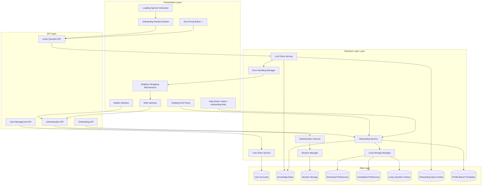
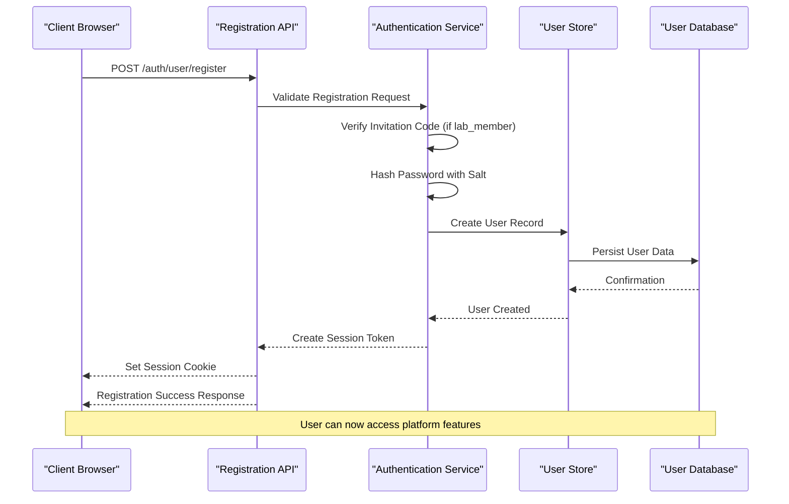
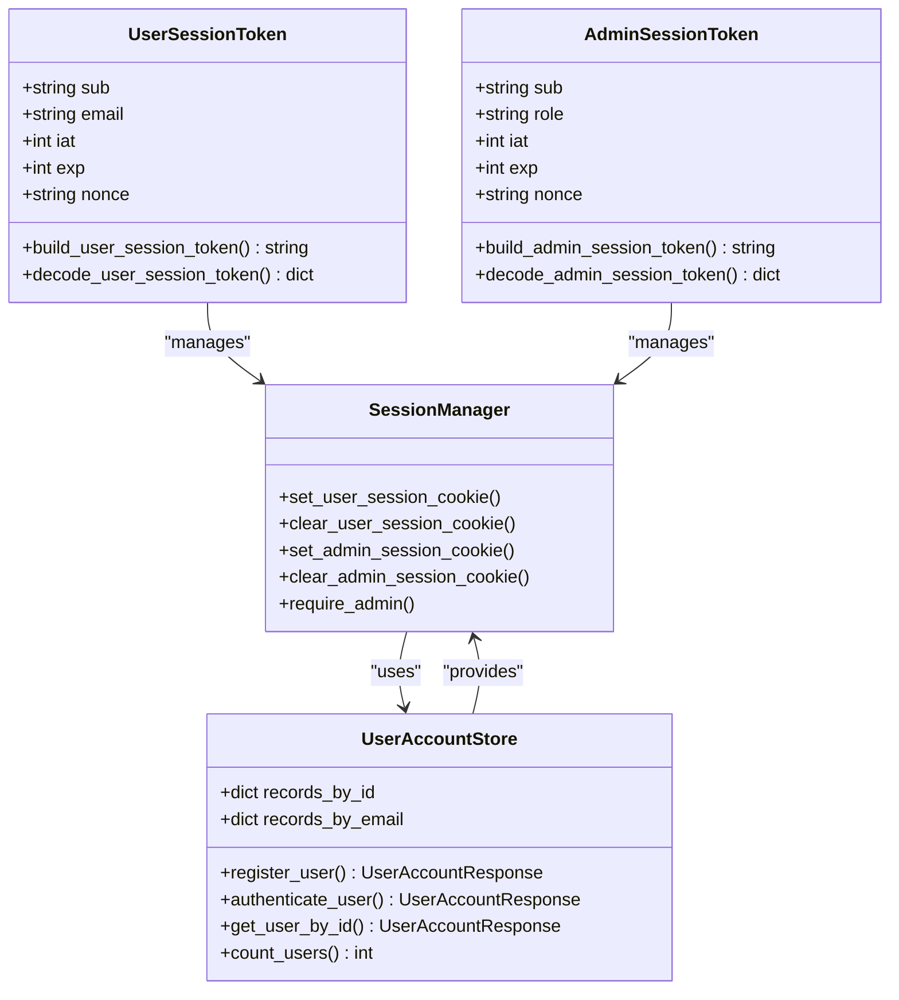
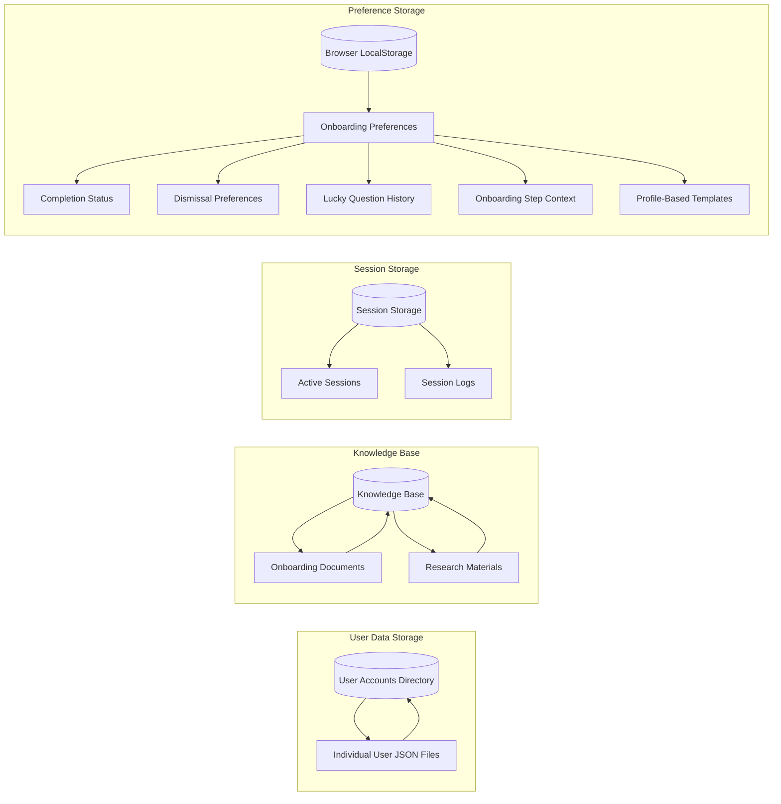

# User Onboarding System

<cite>
**Referenced Files in This Document**
- [README.md](file://README.md)
- [api.py](file://src/sage_faculty_twin/api.py)
- [auth.py](file://src/sage_faculty_twin/auth.py)
- [user_store.py](file://src/sage_faculty_twin/user_store.py)
- [models.py](file://src/sage_faculty_twin/models.py)
- [service.py](file://src/sage_faculty_twin/service.py)
- [config.py](file://src/sage_faculty_twin/config.py)
- [index.html](file://src/sage_faculty_twin/web/index.html)
- [app.js](file://src/sage_faculty_twin/web/app.js)
- [styles.css](file://src/sage_faculty_twin/web/styles.css)
- [onboarding-first-month.json](file://data/knowledge_base/onboarding-first-month.json)
- [4a05e39e-61c2-44c5-93b7-64679cf48511.json](file://data/user_accounts/4a05e39e-61c2-44c5-93b7-64679cf48511.json)
- [llm_client.py](file://src/sage_faculty_twin/llm_client.py)
</cite>

## Update Summary
**Changes Made**
- Enhanced onboarding system with adaptive wrapping mechanisms for better mobile responsiveness
- Added comprehensive onboarding steps for different visitor profiles including guided learning templates
- Implemented multiple hint options with rotating hint panels and fade transitions
- Improved error handling with graceful fallback mechanisms for LLM integration
- Added random fill capabilities with dice emoji-powered question generation
- Enhanced UI with sticky positioning, loading states, and visual feedback animations

## Table of Contents
1. [Introduction](#introduction)
2. [System Architecture](#system-architecture)
3. [User Registration Flow](#user-registration-flow)
4. [Enhanced Onboarding Experience](#enhanced-onboarding-experience)
5. [Authentication System](#authentication-system)
6. [Data Storage](#data-storage)
7. [Configuration Management](#configuration-management)
8. [Security Implementation](#security-implementation)
9. [Troubleshooting Guide](#troubleshooting-guide)
10. [Conclusion](#conclusion)

## Introduction

The User Onboarding System is a comprehensive framework designed to seamlessly integrate new users into the SAGE Faculty Twin digital assistant platform. This system manages user registration, authentication, personalized onboarding experiences, and account lifecycle management. Built with FastAPI and modern web technologies, it provides a robust foundation for user engagement while maintaining security and scalability.

The system supports multiple user profiles including general visitors, students, and lab members, each with distinct permissions and capabilities. It leverages advanced session management, secure password handling, and intelligent knowledge-based guidance to create a personalized user journey from first visit to full platform utilization.

**Updated** Enhanced with improved user control mechanisms, preference persistence, manual restart capabilities, contextual coaching through onboarding_step parameter, enhanced UI with sticky positioning and loading states, intelligent question generation with coaching templates, adaptive wrapping mechanisms for mobile responsiveness, comprehensive onboarding steps for different visitor profiles, rotating hint panels with fade transitions, dice emoji-powered random question generation, and sophisticated error handling with graceful fallback mechanisms.

## System Architecture

The User Onboarding System follows a layered architecture pattern with clear separation of concerns across multiple components:

**Diagram sources**
- [api.py:512-530](file://src/sage_faculty_twin/api.py#L512-L530)
- [auth.py:45-86](file://src/sage_faculty_twin/auth.py#L45-L86)
- [user_store.py:62-122](file://src/sage_faculty_twin/user_store.py#L62-L122)
- [app.js:652-654](file://src/sage_faculty_twin/web/app.js#L652-L654)
- [llm_client.py:588-623](file://src/sage_faculty_twin/llm_client.py#L588-L623)

The architecture ensures scalability through lazy initialization of services and efficient resource management. The modular design allows for easy maintenance and extension of onboarding features, with enhanced preference management, user control mechanisms, intelligent question generation capabilities, contextual coaching through onboarding_step parameter integration, adaptive wrapping mechanisms for mobile responsiveness, comprehensive profile-based templates, and sophisticated error handling with graceful fallback mechanisms.

**Section sources**
- [api.py:92-136](file://src/sage_faculty_twin/api.py#L92-L136)
- [service.py:96-133](file://src/sage_faculty_twin/service.py#L96-L133)

## User Registration Flow

The user registration process is designed to be intuitive and secure, with built-in validation and invitation code verification for lab members:

**Diagram sources**
- [api.py:512-517](file://src/sage_faculty_twin/api.py#L512-L517)
- [user_store.py:71-122](file://src/sage_faculty_twin/user_store.py#L71-L122)
- [auth.py:45-54](file://src/sage_faculty_twin/auth.py#L45-L54)

The registration flow includes comprehensive input validation, duplicate prevention, and secure credential handling. Invitation codes are required for lab member registration to maintain exclusive access to internal resources.

**Section sources**
- [user_store.py:71-105](file://src/sage_faculty_twin/user_store.py#L71-L105)
- [models.py:741-755](file://src/sage_faculty_twin/models.py#L741-L755)

## Enhanced Onboarding Experience

The onboarding system provides an interactive guided tour tailored to different user profiles, ensuring new users can quickly understand and utilize the platform effectively. The system now includes enhanced user control mechanisms, rotating hint panels, contextual coaching through onboarding_step parameter, and dice emoji-powered random question generation with comprehensive profile templates:

```mermaid
flowchart TD
Start([User Accesses Platform]) --> CheckProfile{Check Visitor Profile}
CheckProfile --> GeneralVisitor[General Visitor]
CheckProfile --> Student[Student]
CheckProfile --> LabMember[Lab Member]
CheckProfile --> HustUndergraduate[HUST Undergraduate]
CheckProfile --> PaperWritingStudent[Paper Writing Student]
GeneralVisitor --> CheckCompletion{Check Completion & Dismissal}
Student --> CheckCompletion
LabMember --> CheckCompletion
HustUndergraduate --> CheckCompletion
PaperWritingStudent --> CheckCompletion
CheckCompletion --> HasCompleted{Has Completed?}
CheckCompletion --> IsDismissed{Is Dismissed?}
HasCompleted --> |Yes| SkipOnboarding[Skip Onboarding]
HasCompleted --> |No| CheckProgress{Check Progress}
IsDismissed --> |Yes| SkipOnboarding
IsDismissed --> |No| CheckProgress
CheckProgress --> |Not Completed| ShowStep[Display Step Card]
CheckProgress --> |Completed| SkipOnboarding
ShowStep --> RenderQuestion[Render Question Template]
RenderQuestion --> ShowHintPanel[Show Rotating Hint Panel]
ShowHintPanel --> HintFade[Hint Panel with Fade Transitions]
HintFade --> OnboardingRandomBtn[Show Onboarding Random Button]
OnboardingRandomBtn --> ShowLoadingSpinner[Show Loading Spinner Animation]
ShowLoadingSpinner --> GenerateContextualQuestion[Generate Contextual Question]
GenerateContextualQuestion --> IncludeOnboardingStep[Include onboarding_step Parameter]
IncludeOnboardingStep --> LLMGeneration[LLM-Powered Generation with Coaching Templates]
LLMGeneration --> StaticFallback[Static Question Pool Fallback]
StaticFallback --> FillQuestion[Fill Question Input]
FillQuestion --> UserResponse[User Provides Response]
UserResponse --> ValidateResponse{Validate Response}
ValidateResponse --> |Correct| NextStep[Advance to Next Step]
ValidateResponse --> |Incorrect| ShowHint[Show Hint]
ShowHint --> HintFade
ShowHint --> UserResponse
NextStep --> MoreSteps{More Steps?}
MoreSteps --> |Yes| ShowStep
MoreSteps --> |No| CompleteOnboarding[Complete Onboarding]
CompleteOnboarding --> ShowDone[Show Done Panel]
ShowDone --> AutoHide{Auto-hide in 5s?}
AutoHide --> |Yes| HideCard[Hide Card]
AutoHide --> |No| ShowDismiss[Show Dismiss Checkbox]
ShowDismiss --> UserChoice{User Checked Dismiss?}
UserChoice --> |Yes| MarkDismissed[Mark As Dismissed]
UserChoice --> |No| KeepVisible[Keep Visible]
MarkDismissed --> HideCard
HideCard --> EnableFeatures[Enable Full Features]
SkipOnboarding --> EnableFeatures
EnableFeatures --> End([Access Granted])
```

**Diagram sources**
- [app.js:795-807](file://src/sage_faculty_twin/web/app.js#L795-L807)
- [app.js:825-856](file://src/sage_faculty_twin/web/app.js#L825-L856)
- [index.html:119-154](file://src/sage_faculty_twin/web/index.html#L119-L154)
- [app.js:887-903](file://src/sage_faculty_twin/web/app.js#L887-L903)
- [app.js:1050-1113](file://src/sage_faculty_twin/web/app.js#L1050-L1113)

**Updated** The onboarding experience now includes enhanced user control with a 'don't show again' checkbox, 5-second auto-hide delay, manual restart capability via help button, rotating hint panels with fade transitions, dice emoji-powered random question generation, contextual coaching through onboarding_step parameter, intelligent question generation powered by both LLM and static question pools, and enhanced UI with sticky positioning and loading states. The system now supports comprehensive onboarding steps for different visitor profiles including guided learning templates for lab members, undergraduate students, and paper writing students, with adaptive wrapping mechanisms for better mobile responsiveness and sophisticated error handling with graceful fallback mechanisms.

The onboarding experience is dynamically generated based on the user's visitor profile and includes progress tracking, step-by-step guidance, automatic completion detection, and respectful handling of user preferences. Users can now manually restart onboarding, choose to dismiss future prompts, have granular control over their onboarding experience, benefit from intelligent question generation powered by both LLM and static question pools, receive contextual coaching through the onboarding_step parameter integration, access comprehensive profile-specific templates, and enjoy enhanced mobile responsiveness with adaptive wrapping mechanisms.

**Section sources**
- [app.js:652-693](file://src/sage_faculty_twin/web/app.js#L652-L693)
- [app.js:795-890](file://src/sage_faculty_twin/web/app.js#L795-L890)
- [index.html:119-154](file://src/sage_faculty_twin/web/index.html#L119-L154)
- [app.js:887-903](file://src/sage_faculty_twin/web/app.js#L887-L903)
- [app.js:1050-1113](file://src/sage_faculty_twin/web/app.js#L1050-L1113)

## Authentication System

The authentication system implements secure session management with support for both user and admin authentication:

**Diagram sources**
- [auth.py:45-86](file://src/sage_faculty_twin/auth.py#L45-L86)
- [user_store.py:62-169](file://src/sage_faculty_twin/user_store.py#L62-L169)

The authentication system uses HMAC-signed JWT-like tokens stored in HTTP-only cookies for security. Passwords are hashed using scrypt with random salts, providing strong protection against attacks.

**Section sources**
- [auth.py:193-214](file://src/sage_faculty_twin/auth.py#L193-L214)
- [user_store.py:188-196](file://src/sage_faculty_twin/user_store.py#L188-L196)

## Data Storage

The system employs a multi-tiered storage approach to efficiently manage user data and onboarding information:

**Diagram sources**
- [config.py:86](file://src/sage_faculty_twin/config.py#L86)
- [config.py:63](file://src/sage_faculty_twin/config.py#L63)
- [app.js:652-654](file://src/sage_faculty_twin/web/app.js#L652-L654)

User accounts are stored as individual JSON files in the user_accounts directory, allowing for efficient individual record access and updates. The knowledge base contains structured documents that guide the onboarding process and provide contextual information. Onboarding preferences are now managed through browser localStorage with separate keys for completion status, dismissal preferences, lucky question history, onboarding step context, and profile-based templates.

**Section sources**
- [config.py:86](file://src/sage_faculty_twin/config.py#L86)
- [onboarding-first-month.json:1-23](file://data/knowledge_base/onboarding-first-month.json#L1-L23)
- [app.js:652-693](file://src/sage_faculty_twin/web/app.js#L652-L693)

## Configuration Management

The system uses a centralized configuration approach with environment variable support and default values:

| Configuration Parameter | Description | Default Value |
|------------------------|-------------|---------------|
| `user_session_secret` | Secret key for user session encryption | `change-me-user-session-secret` |
| `admin_session_secret` | Secret key for admin session encryption | `change-me-admin-session-secret` |
| `lab_member_invitation_code` | Required code for lab member registration | `SAGE-LAB-2026` |
| `lab_member_invitation_code_enabled` | Enable/disable invitation code requirement | `True` |
| `user_session_ttl_seconds` | User session expiration time | `2592000` (30 days) |
| `admin_session_ttl_seconds` | Admin session expiration time | `43200` (12 hours) |

The configuration system supports hierarchical loading from multiple sources including environment files and command-line arguments, ensuring flexibility across different deployment environments.

**Section sources**
- [config.py:132-148](file://src/sage_faculty_twin/config.py#L132-L148)
- [config.py:165](file://src/sage_faculty_twin/config.py#L165)

## Security Implementation

The User Onboarding System implements multiple layers of security to protect user data and maintain system integrity:

### Password Security
- Uses scrypt key derivation with 2^14 cost factor
- Random 16-byte salt generation per user
- 64-byte derived key length for enhanced security
- Constant-time comparison to prevent timing attacks

### Session Security
- HTTP-only cookies to prevent XSS attacks
- HMAC signature verification for session integrity
- Configurable expiration times for different user types
- Secure cookie handling with proper path and domain settings

### Access Control
- Role-based access control (RBAC) with super_admin and manager roles
- Invitation code verification for privileged access
- Session validation middleware for protected routes
- Graceful degradation when authentication fails

### Preference Security
- LocalStorage-based preference storage with error handling
- Separate keys for completion and dismissal preferences
- Automatic cleanup of temporary onboarding data
- Respectful handling of user preferences and choices
- Lucky question history tracking with automatic rotation
- Onboarding step context preservation for coaching
- Profile template caching with expiration handling

### Enhanced Security Measures
- **Updated** Proper handling of user preferences and choices with graceful error handling for localStorage operations
- **Updated** Respectful management of user consent through explicit dismissal preferences
- **Updated** Secure LLM integration with fallback mechanisms for question generation
- **Updated** Intelligent question generation with repetition prevention and context awareness
- **Updated** Contextual coaching through onboarding_step parameter with enhanced privacy controls
- **Updated** Loading state management with spinner animations and visual feedback
- **Updated** Adaptive wrapping mechanisms with responsive breakpoint handling
- **Updated** Comprehensive error handling with graceful fallback to static question pools
- **Updated** Sophisticated mobile responsiveness with device-specific optimizations

### Contextual Coaching Security
- **Updated** Secure transmission of onboarding_step parameter via HTTPS
- **Updated** Privacy-preserving context handling with minimal data exposure
- **Updated** Rate limiting and timeout protection for LLM API calls
- **Updated** Graceful fallback to static question pools when LLM services are unavailable
- **Updated** Enhanced mobile security with touch event handling and accessibility compliance

### Mobile Responsiveness Security
- **Updated** Adaptive wrapping mechanisms with responsive breakpoint detection
- **Updated** Touch event handling optimized for iOS Safari and other mobile browsers
- **Updated** Accessibility compliance with ARIA labels and keyboard navigation support
- **Updated** Device-specific optimizations for different screen sizes and orientations

**Section sources**
- [user_store.py:188-196](file://src/sage_faculty_twin/user_store.py#L188-L196)
- [auth.py:182-214](file://src/sage_faculty_twin/auth.py#L182-L214)
- [app.js:678-693](file://src/sage_faculty_twin/web/app.js#L678-L693)
- [llm_client.py:588-623](file://src/sage_faculty_twin/llm_client.py#L588-L623)

## Troubleshooting Guide

### Common Registration Issues

**Problem**: Registration fails with "invitation code error"
- **Cause**: Incorrect or missing invitation code for lab_member profile
- **Solution**: Verify the invitation code matches the configured value and ensure the user profile is set to "lab_member"

**Problem**: Registration fails with "email already registered"
- **Cause**: Email address already exists in the system
- **Solution**: Use a different email address or log in with existing credentials

**Problem**: Password validation errors
- **Cause**: Password does not meet minimum requirements (8+ characters)
- **Solution**: Ensure password meets the minimum length requirement

### Authentication Issues

**Problem**: Session cookies not persisting
- **Cause**: Browser privacy settings blocking third-party cookies
- **Solution**: Check browser settings and ensure cookies are enabled for the domain

**Problem**: Login failures despite correct credentials
- **Cause**: Session token expiration or tampering
- **Solution**: Clear browser cookies and retry authentication

### Enhanced Onboarding Experience Issues

**Problem**: Onboarding steps not displaying
- **Cause**: User has previously completed onboarding or dismissed future prompts
- **Solution**: Use the help button (#open-onboarding-help) to manually restart onboarding, or clear localStorage preferences

**Problem**: Rotating hint panels not working
- **Cause**: JavaScript errors in hint rotation logic or missing hint elements
- **Solution**: Check browser console for errors, verify hint panel elements exist, or clear browser data

**Problem**: Onboarding random button 🎲 not generating questions
- **Cause**: LLM API unavailability or localStorage restrictions
- **Solution**: Check network connectivity, verify localStorage is enabled, or use static fallback pool

**Problem**: Loading spinner animation not showing
- **Cause**: CSS styling issues or JavaScript errors in loading state management
- **Solution**: Check browser console for errors, verify loading spinner CSS classes, or clear browser cache

**Problem**: 'Don't show again' checkbox not working
- **Cause**: Browser localStorage restrictions or JavaScript errors
- **Solution**: Check browser console for errors, verify localStorage is enabled, or clear browser data

**Problem**: Onboarding auto-hides too quickly
- **Cause**: 5-second auto-hide delay without user interaction
- **Solution**: Check the 'don't show again' checkbox before the 5-second countdown completes

**Problem**: Help button (#open-onboarding-help) not responding
- **Cause**: Missing DOM element or event listener issues
- **Solution**: Verify the button exists in index.html and check browser console for JavaScript errors

**Problem**: Switching profiles doesn't restart onboarding
- **Cause**: Existing completion/dismissal preferences for previous profile
- **Solution**: Use resetOnboardingForNewProfile() function or manually clear localStorage keys

**Problem**: LLM-powered question generation failing
- **Cause**: Network timeout or API error during question generation
- **Solution**: Check network connectivity, verify LLM service availability, or rely on static fallback pool

**Problem**: Contextual coaching not working
- **Cause**: Missing onboarding_step parameter or LLM integration issues
- **Solution**: Verify onboarding_step parameter is included in API requests, check LLM service health, or use static fallback

**Problem**: Sticky positioning issues
- **Cause**: CSS positioning conflicts or viewport constraints
- **Solution**: Check CSS positioning properties, verify viewport dimensions, or adjust responsive breakpoints

**Problem**: Adaptive wrapping not working on mobile devices
- **Cause**: Responsive breakpoint detection issues or CSS media query conflicts
- **Solution**: Check browser developer tools for responsive breakpoints, verify CSS media queries, or test on different devices

**Problem**: Dice emoji button 🎲 not responding on touch devices
- **Cause**: iOS Safari touch event handling or CSS pointer-events conflicts
- **Solution**: Check for touch event listeners, verify CSS pointer-events property, or test with different browsers

**Problem**: Random fill not working with certain profile templates
- **Cause**: Missing canRandomFill property or profile-specific template issues
- **Solution**: Verify profile template includes canRandomFill: true, check template data structure, or use default template

**Problem**: Hint panel rotation stops unexpectedly
- **Cause**: Timer cleanup issues or DOM element removal during navigation
- **Solution**: Check for proper timer cleanup in stopHintRotation(), verify DOM element existence, or implement error handling

**Section sources**
- [user_store.py:92-105](file://src/sage_faculty_twin/user_store.py#L92-L105)
- [auth.py:158-172](file://src/sage_faculty_twin/auth.py#L158-L172)
- [app.js:869-890](file://src/sage_faculty_twin/web/app.js#L869-L890)
- [index.html:62-66](file://src/sage_faculty_twin/web/index.html#L62-L66)
- [llm_client.py:588-623](file://src/sage_faculty_twin/llm_client.py#L588-L623)

## Conclusion

The User Onboarding System represents a comprehensive solution for managing user integration and engagement in the SAGE Faculty Twin platform. Its modular architecture, robust security measures, and personalized user experience create a solid foundation for long-term user retention and satisfaction.

**Updated** Key enhancements include improved user control mechanisms, preference management through localStorage, manual restart capabilities, rotating hint panels with fade transitions, dice emoji-powered random question generation, contextual coaching through onboarding_step parameter, enhanced UI with sticky positioning and loading states, intelligent question generation through both LLM-powered and static question pools, comprehensive profile-specific templates, adaptive wrapping mechanisms for mobile responsiveness, sophisticated error handling with graceful fallback mechanisms, and enhanced security measures including mobile-specific optimizations and accessibility compliance.

The system's strengths include its flexible profile-based approach, secure authentication mechanisms, adaptive onboarding experience with rotating hint panels, enhanced user preference management, intelligent question generation with contextual coaching, comprehensive UI enhancements with loading states and visual feedback, adaptive wrapping mechanisms for better mobile responsiveness, sophisticated error handling with graceful fallbacks, and comprehensive accessibility and security features. The implementation demonstrates best practices in web application development, including proper separation of concerns, comprehensive error handling, scalable data management, user-centric design principles, graceful fallback mechanisms, enhanced accessibility features, and mobile-responsive design with device-specific optimizations.

Future enhancements could include expanded user profile types, enhanced analytics for onboarding effectiveness, integration with external identity providers, additional customization options for onboarding content, advanced AI-powered guidance systems with real-time coaching, enhanced mobile-responsive design with improved touch interactions, expanded profile templates for specialized user groups, and integrated learning path recommendations based on user progress and preferences. The current architecture provides a strong foundation for these improvements while maintaining backward compatibility and system stability.

The enhanced onboarding system now offers users meaningful control over their experience while maintaining the system's core objectives of effective user education and platform adoption. The combination of rotating hint panels, dice emoji-powered question generation, contextual coaching through onboarding_step parameter, intelligent guidance mechanics, enhanced UI with loading states and visual feedback, adaptive wrapping mechanisms for mobile responsiveness, comprehensive profile templates, and sophisticated error handling creates a more engaging, effective, and accessible onboarding experience that respects user preferences and provides multiple pathways to success.