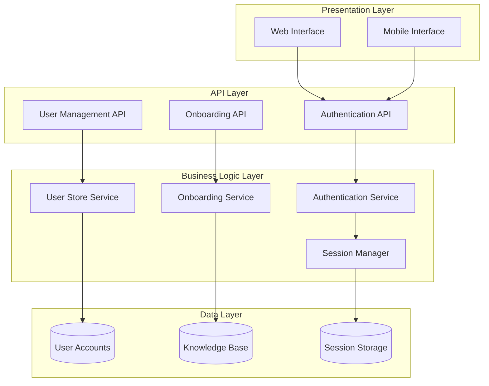
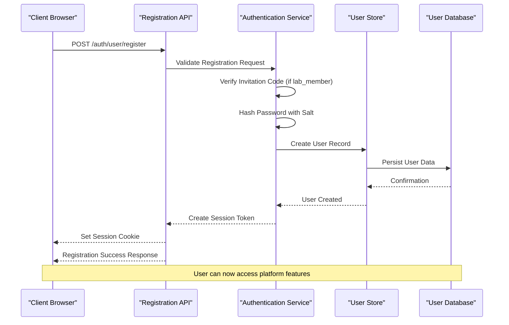
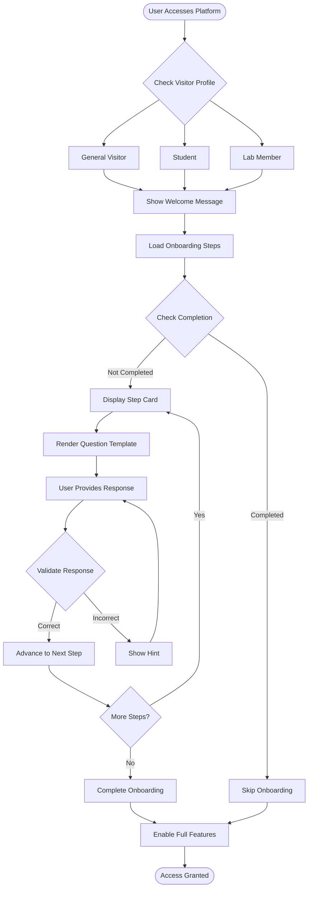
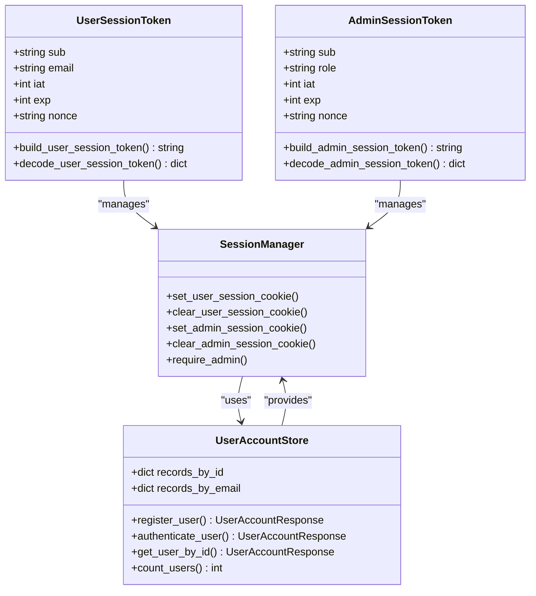
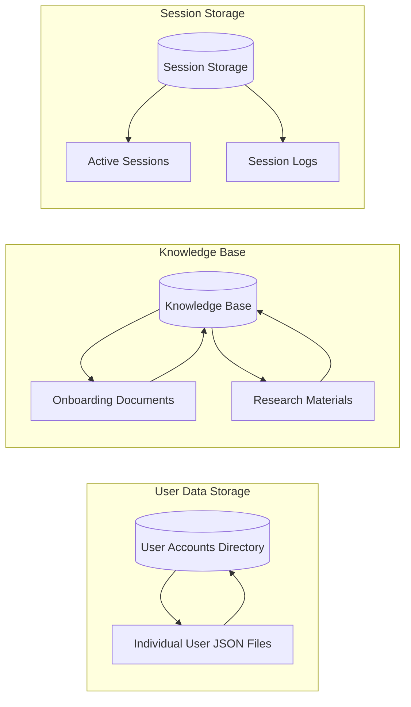

# User Onboarding System

<cite>
**Referenced Files in This Document**
- [README.md](file://README.md)
- [api.py](file://src/sage_faculty_twin/api.py)
- [auth.py](file://src/sage_faculty_twin/auth.py)
- [user_store.py](file://src/sage_faculty_twin/user_store.py)
- [models.py](file://src/sage_faculty_twin/models.py)
- [service.py](file://src/sage_faculty_twin/service.py)
- [config.py](file://src/sage_faculty_twin/config.py)
- [index.html](file://src/sage_faculty_twin/web/index.html)
- [app.js](file://src/sage_faculty_twin/web/app.js)
- [onboarding-first-month.json](file://data/knowledge_base/onboarding-first-month.json)
- [4a05e39e-61c2-44c5-93b7-64679cf48511.json](file://data/user_accounts/4a05e39e-61c2-44c5-93b7-64679cf48511.json)
</cite>

## Table of Contents
1. [Introduction](#introduction)
2. [System Architecture](#system-architecture)
3. [User Registration Flow](#user-registration-flow)
4. [Onboarding Experience](#onboarding-experience)
5. [Authentication System](#authentication-system)
6. [Data Storage](#data-storage)
7. [Configuration Management](#configuration-management)
8. [Security Implementation](#security-implementation)
9. [Troubleshooting Guide](#troubleshooting-guide)
10. [Conclusion](#conclusion)

## Introduction

The User Onboarding System is a comprehensive framework designed to seamlessly integrate new users into the SAGE Faculty Twin digital assistant platform. This system manages user registration, authentication, personalized onboarding experiences, and account lifecycle management. Built with FastAPI and modern web technologies, it provides a robust foundation for user engagement while maintaining security and scalability.

The system supports multiple user profiles including general visitors, students, and lab members, each with distinct permissions and capabilities. It leverages advanced session management, secure password handling, and intelligent knowledge-based guidance to create a personalized user journey from first visit to full platform utilization.

## System Architecture

The User Onboarding System follows a layered architecture pattern with clear separation of concerns across multiple components:

**Diagram sources**
- [api.py:512-530](file://src/sage_faculty_twin/api.py#L512-L530)
- [auth.py:45-86](file://src/sage_faculty_twin/auth.py#L45-L86)
- [user_store.py:62-122](file://src/sage_faculty_twin/user_store.py#L62-L122)

The architecture ensures scalability through lazy initialization of services and efficient resource management. The modular design allows for easy maintenance and extension of onboarding features.

**Section sources**
- [api.py:92-136](file://src/sage_faculty_twin/api.py#L92-L136)
- [service.py:96-133](file://src/sage_faculty_twin/service.py#L96-L133)

## User Registration Flow

The user registration process is designed to be intuitive and secure, with built-in validation and invitation code verification for lab members:

**Diagram sources**
- [api.py:512-517](file://src/sage_faculty_twin/api.py#L512-L517)
- [user_store.py:71-122](file://src/sage_faculty_twin/user_store.py#L71-L122)
- [auth.py:45-54](file://src/sage_faculty_twin/auth.py#L45-L54)

The registration flow includes comprehensive input validation, duplicate prevention, and secure credential handling. Invitation codes are required for lab member registration to maintain exclusive access to internal resources.

**Section sources**
- [user_store.py:71-105](file://src/sage_faculty_twin/user_store.py#L71-L105)
- [models.py:741-755](file://src/sage_faculty_twin/models.py#L741-L755)

## Onboarding Experience

The onboarding system provides an interactive guided tour tailored to different user profiles, ensuring new users can quickly understand and utilize the platform effectively:

**Diagram sources**
- [app.js:707-735](file://src/sage_faculty_twin/web/app.js#L707-L735)
- [index.html:115-143](file://src/sage_faculty_twin/web/index.html#L115-L143)

The onboarding experience is dynamically generated based on the user's visitor profile and includes progress tracking, step-by-step guidance, and automatic completion detection. Users can skip the onboarding process if they prefer to explore independently.

**Section sources**
- [app.js:692-761](file://src/sage_faculty_twin/web/app.js#L692-L761)
- [index.html:115-143](file://src/sage_faculty_twin/web/index.html#L115-L143)

## Authentication System

The authentication system implements secure session management with support for both user and admin authentication:

**Diagram sources**
- [auth.py:45-86](file://src/sage_faculty_twin/auth.py#L45-L86)
- [user_store.py:62-169](file://src/sage_faculty_twin/user_store.py#L62-L169)

The authentication system uses HMAC-signed JWT-like tokens stored in HTTP-only cookies for security. Passwords are hashed using scrypt with random salts, providing strong protection against attacks.

**Section sources**
- [auth.py:193-214](file://src/sage_faculty_twin/auth.py#L193-L214)
- [user_store.py:188-196](file://src/sage_faculty_twin/user_store.py#L188-L196)

## Data Storage

The system employs a multi-tiered storage approach to efficiently manage user data and onboarding information:

**Diagram sources**
- [config.py:86](file://src/sage_faculty_twin/config.py#L86)
- [config.py:63](file://src/sage_faculty_twin/config.py#L63)

User accounts are stored as individual JSON files in the user_accounts directory, allowing for efficient individual record access and updates. The knowledge base contains structured documents that guide the onboarding process and provide contextual information.

**Section sources**
- [config.py:86](file://src/sage_faculty_twin/config.py#L86)
- [onboarding-first-month.json:1-23](file://data/knowledge_base/onboarding-first-month.json#L1-L23)

## Configuration Management

The system uses a centralized configuration approach with environment variable support and default values:

| Configuration Parameter | Description | Default Value |
|------------------------|-------------|---------------|
| `user_session_secret` | Secret key for user session encryption | `change-me-user-session-secret` |
| `admin_session_secret` | Secret key for admin session encryption | `change-me-admin-session-secret` |
| `lab_member_invitation_code` | Required code for lab member registration | `SAGE-LAB-2026` |
| `lab_member_invitation_code_enabled` | Enable/disable invitation code requirement | `True` |
| `user_session_ttl_seconds` | User session expiration time | `2592000` (30 days) |
| `admin_session_ttl_seconds` | Admin session expiration time | `43200` (12 hours) |

The configuration system supports hierarchical loading from multiple sources including environment files and command-line arguments, ensuring flexibility across different deployment environments.

**Section sources**
- [config.py:132-148](file://src/sage_faculty_twin/config.py#L132-L148)
- [config.py:165](file://src/sage_faculty_twin/config.py#L165)

## Security Implementation

The User Onboarding System implements multiple layers of security to protect user data and maintain system integrity:

### Password Security
- Uses scrypt key derivation with 2^14 cost factor
- Random 16-byte salt generation per user
- 64-byte derived key length for enhanced security
- Constant-time comparison to prevent timing attacks

### Session Security
- HTTP-only cookies to prevent XSS attacks
- HMAC signature verification for session integrity
- Configurable expiration times for different user types
- Secure cookie handling with proper path and domain settings

### Access Control
- Role-based access control (RBAC) with super_admin and manager roles
- Invitation code verification for privileged access
- Session validation middleware for protected routes
- Graceful degradation when authentication fails

**Section sources**
- [user_store.py:188-196](file://src/sage_faculty_twin/user_store.py#L188-L196)
- [auth.py:182-214](file://src/sage_faculty_twin/auth.py#L182-L214)

## Troubleshooting Guide

### Common Registration Issues

**Problem**: Registration fails with "invitation code error"
- **Cause**: Incorrect or missing invitation code for lab_member profile
- **Solution**: Verify the invitation code matches the configured value and ensure the user profile is set to "lab_member"

**Problem**: Registration fails with "email already registered"
- **Cause**: Email address already exists in the system
- **Solution**: Use a different email address or log in with existing credentials

**Problem**: Password validation errors
- **Cause**: Password does not meet minimum requirements (8+ characters)
- **Solution**: Ensure password meets the minimum length requirement

### Authentication Issues

**Problem**: Session cookies not persisting
- **Cause**: Browser privacy settings blocking third-party cookies
- **Solution**: Check browser settings and ensure cookies are enabled for the domain

**Problem**: Login failures despite correct credentials
- **Cause**: Session token expiration or tampering
- **Solution**: Clear browser cookies and retry authentication

### Onboarding Experience Problems

**Problem**: Onboarding steps not displaying
- **Cause**: User has previously completed onboarding
- **Solution**: Reset onboarding completion status in local storage or use a different user profile

**Problem**: Knowledge base content not loading
- **Cause**: Missing or corrupted knowledge base files
- **Solution**: Verify knowledge base directory exists and contains required JSON files

**Section sources**
- [user_store.py:92-105](file://src/sage_faculty_twin/user_store.py#L92-L105)
- [auth.py:158-172](file://src/sage_faculty_twin/auth.py#L158-L172)

## Conclusion

The User Onboarding System represents a comprehensive solution for managing user integration and engagement in the SAGE Faculty Twin platform. Its modular architecture, robust security measures, and personalized user experience create a solid foundation for long-term user retention and satisfaction.

Key strengths of the system include its flexible profile-based approach, secure authentication mechanisms, and adaptive onboarding experience. The implementation demonstrates best practices in web application development, including proper separation of concerns, comprehensive error handling, and scalable data management.

Future enhancements could include expanded user profile types, enhanced analytics for onboarding effectiveness, and integration with external identity providers. The current architecture provides a strong foundation for these improvements while maintaining backward compatibility and system stability.