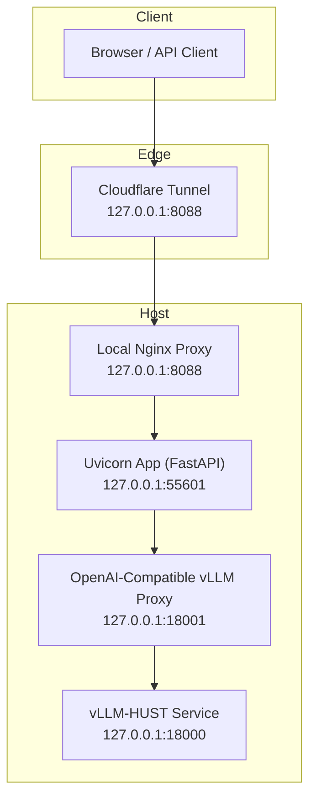
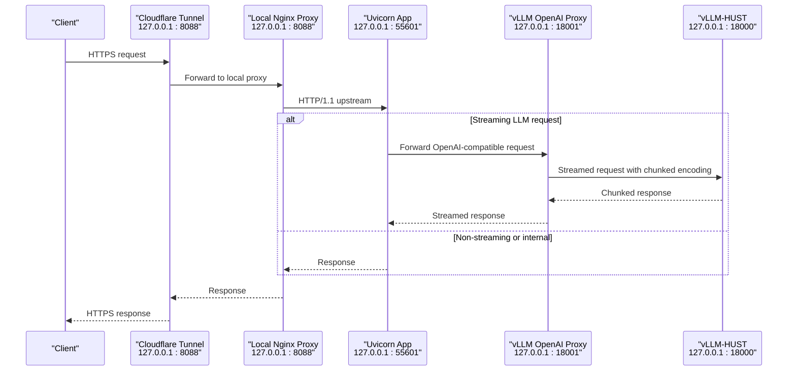
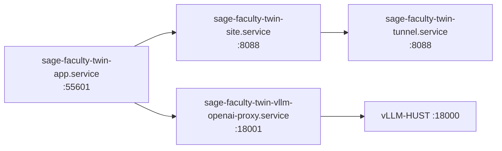

# Deployment Topology

<cite>
**Referenced Files in This Document**
- [sage-faculty-twin-app.service](file://deploy/systemd/user/sage-faculty-twin-app.service)
- [sage-faculty-twin-site.service](file://deploy/systemd/user/sage-faculty-twin-site.service)
- [sage-faculty-twin-tunnel.service](file://deploy/systemd/user/sage-faculty-twin-tunnel.service)
- [sage-faculty-twin-vllm-openai-proxy.service](file://deploy/systemd/user/sage-faculty-twin-vllm-openai-proxy.service)
- [nginx-local.conf](file://tools/nginx-local.conf)
- [cloudflared-config.example.yml](file://tools/cloudflared-config.example.yml)
- [run_app_server.sh](file://tools/run_app_server.sh)
- [run_local_proxy.sh](file://tools/run_local_proxy.sh)
- [run_named_tunnel.sh](file://tools/run_named_tunnel.sh)
- [run_vllm_openai_proxy.sh](file://tools/run_vllm_openai_proxy.sh)
- [local_site_proxy.py](file://tools/local_site_proxy.py)
- [vllm_openai_proxy.py](file://src/sage_faculty_twin/vllm_openai_proxy.py)
- [api.py](file://src/sage_faculty_twin/api.py)
- [deployment.md](file://docs/deployment.md)
- [quickstart.sh](file://quickstart.sh)
- [run_qwen3_32b_service.sh](file://run_qwen3_32b_service.sh)
</cite>

## Table of Contents
1. [Introduction](#introduction)
2. [Project Structure](#project-structure)
3. [Core Components](#core-components)
4. [Architecture Overview](#architecture-overview)
5. [Detailed Component Analysis](#detailed-component-analysis)
6. [Dependency Analysis](#dependency-analysis)
7. [Performance Considerations](#performance-considerations)
8. [Troubleshooting Guide](#troubleshooting-guide)
9. [Conclusion](#conclusion)

## Introduction
This document explains the complete deployment topology for the Sage Faculty Twin system. It covers the application server, local reverse proxy, upstream OpenAI-compatible proxy, and Cloudflare Tunnel integration. It details streaming proxy configuration for chunked transfer encoding and timeout handling, and provides network topology diagrams showing traffic flow from clients to LLM backends. Port configurations, service discovery, and load balancing considerations are included to help operators deploy and operate the system reliably.

## Project Structure
The deployment relies on four systemd user services that orchestrate:
- Uvicorn application server (FastAPI)
- Local Nginx reverse proxy
- Cloudflare Tunnel
- OpenAI-compatible vLLM proxy

Supporting scripts and templates define runtime behavior, environment variables, and configuration.

**Diagram sources**
- [sage-faculty-twin-tunnel.service](file://deploy/systemd/user/sage-faculty-twin-tunnel.service)
- [sage-faculty-twin-site.service](file://deploy/systemd/user/sage-faculty-twin-site.service)
- [sage-faculty-twin-app.service](file://deploy/systemd/user/sage-faculty-twin-app.service)
- [sage-faculty-twin-vllm-openai-proxy.service](file://deploy/systemd/user/sage-faculty-twin-vllm-openai-proxy.service)
- [nginx-local.conf](file://tools/nginx-local.conf)
- [run_qwen3_32b_service.sh](file://run_qwen3_32b_service.sh)

**Section sources**
- [sage-faculty-twin-app.service](file://deploy/systemd/user/sage-faculty-twin-app.service)
- [sage-faculty-twin-site.service](file://deploy/systemd/user/sage-faculty-twin-site.service)
- [sage-faculty-twin-tunnel.service](file://deploy/systemd/user/sage-faculty-twin-tunnel.service)
- [sage-faculty-twin-vllm-openai-proxy.service](file://deploy/systemd/user/sage-faculty-twin-vllm-openai-proxy.service)
- [nginx-local.conf](file://tools/nginx-local.conf)
- [cloudflared-config.example.yml](file://tools/cloudflared-config.example.yml)

## Core Components
- Application server (FastAPI/Uvicorn): Listens on 127.0.0.1:55601, serves the web UI and APIs, and integrates with knowledge backends and LLM clients.
- Local reverse proxy (Nginx): Listens on 127.0.0.1:8088, forwards to the app, handles streaming and timeouts, and acts as a fallback to a Python-based proxy if Nginx is unavailable.
- Cloudflare Tunnel: Exposes the local site securely to the internet, routing traffic to the local Nginx proxy.
- Upstream OpenAI-compatible vLLM proxy: Listens on 127.0.0.1:18001, forwards requests to the vLLM-HUST service at 127.0.0.1:18000, preserving chunked transfer encoding for streaming.

Key ports and roles:
- 55601: Uvicorn application server
- 8088: Local Nginx proxy (also exposed via Cloudflare Tunnel)
- 18001: OpenAI-compatible vLLM proxy
- 18000: vLLM-HUST service

**Section sources**
- [sage-faculty-twin-app.service](file://deploy/systemd/user/sage-faculty-twin-app.service)
- [sage-faculty-twin-site.service](file://deploy/systemd/user/sage-faculty-twin-site.service)
- [sage-faculty-twin-tunnel.service](file://deploy/systemd/user/sage-faculty-twin-tunnel.service)
- [sage-faculty-twin-vllm-openai-proxy.service](file://deploy/systemd/user/sage-faculty-twin-vllm-openai-proxy.service)
- [nginx-local.conf](file://tools/nginx-local.conf)
- [run_qwen3_32b_service.sh](file://run_qwen3_32b_service.sh)

## Architecture Overview
The system is designed for secure, low-latency access to the LLM pipeline. Traffic flows from clients through Cloudflare Tunnel to the local Nginx proxy, which forwards to the FastAPI application. The application optionally routes LLM requests through the OpenAI-compatible vLLM proxy to the vLLM-HUST service, ensuring chunked transfer encoding for streaming.

**Diagram sources**
- [sage-faculty-twin-tunnel.service](file://deploy/systemd/user/sage-faculty-twin-tunnel.service)
- [nginx-local.conf](file://tools/nginx-local.conf)
- [api.py](file://src/sage_faculty_twin/api.py)
- [vllm_openai_proxy.py](file://src/sage_faculty_twin/vllm_openai_proxy.py)
- [run_qwen3_32b_service.sh](file://run_qwen3_32b_service.sh)

## Detailed Component Analysis

### Application Server (FastAPI/Uvicorn)
- Service definition sets the app port and environment variables, including the public homepage URL.
- The application exposes endpoints for chat, SSE workflow events, and health checks.
- Streaming behavior and timeouts are controlled by environment variables and enforced with asyncio wait-for guards.

Operational notes:
- Port: 127.0.0.1:55601
- Health and SSE endpoints support long-lived connections and keepalive messages to prevent edge proxy timeouts.
- Chat request timeout is configurable and defaults to a value below Cloudflare’s edge timeout.

**Section sources**
- [sage-faculty-twin-app.service](file://deploy/systemd/user/sage-faculty-twin-app.service)
- [api.py](file://src/sage_faculty_twin/api.py)
- [deployment.md](file://docs/deployment.md)

### Local Reverse Proxy (Nginx)
- Template defines client body limits and proxy timeouts suitable for long LLM responses.
- Enables HTTP/1.1 and preserves hop-by-hop headers while setting forwarded headers.
- Provides graceful fallback to a Python-based proxy if Nginx is unavailable.

Key behaviors:
- client_max_body_size tuned to exceed the application’s attachment limit.
- proxy_read_timeout and proxy_send_timeout extended to accommodate long LLM generations.
- proxy_buffering disabled to preserve streaming semantics.

**Section sources**
- [nginx-local.conf](file://tools/nginx-local.conf)
- [run_local_proxy.sh](file://tools/run_local_proxy.sh)
- [local_site_proxy.py](file://tools/local_site_proxy.py)

### Cloudflare Tunnel
- Requires a configuration file with tunnel credentials and ingress mapping to the local site proxy.
- Starts after the local proxy is reachable, ensuring zero-downtime exposure.

Operational notes:
- Tunnel ingress maps to 127.0.0.1:8088.
- The tunnel service depends on the local site service.

**Section sources**
- [sage-faculty-twin-tunnel.service](file://deploy/systemd/user/sage-faculty-twin-tunnel.service)
- [run_named_tunnel.sh](file://tools/run_named_tunnel.sh)
- [cloudflared-config.example.yml](file://tools/cloudflared-config.example.yml)

### Upstream OpenAI-Compatible vLLM Proxy
- Listens on 127.0.0.1:18001 and forwards to vLLM-HUST at 127.0.0.1:18000.
- Preserves hop-by-hop headers and forwards Authorization/API keys appropriately.
- Supports streaming responses by forwarding chunked transfer encoding from the upstream.

Operational notes:
- Path prefix and upstream base URL are configurable via environment variables.
- The proxy enforces a timeout on upstream requests and returns appropriate HTTP statuses.

**Section sources**
- [sage-faculty-twin-vllm-openai-proxy.service](file://deploy/systemd/user/sage-faculty-twin-vllm-openai-proxy.service)
- [run_vllm_openai_proxy.sh](file://tools/run_vllm_openai_proxy.sh)
- [vllm_openai_proxy.py](file://src/sage_faculty_twin/vllm_openai_proxy.py)

### vLLM-HUST Service
- Example service script demonstrates running a Qwen3-32B model with chunked prefill and tool-calling enabled.
- Operates on 127.0.0.1:18000 and is intended to be proxied by the OpenAI-compatible proxy.

**Section sources**
- [run_qwen3_32b_service.sh](file://run_qwen3_32b_service.sh)

## Dependency Analysis
The deployment uses systemd user services with explicit ordering and dependencies:
- The local site proxy requires the application server to be ready.
- The Cloudflare tunnel requires the local site proxy to be ready.
- The vLLM OpenAI proxy is independent and can be started alongside the app.

**Diagram sources**
- [sage-faculty-twin-app.service](file://deploy/systemd/user/sage-faculty-twin-app.service)
- [sage-faculty-twin-site.service](file://deploy/systemd/user/sage-faculty-twin-site.service)
- [sage-faculty-twin-tunnel.service](file://deploy/systemd/user/sage-faculty-twin-tunnel.service)
- [sage-faculty-twin-vllm-openai-proxy.service](file://deploy/systemd/user/sage-faculty-twin-vllm-openai-proxy.service)

**Section sources**
- [sage-faculty-twin-app.service](file://deploy/systemd/user/sage-faculty-twin-app.service)
- [sage-faculty-twin-site.service](file://deploy/systemd/user/sage-faculty-twin-site.service)
- [sage-faculty-twin-tunnel.service](file://deploy/systemd/user/sage-faculty-twin-tunnel.service)
- [sage-faculty-twin-vllm-openai-proxy.service](file://deploy/systemd/user/sage-faculty-twin-vllm-openai-proxy.service)

## Performance Considerations
- Streaming and chunked transfer encoding:
  - The application’s SSE endpoints emit keepalive events to prevent idle timeouts.
  - The OpenAI-compatible proxy preserves chunked transfer encoding from the upstream.
  - The Nginx template disables proxy buffering and increases read/send timeouts to avoid truncating long responses.
- Timeouts:
  - Application-level chat timeout guard prevents Cloudflare edge timeouts.
  - Proxy-level timeouts are configured to exceed typical LLM generation durations.
- Attachment sizes:
  - Nginx client_max_body_size is increased to support large file uploads.

**Section sources**
- [api.py](file://src/sage_faculty_twin/api.py)
- [vllm_openai_proxy.py](file://src/sage_faculty_twin/vllm_openai_proxy.py)
- [nginx-local.conf](file://tools/nginx-local.conf)
- [deployment.md](file://docs/deployment.md)

## Troubleshooting Guide
- Cloudflare Tunnel fails to start:
  - Ensure the tunnel configuration exists and is valid; the runner checks for the presence of the config file and exits with guidance if missing.
  - Verify the local site proxy responds on 127.0.0.1:8088 before starting the tunnel.
- Local Nginx not available:
  - The local proxy script falls back to a Python-based proxy if Nginx is not installed.
  - Confirm the fallback proxy binds to SITE_PORT and forwards to APP_PORT.
- Upstream proxy conflicts:
  - The vLLM proxy runner validates that the listen address is unused before starting.
- Streaming not working:
  - Verify the upstream OpenAI-compatible endpoint emits Transfer-Encoding: chunked.
  - Confirm the application’s streaming flag and SSE keepalive settings are aligned with the deployment environment.

**Section sources**
- [run_named_tunnel.sh](file://tools/run_named_tunnel.sh)
- [run_local_proxy.sh](file://tools/run_local_proxy.sh)
- [local_site_proxy.py](file://tools/local_site_proxy.py)
- [run_vllm_openai_proxy.sh](file://tools/run_vllm_openai_proxy.sh)
- [deployment.md](file://docs/deployment.md)

## Conclusion
The deployment topology integrates a local Nginx proxy, a Cloudflare Tunnel, a FastAPI application server, and an OpenAI-compatible vLLM proxy to deliver a secure, streaming-friendly LLM pipeline. Proper configuration of timeouts, chunked transfer encoding, and service dependencies ensures reliable operation under real-world conditions. Operators should validate streaming behavior and tune timeouts according to their LLM backend characteristics.