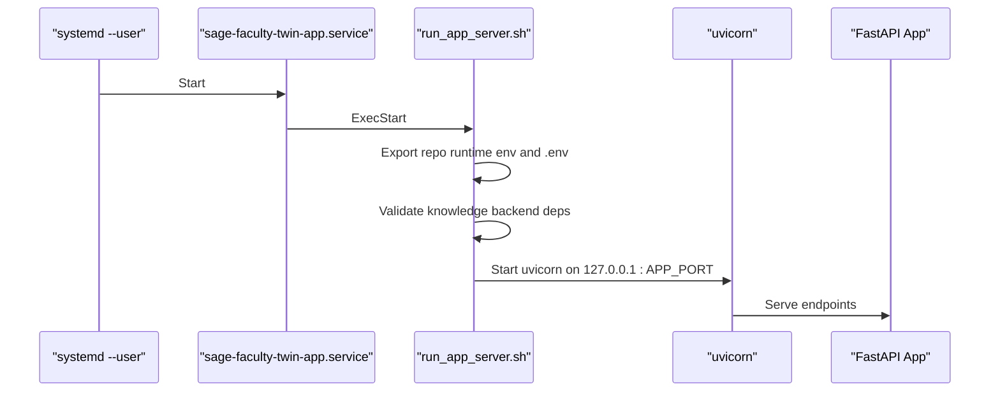
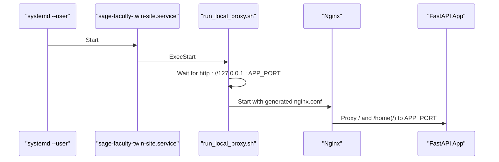
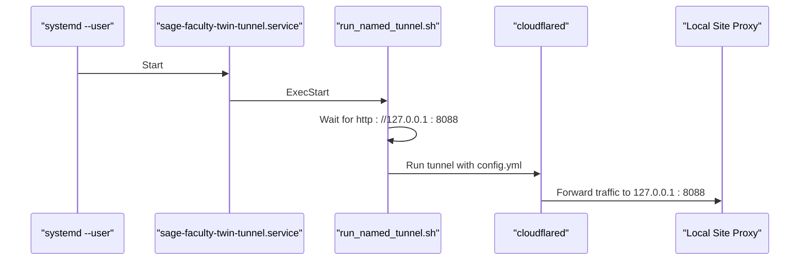
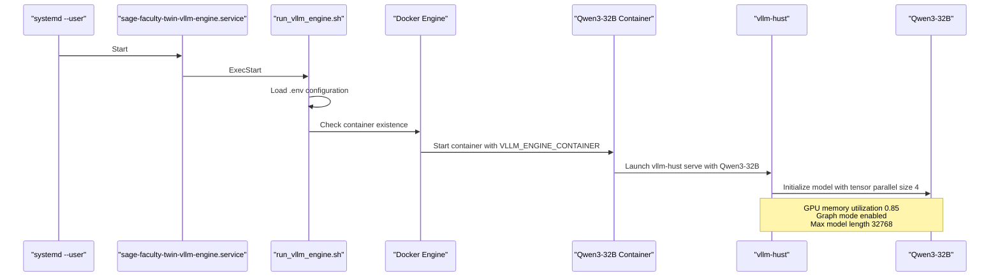
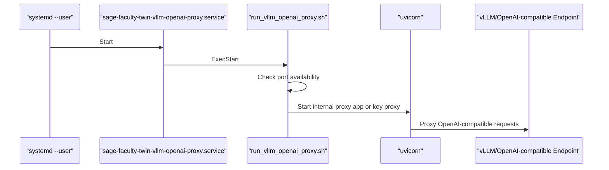
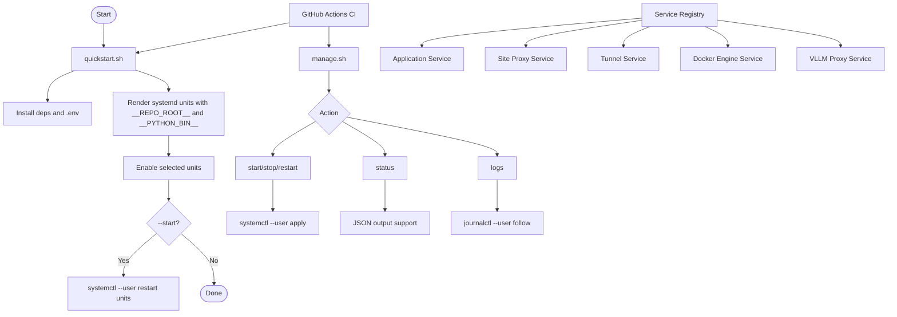
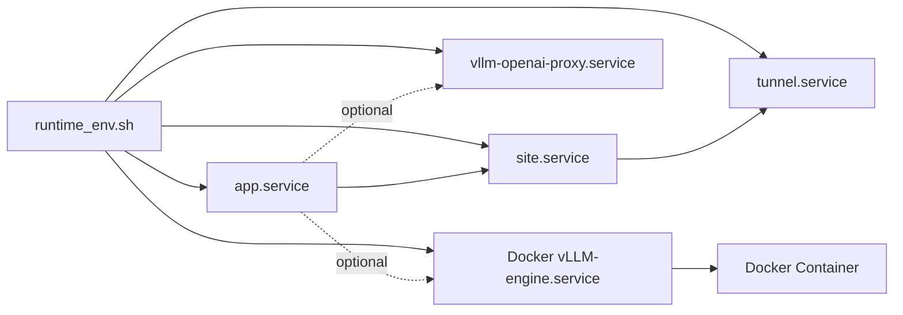

# Deployment and Operations

<cite>
**Referenced Files in This Document**
- [deployment.md](file://docs/deployment.md)
- [systemd-runtime-notes.md](file://docs/systemd-runtime-notes.md)
- [sage-faculty-twin-app.service](file://deploy/systemd/user/sage-faculty-twin-app.service)
- [sage-faculty-twin-site.service](file://deploy/systemd/user/sage-faculty-twin-site.service)
- [sage-faculty-twin-tunnel.service](file://deploy/systemd/user/sage-faculty-twin-tunnel.service)
- [sage-faculty-twin-vllm-engine.service](file://deploy/systemd/user/sage-faculty-twin-vllm-engine.service)
- [sage-faculty-twin-vllm-openai-proxy.service](file://deploy/systemd/user/sage-faculty-twin-vllm-openai-proxy.service)
- [manage.sh](file://manage.sh)
- [quickstart.sh](file://quickstart.sh)
- [runtime_env.sh](file://tools/lib/runtime_env.sh)
- [run_vllm_engine.sh](file://tools/run_vllm_engine.sh)
- [run_app_server.sh](file://tools/run_app_server.sh)
- [run_local_proxy.sh](file://tools/run_local_proxy.sh)
- [reload_local_proxy.sh](file://tools/reload_local_proxy.sh)
- [run_named_tunnel.sh](file://tools/run_named_tunnel.sh)
- [run_vllm_openai_proxy.sh](file://tools/run_vllm_openai_proxy.sh)
- [nginx-local.conf](file://tools/nginx-local.conf)
- [cloudflared-config.example.yml](file://tools/cloudflared-config.example.yml)
- [ci.yml](file://.github/workflows/ci.yml)
- [CHANGELOG.md](file://CHANGELOG.md)
- [README.md](file://README.md)
</cite>

## Update Summary
**Changes Made**
- Updated to reflect Docker-only deployment architecture replacing virtual environment support
- Removed venv management logic and host-binary mode in favor of Docker container execution
- Updated deployment procedures to reflect new Docker-centric workflow
- Enhanced service management to accommodate Docker-based model engine execution
- Updated CI/CD workflow to support Docker container deployment

## Table of Contents
1. [Introduction](#introduction)
2. [Project Structure](#project-structure)
3. [Core Components](#core-components)
4. [Architecture Overview](#architecture-overview)
5. [Detailed Component Analysis](#detailed-component-analysis)
6. [Dependency Analysis](#dependency-analysis)
7. [Performance Considerations](#performance-considerations)
8. [Monitoring and Logging](#monitoring-and-logging)
9. [Maintenance Procedures](#maintenance-procedures)
10. [Scaling Considerations](#scaling-considerations)
11. [Backup and Disaster Recovery](#backup-and-disaster-recovery)
12. [Troubleshooting Guide](#troubleshooting-guide)
13. [Conclusion](#conclusion)

## Introduction
This document provides comprehensive deployment and operations guidance for the Sage Faculty Twin system. It covers systemd user service configuration, service management scripts, production deployment procedures, monitoring/logging, maintenance, scaling, backup, and disaster recovery. The system now features a Docker-only deployment architecture that replaces the previous virtual environment support and host-binary mode with containerized execution for all components.

**Updated** The deployment architecture has been completely redesigned to use Docker containers exclusively for model engine execution, eliminating virtual environment management and host-binary mode support. The system now relies on Docker containers for consistent, portable deployments across different environments.

## Project Structure
The deployment artifacts and operational scripts are organized as follows:
- Systemd user service units under deploy/systemd/user
- Management and orchestration scripts under tools and at repo root
- Unified runtime management via manage.sh and quickstart.sh
- Operational documentation under docs
- CI/CD workflows under .github/workflows
- Docker-based model engine execution with container management

```mermaid
graph TB
subgraph "Docker Containerized Services"
CONTAINER["Docker Engine Container"]
VLLM["Qwen3-32B Model Container"]
PROXY["OpenAI-Compatible Proxy Container"]
ENDSUB
subgraph "Systemd User Units"
APP["sage-faculty-twin-app.service"]
SITE["sage-faculty-twin-site.service"]
TUN["sage-faculty-twin-tunnel.service"]
ENGINE["sage-faculty-twin-vllm-engine.service"]
VPXY["sage-faculty-twin-vllm-openai-proxy.service"]
end
subgraph "Unified Management Scripts"
MNG["manage.sh"]
QS["quickstart.sh"]
ENV["runtime_env.sh"]
end
subgraph "Container Management"
RUNAPP["run_app_server.sh"]
RUNSITE["run_local_proxy.sh"]
RUNTUN["run_named_tunnel.sh"]
RUNENGINE["run_vllm_engine.sh"]
RUNVPXY["run_vllm_openai_proxy.sh"]
RELOAD["reload_local_proxy.sh"]
NGINX["nginx-local.conf"]
CFYML["cloudflared-config.example.yml"]
end
subgraph "CI/CD Infrastructure"
CI["GitHub Actions CI"]
ENDSUB
MNG --> ENV
QS --> ENV
ENV --> APP
ENV --> SITE
ENV --> TUN
ENV --> ENGINE
ENV --> VPXY
APP --> RUNAPP
SITE --> RUNSITE
TUN --> RUNTUN
ENGINE --> RUNENGINE
VPXY --> RUNVPXY
RUNSITE --> NGINX
RUNTUN --> CFYML
CI --> QS
CI --> MNG
```

**Diagram sources**
- [sage-faculty-twin-app.service](file://deploy/systemd/user/sage-faculty-twin-app.service)
- [sage-faculty-twin-site.service](file://deploy/systemd/user/sage-faculty-twin-site.service)
- [sage-faculty-twin-tunnel.service](file://deploy/systemd/user/sage-faculty-twin-tunnel.service)
- [sage-faculty-twin-vllm-engine.service](file://deploy/systemd/user/sage-faculty-twin-vllm-engine.service)
- [sage-faculty-twin-vllm-openai-proxy.service](file://deploy/systemd/user/sage-faculty-twin-vllm-openai-proxy.service)
- [manage.sh](file://manage.sh)
- [quickstart.sh](file://quickstart.sh)
- [runtime_env.sh](file://tools/lib/runtime_env.sh)
- [run_vllm_engine.sh](file://tools/run_vllm_engine.sh)
- [run_app_server.sh](file://tools/run_app_server.sh)
- [run_local_proxy.sh](file://tools/run_local_proxy.sh)
- [run_named_tunnel.sh](file://tools/run_named_tunnel.sh)
- [run_vllm_openai_proxy.sh](file://tools/run_vllm_openai_proxy.sh)
- [nginx-local.conf](file://tools/nginx-local.conf)
- [cloudflared-config.example.yml](file://tools/cloudflared-config.example.yml)
- [ci.yml](file://.github/workflows/ci.yml)

**Section sources**
- [deployment.md](file://docs/deployment.md)
- [systemd-runtime-notes.md](file://docs/systemd-runtime-notes.md)
- [CHANGELOG.md](file://CHANGELOG.md)
- [README.md](file://README.md)

## Core Components
- **Application server**: FastAPI app served via uvicorn, launched by run_app_server.sh and managed by the app systemd unit.
- **Local site proxy**: Nginx-based reverse proxy for local development and compatibility routes, launched by run_local_proxy.sh and managed by the site systemd unit.
- **Cloudflare tunnel**: Named tunnel managed by run_named_tunnel.sh and systemd unit; forwards traffic to the local site proxy.
- **Docker-based vLLM inference engine**: Qwen3-32B model service managed by run_vllm_engine.sh and systemd unit with Docker container execution and Ascend NPU acceleration.
- **OpenAI-compatible vLLM proxy**: Optional OpenAI-compatible proxy for model requests, launched by run_vllm_openai_proxy.sh and managed by the vllm-openai-proxy systemd unit.
- **Unified management**: manage.sh orchestrates all service actions with JSON output support; quickstart.sh bootstraps environment, installs services, and manages systemd units with Docker container support.
- **Runtime environment**: runtime_env.sh provides deterministic Python interpreter and PYTHONPATH resolution across all entry points.
- **Enhanced CI/CD**: GitHub Actions workflow with --no-siblings flag for optimized sibling repository handling during automated deployments.

**Updated** The vLLM inference engine now runs exclusively inside Docker containers, requiring the VLLM_ENGINE_CONTAINER variable to be set in .env. The engine management script automatically escalates to sudo docker when needed for container operations.

Key operational variables and ports:
- Application server port: configurable via APP_PORT (default 55601)
- Site proxy port: configurable via SITE_PORT (default 8088)
- Docker container-based vLLM engine host/port: configurable via VLLM_ENGINE_CONTAINER and related environment variables
- vLLM proxy host/port: configurable via VLLM_PROXY_HOST/VLLM_PROXY_PORT (default 127.0.0.1:18001)
- Upstream base URL for vLLM proxy: VLLM_PROXY_UPSTREAM_BASE_URL (default http://127.0.0.1:18000/v1)
- Path prefix for vLLM proxy: VLLM_PROXY_PATH_PREFIX (default /v1)
- Qwen3-32B model service: Ascend NPU acceleration with tensor parallel size 4, running inside Docker container

**Section sources**
- [sage-faculty-twin-app.service](file://deploy/systemd/user/sage-faculty-twin-app.service)
- [sage-faculty-twin-site.service](file://deploy/systemd/user/sage-faculty-twin-site.service)
- [sage-faculty-twin-tunnel.service](file://deploy/systemd/user/sage-faculty-twin-tunnel.service)
- [sage-faculty-twin-vllm-engine.service](file://deploy/systemd/user/sage-faculty-twin-vllm-engine.service)
- [sage-faculty-twin-vllm-openai-proxy.service](file://deploy/systemd/user/sage-faculty-twin-vllm-openai-proxy.service)
- [run_app_server.sh](file://tools/run_app_server.sh)
- [run_local_proxy.sh](file://tools/run_local_proxy.sh)
- [run_named_tunnel.sh](file://tools/run_named_tunnel.sh)
- [run_vllm_engine.sh](file://tools/run_vllm_engine.sh)
- [run_vllm_openai_proxy.sh](file://tools/run_vllm_openai_proxy.sh)
- [nginx-local.conf](file://tools/nginx-local.conf)
- [cloudflared-config.example.yml](file://tools/cloudflared-config.example.yml)
- [CHANGELOG.md](file://CHANGELOG.md)
- [README.md](file://README.md)

## Architecture Overview
The deployment topology consists of Docker containerized services with streamlined operations and enhanced CI/CD workflows:
- **Model layer**: Docker-based vLLM-HUST inference engine with Ascend NPU acceleration for Qwen3-32B
- **Application layer**: FastAPI app exposing chat and related endpoints
- **Proxy layer**: Local Nginx proxy for local development and compatibility routes; optional Cloudflare tunnel for public ingress
- **Control plane**: Unified systemd user services and consolidated management scripts with Docker container support
- **CI/CD pipeline**: GitHub Actions workflow with optimized sibling repository handling via --no-siblings flag

**Updated** The architecture now features Docker containers for all services, with the vLLM engine running in dedicated containers rather than host binaries. This provides better isolation, portability, and consistent environment management across different deployment targets.

```mermaid
graph TB
subgraph "External"
CF["Cloudflare Tunnel"]
VLLM["External vLLM Serving"]
ENDSUB
subgraph "Host"
subgraph "Docker Container Layer"
CONT["Docker Engine"]
VLLMCONT["Qwen3-32B Container"]
PROXYCONT["Proxy Container"]
ENDSUB
subgraph "Model Layer"
ENGINE["vLLM-HUST Engine<br/>Qwen3-32B (Ascend NPU)<br/>Docker Container"]
RUNENG["run_vllm_engine.sh"]
ENDSUB
subgraph "Proxy Layer"
NGINX["Local Nginx (site)"]
TUNNEL["Cloudflared Tunnel"]
ENDSUB
subgraph "Application Layer"
APP["FastAPI App (:55601)"]
VPXY["OpenAI-compatible vLLM Proxy (:18001)"]
ENDSUB
subgraph "Control Plane"
SYS["systemd --user"]
MGMT["manage.sh / quickstart.sh"]
ENV["runtime_env.sh"]
CI["GitHub Actions CI"]
ENDSUB
end
CF --> TUNNEL
TUNNEL --> NGINX
NGINX --> APP
APP --> VPXY
CONT --> VLLMCONT
CONT --> PROXYCONT
VLLMCONT --> ENGINE
RUNENG --> ENGINE
SYS --> APP
SYS --> NGINX
SYS --> TUNNEL
SYS --> VPXY
SYS --> ENGINE
MGMT --> SYS
ENV --> MGMT
ENV --> SYS
CI --> QS
CI --> MNG
```

**Diagram sources**
- [deployment.md](file://docs/deployment.md)
- [systemd-runtime-notes.md](file://docs/systemd-runtime-notes.md)
- [sage-faculty-twin-app.service](file://deploy/systemd/user/sage-faculty-twin-app.service)
- [sage-faculty-twin-site.service](file://deploy/systemd/user/sage-faculty-twin-site.service)
- [sage-faculty-twin-tunnel.service](file://deploy/systemd/user/sage-faculty-twin-tunnel.service)
- [sage-faculty-twin-vllm-engine.service](file://deploy/systemd/user/sage-faculty-twin-vllm-engine.service)
- [sage-faculty-twin-vllm-openai-proxy.service](file://deploy/systemd/user/sage-faculty-twin-vllm-openai-proxy.service)
- [run_app_server.sh](file://tools/run_app_server.sh)
- [run_local_proxy.sh](file://tools/run_local_proxy.sh)
- [run_named_tunnel.sh](file://tools/run_named_tunnel.sh)
- [run_vllm_engine.sh](file://tools/run_vllm_engine.sh)
- [run_vllm_openai_proxy.sh](file://tools/run_vllm_openai_proxy.sh)
- [nginx-local.conf](file://tools/nginx-local.conf)
- [cloudflared-config.example.yml](file://tools/cloudflared-config.example.yml)
- [ci.yml](file://.github/workflows/ci.yml)
- [CHANGELOG.md](file://CHANGELOG.md)
- [README.md](file://README.md)

## Detailed Component Analysis

### Application Server
- **Purpose**: Host the FastAPI application on loopback interface
- **Startup**: Managed by systemd unit; ExecStart invokes run_app_server.sh which sets environment, validates knowledge backend dependencies, and starts uvicorn
- **Ports**: Listens on 127.0.0.1:APP_PORT (default 55601)
- **Environment**: PYTHON_BIN, APP_PORT, DIGITAL_TWIN_HOMEPAGE_PUBLIC_URL, and .env-loaded variables



**Diagram sources**
- [sage-faculty-twin-app.service](file://deploy/systemd/user/sage-faculty-twin-app.service)
- [run_app_server.sh](file://tools/run_app_server.sh)

**Section sources**
- [sage-faculty-twin-app.service](file://deploy/systemd/user/sage-faculty-twin-app.service)
- [run_app_server.sh](file://tools/run_app_server.sh)
- [deployment.md](file://docs/deployment.md)

### Local Site Proxy
- **Purpose**: Provide local development site and compatibility routes (/home, /home/) and proxy to the app
- **Startup**: Managed by systemd unit; ExecStart invokes run_local_proxy.sh which waits for the app and then starts Nginx using tools/nginx-local.conf
- **Ports**: Listens on SITE_PORT (default 8088); proxies to APP_PORT
- **Reload**: reload_local_proxy.sh regenerates config, validates, and reloads Nginx



**Diagram sources**
- [sage-faculty-twin-site.service](file://deploy/systemd/user/sage-faculty-twin-site.service)
- [run_local_proxy.sh](file://tools/run_local_proxy.sh)
- [reload_local_proxy.sh](file://tools/reload_local_proxy.sh)
- [nginx-local.conf](file://tools/nginx-local.conf)

**Section sources**
- [sage-faculty-twin-site.service](file://deploy/systemd/user/sage-faculty-twin-site.service)
- [run_local_proxy.sh](file://tools/run_local_proxy.sh)
- [reload_local_proxy.sh](file://tools/reload_local_proxy.sh)
- [nginx-local.conf](file://tools/nginx-local.conf)
- [deployment.md](file://docs/deployment.md)

### Cloudflare Tunnel
- **Purpose**: Provide public ingress via Cloudflare Tunnel to the local site proxy
- **Startup**: Managed by systemd unit; ExecStart invokes run_named_tunnel.sh which waits for the local site proxy and then runs cloudflared with credentials and config
- **Configuration**: Requires a Cloudflare tunnel config YAML with hostname and service mapping to 127.0.0.1:8088



**Diagram sources**
- [sage-faculty-twin-tunnel.service](file://deploy/systemd/user/sage-faculty-twin-tunnel.service)
- [run_named_tunnel.sh](file://tools/run_named_tunnel.sh)
- [cloudflared-config.example.yml](file://tools/cloudflared-config.example.yml)

**Section sources**
- [sage-faculty-twin-tunnel.service](file://deploy/systemd/user/sage-faculty-twin-tunnel.service)
- [run_named_tunnel.sh](file://tools/run_named_tunnel.sh)
- [cloudflared-config.example.yml](file://tools/cloudflared-config.example.yml)
- [deployment.md](file://docs/deployment.md)

### Docker-Based vLLM Inference Engine
- **Purpose**: Provide Qwen3-32B model inference service with Ascend NPU acceleration inside Docker containers
- **Startup**: Managed by systemd unit; ExecStart invokes run_vllm_engine.sh which loads .env configuration and launches Docker container with vllm-hust serve
- **Configuration**: All tunable parameters read from .env (model_path, served_model_name, host, port, tp_size, max_model_len, gpu_mem_util, api_key)
- **Container Management**: VLLM_ENGINE_CONTAINER variable required in .env; automatic escalation to sudo docker when needed
- **Hardware**: Ascend NPU acceleration with configurable device selection via ASCEND_RT_VISIBLE_DEVICES

**Updated** The vLLM engine now runs exclusively inside Docker containers, requiring the VLLM_ENGINE_CONTAINER variable to be set in .env. The engine management script automatically handles Docker container operations and can escalate to sudo privileges when needed for container management.



**Diagram sources**
- [sage-faculty-twin-vllm-engine.service](file://deploy/systemd/user/sage-faculty-twin-vllm-engine.service)
- [run_vllm_engine.sh](file://tools/run_vllm_engine.sh)

**Section sources**
- [sage-faculty-twin-vllm-engine.service](file://deploy/systemd/user/sage-faculty-twin-vllm-engine.service)
- [run_vllm_engine.sh](file://tools/run_vllm_engine.sh)
- [deployment.md](file://docs/deployment.md)
- [CHANGELOG.md](file://CHANGELOG.md)
- [README.md](file://README.md)

### OpenAI-Compatible vLLM Proxy
- **Purpose**: Provide an OpenAI-compatible interface for model requests, optionally forwarding to a local vLLM instance
- **Startup**: Managed by systemd unit; ExecStart invokes run_vllm_openai_proxy.sh which checks port availability, validates uvicorn presence, and starts either the internal proxy app or a key proxy
- **Ports**: Listens on VLLM_PROXY_HOST:VLLM_PROXY_PORT (default 127.0.0.1:18001)
- **Upstream**: VLLM_PROXY_UPSTREAM_BASE_URL (default http://127.0.0.1:18000/v1), path prefix VLLM_PROXY_PATH_PREFIX (default /v1)



**Diagram sources**
- [sage-faculty-twin-vllm-openai-proxy.service](file://deploy/systemd/user/sage-faculty-twin-vllm-openai-proxy.service)
- [run_vllm_openai_proxy.sh](file://tools/run_vllm_openai_proxy.sh)

**Section sources**
- [sage-faculty-twin-vllm-openai-proxy.service](file://deploy/systemd/user/sage-faculty-twin-vllm-openai-proxy.service)
- [run_vllm_openai_proxy.sh](file://tools/run_vllm_openai_proxy.sh)
- [deployment.md](file://docs/deployment.md)

### Unified Management Workflow
- **manage.sh**: Single entry point for all runtime operations including status, start, stop, restart, and logs with JSON output support
- **quickstart.sh**: Complete installation and setup script handling environment bootstrap, dependency installation, systemd unit rendering, and service management with Docker container support
- **runtime_env.sh**: Provides deterministic Python interpreter and PYTHONPATH resolution across all entry points
- **Service registry**: Centralized service management with optional components (engine, proxy, site, tunnel)
- **Enhanced CI/CD**: GitHub Actions workflow with --no-siblings flag for optimized sibling repository handling

**Updated** The management workflow now accommodates Docker container execution for the vLLM engine, with automatic container detection and management. The system provides seamless integration between systemd-managed services and Docker container orchestration.



**Diagram sources**
- [quickstart.sh](file://quickstart.sh)
- [manage.sh](file://manage.sh)
- [runtime_env.sh](file://tools/lib/runtime_env.sh)
- [ci.yml](file://.github/workflows/ci.yml)

**Section sources**
- [manage.sh](file://manage.sh)
- [quickstart.sh](file://quickstart.sh)
- [runtime_env.sh](file://tools/lib/runtime_env.sh)
- [systemd-runtime-notes.md](file://docs/systemd-runtime-notes.md)

## Dependency Analysis
- **Startup ordering**:
  - app.service starts first
  - site.service requires app.service and starts after
  - tunnel.service requires site.service and starts after
  - vllm-engine.service is independent and optional (runs in Docker container)
  - vllm-openai-proxy.service is independent and optional
- **Inter-process dependencies**:
  - site.proxy depends on app.port readiness
  - tunnel depends on site.port readiness
  - vllm-openai-proxy may depend on vllm-engine container or external vLLM depending on configuration
  - Model service operates independently within Docker container with its own vllm-hust process
- **Environment propagation**:
  - .env is exported into process environment before launching uvicorn in run_app_server.sh
  - Variables like DIGITAL_TWIN_STREAM_CHAT_ANSWER, DIGITAL_TWIN_CHAT_REQUEST_TIMEOUT_SECONDS, and others are read at module import time
  - runtime_env.sh ensures consistent PYTHON_BIN and PYTHONPATH across all scripts
  - Docker container environment variables are managed separately from host environment

**Updated** The dependency analysis now includes Docker container management, where the vllm-engine service operates independently within its container and communicates with the host system through the Docker API rather than direct process management.



**Diagram sources**
- [sage-faculty-twin-app.service](file://deploy/systemd/user/sage-faculty-twin-app.service)
- [sage-faculty-twin-site.service](file://deploy/systemd/user/sage-faculty-twin-site.service)
- [sage-faculty-twin-tunnel.service](file://deploy/systemd/user/sage-faculty-twin-tunnel.service)
- [sage-faculty-twin-vllm-engine.service](file://deploy/systemd/user/sage-faculty-twin-vllm-engine.service)
- [sage-faculty-twin-vllm-openai-proxy.service](file://deploy/systemd/user/sage-faculty-twin-vllm-openai-proxy.service)
- [runtime_env.sh](file://tools/lib/runtime_env.sh)

**Section sources**
- [deployment.md](file://docs/deployment.md)
- [systemd-runtime-notes.md](file://docs/systemd-runtime-notes.md)
- [CHANGELOG.md](file://CHANGELOG.md)

## Performance Considerations
- **Streaming and chunked transfer**:
  - Ensure the upstream OpenAI-compatible endpoint emits Transfer-Encoding: chunked for per-token streaming
  - Verify streaming end-to-end with a curl command against the upstream endpoint
- **Proxy tuning**:
  - Increase client_max_body_size and timeouts in the host Nginx to match application limits and avoid early truncation
  - Disable proxy buffering for streaming endpoints
- **Request timeouts**:
  - Tune DIGITAL_TWIN_CHAT_REQUEST_TIMEOUT_SECONDS and DIGITAL_TWIN_LLM_TIMEOUT_SECONDS to stay comfortably below Cloudflare's edge timeout
- **SSE keepalive**:
  - Configure DIGITAL_TWIN_CHAT_SSE_KEEPALIVE_SECONDS to maintain long-lived streams
- **Docker container optimization**:
  - Qwen3-32B service uses tensor parallel size 4 with optimized cuDNN graph modes for better performance
  - GPU memory utilization set to 0.85 for efficient resource usage
  - Ascend NPU acceleration provides hardware-specific optimizations with configurable device selection
  - Container resource limits should be configured appropriately to prevent resource contention
- **Container networking**:
  - Ensure proper Docker network configuration for container-to-container communication
  - Optimize container startup times through image caching and pre-warming strategies

**Updated** Performance considerations now include Docker container-specific optimizations, including resource limits, networking configuration, and container startup optimization strategies.

**Section sources**
- [deployment.md](file://docs/deployment.md)
- [run_vllm_engine.sh](file://tools/run_vllm_engine.sh)
- [CHANGELOG.md](file://CHANGELOG.md)

## Monitoring and Logging
- **Health checks**:
  - Use curl to probe health endpoints on the app and public ingress
  - Monitor vLLM engine health via its HTTP API
  - Monitor Docker container health and resource utilization
- **Logs**:
  - Nginx error and access logs are configured under .runtime/nginx
  - systemd user journal for service states and errors
  - journalctl integration for centralized log viewing
  - Docker container logs for model engine monitoring
- **Observability**:
  - Monitor CPU, memory, and disk usage of the app and proxy
  - Track Cloudflare tunnel connectivity and latency
  - Monitor Ascend NPU utilization for model service
  - Track Docker container resource usage and performance metrics

**Updated** Monitoring and logging now include Docker container-specific monitoring, with separate log collection for containerized services and resource utilization tracking.

**Section sources**
- [systemd-runtime-notes.md](file://docs/systemd-runtime-notes.md)
- [nginx-local.conf](file://tools/nginx-local.conf)
- [run_vllm_engine.sh](file://tools/run_vllm_engine.sh)

## Maintenance Procedures
- **Service lifecycle**:
  - Use manage.sh status/start/stop/restart to control services with JSON output support
  - Use quickstart.sh --start to start services after initial install
  - Use manage.sh start --with-model for foreground model engine startup
- **Configuration updates**:
  - Update .env and reload the site proxy using reload_local_proxy.sh or restart the site service
  - Update model service configuration through .env variables for vllm-engine container
  - Update Docker container configuration through VLLM_ENGINE_CONTAINER and related environment variables
- **Environment management**:
  - runtime_env.sh provides deterministic Python interpreter resolution
  - The installer persists the chosen Python interpreter to avoid drift across reinstalls
  - Ensure XDG_RUNTIME_DIR and DBUS_SESSION_BUS_ADDRESS are set for user systemd operations
- **Docker container maintenance**:
  - Use manage.sh start --with-model for graceful model service startup
  - Monitor vLLM engine logs via journalctl integration or docker logs
  - Update model weights through vllm engine container configuration
  - Manage Docker container lifecycle through systemd integration
- **CI/CD maintenance**:
  - Use --no-siblings flag in CI/CD pipelines for faster sibling repository handling
  - GitHub Actions workflow automatically handles service management and deployment
  - Docker container images should be versioned and managed through CI/CD pipelines

**Updated** Maintenance procedures now include Docker container management, with separate procedures for container lifecycle management, Docker image updates, and container-specific troubleshooting.

**Section sources**
- [manage.sh](file://manage.sh)
- [quickstart.sh](file://quickstart.sh)
- [runtime_env.sh](file://tools/lib/runtime_env.sh)
- [systemd-runtime-notes.md](file://docs/systemd-runtime-notes.md)
- [run_vllm_engine.sh](file://tools/run_vllm_engine.sh)
- [ci.yml](file://.github/workflows/ci.yml)
- [CHANGELOG.md](file://CHANGELOG.md)

## Scaling Considerations
- **Horizontal scaling**:
  - Run multiple instances of the app server behind a load balancer; ensure sticky sessions if required by SSE/long-lived connections
  - Scale model service by adjusting tensor parallel size and container resources
  - Scale Docker containers horizontally using Docker Swarm or Kubernetes for model service
- **Vertical scaling**:
  - Increase worker processes in uvicorn for CPU-bound workloads; adjust Nginx worker_processes accordingly
  - Optimize model service with higher tensor parallel size for multi-NPU setups
  - Configure Docker container resource limits and CPU quotas for optimal resource utilization
- **Docker container scaling**:
  - Use Docker Swarm or Kubernetes for horizontal scaling of model engine containers
  - Configure container resource limits (CPU, memory, GPU) for predictable performance
  - Implement container health checks and auto-recovery mechanisms
- **Model scaling**:
  - Scale vLLM horizontally or vertically depending on throughput and latency targets; ensure the proxy configuration matches the new topology
  - Use vllm engine container resource limits to control model service resource allocation
  - Implement container orchestration for dynamic scaling based on demand
- **Caching**:
  - Leverage Nginx caching for static assets; tune cache sizes and TTLs
  - Implement model caching strategies for frequently accessed models
  - Use Docker volume management for persistent model data across container restarts

**Updated** Scaling considerations now include Docker container orchestration, with specific guidance for container-based scaling strategies and resource management.

## Backup and Disaster Recovery
- **Data protection**:
  - Back up the repository, .env, and runtime directories (e.g., .runtime/nginx, .runtime/cloudflared)
  - Backup vLLM engine model data and configuration
  - Backup Docker container configurations and volumes
- **Recovery**:
  - Restore repository and runtime artifacts; re-run quickstart.sh to re-install services and dependencies
  - Recreate vLLM engine with backed-up model data and configuration
  - Recreate Docker containers from backed-up configurations and volumes
- **Offsite storage**:
  - Store backups in secure, offsite locations with checksum verification
  - Maintain separate backups for application data and model artifacts
  - Include Docker image versions and container configurations in backup strategy
- **Disaster recovery**:
  - Implement container image versioning for rollback scenarios
  - Maintain container volume snapshots for rapid recovery
  - Test disaster recovery procedures regularly with Docker container environments

**Updated** Backup and disaster recovery procedures now include Docker container-specific considerations, including container image versioning, volume snapshots, and container configuration backups.

## Troubleshooting Guide
- **Services not starting**:
  - Check systemd user status for each unit; verify ExecStart paths and environment variables
  - Verify Docker daemon is running and accessible for model service management
  - Check Docker container status and logs for container-related issues
- **Port conflicts**:
  - The vLLM proxy script checks for port availability and exits with a clear message if the port is already in use
  - Model service uses port 18000; ensure it's available or configure alternative port
  - Docker container port mapping should be verified for proper service exposure
- **Missing Python runtime**:
  - runtime_env.sh resolves a working Python interpreter and persists it; ensure the environment is set for user systemd
- **Streaming not working**:
  - Verify upstream endpoint emits Transfer-Encoding: chunked; confirm DIGITAL_TWIN_STREAM_CHAT_ANSWER is set appropriately
- **Proxy timeouts and 413 errors**:
  - Adjust client_max_body_size and proxy timeouts in the host Nginx configuration to match application limits
- **Docker container issues**:
  - Check Docker daemon status and container health via `docker ps` and `docker stats`
  - Verify VLLM_ENGINE_CONTAINER variable is correctly set in .env
  - Check Docker network connectivity between containers
  - Monitor Docker container resource utilization and limits
  - Inspect Docker container logs for detailed error information
- **Model service issues**:
  - Check vLLM engine logs via journalctl integration for initialization errors
  - Verify Ascend NPU drivers and device accessibility
  - Monitor GPU memory utilization and adjust model parameters if needed
  - Verify Docker container resource allocation for model service
- **Unified workflow problems**:
  - Use manage.sh status --all for coordinated service status checking
  - Verify service dependencies and startup order in unified workflow
  - Check Docker container integration with systemd-managed services
- **CI/CD issues**:
  - Use --no-siblings flag to skip sibling repository cloning in CI environments
  - Check GitHub Actions workflow logs for deployment failures
  - Verify service management commands execute successfully in automated pipelines
  - Ensure Docker daemon is available in CI/CD environment

**Updated** Troubleshooting guide now includes Docker-specific troubleshooting procedures, container health monitoring, and Docker daemon integration issues.

**Section sources**
- [systemd-runtime-notes.md](file://docs/systemd-runtime-notes.md)
- [run_vllm_openai_proxy.sh](file://tools/run_vllm_openai_proxy.sh)
- [runtime_env.sh](file://tools/lib/runtime_env.sh)
- [deployment.md](file://docs/deployment.md)
- [run_vllm_engine.sh](file://tools/run_vllm_engine.sh)
- [ci.yml](file://.github/workflows/ci.yml)
- [CHANGELOG.md](file://CHANGELOG.md)

## Conclusion
The Sage Faculty Twin deployment relies on a Docker-only architecture that replaces the previous virtual environment support and host-binary mode with containerized execution for all components. The system maintains clean separation of concerns: the application server, local site proxy, optional vLLM proxy, Cloudflare tunnel, and Docker-based vLLM inference engine, all orchestrated via systemd user services and consolidated management scripts. Recent enhancements include improved CI/CD workflows with the --no-siblings flag for optimized sibling repository handling, eliminating the previous multi-script deployment approach that reduced complexity while providing more consistent service installation across different environments.

**Updated** The deployment architecture now features Docker containers for all services, providing better isolation, portability, and consistent environment management. The Docker-only approach eliminates the need for virtual environment management and host-binary mode, simplifying deployment procedures and improving reliability across different environments.

Following the documented procedures ensures reliable operation, observability, and maintainability. For production environments, carefully tune proxy settings, monitor streaming behavior, establish robust backup and recovery procedures, and leverage the unified workflow for simplified service management. The enhanced CI/CD infrastructure with --no-siblings flag provides faster and more reliable automated deployments, particularly beneficial for continuous integration and deployment scenarios. Docker containerization provides improved security isolation, resource management, and deployment consistency across different environments.