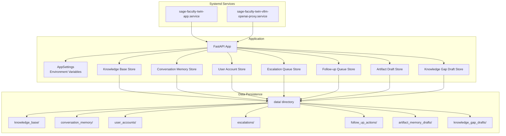
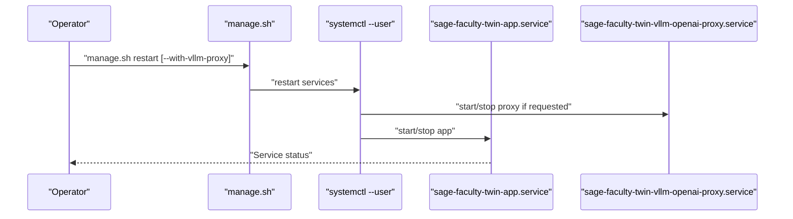
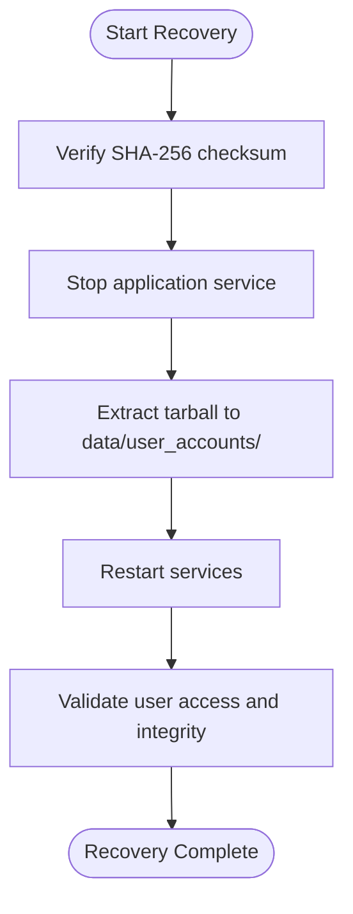
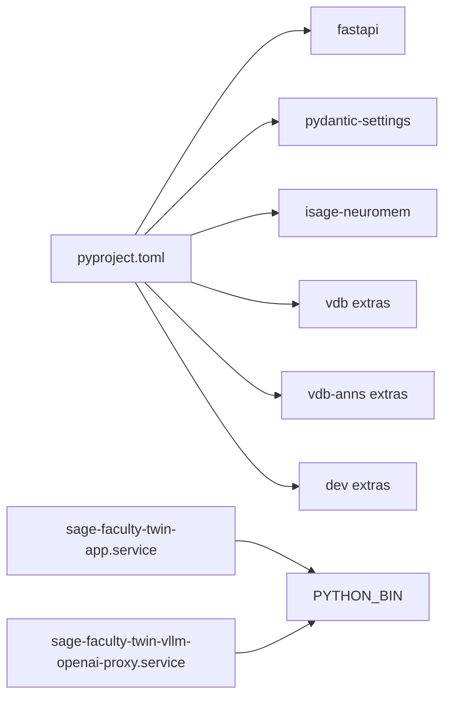

# Maintenance and Backup

<cite>
**Referenced Files in This Document**
- [README.md](file://README.md)
- [quickstart.sh](file://quickstart.sh)
- [manage.sh](file://manage.sh)
- [tools/start_all_services.sh](file://tools/start_all_services.sh)
- [tools/install_user_services.sh](file://tools/install_user_services.sh)
- [deploy/systemd/user/sage-faculty-twin-app.service](file://deploy/systemd/user/sage-faculty-twin-app.service)
- [deploy/systemd/user/sage-faculty-twin-vllm-openai-proxy.service](file://deploy/systemd/user/sage-faculty-twin-vllm-openai-proxy.service)
- [pyproject.toml](file://pyproject.toml)
- [src/sage_faculty_twin/config.py](file://src/sage_faculty_twin/config.py)
- [src/sage_faculty_twin/user_store.py](file://src/sage_faculty_twin/user_store.py)
- [src/sage_faculty_twin/knowledge_base.py](file://src/sage_faculty_twin/knowledge_base.py)
- [src/sage_faculty_twin/memory_store.py](file://src/sage_faculty_twin/memory_store.py)
- [src/sage_faculty_twin/escalation_store.py](file://src/sage_faculty_twin/escalation_store.py)
- [src/sage_faculty_twin/follow_up_store.py](file://src/sage_faculty_twin/follow_up_store.py)
- [src/sage_faculty_twin/artifact_memory_draft_store.py](file://src/sage_faculty_twin/artifact_memory_draft_store.py)
- [src/sage_faculty_twin/knowledge_gap_draft_store.py](file://src/sage_faculty_twin/knowledge_gap_draft_store.py)
- [recovery/user_accounts_recovery_20260604_090208.tar.gz.sha256](file://recovery/user_accounts_recovery_20260604_090208.tar.gz.sha256)
</cite>

## Table of Contents
1. [Introduction](#introduction)
2. [Project Structure](#project-structure)
3. [Core Components](#core-components)
4. [Architecture Overview](#architecture-overview)
5. [Detailed Component Analysis](#detailed-component-analysis)
6. [Dependency Analysis](#dependency-analysis)
7. [Performance Considerations](#performance-considerations)
8. [Troubleshooting Guide](#troubleshooting-guide)
9. [Conclusion](#conclusion)
10. [Appendices](#appendices)

## Introduction
This document provides comprehensive maintenance and backup guidance for Sage Faculty Twin operations. It covers:
- Regular maintenance: service updates, dependency management, and configuration updates
- Backup strategies for critical data: knowledge base, conversation memories, user accounts, and operational artifacts
- Disaster recovery using the recovery tarball mechanism
- Data archival, retention, and migration procedures
- Preventive maintenance schedules and system health checks

## Project Structure
Sage Faculty Twin is a FastAPI application with integrated memory stores, knowledge bases, and optional model proxy services. Services are managed via systemd user units and orchestrated by shell scripts. Data is persisted under the data/ directory with dedicated stores for users, knowledge, conversations, escalations, follow-ups, and drafts.

**Diagram sources**
- [deploy/systemd/user/sage-faculty-twin-app.service](file://deploy/systemd/user/sage-faculty-twin-app.service)
- [deploy/systemd/user/sage-faculty-twin-vllm-openai-proxy.service](file://deploy/systemd/user/sage-faculty-twin-vllm-openai-proxy.service)
- [src/sage_faculty_twin/config.py](file://src/sage_faculty_twin/config.py)
- [src/sage_faculty_twin/knowledge_base.py](file://src/sage_faculty_twin/knowledge_base.py)
- [src/sage_faculty_twin/memory_store.py](file://src/sage_faculty_twin/memory_store.py)
- [src/sage_faculty_twin/user_store.py](file://src/sage_faculty_twin/user_store.py)
- [src/sage_faculty_twin/escalation_store.py](file://src/sage_faculty_twin/escalation_store.py)
- [src/sage_faculty_twin/follow_up_store.py](file://src/sage_faculty_twin/follow_up_store.py)
- [src/sage_faculty_twin/artifact_memory_draft_store.py](file://src/sage_faculty_twin/artifact_memory_draft_store.py)
- [src/sage_faculty_twin/knowledge_gap_draft_store.py](file://src/sage_faculty_twin/knowledge_gap_draft_store.py)

**Section sources**
- [README.md](file://README.md)
- [pyproject.toml](file://pyproject.toml)

## Core Components
- Application configuration and environment-driven settings
- Knowledge base store supporting multiple backends
- Conversation memory store backed by layered memory collections
- User account store with secure credential handling
- Operational stores for escalations, follow-ups, artifact drafts, and knowledge gap drafts

Key responsibilities:
- Centralized configuration via environment variables with strict prefixes
- Pluggable knowledge backends (sagevdb, neuromem) and index types
- Structured persistence of JSON records per store
- Optional OpenAI-compatible proxy for model service integration

**Section sources**
- [src/sage_faculty_twin/config.py](file://src/sage_faculty_twin/config.py)
- [src/sage_faculty_twin/knowledge_base.py](file://src/sage_faculty_twin/knowledge_base.py)
- [src/sage_faculty_twin/memory_store.py](file://src/sage_faculty_twin/memory_store.py)
- [src/sage_faculty_twin/user_store.py](file://src/sage_faculty_twin/user_store.py)
- [src/sage_faculty_twin/escalation_store.py](file://src/sage_faculty_twin/escalation_store.py)
- [src/sage_faculty_twin/follow_up_store.py](file://src/sage_faculty_twin/follow_up_store.py)
- [src/sage_faculty_twin/artifact_memory_draft_store.py](file://src/sage_faculty_twin/artifact_memory_draft_store.py)
- [src/sage_faculty_twin/knowledge_gap_draft_store.py](file://src/sage_faculty_twin/knowledge_gap_draft_store.py)

## Architecture Overview
The system comprises:
- Application service managed by systemd user units
- Optional OpenAI-compatible proxy for model routing
- Stores for knowledge, conversations, users, and operational artifacts
- Data directories organized by domain

**Diagram sources**
- [manage.sh](file://manage.sh)
- [deploy/systemd/user/sage-faculty-twin-app.service](file://deploy/systemd/user/sage-faculty-twin-app.service)
- [deploy/systemd/user/sage-faculty-twin-vllm-openai-proxy.service](file://deploy/systemd/user/sage-faculty-twin-vllm-openai-proxy.service)

**Section sources**
- [README.md](file://README.md)
- [manage.sh](file://manage.sh)
- [tools/install_user_services.sh](file://tools/install_user_services.sh)

## Detailed Component Analysis

### Configuration Management
- Environment-driven settings with strict prefix DIGITAL_TWIN_
- Multiple sources (.env and external SAGE .env) merged
- Extensive settings for LLM, retrieval, memory, and operational parameters
- Runtime validation constraints on numeric fields and selection sets

Recommended practices:
- Keep .env minimal and only fill missing keys during initial setup
- Use manage.sh to apply configuration changes atomically
- Validate environment before restarting services

**Section sources**
- [src/sage_faculty_twin/config.py](file://src/sage_faculty_twin/config.py)
- [quickstart.sh](file://quickstart.sh)

### Knowledge Base Store
- Supports multiple backends and index types
- Persists documents as JSON files under knowledge_base/
- Deduplicates by source_name and normalizes metadata
- Rebuilds indexes when enabled

Backup strategy:
- Archive the entire knowledge_base/ directory
- Include metadata and embeddings if applicable to your backend

**Section sources**
- [src/sage_faculty_twin/knowledge_base.py](file://src/sage_faculty_twin/knowledge_base.py)

### Conversation Memory Store
- SQLite-backed store plus layered memory collections
- Maintains timelines and profiles
- Telemetry events for monitoring

Backup strategy:
- Back up memory_store.sqlite3 and collections/
- Consider snapshotting telemetry events if needed

**Section sources**
- [src/sage_faculty_twin/memory_store.py](file://src/sage_faculty_twin/memory_store.py)

### User Account Store
- Per-user JSON records with secure password hashing
- Stores user identities and session-related metadata
- Directory-based persistence under user_accounts/

Backup strategy:
- Archive user_accounts/ directory regularly
- Ensure encryption-at-rest for sensitive environments

**Section sources**
- [src/sage_faculty_twin/user_store.py](file://src/sage_faculty_twin/user_store.py)

### Operational Stores
- Escalation queue: escalations/
- Follow-up actions: follow_up_actions/
- Artifact memory drafts: artifact_memory_drafts/
- Knowledge gap drafts: knowledge_gap_drafts/

Backup strategy:
- Back up each directory individually
- Retain historical snapshots for auditability

**Section sources**
- [src/sage_faculty_twin/escalation_store.py](file://src/sage_faculty_twin/escalation_store.py)
- [src/sage_faculty_twin/follow_up_store.py](file://src/sage_faculty_twin/follow_up_store.py)
- [src/sage_faculty_twin/artifact_memory_draft_store.py](file://src/sage_faculty_twin/artifact_memory_draft_store.py)
- [src/sage_faculty_twin/knowledge_gap_draft_store.py](file://src/sage_faculty_twin/knowledge_gap_draft_store.py)

### Disaster Recovery Using Recovery Tarball
The repository includes a recovery tarball and its SHA-256 checksum for user accounts. Recovery procedure:
- Verify checksum against the provided .sha256 file
- Stop the application service
- Restore user accounts from the tarball into data/user_accounts/
- Restart services and validate access

**Diagram sources**
- [recovery/user_accounts_recovery_20260604_090208.tar.gz.sha256](file://recovery/user_accounts_recovery_20260604_090208.tar.gz.sha256)

**Section sources**
- [recovery/user_accounts_recovery_20260604_090208.tar.gz.sha256](file://recovery/user_accounts_recovery_20260604_090208.tar.gz.sha256)

## Dependency Analysis
- Python dependencies defined in pyproject.toml
- Optional extras for VDB backends and development
- Systemd user units depend on rendered paths and Python binary

**Diagram sources**
- [pyproject.toml](file://pyproject.toml)
- [deploy/systemd/user/sage-faculty-twin-app.service](file://deploy/systemd/user/sage-faculty-twin-app.service)
- [deploy/systemd/user/sage-faculty-twin-vllm-openai-proxy.service](file://deploy/systemd/user/sage-faculty-twin-vllm-openai-proxy.service)

**Section sources**
- [pyproject.toml](file://pyproject.toml)
- [tools/install_user_services.sh](file://tools/install_user_services.sh)

## Performance Considerations
- Streaming and timeout settings are environment-controlled
- Retrieval top-k and index types influence latency and accuracy
- Conversation memory index selection affects performance; choose appropriate index type for workload
- Ensure adequate disk I/O for SQLite and large JSON datasets

[No sources needed since this section provides general guidance]

## Troubleshooting Guide
Common issues and resolutions:
- Module import errors related to SAGE path: ensure PYTHONPATH includes ../SAGE/src
- Streaming failures: confirm upstream supports chunked transfer and DIGITAL_TWIN_STREAM_CHAT_ANSWER is set appropriately
- Authentication failures: verify DIGITAL_TWIN_API_KEY and proxy configuration if enabled
- Health checks: use manage.sh status and systemd logs for diagnostics

Operational commands:
- Service status and restart: manage.sh status/start/stop/restart
- Full-stack orchestration: tools/start_all_services.sh
- One-touch setup: quickstart.sh with optional flags

**Section sources**
- [README.md](file://README.md)
- [manage.sh](file://manage.sh)
- [tools/start_all_services.sh](file://tools/start_all_services.sh)
- [quickstart.sh](file://quickstart.sh)

## Conclusion
This guide consolidates maintenance and backup practices for Sage Faculty Twin. By leveraging environment-driven configuration, structured data stores, and systemd-managed services, operators can maintain reliability and recover quickly from incidents. Regular backups, retention policies, and preventive maintenance schedules ensure long-term operability.

[No sources needed since this section summarizes without analyzing specific files]

## Appendices

### Preventive Maintenance Schedule
- Daily
  - Review service status via manage.sh status
  - Monitor logs for errors and warnings
  - Validate health endpoints for app and proxy
- Weekly
  - Rotate and review backup archives
  - Audit configuration drift against .env.example
  - Rebuild knowledge base indexes if content volume increases significantly
- Monthly
  - Test disaster recovery using recovery tarball
  - Review and prune old operational artifacts (escalations, follow-ups)
  - Validate retention policies for conversation memories and drafts

[No sources needed since this section provides general guidance]

### Data Archival and Retention Policies
- Knowledge Base: retain indefinitely; archive quarterly
- Conversation Memory: retain per institution policy; purge older records after N months
- User Accounts: retain per legal requirement; anonymize on request
- Operational Artifacts: escalate/follow-up/action drafts retained for N weeks/months depending on policy

[No sources needed since this section provides general guidance]

### Data Migration Procedures
- Plan downtime windows for major migrations
- Export current state from each store directory
- Apply configuration changes and backend upgrades
- Import migrated data and validate integrity
- Roll back if validation fails

[No sources needed since this section provides general guidance]