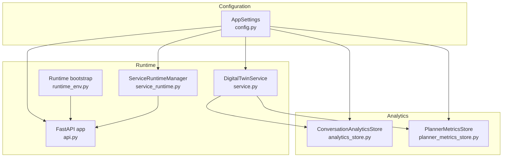
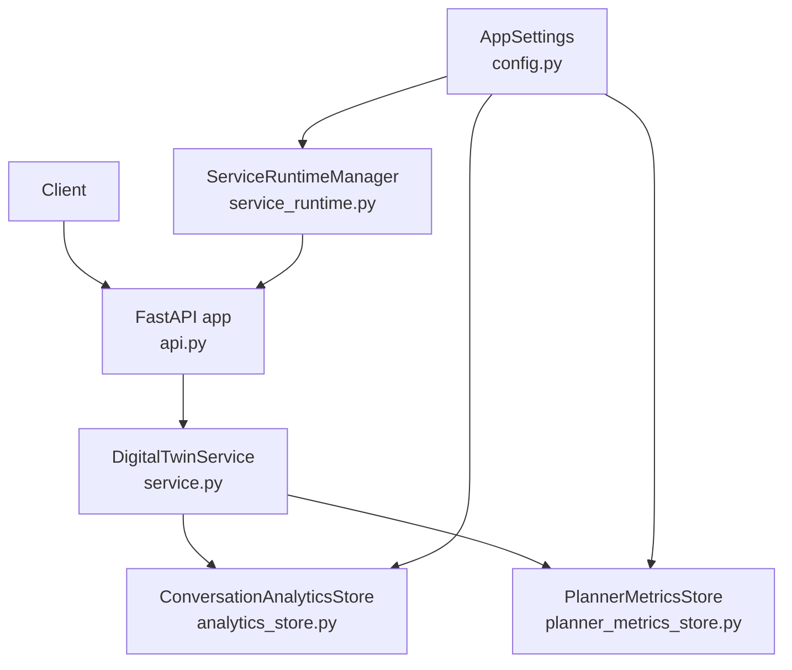
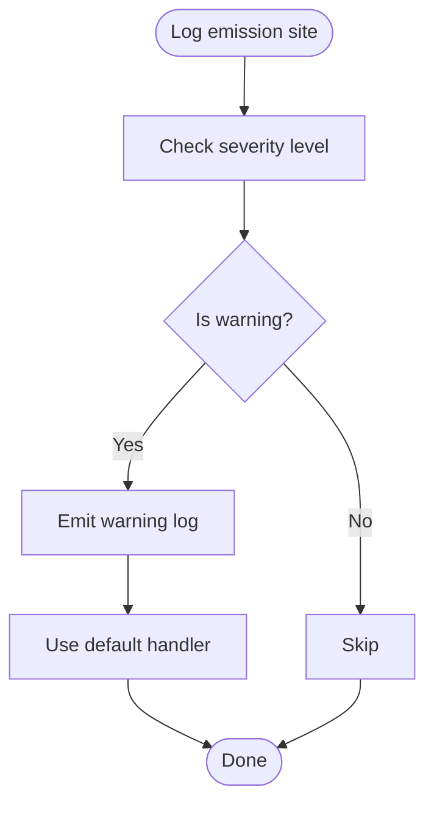
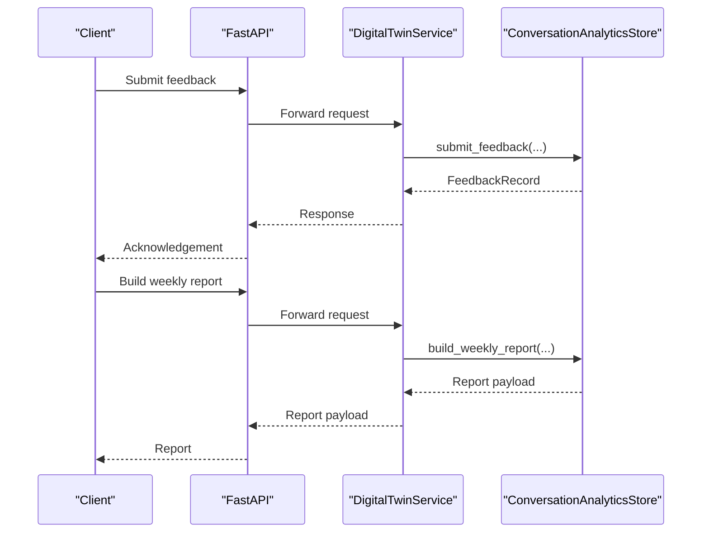
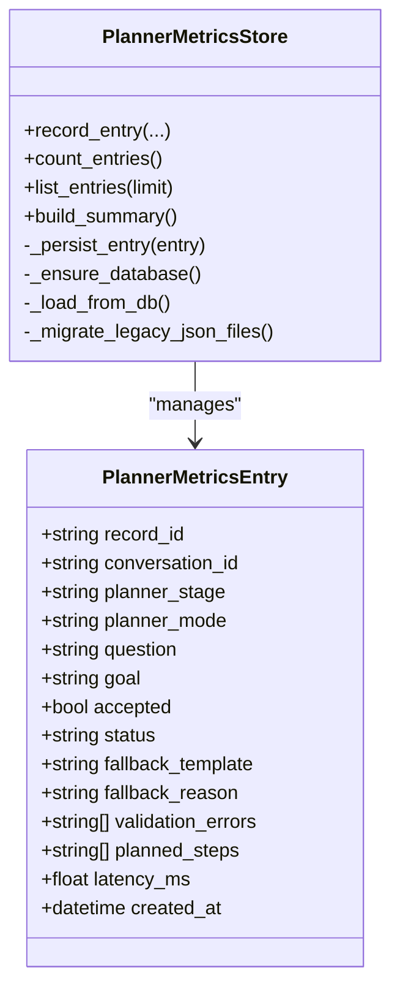
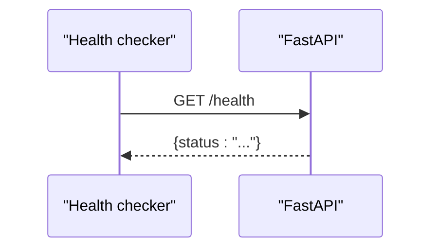
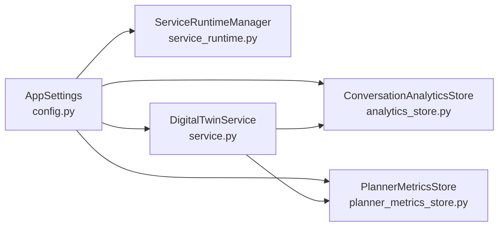

# Monitoring and Logging

<cite>
**Referenced Files in This Document**
- [analytics_store.py](file://src/sage_faculty_twin/analytics_store.py)
- [config.py](file://src/sage_faculty_twin/config.py)
- [service.py](file://src/sage_faculty_twin/service.py)
- [service_runtime.py](file://src/sage_faculty_twin/service_runtime.py)
- [api.py](file://src/sage_faculty_twin/api.py)
- [runtime_env.py](file://src/sage_faculty_twin/runtime_env.py)
- [planner_metrics_store.py](file://src/sage_faculty_twin/planner_metrics_store.py)
- [deployment.md](file://docs/deployment.md)
- [benchmark_vamos_impact.py](file://tools/benchmark_vamos_impact.py)
</cite>

## Table of Contents
1. [Introduction](#introduction)
2. [Project Structure](#project-structure)
3. [Core Components](#core-components)
4. [Architecture Overview](#architecture-overview)
5. [Detailed Component Analysis](#detailed-component-analysis)
6. [Dependency Analysis](#dependency-analysis)
7. [Performance Considerations](#performance-considerations)
8. [Troubleshooting Guide](#troubleshooting-guide)
9. [Conclusion](#conclusion)
10. [Appendices](#appendices)

## Introduction
This document provides comprehensive monitoring and logging guidance for Sage Faculty Twin operations. It covers application logging configuration, log levels, and rotation strategies; analytics data collection via analytics_store.py and performance metrics tracking; system monitoring setup including health checks, uptime monitoring, and alerting; log aggregation and centralized logging; and troubleshooting workflows using logs and monitoring data to diagnose performance issues and service failures.

## Project Structure
The monitoring and logging ecosystem spans configuration, analytics, runtime telemetry, and operational controls:
- Application configuration defines storage locations and runtime knobs.
- Analytics store persists and reports feedback and satisfaction metrics.
- Planner metrics store records planning decisions and latencies.
- Service runtime manager orchestrates systemd-managed services.
- API server exposes health endpoints and streaming events.
- Runtime environment bootstraps dependencies and validates local sources.

**Diagram sources**
- [config.py:1-132](file://src/sage_faculty_twin/config.py#L1-L132)
- [analytics_store.py:99-632](file://src/sage_faculty_twin/analytics_store.py#L99-L632)
- [planner_metrics_store.py:75-253](file://src/sage_faculty_twin/planner_metrics_store.py#L75-L253)
- [service_runtime.py:13-69](file://src/sage_faculty_twin/service_runtime.py#L13-L69)
- [service.py:446-446](file://src/sage_faculty_twin/service.py#L446-L446)
- [api.py:90-200](file://src/sage_faculty_twin/api.py#L90-L200)
- [runtime_env.py:102-131](file://src/sage_faculty_twin/runtime_env.py#L102-L131)

**Section sources**
- [config.py:1-132](file://src/sage_faculty_twin/config.py#L1-L132)
- [analytics_store.py:99-632](file://src/sage_faculty_twin/analytics_store.py#L99-L632)
- [planner_metrics_store.py:75-253](file://src/sage_faculty_twin/planner_metrics_store.py#L75-L253)
- [service_runtime.py:13-69](file://src/sage_faculty_twin/service_runtime.py#L13-L69)
- [service.py:446-446](file://src/sage_faculty_twin/service.py#L446-L446)
- [api.py:90-200](file://src/sage_faculty_twin/api.py#L90-L200)
- [runtime_env.py:102-131](file://src/sage_faculty_twin/runtime_env.py#L102-L131)

## Core Components
- Application logging and telemetry
  - Logging is performed via the standard library logger in the service module. No explicit handler configuration is present in the codebase; logging defaults apply.
  - Telemetry is embedded in workflow trace steps and planner metrics entries, enabling downstream observability systems to collect and correlate events.
- Analytics data collection
  - Feedback submissions and weekly/satisfaction reports are persisted to disk and computed from conversation memory and feedback records.
- Performance metrics tracking
  - Planner metrics store captures planner acceptance rates, fallback reasons, latency statistics, and step-level rejection counts.
- System monitoring
  - Health checks are supported via a dedicated endpoint; streaming workflow events are available for long-running operations.
  - Service control actions (start/stop/restart/status) are delegated to systemd-managed units.

**Section sources**
- [service.py:446-446](file://src/sage_faculty_twin/service.py#L446-L446)
- [analytics_store.py:111-141](file://src/sage_faculty_twin/analytics_store.py#L111-L141)
- [analytics_store.py:149-222](file://src/sage_faculty_twin/analytics_store.py#L149-L222)
- [planner_metrics_store.py:87-121](file://src/sage_faculty_twin/planner_metrics_store.py#L87-L121)
- [planner_metrics_store.py:132-186](file://src/sage_faculty_twin/planner_metrics_store.py#L132-L186)
- [api.py:170-200](file://src/sage_faculty_twin/api.py#L170-L200)
- [service_runtime.py:19-48](file://src/sage_faculty_twin/service_runtime.py#L19-L48)

## Architecture Overview
The monitoring architecture integrates configuration-driven storage, analytics computation, planner metrics, and operational controls.

**Diagram sources**
- [api.py:90-200](file://src/sage_faculty_twin/api.py#L90-L200)
- [service.py:581-634](file://src/sage_faculty_twin/service.py#L581-L634)
- [analytics_store.py:99-110](file://src/sage_faculty_twin/analytics_store.py#L99-L110)
- [planner_metrics_store.py:75-85](file://src/sage_faculty_twin/planner_metrics_store.py#L75-L85)
- [config.py:99-132](file://src/sage_faculty_twin/config.py#L99-L132)
- [service_runtime.py:13-48](file://src/sage_faculty_twin/service_runtime.py#L13-L48)

## Detailed Component Analysis

### Application Logging Configuration
- Logger usage
  - The service module initializes a logger named after the module and uses it for emitting warnings during web search failures.
- Log levels
  - The codebase uses warning-level logs for recoverable failures (e.g., web search exceptions). No explicit handler configuration is present; default handlers apply.
- Log rotation strategies
  - There is no explicit log rotation configuration in the codebase. Rotation should be managed externally (e.g., systemd/journald, logrotate) to prevent unbounded growth of application logs.

**Diagram sources**
- [service.py:1179-1181](file://src/sage_faculty_twin/service.py#L1179-L1181)

**Section sources**
- [service.py:446-446](file://src/sage_faculty_twin/service.py#L446-L446)
- [service.py:1179-1181](file://src/sage_faculty_twin/service.py#L1179-L1181)

### Analytics Data Collection (analytics_store.py)
- Feedback submission and persistence
  - Feedback is validated against conversation records and written to JSON files under a feedback directory.
- Report generation
  - Weekly and satisfaction reports compute counts, ratios, unresolved rates, human handoff rates, and trend data.
- Cluster analysis
  - Questions are tokenized and clustered by interaction domain; priority and gap scores guide knowledge gap suggestions.

**Diagram sources**
- [analytics_store.py:111-141](file://src/sage_faculty_twin/analytics_store.py#L111-L141)
- [analytics_store.py:149-222](file://src/sage_faculty_twin/analytics_store.py#L149-L222)

**Section sources**
- [analytics_store.py:111-141](file://src/sage_faculty_twin/analytics_store.py#L111-L141)
- [analytics_store.py:149-222](file://src/sage_faculty_twin/analytics_store.py#L149-L222)
- [analytics_store.py:291-317](file://src/sage_faculty_twin/analytics_store.py#L291-L317)
- [analytics_store.py:378-419](file://src/sage_faculty_twin/analytics_store.py#L378-L419)

### Performance Metrics Tracking (planner_metrics_store.py)
- Recording planner decisions
  - Entries capture planner mode, acceptance status, fallback templates, validation errors, planned steps, and latency.
- Summary computation
  - Acceptance rates, fallback rates, error rates, average/max latencies, and rejection reason distributions are computed.
- Persistence
  - Entries are stored in an SQLite database with automatic migration from legacy JSON files.

**Diagram sources**
- [planner_metrics_store.py:16-72](file://src/sage_faculty_twin/planner_metrics_store.py#L16-L72)
- [planner_metrics_store.py:75-121](file://src/sage_faculty_twin/planner_metrics_store.py#L75-L121)
- [planner_metrics_store.py:132-186](file://src/sage_faculty_twin/planner_metrics_store.py#L132-L186)

**Section sources**
- [planner_metrics_store.py:87-121](file://src/sage_faculty_twin/planner_metrics_store.py#L87-L121)
- [planner_metrics_store.py:132-186](file://src/sage_faculty_twin/planner_metrics_store.py#L132-L186)
- [planner_metrics_store.py:188-202](file://src/sage_faculty_twin/planner_metrics_store.py#L188-L202)
- [planner_metrics_store.py:218-234](file://src/sage_faculty_twin/planner_metrics_store.py#L218-L234)

### System Monitoring Setup
- Health checks
  - A health endpoint is used by external tools to probe service readiness. The endpoint returns a status field indicating operational state.
- Streaming workflow events
  - SSE-based streaming provides keepalive events and workflow trace updates for long-running chat operations.
- Service control
  - ServiceRuntimeManager delegates start/stop/restart/status to systemd-run and parses results from a control script.

**Diagram sources**
- [benchmark_vamos_impact.py:175-207](file://tools/benchmark_vamos_impact.py#L175-L207)

**Section sources**
- [api.py:170-200](file://src/sage_faculty_twin/api.py#L170-L200)
- [benchmark_vamos_impact.py:175-207](file://tools/benchmark_vamos_impact.py#L175-L207)
- [service_runtime.py:19-48](file://src/sage_faculty_twin/service_runtime.py#L19-L48)
- [service_runtime.py:50-69](file://src/sage_faculty_twin/service_runtime.py#L50-L69)

## Dependency Analysis
- Configuration dependencies
  - Analytics and planner metrics stores depend on AppSettings for base directories and runtime paths.
- Service dependencies
  - DigitalTwinService composes analytics and planner metrics stores and uses the configured settings for timeouts, search parameters, and operational modes.
- Runtime dependencies
  - ServiceRuntimeManager depends on AppSettings for locating the service manager script and on systemd-run for queuing actions.

**Diagram sources**
- [config.py:99-132](file://src/sage_faculty_twin/config.py#L99-L132)
- [analytics_store.py:99-110](file://src/sage_faculty_twin/analytics_store.py#L99-L110)
- [planner_metrics_store.py:75-85](file://src/sage_faculty_twin/planner_metrics_store.py#L75-L85)
- [service_runtime.py:16-18](file://src/sage_faculty_twin/service_runtime.py#L16-L18)
- [service.py:581-634](file://src/sage_faculty_twin/service.py#L581-L634)

**Section sources**
- [config.py:99-132](file://src/sage_faculty_twin/config.py#L99-L132)
- [analytics_store.py:99-110](file://src/sage_faculty_twin/analytics_store.py#L99-L110)
- [planner_metrics_store.py:75-85](file://src/sage_faculty_twin/planner_metrics_store.py#L75-L85)
- [service_runtime.py:16-18](file://src/sage_faculty_twin/service_runtime.py#L16-L18)
- [service.py:581-634](file://src/sage_faculty_twin/service.py#L581-L634)

## Performance Considerations
- Prompt soft cap and background post-answer stages
  - Environment variables control prompt size soft caps and background post-answer execution to reduce latency for chat responses.
- Streaming answer delivery
  - Streaming chat answers can be enabled to improve perceived latency and UX; this is controlled by an environment variable.
- Web search fallback
  - Web search is conditionally triggered based on local grounding quality and query markers; failures are logged at warning level.

**Section sources**
- [api.py:127-147](file://src/sage_faculty_twin/api.py#L127-L147)
- [service.py:1179-1181](file://src/sage_faculty_twin/service.py#L1179-L1181)

## Troubleshooting Guide
- Diagnosing slow responses
  - Review planner metrics summary for acceptance rates, fallback rates, and latency distributions to identify planner regressions or bottlenecks.
  - Inspect workflow trace durations captured in service operations to locate slow stages.
- Investigating web search failures
  - Look for warning logs indicating web search exceptions; confirm network connectivity and external service availability.
- Verifying health and uptime
  - Use the health endpoint to confirm service readiness; external probes can validate uptime and readiness.
- Operational control verification
  - Use service control actions to restart or query service status; ensure systemd-run and the control script are available and executable.

**Section sources**
- [planner_metrics_store.py:132-186](file://src/sage_faculty_twin/planner_metrics_store.py#L132-L186)
- [service.py:1179-1181](file://src/sage_faculty_twin/service.py#L1179-L1181)
- [benchmark_vamos_impact.py:175-207](file://tools/benchmark_vamos_impact.py#L175-L207)
- [service_runtime.py:19-48](file://src/sage_faculty_twin/service_runtime.py#L19-L48)

## Conclusion
Sage Faculty Twin’s monitoring and logging rely on:
- Standard library logging with warning-level emissions for recoverable failures.
- Analytics and planner metrics stores for operational insights and performance tracking.
- Health checks and streaming events for system observability.
- ServiceRuntimeManager for operational control via systemd.

To harden monitoring, integrate external log rotation, centralize logs, and instrument analytics and planner metrics for dashboards and alerts.

## Appendices

### Log Aggregation and Centralized Logging
- Current state
  - No explicit handler configuration exists in the codebase; logs are emitted with default handlers.
- Recommended approach
  - Route application logs to a centralized collector (e.g., journald, Fluent Bit, Logstash) and enable log rotation to prevent disk pressure.
  - Tag logs with correlation IDs (e.g., conversation_id) to trace end-to-end operations.

[No sources needed since this section provides general guidance]

### Alerting Configuration
- Suggested thresholds
  - High web search failure rate, elevated planner fallback rate, increased average latency, and degraded health status.
- Integration
  - Wire health endpoint results and planner metrics summaries into alerting rules.

[No sources needed since this section provides general guidance]

### Environment Variables and Runtime Knobs
- Streaming and latency tuning
  - DIGITAL_TWIN_STREAM_CHAT_ANSWER, DIGITAL_TWIN_CHAT_REQUEST_TIMEOUT_SECONDS, DIGITAL_TWIN_CHAT_SSE_KEEPALIVE_SECONDS are read at import time and must be exported by launch scripts.
- Prompt soft cap
  - DIGITAL_TWIN_PROMPT_SOFT_CAP controls prompt truncation behavior.

**Section sources**
- [deployment.md:254-264](file://docs/deployment.md#L254-L264)
- [api.py:127-147](file://src/sage_faculty_twin/api.py#L127-L147)