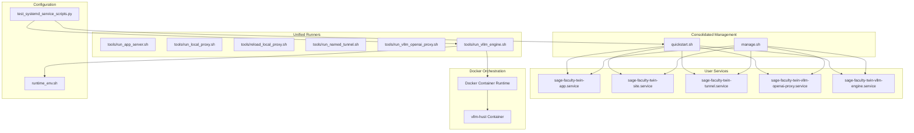
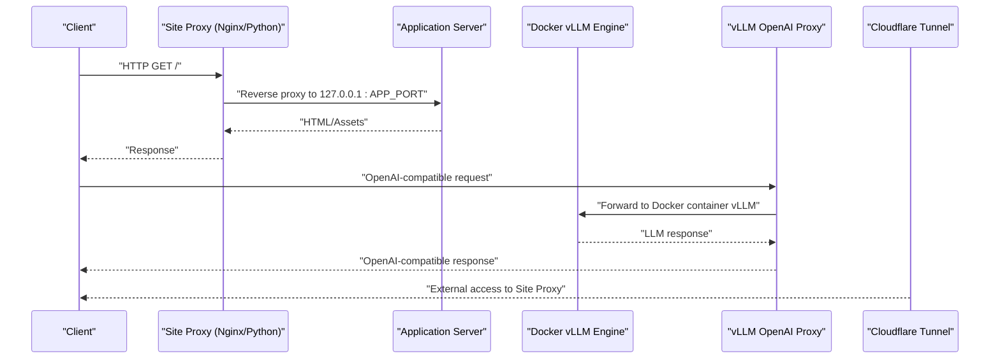
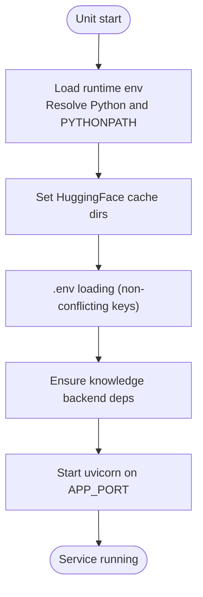
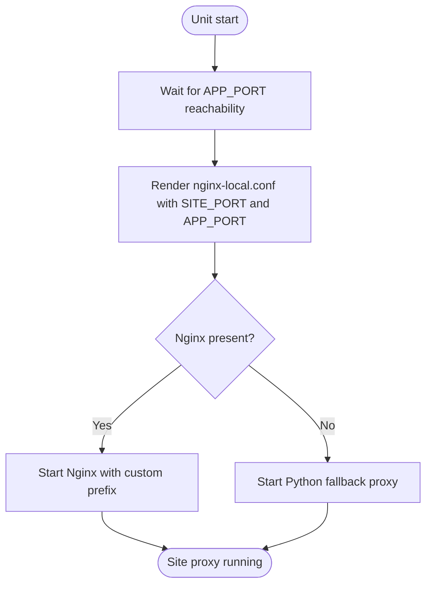
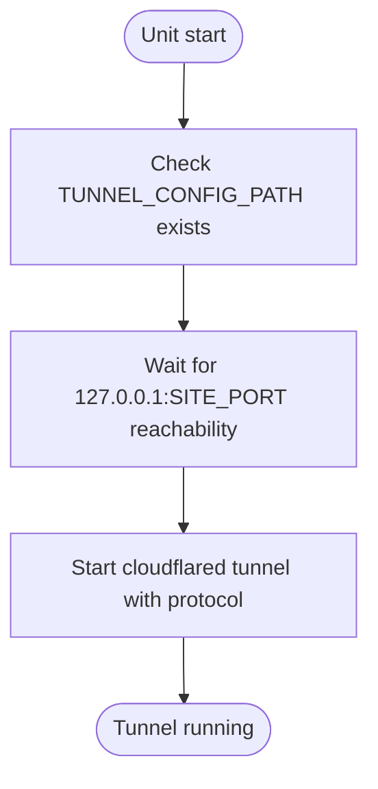
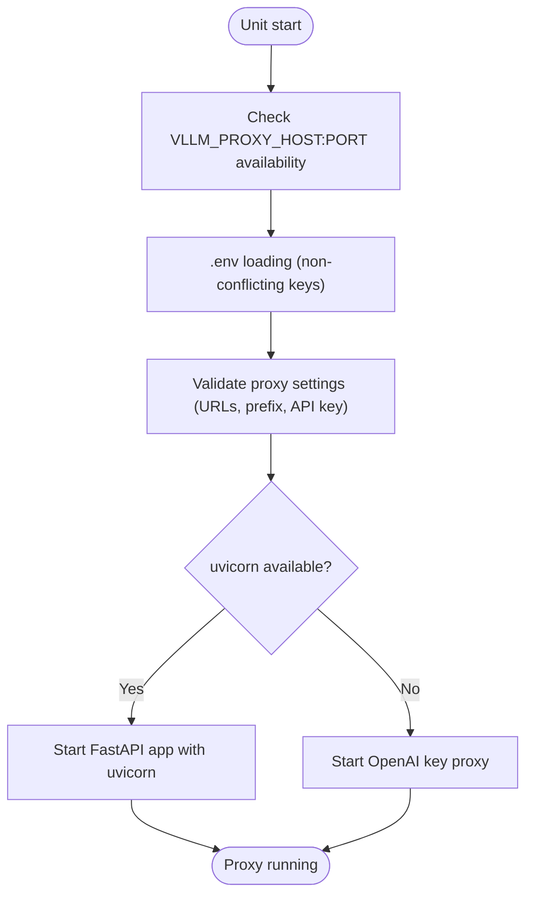
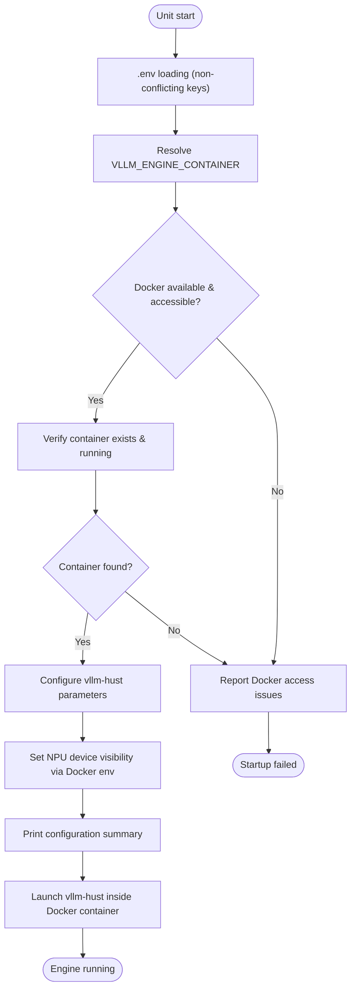
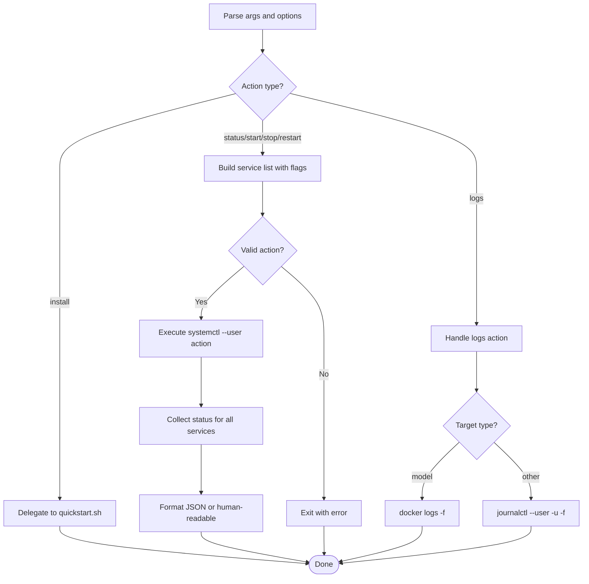
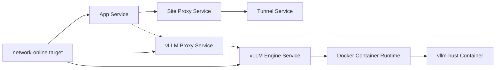

# Systemd Services

<cite>
**Referenced Files in This Document**
- [sage-faculty-twin-app.service](file://deploy/systemd/user/sage-faculty-twin-app.service)
- [sage-faculty-twin-site.service](file://deploy/systemd/user/sage-faculty-twin-site.service)
- [sage-faculty-twin-tunnel.service](file://deploy/systemd/user/sage-faculty-twin-tunnel.service)
- [sage-faculty-twin-vllm-openai-proxy.service](file://deploy/systemd/user/sage-faculty-twin-vllm-openai-proxy.service)
- [sage-faculty-twin-vllm-engine.service](file://deploy/systemd/user/sage-faculty-twin-vllm-engine.service)
- [manage.sh](file://manage.sh)
- [quickstart.sh](file://quickstart.sh)
- [run_vllm_engine.sh](file://tools/run_vllm_engine.sh)
- [run_vllm_openai_proxy.sh](file://tools/run_vllm_openai_proxy.sh)
- [runtime_env.sh](file://tools/lib/runtime_env.sh)
- [test_systemd_service_scripts.py](file://tests/test_systemd_service_scripts.py)
</cite>

## Update Summary
**Changes Made**
- Updated vLLM engine service to reflect Docker container orchestration deployment
- Modified service management commands to handle Docker container lifecycle
- Updated troubleshooting guide with Docker-specific startup issues
- Revised service unit file templates to accommodate Docker-based execution
- Enhanced logging setup for Docker container monitoring

## Table of Contents
1. [Introduction](#introduction)
2. [Project Structure](#project-structure)
3. [Core Components](#core-components)
4. [Architecture Overview](#architecture-overview)
5. [Detailed Component Analysis](#detailed-component-analysis)
6. [Dependency Analysis](#dependency-analysis)
7. [Performance Considerations](#performance-considerations)
8. [Troubleshooting Guide](#troubleshooting-guide)
9. [Conclusion](#conclusion)

## Introduction
This document provides comprehensive systemd user service documentation for Sage Faculty Twin. The project uses consolidated service management through unified scripts with five core services:
- Application server
- Local site proxy
- Public tunnel
- OpenAI-compatible vLLM proxy
- vLLM inference engine (now deployed via Docker containers)

The consolidation eliminates individual service scripts in favor of centralized management through quickstart.sh (installation) and manage.sh (runtime operations). The vLLM engine service now requires Docker containers and systemd units manage container lifecycle instead of direct binary execution.

## Project Structure
The systemd user services are located under deploy/systemd/user with consolidated management scripts replacing individual service runners. The unified approach uses quickstart.sh for installation and manage.sh for runtime operations.

**Diagram sources**
- [sage-faculty-twin-app.service](file://deploy/systemd/user/sage-faculty-twin-app.service)
- [sage-faculty-twin-site.service](file://deploy/systemd/user/sage-faculty-twin-site.service)
- [sage-faculty-twin-tunnel.service](file://deploy/systemd/user/sage-faculty-twin-tunnel.service)
- [sage-faculty-twin-vllm-openai-proxy.service](file://deploy/systemd/user/sage-faculty-twin-vllm-openai-proxy.service)
- [sage-faculty-twin-vllm-engine.service](file://deploy/systemd/user/sage-faculty-twin-vllm-engine.service)
- [quickstart.sh](file://quickstart.sh)
- [manage.sh](file://manage.sh)
- [run_vllm_engine.sh](file://tools/run_vllm_engine.sh)
- [runtime_env.sh](file://tools/lib/runtime_env.sh)
- [test_systemd_service_scripts.py](file://tests/test_systemd_service_scripts.py)

**Section sources**
- [sage-faculty-twin-app.service](file://deploy/systemd/user/sage-faculty-twin-app.service)
- [sage-faculty-twin-site.service](file://deploy/systemd/user/sage-faculty-twin-site.service)
- [sage-faculty-twin-tunnel.service](file://deploy/systemd/user/sage-faculty-twin-tunnel.service)
- [sage-faculty-twin-vllm-openai-proxy.service](file://deploy/systemd/user/sage-faculty-twin-vllm-openai-proxy.service)
- [sage-faculty-twin-vllm-engine.service](file://deploy/systemd/user/sage-faculty-twin-vllm-engine.service)
- [quickstart.sh](file://quickstart.sh)
- [manage.sh](file://manage.sh)

## Core Components
- **Application server service**: Runs the FastAPI application via uvicorn on localhost with configurable port.
- **Site proxy service**: Starts an Nginx-based reverse proxy or falls back to a Python-based proxy to serve the frontend and proxy to the app.
- **Tunnel service**: Starts Cloudflare Tunnel to expose the local site proxy externally.
- **vLLM OpenAI-compatible proxy service**: Exposes an OpenAI-compatible API pointing to a local vLLM endpoint, protected by an API key.
- **vLLM inference engine service**: Now deployed as a Docker container running vllm-hust with configurable tensor parallelism and memory utilization.

**Updated** The vLLM engine service now operates within Docker containers, eliminating direct binary execution and providing better isolation and dependency management.

Key operational characteristics:
- All services run under the user systemd instance (default.target).
- Environment variables are injected during installation and used at runtime.
- Restart policies ensure resilience after failures.
- Unified management through consolidated quickstart.sh and manage.sh scripts with comprehensive flag combinations.
- Docker container orchestration provides better resource isolation and dependency management.

**Section sources**
- [sage-faculty-twin-app.service](file://deploy/systemd/user/sage-faculty-twin-app.service)
- [sage-faculty-twin-site.service](file://deploy/systemd/user/sage-faculty-twin-site.service)
- [sage-faculty-twin-tunnel.service](file://deploy/systemd/user/sage-faculty-twin-tunnel.service)
- [sage-faculty-twin-vllm-openai-proxy.service](file://deploy/systemd/user/sage-faculty-twin-vllm-openai-proxy.service)
- [sage-faculty-twin-vllm-engine.service](file://deploy/systemd/user/sage-faculty-twin-vllm-engine.service)
- [quickstart.sh](file://quickstart.sh)
- [manage.sh](file://manage.sh)

## Architecture Overview
The services form a layered stack with consolidated management and Docker-based vLLM integration:
- Application server listens locally on 127.0.0.1.
- Site proxy fronts the app and serves static assets.
- Optional tunnel exposes the site proxy externally.
- Optional vLLM engine provides high-performance inference via Docker containers.
- Optional vLLM proxy provides an OpenAI-compatible interface to the inference engine.

**Updated** Centralized management through unified scripts with Docker container orchestration and enhanced runtime control.

**Diagram sources**
- [sage-faculty-twin-site.service](file://deploy/systemd/user/sage-faculty-twin-site.service)
- [sage-faculty-twin-app.service](file://deploy/systemd/user/sage-faculty-twin-app.service)
- [sage-faculty-twin-tunnel.service](file://deploy/systemd/user/sage-faculty-twin-tunnel.service)
- [sage-faculty-twin-vllm-openai-proxy.service](file://deploy/systemd/user/sage-faculty-twin-vllm-openai-proxy.service)
- [sage-faculty-twin-vllm-engine.service](file://deploy/systemd/user/sage-faculty-twin-vllm-engine.service)
- [quickstart.sh](file://quickstart.sh)
- [manage.sh](file://manage.sh)

## Detailed Component Analysis

### Application Server Service
- **Unit file**: Defines a simple service type, working directory, environment variables, and restart policy.
- **ExecStart**: Launches the application server runner script.
- **Dependencies**: Requires network-online target; no explicit Requires for other services.

**Updated** Now managed through consolidated quickstart.sh and controlled by unified manage.sh flags.

Runtime behavior:
- The runner script sets up the Python environment, ensures knowledge backend dependencies, configures model caches, loads .env, and starts uvicorn on the configured port.

**Diagram sources**
- [sage-faculty-twin-app.service](file://deploy/systemd/user/sage-faculty-twin-app.service)
- [runtime_env.sh](file://tools/lib/runtime_env.sh)

**Section sources**
- [sage-faculty-twin-app.service](file://deploy/systemd/user/sage-faculty-twin-app.service)
- [runtime_env.sh](file://tools/lib/runtime_env.sh)

### Site Proxy Service
- **Unit file**: Starts after the app service and requires it.
- **ExecStart**: Launches the local proxy runner script.
- **ExecReload**: Invokes the reload script to refresh Nginx configuration without restart.

**Updated** Managed through consolidated scripts with enhanced service registry integration.

Runtime behavior:
- Waits for the app to become reachable on the configured port before rendering Nginx configuration.
- Renders Nginx configuration from a template and either starts Nginx or falls back to a Python-based proxy.
- Nginx configuration includes timeouts and body size tuned for chat and streaming.

**Diagram sources**
- [sage-faculty-twin-site.service](file://deploy/systemd/user/sage-faculty-twin-site.service)
- [runtime_env.sh](file://tools/lib/runtime_env.sh)

**Section sources**
- [sage-faculty-twin-site.service](file://deploy/systemd/user/sage-faculty-twin-site.service)
- [runtime_env.sh](file://tools/lib/runtime_env.sh)

### Tunnel Service
- **Unit file**: Starts after the site proxy and requires it.
- **ExecStart**: Launches the named tunnel runner script.

**Updated** Part of consolidated service registry with unified management through manage.sh.

Runtime behavior:
- Validates presence of the Cloudflare tunnel configuration file.
- Waits for the local site proxy to be reachable before starting the tunnel.
- Starts cloudflared with protocol and credentials from the configuration file.

**Diagram sources**
- [sage-faculty-twin-tunnel.service](file://deploy/systemd/user/sage-faculty-twin-tunnel.service)
- [runtime_env.sh](file://tools/lib/runtime_env.sh)

**Section sources**
- [sage-faculty-twin-tunnel.service](file://deploy/systemd/user/sage-faculty-twin-tunnel.service)
- [runtime_env.sh](file://tools/lib/runtime_env.sh)

### vLLM OpenAI-Compatible Proxy Service
- **Unit file**: Starts after network-online target; independent of other services.
- **ExecStart**: Launches the vLLM proxy runner script.

**Updated** Managed through consolidated scripts with enhanced service registry and unified flags.

Runtime behavior:
- Validates that the chosen listen address is free.
- Ensures uvicorn is available; otherwise falls back to a key-proxy mode.
- Loads environment variables from .env and validates proxy settings.
- Implements OpenAI-compatible routes with API key enforcement and streaming support.

**Diagram sources**
- [sage-faculty-twin-vllm-openai-proxy.service](file://deploy/systemd/user/sage-faculty-twin-vllm-openai-proxy.service)
- [runtime_env.sh](file://tools/lib/runtime_env.sh)

**Section sources**
- [sage-faculty-twin-vllm-openai-proxy.service](file://deploy/systemd/user/sage-faculty-twin-vllm-openai-proxy.service)
- [runtime_env.sh](file://tools/lib/runtime_env.sh)

### vLLM Inference Engine Service
- **Unit file**: Starts after network-online target; independent of other services.
- **ExecStart**: Launches the vLLM engine runner script.

**Updated** Now operates within Docker containers with centralized management through run_vllm_engine.sh script.

Runtime behavior:
- Resolves Docker container name from VLLM_ENGINE_CONTAINER environment variable.
- Verifies Docker container existence and accessibility.
- Configures vllm-hust parameters including tensor parallelism, memory utilization, and model serving parameters.
- Supports Ascend NPU devices with configurable device visibility through Docker environment variables.
- Provides comprehensive logging of configuration and runtime parameters.
- Executes vllm-hust serve command inside the Docker container with proper environment propagation.

**Diagram sources**
- [sage-faculty-twin-vllm-engine.service](file://deploy/systemd/user/sage-faculty-twin-vllm-engine.service)
- [run_vllm_engine.sh](file://tools/run_vllm_engine.sh)

**Section sources**
- [sage-faculty-twin-vllm-engine.service](file://deploy/systemd/user/sage-faculty-twin-vllm-engine.service)
- [run_vllm_engine.sh](file://tools/run_vllm_engine.sh)

### Consolidated Service Management with unified Scripts
**Updated** Complete consolidation of service management into unified scripts with Docker container orchestration.

- **Supported actions**: install, status, start, stop, restart, logs.
- **Extended options**:
  - --all: Include all optional services (engine, proxy, site, tunnel).
  - --with-vllm-engine: Include the vLLM inference engine service.
  - --with-vllm-proxy: Include the vLLM OpenAI-compatible proxy service.
  - --with-site-proxy: Include the site proxy service.
  - --with-tunnel: Include the tunnel service.
  - --with-model: Launch model engine in foreground (start action only).
  - --json: Output machine-readable JSON for status queries.
  - --foreground: Run the action in the foreground (model engine).
  - --start: Start services after installation (delegated to quickstart.sh).

**Enhanced behavior**:
- Parses arguments with comprehensive flag combinations.
- Builds service registry in proper startup order: engine → proxy → app → site → tunnel.
- Supports unified logs viewing for all services including Docker containerized model engine.
- Delegates installation to quickstart.sh for improved error handling.
- Provides machine-readable JSON output for automation.
- Handles Docker container lifecycle management for vLLM engine service.

**Diagram sources**
- [manage.sh](file://manage.sh)
- [quickstart.sh](file://quickstart.sh)

**Section sources**
- [manage.sh](file://manage.sh)
- [quickstart.sh](file://quickstart.sh)

### Quickstart Script Enhancements
**Updated** Complete consolidation of installation logic into unified script with Docker container support.

- **Comprehensive installation** with virtual environment support.
- **Preflight checks** for dependencies and system requirements.
- **Automatic sibling repository cloning** (SAGE, neuromem, sageVDB, vllm-hust).
- **Integrated systemd unit installation** with service enablement.
- **Docker container verification** during installation process.
- **Smoke testing** and next steps guidance.
- **Enhanced error handling** and progress reporting.

**Key improvements**:
- Inlined systemd unit installation previously handled by separate install script.
- Unified service enablement with comprehensive flag support.
- Enhanced virtual environment management with optional isolation.
- Docker container validation and troubleshooting guidance.
- Updated next steps to emphasize Docker container configuration.

**Section sources**
- [quickstart.sh](file://quickstart.sh)

### Consolidated Service Unit File Templates and Environment Variables
**Updated** Templates now use consolidated management approach with Docker container configuration.

- **Placeholders**:
  - __REPO_ROOT__: Replaced with the repository root during installation.
  - __PYTHON_BIN__: Resolved and injected during installation.
- **Application server**:
  - APP_PORT: Default 55601.
  - DIGITAL_TWIN_HOMEPAGE_PUBLIC_URL: Public homepage URL.
- **Site proxy**:
  - APP_PORT: Default 55601.
  - HOMEPAGE_REDIRECT_ORIGIN: Origin for redirects.
  - SITE_PORT: Default 8088.
- **Tunnel**:
  - TUNNEL_PROTOCOL: Default http2.
- **vLLM proxy**:
  - VLLM_PROXY_HOST: Default 127.0.0.1.
  - VLLM_PROXY_PORT: Default 18001.
  - VLLM_PROXY_UPSTREAM_BASE_URL: Default http://127.0.0.1:18000/v1.
  - VLLM_PROXY_PATH_PREFIX: Default /v1.
- **vLLM engine**:
  - VLLM_ENGINE_MODEL_PATH: Default /data/shared-models/Qwen3-32B.
  - VLLM_ENGINE_HOST: Default 0.0.0.0.
  - VLLM_ENGINE_PORT: Default 8000.
  - VLLM_ENGINE_TP_SIZE: Default 4.
  - VLLM_ENGINE_MAX_MODEL_LEN: Default 32768.
  - VLLM_ENGINE_GPU_MEM_UTIL: Default 0.85.
  - VLLM_ENGINE_BIN: Default vllm-hust.
  - VLLM_ENGINE_CONTAINER: **New** Docker container name/ID.

**Installation-time resolution**:
- Consolidated installation process resolves the Python interpreter and writes the rendered unit files with __REPO_ROOT__ and __PYTHON_BIN__ substituted.
- **Updated** Installation process now includes Docker container verification and configuration guidance.

**Section sources**
- [sage-faculty-twin-app.service](file://deploy/systemd/user/sage-faculty-twin-app.service)
- [sage-faculty-twin-site.service](file://deploy/systemd/user/sage-faculty-twin-site.service)
- [sage-faculty-twin-tunnel.service](file://deploy/systemd/user/sage-faculty-twin-tunnel.service)
- [sage-faculty-twin-vllm-openai-proxy.service](file://deploy/systemd/user/sage-faculty-twin-vllm-openai-proxy.service)
- [sage-faculty-twin-vllm-engine.service](file://deploy/systemd/user/sage-faculty-twin-vllm-engine.service)
- [quickstart.sh](file://quickstart.sh)

### Logging Setup
**Updated** Consolidated logging approach through unified scripts with Docker container monitoring.

- **Application server**: Uses uvicorn's default logging; no dedicated log file configured in the unit.
- **Site proxy**:
  - Nginx error log configured at logs/error.log under the runtime prefix.
  - Access log configured at logs/access.log under the runtime prefix.
- **Tunnel**: Relies on cloudflared's own logging; ensure cloudflared is configured appropriately.
- **vLLM proxy**: Uses uvicorn's default logging; no dedicated log file configured in the unit.
- **vLLM engine**: Direct stdout/stderr logging from the Docker container running vllm-hust process.

**Consolidated recommendations**:
- Monitor Nginx logs under the runtime prefix for site proxy issues.
- Verify cloudflared logs for tunnel connectivity problems.
- Use journalctl --user to inspect service logs for application and proxy services.
- For Docker containerized model engine logs, use `docker logs <container_name>` or `journalctl` for the vllm-engine service.
- Enable Docker container monitoring to track resource utilization and health status.

**Section sources**
- [runtime_env.sh](file://tools/lib/runtime_env.sh)
- [manage.sh](file://manage.sh)

## Dependency Analysis
**Updated** Enhanced dependency analysis reflecting consolidated management approach with Docker container orchestration.

Service dependencies and startup order with consolidated management:
- **Application server**: No Requires; After=network-online.target.
- **Site proxy**: After=app; Requires=app.
- **Tunnel**: After=site; Requires=site.
- **vLLM proxy**: Independent of others; After=network-online.target.
- **vLLM engine**: Independent of others; After=network-online.target.

**Enhanced inter-service communication**:
- Site proxy communicates with the application server on 127.0.0.1:APP_PORT.
- Tunnel proxies external traffic to 127.0.0.1:SITE_PORT.
- vLLM proxy communicates with the upstream vLLM engine at VLLM_PROXY_UPSTREAM_BASE_URL.
- Application server can communicate with vLLM engine through the proxy or directly if configured.
- **Updated** vLLM engine now communicates with Docker containers instead of direct binaries.

**Consolidated service registry**:
- Model/engine → proxy → app → site → tunnel
- Unified service management through centralized registry
- Enhanced flag-based service inclusion
- **Updated** Docker container lifecycle management integrated into service dependencies

**Diagram sources**
- [sage-faculty-twin-app.service](file://deploy/systemd/user/sage-faculty-twin-app.service)
- [sage-faculty-twin-site.service](file://deploy/systemd/user/sage-faculty-twin-site.service)
- [sage-faculty-twin-tunnel.service](file://deploy/systemd/user/sage-faculty-twin-tunnel.service)
- [sage-faculty-twin-vllm-openai-proxy.service](file://deploy/systemd/user/sage-faculty-twin-vllm-openai-proxy.service)
- [sage-faculty-twin-vllm-engine.service](file://deploy/systemd/user/sage-faculty-twin-vllm-engine.service)
- [manage.sh](file://manage.sh)

**Section sources**
- [sage-faculty-twin-app.service](file://deploy/systemd/user/sage-faculty-twin-app.service)
- [sage-faculty-twin-site.service](file://deploy/systemd/user/sage-faculty-twin-site.service)
- [sage-faculty-twin-tunnel.service](file://deploy/systemd/user/sage-faculty-twin-tunnel.service)
- [sage-faculty-twin-vllm-openai-proxy.service](file://deploy/systemd/user/sage-faculty-twin-vllm-openai-proxy.service)
- [sage-faculty-twin-vllm-engine.service](file://deploy/systemd/user/sage-faculty-twin-vllm-engine.service)
- [manage.sh](file://manage.sh)

## Performance Considerations
**Updated** Performance considerations for consolidated management approach with Docker container orchestration.

- **Streaming and timeouts**:
  - Application server increases proxy timeouts for long-running LLM responses.
  - Site proxy disables buffering and raises read/send/connect timeouts to prevent truncation of streaming responses.
- **Model caching**:
  - Application server configures HuggingFace cache directories to local writable paths to reduce contention and improve reliability.
- **Port selection**:
  - Default ports are chosen to minimize conflicts; adjust APP_PORT, SITE_PORT, VLLM_PROXY_PORT, and VLLM_ENGINE_PORT as needed.
- **vLLM optimization**:
  - Tensor parallelism (TP_SIZE) and GPU memory utilization can be tuned for optimal performance.
  - Graph mode provides compilation benefits for first requests.
  - Model serving parameters can be adjusted based on hardware capabilities.
  - **Updated** Docker container resource allocation affects performance; ensure adequate CPU/memory limits are set.
- **Docker container management**:
  - Container startup time includes Docker image initialization and vllm-hust bootstrapping.
  - Container resource limits should match hardware capabilities for optimal performance.
  - Network latency between host and container should be considered in performance tuning.
- **Consolidated management benefits**:
  - Reduced overhead through centralized service registry.
  - Improved startup sequencing with unified dependency management.
  - Enhanced monitoring through consolidated logging interface.
  - **Updated** Better resource isolation and cleanup through Docker container management.

**Section sources**
- [runtime_env.sh](file://tools/lib/runtime_env.sh)
- [quickstart.sh](file://quickstart.sh)
- [manage.sh](file://manage.sh)

## Troubleshooting Guide
**Updated** Comprehensive troubleshooting for consolidated management approach with Docker container orchestration.

Common startup issues and resolutions with consolidated script support:

- **Python interpreter not found**
  - Symptom: Installation fails due to missing Python runtime.
  - Resolution: Ensure a valid Python interpreter is available or set PYTHON_BIN explicitly before running the installer.

- **Application unreachable during site proxy startup**
  - Symptom: Site proxy waits and eventually exits because APP_PORT is not reachable.
  - Resolution: Start the application service first and verify APP_PORT is listening on 127.0.0.1.

- **Tunnel configuration missing**
  - Symptom: Tunnel service exits early indicating missing configuration.
  - Resolution: Copy the example configuration to the expected path and fill in the tunnel ID and credentials.

- **Port already in use for vLLM proxy**
  - Symptom: vLLM proxy runner reports the listen address is already in use.
  - Resolution: Change VLLM_PROXY_PORT or stop the conflicting process.

- **Missing uvicorn for vLLM proxy**
  - Symptom: vLLM proxy falls back to a key proxy mode instead of starting the FastAPI app.
  - Resolution: Ensure uvicorn is available in the selected Python environment.

- **Nginx not installed**
  - Symptom: Site proxy falls back to Python-based proxy instead of Nginx.
  - Resolution: Install Nginx or rely on the Python fallback proxy.

- **Environment variable conflicts**
  - Symptom: Unexpected behavior due to environment overrides.
  - Resolution: Review .env and ensure non-conflicting keys; remember existing environment variables take precedence.

- **Docker not available or inaccessible**
  - **New** Symptom: vLLM engine service fails to start with Docker-related errors.
  - Resolution: Ensure Docker daemon is running and user has permission to access Docker socket. Add user to docker group if needed.

- **Docker container not found**
  - **New** Symptom: vLLM engine service reports container not found error.
  - Resolution: Set VLLM_ENGINE_CONTAINER in .env to the correct Docker container name/ID. Start the container first before enabling the service.

- **Docker container resource issues**
  - **New** Symptom: vLLM engine container fails to start due to insufficient resources.
  - Resolution: Verify Docker container has adequate CPU, memory, and GPU/NPU resources allocated. Check container logs for resource constraints.

- **vLLM engine container not responding**
  - **New** Symptom: vLLM proxy cannot connect to the inference engine container.
  - Resolution: Verify VLLM_PROXY_UPSTREAM_BASE_URL points to the correct container address and port. Check container health status and logs.

- **Model engine not launching in foreground**
  - Symptom: manage.sh --with-model fails to launch the engine in foreground.
  - Resolution: Ensure the model engine service is properly configured and accessible via run_vllm_engine.sh.

- **Consolidated script issues**
  - Symptom: Unified scripts fail to manage services correctly.
  - Resolution: Use individual service scripts for debugging or check service unit files directly.

- **Service registry conflicts**
  - Symptom: Services start in wrong order or fail to start.
  - Resolution: Verify service dependencies in unit files and use systemctl --user status for diagnostics.

- **Docker container monitoring issues**
  - **New** Symptom: Cannot view logs for vLLM engine container.
  - Resolution: Use `docker logs <container_name>` to view container logs. Ensure container is running and accessible.

**Section sources**
- [quickstart.sh](file://quickstart.sh)
- [manage.sh](file://manage.sh)
- [run_vllm_engine.sh](file://tools/run_vllm_engine.sh)
- [runtime_env.sh](file://tools/lib/runtime_env.sh)
- [test_systemd_service_scripts.py](file://tests/test_systemd_service_scripts.py)

## Conclusion
**Updated** Sage Faculty Twin now provides consolidated systemd user services with unified management and Docker container orchestration:

The consolidated approach replaces individual service scripts with unified management through quickstart.sh (installation) and manage.sh (runtime operations). The vLLM engine service now operates within Docker containers, providing better isolation, dependency management, and resource control.

Key benefits of the consolidated approach:
- **Simplified management**: Single entry points for installation and runtime operations
- **Enhanced reliability**: Centralized service registry with comprehensive dependency management
- **Improved maintainability**: Reduced code duplication and consistent behavior across services
- **Better observability**: Unified logging interface and status reporting
- **Flexible deployment**: Support for partial service stacks through flag-based inclusion
- ****Updated** Docker container orchestration**: Better resource isolation and dependency management for vLLM engines

The five core services provide a comprehensive, layered runtime with enhanced vLLM integration:
- The application server hosts the FastAPI application.
- The site proxy serves static assets and proxies requests to the app.
- The tunnel exposes the site proxy externally via Cloudflare Tunnel.
- The vLLM proxy offers an OpenAI-compatible interface to a local vLLM instance.
- The vLLM engine provides high-performance inference capabilities within Docker containers.

Using the consolidated scripts, operators can install, start, stop, restart, and check the status of these services with comprehensive flag combinations including optional vLLM services. The unified approach improves reliability, maintainability, and operational simplicity while preserving all existing functionality and adding Docker container orchestration capabilities.