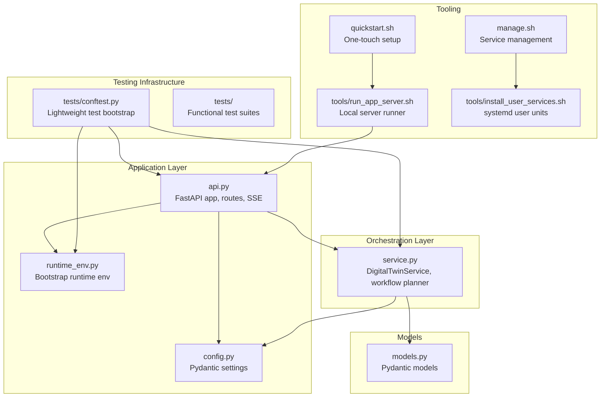
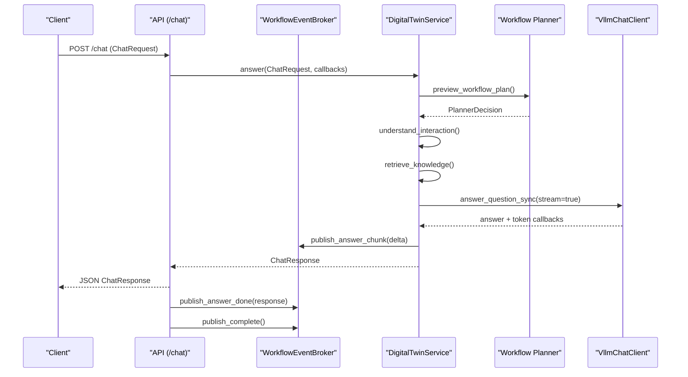
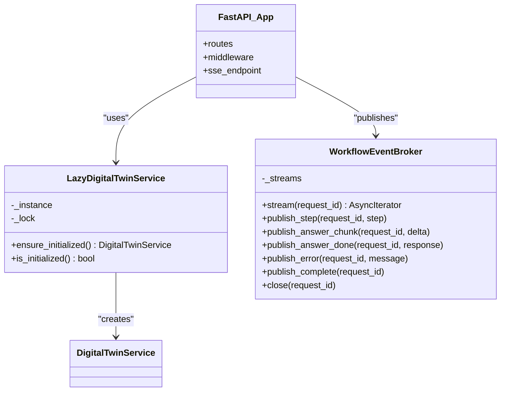
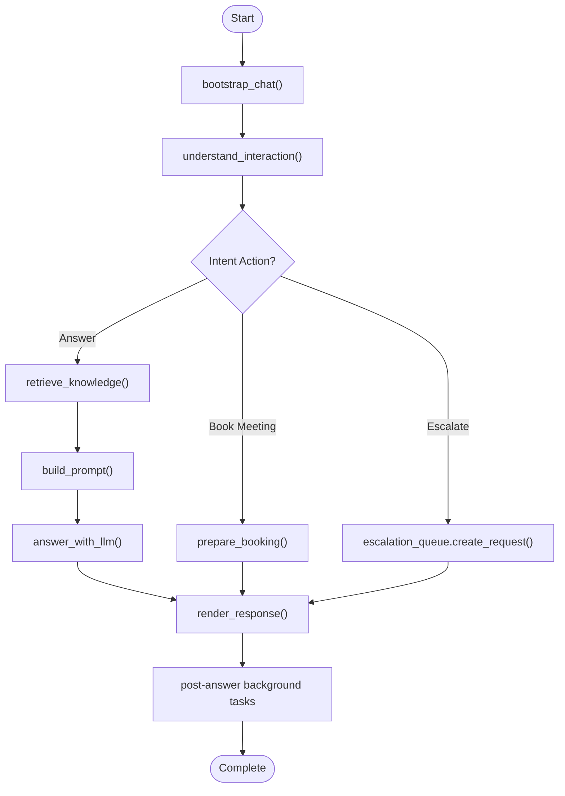
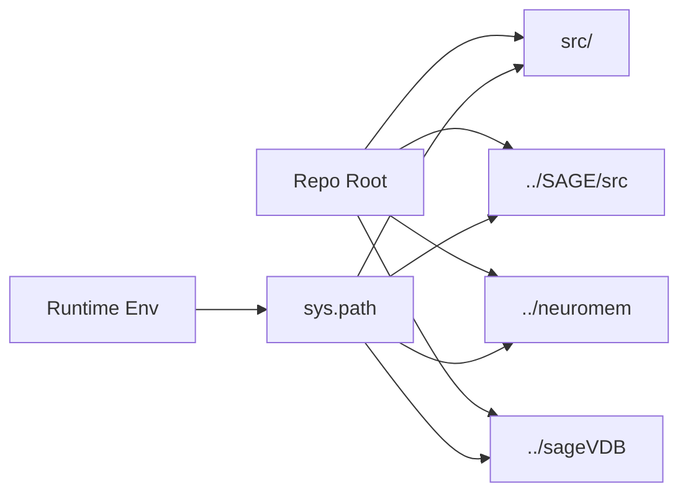
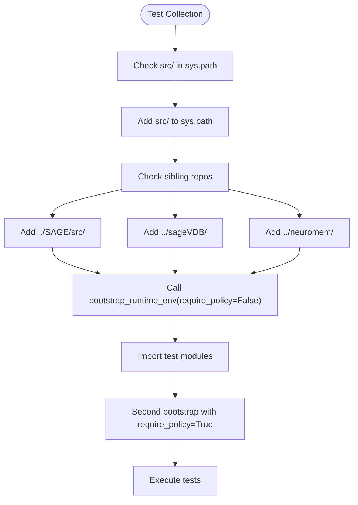
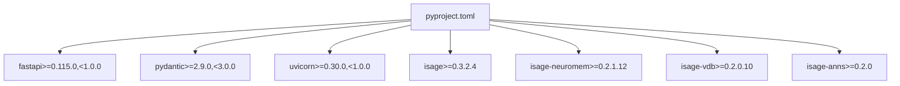

# Development Guide

<cite>
**Referenced Files in This Document**
- [README.md](file://README.md)
- [CONTRIBUTING.md](file://CONTRIBUTING.md)
- [pyproject.toml](file://pyproject.toml)
- [quickstart.sh](file://quickstart.sh)
- [manage.sh](file://manage.sh)
- [run_app_server.sh](file://tools/run_app_server.sh)
- [install_user_services.sh](file://tools/install_user_services.sh)
- [runtime_env.py](file://src/sage_faculty_twin/runtime_env.py)
- [config.py](file://src/sage_faculty_twin/config.py)
- [api.py](file://src/sage_faculty_twin/api.py)
- [service.py](file://src/sage_faculty_twin/service.py)
- [models.py](file://src/sage_faculty_twin/models.py)
- [test_chat_streaming.py](file://tests/test_chat_streaming.py)
- [test_workflow_policy.py](file://tests/test_workflow_policy.py)
- [conftest.py](file://tests/conftest.py)
- [.github/workflows/ci.yml](file://.github/workflows/ci.yml)
- [.github/agent.md](file://.github/agent.md)
</cite>

## Update Summary
**Changes Made**
- Updated dependency version constraints to reflect latest SAGE ecosystem releases
- Enhanced dependency management documentation with current version requirements
- Updated troubleshooting guidance for knowledge backend dependencies
- Improved testing infrastructure documentation with current dependency versions

## Table of Contents
1. [Introduction](#introduction)
2. [Project Structure](#project-structure)
3. [Core Components](#core-components)
4. [Architecture Overview](#architecture-overview)
5. [Detailed Component Analysis](#detailed-component-analysis)
6. [Dependency Analysis](#dependency-analysis)
7. [Performance Considerations](#performance-considerations)
8. [Troubleshooting Guide](#troubleshooting-guide)
9. [Contribution Guidelines](#contribution-guidelines)
10. [Build System and CI](#build-system-and-ci)
11. [Testing Infrastructure](#testing-infrastructure)
12. [Extending Functionality](#extending-functionality)
13. [Best Practices and Team Collaboration](#best-practices-and-team-collaboration)
14. [Conclusion](#conclusion)

## Introduction
This guide provides comprehensive development documentation for contributors and maintainers of the Sage Faculty Twin project. It covers environment setup, testing strategies, code structure conventions, contribution guidelines, build and dependency management, continuous integration processes, and practical guidance for extending functionality while maintaining code quality.

## Project Structure
The repository follows a layered architecture:
- Application entrypoint and HTTP surface in the API module
- Orchestrator and workflow engine in the service module
- Configuration and environment bootstrapping utilities
- Tests organized by functional area with enhanced conftest.py bootstrap
- Tooling for deployment, service management, and local development

**Diagram sources**
- [api.py](file://src/sage_faculty_twin/api.py)
- [service.py](file://src/sage_faculty_twin/service.py)
- [config.py](file://src/sage_faculty_twin/config.py)
- [runtime_env.py](file://src/sage_faculty_twin/runtime_env.py)
- [conftest.py](file://tests/conftest.py)
- [quickstart.sh](file://quickstart.sh)
- [run_app_server.sh](file://tools/run_app_server.sh)
- [manage.sh](file://manage.sh)
- [install_user_services.sh](file://tools/install_user_services.sh)

**Section sources**
- [README.md](file://README.md)
- [pyproject.toml](file://pyproject.toml)

## Core Components
- API module: Defines FastAPI routes, CORS, SSE event streaming, request parsing, and session management. It delegates orchestration to the service layer and enforces runtime environment bootstrapping.
- Service module: Implements the DigitalTwinService orchestrator, workflow planner integration, memory and knowledge stores, LLM client interactions, and streaming callbacks.
- Configuration: Centralized settings via Pydantic settings with environment variable prefix and multiple env file sources.
- Runtime environment: Bootstraps Python path, validates local policy and sageVDB sources, and ensures required modules are available.

Key responsibilities:
- HTTP surface: api.py
- Orchestration: service.py
- Storage and retrieval: dedicated stores accessed via service.py
- Configuration: config.py
- Environment: runtime_env.py

**Section sources**
- [api.py](file://src/sage_faculty_twin/api.py)
- [service.py](file://src/sage_faculty_twin/service.py)
- [config.py](file://src/sage_faculty_twin/config.py)
- [runtime_env.py](file://src/sage_faculty_twin/runtime_env.py)

## Architecture Overview
The system is a FastAPI application that exposes REST endpoints and an SSE endpoint for streaming workflow events. The API layer parses requests, validates payloads, and invokes the service layer. The service layer coordinates retrieval, planning, LLM interaction, and post-answer actions, publishing trace events and optional streaming tokens to clients.

**Diagram sources**
- [api.py](file://src/sage_faculty_twin/api.py)
- [service.py](file://src/sage_faculty_twin/service.py)

## Detailed Component Analysis

### API Module
Responsibilities:
- Define FastAPI app, middleware, and routes
- Parse multipart/form-data and JSON chat requests
- Enforce request validation and extract attachments
- Stream workflow events via SSE
- Manage admin/user sessions and cookies
- Expose health, stack versions, and hardware telemetry

Notable features:
- Lazy initialization of DigitalTwinService to defer heavy setup
- Streaming answer chunks and final structured response
- Keepalive mechanism to prevent proxy timeouts
- CORS configuration for local development

**Diagram sources**
- [api.py](file://src/sage_faculty_twin/api.py)

**Section sources**
- [api.py](file://src/sage_faculty_twin/api.py)

### Service Module
Responsibilities:
- Implement DigitalTwinService orchestrator
- Integrate workflow planner and policy enforcement
- Manage memory, knowledge, and user stores
- Coordinate LLM client interactions and streaming callbacks
- Track workflow traces and publish events

Key areas:
- Workflow planning and decision-making
- Retrieval and synthesis of knowledge/memory
- Post-answer background tasks and trace ordering
- Soft prompt caps and truncation strategies

**Diagram sources**
- [service.py](file://src/sage_faculty_twin/service.py)

**Section sources**
- [service.py](file://src/sage_faculty_twin/service.py)

### Configuration and Runtime Environment
- AppSettings loads environment variables with a standardized prefix and supports multiple env file locations.
- Runtime environment bootstrapper ensures local SAGE and sageVDB sources are visible, validates policy module location, and checks for required modules.

**Diagram sources**
- [runtime_env.py](file://src/sage_faculty_twin/runtime_env.py)
- [config.py](file://src/sage_faculty_twin/config.py)

**Section sources**
- [config.py](file://src/sage_faculty_twin/config.py)
- [runtime_env.py](file://src/sage_faculty_twin/runtime_env.py)

## Testing Infrastructure

### Enhanced Test Bootstrap with conftest.py
The project now features a sophisticated test bootstrap system through tests/conftest.py that provides lightweight test environment setup for sibling source checkouts with automatic PYTHONPATH configuration.

**Key Features:**
- Automatic PYTHONPATH configuration for local source checkouts (SAGE, sageVDB, neuromem)
- Lightweight bootstrap that delegates to runtime bootstrap without requiring full SAGE stack
- Seamless imports for sibling repositories during test collection
- Support for both development and production runtime environments

**Implementation Details:**
- Prepend repository root's src directory to sys.path for local imports
- Automatically detect and add sibling source checkouts (SAGE/src, sageVDB, neuromem)
- Call bootstrap_runtime_env(require_policy=False, require_fastapi=False) for test collection
- Second bootstrap call with require_policy=True occurs when modules are imported

**Diagram sources**
- [conftest.py](file://tests/conftest.py)
- [runtime_env.py](file://src/sage_faculty_twin/runtime_env.py)

**Section sources**
- [conftest.py](file://tests/conftest.py)
- [runtime_env.py](file://src/sage_faculty_twin/runtime_env.py)

### Testing Framework and Strategies
- Unit tests are organized per functional area and executed via pytest with automatic PYTHONPATH setup
- Streaming and SSE behavior is covered by targeted tests validating event ordering and token callbacks
- Workflow policy tests validate planner decisions and policy acceptance
- Enhanced test bootstrap eliminates manual PYTHONPATH configuration requirements

Recommended testing approach:
- Run narrow, focused tests using pytest with automatic conftest.py bootstrap
- Validate streaming behavior with short keepalive intervals to avoid proxy interference
- Verify policy loading and planner acceptance with custom policy files
- Leverage automatic sibling source checkout detection for comprehensive testing

**Section sources**
- [CONTRIBUTING.md](file://CONTRIBUTING.md)
- [test_chat_streaming.py](file://tests/test_chat_streaming.py)
- [test_workflow_policy.py](file://tests/test_workflow_policy.py)
- [conftest.py](file://tests/conftest.py)

## Dependency Analysis
The project uses a layered dependency model with updated version constraints:
- FastAPI and related HTTP libraries for the web framework
- Pydantic and pydantic-settings for configuration
- SAGE ecosystem integrations (isage>=0.3.2.4, isage-neuromem>=0.2.1.12, isage-vdb>=0.2.0.10, isage-anns>=0.2.0)
- Optional VDB backends and ANN algorithms

**Updated** Enhanced dependency version constraints reflecting latest SAGE ecosystem releases

**Diagram sources**
- [pyproject.toml](file://pyproject.toml)

**Section sources**
- [pyproject.toml](file://pyproject.toml)

## Performance Considerations
- Streaming answer chunks and SSE keepalive reduce perceived latency and prevent proxy timeouts.
- Prompt soft caps and truncation strategies bound LLM prompt sizes and improve stability.
- Post-answer background tasks decouple critical path from memory writes and follow-up planning.
- Environment bootstrapping avoids expensive module reloads and ensures local source preference.

## Troubleshooting Guide
Common issues and resolutions:
- Module import errors: Ensure PYTHONPATH includes the src directory and sibling repos as documented.
- Policy module mismatch: The runtime validator enforces local SAGE checkout presence and rejects non-local policy modules.
- sageVDB compilation: If DatabaseConfig is missing, link shared libraries as indicated by the runtime validator.
- Service startup failures: Use manage.sh to inspect unit statuses and logs; verify .env configuration and service installation.
- Test import failures: The conftest.py bootstrap automatically handles sibling source checkouts and PYTHONPATH configuration.
- CI workflow duplication: Recent updates have streamlined CI jobs to eliminate redundant testing processes.
- Knowledge backend dependencies: The runtime dependency checker now validates against updated version constraints (isage-vdb>=0.2.0.10, isage-anns>=0.2.0).

**Updated** Enhanced troubleshooting guidance based on recent operational runtime notes and CI improvements, including updated dependency version validation

**Section sources**
- [runtime_env.py](file://src/sage_faculty_twin/runtime_env.py)
- [manage.sh](file://manage.sh)
- [README.md](file://README.md)
- [conftest.py](file://tests/conftest.py)
- [.github/agent.md](file://.github/agent.md)
- [tools/run_app_server.sh](file://tools/run_app_server.sh)

## Contribution Guidelines
- Development environment: Use an existing non-venv Python environment and install dev dependencies with editable install.
- Repository boundaries: Do not commit secrets, generated runtime data, or personal deployment details.
- Validation: Run pytest with automatic conftest.py bootstrap, lint checks for frontend JS, and compile Python modules locally.
- Coding style: Keep changes small and focused; preserve the app architecture: HTTP surface in api.py, orchestration in service.py, storage and retrieval in dedicated modules.

**Section sources**
- [CONTRIBUTING.md](file://CONTRIBUTING.md)

## Build System and CI

### Streamlined CI Configuration
The CI workflow has been updated to remove duplicated job definitions and optimize testing processes:

**Key Improvements:**
- Consolidated linting and frontend validation into single jobs
- Removed redundant test execution across multiple job types
- Simplified dependency installation process using quickstart.sh
- Enhanced error reporting with shorter traceback format

**Current CI Structure:**
- Lint job: Installs via quickstart.sh, installs dev extras, runs Ruff lint
- Frontend job: Validates JavaScript syntax and runs frontend contract tests
- Test job: Executes comprehensive test suite with optimized ignore patterns

**Section sources**
- [.github/workflows/ci.yml](file://.github/workflows/ci.yml)

### Build Backend and Packaging
- Build backend: setuptools with wheel
- Packaging: Package directory configured to src
- Test discovery: pytest.ini_options directs pytest to the tests directory
- Optional dependencies: dev, vdb, and vdb-anns groups for development and knowledge backends

**Section sources**
- [pyproject.toml](file://pyproject.toml)

## Extending Functionality
Guidance for adding new features:
- Keep the HTTP surface in api.py and orchestration in service.py
- Add new stores or clients as needed and wire them into service.py
- Respect configuration via AppSettings and environment variables
- Add unit tests covering new behavior and edge cases
- Validate streaming and SSE behavior when applicable
- Leverage conftest.py automatic bootstrap for comprehensive testing

**Section sources**
- [api.py](file://src/sage_faculty_twin/api.py)
- [service.py](file://src/sage_faculty_twin/service.py)
- [config.py](file://src/sage_faculty_twin/config.py)
- [conftest.py](file://tests/conftest.py)

## Best Practices and Team Collaboration
- Use small, incremental changes and targeted tests
- Maintain separation of concerns: API, service, stores, and configuration
- Prefer root-cause fixes over UI-only workarounds
- Keep documentation and examples aligned with code changes
- Use manage.sh and systemd user services for consistent deployments
- Leverage conftest.py automatic bootstrap for seamless development experience
- Follow streamlined CI processes for faster feedback cycles

**Section sources**
- [CONTRIBUTING.md](file://CONTRIBUTING.md)
- [README.md](file://README.md)

## Conclusion
This guide consolidates development practices, architecture insights, and operational procedures for contributing to the Sage Faculty Twin project. The enhanced testing infrastructure with automatic conftest.py bootstrap provides seamless sibling source checkout support and eliminates manual PYTHONPATH configuration requirements. Recent CI workflow improvements have streamlined the development process by removing duplication and optimizing resource usage. The updated dependency version constraints reflect the latest SAGE ecosystem releases, ensuring compatibility and stability. By following the outlined conventions, testing strategies, and troubleshooting steps, contributors can efficiently extend functionality while preserving system reliability and performance.