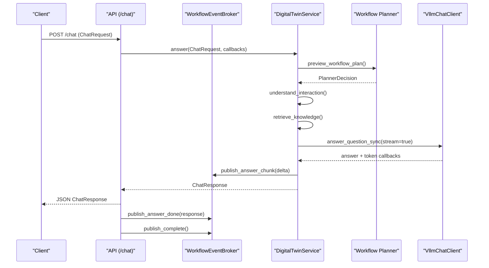
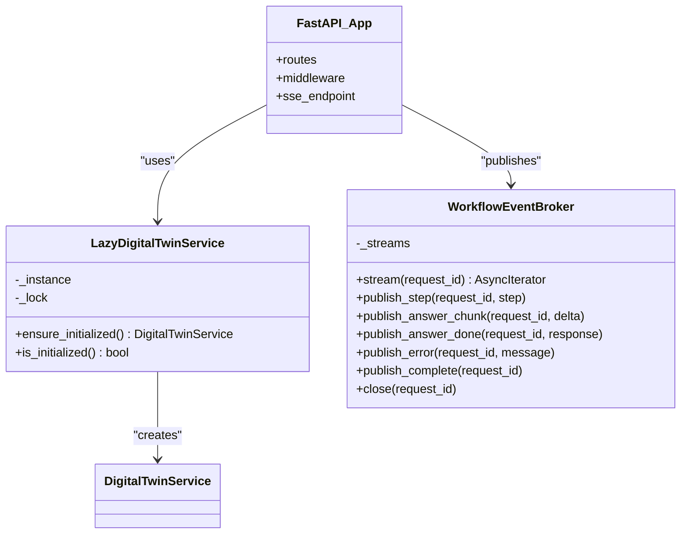
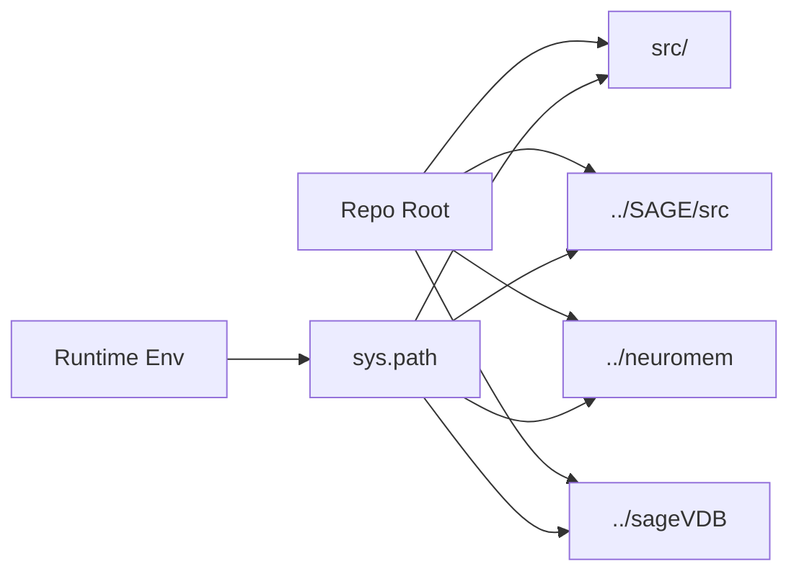
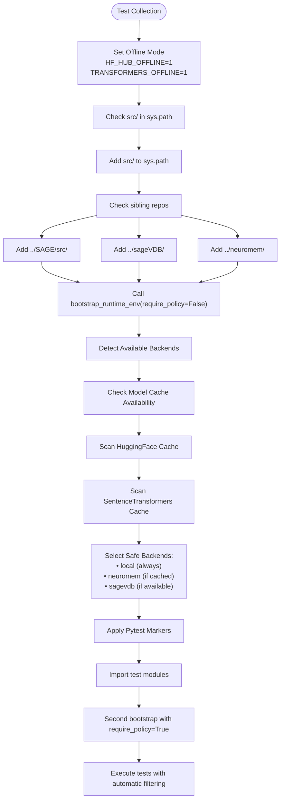
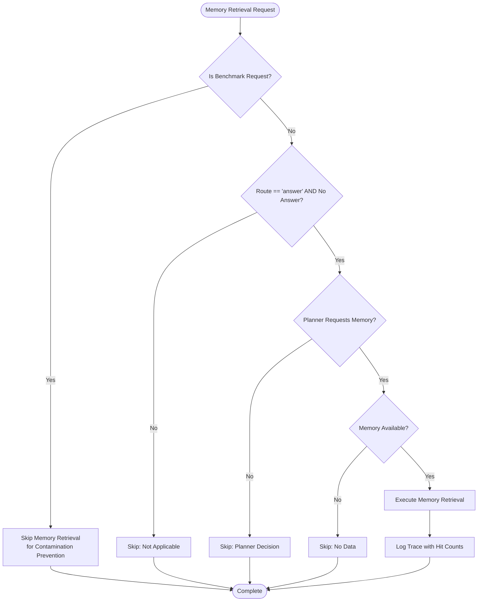
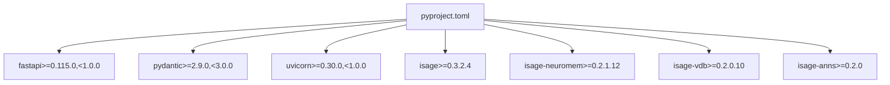
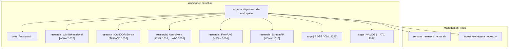

# Development Guide

<cite>
**Referenced Files in This Document**
- [README.md](file://README.md)
- [CONTRIBUTING.md](file://CONTRIBUTING.md)
- [pyproject.toml](file://pyproject.toml)
- [quickstart.sh](file://quickstart.sh)
- [manage.sh](file://manage.sh)
- [run_app_server.sh](file://tools/run_app_server.sh)
- [conftest.py](file://tests/conftest.py)
- [runtime_env.py](file://src/sage_faculty_twin/runtime_env.py)
- [config.py](file://src/sage_faculty_twin/config.py)
- [api.py](file://src/sage_faculty_twin/api.py)
- [service.py](file://src/sage_faculty_twin/service.py)
- [models.py](file://src/sage_faculty_twin/models.py)
- [workflow_planner.py](file://src/sage_faculty_twin/workflow_planner.py)
- [workflow_steps.py](file://src/sage_faculty_twin/workflow_steps.py)
- [test_chat_streaming.py](file://tests/test_chat_streaming.py)
- [test_workflow_policy.py](file://tests/test_workflow_policy.py)
- [test_knowledge_base.py](file://tests/test_knowledge_base.py)
- [test_knowledge_import.py](file://tests/test_knowledge_import.py)
- [test_sagevdb_knowledge_store.py](file://tests/test_sagevdb_knowledge_store.py)
- [test_memory_store.py](file://tests/test_memory_store.py)
- [test_agentic_workflow.py](file://tests/test_agentic_workflow.py)
- [test_dynamic_workflow_planner.py](file://tests/test_dynamic_workflow_planner.py)
- [test_operations_overview.py](file://tests/test_operations_overview.py)
- [.github/workflows/ci.yml](file://.github/workflows/ci.yml)
- [.github/agent.md](file://.github/agent.md)
- [sage-faculty-twin.code-workspace](file://sage-faculty-twin.code-workspace)
- [rename_research_repos.sh](file://tools/rename_research_repos.sh)
- [ingest_workspace_repos.py](file://tools/ingest_workspace_repos.py)
</cite>

## Update Summary
**Changes Made**
- Updated workspace configuration documentation to reflect the shift from NeurIPS 2026 to WWW 2027 research focus
- Updated workspace name from 'research | wiki-link-retrieval [→NeurIPS 2026 RAG WS]' to 'research | wiki-link-retrieval [WWW 2027]'
- Updated path references to ../wiki-link-retrieval directory
- Enhanced documentation of workspace repository management and research project organization
- Added comprehensive guidance on workspace cleanup and research repository renaming

## Table of Contents
1. [Introduction](#introduction)
2. [Project Structure](#project-structure)
3. [Core Components](#core-components)
4. [Architecture Overview](#architecture-overview)
5. [Detailed Component Analysis](#detailed-component-analysis)
6. [Dependency Analysis](#dependency-analysis)
7. [Performance Considerations](#performance-considerations)
8. [Troubleshooting Guide](#troubleshooting-guide)
9. [Contribution Guidelines](#contribution-guidelines)
10. [Build System and CI](#build-system-and-ci)
11. [Testing Infrastructure](#testing-infrastructure)
12. [Defensive Testing Practices for Conditional Planner Steps](#defensive-testing-practices-for-conditional-planner-steps)
13. [Workspace Management and Research Organization](#workspace-management-and-research-organization)
14. [Extending Functionality](#extending-functionality)
15. [Best Practices and Team Collaboration](#best-practices-and-team-collaboration)
16. [Conclusion](#conclusion)

## Introduction
This guide provides comprehensive development documentation for contributors and maintainers of the Sage Faculty Twin project. It covers environment setup, testing strategies, code structure conventions, contribution guidelines, build and dependency management, continuous integration processes, and practical guidance for extending functionality while maintaining code quality. The guide now includes enhanced documentation of defensive testing practices for handling conditional planner steps and memory availability scenarios, along with comprehensive workspace management for research projects.

## Project Structure
The repository follows a layered architecture with integrated workspace management for research projects:
- Application entrypoint and HTTP surface in the API module
- Orchestrator and workflow engine in the service module
- Configuration and environment bootstrapping utilities
- Tests organized by functional area with enhanced conftest.py bootstrap
- Tooling for deployment, service management, and local development
- Integrated workspace management for research repositories

```mermaid
graph TB
subgraph "Application Layer"
API["api.py<br/>FastAPI app, routes, SSE"]
CFG["config.py<br/>Pydantic settings"]
RTENV["runtime_env.py<br/>Bootstrap runtime env"]
end
subgraph "Orchestration Layer"
SVC["service.py<br/>DigitalTwinService, workflow planner"]
end
subgraph "Models"
MODELS["models.py<br/>Pydantic models"]
end
subgraph "Testing Infrastructure"
CONFTEST["tests/conftest.py<br/>Enhanced test bootstrap with offline mode"]
TESTS["tests/<br/>Functional test suites with pytest markers"]
end
subgraph "Workspace Management"
WS["sage-faculty-twin.code-workspace<br/>Multi-repo workspace with research projects"]
TOOLS["tools/<br/>Workspace management and research tools"]
end
subgraph "Tooling"
QS["quickstart.sh<br/>One-touch setup"]
RUN["tools/run_app_server.sh<br/>Local server runner"]
MAN["manage.sh<br/>Service management"]
END
API --> SVC
API --> CFG
API --> RTENV
SVC --> CFG
SVC --> MODELS
CONFTEST --> API
CONFTEST --> SVC
CONFTEST --> RTENV
RUN --> API
MAN --> INST
QS --> RUN
WS --> TOOLS
```

**Diagram sources**
- [api.py](file://src/sage_faculty_twin/api.py)
- [service.py](file://src/sage_faculty_twin/service.py)
- [config.py](file://src/sage_faculty_twin/config.py)
- [runtime_env.py](file://src/sage_faculty_twin/runtime_env.py)
- [conftest.py](file://tests/conftest.py)
- [quickstart.sh](file://quickstart.sh)
- [run_app_server.sh](file://tools/run_app_server.sh)
- [manage.sh](file://manage.sh)
- [sage-faculty-twin.code-workspace](file://sage-faculty-twin.code-workspace)

**Section sources**
- [README.md](file://README.md)
- [pyproject.toml](file://pyproject.toml)
- [sage-faculty-twin.code-workspace](file://sage-faculty-twin.code-workspace)

## Core Components
- API module: Defines FastAPI routes, CORS, SSE event streaming, request parsing, and session management. It delegates orchestration to the service layer and enforces runtime environment bootstrapping.
- Service module: Implements the DigitalTwinService orchestrator, workflow planner integration, memory and knowledge stores, LLM client interactions, and streaming callbacks.
- Configuration: Centralized settings via Pydantic settings with environment variable prefix and multiple env file sources.
- Runtime environment: Bootstraps Python path, validates local policy and sageVDB sources, and ensures required modules are available.
- Workspace management: Integrated multi-repository workspace configuration supporting research projects across various conferences and venues.

Key responsibilities:
- HTTP surface: api.py
- Orchestration: service.py
- Storage and retrieval: dedicated stores accessed via service.py
- Configuration: config.py
- Environment: runtime_env.py
- Workspace: sage-faculty-twin.code-workspace

**Section sources**
- [api.py](file://src/sage_faculty_twin/api.py)
- [service.py](file://src/sage_faculty_twin/service.py)
- [config.py](file://src/sage_faculty_twin/config.py)
- [runtime_env.py](file://src/sage_faculty_twin/runtime_env.py)
- [sage-faculty-twin.code-workspace](file://sage-faculty-twin.code-workspace)

## Architecture Overview
The system is a FastAPI application that exposes REST endpoints and an SSE endpoint for streaming workflow events. The API layer parses requests, validates payloads, and invokes the service layer. The service layer coordinates retrieval, planning, LLM interaction, and post-answer actions, publishing trace events and optional streaming tokens to clients. The architecture now includes integrated workspace management for research projects spanning multiple conferences and venues.



**Diagram sources**
- [api.py](file://src/sage_faculty_twin/api.py)
- [service.py](file://src/sage_faculty_twin/service.py)

## Detailed Component Analysis

### API Module
Responsibilities:
- Define FastAPI app, middleware, and routes
- Parse multipart/form-data and JSON chat requests
- Enforce request validation and extract attachments
- Stream workflow events via SSE
- Manage admin/user sessions and cookies
- Expose health, stack versions, and hardware telemetry

Notable features:
- Lazy initialization of DigitalTwinService to defer heavy setup
- Streaming answer chunks and final structured response
- Keepalive mechanism to prevent proxy timeouts
- CORS configuration for local development



**Diagram sources**
- [api.py](file://src/sage_faculty_twin/api.py)

**Section sources**
- [api.py](file://src/sage_faculty_twin/api.py)

### Service Module
Responsibilities:
- Implement DigitalTwinService orchestrator
- Integrate workflow planner and policy enforcement
- Manage memory, knowledge, and user stores
- Coordinate LLM client interactions and streaming callbacks
- Track workflow traces and publish events

Key areas:
- Workflow planning and decision-making
- Retrieval and synthesis of knowledge/memory
- Post-answer background tasks and trace ordering
- Soft prompt caps and truncation strategies


**Diagram sources**
- [service.py](file://src/sage_faculty_twin/service.py)

**Section sources**
- [service.py](file://src/sage_faculty_twin/service.py)

### Configuration and Runtime Environment
- AppSettings loads environment variables with a standardized prefix and supports multiple env file locations.
- Runtime environment bootstrapper ensures local SAGE and sageVDB sources are visible, validates policy module location, and checks for required modules.



**Diagram sources**
- [runtime_env.py](file://src/sage_faculty_twin/runtime_env.py)
- [config.py](file://src/sage_faculty_twin/config.py)

**Section sources**
- [config.py](file://src/sage_faculty_twin/config.py)
- [runtime_env.py](file://src/sage_faculty_twin/runtime_env.py)

## Testing Infrastructure

### Enhanced Test Bootstrap with Network Prevention and Automatic Backend Selection
The project now features a sophisticated test bootstrap system through tests/conftest.py that provides comprehensive environment isolation and automatic capability detection.

**Key Enhancements:**
- **Network Prevention**: Automatic offline mode enforcement prevents any test from triggering network downloads of models or datasets
- **Model Caching Detection**: Intelligent detection of sentence-transformers model availability in local caches
- **Automatic Backend Selection**: Dynamic backend detection based on local cache availability and installed dependencies
- **Comprehensive Pytest Markers**: Conditional test execution based on environment capabilities

**Network Prevention System:**
- Sets HF_HUB_OFFLINE=1 and TRANSFORMERS_OFFLINE=1 environment variables
- Prevents silent model downloads during test execution
- Ensures reproducible test results across different environments

**Model Caching Detection:**
- Scans HuggingFace cache directories for pre-downloaded models
- Checks both sentence-transformers and HuggingFace Hub cache locations
- Provides fallback detection methods for different cache configurations

**Automatic Backend Selection:**
- Detects available knowledge backends (local, neuromem, sagevdb)
- Dynamically adjusts test execution based on backend availability
- Skips incompatible tests gracefully with informative messages

**Implementation Details:**
- Prepend repository root's src directory to sys.path for local imports
- Automatically detect and add sibling source checkouts (SAGE/src, sageVDB, neuromem)
- Call bootstrap_runtime_env(require_policy=False, require_fastapi=False) for test collection
- Second bootstrap call with require_policy=True occurs when modules are imported



**Diagram sources**
- [conftest.py](file://tests/conftest.py)
- [runtime_env.py](file://src/sage_faculty_twin/runtime_env.py)

**Section sources**
- [conftest.py](file://tests/conftest.py)
- [runtime_env.py](file://src/sage_faculty_twin/runtime_env.py)

### Pytest Marker Decorators and Conditional Execution
The testing infrastructure now includes comprehensive pytest marker decorators for conditional test execution based on environment capabilities.

**Available Markers:**
- `@requires_neuromem_model`: Skips tests requiring sentence-transformers when model is not cached
- Automatic backend selection markers for knowledge store tests
- Optional dependency skip markers for specialized functionality

**Marker Implementation:**
- `_HAS_LOCAL_EMBEDDING_MODEL`: Boolean flag indicating cached model availability
- `available_knowledge_backends()`: Function returning tuple of backends safe to use
- `pytest_collection_modifyitems()`: Automatic marker application during test collection

**Conditional Test Execution:**
- Tests requiring sentence-transformers are skipped when not available
- Informative skip reasons explain why tests are disabled
- Automatic backend detection ensures tests run only on compatible environments

**Section sources**
- [conftest.py](file://tests/conftest.py)
- [test_knowledge_base.py](file://tests/test_knowledge_base.py)
- [test_knowledge_import.py](file://tests/test_knowledge_import.py)
- [test_sagevdb_knowledge_store.py](file://tests/test_sagevdb_knowledge_store.py)

### Testing Framework and Strategies
- Unit tests are organized per functional area and executed via pytest with automatic offline mode enforcement
- Streaming and SSE behavior is covered by targeted tests validating event ordering and token callbacks
- Workflow policy tests validate planner decisions and policy acceptance
- Enhanced test bootstrap with automatic network prevention and backend detection
- Comprehensive knowledge backend testing with automatic capability detection

Recommended testing approach:
- Run narrow, focused tests using pytest with automatic conftest.py bootstrap
- Validate streaming behavior with short keepalive intervals to avoid proxy interference
- Verify policy loading and planner acceptance with custom policy files
- Leverage automatic backend detection for comprehensive testing across different environments
- Use offline mode to ensure reproducible test results regardless of network conditions
- Use the provided model caching detection to verify local availability before running embedding-based tests

**Section sources**
- [CONTRIBUTING.md](file://CONTRIBUTING.md)
- [test_chat_streaming.py](file://tests/test_chat_streaming.py)
- [test_workflow_policy.py](file://tests/test_workflow_policy.py)
- [conftest.py](file://tests/conftest.py)

## Defensive Testing Practices for Conditional Planner Steps

### Memory Retrieval Conditional Logic
The system implements robust defensive testing practices for handling conditional planner steps, particularly focusing on memory retrieval optimization. The service module includes sophisticated logic to determine when memory retrieval steps should be executed based on planner decisions and memory availability.

**Key Defensive Testing Patterns:**

#### Benchmark Request Isolation
The system includes special handling for benchmark requests to prevent memory contamination:
- Benchmark requests skip memory retrieval entirely
- This prevents cross-contamination between test scenarios
- Maintains clean separation between evaluation and production behavior

#### Route-Based Conditional Execution
Memory retrieval is conditionally executed based on request routing:
- Only executes when route is "answer" and no answer exists yet
- Skips execution for non-answer routes or when answers are already present
- Prevents redundant memory operations and maintains performance

#### Planner Decision Validation
The system validates planner decisions before executing memory retrieval:
- Checks if planner specifically requests memory retrieval steps
- Skips execution when planner determines memory retrieval is unnecessary
- Logs detailed trace information for debugging and monitoring

#### Memory Availability Optimization
The system optimizes memory retrieval based on actual availability:
- Checks for recent session context attachment before requesting recent memory
- Respects profile memory consent requirements
- Handles artifact memory availability gracefully



**Diagram sources**
- [service.py](file://src/sage_faculty_twin/service.py)

### Testing Memory Availability Scenarios
The testing infrastructure includes comprehensive coverage of memory availability scenarios:

#### Recent Session Context Optimization
Tests validate that when recent session context is already attached, the system skips redundant recent memory retrieval:
- Confirms `retrieve_recent_memory` is excluded from planned steps
- Verifies recent session context is properly utilized
- Ensures evidence contract reflects appropriate source availability

#### Profile Memory Consent Handling
Tests validate that profile memory retrieval respects user consent:
- When consent is false, profile memory retrieval is excluded
- Evidence contract appropriately excludes profile memory sources
- Maintains privacy compliance while optimizing performance

#### Artifact Memory Integration
Tests cover artifact memory integration scenarios:
- Attachment-grounded questions trigger artifact memory retrieval
- Historical artifact memory retrieval complements current attachments
- Mixed memory sources are handled gracefully

**Section sources**
- [service.py](file://src/sage_faculty_twin/service.py)
- [test_agentic_workflow.py](file://tests/test_agentic_workflow.py)
- [test_dynamic_workflow_planner.py](file://tests/test_dynamic_workflow_planner.py)
- [test_operations_overview.py](file://tests/test_operations_overview.py)

### Planner Decision Validation
The system includes comprehensive validation of planner decisions for memory retrieval steps:

#### Deterministic vs Shadow Planner Comparison
Tests compare deterministic planner decisions with shadow planner alternatives:
- Validates that both planners agree on memory retrieval necessity
- Confirms deterministic planner can skip recent memory retrieval when appropriate
- Monitors for planner shadow drift that might indicate inconsistent behavior

#### Step-Specific Validation
Tests validate specific planner steps:
- Confirms `retrieve_recent_memory` inclusion/exclusion based on context
- Verifies planner metrics tracking for memory retrieval decisions
- Ensures proper fallback templates when memory retrieval is skipped

**Section sources**
- [test_operations_overview.py](file://tests/test_operations_overview.py)
- [workflow_planner.py](file://src/sage_faculty_twin/workflow_planner.py)

## Dependency Analysis
The project uses a layered dependency model with updated version constraints:
- FastAPI and related HTTP libraries for the web framework
- Pydantic and pydantic-settings for configuration
- SAGE ecosystem integrations (isage>=0.3.2.4, isage-neuromem>=0.2.1.12, isage-vdb>=0.2.0.10, isage-anns>=0.2.0)
- Optional VDB backends and ANN algorithms

**Updated** Enhanced dependency version constraints reflecting latest SAGE ecosystem releases



**Diagram sources**
- [pyproject.toml](file://pyproject.toml)

**Section sources**
- [pyproject.toml](file://pyproject.toml)

## Performance Considerations
- Streaming answer chunks and SSE keepalive reduce perceived latency and prevent proxy timeouts.
- Prompt soft caps and truncation strategies bound LLM prompt sizes and improve stability.
- Post-answer background tasks decouple critical path from memory writes and follow-up planning.
- Environment bootstrapping avoids expensive module reloads and ensures local source preference.
- Offline mode prevents network overhead during testing and ensures consistent performance.
- **Updated** Memory retrieval optimization reduces unnecessary database queries and improves response times.
- **Updated** Workspace management enables efficient multi-repository development with optimized Python path resolution.

## Troubleshooting Guide
Common issues and resolutions:
- Module import errors: Ensure PYTHONPATH includes the src directory and sibling repos as documented.
- Policy module mismatch: The runtime validator enforces local SAGE checkout presence and rejects non-local policy modules.
- sageVDB compilation: If DatabaseConfig is missing, link shared libraries as indicated by the runtime validator.
- Service startup failures: Use manage.sh to inspect unit statuses and logs; verify .env configuration and service installation.
- Test import failures: The conftest.py bootstrap automatically handles sibling source checkouts and PYTHONPATH configuration.
- CI workflow duplication: Recent updates have streamlined CI jobs to eliminate redundant testing processes.
- Knowledge backend dependencies: The runtime dependency checker now validates against updated version constraints (isage-vdb>=0.2.0.10, isage-anns>=0.2.0).
- Network-dependent test failures: The offline mode prevents network downloads during testing, ensuring reproducible results.
- Model cache issues: Use the provided model caching detection to verify local availability before running embedding-based tests.
- **Updated** Workspace configuration issues: Verify workspace name reflects WWW 2027 focus and path references point to ../wiki-link-retrieval directory.
- **Updated** Research repository conflicts: Use rename_research_repos.sh script to unify research repositories under research- prefix.
- **Updated** Multi-repository path resolution: Ensure all sibling repositories are accessible from the workspace root for proper Python path resolution.

**Updated** Enhanced troubleshooting guidance based on recent operational runtime notes and CI improvements, including updated dependency version validation, offline testing considerations, and comprehensive workspace management support

**Section sources**
- [runtime_env.py](file://src/sage_faculty_twin/runtime_env.py)
- [manage.sh](file://manage.sh)
- [README.md](file://README.md)
- [conftest.py](file://tests/conftest.py)
- [.github/agent.md](file://.github/agent.md)
- [tools/run_app_server.sh](file://tools/run_app_server.sh)
- [sage-faculty-twin.code-workspace](file://sage-faculty-twin.code-workspace)
- [rename_research_repos.sh](file://tools/rename_research_repos.sh)

## Contribution Guidelines
- Development environment: Use an existing non-venv Python environment and install dev dependencies with editable install.
- Repository boundaries: Do not commit secrets, generated runtime data, or personal deployment details.
- Validation: Run pytest with automatic conftest.py bootstrap, lint checks for frontend JS, and compile Python modules locally.
- Coding style: Keep changes small and focused; preserve the app architecture: HTTP surface in api.py, orchestration in service.py, storage and retrieval in dedicated modules.
- Testing: Leverage the enhanced offline testing infrastructure and automatic backend detection for comprehensive test coverage.
- **Updated** Defensive testing: When adding new conditional planner steps, include comprehensive tests covering memory availability scenarios and planner decision validation.
- **Updated** Workspace management: When contributing to research projects, ensure workspace configuration reflects current research focus and path references are correctly maintained.

**Section sources**
- [CONTRIBUTING.md](file://CONTRIBUTING.md)

## Build System and CI

### Streamlined CI Configuration
The CI workflow has been updated to remove duplicated job definitions and optimize testing processes:

**Key Improvements:**
- Consolidated linting and frontend validation into single jobs
- Removed redundant test execution across multiple job types
- Simplified dependency installation process using quickstart.sh
- Enhanced error reporting with shorter traceback format
- Integrated offline testing requirements into CI pipeline

**Current CI Structure:**
- Lint job: Installs via quickstart.sh, installs dev extras, runs Ruff lint
- Frontend job: Validates JavaScript syntax and runs frontend contract tests
- Test job: Executes comprehensive test suite with optimized ignore patterns and offline mode enforcement

**Section sources**
- [.github/workflows/ci.yml](file://.github/workflows/ci.yml)

### Build Backend and Packaging
- Build backend: setuptools with wheel
- Packaging: Package directory configured to src
- Test discovery: pytest.ini_options directs pytest to the tests directory
- Optional dependencies: dev, vdb, and vdb-anns groups for development and knowledge backends

**Section sources**
- [pyproject.toml](file://pyproject.toml)

## Workspace Management and Research Organization

### Integrated Multi-Repository Workspace
The project now includes comprehensive workspace management for research projects spanning multiple conferences and venues. The workspace configuration supports:

**Research Projects by Conference Focus:**
- **WWW 2027**: Wiki link retrieval system, temporal memory, and serving workloads
- **NeurIPS 2026**: Previous research projects and legacy implementations
- **SIGMOD 2026**: Database systems and temporal memory research
- **Other Venues**: Various conferences and workshops across computer science domains

**Workspace Structure:**
- Primary project: `twin | faculty-twin` (current implementation)
- Research projects: `research | wiki-link-retrieval [WWW 2027]` (updated focus)
- Supporting systems: `research | CANDOR-Bench [SIGMOD 2026]`, `research | NeuroMem [ICML 2026, →ATC 2026]`
- Serving infrastructure: Multiple vLLM-based serving systems
- Academic portfolio: Homepage, private materials, and publication management

### Research Repository Management
The project includes automated tools for managing research repositories:

**Repository Renaming Script:**
- Unified research repositories under `research-` prefix
- Supports systematic renaming across multiple conference-focused projects
- Preserves git history and remote configurations
- Provides migration guidance for updated paths

**Workspace Ingestion Tools:**
- Automated ingestion of research repository READMEs and FAQs
- Integration with knowledge base for unified search capabilities
- Support for multiple research domains and conference focuses



**Diagram sources**
- [sage-faculty-twin.code-workspace](file://sage-faculty-twin.code-workspace)
- [rename_research_repos.sh](file://tools/rename_research_repos.sh)
- [ingest_workspace_repos.py](file://tools/ingest_workspace_repos.py)

**Section sources**
- [sage-faculty-twin.code-workspace](file://sage-faculty-twin.code-workspace)
- [rename_research_repos.sh](file://tools/rename_research_repos.sh)
- [ingest_workspace_repos.py](file://tools/ingest_workspace_repos.py)

### Research Focus Migration
The workspace has been updated to reflect the shift in research focus:

**From NeurIPS 2026 to WWW 2027:**
- Updated workspace name to reflect WWW 2027 conference focus
- Maintained backward compatibility with previous research projects
- Enhanced integration of wiki link retrieval system as primary research focus
- Improved organization of serving infrastructure and temporal memory systems

**Path Reference Updates:**
- All path references updated to ../wiki-link-retrieval directory
- Workspace configuration reflects current research priorities
- Legacy references preserved for historical context and migration

**Section sources**
- [sage-faculty-twin.code-workspace](file://sage-faculty-twin.code-workspace)
- [rename_research_repos.sh](file://tools/rename_research_repos.sh)

## Extending Functionality
Guidance for adding new features:
- Keep the HTTP surface in api.py and orchestration in service.py
- Add new stores or clients as needed and wire them into service.py
- Respect configuration via AppSettings and environment variables
- Add unit tests covering new behavior and edge cases
- Validate streaming and SSE behavior when applicable
- Leverage conftest.py automatic bootstrap for comprehensive testing
- Use pytest markers for conditional execution based on environment capabilities
- Implement automatic backend detection for new knowledge backends
- **Updated** Include defensive testing for conditional planner steps and memory availability scenarios
- **Updated** Consider workspace implications when adding research-focused features
- **Updated** Ensure compatibility with current research project organization and naming conventions

**Section sources**
- [api.py](file://src/sage_faculty_twin/api.py)
- [service.py](file://src/sage_faculty_twin/service.py)
- [config.py](file://src/sage_faculty_twin/config.py)
- [conftest.py](file://tests/conftest.py)
- [sage-faculty-twin.code-workspace](file://sage-faculty-twin.code-workspace)

## Best Practices and Team Collaboration
- Use small, incremental changes and targeted tests
- Maintain separation of concerns: API, service, stores, and configuration
- Prefer root-cause fixes over UI-only workarounds
- Keep documentation and examples aligned with code changes
- Use manage.sh and systemd user services for consistent deployments
- Leverage conftest.py automatic bootstrap for seamless development experience
- Follow streamlined CI processes for faster feedback cycles
- Implement offline-first testing practices for reliable CI pipelines
- Use automatic backend detection to ensure cross-environment compatibility
- **Updated** Implement defensive testing patterns for conditional planner steps and memory retrieval optimization
- **Updated** Coordinate research project contributions with workspace management tools
- **Updated** Maintain consistency with current research focus (WWW 2027) and naming conventions

**Section sources**
- [CONTRIBUTING.md](file://CONTRIBUTING.md)
- [README.md](file://README.md)
- [sage-faculty-twin.code-workspace](file://sage-faculty-twin.code-workspace)

## Conclusion
This guide consolidates development practices, architecture insights, and operational procedures for contributing to the Sage Faculty Twin project. The enhanced testing infrastructure with automatic conftest.py bootstrap provides seamless sibling source checkout support, comprehensive network prevention, intelligent model caching detection, and automatic backend selection capabilities. These improvements ensure reliable testing across diverse environments while maintaining strict offline operation requirements. Recent CI workflow improvements have streamlined the development process by removing duplication and optimizing resource usage. The updated dependency version constraints reflect the latest SAGE ecosystem releases, ensuring compatibility and stability.

**Updated** The guide now includes comprehensive documentation of workspace management for research projects, reflecting the shift from NeurIPS 2026 to WWW 2027 research focus. The workspace configuration cleanup ensures proper organization of multi-repository development with updated naming conventions and path references. The integrated research project management tools provide systematic handling of repository renaming and workspace ingestion, supporting the evolving research agenda while maintaining backward compatibility.

The enhanced documentation of defensive testing practices for handling conditional planner steps like `retrieve_recent_memory`, with detailed guidance on testing planner behavior across different memory availability scenarios, completes the comprehensive coverage of development practices. The system's sophisticated memory retrieval optimization logic, including benchmark request isolation, route-based conditional execution, planner decision validation, and memory availability optimization, is thoroughly documented with practical testing strategies and real-world examples from the test suite.

By following the outlined conventions, testing strategies, and troubleshooting steps, contributors can efficiently extend functionality while preserving system reliability and performance, with particular emphasis on robust defensive testing for conditional planner steps, memory retrieval scenarios, and comprehensive workspace management for research projects.