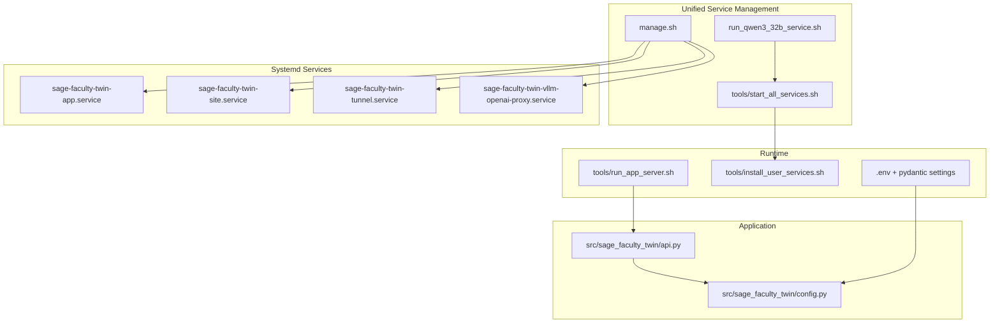
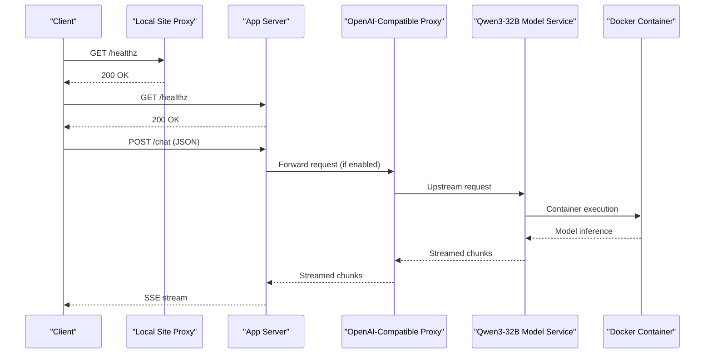

# Getting Started

<cite>
**Referenced Files in This Document**
- [README.md](file://README.md)
- [quickstart.sh](file://quickstart.sh)
- [manage.sh](file://manage.sh)
- [run_qwen3_32b_service.sh](file://run_qwen3_32b_service.sh)
- [pyproject.toml](file://pyproject.toml)
- [.env.example](file://.env.example)
- [deploy/systemd/user/sage-faculty-twin-app.service](file://deploy/systemd/user/sage-faculty-twin-app.service)
- [deploy/systemd/user/sage-faculty-twin-site.service](file://deploy/systemd/user/sage-faculty-twin-site.service)
- [deploy/systemd/user/sage-faculty-twin-tunnel.service](file://deploy/systemd/user/sage-faculty-twin-tunnel.service)
- [deploy/systemd/user/sage-faculty-twin-vllm-openai-proxy.service](file://deploy/systemd/user/sage-faculty-twin-vllm-openai-proxy.service)
- [tools/install_user_services.sh](file://tools/install_user_services.sh)
- [tools/start_all_services.sh](file://tools/start_all_services.sh)
- [tools/run_app_server.sh](file://tools/run_app_server.sh)
- [src/sage_faculty_twin/config.py](file://src/sage_faculty_twin/config.py)
</cite>

## Update Summary
**Changes Made**
- Updated service management section to reflect consolidated run_qwen3_32b_service.sh replacing individual deployment scripts
- Enhanced unified service management approach documentation
- Added comprehensive coverage of the unified Qwen3-32B model service management
- Updated deployment instructions to emphasize simplified service management commands

## Table of Contents
1. [Introduction](#introduction)
2. [Project Structure](#project-structure)
3. [Prerequisites](#prerequisites)
4. [Installation and Setup](#installation-and-setup)
5. [Environment Configuration (.env)](#environment-configuration-env)
6. [Initial Deployment and Verification](#initial-deployment-and-verification)
7. [Development vs Production Setups](#development-vs-production-setups)
8. [Unified Service Management Commands](#unified-service-management-commands)
9. [First API Calls and Basic Validation](#first-api-calls-and-basic-validation)
10. [Troubleshooting Guide](#troubleshooting-guide)
11. [Architecture Overview](#architecture-overview)
12. [Conclusion](#conclusion)

## Introduction
Sage Faculty Twin is a FastAPI-based digital twin application for a single instructor, integrating SAGE, NeuroMem, and an OpenAI-compatible LLM. It provides a 24/7 assistant with capabilities such as answering questions, managing schedules, and supporting web search and knowledge retrieval.

Key highlights:
- Backend recommendation: vllm-hust or Ascend-based vllm-ascend-hust.
- First-time deployment: use the quickstart script to install environment, dependencies, .env, and systemd services.
- Unified service management: simplified commands using consolidated run_qwen3_32b_service.sh for model service control.
- Full-stack startup (including model service): use the provided start-all script.
- Application default listener: 127.0.0.1:55601.

## Project Structure
High-level layout relevant to getting started:
- Root scripts for installation and management
- Unified service management through consolidated run_qwen3_32b_service.sh
- Systemd user services for app, site proxy, tunnel, and optional OpenAI-compatible proxy
- Runtime configuration via .env and pydantic settings
- FastAPI application entrypoint under src/sage_faculty_twin/api.py

**Diagram sources**
- [run_qwen3_32b_service.sh](file://run_qwen3_32b_service.sh)
- [tools/start_all_services.sh](file://tools/start_all_services.sh)
- [manage.sh](file://manage.sh)
- [deploy/systemd/user/sage-faculty-twin-app.service](file://deploy/systemd/user/sage-faculty-twin-app.service)
- [deploy/systemd/user/sage-faculty-twin-site.service](file://deploy/systemd/user/sage-faculty-twin-site.service)
- [deploy/systemd/user/sage-faculty-twin-tunnel.service](file://deploy/systemd/user/sage-faculty-twin-tunnel.service)
- [deploy/systemd/user/sage-faculty-twin-vllm-openai-proxy.service](file://deploy/systemd/user/sage-faculty-twin-vllm-openai-proxy.service)
- [tools/run_app_server.sh](file://tools/run_app_server.sh)
- [src/sage_faculty_twin/config.py](file://src/sage_faculty_twin/config.py)

**Section sources**
- [README.md](file://README.md)
- [pyproject.toml](file://pyproject.toml)

## Prerequisites
Minimum prerequisites:
- Linux operating system
- Python 3.11 (non-venv environment)
- Sibling repositories located at the same parent level:
  - ../SAGE
  - ../neuromem
  - ../sageVDB
- Accessible vllm-hust OpenAI-compatible endpoint (default 127.0.0.1:18000)

Notes:
- The project requires Python 3.11 as per the project metadata.
- The quickstart script validates presence of git and Python 3.11+ and checks for NVIDIA GPUs if present.

**Section sources**
- [README.md](file://README.md)
- [pyproject.toml](file://pyproject.toml)
- [quickstart.sh](file://quickstart.sh)

## Installation and Setup
Follow these steps to install and configure Sage Faculty Twin:

1) Run the quickstart script to install environment, dependencies, .env, and systemd services:
- Basic install: ./quickstart.sh
- Also install vllm-hust (editable): ./quickstart.sh --with-vllm
- Install and start systemd services: ./quickstart.sh --start
- Non-interactive mode: ./quickstart.sh --yes

2) After installation, edit .env to set at minimum:
- DIGITAL_TWIN_OWNER_NAME and DIGITAL_TWIN_OWNER_ROLE
- DIGITAL_TWIN_LLM_BASE_URL (point directly to vllm-hust)
- DIGITAL_TWIN_API_KEY (use a real key if enabling the OpenAI proxy)
- DIGITAL_TWIN_MODEL_NAME
- DIGITAL_TWIN_ADMIN_PASSWORD

3) Launch the model service using the unified management approach:
- Start Qwen3-32B service: ./run_qwen3_32b_service.sh
- Stop Qwen3-32B service: ./run_qwen3_32b_service.sh --stop

4) Manage services using manage.sh:
- View status: ./manage.sh status
- Start/stop/restart: ./manage.sh start | stop | restart
- Restart with optional components: ./manage.sh restart --with-vllm-proxy | --with-tunnel | --with-site-proxy
- Reinstall and start services: ./manage.sh install --start

5) For a full-stack startup including model service, site proxy, and tunnel:
- Default preset: bash tools/start_all_services.sh
- Choose preset: bash tools/start_all_services.sh --preset w8a8
- Skip model service: bash tools/start_all_services.sh --skip-model

Notes:
- The quickstart script ensures environment variables are exported before launching the app so streaming and timeout settings are applied correctly.
- The script avoids overwriting existing .env values and only appends missing keys.
- The unified run_qwen3_32b_service.sh consolidates model service management into a single, simplified interface.

**Section sources**
- [README.md](file://README.md)
- [quickstart.sh](file://quickstart.sh)
- [manage.sh](file://manage.sh)
- [run_qwen3_32b_service.sh](file://run_qwen3_32b_service.sh)
- [tools/start_all_services.sh](file://tools/start_all_services.sh)

## Environment Configuration (.env)
Critical environment variables (minimum required):
- DIGITAL_TWIN_LLM_BASE_URL: e.g., http://127.0.0.1:18000/v1
- DIGITAL_TWIN_API_KEY: use EMPTY for local direct connection; switch to a real key when using the OpenAI-compatible proxy
- DIGITAL_TWIN_MODEL_NAME: e.g., meta-llama/Llama-3.1-8B-Instruct
- DIGITAL_TWIN_STREAM_CHAT_ANSWER: set to true to enable streaming

Optional web search:
- DIGITAL_TWIN_TAVILY_TOKEN (or TAVILY_TOKEN)
- DIGITAL_TWIN_WEB_SEARCH_ENABLED: set to true to enable

OpenAI-compatible proxy (optional):
- VLLM_PROXY_HOST, VLLM_PROXY_PORT, VLLM_PROXY_PATH_PREFIX, VLLM_PROXY_UPSTREAM_BASE_URL, VLLM_PROXY_UPSTREAM_API_KEY

The quickstart script creates .env from .env.example and appends latency/streaming-related defaults if missing.

**Section sources**
- [README.md](file://README.md)
- [.env.example](file://.env.example)
- [quickstart.sh](file://quickstart.sh)

## Initial Deployment and Verification
After installation and configuration:

1) Start the services using unified management:
- Using systemd: ./manage.sh restart (optionally with --with-vllm-proxy or --with-tunnel)
- Or run the app directly for development: bash tools/run_app_server.sh
- Manage model service: ./run_qwen3_32b_service.sh (for Qwen3-32B)

2) Verify the application:
- Health check: curl -s http://127.0.0.1:55601/healthz
- Homepage: curl -s -o /dev/null -w '%{http_code}\n' http://127.0.0.1:55601/
- Chat endpoint (requires student_name and question): curl -s -N http://127.0.0.1:55601/chat -H 'Content-Type: application/json' -d '{"student_name":"Test Student","question":"Please introduce yourself in one sentence"}'

3) Browser verification:
- Open http://127.0.0.1:55601/ in a browser to confirm the frontend loads.

Notes:
- The smoke test in quickstart.sh checks if the app responds on the configured port.
- Streaming requires the upstream LLM to emit Transfer-Encoding: chunked.
- Model service verification: ensure Qwen3-32B is running via ./run_qwen3_32b_service.sh status.

**Section sources**
- [README.md](file://README.md)
- [quickstart.sh](file://quickstart.sh)
- [run_qwen3_32b_service.sh](file://run_qwen3_32b_service.sh)

## Development vs Production Setups
- Development:
  - Use tools/run_app_server.sh to run the app directly for rapid iteration.
  - Edit .env and run the server locally without systemd.
  - Manage model service with ./run_qwen3_32b_service.sh for local testing.

- Production:
  - Use quickstart.sh to install systemd user services.
  - Manage services with manage.sh and optionally enable the OpenAI-compatible proxy and Cloudflare tunnel.
  - Use unified service management for model services via run_qwen3_32b_service.sh.
  - The systemd units define restart policies and working directories suitable for long-running operation.

Key differences:
- Service orchestration: systemd user services vs direct process.
- Unified model management: consolidated run_qwen3_32b_service.sh vs individual deployment scripts.
- Proxy and tunnel: optional in production via manage.sh and start_all_services.sh.
- Streaming and timeouts: controlled via .env and validated during quickstart.

**Section sources**
- [README.md](file://README.md)
- [tools/run_app_server.sh](file://tools/run_app_server.sh)
- [manage.sh](file://manage.sh)
- [run_qwen3_32b_service.sh](file://run_qwen3_32b_service.sh)
- [tools/start_all_services.sh](file://tools/start_all_services.sh)

## Unified Service Management Commands
**Updated** Simplified service management with consolidated run_qwen3_32b_service.sh replacing individual deployment scripts

Common management actions:

### Application and Systemd Services
- View status: ./manage.sh status
- Start/stop/restart: ./manage.sh start | stop | restart
- Restart with optional components:
  - --with-vllm-proxy (OpenAI-compatible proxy)
  - --with-tunnel (Cloudflare tunnel)
  - --with-site-proxy (local site proxy)
- Reinstall and start services: ./manage.sh install --start

### Unified Model Service Management
- Start Qwen3-32B service: ./run_qwen3_32b_service.sh
- Gracefully stop Qwen3-32B service: ./run_qwen3_32b_service.sh --stop

### Under the Hood
- manage.sh composes a list of service units based on flags and invokes systemctl --user.
- run_qwen3_32b_service.sh provides a unified interface for Qwen3-32B model service management within Docker containers.
- tools/install_user_services.sh renders and installs systemd units, resolves the Python interpreter, and enables the requested services.

**Section sources**
- [manage.sh](file://manage.sh)
- [run_qwen3_32b_service.sh](file://run_qwen3_32b_service.sh)
- [tools/install_user_services.sh](file://tools/install_user_services.sh)
- [deploy/systemd/user/sage-faculty-twin-app.service](file://deploy/systemd/user/sage-faculty-twin-app.service)
- [deploy/systemd/user/sage-faculty-twin-site.service](file://deploy/systemd/user/sage-faculty-twin-site.service)
- [deploy/systemd/user/sage-faculty-twin-tunnel.service](file://deploy/systemd/user/sage-faculty-twin-tunnel.service)
- [deploy/systemd/user/sage-faculty-twin-vllm-openai-proxy.service](file://deploy/systemd/user/sage-faculty-twin-vllm-openai-proxy.service)

## First API Calls and Basic Validation
Example validations to perform after deployment:

- Health check:
  - curl -s http://127.0.0.1:55601/healthz

- Homepage:
  - curl -s -o /dev/null -w '%{http_code}\n' http://127.0.0.1:55601/

- Chat endpoint:
  - curl -s -N http://127.0.0.1:55601/chat -H 'Content-Type: application/json' -d '{"student_name":"Test Student","question":"Please introduce yourself in one sentence"}'

- Optional OpenAI-compatible proxy verification:
  - List models: curl -H 'Authorization: Bearer <your-key>' http://127.0.0.1:18001/v1/models
  - Chat completion: curl -X POST http://127.0.0.1:18001/v1/chat/completions -H 'Authorization: Bearer <your-key>' -H 'Content-Type: application/json' -d '{"model":"Qwen3-32B","messages":[{"role":"user","content":"hi"}],"max_tokens":5}'

- Model service verification:
  - Check Qwen3-32B status: ./run_qwen3_32b_service.sh
  - Verify model endpoint: curl -s http://127.0.0.1:18000/v1/models

Notes:
- Ensure DIGITAL_TWIN_STREAM_CHAT_ANSWER=true for streaming responses.
- If using the proxy, update DIGITAL_TWIN_LLM_BASE_URL to point to the proxy and set DIGITAL_TWIN_API_KEY to a real key.
- Model service requires proper Docker container setup with NPU devices for Ascend-based deployment.

**Section sources**
- [README.md](file://README.md)
- [run_qwen3_32b_service.sh](file://run_qwen3_32b_service.sh)

## Troubleshooting Guide
Common issues and resolutions:

- Module import errors:
  - "No module named sage_faculty_twin": ensure you run the app via the provided scripts to avoid external PYTHONPATH interference.
  - "cannot import name policy from sage.serving.integrations": ensure PYTHONPATH includes ../SAGE/src to pick the correct SAGE package.

- API request errors:
  - "/chat 422": ensure the request body includes student_name and question.

- Streaming issues:
  - No stream: confirm DIGITAL_TWIN_STREAM_CHAT_ANSWER=true and that the upstream LLM emits Transfer-Encoding: chunked.

- Service management:
  - Use manage.sh status to inspect service states.
  - Check logs with journalctl --user -u <service-name> -f.

- Model service issues:
  - Docker container problems: verify container ID matches run_qwen3_32b_service.sh configuration.
  - NPU device access: ensure proper permissions and driver installation.
  - Graceful shutdown: use ./run_qwen3_32b_service.sh --stop for proper cleanup.

- Quickstart-specific:
  - If the app is not yet listening on the configured port, run ./manage.sh restart or ./quickstart.sh --start.
  - The script warns if vllm-hust is not reachable and instructs to launch the model service locally or via Docker.

**Section sources**
- [README.md](file://README.md)
- [quickstart.sh](file://quickstart.sh)
- [run_qwen3_32b_service.sh](file://run_qwen3_32b_service.sh)

## Architecture Overview
The system comprises:
- Application server (FastAPI) with configuration loaded from .env via pydantic settings
- Unified model service management through run_qwen3_32b_service.sh
- Optional OpenAI-compatible proxy for vLLM
- Local site proxy for development and static assets
- Cloudflare tunnel for external exposure
- Systemd user services for reliable, restart-on-failure operation

**Diagram sources**
- [tools/run_app_server.sh](file://tools/run_app_server.sh)
- [run_qwen3_32b_service.sh](file://run_qwen3_32b_service.sh)
- [deploy/systemd/user/sage-faculty-twin-site.service](file://deploy/systemd/user/sage-faculty-twin-site.service)
- [deploy/systemd/user/sage-faculty-twin-vllm-openai-proxy.service](file://deploy/systemd/user/sage-faculty-twin-vllm-openai-proxy.service)
- [src/sage_faculty_twin/config.py](file://src/sage_faculty_twin/config.py)

## Conclusion
You now have the essential steps to install, configure, and validate Sage Faculty Twin with unified service management. Use quickstart.sh for a streamlined setup, manage.sh for consolidated service lifecycle management, and run_qwen3_32b_service.sh for simplified model service control. The unified approach eliminates the complexity of managing multiple deployment scripts while maintaining full functionality. For production deployments, leverage systemd user services, optional proxies/tunnels, and the consolidated service management commands as needed.