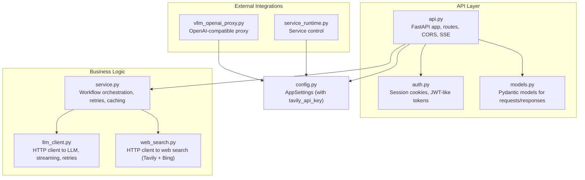
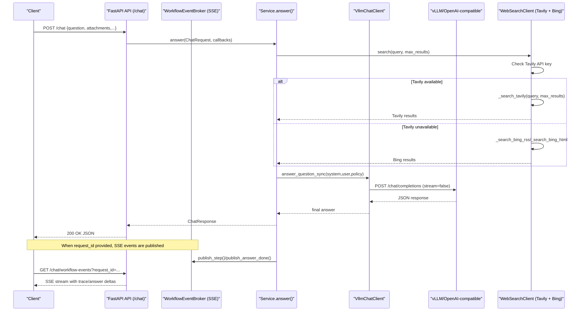
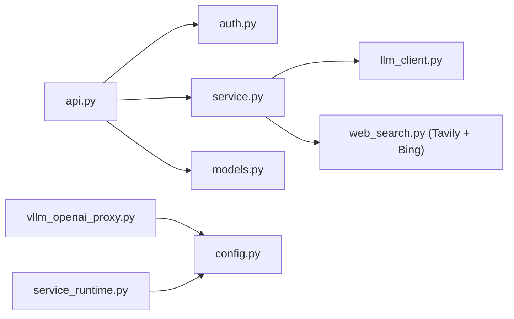

# API Integration

<cite>
**Referenced Files in This Document**
- [api.py](file://src/sage_faculty_twin/api.py)
- [auth.py](file://src/sage_faculty_twin/auth.py)
- [config.py](file://src/sage_faculty_twin/config.py)
- [service.py](file://src/sage_faculty_twin/service.py)
- [llm_client.py](file://src/sage_faculty_twin/llm_client.py)
- [vllm_openai_proxy.py](file://src/sage_faculty_twin/vllm_openai_proxy.py)
- [web_search.py](file://src/sage_faculty_twin/web_search.py)
- [service_runtime.py](file://src/sage_faculty_twin/service_runtime.py)
- [models.py](file://src/sage_faculty_twin/models.py)
- [README.md](file://README.md)
</cite>

## Update Summary
**Changes Made**
- Added documentation for the new `tavily_api_key` configuration field in AppSettings
- Updated WebSearchClient initialization to include Tavily API key parameter
- Enhanced web search functionality documentation to cover Tavily integration
- Updated configuration reference to include TAVILY_TOKEN environment variable
- Added troubleshooting guidance for Tavily API key configuration

## Table of Contents
1. [Introduction](#introduction)
2. [Project Structure](#project-structure)
3. [Core Components](#core-components)
4. [Architecture Overview](#architecture-overview)
5. [Detailed Component Analysis](#detailed-component-analysis)
6. [Dependency Analysis](#dependency-analysis)
7. [Performance Considerations](#performance-considerations)
8. [Troubleshooting Guide](#troubleshooting-guide)
9. [Conclusion](#conclusion)
10. [Appendices](#appendices)

## Introduction
This document explains how the application integrates with external APIs and services, focusing on RESTful endpoint consumption patterns, authentication mechanisms, data exchange formats, HTTP client configuration, request/response serialization, error handling strategies, and rate limiting considerations. It also covers real-time event processing via server-sent events (SSE), webhook-like patterns, and operational controls. Practical examples demonstrate consuming external APIs (web search), optional OpenAI-compatible proxying, and graceful handling of upstream failures with retry logic and exponential backoff.

**Updated** The application now includes seamless integration with Tavily search functionality through the new `tavily_api_key` configuration field, enabling enhanced web search capabilities with purpose-built AI search results.

## Project Structure
The API surface is implemented as a FastAPI application with modular components:
- API endpoints and routing live in the API module.
- Authentication and session management are handled separately.
- Business orchestration and workflow execution are encapsulated in the service module.
- HTTP clients for LLM and web search are implemented in dedicated modules.
- Optional OpenAI-compatible proxying is provided by a separate FastAPI app.
- Operational controls expose service management endpoints.

**Diagram sources**
- [api.py:90-91](file://src/sage_faculty_twin/api.py#L90-L91)
- [auth.py:16-17](file://src/sage_faculty_twin/auth.py#L16-L17)
- [service.py:581-634](file://src/sage_faculty_twin/service.py#L581-L634)
- [llm_client.py:68-90](file://src/sage_faculty_twin/llm_client.py#L68-L90)
- [web_search.py:93-107](file://src/sage_faculty_twin/web_search.py#L93-L107)
- [vllm_openai_proxy.py:123-135](file://src/sage_faculty_twin/vllm_openai_proxy.py#L123-L135)
- [service_runtime.py:13-29](file://src/sage_faculty_twin/service_runtime.py#L13-L29)
- [config.py:9-131](file://src/sage_faculty_twin/config.py#L9-L131)

**Section sources**
- [api.py:90-91](file://src/sage_faculty_twin/api.py#L90-L91)
- [README.md:1-126](file://README.md#L1-L126)

## Core Components
- FastAPI application with CORS and SSE endpoints for real-time streaming.
- Session-based authentication using signed cookie tokens with HMAC signatures.
- LLM client with configurable timeouts, retries, streaming, and response caching.
- Web search client with timeouts and result scoring/reranking, now featuring Tavily integration as the primary search backend.
- Optional OpenAI-compatible proxy with bearer-token authentication.
- Operational controls for managed services.

**Updated** The web search client now prioritizes Tavily (purpose-built for AI) as the primary search backend, falling back to Bing RSS/HTML when Tavily is unavailable or when no API key is configured.

Key implementation references:
- API app creation and middleware: [api.py:90-91](file://src/sage_faculty_twin/api.py#L90-L91), [api.py:79-87](file://src/sage_faculty_twin/api.py#L79-L87)
- SSE event broker and streaming: [api.py:170-254](file://src/sage_faculty_twin/api.py#L170-L254), [api.py:597-609](file://src/sage_faculty_twin/api.py#L597-L609)
- Authentication helpers and cookies: [auth.py:16-86](file://src/sage_faculty_twin/auth.py#L16-L86), [auth.py:119-129](file://src/sage_faculty_twin/auth.py#L119-L129)
- LLM client configuration and retries: [llm_client.py:68-90](file://src/sage_faculty_twin/llm_client.py#L68-L90), [llm_client.py:681-756](file://src/sage_faculty_twin/llm_client.py#L681-L756)
- Web search client with Tavily integration: [web_search.py:93-107](file://src/sage_faculty_twin/web_search.py#L93-L107), [web_search.py:128-135](file://src/sage_faculty_twin/web_search.py#L128-L135), [web_search.py:145-168](file://src/sage_faculty_twin/web_search.py#L145-L168)
- OpenAI proxy app: [vllm_openai_proxy.py:123-135](file://src/sage_faculty_twin/vllm_openai_proxy.py#L123-L135), [vllm_openai_proxy.py:170-251](file://src/sage_faculty_twin/vllm_openai_proxy.py#L170-L251)
- Service runtime control: [service_runtime.py:13-29](file://src/sage_faculty_twin/service_runtime.py#L13-L29)

**Section sources**
- [api.py:79-87](file://src/sage_faculty_twin/api.py#L79-L87)
- [api.py:170-254](file://src/sage_faculty_twin/api.py#L170-L254)
- [api.py:597-609](file://src/sage_faculty_twin/api.py#L597-L609)
- [auth.py:16-86](file://src/sage_faculty_twin/auth.py#L16-L86)
- [auth.py:119-129](file://src/sage_faculty_twin/auth.py#L119-L129)
- [llm_client.py:68-90](file://src/sage_faculty_twin/llm_client.py#L68-L90)
- [llm_client.py:681-756](file://src/sage_faculty_twin/llm_client.py#L681-L756)
- [web_search.py:93-107](file://src/sage_faculty_twin/web_search.py#L93-L107)
- [web_search.py:128-135](file://src/sage_faculty_twin/web_search.py#L128-L135)
- [web_search.py:145-168](file://src/sage_faculty_twin/web_search.py#L145-L168)
- [vllm_openai_proxy.py:123-135](file://src/sage_faculty_twin/vllm_openai_proxy.py#L123-L135)
- [vllm_openai_proxy.py:170-251](file://src/sage_faculty_twin/vllm_openai_proxy.py#L170-L251)
- [service_runtime.py:13-29](file://src/sage_faculty_twin/service_runtime.py#L13-L29)

## Architecture Overview
The system exposes REST endpoints backed by a workflow orchestrator. The orchestrator coordinates retrieval, planning, LLM invocation, and post-answer side effects. Real-time updates are streamed via SSE. Optional OpenAI-compatible proxying allows controlled access to the upstream LLM service. The web search functionality now integrates Tavily as the primary search backend with Bing as a fallback option.

**Diagram sources**
- [api.py:618-700](file://src/sage_faculty_twin/api.py#L618-L700)
- [api.py:597-609](file://src/sage_faculty_twin/api.py#L597-L609)
- [service.py:1640-1692](file://src/sage_faculty_twin/service.py#L1640-L1692)
- [llm_client.py:758-800](file://src/sage_faculty_twin/llm_client.py#L758-L800)
- [web_search.py:114-141](file://src/sage_faculty_twin/web_search.py#L114-L141)
- [web_search.py:145-168](file://src/sage_faculty_twin/web_search.py#L145-L168)

**Section sources**
- [api.py:618-700](file://src/sage_faculty_twin/api.py#L618-L700)
- [api.py:597-609](file://src/sage_faculty_twin/api.py#L597-L609)
- [service.py:1640-1692](file://src/sage_faculty_twin/service.py#L1640-L1692)
- [llm_client.py:758-800](file://src/sage_faculty_twin/llm_client.py#L758-L800)
- [web_search.py:114-141](file://src/sage_faculty_twin/web_search.py#L114-L141)
- [web_search.py:145-168](file://src/sage_faculty_twin/web_search.py#L145-L168)

## Detailed Component Analysis

### REST Endpoint Consumption Patterns
- JSON and multipart/form-data parsing for chat requests.
- Form fields sanitized and validated; attachments extracted and text-normalized.
- Streaming vs. non-streaming responses; SSE endpoint supports keepalive and typed events.

References:
- [api.py:370-406](file://src/sage_faculty_twin/api.py#L370-L406)
- [api.py:328-367](file://src/sage_faculty_twin/api.py#L328-L367)
- [api.py:597-609](file://src/sage_faculty_twin/api.py#L597-L609)

**Section sources**
- [api.py:328-367](file://src/sage_faculty_twin/api.py#L328-L367)
- [api.py:370-406](file://src/sage_faculty_twin/api.py#L370-L406)
- [api.py:597-609](file://src/sage_faculty_twin/api.py#L597-L609)

### Authentication Mechanisms
- Session cookies for admin and user roles with HMAC-signed payloads.
- Token building and verification with expiration checks.
- Cookie helpers set httponly/lax cookies and enforce TTLs.

References:
- [auth.py:16-86](file://src/sage_faculty_twin/auth.py#L16-L86)
- [auth.py:193-214](file://src/sage_faculty_twin/auth.py#L193-L214)
- [api.py:479-510](file://src/sage_faculty_twin/api.py#L479-L510)

**Section sources**
- [auth.py:16-86](file://src/sage_faculty_twin/auth.py#L16-L86)
- [auth.py:193-214](file://src/sage_faculty_twin/auth.py#L193-L214)
- [api.py:479-510](file://src/sage_faculty_twin/api.py#L479-L510)

### Data Exchange Formats
- Pydantic models define strict request/response schemas.
- ChatRequest supports attachments, visitor profiles, and flags for behavior.
- SSE publishes typed events (trace-step, answer_delta, answer_done, keepalive).

References:
- [models.py:16-31](file://src/sage_faculty_twin/models.py#L16-L31)
- [models.py:199-200](file://src/sage_faculty_twin/models.py#L199-L200)
- [api.py:211-241](file://src/sage_faculty_twin/api.py#L211-L241)

**Section sources**
- [models.py:16-31](file://src/sage_faculty_twin/models.py#L16-L31)
- [models.py:199-200](file://src/sage_faculty_twin/models.py#L199-L200)
- [api.py:211-241](file://src/sage_faculty_twin/api.py#L211-L241)

### HTTP Client Configuration
- LLM client configured with base URL, Authorization header, timeouts, and connection limits.
- Intent classification client uses a separate base URL and shorter timeout.
- Web search client configured with timeouts and user-agent, now with Tavily API key support.

**Updated** The web search client now supports Tavily as the primary search backend when a valid API key is provided, with Bing as a fallback option.

References:
- [llm_client.py:68-90](file://src/sage_faculty_twin/llm_client.py#L68-L90)
- [web_search.py:128-135](file://src/sage_faculty_twin/web_search.py#L128-L135)
- [web_search.py:145-168](file://src/sage_faculty_twin/web_search.py#L145-L168)
- [config.py:20-26](file://src/sage_faculty_twin/config.py#L20-L26)

**Section sources**
- [llm_client.py:68-90](file://src/sage_faculty_twin/llm_client.py#L68-L90)
- [web_search.py:128-135](file://src/sage_faculty_twin/web_search.py#L128-L135)
- [web_search.py:145-168](file://src/sage_faculty_twin/web_search.py#L145-L168)
- [config.py:20-26](file://src/sage_faculty_twin/config.py#L20-L26)

### Request/Response Serialization
- FastAPI automatic serialization/deserialization via Pydantic models.
- Validation errors raised as HTTP 422; JSON parsing errors mapped to 400.
- SSE payloads serialized as JSON strings per event.

References:
- [api.py:397-405](file://src/sage_faculty_twin/api.py#L397-L405)
- [api.py:211-241](file://src/sage_faculty_twin/api.py#L211-L241)

**Section sources**
- [api.py:397-405](file://src/sage_faculty_twin/api.py#L397-L405)
- [api.py:211-241](file://src/sage_faculty_twin/api.py#L211-L241)

### Error Handling Strategies
- Validation errors surfaced as RequestValidationError/HTTP 422.
- Timeout handling with structured 504 gateway timeout for chat requests.
- Web search failures logged and treated as no results, with Tavily exceptions caught and fallback to Bing.
- Proxy authentication errors return 401 with standardized error payload.
- LLM streaming timeouts retried according to configured attempts.

**Updated** Web search failures now include Tavily API key validation and exception handling, with automatic fallback to Bing search when Tavily is unavailable.

References:
- [api.py:259-260](file://src/sage_faculty_twin/api.py#L259-L260)
- [api.py:641-645](file://src/sage_faculty_twin/api.py#L641-L645)
- [web_search.py:1174-1181](file://src/sage_faculty_twin/web_search.py#L1174-L1181)
- [web_search.py:121-128](file://src/sage_faculty_twin/web_search.py#L121-L128)
- [vllm_openai_proxy.py:85-96](file://src/sage_faculty_twin/vllm_openai_proxy.py#L85-L96)
- [llm_client.py:740-747](file://src/sage_faculty_twin/llm_client.py#L740-L747)

**Section sources**
- [api.py:259-260](file://src/sage_faculty_twin/api.py#L259-L260)
- [api.py:641-645](file://src/sage_faculty_twin/api.py#L641-L645)
- [web_search.py:1174-1181](file://src/sage_faculty_twin/web_search.py#L1174-L1181)
- [web_search.py:121-128](file://src/sage_faculty_twin/web_search.py#L121-L128)
- [vllm_openai_proxy.py:85-96](file://src/sage_faculty_twin/vllm_openai_proxy.py#L85-L96)
- [llm_client.py:740-747](file://src/sage_faculty_twin/llm_client.py#L740-L747)

### Rate Limiting Considerations
- No explicit global rate limiter is implemented in the API.
- Upstream LLM rate limiting is governed by the upstream service and/or the serving policy integration.
- Connection limits and concurrency are managed by the HTTP client configuration.
- Tavily API rate limiting is handled by the upstream Tavily service.

**Updated** Tavily API rate limiting is now managed by the upstream Tavily service, with automatic fallback to Bing search when Tavily rate limits are exceeded.

References:
- [llm_client.py:78-79](file://src/sage_faculty_twin/llm_client.py#L78-L79)
- [llm_client.py:88-89](file://src/sage_faculty_twin/llm_client.py#L88-L89)
- [web_search.py:145-168](file://src/sage_faculty_twin/web_search.py#L145-L168)

**Section sources**
- [llm_client.py:78-79](file://src/sage_faculty_twin/llm_client.py#L78-L79)
- [llm_client.py:88-89](file://src/sage_faculty_twin/llm_client.py#L88-L89)
- [web_search.py:145-168](file://src/sage_faculty_twin/web_search.py#L145-L168)

### Real-Time Event Processing (SSE)
- SSE endpoint streams workflow trace steps and answer deltas.
- Keepalive events prevent proxy timeouts during long LLM decoding pauses.
- Typed events allow clients to distinguish trace steps, streaming deltas, and completion.

References:
- [api.py:170-254](file://src/sage_faculty_twin/api.py#L170-L254)
- [api.py:597-609](file://src/sage_faculty_twin/api.py#L597-L609)

**Section sources**
- [api.py:170-254](file://src/sage_faculty_twin/api.py#L170-L254)
- [api.py:597-609](file://src/sage_faculty_twin/api.py#L597-L609)

### Consuming External APIs
- Web search client performs HTTP requests to Tavily (primary) and Bing (fallback), parses results, and reranks them.
- LLM client invokes OpenAI-compatible endpoints with configurable headers and timeouts.

**Updated** The web search client now prioritizes Tavily as the primary search backend when a valid API key is configured, automatically falling back to Bing search when Tavily is unavailable or when no API key is provided.

References:
- [web_search.py:137-219](file://src/sage_faculty_twin/web_search.py#L137-L219)
- [web_search.py:145-168](file://src/sage_faculty_twin/web_search.py#L145-L168)
- [llm_client.py:758-800](file://src/sage_faculty_twin/llm_client.py#L758-L800)

**Section sources**
- [web_search.py:137-219](file://src/sage_faculty_twin/web_search.py#L137-L219)
- [web_search.py:145-168](file://src/sage_faculty_twin/web_search.py#L145-L168)
- [llm_client.py:758-800](file://src/sage_faculty_twin/llm_client.py#L758-L800)

### Webhook Implementations
- The SSE-based workflow events act as a webhook-like push mechanism to clients.
- No inbound webhook endpoints are exposed in the API module.

References:
- [api.py:597-609](file://src/sage_faculty_twin/api.py#L597-L609)

**Section sources**
- [api.py:597-609](file://src/sage_faculty_twin/api.py#L597-L609)

### API Versioning, Backward Compatibility, and Migration
- The API app sets a version string for informational purposes.
- No explicit version negotiation or deprecation strategy is implemented in the API module.
- Backward compatibility is maintained by preserving request/response shapes and adding optional fields.

References:
- [api.py](file://src/sage_faculty_twin/api.py#L90)

**Section sources**
- [api.py](file://src/sage_faculty_twin/api.py#L90)

### Practical Examples

#### Example: Calling the Chat Endpoint
- Send a POST request to the chat endpoint with JSON or multipart/form-data.
- Optionally supply a request_id to receive SSE updates.

References:
- [api.py:618-700](file://src/sage_faculty_twin/api.py#L618-L700)
- [README.md:47-55](file://README.md#L47-L55)

**Section sources**
- [api.py:618-700](file://src/sage_faculty_twin/api.py#L618-L700)
- [README.md:47-55](file://README.md#L47-L55)

#### Example: Using the OpenAI-Compatible Proxy
- Configure DIGITAL_TWIN_API_KEY and upstream base URL.
- Access /v1 endpoints through the proxy with Authorization: Bearer <key>.

References:
- [vllm_openai_proxy.py:36-65](file://src/sage_faculty_twin/vllm_openai_proxy.py#L36-L65)
- [vllm_openai_proxy.py:170-251](file://src/sage_faculty_twin/vllm_openai_proxy.py#L170-L251)
- [README.md:81-102](file://README.md#L81-L102)

**Section sources**
- [vllm_openai_proxy.py:36-65](file://src/sage_faculty_twin/vllm_openai_proxy.py#L36-L65)
- [vllm_openai_proxy.py:170-251](file://src/sage_faculty_twin/vllm_openai_proxy.py#L170-L251)
- [README.md:81-102](file://README.md#L81-L102)

#### Example: Handling API Failures Gracefully
- Web search failures are caught and logged; the system continues with Bing fallback.
- Proxy authentication failures return a standardized 401 error payload.
- Tavily API key validation ensures graceful degradation when API key is invalid.

**Updated** Web search failures now include Tavily API key validation and exception handling, with automatic fallback to Bing search when Tavily is unavailable or when the API key is invalid.

References:
- [web_search.py:1174-1181](file://src/sage_faculty_twin/web_search.py#L1174-L1181)
- [web_search.py:121-128](file://src/sage_faculty_twin/web_search.py#L121-L128)
- [vllm_openai_proxy.py:85-96](file://src/sage_faculty_twin/vllm_openai_proxy.py#L85-L96)

**Section sources**
- [web_search.py:1174-1181](file://src/sage_faculty_twin/web_search.py#L1174-L1181)
- [web_search.py:121-128](file://src/sage_faculty_twin/web_search.py#L121-L128)
- [vllm_openai_proxy.py:85-96](file://src/sage_faculty_twin/vllm_openai_proxy.py#L85-L96)

#### Example: Implementing Retry Logic with Exponential Backoff
- LLM client retries on timeout with incremental sleep between attempts.
- Retry attempts and backoff are configurable via settings.

References:
- [llm_client.py:681-756](file://src/sage_faculty_twin/llm_client.py#L681-L756)
- [config.py:25-26](file://src/sage_faculty_twin/config.py#L25-L26)

**Section sources**
- [llm_client.py:681-756](file://src/sage_faculty_twin/llm_client.py#L681-L756)
- [config.py:25-26](file://src/sage_faculty_twin/config.py#L25-L26)

#### Example: Configuring Tavily Search Integration
- Set `DIGITAL_TWIN_TAVILY_API_KEY` environment variable to enable Tavily search.
- Configure `DIGITAL_TWIN_WEB_SEARCH_ENABLED=true` to activate web search functionality.
- The system will automatically prioritize Tavily results with Bing as fallback.

**New** This example demonstrates the new Tavily API key configuration and integration process.

References:
- [config.py:75](file://src/sage_faculty_twin/config.py#L75)
- [service.py:629-633](file://src/sage_faculty_twin/service.py#L629-L633)
- [README.md:54-58](file://README.md#L54-L58)

**Section sources**
- [config.py:75](file://src/sage_faculty_twin/config.py#L75)
- [service.py:629-633](file://src/sage_faculty_twin/service.py#L629-L633)
- [README.md:54-58](file://README.md#L54-L58)

## Dependency Analysis
The following diagram highlights key dependencies among modules:

**Diagram sources**
- [api.py:22-29](file://src/sage_faculty_twin/api.py#L22-L29)
- [service.py:24-37](file://src/sage_faculty_twin/service.py#L24-L37)
- [llm_client.py:24-28](file://src/sage_faculty_twin/llm_client.py#L24-L28)
- [web_search.py:9-10](file://src/sage_faculty_twin/web_search.py#L9-L10)
- [vllm_openai_proxy.py:25-34](file://src/sage_faculty_twin/vllm_openai_proxy.py#L25-L34)
- [service_runtime.py:8-10](file://src/sage_faculty_twin/service_runtime.py#L8-L10)
- [config.py:9-15](file://src/sage_faculty_twin/config.py#L9-L15)

**Section sources**
- [api.py:22-29](file://src/sage_faculty_twin/api.py#L22-L29)
- [service.py:24-37](file://src/sage_faculty_twin/service.py#L24-L37)
- [llm_client.py:24-28](file://src/sage_faculty_twin/llm_client.py#L24-L28)
- [web_search.py:9-10](file://src/sage_faculty_twin/web_search.py#L9-L10)
- [vllm_openai_proxy.py:25-34](file://src/sage_faculty_twin/vllm_openai_proxy.py#L25-L34)
- [service_runtime.py:8-10](file://src/sage_faculty_twin/service_runtime.py#L8-L10)
- [config.py:9-15](file://src/sage_faculty_twin/config.py#L9-L15)

## Performance Considerations
- Streaming responses and SSE reduce perceived latency for long LLM answers.
- Prompt soft caps and truncation strategies bound prompt sizes to control latency.
- Response caching reduces repeated upstream calls for identical prompts.
- Connection limits and timeouts protect the service under load.
- Tavily search integration provides faster, AI-optimized results compared to traditional web search.

**Updated** Tavily search integration provides faster, AI-optimized results compared to traditional web search, with automatic fallback to Bing when Tavily is unavailable.

References:
- [api.py:145-147](file://src/sage_faculty_twin/api.py#L145-L147)
- [service.py:432-444](file://src/sage_faculty_twin/service.py#L432-L444)
- [llm_client.py:96-127](file://src/sage_faculty_twin/llm_client.py#L96-L127)
- [web_search.py:145-168](file://src/sage_faculty_twin/web_search.py#L145-L168)

**Section sources**
- [api.py:145-147](file://src/sage_faculty_twin/api.py#L145-L147)
- [service.py:432-444](file://src/sage_faculty_twin/service.py#L432-L444)
- [llm_client.py:96-127](file://src/sage_faculty_twin/llm_client.py#L96-L127)
- [web_search.py:145-168](file://src/sage_faculty_twin/web_search.py#L145-L168)

## Troubleshooting Guide
Common issues and resolutions:
- Authentication failures: Verify session cookies and admin/user credentials.
- Validation errors: Ensure request bodies conform to Pydantic models.
- Timeouts: Adjust DIGITAL_TWIN_CHAT_REQUEST_TIMEOUT_SECONDS and upstream LLM timeouts.
- Proxy authentication errors: Confirm DIGITAL_TWIN_API_KEY and Authorization header.
- Web search failures: Check network connectivity and TAVILY_TOKEN configuration.
- Tavily API key issues: Verify DIGITAL_TWIN_TAVILY_API_KEY is set and valid; check Tavily account status.
- Fallback behavior: When Tavily is unavailable, the system automatically falls back to Bing search.

**Updated** Added troubleshooting guidance for Tavily API key configuration and fallback behavior.

References:
- [auth.py:158-172](file://src/sage_faculty_twin/auth.py#L158-L172)
- [api.py:259-260](file://src/sage_faculty_twin/api.py#L259-L260)
- [api.py:641-645](file://src/sage_faculty_twin/api.py#L641-L645)
- [vllm_openai_proxy.py:85-96](file://src/sage_faculty_twin/vllm_openai_proxy.py#L85-L96)
- [web_search.py:121-128](file://src/sage_faculty_twin/web_search.py#L121-L128)
- [README.md:111-117](file://README.md#L111-L117)

**Section sources**
- [auth.py:158-172](file://src/sage_faculty_twin/auth.py#L158-L172)
- [api.py:259-260](file://src/sage_faculty_twin/api.py#L259-L260)
- [api.py:641-645](file://src/sage_faculty_twin/api.py#L641-L645)
- [vllm_openai_proxy.py:85-96](file://src/sage_faculty_twin/vllm_openai_proxy.py#L85-L96)
- [web_search.py:121-128](file://src/sage_faculty_twin/web_search.py#L121-L128)
- [README.md:111-117](file://README.md#L111-L117)

## Conclusion
The application provides a robust REST API with strong request/response validation, session-based authentication, and real-time streaming capabilities. It integrates with external services via dedicated HTTP clients, implements retry logic with exponential backoff, and offers optional OpenAI-compatible proxying. The new Tavily search integration enhances web search capabilities with AI-optimized results, while maintaining backward compatibility through automatic fallback to Bing search. Operational controls and configuration-driven behavior enable flexible deployment and tuning.

**Updated** The application now includes seamless Tavily search integration as the primary web search backend, with automatic fallback to Bing search when Tavily is unavailable, providing enhanced AI-optimized search results for improved user experience.

## Appendices

### Appendix A: Configuration Reference
Key environment variables and settings:
- DIGITAL_TWIN_LLM_BASE_URL, DIGITAL_TWIN_API_KEY, DIGITAL_TWIN_MODEL_NAME
- DIGITAL_TWIN_STREAM_CHAT_ANSWER
- DIGITAL_TWIN_WEB_SEARCH_ENABLED, DIGITAL_TWIN_TAVILY_API_KEY (NEW)
- VLLM_PROXY_PORT, VLLM_PROXY_UPSTREAM_BASE_URL, VLLM_PROXY_PATH_PREFIX

**Updated** Added DIGITAL_TWIN_TAVILY_API_KEY configuration field for Tavily search integration.

References:
- [README.md:57-70](file://README.md#L57-L70)
- [README.md:81-102](file://README.md#L81-L102)
- [config.py:20-26](file://src/sage_faculty_twin/config.py#L20-L26)
- [config.py:75](file://src/sage_faculty_twin/config.py#L75)

**Section sources**
- [README.md:57-70](file://README.md#L57-L70)
- [README.md:81-102](file://README.md#L81-L102)
- [config.py:20-26](file://src/sage_faculty_twin/config.py#L20-L26)
- [config.py:75](file://src/sage_faculty_twin/config.py#L75)

### Appendix B: Tavily Search Integration Details
The Tavily integration provides several advantages over traditional web search:
- AI-optimized search results specifically designed for AI applications
- Faster response times compared to general web search engines
- Better relevance for technical and academic queries
- Automatic fallback to Bing search when Tavily is unavailable or when no API key is configured

**New** This appendix provides detailed information about the Tavily search integration and its benefits.

References:
- [web_search.py:145-168](file://src/sage_faculty_twin/web_search.py#L145-L168)
- [service.py:629-633](file://src/sage_faculty_twin/service.py#L629-L633)

**Section sources**
- [web_search.py:145-168](file://src/sage_faculty_twin/web_search.py#L145-L168)
- [service.py:629-633](file://src/sage_faculty_twin/service.py#L629-L633)