# Capability Plugin System

<cite>
**Referenced Files in This Document**
- [capability_plugins.py](file://src/sage_faculty_twin/capability_plugins.py)
- [workflow_steps.py](file://src/sage_faculty_twin/workflow_steps.py)
- [workflow_planner.py](file://src/sage_faculty_twin/workflow_planner.py)
- [workflow_policy.py](file://src/sage_faculty_twin/workflow_policy.py)
- [course_advising.json](file://data/capability_plugins/course_advising.json)
- [meeting_prep.json](file://data/capability_plugins/meeting_prep.json)
- [paper_feedback.json](file://data/capability_plugins/paper_feedback.json)
- [research_mentoring.json](file://data/capability_plugins/research_mentoring.json)
- [thesis_review.json](file://data/capability_plugins/thesis_review.json)
- [test_capability_plugins.py](file://tests/test_capability_plugins.py)
- [service.py](file://src/sage_faculty_twin/service.py)
- [service_runtime.py](file://src/sage_faculty_twin/service_runtime.py)
- [__init__.py](file://src/sage_faculty_twin/__init__.py)
</cite>

## Update Summary
**Changes Made**
- Enhanced deterministic plugin routing with automatic injection based on query analysis
- Added four new capability plugin packs: meeting_prep, research_mentoring, thesis_review
- Expanded existing plugins with new step types and capabilities
- Updated workflow planner to support intelligent plugin step injection

## Table of Contents
1. [Introduction](#introduction)
2. [System Architecture](#system-architecture)
3. [Core Components](#core-components)
4. [Plugin Manifest Schema](#plugin-manifest-schema)
5. [Enhanced Deterministic Plugin Routing](#enhanced-deterministic-plugin-routing)
6. [Capability Plugin Registry](#capability-plugin-registry)
7. [Integration with Workflow System](#integration-with-workflow-system)
8. [Expanded Plugin Ecosystem](#expanded-plugin-ecosystem)
9. [Testing and Validation](#testing-and-validation)
10. [Deployment and Management](#deployment-and-management)
11. [Best Practices](#best-practices)

## Introduction

The Capability Plugin System is a modular extension mechanism introduced in version 3.3 of the SAGE Faculty Twin application. This system enables administrators to add specialized workflow capabilities through external JSON manifests without modifying the core application code. The system now features enhanced deterministic plugin routing that automatically injects plugin steps based on query analysis, supporting both read-only and draft-writing capabilities across multiple domains.

The plugin system operates on a manifest-driven architecture where each plugin declares its workflow steps, policy requirements, and compatibility constraints. The system validates plugin manifests, checks version compatibility, and intelligently merges valid plugins into the core step registry during application startup, with automatic step injection based on query semantics.

## System Architecture

The Capability Plugin System follows an enhanced layered architecture that integrates with the existing workflow infrastructure and supports intelligent plugin routing:

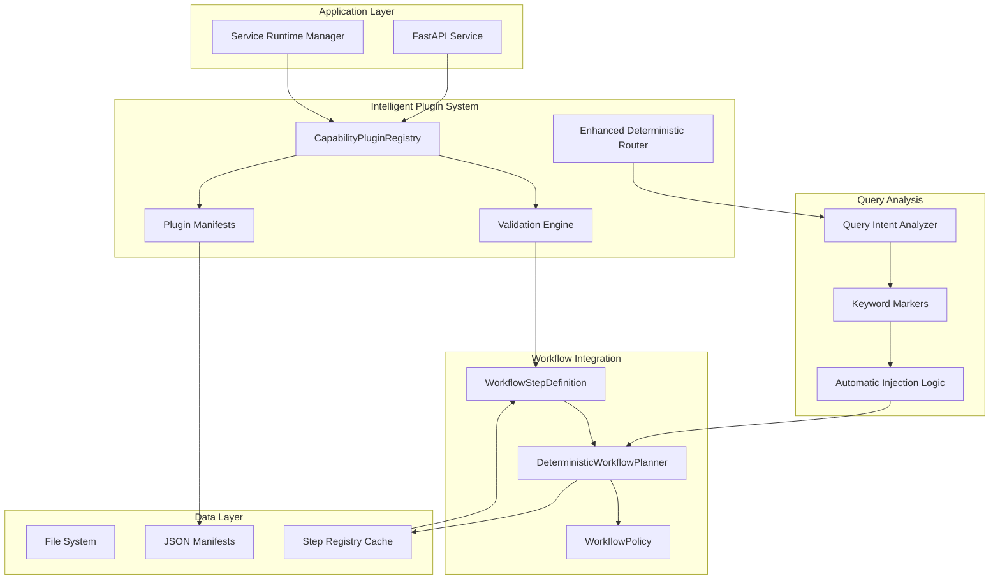

**Diagram sources**
- [capability_plugins.py:173-217](file://src/sage_faculty_twin/capability_plugins.py#L173-L217)
- [workflow_planner.py:90-134](file://src/sage_faculty_twin/workflow_planner.py#L90-L134)
- [workflow_steps.py:9-21](file://src/sage_faculty_twin/workflow_steps.py#L9-L21)
- [workflow_planner.py:516-569](file://src/sage_faculty_twin/workflow_planner.py#L516-L569)

The enhanced architecture now includes intelligent query analysis and automatic plugin step injection:

1. **Service Layer**: FastAPI endpoints and service runtime management
2. **Intelligent Plugin Registry**: Centralized plugin management with enhanced routing
3. **Query Analysis Engine**: Semantic analysis of user queries to determine appropriate plugins
4. **Workflow Integration**: Seamless integration with existing workflow planner and automatic step injection
5. **Data Persistence**: JSON manifest storage and caching mechanisms

## Core Components

### Enhanced CapabilityPluginManifest

The manifest serves as the contract between plugins and the core system, defining plugin metadata, workflow steps, and policy requirements with enhanced routing capabilities.

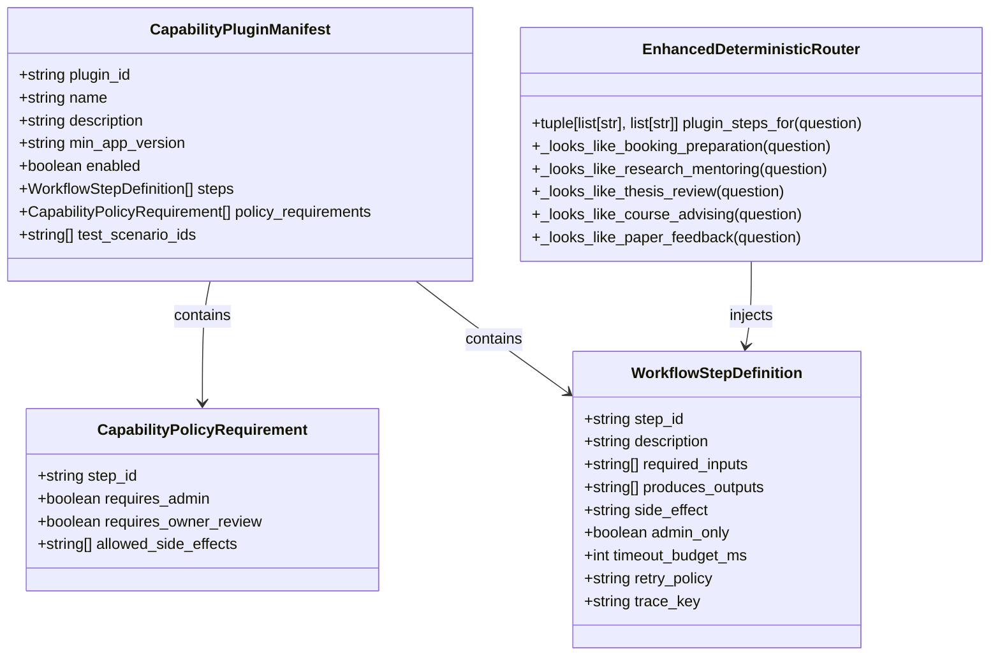

**Diagram sources**
- [capability_plugins.py:33-57](file://src/sage_faculty_twin/capability_plugins.py#L33-L57)
- [capability_plugins.py:22-31](file://src/sage_faculty_twin/capability_plugins.py#L22-L31)
- [workflow_steps.py:9-21](file://src/sage_faculty_twin/workflow_steps.py#L9-L21)
- [workflow_planner.py:516-569](file://src/sage_faculty_twin/workflow_planner.py#L516-L569)

**Section sources**
- [capability_plugins.py:33-57](file://src/sage_faculty_twin/capability_plugins.py#L33-L57)
- [capability_plugins.py:22-31](file://src/sage_faculty_twin/capability_plugins.py#L22-L31)
- [workflow_planner.py:516-569](file://src/sage_faculty_twin/workflow_planner.py#L516-L569)

### Enhanced CapabilityPluginRegistry

The registry manages plugin lifecycle, loading, validation, and intelligent merging with the core workflow system, now with automatic step injection capabilities.

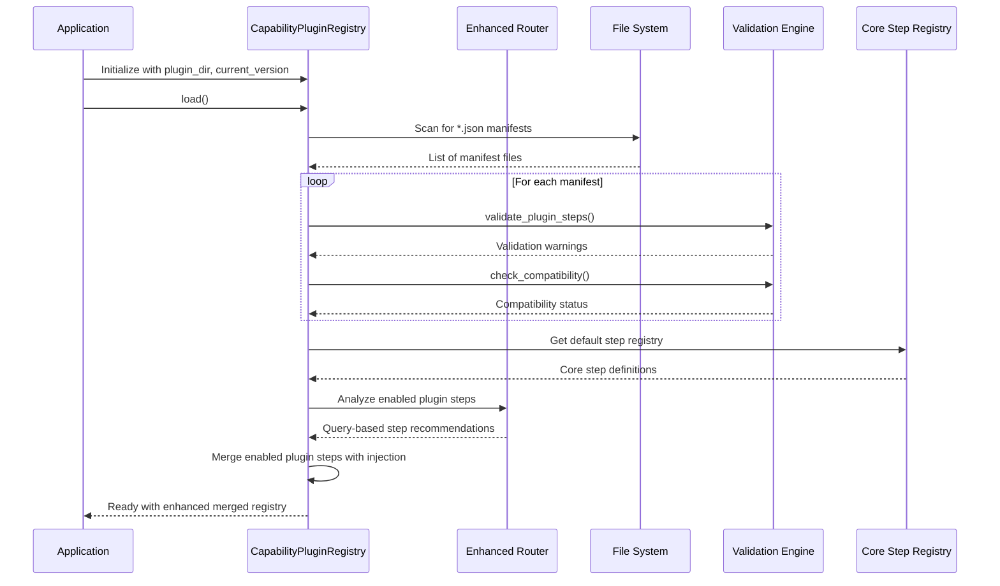

**Diagram sources**
- [capability_plugins.py:186-217](file://src/sage_faculty_twin/capability_plugins.py#L186-L217)
- [capability_plugins.py:173-185](file://src/sage_faculty_twin/capability_plugins.py#L173-L185)
- [workflow_planner.py:516-569](file://src/sage_faculty_twin/workflow_planner.py#L516-L569)

**Section sources**
- [capability_plugins.py:173-217](file://src/sage_faculty_twin/capability_plugins.py#L173-L217)

## Plugin Manifest Schema

Each plugin manifest follows an enhanced schema that defines its capabilities, routing triggers, and policy requirements:

### Required Fields

| Field | Type | Description | Example |
|-------|------|-------------|---------|
| `plugin_id` | string (1-64 chars) | Unique identifier for the plugin | `"meeting_prep"` |
| `name` | string (1-128 chars) | Human-readable plugin name | `"Meeting Prep Pack"` |
| `min_app_version` | string (≤32 chars) | Minimum supported application version | `"3.3.0"` |
| `steps` | array | Enhanced workflow step definitions with routing triggers | `[...]` |

### Optional Fields

| Field | Type | Default | Description |
|-------|------|---------|-------------|
| `description` | string (≤512 chars) | `""` | Plugin description with enhanced routing context |
| `enabled` | boolean | `false` | Whether plugin is active by default |
| `policy_requirements` | array | `[]` | Enhanced step-specific policy constraints |
| `test_scenario_ids` | array | `[]` | Required test scenarios for validation |

**Section sources**
- [capability_plugins.py:47-56](file://src/sage_faculty_twin/capability_plugins.py#L47-L56)

## Enhanced Deterministic Plugin Routing

The system now features intelligent plugin routing that automatically injects relevant plugin steps based on query analysis, significantly expanding the system's capabilities beyond static configuration.

### Automatic Step Injection Logic

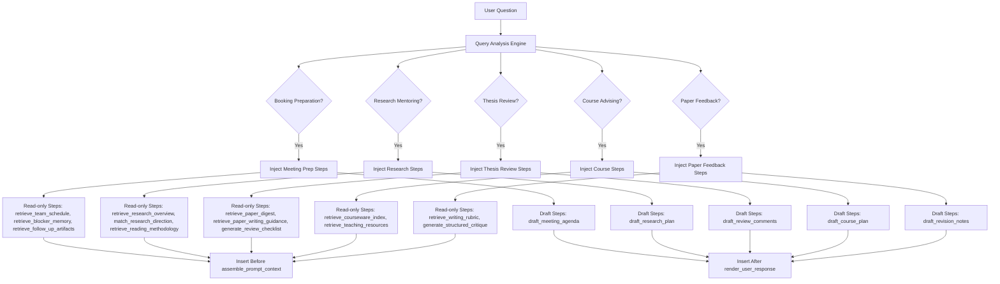

**Diagram sources**
- [workflow_planner.py:516-569](file://src/sage_faculty_twin/workflow_planner.py#L516-L569)
- [workflow_planner.py:399-432](file://src/sage_faculty_twin/workflow_planner.py#L399-L432)

### Query Analysis Triggers

The router uses sophisticated keyword-based analysis to determine appropriate plugin injection:

| Plugin Type | Trigger Keywords | Injection Points |
|-------------|------------------|------------------|
| Meeting Prep | "准备什么", "先准备", "预约前", "meeting prep" | Before assemble_prompt_context, After render_user_response |
| Research Mentoring | "研究方向", "选题", "研究计划", "文献阅读" | Before assemble_prompt_context, After render_user_response |
| Thesis Review | "审阅", "审稿", "评审", "thesis review" | Before assemble_prompt_context, After render_user_response |
| Course Advising | "选课", "修课", "课程推荐", "course selection" | Before assemble_prompt_context, After render_user_response |
| Paper Feedback | "批改", "打分", "写作建议", "paper feedback" | Before assemble_prompt_context, After render_user_response |

**Section sources**
- [workflow_planner.py:516-569](file://src/sage_faculty_twin/workflow_planner.py#L516-L569)
- [workflow_planner.py:780-846](file://src/sage_faculty_twin/workflow_planner.py#L780-L846)

## Capability Plugin Registry

The registry provides centralized management of capability plugins with comprehensive validation, intelligent merging, and automatic step injection capabilities.

### Enhanced Loading and Validation Process

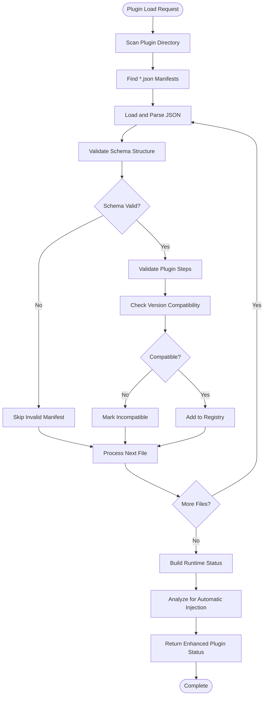

**Diagram sources**
- [capability_plugins.py:81-94](file://src/sage_faculty_twin/capability_plugins.py#L81-L94)
- [capability_plugins.py:117-149](file://src/sage_faculty_twin/capability_plugins.py#L117-L149)
- [capability_plugins.py:152-171](file://src/sage_faculty_twin/capability_plugins.py#L152-L171)

### Enhanced Status Reporting

The registry generates comprehensive status reports for each plugin with enhanced routing information:

| Property | Description | Example |
|----------|-------------|---------|
| `plugin_id` | Unique plugin identifier | `"meeting_prep"` |
| `enabled` | Whether plugin is active | `true/false` |
| `compatible` | Version compatibility status | `true/false` |
| `step_count` | Number of workflow steps | `4` |
| `step_ids` | List of registered step IDs | `["retrieve_team_schedule", "draft_meeting_agenda"]` |
| `policy_warnings` | Validation warnings | `[]` or warning messages |
| `routing_triggers` | Query patterns that activate plugin | `["meeting prep", "预约前"]` |

**Section sources**
- [capability_plugins.py:59-73](file://src/sage_faculty_twin/capability_plugins.py#L59-L73)
- [capability_plugins.py:152-171](file://src/sage_faculty_twin/capability_plugins.py#L152-L171)

## Integration with Workflow System

The enhanced capability plugin system integrates deeply with the existing workflow infrastructure through improved step registry mechanisms and automatic step injection.

### Intelligent Step Definition Integration

Plugins extend the core workflow system by adding new step definitions that follow the same interface as built-in steps, with automatic positioning based on step type:

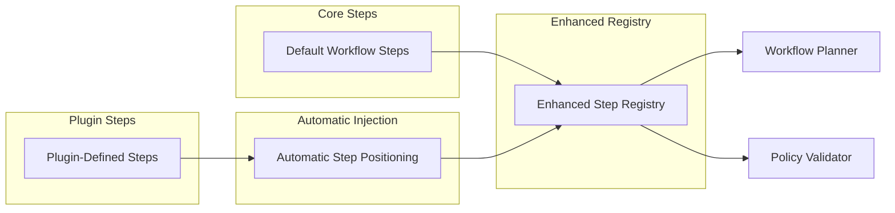

**Diagram sources**
- [capability_plugins.py:208-217](file://src/sage_faculty_twin/capability_plugins.py#L208-L217)
- [workflow_steps.py:179-184](file://src/sage_faculty_twin/workflow_steps.py#L179-L184)
- [workflow_planner.py:399-432](file://src/sage_faculty_twin/workflow_planner.py#L399-L432)

### Enhanced Policy Enforcement

Plugin steps inherit enhanced policy enforcement from the core workflow system, ensuring consistent security and compliance with automatic routing:

| Policy Aspect | Enhancement | Implementation | Example |
|---------------|-------------|----------------|---------|
| Side Effects | Automatic routing | `draft_write` → after render_user_response | `draft_meeting_agenda` |
| Admin Requirements | Session validation | `requires_admin: true` | Not applicable in current plugins |
| Input Validation | Required inputs check | `required_inputs: ["question"]` | Automatic validation |
| Timeout Budget | Latency enforcement | `timeout_budget_ms: 1200-3000` | Intelligent budget allocation |
| Automatic Positioning | Step placement | Read steps → before assemble_prompt_context | `retrieve_team_schedule` |

**Section sources**
- [workflow_policy.py:114-138](file://src/sage_faculty_twin/workflow_policy.py#L114-L138)

## Expanded Plugin Ecosystem

The system now supports five distinct capability plugin packs, each designed for specific academic workflows with enhanced routing capabilities.

### Meeting Prep Plugin

The Meeting Prep plugin provides comprehensive meeting preparation capabilities with automatic injection based on booking preparation queries.

**Plugin Features:**
- **Team Schedule Integration**: Retrieves team availability and meeting history
- **Blocker Memory**: Identifies unresolved issues from previous meetings
- **Follow-up Artifact Retrieval**: Gathers relevant documents and action items
- **Agenda Draft Generation**: Creates structured meeting agendas

**Enhanced Workflow Integration:**
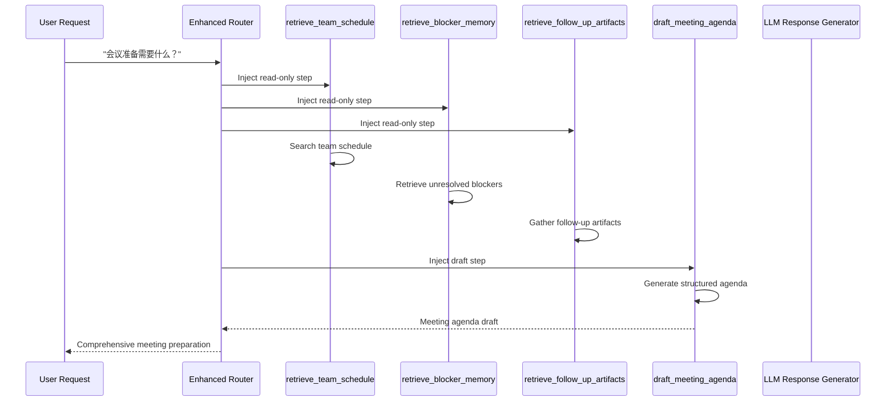

**Diagram sources**
- [meeting_prep.json:7-51](file://data/capability_plugins/meeting_prep.json#L7-L51)
- [workflow_planner.py:526-533](file://src/sage_faculty_twin/workflow_planner.py#L526-L533)

**Section sources**
- [meeting_prep.json:1-56](file://data/capability_plugins/meeting_prep.json#L1-L56)

### Research Mentoring Plugin

The Research Mentoring plugin provides advanced research guidance with automatic injection for research-related queries with mentoring intent.

**Plugin Features:**
- **Research Overview**: Retrieves lab research directions and current projects
- **Direction Matching**: Matches student interests with available research opportunities
- **Reading Methodology**: Provides paper-reading strategies and techniques
- **Research Plan Draft**: Creates structured research plans for review

**Enhanced Advanced Workflow:**
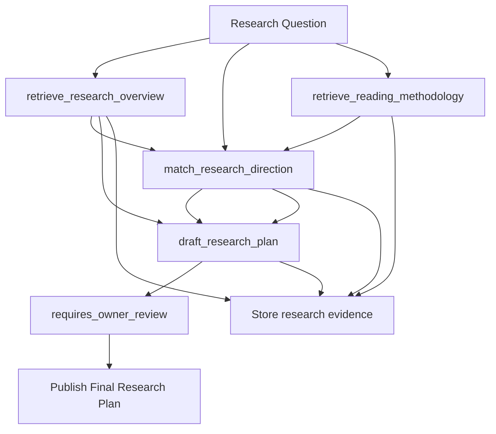

**Diagram sources**
- [research_mentoring.json:7-51](file://data/capability_plugins/research_mentoring.json#L7-L51)
- [workflow_planner.py:535-542](file://src/sage_faculty_twin/workflow_planner.py#L535-L542)

**Section sources**
- [research_mentoring.json:1-56](file://data/capability_plugins/research_mentoring.json#L1-L56)

### Thesis Review Plugin

The Thesis Review plugin provides comprehensive paper review capabilities with automatic injection for thesis-related queries.

**Plugin Features:**
- **Paper Digest Retrieval**: Quickly accesses paper summaries and key findings
- **Writing Guidance**: Provides writing-course materials for review quality
- **Checklist Generation**: Creates structured review checklists based on paper type
- **Comment Draft Generation**: Produces structured review comments

**Enhanced Advanced Workflow:**
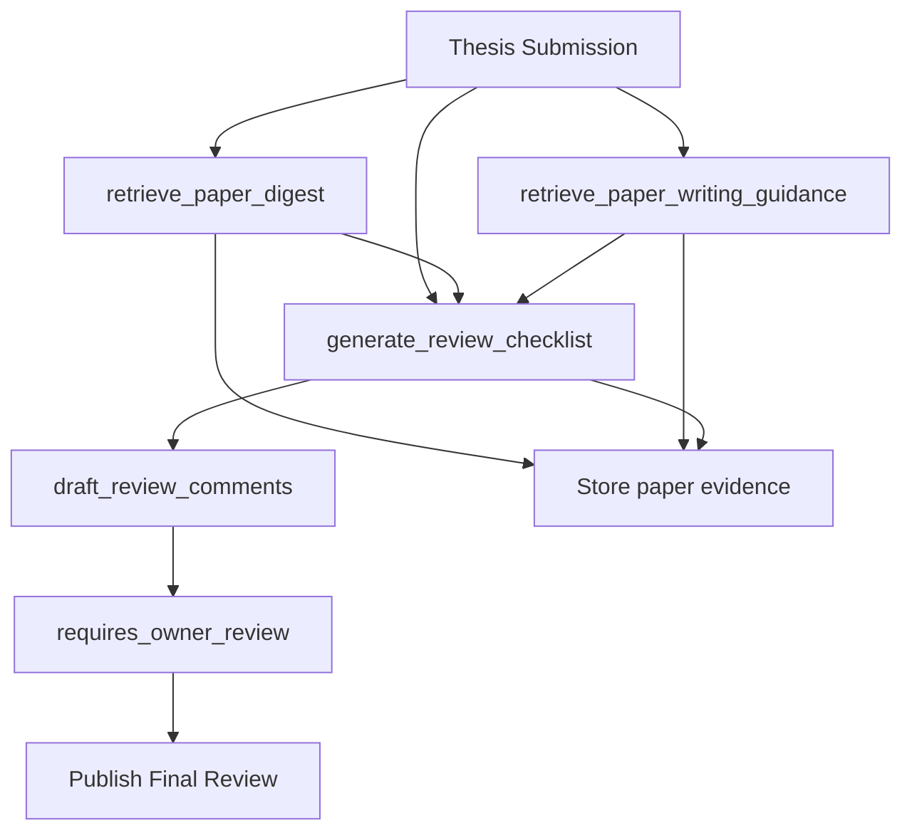

**Diagram sources**
- [thesis_review.json:7-51](file://data/capability_plugins/thesis_review.json#L7-L51)
- [workflow_planner.py:544-551](file://src/sage_faculty_twin/workflow_planner.py#L544-L551)

**Section sources**
- [thesis_review.json:1-56](file://data/capability_plugins/thesis_review.json#L1-L56)

### Expanded Course Advising Plugin

The Course Advising plugin has been enhanced with additional step types for comprehensive academic guidance.

**Enhanced Plugin Features:**
- **Courseware Index Retrieval**: Access to course materials and resources
- **Teaching Resource Integration**: Public course materials and guidelines
- **Personalized Course Plan**: Structured course recommendation system

**Enhanced Workflow Integration:**
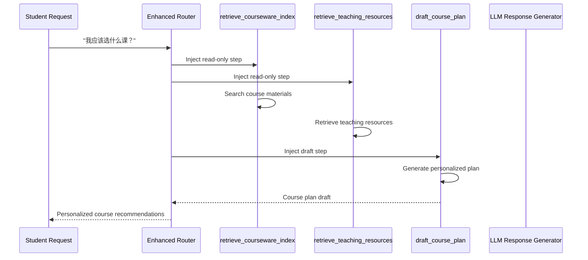

**Diagram sources**
- [course_advising.json:7-40](file://data/capability_plugins/course_advising.json#L7-L40)
- [workflow_planner.py:554-559](file://src/sage_faculty_twin/workflow_planner.py#L554-L559)

**Section sources**
- [course_advising.json:1-45](file://data/capability_plugins/course_advising.json#L1-L45)

### Enhanced Paper Feedback Plugin

The Paper Feedback plugin has been expanded with additional critique generation capabilities.

**Enhanced Plugin Features:**
- **Writing Rubric Retrieval**: Access to grading criteria and standards
- **Structured Critique Generation**: Multi-dimensional feedback systems
- **Revision Note Drafting**: Detailed revision guidance system

**Enhanced Advanced Workflow:**
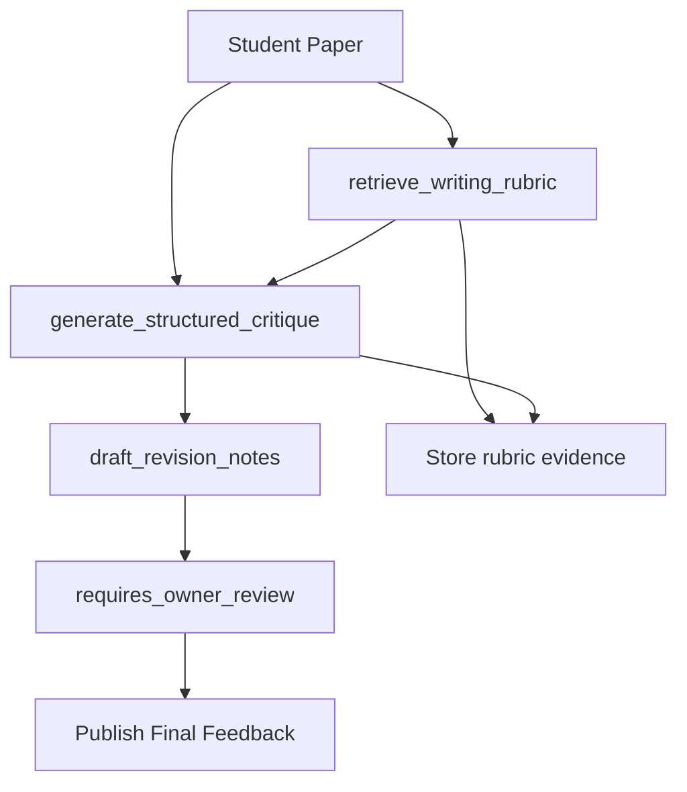

**Diagram sources**
- [paper_feedback.json:7-40](file://data/capability_plugins/paper_feedback.json#L7-L40)
- [workflow_planner.py:562-567](file://src/sage_faculty_twin/workflow_planner.py#L562-L567)

**Section sources**
- [paper_feedback.json:1-45](file://data/capability_plugins/paper_feedback.json#L1-L45)

## Testing and Validation

The system includes comprehensive testing infrastructure to ensure plugin reliability, compatibility, and intelligent routing capabilities.

### Enhanced Test Coverage Areas

| Test Category | Enhancement | Coverage | Purpose |
|---------------|-------------|----------|---------|
| Manifest Loading | Enhanced | Valid/Invalid JSON | Ensures robust parsing |
| Compatibility Checks | Enhanced | Version comparisons | Validates app version requirements |
| Step Validation | Enhanced | Duplicate detection, shadow warnings | Maintains registry integrity |
| Status Building | Enhanced | Runtime status reporting | Provides diagnostic information |
| Registry Integration | Enhanced | Merging and conflict resolution | Ensures seamless integration |
| **Enhanced** Query Analysis | **New** | Routing trigger detection | Validates intelligent plugin injection |
| **Enhanced** Step Injection | **New** | Automatic step positioning | Ensures proper workflow flow |

### Enhanced Validation Scenarios

The testing framework covers critical validation scenarios including intelligent routing:

1. **Schema Validation**: Ensures all required fields are present
2. **Version Compatibility**: Tests minimum app version requirements
3. **Step Integrity**: Detects duplicate step IDs and shadowing conflicts
4. **Policy Compliance**: Validates step-to-policy requirement mapping
5. **Registry Merging**: Tests plugin activation and deactivation
6. ****Enhanced** Query Analysis**: Validates routing trigger detection
7. **Enhanced** Step Injection**: Tests automatic step positioning logic

**Section sources**
- [test_capability_plugins.py:66-105](file://tests/test_capability_plugins.py#L66-L105)
- [test_capability_plugins.py:143-172](file://tests/test_capability_plugins.py#L143-L172)
- [test_capability_plugins.py:205-249](file://tests/test_capability_plugins.py#L205-L249)
- [test_capability_plugins.py:345-343](file://tests/test_capability_plugins.py#L345-L343)

## Deployment and Management

### Enhanced Service Integration

The capability plugin system integrates with the application's service architecture through the main service module with enhanced routing capabilities.

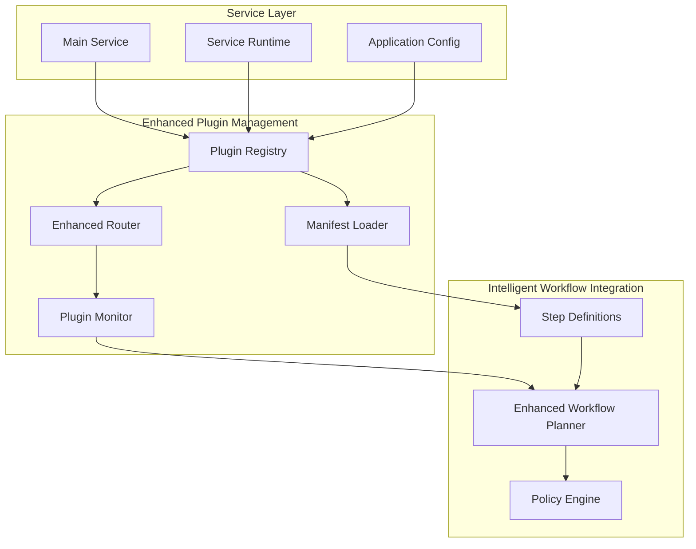

**Diagram sources**
- [service.py:138-138](file://src/sage_faculty_twin/service.py#L138-L138)
- [capability_plugins.py:186-217](file://src/sage_faculty_twin/capability_plugins.py#L186-L217)
- [workflow_planner.py:516-569](file://src/sage_faculty_twin/workflow_planner.py#L516-L569)

### Enhanced Runtime Management

The system supports dynamic plugin management through the service runtime with intelligent routing:

| Operation | Enhancement | Description | Impact |
|-----------|-------------|-------------|--------|
| Plugin Enable | Enhanced | Activates plugin in current session with routing | Adds steps to registry with automatic injection |
| Plugin Disable | Enhanced | Deactivates plugin with routing cleanup | Removes steps from registry and routing |
| Version Check | Enhanced | Validates compatibility with routing triggers | Prevents incompatible plugins with routing |
| Status Report | Enhanced | Provides diagnostic information with routing metrics | Monitoring and troubleshooting with routing insights |
| **Enhanced** Query Analysis | **New** | Dynamically routes queries to appropriate plugins | Intelligent workflow automation |

**Section sources**
- [service_runtime.py:13-69](file://src/sage_faculty_twin/service_runtime.py#L13-L69)
- [capability_plugins.py:195-207](file://src/sage_faculty_twin/capability_plugins.py#L195-L207)

## Best Practices

### Enhanced Plugin Development Guidelines

1. **Manifest Design**
   - Use descriptive `name` and `description` fields with routing context
   - Set appropriate `min_app_version` requirements (preferably "3.3.0" or higher)
   - Define clear `test_scenario_ids` for quality assurance
   - Include comprehensive routing trigger keywords for intelligent injection

2. **Step Definition Standards**
   - Follow established naming conventions with domain-specific prefixes
   - Specify precise `required_inputs` and `produces_outputs` for routing
   - Set realistic `timeout_budget_ms` values (1200-3000ms for most steps)
   - Use appropriate `trace_key` values for debugging and monitoring
   - Design steps for either read-only (`side_effect: "none"`) or draft-write (`side_effect: "draft_write"`)

3. **Enhanced Policy Compliance**
   - Define `allowed_side_effects` accurately for routing safety
   - Set `requires_admin` or `requires_owner_review` appropriately
   - Ensure step IDs match declared policy requirements
   - Consider automatic step positioning implications

4. **Intelligent Routing Requirements**
   - Include comprehensive trigger keywords for query analysis
   - Design steps that complement each other in workflow sequences
   - Ensure proper input/output chaining between read-only and draft steps
   - Test step injection timing and positioning

5. **Testing Requirements**
   - Include comprehensive test scenarios for routing triggers
   - Validate compatibility across supported versions
   - Test plugin activation/deactivation cycles with routing
   - Verify integration with core workflow steps and automatic injection
   - Test intelligent step positioning and workflow flow

### Enhanced Security Considerations

- **Side Effect Management**: Carefully specify allowed side effects for routing safety
- **Admin Privileges**: Restrict sensitive operations to authorized sessions
- **Input Validation**: Validate all required inputs before execution
- **Timeout Enforcement**: Prevent resource exhaustion through budget limits
- ****Enhanced** Query Safety**: Validate routing triggers to prevent unintended plugin activation

### Enhanced Performance Optimization

- **Step Efficiency**: Design steps with appropriate timeout budgets for routing
- **Resource Management**: Minimize external dependencies and network calls
- **Caching Strategies**: Leverage existing caching mechanisms where appropriate
- **Error Handling**: Implement robust error handling and recovery
- ****Enhanced** Routing Optimization**: Design efficient query analysis and step injection logic

The Enhanced Capability Plugin System provides a robust foundation for extending the SAGE Faculty Twin application with intelligent, domain-specific capabilities while maintaining system integrity, security, performance standards, and automatic workflow optimization through enhanced deterministic plugin routing.