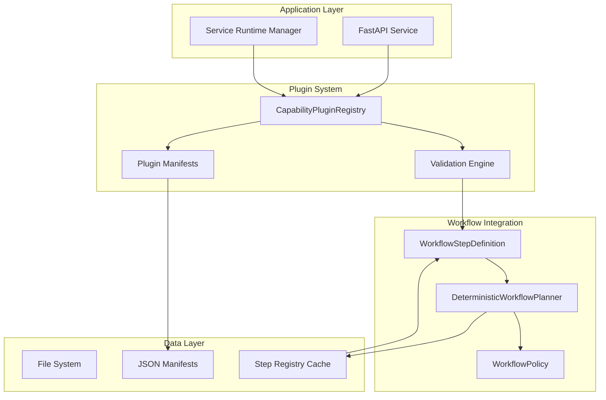
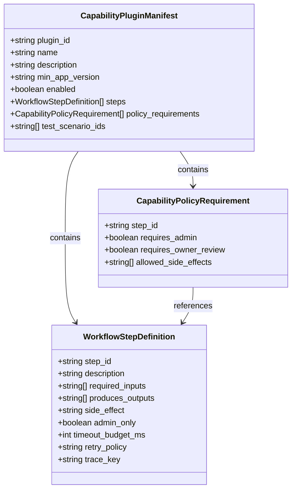
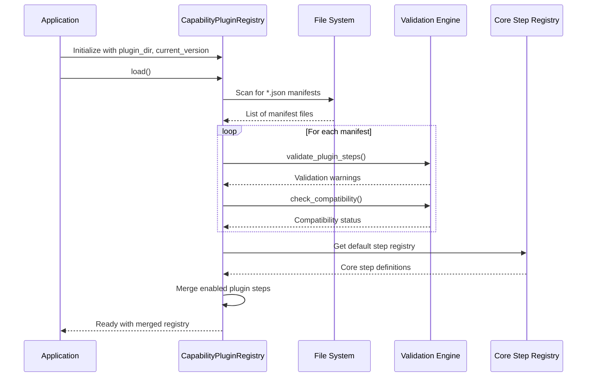
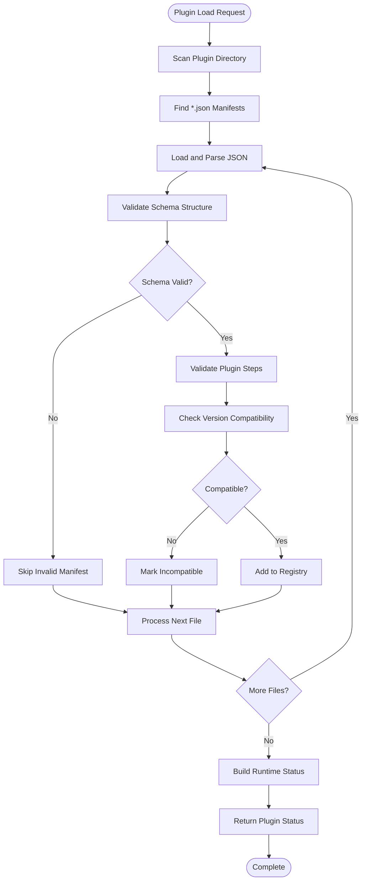
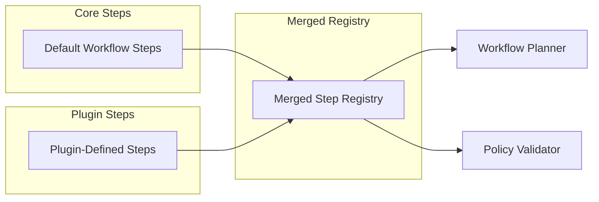
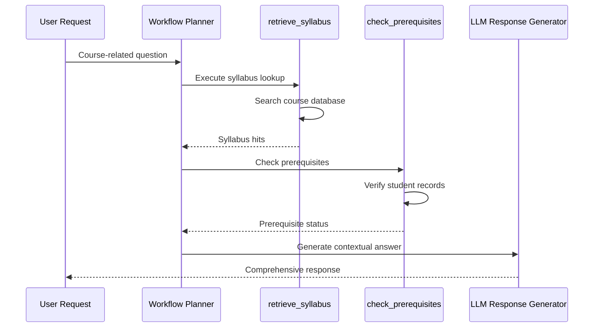
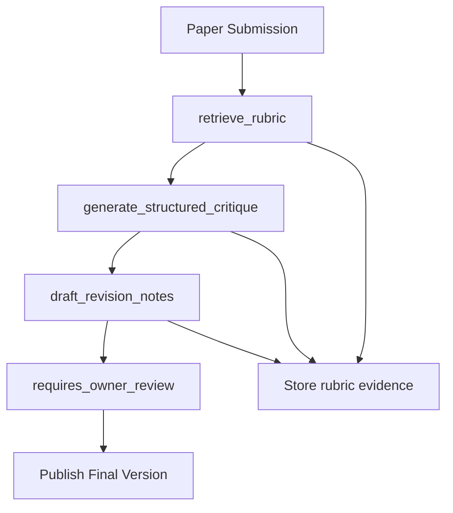
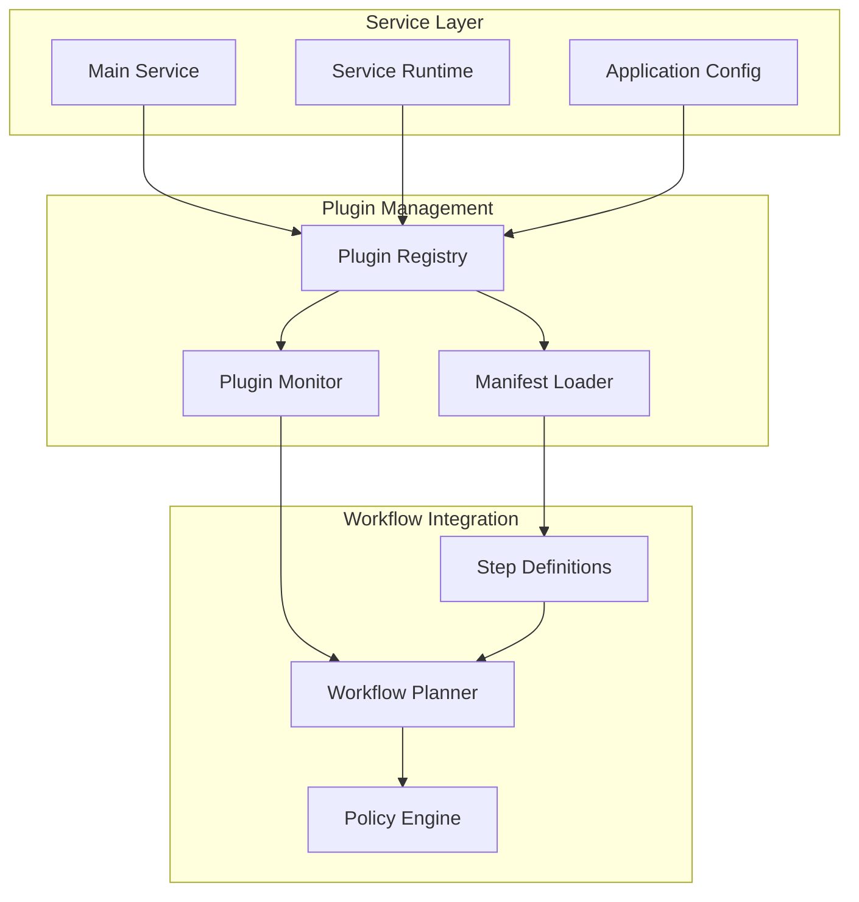

# Capability Plugin System

<cite>
**Referenced Files in This Document**
- [capability_plugins.py](file://src/sage_faculty_twin/capability_plugins.py)
- [workflow_steps.py](file://src/sage_faculty_twin/workflow_steps.py)
- [workflow_planner.py](file://src/sage_faculty_twin/workflow_planner.py)
- [workflow_policy.py](file://src/sage_faculty_twin/workflow_policy.py)
- [course_advising.json](file://data/capability_plugins/course_advising.json)
- [paper_feedback.json](file://data/capability_plugins/paper_feedback.json)
- [test_capability_plugins.py](file://tests/test_capability_plugins.py)
- [service.py](file://src/sage_faculty_twin/service.py)
- [service_runtime.py](file://src/sage_faculty_twin/service_runtime.py)
- [__init__.py](file://src/sage_faculty_twin/__init__.py)
</cite>

## Table of Contents
1. [Introduction](#introduction)
2. [System Architecture](#system-architecture)
3. [Core Components](#core-components)
4. [Plugin Manifest Schema](#plugin-manifest-schema)
5. [Capability Plugin Registry](#capability-plugin-registry)
6. [Integration with Workflow System](#integration-with-workflow-system)
7. [Real-World Plugin Examples](#real-world-plugin-examples)
8. [Testing and Validation](#testing-and-validation)
9. [Deployment and Management](#deployment-and-management)
10. [Best Practices](#best-practices)

## Introduction

The Capability Plugin System is a modular extension mechanism introduced in version 3.3 of the SAGE Faculty Twin application. This system enables administrators to add specialized workflow capabilities through external JSON manifests without modifying the core application code. The system supports capability packs like Course Advising and Paper Feedback, each providing domain-specific workflow steps that integrate seamlessly with the existing workflow planner infrastructure.

The plugin system operates on a manifest-driven architecture where each plugin declares its workflow steps, policy requirements, and compatibility constraints. The system validates plugin manifests, checks version compatibility, and merges valid plugins into the core step registry during application startup.

## System Architecture

The Capability Plugin System follows a layered architecture that integrates with the existing workflow infrastructure:

**Diagram sources**
- [capability_plugins.py:173-217](file://src/sage_faculty_twin/capability_plugins.py#L173-L217)
- [workflow_planner.py:90-134](file://src/sage_faculty_twin/workflow_planner.py#L90-L134)
- [workflow_steps.py:9-21](file://src/sage_faculty_twin/workflow_steps.py#L9-L21)

The architecture consists of several key layers:

1. **Service Layer**: FastAPI endpoints and service runtime management
2. **Plugin Registry**: Centralized plugin management and validation
3. **Workflow Integration**: Seamless integration with existing workflow planner
4. **Data Persistence**: JSON manifest storage and caching mechanisms

## Core Components

### CapabilityPluginManifest

The manifest serves as the contract between plugins and the core system, defining plugin metadata, workflow steps, and policy requirements.

**Diagram sources**
- [capability_plugins.py:33-57](file://src/sage_faculty_twin/capability_plugins.py#L33-L57)
- [capability_plugins.py:22-31](file://src/sage_faculty_twin/capability_plugins.py#L22-L31)
- [workflow_steps.py:9-21](file://src/sage_faculty_twin/workflow_steps.py#L9-L21)

**Section sources**
- [capability_plugins.py:33-57](file://src/sage_faculty_twin/capability_plugins.py#L33-L57)
- [capability_plugins.py:22-31](file://src/sage_faculty_twin/capability_plugins.py#L22-L31)

### CapabilityPluginRegistry

The registry manages plugin lifecycle, loading, validation, and merging with the core workflow system.

**Diagram sources**
- [capability_plugins.py:186-217](file://src/sage_faculty_twin/capability_plugins.py#L186-L217)
- [capability_plugins.py:173-185](file://src/sage_faculty_twin/capability_plugins.py#L173-L185)

**Section sources**
- [capability_plugins.py:173-217](file://src/sage_faculty_twin/capability_plugins.py#L173-L217)

## Plugin Manifest Schema

Each plugin manifest follows a strict schema that defines its capabilities and constraints:

### Required Fields

| Field | Type | Description | Example |
|-------|------|-------------|---------|
| `plugin_id` | string (1-64 chars) | Unique identifier for the plugin | `"course_advising"` |
| `name` | string (1-128 chars) | Human-readable plugin name | `"Course Advising Pack"` |
| `min_app_version` | string (≤32 chars) | Minimum supported application version | `"3.0.0"` |
| `steps` | array | Workflow step definitions | `[...]` |

### Optional Fields

| Field | Type | Default | Description |
|-------|------|---------|-------------|
| `description` | string (≤512 chars) | `""` | Plugin description |
| `enabled` | boolean | `false` | Whether plugin is active by default |
| `policy_requirements` | array | `[]` | Step-specific policy constraints |
| `test_scenario_ids` | array | `[]` | Required test scenarios |

**Section sources**
- [capability_plugins.py:47-56](file://src/sage_faculty_twin/capability_plugins.py#L47-L56)

## Capability Plugin Registry

The registry provides centralized management of capability plugins with comprehensive validation and integration capabilities.

### Loading and Validation Process

**Diagram sources**
- [capability_plugins.py:81-94](file://src/sage_faculty_twin/capability_plugins.py#L81-L94)
- [capability_plugins.py:117-149](file://src/sage_faculty_twin/capability_plugins.py#L117-L149)
- [capability_plugins.py:152-171](file://src/sage_faculty_twin/capability_plugins.py#L152-L171)

### Status Reporting

The registry generates comprehensive status reports for each plugin:

| Property | Description | Example |
|----------|-------------|---------|
| `plugin_id` | Unique plugin identifier | `"course_advising"` |
| `enabled` | Whether plugin is active | `true/false` |
| `compatible` | Version compatibility status | `true/false` |
| `step_count` | Number of workflow steps | `2` |
| `step_ids` | List of registered step IDs | `["retrieve_syllabus", "check_prerequisites"]` |
| `policy_warnings` | Validation warnings | `[]` or warning messages |

**Section sources**
- [capability_plugins.py:59-73](file://src/sage_faculty_twin/capability_plugins.py#L59-L73)
- [capability_plugins.py:152-171](file://src/sage_faculty_twin/capability_plugins.py#L152-L171)

## Integration with Workflow System

The capability plugin system integrates deeply with the existing workflow infrastructure through the step registry mechanism.

### Step Definition Integration

Plugins extend the core workflow system by adding new step definitions that follow the same interface as built-in steps:

**Diagram sources**
- [capability_plugins.py:208-217](file://src/sage_faculty_twin/capability_plugins.py#L208-L217)
- [workflow_steps.py:179-184](file://src/sage_faculty_twin/workflow_steps.py#L179-L184)

### Policy Enforcement

Plugin steps inherit policy enforcement from the core workflow system, ensuring consistent security and compliance:

| Policy Aspect | Implementation | Example |
|---------------|----------------|---------|
| Side Effects | Automatic enforcement | `draft_write`, `owner_review` |
| Admin Requirements | Session validation | `requires_admin: true` |
| Input Validation | Required inputs check | `required_inputs: ["course_context"]` |
| Timeout Budget | Latency enforcement | `timeout_budget_ms: 1500` |

**Section sources**
- [workflow_policy.py:114-138](file://src/sage_faculty_twin/workflow_policy.py#L114-L138)

## Real-World Plugin Examples

### Course Advising Plugin

The Course Advising plugin demonstrates domain-specific workflow capabilities for academic advising scenarios.

**Plugin Features:**
- **Syllabus Lookup**: Retrieves course syllabus information
- **Prerequisite Checking**: Verifies student completion of prerequisites
- **Course Context Awareness**: Integrates with active course context

**Workflow Integration:**

**Diagram sources**
- [course_advising.json:7-24](file://data/capability_plugins/course_advising.json#L7-L24)

**Section sources**
- [course_advising.json:1-39](file://data/capability_plugins/course_advising.json#L1-L39)

### Paper Feedback Plugin

The Paper Feedback plugin provides advanced academic paper evaluation capabilities.

**Plugin Features:**
- **Rubric Retrieval**: Fetches appropriate grading rubrics
- **Structured Critique**: Generates comprehensive feedback
- **Revision Tracking**: Creates draft revision notes

**Advanced Workflow:**

**Diagram sources**
- [paper_feedback.json:7-33](file://data/capability_plugins/paper_feedback.json#L7-L33)

**Section sources**
- [paper_feedback.json:1-54](file://data/capability_plugins/paper_feedback.json#L1-L54)

## Testing and Validation

The system includes comprehensive testing infrastructure to ensure plugin reliability and compatibility.

### Test Coverage Areas

| Test Category | Coverage | Purpose |
|---------------|----------|---------|
| Manifest Loading | Valid/Invalid JSON | Ensures robust parsing |
| Compatibility Checks | Version comparisons | Validates app version requirements |
| Step Validation | Duplicate detection, shadow warnings | Maintains registry integrity |
| Status Building | Runtime status reporting | Provides diagnostic information |
| Registry Integration | Merging and conflict resolution | Ensures seamless integration |

### Validation Scenarios

The testing framework covers critical validation scenarios:

1. **Schema Validation**: Ensures all required fields are present
2. **Version Compatibility**: Tests minimum app version requirements
3. **Step Integrity**: Detects duplicate step IDs and shadowing conflicts
4. **Policy Compliance**: Validates step-to-policy requirement mapping
5. **Registry Merging**: Tests plugin activation and deactivation

**Section sources**
- [test_capability_plugins.py:66-105](file://tests/test_capability_plugins.py#L66-L105)
- [test_capability_plugins.py:143-172](file://tests/test_capability_plugins.py#L143-L172)
- [test_capability_plugins.py:205-249](file://tests/test_capability_plugins.py#L205-L249)

## Deployment and Management

### Service Integration

The capability plugin system integrates with the application's service architecture through the main service module.

**Diagram sources**
- [service.py:138-138](file://src/sage_faculty_twin/service.py#L138-L138)
- [capability_plugins.py:186-217](file://src/sage_faculty_twin/capability_plugins.py#L186-L217)

### Runtime Management

The system supports dynamic plugin management through the service runtime:

| Operation | Description | Impact |
|-----------|-------------|--------|
| Plugin Enable | Activates plugin in current session | Adds steps to registry |
| Plugin Disable | Deactivates plugin | Removes steps from registry |
| Version Check | Validates compatibility | Prevents incompatible plugins |
| Status Report | Provides diagnostic information | Monitoring and troubleshooting |

**Section sources**
- [service_runtime.py:13-69](file://src/sage_faculty_twin/service_runtime.py#L13-L69)
- [capability_plugins.py:195-207](file://src/sage_faculty_twin/capability_plugins.py#L195-L207)

## Best Practices

### Plugin Development Guidelines

1. **Manifest Design**
   - Use descriptive `name` and `description` fields
   - Set appropriate `min_app_version` requirements
   - Define clear `test_scenario_ids` for quality assurance

2. **Step Definition Standards**
   - Follow established naming conventions
   - Specify precise `required_inputs` and `produces_outputs`
   - Set realistic `timeout_budget_ms` values
   - Use appropriate `trace_key` values for debugging

3. **Policy Compliance**
   - Define `allowed_side_effects` accurately
   - Set `requires_admin` or `requires_owner_review` appropriately
   - Ensure step IDs match declared policy requirements

4. **Testing Requirements**
   - Include comprehensive test scenarios
   - Validate compatibility across supported versions
   - Test plugin activation/deactivation cycles
   - Verify integration with core workflow steps

### Security Considerations

- **Side Effect Management**: Carefully specify allowed side effects
- **Admin Privileges**: Restrict sensitive operations to authorized sessions
- **Input Validation**: Validate all required inputs before execution
- **Timeout Enforcement**: Prevent resource exhaustion through budget limits

### Performance Optimization

- **Step Efficiency**: Design steps with appropriate timeout budgets
- **Resource Management**: Minimize external dependencies and network calls
- **Caching Strategies**: Leverage existing caching mechanisms where appropriate
- **Error Handling**: Implement robust error handling and recovery

The Capability Plugin System provides a robust foundation for extending the SAGE Faculty Twin application with domain-specific capabilities while maintaining system integrity, security, and performance standards.