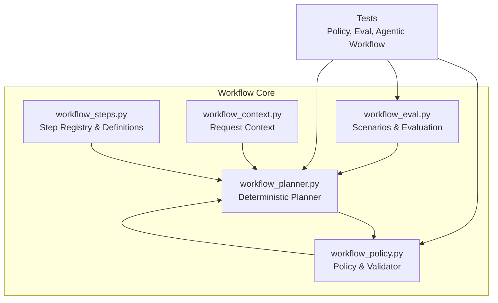
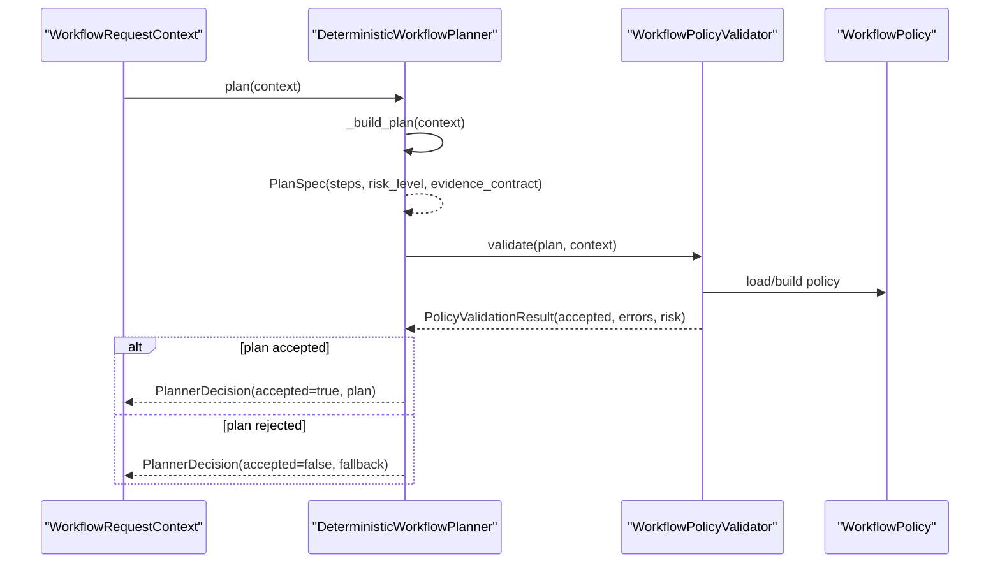
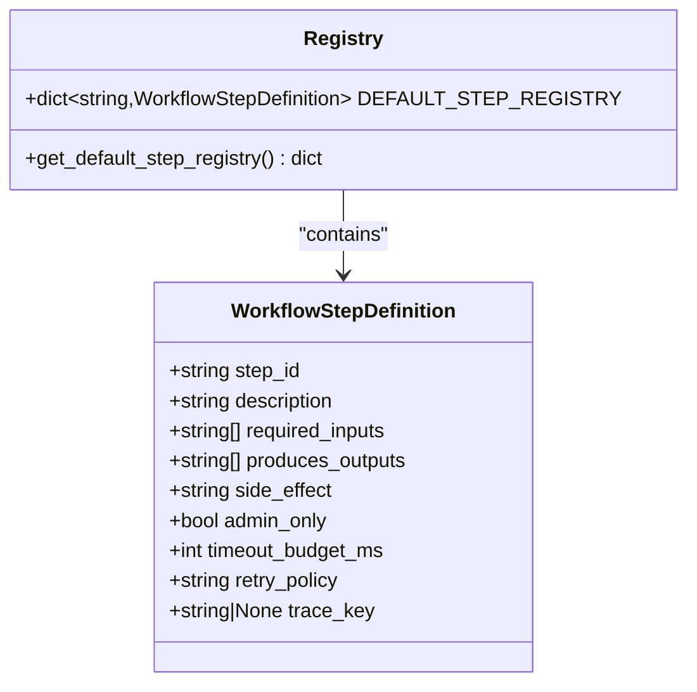
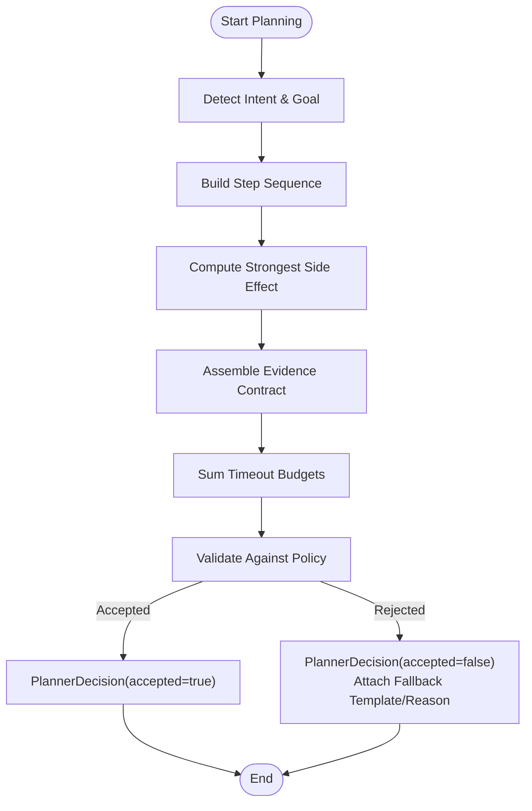
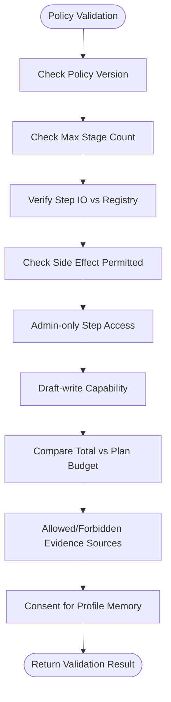
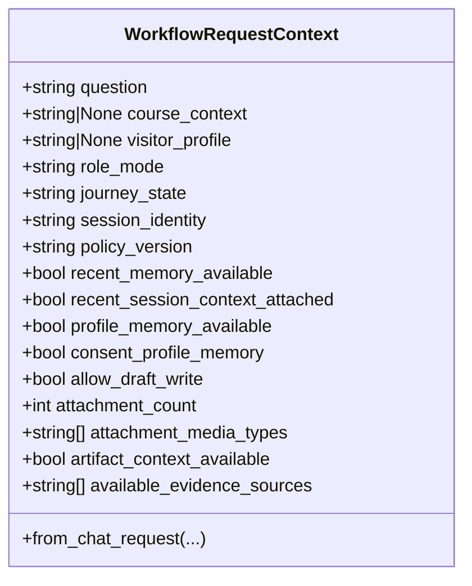
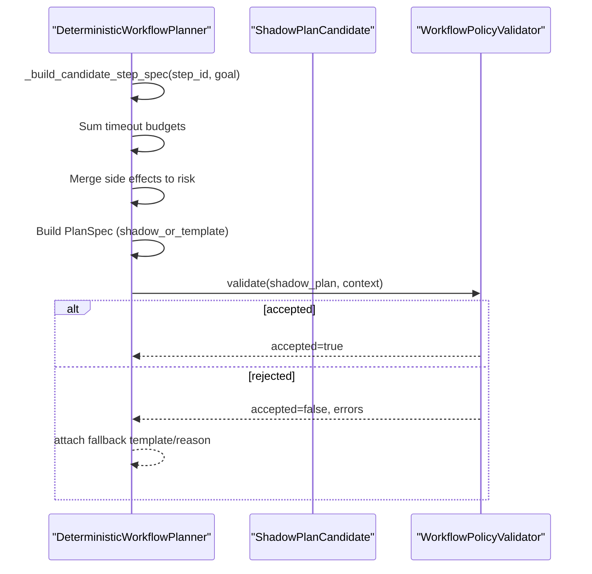
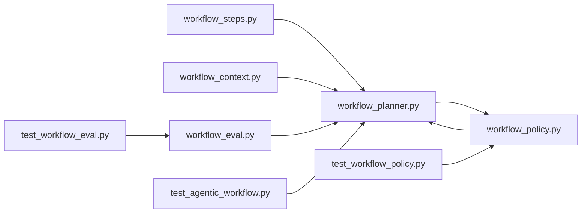

# Custom Workflow Extensions

<cite>
**Referenced Files in This Document**
- [workflow_steps.py](file://src/sage_faculty_twin/workflow_steps.py)
- [workflow_policy.py](file://src/sage_faculty_twin/workflow_policy.py)
- [workflow_planner.py](file://src/sage_faculty_twin/workflow_planner.py)
- [workflow_context.py](file://src/sage_faculty_twin/workflow_context.py)
- [workflow_eval.py](file://src/sage_faculty_twin/workflow_eval.py)
- [test_workflow_policy.py](file://tests/test_workflow_policy.py)
- [test_workflow_eval.py](file://tests/test_workflow_eval.py)
- [test_agentic_workflow.py](file://tests/test_agentic_workflow.py)
</cite>

## Table of Contents
1. [Introduction](#introduction)
2. [Project Structure](#project-structure)
3. [Core Components](#core-components)
4. [Architecture Overview](#architecture-overview)
5. [Detailed Component Analysis](#detailed-component-analysis)
6. [Dependency Analysis](#dependency-analysis)
7. [Performance Considerations](#performance-considerations)
8. [Troubleshooting Guide](#troubleshooting-guide)
9. [Conclusion](#conclusion)
10. [Appendices](#appendices)

## Introduction
This document explains how to extend the workflow system with custom steps and policies. It covers the workflow step registry pattern, step definition interfaces, execution context management, policy evaluation mechanisms, shadow planning integration, and fallback strategy implementation. It also provides practical guidance for building custom workflow steps, implementing conditional branching logic, adding custom decision-making processes, managing step dependencies, propagating errors, and monitoring performance for custom extensions.

## Project Structure
The workflow system is organized around four core modules:
- Step definitions and registry: define reusable workflow steps and their metadata
- Planner: builds deterministic plans and evaluates shadow candidates
- Policy: validates plans against organizational constraints and risk controls
- Context: encapsulates request state and environment signals

**Diagram sources**
- [workflow_steps.py:1-184](file://src/sage_faculty_twin/workflow_steps.py#L1-L184)
- [workflow_planner.py:1-659](file://src/sage_faculty_twin/workflow_planner.py#L1-L659)
- [workflow_policy.py:1-215](file://src/sage_faculty_twin/workflow_policy.py#L1-L215)
- [workflow_context.py:1-262](file://src/sage_faculty_twin/workflow_context.py#L1-L262)
- [workflow_eval.py:1-95](file://src/sage_faculty_twin/workflow_eval.py#L1-L95)

**Section sources**
- [workflow_steps.py:1-184](file://src/sage_faculty_twin/workflow_steps.py#L1-L184)
- [workflow_planner.py:1-659](file://src/sage_faculty_twin/workflow_planner.py#L1-L659)
- [workflow_policy.py:1-215](file://src/sage_faculty_twin/workflow_policy.py#L1-L215)
- [workflow_context.py:1-262](file://src/sage_faculty_twin/workflow_context.py#L1-L262)
- [workflow_eval.py:1-95](file://src/sage_faculty_twin/workflow_eval.py#L1-L95)

## Core Components
- Step Definition and Registry
  - Centralized registry of steps with required inputs, produced outputs, side effects, timeouts, and trace keys
  - Provides a copy of the default registry for safe extension
- Planner
  - Builds deterministic plans from request context
  - Evaluates shadow plan candidates and computes risk levels
  - Enforces evidence contracts and fallback templates
- Policy and Validator
  - Validates plans against configured constraints (stage counts, latency budgets, evidence sources, admin-only steps)
  - Computes the strongest side effect and maps it to a risk level
- Request Context
  - Encapsulates question, role mode, journey state, session identity, and environment signals
  - Infers evidence sources and attachment/media characteristics
- Evaluation and Scenarios
  - Loads replay scenarios and evaluates planner decisions against expected outcomes

**Section sources**
- [workflow_steps.py:9-184](file://src/sage_faculty_twin/workflow_steps.py#L9-L184)
- [workflow_planner.py:90-425](file://src/sage_faculty_twin/workflow_planner.py#L90-L425)
- [workflow_policy.py:15-215](file://src/sage_faculty_twin/workflow_policy.py#L15-L215)
- [workflow_context.py:12-112](file://src/sage_faculty_twin/workflow_context.py#L12-L112)
- [workflow_eval.py:13-95](file://src/sage_faculty_twin/workflow_eval.py#L13-L95)

## Architecture Overview
The workflow system orchestrates planning, policy validation, and execution preview. The planner constructs a linear sequence of steps from context, then the validator checks compliance with policy constraints. Shadow planning can propose alternative sequences for comparison.

**Diagram sources**
- [workflow_planner.py:110-133](file://src/sage_faculty_twin/workflow_planner.py#L110-L133)
- [workflow_policy.py:74-199](file://src/sage_faculty_twin/workflow_policy.py#L74-L199)

## Detailed Component Analysis

### Step Definition and Registry Pattern
- Purpose
  - Define reusable workflow steps with strict schemas for inputs, outputs, side effects, and timeouts
  - Provide a default registry and a safe copy mechanism for extension
- Key Elements
  - Step ID uniqueness and constraints
  - Required inputs and produced outputs define dependency edges
  - Side effect controls write permissions and risk mapping
  - Timeout budgets enable latency planning
  - Trace keys support observability and diagnostics
- Extension Strategy
  - Add new step definitions to the default registry list
  - Extend the registry dictionary with copies of default entries plus new ones
  - Keep step IDs unique and align inputs/outputs with existing steps

**Diagram sources**
- [workflow_steps.py:9-21](file://src/sage_faculty_twin/workflow_steps.py#L9-L21)
- [workflow_steps.py:23-176](file://src/sage_faculty_twin/workflow_steps.py#L23-L176)

**Section sources**
- [workflow_steps.py:9-184](file://src/sage_faculty_twin/workflow_steps.py#L9-L184)

### Planner Decision Logic and Shadow Planning
- Deterministic Planning
  - Builds a linear sequence of steps based on intent detection and context signals
  - Assembles evidence contracts and computes risk levels from step side effects
  - Produces a plan with fallback template and explain-to-operator guidance
- Shadow Planning
  - Evaluates candidate step sequences independently
  - Merges side effects to compute risk and constructs a shadow plan
  - Returns a decision indicating acceptance or fallback reasons
- Fallback Strategy
  - When policy validation fails, a fallback template and concise reason are attached
  - Comparison results surface differences between deterministic and shadow plans

**Diagram sources**
- [workflow_planner.py:179-425](file://src/sage_faculty_twin/workflow_planner.py#L179-L425)
- [workflow_planner.py:135-177](file://src/sage_faculty_twin/workflow_planner.py#L135-L177)

**Section sources**
- [workflow_planner.py:90-425](file://src/sage_faculty_twin/workflow_planner.py#L90-L425)

### Policy Evaluation Mechanisms
- Validation Scope
  - Checks policy version alignment, stage count limits, and latency budgets
  - Ensures step inputs/outputs match registry definitions and side effects are permitted
  - Verifies admin-only step access and draft-write capability
  - Confirms evidence sources are allowed, not forbidden, and consented where required
- Risk Mapping
  - Converts the strongest side effect into a risk level for plan categorization
- Error Propagation
  - Aggregates validation errors and returns them with the decision

**Diagram sources**
- [workflow_policy.py:74-199](file://src/sage_faculty_twin/workflow_policy.py#L74-L199)

**Section sources**
- [workflow_policy.py:64-215](file://src/sage_faculty_twin/workflow_policy.py#L64-L215)

### Execution Context Management
- Context Construction
  - Derives role mode and journey state from question and visitor profile
  - Infers available evidence sources based on context flags and attachments
  - Determines session identity and draft-write allowance
- Context Influence on Planning
  - Influences inclusion of recent/memory/artifact steps
  - Shapes evidence contracts and risk levels

**Diagram sources**
- [workflow_context.py:12-112](file://src/sage_faculty_twin/workflow_context.py#L12-L112)

**Section sources**
- [workflow_context.py:12-262](file://src/sage_faculty_twin/workflow_context.py#L12-L262)

### Shadow Planning Integration and Fallback Implementation
- Shadow Candidate Evaluation
  - Planner converts candidate step IDs into step specs and computes risk
  - Constructs a shadow plan with evidence contract and fallback template
- Fallback Attachment
  - When validation fails, the planner attaches a fallback template and a concise reason
- Planner Comparison
  - Tests demonstrate shadow disabled vs enabled modes and comparison outcomes

**Diagram sources**
- [workflow_planner.py:135-177](file://src/sage_faculty_twin/workflow_planner.py#L135-L177)
- [workflow_planner.py:114-133](file://src/sage_faculty_twin/workflow_planner.py#L114-L133)

**Section sources**
- [workflow_planner.py:135-177](file://src/sage_faculty_twin/workflow_planner.py#L135-L177)

### Creating Custom Workflow Steps
- Step Definition
  - Define a new step with a unique ID, required inputs, produced outputs, side effect, and timeout budget
  - Optionally set admin-only flag and trace key
- Registry Extension
  - Append the new step to the default registry list
  - Use the provided registry getter to obtain a copy and merge your custom step
- Example Reference Paths
  - See default step definitions for patterns and constraints
  - See registry construction and copying logic

**Section sources**
- [workflow_steps.py:23-176](file://src/sage_faculty_twin/workflow_steps.py#L23-L176)
- [workflow_steps.py:179-184](file://src/sage_faculty_twin/workflow_steps.py#L179-L184)

### Conditional Branching Logic
- Intent-Based Routing
  - The planner selects different step sequences based on detected intent and context flags
  - Examples include booking preparation, artifact recording, research questions, and greeting handling
- Evidence Contract Variants
  - Evidence sources are included or excluded depending on context signals (recent memory, profile memory, artifact memory)
- Example Reference Paths
  - See intent detection helpers and evidence contract builder

**Section sources**
- [workflow_planner.py:179-425](file://src/sage_faculty_twin/workflow_planner.py#L179-L425)
- [workflow_planner.py:427-446](file://src/sage_faculty_twin/workflow_planner.py#L427-L446)

### Adding Custom Decision-Making Processes
- Policy-Level Controls
  - Configure allowed evidence sources, forbidden sources, and allowed write step IDs
  - Adjust max stage count and latency budget to constrain plan complexity and responsiveness
- Example Reference Paths
  - See policy loading and validation logic for constraints and mappings

**Section sources**
- [workflow_policy.py:54-61](file://src/sage_faculty_twin/workflow_policy.py#L54-L61)
- [workflow_policy.py:64-215](file://src/sage_faculty_twin/workflow_policy.py#L64-L215)

### Step Dependency Management
- Inputs and Outputs
  - Required inputs must match registry definitions; produced outputs become available inputs for subsequent steps
- Acyclicity
  - Duplicate steps are rejected to maintain a linear, acyclic plan
- Example Reference Paths
  - See validation logic for input/output matching and duplication checks

**Section sources**
- [workflow_policy.py:100-136](file://src/sage_faculty_twin/workflow_policy.py#L100-L136)

### Error Handling Propagation
- Validation Errors
  - Aggregated during policy validation and returned with the decision
  - Fallback reason is constructed from leading errors for quick diagnosis
- Example Reference Paths
  - See validation result construction and fallback assignment

**Section sources**
- [workflow_policy.py:194-199](file://src/sage_faculty_twin/workflow_policy.py#L194-L199)
- [workflow_planner.py:121-127](file://src/sage_faculty_twin/workflow_planner.py#L121-L127)

### Performance Monitoring for Custom Extensions
- Timeout Budgets
  - Each step defines a timeout budget; total latency is compared against plan and policy budgets
- Observability
  - Trace keys in step definitions enable diagnostic tracing
- Scenario Evaluation
  - Replay scenarios validate expected goals, fallback templates, and step presence/absence
- Example Reference Paths
  - See budget summation and scenario evaluation logic

**Section sources**
- [workflow_planner.py:395-397](file://src/sage_faculty_twin/workflow_planner.py#L395-L397)
- [workflow_steps.py:18-18](file://src/sage_faculty_twin/workflow_steps.py#L18-L18)
- [workflow_eval.py:53-95](file://src/sage_faculty_twin/workflow_eval.py#L53-L95)

## Dependency Analysis
The following diagram shows module-level dependencies among the workflow components.

**Diagram sources**
- [workflow_steps.py:1-184](file://src/sage_faculty_twin/workflow_steps.py#L1-L184)
- [workflow_planner.py:1-659](file://src/sage_faculty_twin/workflow_planner.py#L1-L659)
- [workflow_policy.py:1-215](file://src/sage_faculty_twin/workflow_policy.py#L1-L215)
- [workflow_context.py:1-262](file://src/sage_faculty_twin/workflow_context.py#L1-L262)
- [workflow_eval.py:1-95](file://src/sage_faculty_twin/workflow_eval.py#L1-L95)
- [test_workflow_policy.py:1-100](file://tests/test_workflow_policy.py#L1-L100)
- [test_workflow_eval.py:1-29](file://tests/test_workflow_eval.py#L1-L29)
- [test_agentic_workflow.py:1-800](file://tests/test_agentic_workflow.py#L1-L800)

**Section sources**
- [workflow_steps.py:1-184](file://src/sage_faculty_twin/workflow_steps.py#L1-L184)
- [workflow_planner.py:1-659](file://src/sage_faculty_twin/workflow_planner.py#L1-L659)
- [workflow_policy.py:1-215](file://src/sage_faculty_twin/workflow_policy.py#L1-L215)
- [workflow_context.py:1-262](file://src/sage_faculty_twin/workflow_context.py#L1-L262)
- [workflow_eval.py:1-95](file://src/sage_faculty_twin/workflow_eval.py#L1-L95)

## Performance Considerations
- Prefer minimal step sequences for simple intents (e.g., greetings) to reduce latency
- Use timeout budgets conservatively; ensure total latency remains under policy limits
- Limit evidence sources to those necessary for the goal to reduce retrieval overhead
- Avoid unnecessary side effects; they increase risk and may require approvals or drafts

## Troubleshooting Guide
- Plan Rejected
  - Review validation errors for mismatched inputs/outputs, forbidden evidence sources, or insufficient permissions
  - Confirm policy version alignment and stage count constraints
- Unexpected Fallback
  - Inspect the fallback template and reason attached to the decision
  - Verify allowed write step IDs and draft-write capability
- Scenario Failures
  - Use replay scenarios to reproduce and diagnose deviations from expectations

**Section sources**
- [workflow_policy.py:74-199](file://src/sage_faculty_twin/workflow_policy.py#L74-L199)
- [workflow_planner.py:121-127](file://src/sage_faculty_twin/workflow_planner.py#L121-L127)
- [workflow_eval.py:53-95](file://src/sage_faculty_twin/workflow_eval.py#L53-L95)

## Conclusion
The workflow system provides a robust, extensible framework for building and validating plans. By leveraging the step registry, planner, policy validator, and request context, developers can introduce custom steps and policies while maintaining safety, performance, and traceability. Shadow planning and fallback strategies further enhance reliability and operability.

## Appendices
- Example Reference Paths
  - Default step definitions: [workflow_steps.py:23-176](file://src/sage_faculty_twin/workflow_steps.py#L23-L176)
  - Planner decision logic: [workflow_planner.py:179-425](file://src/sage_faculty_twin/workflow_planner.py#L179-L425)
  - Policy validation: [workflow_policy.py:74-199](file://src/sage_faculty_twin/workflow_policy.py#L74-L199)
  - Context construction: [workflow_context.py:38-112](file://src/sage_faculty_twin/workflow_context.py#L38-L112)
  - Scenario evaluation: [workflow_eval.py:53-95](file://src/sage_faculty_twin/workflow_eval.py#L53-L95)
  - Test coverage:
    - [test_workflow_policy.py:17-100](file://tests/test_workflow_policy.py#L17-L100)
    - [test_workflow_eval.py:11-29](file://tests/test_workflow_eval.py#L11-L29)
    - [test_agentic_workflow.py:231-325](file://tests/test_agentic_workflow.py#L231-L325)