# Integration and Extensions

<cite>
**Referenced Files in This Document**
- [api.py](file://src/sage_faculty_twin/api.py)
- [vllm_openai_proxy.py](file://src/sage_faculty_twin/vllm_openai_proxy.py)
- [web_search.py](file://src/sage_faculty_twin/web_search.py)
- [knowledge_base.py](file://src/sage_faculty_twin/knowledge_base.py)
- [memory_store.py](file://src/sage_faculty_twin/memory_store.py)
- [llm_client.py](file://src/sage_faculty_twin/llm_client.py)
- [service.py](file://src/sage_faculty_twin/service.py)
- [workflow_steps.py](file://src/sage_faculty_twin/workflow_steps.py)
- [config.py](file://src/sage_faculty_twin/config.py)
- [models.py](file://src/sage_faculty_twin/models.py)
- [analytics_store.py](file://src/sage_faculty_twin/analytics_store.py)
- [systemd user services](file://deploy/systemd/user/sage-faculty-twin-vllm-openai-proxy.service)
- [local site proxy](file://tools/local_site_proxy.py)
- [run local proxy](file://tools/run_local_proxy.sh)
- [run vllm openai proxy](file://tools/run_vllm_openai_proxy.sh)
- [openai key proxy](file://tools/openai_key_proxy.py)
- [run_qwen3_32b_service.sh](file://run_qwen3_32b_service.sh)
</cite>

## Update Summary
**Changes Made**
- Updated to reflect deprecated legacy data structures and feedback collection mechanisms in favor of new knowledge-driven approach
- Added comprehensive documentation for feedback-web knowledge integration and review workflow
- Enhanced knowledge base documentation to include feedback collection and review status management
- Updated troubleshooting guide to address feedback-web integration issues
- Added new section on feedback-driven knowledge enhancement workflow

## Table of Contents
1. [Introduction](#introduction)
2. [Project Structure](#project-structure)
3. [Core Components](#core-components)
4. [Architecture Overview](#architecture-overview)
5. [Detailed Component Analysis](#detailed-component-analysis)
6. [Dependency Analysis](#dependency-analysis)
7. [Performance Considerations](#performance-considerations)
8. [Troubleshooting Guide](#troubleshooting-guide)
9. [Conclusion](#conclusion)
10. [Appendices](#appendices)

## Introduction
This document explains how to integrate and extend the SAGE Faculty Twin platform. It covers API integration patterns, SSE-based streaming, OpenAI-compatible proxy configuration, web search integration, LLM client architecture, knowledge base backends, memory collections, and extension points for custom workflows, knowledge backends, and memory collections. The platform now features a knowledge-driven approach that has deprecated legacy data structures and feedback collection mechanisms, replacing them with integrated feedback-web knowledge processing and automated review workflows.

## Project Structure
The platform is organized around a FastAPI application that exposes REST endpoints, integrates with an LLM via an OpenAI-compatible interface, and orchestrates retrieval from knowledge and memory backends. Supporting utilities include a vLLM OpenAI proxy, web search client, and systemd-managed services for local development and deployment. The system now emphasizes knowledge-driven feedback collection through dedicated feedback-web sources with integrated review workflows.

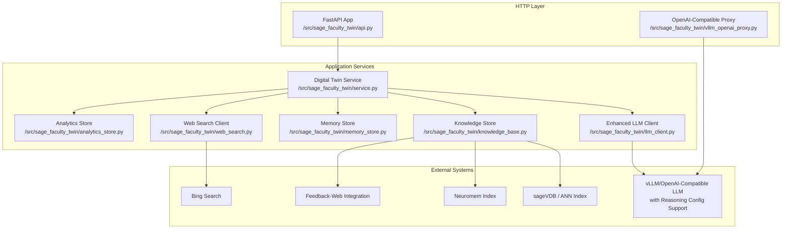

**Diagram sources**
- [api.py:90-120](file://src/sage_faculty_twin/api.py#L90-L120)
- [vllm_openai_proxy.py:123-257](file://src/sage_faculty_twin/vllm_openai_proxy.py#L123-L257)
- [service.py:581-634](file://src/sage_faculty_twin/service.py#L581-L634)
- [llm_client.py:68-135](file://src/sage_faculty_twin/llm_client.py#L68-L135)
- [knowledge_base.py:121-140](file://src/sage_faculty_twin/knowledge_base.py#L121-L140)
- [memory_store.py:223-257](file://src/sage_faculty_twin/memory_store.py#L223-L257)
- [web_search.py:93-127](file://src/sage_faculty_twin/web_search.py#L93-L127)
- [analytics_store.py:485-510](file://src/sage_faculty_twin/analytics_store.py#L485-L510)

**Section sources**
- [api.py:90-120](file://src/sage_faculty_twin/api.py#L90-L120)
- [vllm_openai_proxy.py:123-257](file://src/sage_faculty_twin/vllm_openai_proxy.py#L123-L257)
- [service.py:581-634](file://src/sage_faculty_twin/service.py#L581-L634)

## Core Components
- REST API surface: Authentication, chat orchestration, knowledge management, presence, and operational endpoints.
- Streaming: SSE-based workflow tracing and optional token streaming for answers.
- Enhanced LLM client: OpenAI-compatible HTTP client with intelligent compatibility detection for thinking token budget features, caching, metrics, and streaming support.
- Knowledge base: Pluggable backends (sageVDB, Neuromem, BM25) with embedding and lexical retrieval, now featuring integrated feedback-web knowledge processing.
- Memory collections: Neural layered memory with configurable index backends and telemetry.
- Web search: Bing-based client with query rewriting and result reranking.
- OpenAI-compatible proxy: Secure forwarding to upstream LLM with API key enforcement and streaming passthrough.
- **Deprecated**: Legacy feedback collection mechanisms have been replaced with knowledge-driven feedback-web integration.

**Section sources**
- [api.py:597-700](file://src/sage_faculty_twin/api.py#L597-L700)
- [llm_client.py:68-135](file://src/sage_faculty_twin/llm_client.py#L68-L135)
- [knowledge_base.py:121-140](file://src/sage_faculty_twin/knowledge_base.py#L121-L140)
- [memory_store.py:223-257](file://src/sage_faculty_twin/memory_store.py#L223-L257)
- [web_search.py:93-127](file://src/sage_faculty_twin/web_search.py#L93-L127)
- [vllm_openai_proxy.py:123-257](file://src/sage_faculty_twin/vllm_openai_proxy.py#L123-L257)

## Architecture Overview
The system integrates multiple data sources and compute backends behind a unified API. The service orchestrates retrieval, LLM prompting, and post-answer actions, emitting structured trace events for observability. The enhanced LLM client now features intelligent compatibility detection for thinking token budget features and automatic reasoning-config parameter support. The knowledge base has been enhanced with feedback-web integration that replaces legacy feedback collection mechanisms.

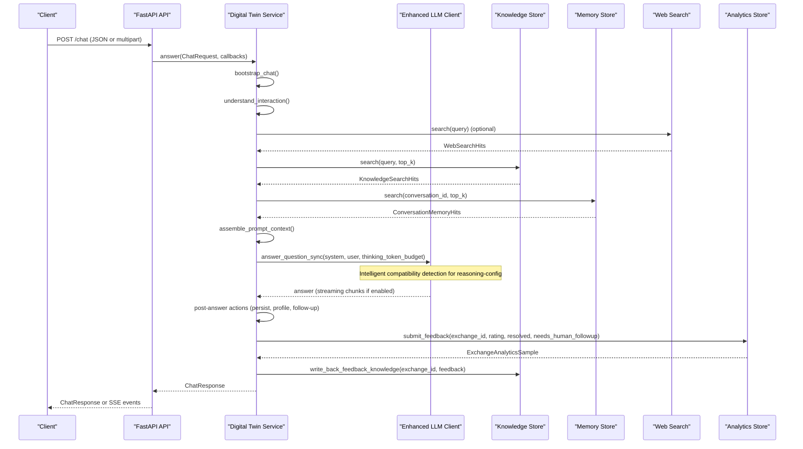

**Diagram sources**
- [api.py:618-700](file://src/sage_faculty_twin/api.py#L618-L700)
- [service.py:581-634](file://src/sage_faculty_twin/service.py#L581-L634)
- [llm_client.py:595-752](file://src/sage_faculty_twin/llm_client.py#L595-L752)
- [web_search.py:109-127](file://src/sage_faculty_twin/web_search.py#L109-L127)
- [knowledge_base.py:273-295](file://src/sage_faculty_twin/knowledge_base.py#L273-L295)
- [memory_store.py:446-489](file://src/sage_faculty_twin/memory_store.py#L446-L489)
- [analytics_store.py:485-510](file://src/sage_faculty_twin/analytics_store.py#L485-L510)

## Detailed Component Analysis

### API Integration Patterns and Streaming
- Endpoint design: Strongly typed request/response models, CORS configuration, and cookie-based session management.
- Streaming: SSE endpoint for workflow events; optional token streaming for answers; keepalive mechanism to prevent proxy timeouts.
- Attachments: Multipart parsing with size/type checks and extraction for PDF/text attachments.
- Health and diagnostics: Health endpoint, stack version reporting, and hardware info.

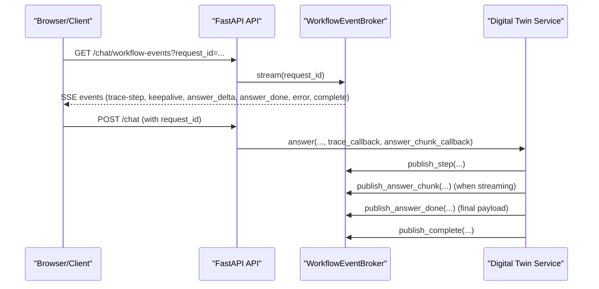

**Diagram sources**
- [api.py:597-700](file://src/sage_faculty_twin/api.py#L597-L700)
- [api.py:170-256](file://src/sage_faculty_twin/api.py#L170-L256)
- [service.py:581-634](file://src/sage_faculty_twin/service.py#L581-L634)

**Section sources**
- [api.py:597-700](file://src/sage_faculty_twin/api.py#L597-L700)
- [api.py:170-256](file://src/sage_faculty_twin/api.py#L170-L256)

### Enhanced LLM Client Architecture with Compatibility Detection
The LLM client now features intelligent compatibility detection for thinking token budget features and automatic reasoning-config parameter support:

- HTTP client configuration with timeouts and connection limits.
- Intent classification using a separate model for interaction classification.
- Caching and semantic similarity detection for responses.
- Metrics collection (throughput, latency, token counts).
- Streaming support for incremental token delivery.
- **New**: Intelligent compatibility detection for thinking token budget features.
- **New**: Automatic detection of vllm instance support for reasoning-config parameter.
- Serving policy integration for request shaping.

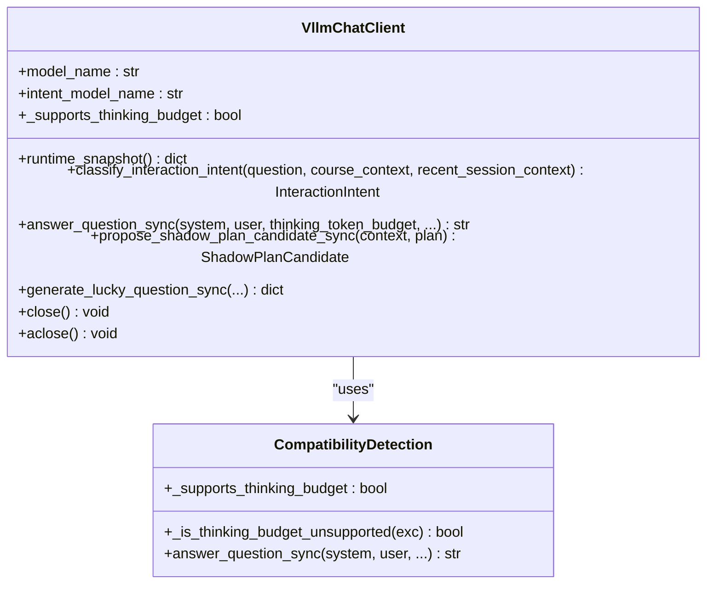

**Diagram sources**
- [llm_client.py:68-135](file://src/sage_faculty_twin/llm_client.py#L68-L135)
- [llm_client.py:242-340](file://src/sage_faculty_twin/llm_client.py#L242-L340)
- [llm_client.py:670-685](file://src/sage_faculty_twin/llm_client.py#L670-L685)

**Section sources**
- [llm_client.py:68-135](file://src/sage_faculty_twin/llm_client.py#L68-L135)
- [llm_client.py:242-340](file://src/sage_faculty_twin/llm_client.py#L242-L340)
- [llm_client.py:670-685](file://src/sage_faculty_twin/llm_client.py#L670-L685)

### OpenAI-Compatible Proxy Configuration
The proxy enforces API keys, normalizes headers, and forwards requests to an upstream OpenAI-compatible server. It supports streaming passthrough and health/status endpoints.

Key behaviors:
- Authentication: Validates client key against configured API key.
- Path mapping: Translates incoming paths to upstream URL with configurable prefix.
- Streaming: Detects stream requests and streams upstream chunks to the client.
- Validation: Validates port/host/path prefixes and API key presence.

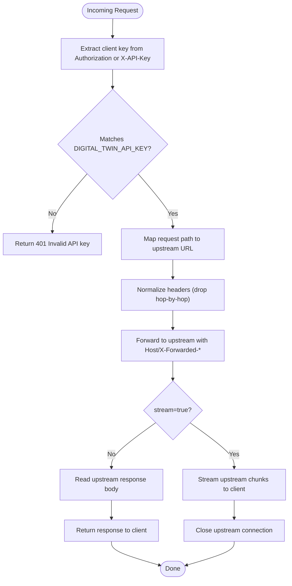

**Diagram sources**
- [vllm_openai_proxy.py:170-252](file://src/sage_faculty_twin/vllm_openai_proxy.py#L170-L252)

**Section sources**
- [vllm_openai_proxy.py:36-121](file://src/sage_faculty_twin/vllm_openai_proxy.py#L36-L121)
- [vllm_openai_proxy.py:170-252](file://src/sage_faculty_twin/vllm_openai_proxy.py#L170-L252)

### Web Search Integration
The web search client:
- Rewrites queries for weather/news intents.
- Searches via Bing RSS and HTML, then reranks results.
- Applies recency scoring and host weights for news domains.
- Normalizes query tokens and decodes Bing URLs.

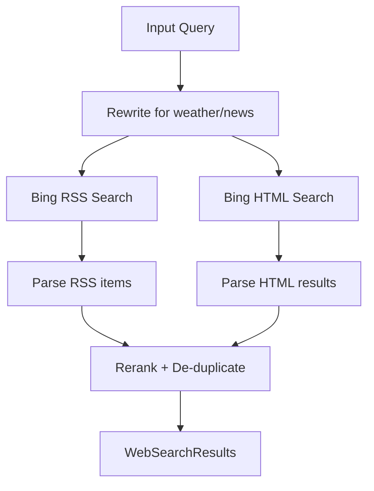

**Diagram sources**
- [web_search.py:109-127](file://src/sage_faculty_twin/web_search.py#L109-L127)
- [web_search.py:222-252](file://src/sage_faculty_twin/web_search.py#L222-L252)

**Section sources**
- [web_search.py:93-127](file://src/sage_faculty_twin/web_search.py#L93-L127)
- [web_search.py:222-252](file://src/sage_faculty_twin/web_search.py#L222-L252)

### Knowledge Backend Plugins with Feedback-Web Integration
The knowledge store supports multiple backends with enhanced feedback-web integration:
- sageVDB: Flat or ANN indices with configurable distance metric and algorithm.
- Neuromem: BM25 or FAISS indexes with batched embedding for FAISS.
- Local JSON storage: Fallback lexical search with visibility rules and de-duplication.
- **New**: Integrated feedback-web knowledge processing with review status management.

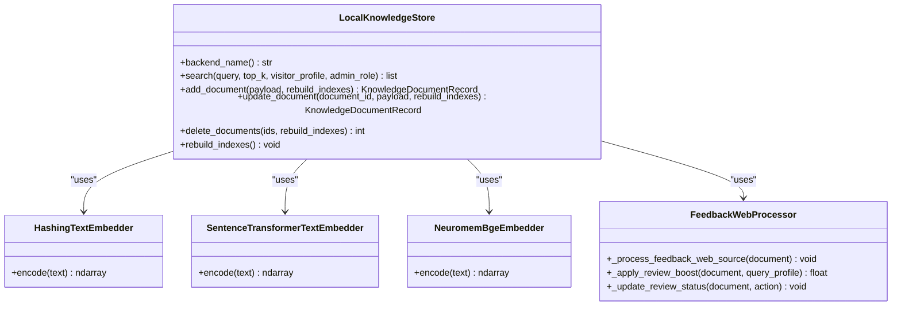

**Diagram sources**
- [knowledge_base.py:121-140](file://src/sage_faculty_twin/knowledge_base.py#L121-L140)
- [knowledge_base.py:18-76](file://src/sage_faculty_twin/knowledge_base.py#L18-L76)
- [knowledge_base.py:78-119](file://src/sage_faculty_twin/knowledge_base.py#L78-L119)
- [knowledge_base.py:861-880](file://src/sage_faculty_twin/knowledge_base.py#L861-L880)

**Section sources**
- [knowledge_base.py:121-140](file://src/sage_faculty_twin/knowledge_base.py#L121-L140)
- [knowledge_base.py:18-76](file://src/sage_faculty_twin/knowledge_base.py#L18-L76)
- [knowledge_base.py:78-119](file://src/sage_faculty_twin/knowledge_base.py#L78-L119)
- [knowledge_base.py:861-880](file://src/sage_faculty_twin/knowledge_base.py#L861-L880)

### Memory Collection Additions
The memory store provides:
- Neural layered memory with configurable index backends (BM25, FAISS, ANN).
- Automatic migration and canonicalization of legacy disk layouts.
- Telemetry and runtime snapshots for operational insights.
- Artifact memory extraction from attachments.

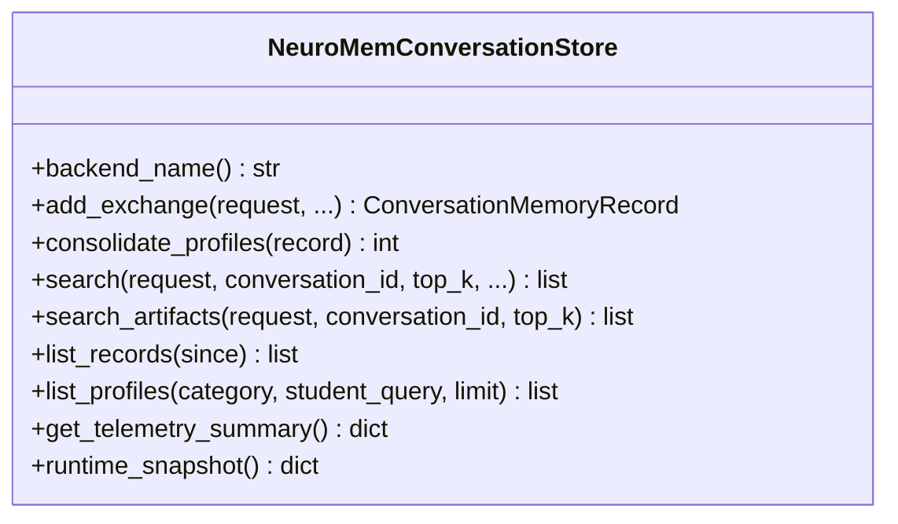

**Diagram sources**
- [memory_store.py:223-257](file://src/sage_faculty_twin/memory_store.py#L223-L257)
- [memory_store.py:380-424](file://src/sage_faculty_twin/memory_store.py#L380-L424)
- [memory_store.py:446-489](file://src/sage_faculty_twin/memory_store.py#L446-L489)

**Section sources**
- [memory_store.py:223-257](file://src/sage_faculty_twin/memory_store.py#L223-L257)
- [memory_store.py:380-424](file://src/sage_faculty_twin/memory_store.py#L380-L424)
- [memory_store.py:446-489](file://src/sage_faculty_twin/memory_store.py#L446-L489)

### Feedback-Driven Knowledge Enhancement Workflow
**Deprecated Legacy Mechanisms**: Legacy feedback collection mechanisms have been replaced with a comprehensive knowledge-driven approach that integrates feedback-web sources directly into the knowledge base with automated review workflows.

The new feedback-web integration includes:
- **Feedback-Web Source Processing**: Documents with source names starting with "feedback-web:" or tags containing "feedback-web" are automatically identified as feedback sources.
- **Review Status Management**: Documents maintain review_status ("pending", "approved", "stale") and freshness_status ("web", "stale").
- **Review Boost Logic**: Non-admin users receive negative relevance boosts for pending/stale feedback-web documents and strong negative boosts for stale documents.
- **Administrative Review Interface**: Admin-only access to approve or mark feedback-web documents as stale.
- **Knowledge Write-Back**: Feedback submissions automatically generate knowledge entries for continuous improvement.

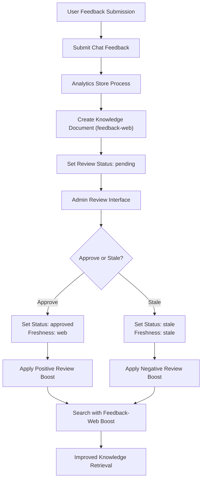

**Diagram sources**
- [service.py:2396-2419](file://src/sage_faculty_twin/service.py#L2396-L2419)
- [service.py:2251-2321](file://src/sage_faculty_twin/service.py#L2251-L2321)
- [knowledge_base.py:861-880](file://src/sage_faculty_twin/knowledge_base.py#L861-L880)
- [models.py:342-383](file://src/sage_faculty_twin/models.py#L342-L383)

**Section sources**
- [service.py:2396-2419](file://src/sage_faculty_twin/service.py#L2396-L2419)
- [service.py:2251-2321](file://src/sage_faculty_twin/service.py#L2251-L2321)
- [knowledge_base.py:861-880](file://src/sage_faculty_twin/knowledge_base.py#L861-L880)
- [models.py:342-383](file://src/sage_faculty_twin/models.py#L342-L383)

### Custom Workflow Extensions
The workflow step registry defines the canonical steps and their properties. To add a custom step:
- Define a new step ID and metadata in the registry.
- Implement the step logic in the planner and wire it into the execution graph.
- Respect side effects, admin-only flags, and timeout budgets.

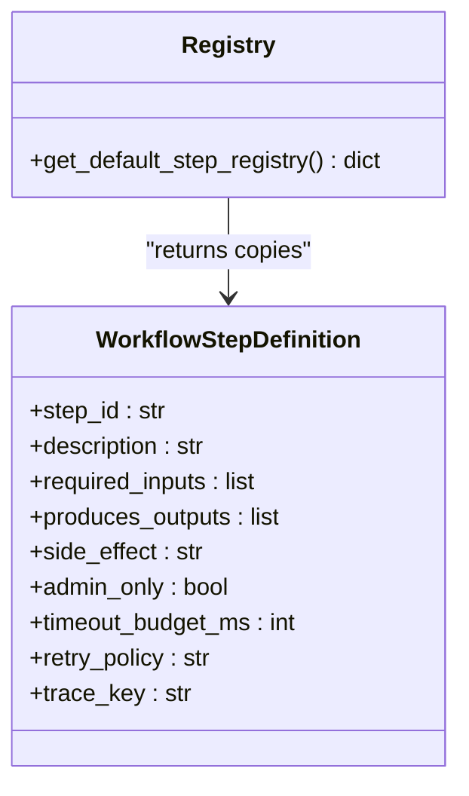

**Diagram sources**
- [workflow_steps.py:9-21](file://src/sage_faculty_twin/workflow_steps.py#L9-L21)
- [workflow_steps.py:179-184](file://src/sage_faculty_twin/workflow_steps.py#L179-L184)

**Section sources**
- [workflow_steps.py:23-174](file://src/sage_faculty_twin/workflow_steps.py#L23-L174)
- [workflow_steps.py:179-184](file://src/sage_faculty_twin/workflow_steps.py#L179-L184)

### External System Connections and Data Export
- Upstream LLM: Configured via base URL and API key; metrics and health endpoints exposed.
- Web search: Bing endpoints with query normalization and result scoring.
- Data export: Knowledge CRUD endpoints, conversation history endpoints, and telemetry summaries.
- **New**: Feedback-web knowledge review endpoints for administrative oversight.

Operational endpoints:
- Health and diagnostics: /health, /stack/versions, /stack/hardware.
- Knowledge management: CRUD endpoints for knowledge documents, including feedback-web review.
- Conversations: List and fetch transcripts with privacy controls.
- **New**: Feedback-web review management: List review summaries, approve/reject feedback-web documents.

**Section sources**
- [api.py:512-540](file://src/sage_faculty_twin/api.py#L512-L540)
- [api.py:764-800](file://src/sage_faculty_twin/api.py#L764-L800)
- [api.py:708-741](file://src/sage_faculty_twin/api.py#L708-L741)

## Dependency Analysis
The service composes multiple subsystems and delegates to specialized clients. Dependencies are primarily module-level imports and runtime initialization.

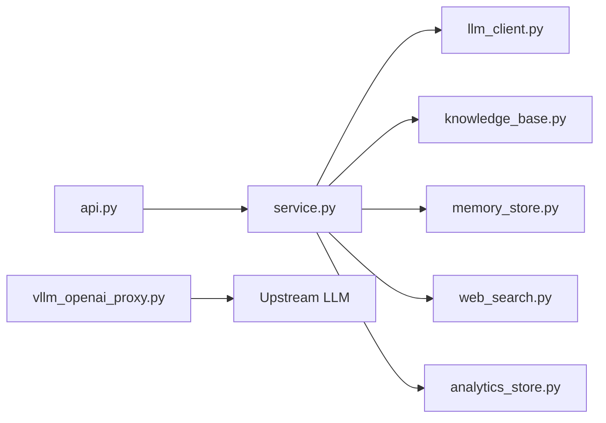

**Diagram sources**
- [service.py:44-132](file://src/sage_faculty_twin/service.py#L44-L132)
- [api.py:90-120](file://src/sage_faculty_twin/api.py#L90-L120)
- [vllm_openai_proxy.py:123-162](file://src/sage_faculty_twin/vllm_openai_proxy.py#L123-L162)

**Section sources**
- [service.py:44-132](file://src/sage_faculty_twin/service.py#L44-L132)
- [api.py:90-120](file://src/sage_faculty_twin/api.py#L90-L120)
- [vllm_openai_proxy.py:123-162](file://src/sage_faculty_twin/vllm_openai_proxy.py#L123-L162)

## Performance Considerations
- Streaming and keepalive: SSE keepalive prevents proxy timeouts; streaming LLM tokens improves perceived latency.
- Prompt soft cap: Truncation policies reduce prompt size to maintain bounded decode latency.
- Caching and metrics: Response cache and semantic similarity cache reduce repeated work; metrics track throughput and latency.
- **Enhanced**: Intelligent compatibility detection reduces unnecessary thinking token budget requests for older vllm instances.
- **New**: Feedback-web review boost computation adds minimal overhead during search scoring.
- Index backends: Choose appropriate knowledge and memory backends for query latency and recall trade-offs.
- Concurrency limits: HTTP client limits and thread-safe caches balance throughput and resource usage.

## Troubleshooting Guide
Common areas to check:
- Authentication and sessions: Verify cookies and admin/user session endpoints.
- Streaming issues: Confirm SSE keepalive interval and client-side event handling.
- Proxy errors: Validate DIGITAL_TWIN_API_KEY, upstream base URL, and path prefix.
- LLM connectivity: Check base URL, API key, and model auto-detection.
- **New**: Thinking token budget compatibility: If you encounter 400 errors with "reasoning_config" or "thinking_token_budget" messages, the vllm instance doesn't support the reasoning-config parameter. The system automatically disables thinking budget features for such instances.
- Knowledge backend failures: Confirm backend selection and embedding model availability.
- Memory backend readiness: Ensure index type is available and properly initialized.
- **New**: Feedback-web integration issues: Verify feedback-web source naming conventions and review status synchronization.

**Updated** Added troubleshooting guidance for thinking token budget compatibility issues and feedback-web integration problems.

**Section sources**
- [api.py:451-510](file://src/sage_faculty_twin/api.py#L451-L510)
- [vllm_openai_proxy.py:36-66](file://src/sage_faculty_twin/vllm_openai_proxy.py#L36-L66)
- [llm_client.py:136-151](file://src/sage_faculty_twin/llm_client.py#L136-L151)
- [llm_client.py:670-685](file://src/sage_faculty_twin/llm_client.py#L670-L685)
- [knowledge_base.py:422-464](file://src/sage_faculty_twin/knowledge_base.py#L422-L464)
- [memory_store.py:258-322](file://src/sage_faculty_twin/memory_store.py#L258-L322)

## Conclusion
The platform offers a robust foundation for integrating external LLMs, knowledge bases, and memory systems. Its modular design enables extending workflows, adding new knowledge backends, and augmenting memory collections while maintaining performance and observability. The enhanced LLM client now features intelligent compatibility detection for thinking token budget features and automatic reasoning-config parameter support, improving reliability across different vllm instance configurations. The deprecated legacy feedback collection mechanisms have been replaced with a comprehensive knowledge-driven feedback-web integration that provides better data quality and automated review workflows. Use the provided proxy, streaming, and diagnostic endpoints to safely integrate and monitor new components.

## Appendices

### Environment Variables and Configuration
- Proxy configuration:
  - DIGITAL_TWIN_API_KEY: Required API key for the proxy.
  - VLLM_PROXY_PORT/VLLM_PROXY_HOST: Listening address.
  - VLLM_PROXY_UPSTREAM_BASE_URL: Upstream LLM base URL.
  - VLLM_PROXY_PATH_PREFIX: Path prefix to strip/attach.
  - VLLM_PROXY_UPSTREAM_API_KEY: Optional upstream API key.
- Chat behavior:
  - DIGITAL_TWIN_CHAT_REQUEST_TIMEOUT_SECONDS: Per-request timeout.
  - DIGITAL_TWIN_CHAT_SSE_KEEPALIVE_SECONDS: SSE keepalive interval.
  - DIGITAL_TWIN_STREAM_CHAT_ANSWER: Enable streaming token events.
  - DIGITAL_TWIN_POST_ANSWER_BACKGROUND: Run post-answer actions in background.
  - DIGITAL_TWIN_PROMPT_SOFT_CAP: Soft cap on assembled prompt length.
  - **New**: DIGITAL_TWIN_THINKING_TOKEN_BUDGET: Default thinking token budget (default: 512).
- Web search:
  - DIGITAL_TWIN_WEB_SEARCH_TIMEOUT_SECONDS/DIGITAL_TWIN_WEB_SEARCH_MAX_RESULTS: Limits for web search.
- **New**: Feedback-web integration:
  - Automatic feedback-web document processing and review workflow.

**Updated** Added DIGITAL_TWIN_THINKING_TOKEN_BUDGET configuration for thinking token budget feature and feedback-web integration documentation.

**Section sources**
- [vllm_openai_proxy.py:36-66](file://src/sage_faculty_twin/vllm_openai_proxy.py#L36-L66)
- [api.py:127-147](file://src/sage_faculty_twin/api.py#L127-L147)
- [service.py:428-444](file://src/sage_faculty_twin/service.py#L428-L444)
- [config.py:91-93](file://src/sage_faculty_twin/config.py#L91-L93)

### Systemd Services and Local Tools
- Proxy service unit: [sage-faculty-twin-vllm-openai-proxy.service](file://deploy/systemd/user/sage-faculty-twin-vllm-openai-proxy.service)
- Local proxy scripts:
  - [local_site_proxy.py](file://tools/local_site_proxy.py)
  - [run_local_proxy.sh](file://tools/run_local_proxy.sh)
  - [run_vllm_openai_proxy.sh](file://tools/run_vllm_openai_proxy.sh)
  - [openai_key_proxy.py](file://tools/openai_key_proxy.py)
- **New**: Qwen3-32B service script with reasoning-config support:
  - [run_qwen3_32b_service.sh](file://run_qwen3_32b_service.sh)

**Updated** Added Qwen3-32B service script demonstrating reasoning-config parameter usage.

**Section sources**
- [systemd user services](file://deploy/systemd/user/sage-faculty-twin-vllm-openai-proxy.service)
- [local site proxy](file://tools/local_site_proxy.py)
- [run local proxy](file://tools/run_local_proxy.sh)
- [run vllm openai proxy](file://tools/run_vllm_openai_proxy.sh)
- [openai key proxy](file://tools/openai_key_proxy.py)
- [run_qwen3_32b_service.sh](file://run_qwen3_32b_service.sh)

### Enhanced LLM Client Compatibility Features
The LLM client now includes intelligent compatibility detection for thinking token budget features:

- **Automatic Detection**: The client automatically detects whether the connected vllm instance supports the reasoning-config parameter.
- **Graceful Degradation**: When reasoning-config is not supported, the client automatically disables thinking budget features and falls back to standard token limits.
- **Error Handling**: Specific 400 errors containing "reasoning_config" or "thinking_token_budget" trigger compatibility mode switching.
- **Configuration Override**: Users can manually disable thinking budget features by setting enable_thinking=False.

**New Section** Added documentation for enhanced LLM client compatibility features.

**Section sources**
- [llm_client.py:110-113](file://src/sage_faculty_twin/llm_client.py#L110-L113)
- [llm_client.py:628-634](file://src/sage_faculty_twin/llm_client.py#L628-L634)
- [llm_client.py:652-667](file://src/sage_faculty_twin/llm_client.py#L652-L667)
- [llm_client.py:670-685](file://src/sage_faculty_twin/llm_client.py#L670-L685)

### Feedback-Web Knowledge Integration Details
**Deprecated Legacy Feedback Mechanisms**: The platform has deprecated legacy feedback collection mechanisms in favor of integrated feedback-web knowledge processing.

Key aspects of the new feedback-web integration:
- **Source Identification**: Documents with source names starting with "feedback-web:" or tags containing "feedback-web" are automatically processed as feedback sources.
- **Review Status Tracking**: Documents maintain review_status ("unknown", "pending", "approved", "stale") and freshness_status ("unknown", "web", "stale").
- **Administrative Controls**: Admin-only access to review and approve feedback-web documents.
- **Search Integration**: Non-admin users receive negative relevance boosts for pending/stale feedback-web documents to prioritize approved content.
- **Automated Processing**: Feedback submissions automatically generate knowledge entries for continuous system improvement.

**Section sources**
- [models.py:342-383](file://src/sage_faculty_twin/models.py#L342-L383)
- [knowledge_base.py:861-880](file://src/sage_faculty_twin/knowledge_base.py#L861-L880)
- [service.py:2251-2321](file://src/sage_faculty_twin/service.py#L2251-L2321)
- [service.py:2396-2419](file://src/sage_faculty_twin/service.py#L2396-L2419)
- [analytics_store.py:485-510](file://src/sage_faculty_twin/analytics_store.py#L485-L510)