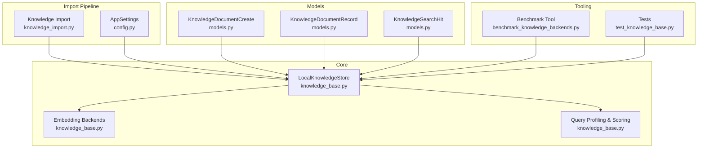
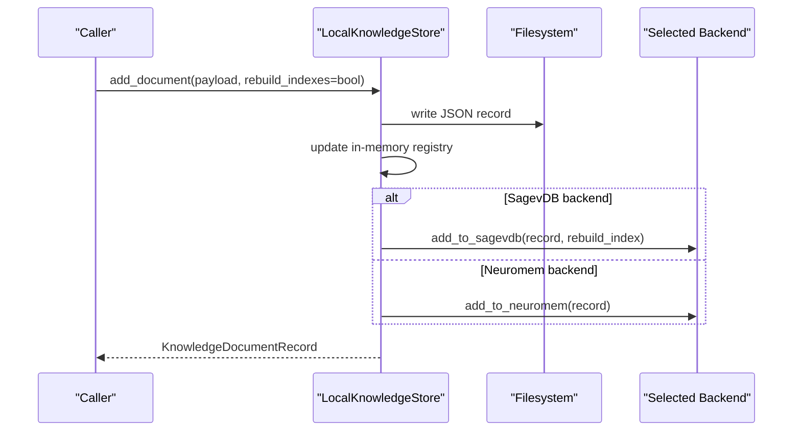
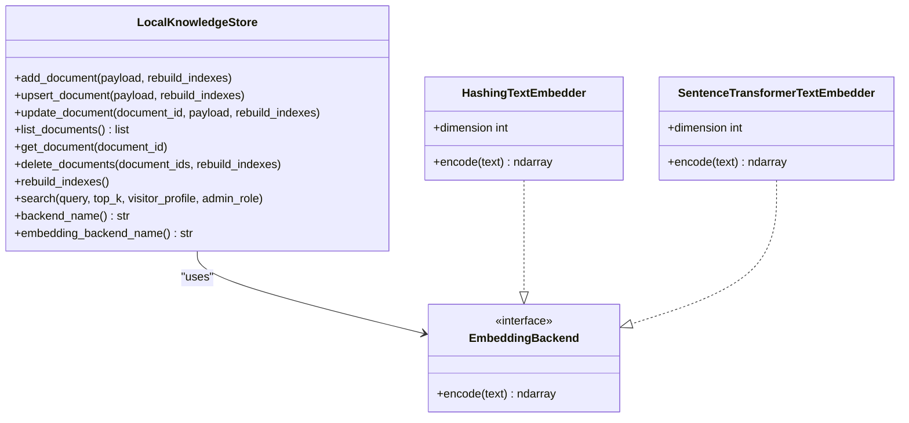
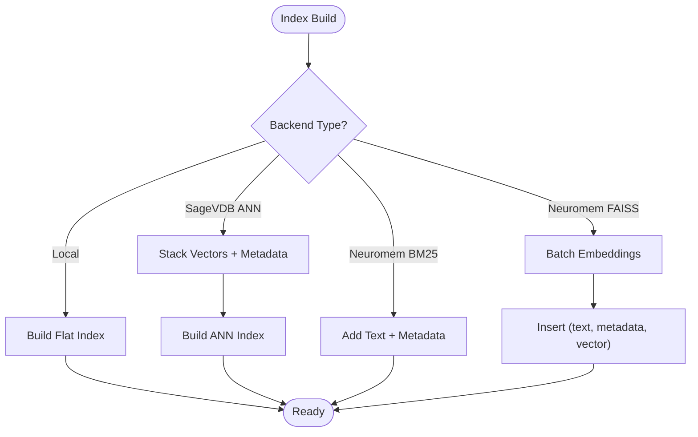
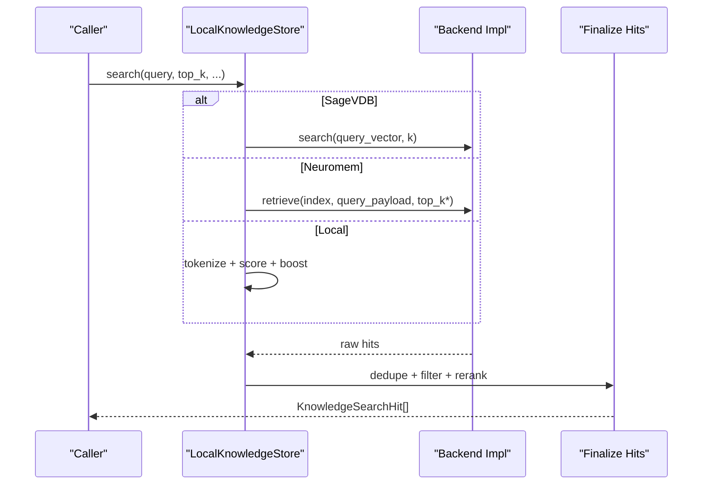
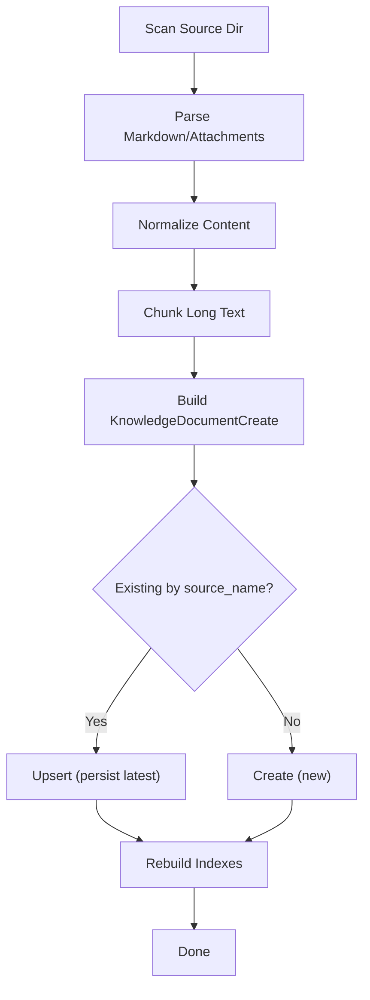
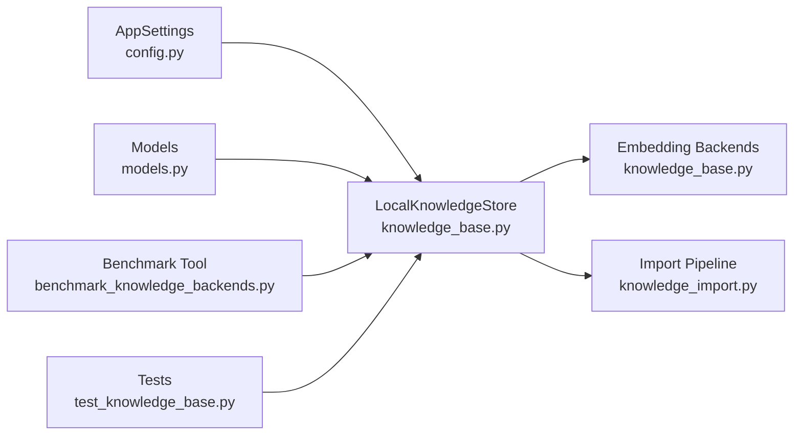

# Knowledge Backend Plugins

<cite>
**Referenced Files in This Document**
- [knowledge_base.py](file://src/sage_faculty_twin/knowledge_base.py)
- [knowledge_import.py](file://src/sage_faculty_twin/knowledge_import.py)
- [models.py](file://src/sage_faculty_twin/models.py)
- [config.py](file://src/sage_faculty_twin/config.py)
- [benchmark_knowledge_backends.py](file://tools/benchmark_knowledge_backends.py)
- [test_knowledge_base.py](file://tests/test_knowledge_base.py)
</cite>

## Table of Contents
1. [Introduction](#introduction)
2. [Project Structure](#project-structure)
3. [Core Components](#core-components)
4. [Architecture Overview](#architecture-overview)
5. [Detailed Component Analysis](#detailed-component-analysis)
6. [Dependency Analysis](#dependency-analysis)
7. [Performance Considerations](#performance-considerations)
8. [Troubleshooting Guide](#troubleshooting-guide)
9. [Conclusion](#conclusion)
10. [Appendices](#appendices)

## Introduction
This document explains how to extend the knowledge base with custom backend plugins. It covers the backend interface contract, indexing strategies, retrieval mechanisms, plugin registration via configuration, metadata handling, and performance optimization techniques. It also provides practical examples for implementing custom knowledge backends for specialized document types, integrating with external databases, and adding hybrid search capabilities.

## Project Structure
The knowledge base system centers around a local store abstraction that supports multiple backends. Supporting modules handle ingestion, configuration, and benchmarking.

**Diagram sources**
- [knowledge_base.py:121-817](file://src/sage_faculty_twin/knowledge_base.py#L121-L817)
- [knowledge_import.py:1-113](file://src/sage_faculty_twin/knowledge_import.py#L1-L113)
- [models.py:319-408](file://src/sage_faculty_twin/models.py#L319-L408)
- [config.py:9-132](file://src/sage_faculty_twin/config.py#L9-L132)
- [benchmark_knowledge_backends.py:156-211](file://tools/benchmark_knowledge_backends.py#L156-L211)
- [test_knowledge_base.py:15-141](file://tests/test_knowledge_base.py#L15-L141)

**Section sources**
- [knowledge_base.py:121-817](file://src/sage_faculty_twin/knowledge_base.py#L121-L817)
- [knowledge_import.py:1-113](file://src/sage_faculty_twin/knowledge_import.py#L1-L113)
- [models.py:319-408](file://src/sage_faculty_twin/models.py#L319-L408)
- [config.py:9-132](file://src/sage_faculty_twin/config.py#L9-L132)
- [benchmark_knowledge_backends.py:156-211](file://tools/benchmark_knowledge_backends.py#L156-L211)
- [test_knowledge_base.py:15-141](file://tests/test_knowledge_base.py#L15-L141)

## Core Components
- LocalKnowledgeStore: central orchestrator for document lifecycle (add/upsert/update/list/delete), indexing, and retrieval across backends.
- Embedding backends: hash-based and sentence-transformers encoders for dense embeddings.
- Query profiling and scoring: tokenization, intent inference, audience visibility, and ranking heuristics.
- Import pipeline: ingestion helpers for homepage materials and generic payloads.
- Configuration: environment-driven settings controlling backend selection, embedding models, and retrieval parameters.
- Models: typed payloads and records for documents and search hits.

Key responsibilities:
- Backend selection and initialization (local, sagevdb, neuromem).
- Index building and rebuilding.
- Hybrid retrieval combining lexical and dense signals.
- Metadata normalization and audience-aware visibility filtering.

**Section sources**
- [knowledge_base.py:121-817](file://src/sage_faculty_twin/knowledge_base.py#L121-L817)
- [models.py:319-408](file://src/sage_faculty_twin/models.py#L319-L408)
- [config.py:63-119](file://src/sage_faculty_twin/config.py#L63-L119)

## Architecture Overview
The system exposes a unified interface for adding and retrieving knowledge while delegating storage and search to pluggable backends. The store writes documents to disk, maintains an in-memory registry, and initializes the selected backend for indexing and retrieval.

**Diagram sources**
- [knowledge_base.py:141-165](file://src/sage_faculty_twin/knowledge_base.py#L141-L165)

**Section sources**
- [knowledge_base.py:121-165](file://src/sage_faculty_twin/knowledge_base.py#L121-L165)

## Detailed Component Analysis

### Backend Interface Contract
The store’s public API defines the contract for custom backends:
- Document operations: add_document, upsert_document, update_document, list_documents, get_document, delete_documents, rebuild_indexes.
- Retrieval: search(query, top_k, visitor_profile, admin_role).
- Backend introspection: backend_name, embedding_backend_name.

Custom backends must implement:
- Index construction and updates upon add/upsert/delete.
- A search method that returns KnowledgeSearchHit list with document_id, title, excerpt, score, tags, source_name, metadata.
- Optional embedding support if dense retrieval is used.

**Diagram sources**
- [knowledge_base.py:18-119](file://src/sage_faculty_twin/knowledge_base.py#L18-L119)
- [knowledge_base.py:121-817](file://src/sage_faculty_twin/knowledge_base.py#L121-L817)

**Section sources**
- [knowledge_base.py:121-817](file://src/sage_faculty_twin/knowledge_base.py#L121-L817)

### Indexing Strategies
- Local flat index: builds a flat index over stored vectors.
- SageVDB ANN: supports “cpp” and “sage-anns” backends with configurable algorithms.
- Neuromem: supports “bm25” (lexical) and “faiss” (dense) modes with optional batched embedding indexing.

Batching and precomputation:
- Neuromem FAISS path computes embeddings in batches for speed.
- SageVDB ANN path stacks vectors and builds index in one operation.

**Diagram sources**
- [knowledge_base.py:422-590](file://src/sage_faculty_twin/knowledge_base.py#L422-L590)
- [knowledge_base.py:721-754](file://src/sage_faculty_twin/knowledge_base.py#L721-L754)
- [knowledge_base.py:522-560](file://src/sage_faculty_twin/knowledge_base.py#L522-L560)

**Section sources**
- [knowledge_base.py:422-590](file://src/sage_faculty_twin/knowledge_base.py#L422-L590)
- [knowledge_base.py:721-754](file://src/sage_faculty_twin/knowledge_base.py#L721-L754)
- [knowledge_base.py:522-560](file://src/sage_faculty_twin/knowledge_base.py#L522-L560)

### Retrieval Mechanisms
- Local retrieval: token overlap scoring across title, content, and tags; intent-aware boosts; visitor/admin audience filtering; deduplication by source group.
- SageVDB: vector similarity search or lexical search depending on backend configuration.
- Neuromem: hybrid retrieval combining FAISS dense scores and BM25 lexical scores; final reranking by lexical score and intent.

**Diagram sources**
- [knowledge_base.py:273-331](file://src/sage_faculty_twin/knowledge_base.py#L273-L331)
- [knowledge_base.py:756-817](file://src/sage_faculty_twin/knowledge_base.py#L756-L817)
- [knowledge_base.py:611-710](file://src/sage_faculty_twin/knowledge_base.py#L611-L710)

**Section sources**
- [knowledge_base.py:273-331](file://src/sage_faculty_twin/knowledge_base.py#L273-L331)
- [knowledge_base.py:756-817](file://src/sage_faculty_twin/knowledge_base.py#L756-L817)
- [knowledge_base.py:611-710](file://src/sage_faculty_twin/knowledge_base.py#L611-L710)

### Plugin Registration and Configuration
- Backend selection: knowledge_backend controls which backend is initialized (local, sagevdb, neuromem).
- SageVDB configuration: embedding backend, model, dimension, backend type, and ANN algorithm.
- Neuromem configuration: index type (bm25/faiss), embedding model and dimension.
- Retrieval tuning: retrieval_top_k.

These are defined in AppSettings and consumed by LocalKnowledgeStore during initialization.

**Section sources**
- [config.py:63-119](file://src/sage_faculty_twin/config.py#L63-L119)
- [knowledge_base.py:121-140](file://src/sage_faculty_twin/knowledge_base.py#L121-L140)

### Metadata Handling and Visibility
- Metadata inference: identity, domain, course_id, material_type, ordinal info derived from tags and source_name.
- Explicit metadata: caller-provided dict merged with inferred values.
- Audience visibility: documents tagged with audience constraints are filtered by visitor/admin role.

**Section sources**
- [knowledge_base.py:1388-1466](file://src/sage_faculty_twin/knowledge_base.py#L1388-L1466)
- [knowledge_base.py:1500-1541](file://src/sage_faculty_twin/knowledge_base.py#L1500-L1541)

### Import Pipeline Customization
- Homepage ingestion: builds KnowledgeDocumentCreate payloads from markdown sections, attachments, and publications.
- Generic ingestion: chunks long content, normalizes markdown, extracts text from PDFs and office files.
- Upsert semantics: deduplicates by source_name, persists only the latest version, rebuilds indexes once at the end.

**Diagram sources**
- [knowledge_import.py:32-113](file://src/sage_faculty_twin/knowledge_import.py#L32-L113)
- [knowledge_import.py:686-711](file://src/sage_faculty_twin/knowledge_import.py#L686-L711)

**Section sources**
- [knowledge_import.py:32-113](file://src/sage_faculty_twin/knowledge_import.py#L32-L113)
- [knowledge_import.py:686-711](file://src/sage_faculty_twin/knowledge_import.py#L686-L711)

### Examples and Recipes

#### Implement a Custom Backend
Steps:
1. Define a new backend class implementing the interface contract (add_document/upsert_document/search/etc.).
2. Integrate initialization in LocalKnowledgeStore.__init__ branching on knowledge_backend.
3. Implement index build/rebuild and search logic.
4. Expose embedding_backend_name if applicable.
5. Register via AppSettings (knowledge_backend) and tune via environment variables.

Reference implementations:
- SageVDB backend initialization and search.
- Neuromem backend initialization and hybrid retrieval.

**Section sources**
- [knowledge_base.py:422-521](file://src/sage_faculty_twin/knowledge_base.py#L422-L521)
- [knowledge_base.py:592-817](file://src/sage_faculty_twin/knowledge_base.py#L592-L817)

#### Specialized Document Types
- Homepage materials: split by headings, infer tags and source stubs, attach PDFs and attachments.
- Publications: extract metadata (venue/year/authors), build concise digests.
- Teaching materials: derive course and material types, handle ordinal numbering.

**Section sources**
- [knowledge_import.py:128-366](file://src/sage_faculty_twin/knowledge_import.py#L128-L366)
- [knowledge_import.py:545-624](file://src/sage_faculty_twin/knowledge_import.py#L545-L624)

#### External Database Integration
Approach:
- Treat the external DB as a read-only source for ingestion.
- Use knowledge_import to transform DB rows into KnowledgeDocumentCreate payloads.
- Persist transformed payloads to the knowledge base directory for indexing.
- For live hybrid search, implement a custom backend that queries the DB alongside the local index.

Guidance:
- Use upsert_document to maintain uniqueness by source_name.
- Rebuild indexes after bulk ingestion.

**Section sources**
- [knowledge_import.py:32-113](file://src/sage_faculty_twin/knowledge_import.py#L32-L113)
- [knowledge_base.py:167-207](file://src/sage_faculty_twin/knowledge_base.py#L167-L207)

#### Hybrid Search Capabilities
- SageVDB: choose metric (inner product vs cosine) and index type (flat vs ANN).
- Neuromem: combine FAISS dense and BM25 lexical retrieval, then rerank by lexical score and intent.

**Section sources**
- [knowledge_base.py:434-441](file://src/sage_faculty_twin/knowledge_base.py#L434-L441)
- [knowledge_base.py:611-710](file://src/sage_faculty_twin/knowledge_base.py#L611-L710)

## Dependency Analysis
The store depends on configuration, models, and backend-specific libraries. Tests and benchmarking validate behavior across backends.

**Diagram sources**
- [config.py:9-132](file://src/sage_faculty_twin/config.py#L9-L132)
- [models.py:319-408](file://src/sage_faculty_twin/models.py#L319-L408)
- [knowledge_base.py:121-817](file://src/sage_faculty_twin/knowledge_base.py#L121-L817)
- [knowledge_import.py:1-113](file://src/sage_faculty_twin/knowledge_import.py#L1-L113)
- [benchmark_knowledge_backends.py:156-211](file://tools/benchmark_knowledge_backends.py#L156-L211)
- [test_knowledge_base.py:15-141](file://tests/test_knowledge_base.py#L15-L141)

**Section sources**
- [config.py:9-132](file://src/sage_faculty_twin/config.py#L9-L132)
- [models.py:319-408](file://src/sage_faculty_twin/models.py#L319-L408)
- [knowledge_base.py:121-817](file://src/sage_faculty_twin/knowledge_base.py#L121-L817)
- [knowledge_import.py:1-113](file://src/sage_faculty_twin/knowledge_import.py#L1-L113)
- [benchmark_knowledge_backends.py:156-211](file://tools/benchmark_knowledge_backends.py#L156-L211)
- [test_knowledge_base.py:15-141](file://tests/test_knowledge_base.py#L15-L141)

## Performance Considerations
- Dense embedding batching: compute embeddings in batches for FAISS indexing to reduce overhead.
- ANN algorithm selection: tune algorithm and backend for SageVDB ANN.
- Top-K and deduplication: adjust retrieval_top_k and rely on source-group deduplication to reduce noise.
- Rebuilding indexes: defer rebuild_indexes during bulk operations and call once at the end.
- Benchmarking: use the provided benchmark tool to compare backends on your dataset.

**Section sources**
- [knowledge_base.py:522-560](file://src/sage_faculty_twin/knowledge_base.py#L522-L560)
- [benchmark_knowledge_backends.py:156-211](file://tools/benchmark_knowledge_backends.py#L156-L211)
- [knowledge_import.py:68-104](file://src/sage_faculty_twin/knowledge_import.py#L68-L104)

## Troubleshooting Guide
Common issues and resolutions:
- Backend not installed: ensure required packages for chosen backend are installed (e.g., sagevdb, sentence-transformers, neuromem).
- Dimension mismatch: verify embedding model dimension matches configured dimension.
- Empty results: check retrieval_top_k, query intent inference, and audience visibility filters.
- Stale documents: use upsert to replace duplicates by source_name; the store removes older versions.

Validation references:
- Backend initialization and error messages.
- Upsert behavior and duplicate removal.
- Audience visibility enforcement.

**Section sources**
- [knowledge_base.py:422-463](file://src/sage_faculty_twin/knowledge_base.py#L422-L463)
- [knowledge_base.py:354-400](file://src/sage_faculty_twin/knowledge_base.py#L354-L400)
- [knowledge_base.py:1500-1541](file://src/sage_faculty_twin/knowledge_base.py#L1500-L1541)

## Conclusion
The knowledge base system provides a flexible, configuration-driven foundation for pluggable backends. By adhering to the documented interface contract, leveraging the ingestion pipeline, and applying the performance and metadata best practices outlined here, teams can implement custom backends for specialized domains, integrate external data sources, and deliver robust hybrid retrieval experiences.

## Appendices

### Appendix A: Backend Selection and Environment Variables
- DIGITAL_TWIN_KNOWLEDGE_BACKEND: selects backend (local, sagevdb, neuromem).
- DIGITAL_TWIN_SAGEVDB_BACKEND: backend type for SageVDB (“cpp”, “sage-anns”).
- DIGITAL_TWIN_SAGEVDB_ANNS_ALGORITHM: ANN algorithm for SageVDB.
- DIGITAL_TWIN_SAGEVDB_EMBEDDING_BACKEND: embedding backend (“hash”, “sentence-transformers”).
- DIGITAL_TWIN_NEUROMEM_INDEX_TYPE: “bm25” or “faiss”.
- DIGITAL_TWIN_RETRIEVAL_TOP_K: default top-k for retrieval.

**Section sources**
- [config.py:63-119](file://src/sage_faculty_twin/config.py#L63-L119)

### Appendix B: Test Coverage Highlights
- Add/search, upsert semantics, metadata inference/backfill, audience visibility, and backend-specific behaviors validated across local and neuromem backends.

**Section sources**
- [test_knowledge_base.py:15-141](file://tests/test_knowledge_base.py#L15-L141)
- [test_knowledge_base.py:118-141](file://tests/test_knowledge_base.py#L118-L141)
- [test_knowledge_base.py:495-570](file://tests/test_knowledge_base.py#L495-L570)
- [test_knowledge_base.py:649-647](file://tests/test_knowledge_base.py#L649-L647)