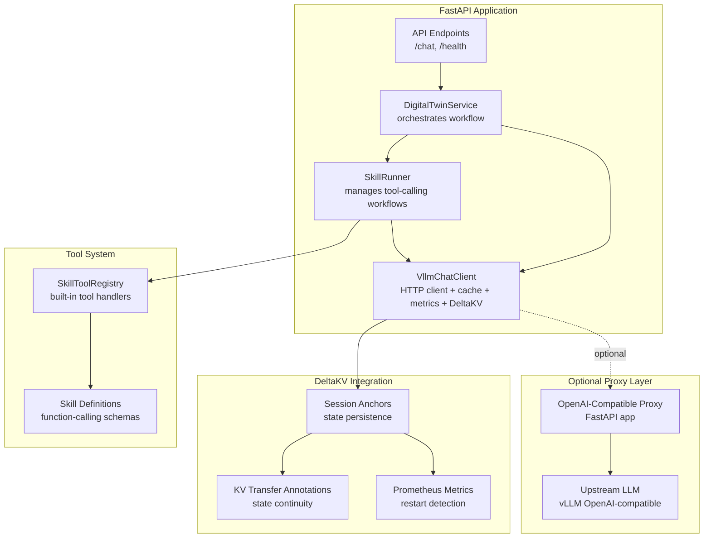
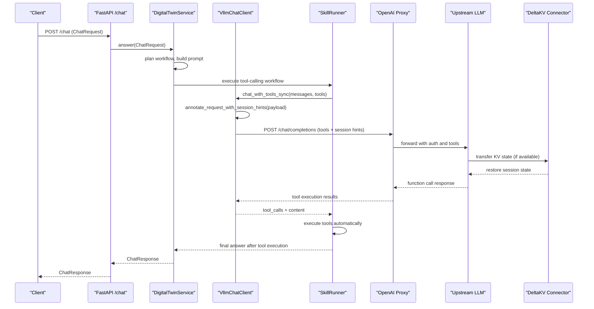
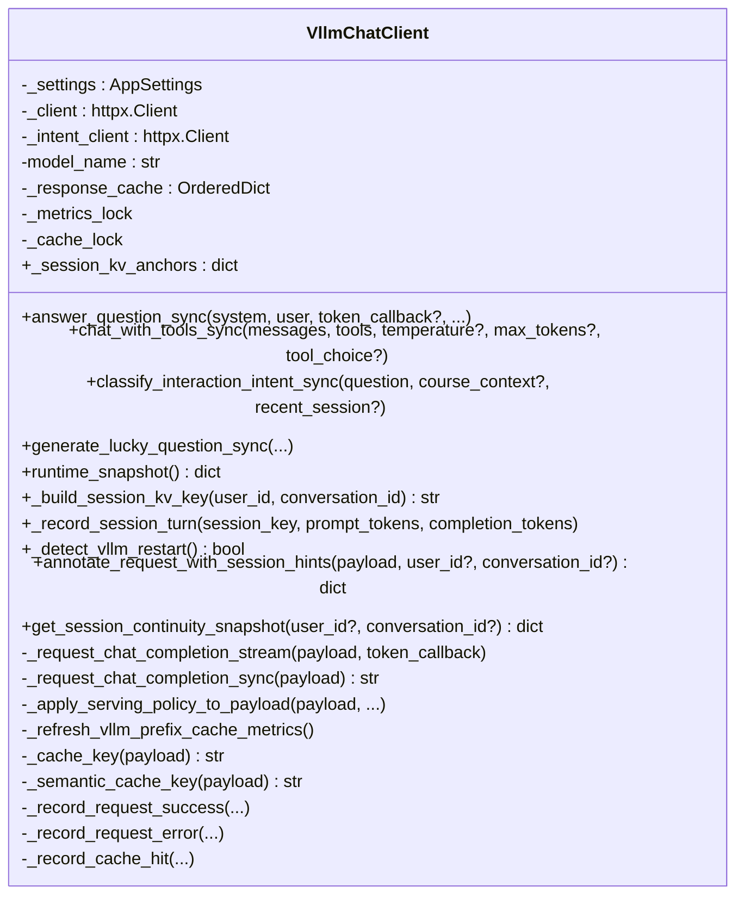
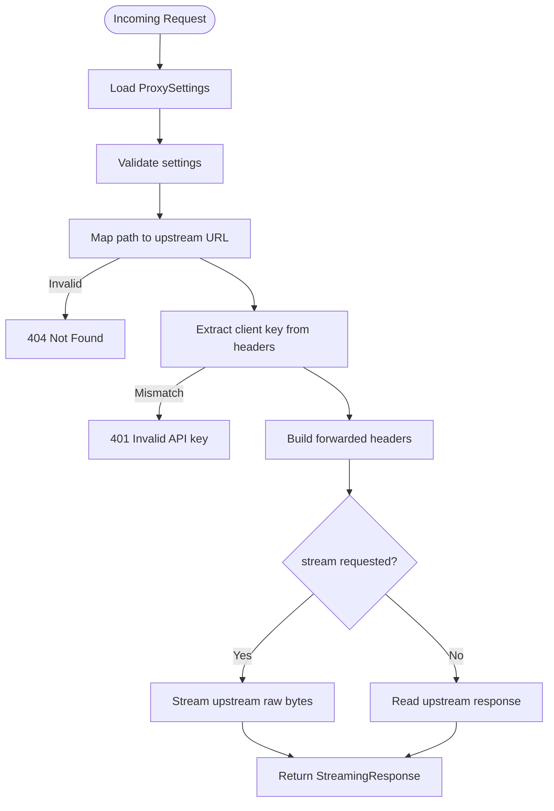
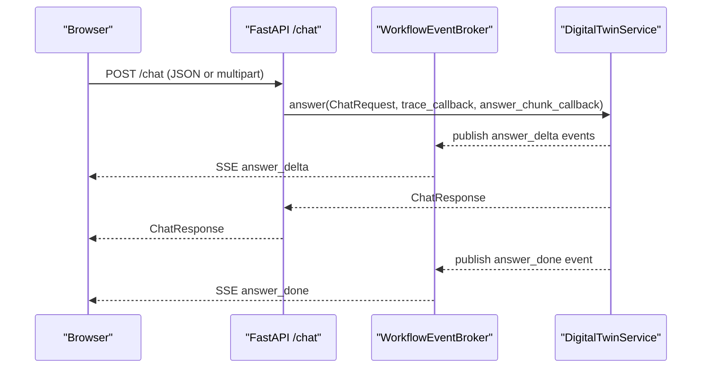
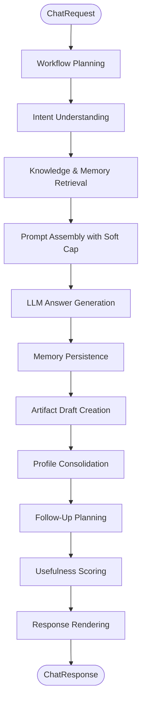
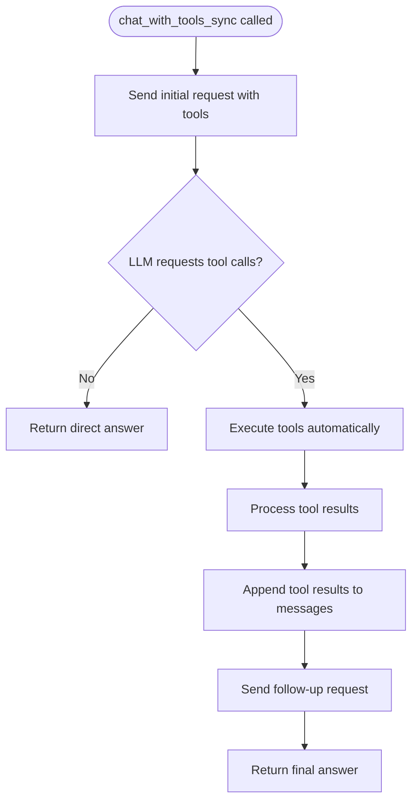
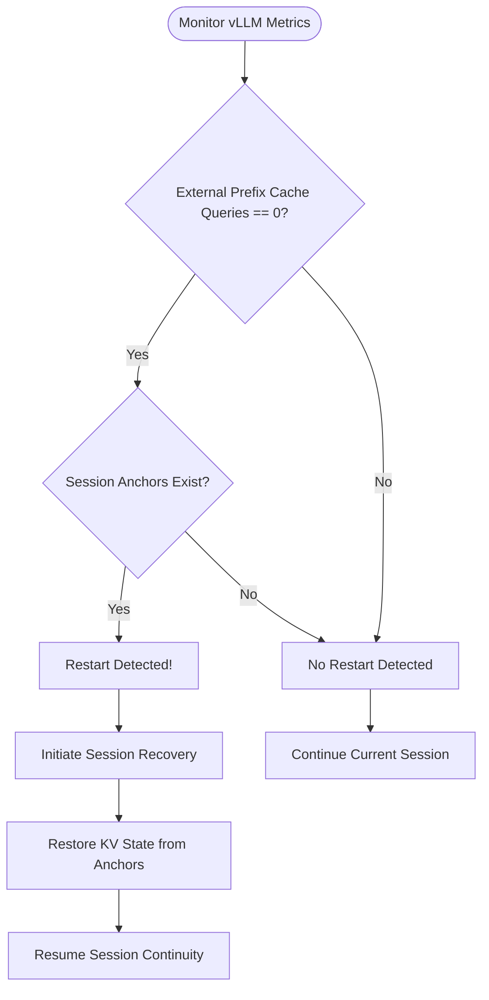
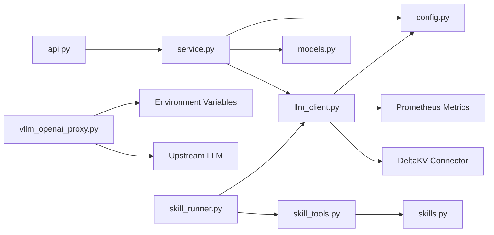
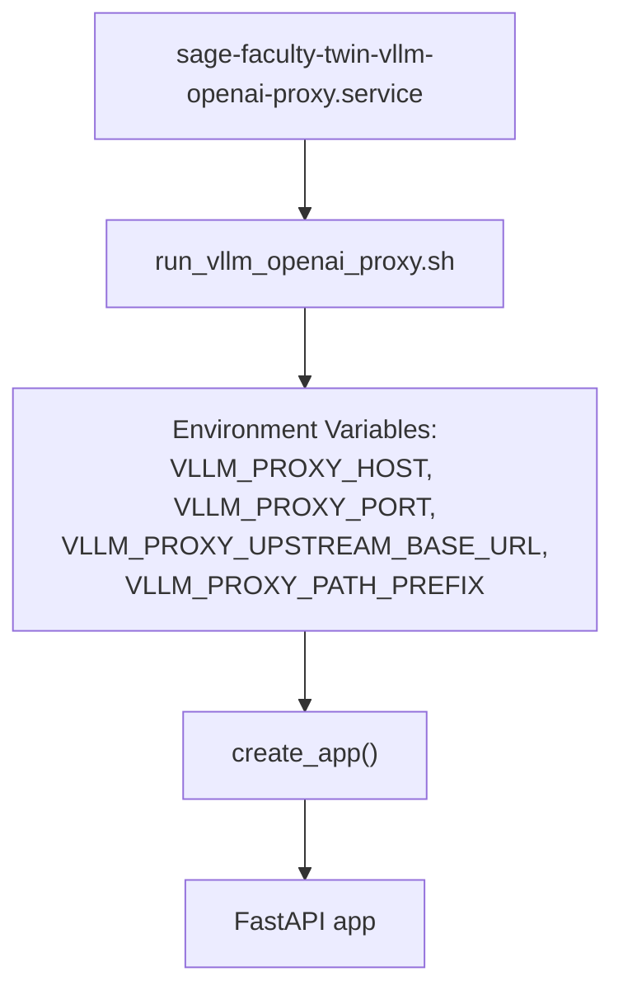

# LLM Client Architecture

<cite>
**Referenced Files in This Document**
- [llm_client.py](file://src/sage_faculty_twin/llm_client.py)
- [vllm_openai_proxy.py](file://src/sage_faculty_twin/vllm_openai_proxy.py)
- [api.py](file://src/sage_faculty_twin/api.py)
- [service.py](file://src/sage_faculty_twin/service.py)
- [config.py](file://src/sage_faculty_twin/config.py)
- [models.py](file://src/sage_faculty_twin/models.py)
- [skill_runner.py](file://src/sage_faculty_twin/skill_runner.py)
- [skill_tools.py](file://src/sage_faculty_twin/skill_tools.py)
- [skills.py](file://src/sage_faculty_twin/skills.py)
- [sage-faculty-twin-vllm-openai-proxy.service](file://deploy/systemd/user/sage-faculty-twin-vllm-openai-proxy.service)
</cite>

## Update Summary
**Changes Made**
- Added comprehensive documentation for the new DeltaKV session continuity feature with sophisticated session state management
- Enhanced VllmChatClient with session key generation, restart detection through Prometheus metrics, and automatic KV state transfer annotations
- Updated configuration section to include new kv_continuity_enabled and kv_continuity_session_prefix settings
- Added detailed coverage of token usage tracking and session state persistence across vLLM restarts
- Enhanced troubleshooting guide with DeltaKV-specific error handling and recovery mechanisms

## Table of Contents
1. [Introduction](#introduction)
2. [Project Structure](#project-structure)
3. [Core Components](#core-components)
4. [Architecture Overview](#architecture-overview)
5. [Detailed Component Analysis](#detailed-component-analysis)
6. [Enhanced Error Handling and Recovery](#enhanced-error-handling-and-recovery)
7. [Tool-Calling Architecture](#tool-calling-architecture)
8. [Skill System Integration](#skill-system-integration)
9. [DeltaKV Session Continuity](#deltakv-session-continuity)
10. [Dependency Analysis](#dependency-analysis)
11. [Performance Considerations](#performance-considerations)
12. [Troubleshooting Guide](#troubleshooting-guide)
13. [Conclusion](#conclusion)
14. [Appendices](#appendices)

## Introduction
This document explains the LLM client architecture and the OpenAI-compatible proxy system used by the Sage Faculty Twin platform. It covers the client abstraction layer, connection pooling, request routing, streaming and caching, authentication, and performance optimization strategies. It also provides guidance for integrating new LLM providers, implementing fallback mechanisms, and monitoring latency, while maintaining compatibility with existing workflows.

**Updated** Enhanced with comprehensive DeltaKV session continuity support, featuring sophisticated session state management, restart detection through Prometheus metrics, token usage tracking, and automatic KV state transfer annotations for seamless conversation continuity across vLLM server restarts.

## Project Structure
The system centers around a FastAPI application that orchestrates a deterministic workflow pipeline. The LLM client encapsulates HTTP communication with an OpenAI-compatible backend, including streaming, caching, and congestion-aware token shaping. An optional OpenAI-compatible proxy sits in front of the upstream LLM to enforce authentication and route requests. The enhanced architecture now supports sophisticated tool-calling capabilities for complex multi-step reasoning tasks and seamless session continuity through DeltaKV integration.



**Diagram sources**
- [api.py:634-716](file://src/sage_faculty_twin/api.py#L634-L716)
- [service.py:5530-5570](file://src/sage_faculty_twin/service.py#L5530-L5570)
- [llm_client.py:290-375](file://src/sage_faculty_twin/llm_client.py#L290-L375)
- [vllm_openai_proxy.py:123-257](file://src/sage_faculty_twin/vllm_openai_proxy.py#L123-L257)
- [skill_runner.py:80-219](file://src/sage_faculty_twin/skill_runner.py#L80-L219)
- [skill_tools.py:22-71](file://src/sage_faculty_twin/skill_tools.py#L22-L71)
- [skills.py:70-94](file://src/sage_faculty_twin/skills.py#L70-L94)

**Section sources**
- [api.py:90-116](file://src/sage_faculty_twin/api.py#L90-L116)
- [service.py:5530-5570](file://src/sage_faculty_twin/service.py#L5530-L5570)
- [llm_client.py:290-375](file://src/sage_faculty_twin/llm_client.py#L290-L375)
- [vllm_openai_proxy.py:123-257](file://src/sage_faculty_twin/vllm_openai_proxy.py#L123-L257)
- [skill_runner.py:80-219](file://src/sage_faculty_twin/skill_runner.py#L80-L219)
- [skill_tools.py:22-71](file://src/sage_faculty_twin/skill_tools.py#L22-L71)
- [skills.py:70-94](file://src/sage_faculty_twin/skills.py#L70-L94)

## Core Components
- VllmChatClient: HTTP client wrapper for OpenAI-compatible LLM APIs with streaming, caching, metrics, congestion-aware shaping, and **DeltaKV session continuity**. Now includes advanced tool-calling support through chat_with_tools_sync method and sophisticated session state management.
- DigitalTwinService: Orchestrates the chat workflow, integrates retrieval, builds prompts, invokes the LLM, persists memory, and renders responses.
- OpenAI-Compatible Proxy: Optional FastAPI proxy enforcing authentication and forwarding requests to the upstream LLM.
- SkillRunner: Manages multi-turn tool-calling workflows with automatic tool execution and result processing.
- SkillToolRegistry: Provides built-in tool handlers for knowledge search, memory retrieval, scheduling, and other capabilities.
- API Layer: Exposes endpoints for chat, health, and administrative operations.
- **DeltaKV Session Continuity**: Advanced session state management system that maintains conversation continuity across vLLM server restarts through stable session identifiers and automatic KV state transfer annotations.

Key capabilities:
- Streaming responses with incremental token delivery to SSE channels.
- Response caching with exact and semantic similarity-based hits.
- Congestion-aware token budget shaping using upstream metrics.
- Authentication via bearer tokens or x-api-key.
- Structured tracing and telemetry for latency, throughput, and cache hit rates.
- **Enhanced Error Handling**: Automatic detection and recovery from vLLM SSE error payloads with graceful fallback mechanisms.
- **Advanced Tool-Calling**: Sophisticated function-calling support with multi-step reasoning workflows and automatic tool execution.
- **Session Continuity**: Sophisticated session state management with restart detection, token usage tracking, and automatic KV state preservation across server restarts.

**Section sources**
- [llm_client.py:290-375](file://src/sage_faculty_twin/llm_client.py#L290-L375)
- [service.py:5530-5570](file://src/sage_faculty_twin/service.py#L5530-L5570)
- [vllm_openai_proxy.py:123-257](file://src/sage_faculty_twin/vllm_openai_proxy.py#L123-L257)
- [api.py:634-716](file://src/sage_faculty_twin/api.py#L634-L716)
- [skill_runner.py:80-219](file://src/sage_faculty_twin/skill_runner.py#L80-L219)
- [skill_tools.py:22-71](file://src/sage_faculty_twin/skill_tools.py#L22-L71)

## Architecture Overview
The request lifecycle flows from FastAPI endpoints through the service layer to the LLM client, optionally via the OpenAI-compatible proxy. The service constructs prompts, triggers LLM completion (optionally streaming), and executes post-answer stages asynchronously. The enhanced architecture now supports sophisticated tool-calling workflows where the LLM can request multiple tool executions across several turns, with seamless session continuity maintained through DeltaKV integration.



**Diagram sources**
- [api.py:634-716](file://src/sage_faculty_twin/api.py#L634-L716)
- [service.py:5530-5570](file://src/sage_faculty_twin/service.py#L5530-L5570)
- [llm_client.py:337-358](file://src/sage_faculty_twin/llm_client.py#L337-L358)
- [llm_client.py:1070-1161](file://src/sage_faculty_twin/llm_client.py#L1070-L1161)
- [skill_runner.py:84-178](file://src/sage_faculty_twin/skill_runner.py#L84-L178)
- [vllm_openai_proxy.py:170-251](file://src/sage_faculty_twin/vllm_openai_proxy.py#L170-L251)

## Detailed Component Analysis

### VllmChatClient: Abstraction, Pooling, Routing, and Streaming
- HTTP Clients:
  - One primary client for main model queries.
  - A separate smaller/fast client for intent classification.
  - Both use connection pooling and timeouts configured via AppSettings.
- Streaming:
  - When a token callback is provided, the client enables OpenAI-compatible streaming and forwards each delta to the callback.
  - Streaming bypasses response cache to avoid replaying deltas.
- Caching:
  - Exact cache keyed by serialized payload.
  - Semantic cache keyed by normalized user/system content; similarity threshold determines reuse.
  - TTL and max entries configurable; eviction occurs on insert when capacity exceeded.
- Metrics and Telemetry:
  - Tracks request counts, successes, errors, latency, token usage, and cache hit rates.
  - Periodically refreshes upstream vLLM metrics (prefix cache hits, KV usage, throughput).
- Serving Policy:
  - Adapts max_tokens based on upstream congestion signals (waiting requests, KV cache usage, total requests).
  - Enforces global caps and minimums for interactive deadlines.
- Retry and Backoff:
  - Retries with exponential backoff on timeouts; records errors and last error message.
- **Enhanced Tool-Calling Support**:
  - New chat_with_tools_sync method enables sophisticated function-calling workflows.
  - Automatic tool execution with parameter validation and result processing.
  - Multi-turn reasoning loops with automatic tool invocation cycles.
- **DeltaKV Session Continuity**:
  - Sophisticated session state management with persistent session anchors.
  - Automatic restart detection through Prometheus metrics analysis.
  - Stable session key generation for consistent KV state transfer.
  - Token usage tracking and cumulative session statistics.



**Diagram sources**
- [llm_client.py:290-375](file://src/sage_faculty_twin/llm_client.py#L290-L375)
- [llm_client.py:661-799](file://src/sage_faculty_twin/llm_client.py#L661-L799)
- [llm_client.py:1070-1161](file://src/sage_faculty_twin/llm_client.py#L1070-L1161)
- [llm_client.py:1204-1297](file://src/sage_faculty_twin/llm_client.py#L1204-L1297)
- [llm_client.py:1507-1599](file://src/sage_faculty_twin/llm_client.py#L1507-L1599)

**Section sources**
- [llm_client.py:290-375](file://src/sage_faculty_twin/llm_client.py#L290-L375)
- [llm_client.py:661-799](file://src/sage_faculty_twin/llm_client.py#L661-L799)
- [llm_client.py:1070-1161](file://src/sage_faculty_twin/llm_client.py#L1070-L1161)
- [llm_client.py:1204-1297](file://src/sage_faculty_twin/llm_client.py#L1204-L1297)
- [llm_client.py:1507-1599](file://src/sage_faculty_twin/llm_client.py#L1507-L1599)

### OpenAI-Compatible Proxy: Authentication, Routing, and Streaming
- Configuration:
  - Loads settings from environment variables for listen host/port, upstream base URL, path prefix, and API keys.
  - Validates path prefix starts with "/" and upstream base URL is absolute.
- Authentication:
  - Extracts client key from Authorization header (Bearer) or X-API-Key.
  - Rejects requests with invalid API key.
- Routing:
  - Maps incoming request path under the configured prefix to upstream path.
  - Forwards headers excluding hop-by-hop and content-length; sets X-Forwarded-* headers.
- Streaming:
  - Detects stream intent from JSON payload and streams upstream raw bytes to maintain SSE compatibility.
  - Ensures client lifecycle management (open/close) per request when needed.



**Diagram sources**
- [vllm_openai_proxy.py:36-65](file://src/sage_faculty_twin/vllm_openai_proxy.py#L36-L65)
- [vllm_openai_proxy.py:99-114](file://src/sage_faculty_twin/vllm_openai_proxy.py#L99-L114)
- [vllm_openai_proxy.py:170-251](file://src/sage_faculty_twin/vllm_openai_proxy.py#L170-L251)

**Section sources**
- [vllm_openai_proxy.py:36-65](file://src/sage_faculty_twin/vllm_openai_proxy.py#L36-L65)
- [vllm_openai_proxy.py:170-251](file://src/sage_faculty_twin/vllm_openai_proxy.py#L170-L251)

### API Layer: Endpoints, Streaming, and Attachments
- Endpoints:
  - /chat: Accepts ChatRequest, parses multipart/form-data or JSON, enforces timeouts, and streams workflow events via SSE when request_id is provided.
  - /health: Reports service initialization status and model detection.
  - /lucky-question: Generates contextual questions using the intent model.
- Streaming:
  - When enabled, the service pushes answer deltas and final structured response over SSE.
  - Keepalive events prevent edge proxy timeouts during long decoding.
- Attachments:
  - Supports PDF, TXT, MD, CSV, JSON, PY, YAML, LOG with size and character limits.
  - Text extraction with truncation and validation.



**Diagram sources**
- [api.py:634-716](file://src/sage_faculty_twin/api.py#L634-L716)
- [api.py:170-256](file://src/sage_faculty_twin/api.py#L170-L256)
- [service.py:5530-5570](file://src/sage_faculty_twin/service.py#L5530-L5570)

**Section sources**
- [api.py:634-716](file://src/sage_faculty_twin/api.py#L634-L716)
- [api.py:170-256](file://src/sage_faculty_twin/api.py#L170-L256)

### DigitalTwinService: Workflow Orchestration and Post-Answer Execution
- Workflow Planning:
  - Builds a deterministic workflow plan based on request context and policy.
  - Optionally compares with a shadow planner for alternative plans.
- Retrieval and Prompt Building:
  - Retrieves knowledge and conversation memory, applies soft prompt cap with truncation policy.
- LLM Invocation:
  - Delegates to VllmChatClient for answer generation, optionally streaming.
- Post-Answer Fan-Out:
  - Executes memory persistence, artifact draft creation, profile consolidation, follow-up planning, and usefulness scoring in parallel after response rendering.



**Diagram sources**
- [service.py:5530-5570](file://src/sage_faculty_twin/service.py#L5530-L5570)
- [service.py:1354-1479](file://src/sage_faculty_twin/service.py#L1354-L1479)
- [service.py:5000-5080](file://src/sage_faculty_twin/service.py#L5000-L5080)

**Section sources**
- [service.py:5530-5570](file://src/sage_faculty_twin/service.py#L5530-L5570)
- [service.py:1354-1479](file://src/sage_faculty_twin/service.py#L1354-L1479)
- [service.py:5000-5080](file://src/sage_faculty_twin/service.py#L5000-L5080)

### Configuration and Data Models
- AppSettings:
  - Centralized configuration for model names, base URLs, timeouts, retries, cache sizes/ttl, policy thresholds, and feature flags.
  - **New DeltaKV Settings**: kv_continuity_enabled (boolean) and kv_continuity_session_prefix (string) for session continuity configuration.
- Models:
  - ChatRequest defines input schema with attachments and visitor profiles.
  - ChatResponse defines the final structured response shape.

**Section sources**
- [config.py:9-166](file://src/sage_faculty_twin/config.py#L9-L166)
- [models.py:16-31](file://src/sage_faculty_twin/models.py#L16-L31)
- [models.py:199-200](file://src/sage_faculty_twin/models.py#L199-L200)

## Enhanced Error Handling and Recovery

### StreamingServerError Exception Class
The VllmChatClient now includes a specialized exception class designed to handle critical scenarios where vLLM returns HTTP 200 status codes with embedded error payloads in SSE streams. This addresses a specific issue where thinking token budget configurations are missing, causing the upstream LLM to reject requests despite returning successful HTTP status codes.

#### Exception Characteristics
- **Class Definition**: `StreamingServerError(RuntimeError)`
- **Purpose**: Detect and propagate error events embedded within SSE streams
- **Error Detection**: Identifies error payloads in SSE chunks with HTTP 200 status codes
- **Automatic Recovery**: Enables graceful fallback mechanisms for configuration issues

#### Error Payload Processing
The client processes SSE chunks to detect embedded error payloads:

```python
# vLLM may return HTTP 200 with an error payload
# embedded in the SSE stream (e.g. when
# thinking_token_budget is rejected because
# --reasoning-config was not set at startup).
# Detect this early and surface it as an
# exception so the caller can retry without
# the offending parameter.
sse_error = chunk.get("error")
if isinstance(sse_error, dict):
    err_msg = str(sse_error.get("message", ""))
    err_code = int(sse_error.get("code") or 500)
elif isinstance(sse_error, str) and sse_error:
    err_msg = sse_error
    err_code = 500
else:
    err_msg = ""
    err_code = 0
if err_msg:
    raise StreamingServerError(err_msg, err_code)
```

#### Automatic Retry Mechanisms
The client implements sophisticated retry logic for different error scenarios:

1. **Thinking Token Budget Detection**: Automatically detects when vLLM rejects thinking token budgets due to missing reasoning configuration
2. **Graceful Fallback**: Removes problematic parameters and retries without them
3. **Configuration State Management**: Maintains `_supports_thinking_budget` state to prevent repeated failures

#### Error Recovery Flow


**Diagram sources**
- [llm_client.py:770-788](file://src/sage_faculty_twin/llm_client.py#L770-L788)
- [llm_client.py:667-684](file://src/sage_faculty_twin/llm_client.py#L667-L684)

**Section sources**
- [llm_client.py:53-67](file://src/sage_faculty_twin/llm_client.py#L53-L67)
- [llm_client.py:770-788](file://src/sage_faculty_twin/llm_client.py#L770-L788)
- [llm_client.py:667-684](file://src/sage_faculty_twin/llm_client.py#L667-L684)

## Tool-Calling Architecture

### chat_with_tools_sync Method
The new chat_with_tools_sync method enables sophisticated function-calling capabilities for complex multi-step reasoning tasks. This method supports OpenAI-compatible function calling with automatic tool execution and result processing.

#### Method Signature and Parameters
- **messages**: List of conversation messages in OpenAI format
- **tools**: List of tool definitions in OpenAI function-calling format
- **temperature**: Generation temperature (default: 0.2)
- **max_tokens**: Maximum tokens for generation (default: 4096)
- **tool_choice**: Tool selection strategy ("auto", "required", or specific tool name)

#### Function-Calling Workflow
The method implements a sophisticated multi-turn reasoning loop:

1. **Initial Call**: Sends messages and tools to the LLM
2. **Tool Selection**: LLM decides whether to execute tools based on the query
3. **Automatic Execution**: If tools are requested, SkillRunner executes them automatically
4. **Result Integration**: Tool results are appended to messages for follow-up calls
5. **Final Answer**: LLM provides final response after tool execution completes

#### Tool Execution Loop


**Diagram sources**
- [llm_client.py:1070-1161](file://src/sage_faculty_twin/llm_client.py#L1070-L1161)
- [skill_runner.py:84-178](file://src/sage_faculty_twin/skill_runner.py#L84-L178)

#### Parameter Validation and Normalization
The method includes robust parameter validation and normalization:

- **Tool Validation**: Ensures at least one tool is provided
- **Function Schema**: Converts skill tool definitions to OpenAI-compatible function schemas
- **Argument Processing**: Handles both JSON string and dictionary arguments
- **Error Handling**: Graceful fallback for malformed tool arguments

**Section sources**
- [llm_client.py:1070-1161](file://src/sage_faculty_twin/llm_client.py#L1070-L1161)
- [skill_runner.py:84-178](file://src/sage_faculty_twin/skill_runner.py#L84-L178)

## Skill System Integration

### SkillToolRegistry
The SkillToolRegistry manages built-in tool handlers that wrap existing service functionality. These tools provide capabilities like knowledge search, memory retrieval, scheduling, and other specialized functions.

#### Built-in Tools
- **knowledge_search**: Searches the knowledge base for relevant documents
- **memory_search**: Searches conversation memory for context
- **get_team_schedule**: Retrieves team schedule and meeting availability
- **get_blockers**: Gets unresolved items from previous sessions
- **get_paper_digest**: Retrieves paper summaries and digests
- **get_courseware**: Accesses course materials and resources
- **get_writing_rubric**: Provides writing evaluation criteria

#### Tool Handler Execution
Each tool handler receives structured arguments and returns JSON-formatted results:

```python
def execute(self, handler_name: str, arguments: dict[str, Any]) -> str:
    """Execute a tool handler with the given arguments.
    
    Returns a JSON string with the result or error.
    """
    handler = self._handlers.get(handler_name)
    if handler is None:
        return json.dumps({"error": f"Unknown tool: {handler_name}"})
    try:
        result = handler(**arguments)
        return result if isinstance(result, str) else json.dumps(result)
    except Exception as exc:
        logger.warning("Tool %s failed: %s", handler_name, exc)
        return json.dumps({"error": str(exc)})
```

**Section sources**
- [skill_tools.py:22-71](file://src/sage_faculty_twin/skill_tools.py#L22-L71)
- [skill_tools.py:74-284](file://src/sage_faculty_twin/skill_tools.py#L74-L284)

### Skill Definition Schema
Skills are self-contained, executable units with built-in prompts, tool definitions, and composability. Each skill declares:

- **Trigger Patterns**: Patterns that activate the skill
- **System Prompt**: Context and instructions for the skill
- **User Prompt Template**: Template for user queries
- **Tools**: Function-calling definitions for tool execution
- **Max Turns**: Maximum number of reasoning cycles
- **Output Format**: Response formatting specification

#### OpenAI Function Schema Conversion
Skills convert their tool definitions to OpenAI-compatible function schemas:

```python
def to_openai_tool(self) -> dict[str, Any]:
    """Convert to OpenAI function-calling tool format."""
    required_params = [
        name for name, param in self.parameters.items() if param.required
    ]
    properties = {
        name: param.to_openai_property() for name, param in self.parameters.items()
    }
    return {
        "type": "function",
        "function": {
            "name": self.name,
            "description": self.description,
            "parameters": {
                "type": "object",
                "properties": properties,
                "required": required_params,
            },
        },
    }
```

**Section sources**
- [skills.py:70-94](file://src/sage_faculty_twin/skills.py#L70-L94)
- [skills.py:19-68](file://src/sage_faculty_twin/skills.py#L19-L68)

## DeltaKV Session Continuity

### Session Key Generation and Management
The DeltaKV session continuity system provides sophisticated session state management for seamless conversation continuity across vLLM server restarts.

#### Session Key Construction
The system generates stable session identifiers using a configurable prefix combined with user and conversation identifiers:

```python
def _build_session_kv_key(self, user_id: str, conversation_id: str) -> str:
    """Build a stable session identifier for DeltaKV KV anchoring."""
    prefix = getattr(self._settings, "kv_continuity_session_prefix", "twin-session")
    return f"{prefix}-{user_id}-{conversation_id}"
```

#### Session State Tracking
The client maintains comprehensive session state information in memory:

- **Turn Count**: Number of conversation turns completed
- **Cumulative Tokens**: Total token usage across the session
- **Last Request Timestamp**: Most recent request time for session aging
- **KV Anchor Storage**: Thread-safe storage of session metadata

#### Automatic Restart Detection
The system monitors vLLM Prometheus metrics to detect server restarts and maintain session continuity:



**Diagram sources**
- [llm_client.py:320-335](file://src/sage_faculty_twin/llm_client.py#L320-L335)

#### KV State Transfer Annotations
When session continuity is enabled, the client automatically annotates requests with DeltaKV transfer parameters:

```python
def annotate_request_with_session_hints(
    self,
    payload: dict[str, Any],
    *,
    user_id: str = "anonymous",
    conversation_id: str = "default",
) -> dict[str, Any]:
    """Annotate a vLLM chat-completion payload with DeltaKV session
    continuity hints when ``kv_continuity_enabled`` is True.

    The annotation adds a ``kv_transfer_params`` field containing the
    ``logical_request_id`` set to a stable session key, enabling the
    vLLM external prefix cache (via DeltaKV connector) to match against
    previously transferred KV state.
    """
    if not getattr(self._settings, "kv_continuity_enabled", False):
        return payload
    session_key = self._build_session_kv_key(user_id, conversation_id)
    payload["kv_transfer_params"] = {
        "logical_request_id": session_key,
    }
    return payload
```

#### Session Continuity Snapshot
The system provides diagnostic information about current session continuity state:

```python
def get_session_continuity_snapshot(
    self, user_id: str = "anonymous", conversation_id: str = "default"
) -> dict[str, Any]:
    """Return the current session continuity state for diagnostics."""
    session_key = self._build_session_kv_key(user_id, conversation_id)
    anchor = self._session_kv_anchors.get(session_key)
    return {
        "session_key": session_key,
        "kv_continuity_enabled": getattr(
            self._settings, "kv_continuity_enabled", False
        ),
        "turn_count": anchor["turn_count"] if anchor else 0,
        "cumulative_tokens": anchor["cumulative_tokens"] if anchor else 0,
        "last_request_at": anchor["last_request_at"] if anchor else None,
        "vllm_restart_detected": self._detect_vllm_restart(),
    }
```

#### Configuration Parameters
DeltaKV session continuity is controlled through two key configuration parameters:

- **kv_continuity_enabled**: Boolean flag to enable/disable session continuity features
- **kv_continuity_session_prefix**: String prefix for generating stable session identifiers

**Section sources**
- [llm_client.py:290-375](file://src/sage_faculty_twin/llm_client.py#L290-L375)
- [config.py:149-162](file://src/sage_faculty_twin/config.py#L149-L162)

## Dependency Analysis
The system exhibits layered dependencies:
- API depends on DigitalTwinService.
- DigitalTwinService depends on VllmChatClient and various stores/services.
- VllmChatClient depends on AppSettings and httpx.
- Optional proxy depends on environment configuration and upstream LLM.
- **Enhanced Dependencies**: SkillRunner depends on SkillToolRegistry and manages tool execution loops.
- **DeltaKV Dependencies**: VllmChatClient now depends on Prometheus metrics for restart detection and DeltaKV connector for state transfer.



**Diagram sources**
- [api.py:90-116](file://src/sage_faculty_twin/api.py#L90-L116)
- [service.py:5530-5570](file://src/sage_faculty_twin/service.py#L5530-L5570)
- [llm_client.py:290-375](file://src/sage_faculty_twin/llm_client.py#L290-L375)
- [config.py:9-166](file://src/sage_faculty_twin/config.py#L9-L166)
- [vllm_openai_proxy.py:36-65](file://src/sage_faculty_twin/vllm_openai_proxy.py#L36-L65)
- [skill_runner.py:80-219](file://src/sage_faculty_twin/skill_runner.py#L80-L219)
- [skill_tools.py:22-71](file://src/sage_faculty_twin/skill_tools.py#L22-L71)
- [skills.py:70-94](file://src/sage_faculty_twin/skills.py#L70-L94)

**Section sources**
- [api.py:90-116](file://src/sage_faculty_twin/api.py#L90-L116)
- [service.py:5530-5570](file://src/sage_faculty_twin/service.py#L5530-L5570)
- [llm_client.py:290-375](file://src/sage_faculty_twin/llm_client.py#L290-L375)
- [config.py:9-166](file://src/sage_faculty_twin/config.py#L9-L166)
- [vllm_openai_proxy.py:36-65](file://src/sage_faculty_twin/vllm_openai_proxy.py#L36-L65)
- [skill_runner.py:80-219](file://src/sage_faculty_twin/skill_runner.py#L80-L219)
- [skill_tools.py:22-71](file://src/sage_faculty_twin/skill_tools.py#L22-L71)
- [skills.py:70-94](file://src/sage_faculty_twin/skills.py#L70-L94)

## Performance Considerations
- Connection Pooling:
  - Separate clients with distinct limits: larger pool for main model, smaller for intent classification.
- Streaming:
  - Enables low-latency token delivery and SSE keepalive to mitigate proxy timeouts.
- Caching:
  - Exact and semantic caches reduce repeated work; TTL and capacity limits prevent memory growth.
- Token Budget Shaping:
  - Congestion-aware reduction of max_tokens prevents tail latency spikes and improves system stability.
- Soft Prompt Cap:
  - Progressive truncation prioritizes recent memory, knowledge excerpts, and attachments to bound prompt size.
- **Enhanced Error Recovery**:
  - Automatic detection and recovery from SSE error payloads reduces retry overhead and improves system reliability.
- **Tool-Calling Optimization**:
  - Automatic tool execution reduces latency by eliminating manual intervention.
  - Parameter validation prevents unnecessary retries due to malformed tool calls.
  - Multi-turn reasoning loops optimize for complex queries requiring multiple tool executions.
- **DeltaKV Session Continuity**:
  - Seamless conversation continuity across vLLM restarts eliminates session state loss.
  - Automatic KV state transfer reduces cold start penalties for ongoing conversations.
  - Prometheus-based restart detection ensures timely session recovery.
  - Token usage tracking enables intelligent session state management and resource allocation.

## Troubleshooting Guide
Common issues and remedies:
- Authentication failures:
  - Verify DIGITAL_TWIN_API_KEY and upstream API key configuration for the proxy.
- Timeouts:
  - Increase llm_timeout_seconds and adjust llm_retry_attempts/backoff.
- Streaming stalls:
  - Enable DIGITAL_TWIN_CHAT_SSE_KEEPALIVE_SECONDS and ensure STREAM_CHAT_ANSWER is enabled.
- Cache not reducing latency:
  - Adjust cache TTL and max entries; confirm semantic similarity threshold is appropriate.
- Proxy routing errors:
  - Ensure VLLM_PROXY_PATH_PREFIX starts with "/" and upstream base URL is absolute.
- **Thinking Token Budget Errors**:
  - **Issue**: vLLM returns HTTP 200 with embedded error payload when thinking_token_budget is rejected
  - **Cause**: Missing `--reasoning-config` at vLLM startup
  - **Solution**: Start vLLM with `--reasoning-config` or remove `thinking_token_budget` parameter
  - **Detection**: StreamingServerError exception with error message containing "reasoning_config" or "thinking_token_budget"
- **Automatic Recovery**:
  - The client automatically removes problematic parameters and retries
  - Monitor `_supports_thinking_budget` state to verify configuration detection
- **Tool-Calling Issues**:
  - **Unknown Tool Errors**: Verify tool names match registered handlers in SkillToolRegistry
  - **Parameter Validation**: Ensure tool arguments match the expected schema defined in skill definitions
  - **Execution Failures**: Check tool handler implementations for proper error handling and JSON serialization
  - **Max Turn Limits**: Configure appropriate max_turns for complex multi-step workflows
- **DeltaKV Session Continuity Issues**:
  - **Session Not Restored**: Verify kv_continuity_enabled is set to True and Prometheus metrics are accessible
  - **Restart Detection Failures**: Check vLLM Prometheus endpoint connectivity and metric exposure
  - **KV State Transfer Errors**: Ensure DeltaKV connector is properly configured and logical_request_id matches session key format
  - **Session Anchor Corruption**: Monitor session_kv_anchors memory usage and consider clearing stale sessions
  - **Performance Impact**: DeltaKV features add minimal overhead but may increase memory usage for long-running sessions

**Updated** Added comprehensive troubleshooting guidance for the new DeltaKV session continuity feature, including session restoration failures, restart detection problems, and KV state transfer issues.

**Section sources**
- [vllm_openai_proxy.py:36-65](file://src/sage_faculty_twin/vllm_openai_proxy.py#L36-L65)
- [vllm_openai_proxy.py:170-251](file://src/sage_faculty_twin/vllm_openai_proxy.py#L170-L251)
- [config.py:24-26](file://src/sage_faculty_twin/config.py#L24-L26)
- [api.py:127-147](file://src/sage_faculty_twin/api.py#L127-L147)
- [llm_client.py:53-67](file://src/sage_faculty_twin/llm_client.py#L53-L67)
- [llm_client.py:695-714](file://src/sage_faculty_twin/llm_client.py#L695-L714)
- [llm_client.py:290-375](file://src/sage_faculty_twin/llm_client.py#L290-L375)
- [skill_runner.py:84-178](file://src/sage_faculty_twin/skill_runner.py#L84-L178)
- [skill_tools.py:53-67](file://src/sage_faculty_twin/skill_tools.py#L53-L67)

## Conclusion
The Sage Faculty Twin platform combines a robust LLM client with a deterministic workflow and optional OpenAI-compatible proxy to deliver responsive, scalable, and observable chat experiences. The client's streaming, caching, and congestion-aware shaping ensure consistent performance, while the proxy centralizes authentication and routing. 

**Updated** The recent enhancements include comprehensive DeltaKV session continuity support, featuring sophisticated session state management, restart detection through Prometheus metrics, token usage tracking, and automatic KV state transfer annotations. The enhanced architecture now provides seamless conversation continuity across vLLM server restarts while maintaining the same robust error handling and recovery mechanisms. The new tool-calling framework ensures that new providers benefit from the same sophisticated function-calling capabilities and automatic tool execution mechanisms.

Extending support for new LLM providers involves adhering to the OpenAI-compatible interface, configuring the proxy, and wiring the client accordingly. The enhanced tool-calling framework and DeltaKV session continuity features ensure that new providers benefit from the same advanced capabilities for complex AI agent workflows and seamless conversation management.

## Appendices

### Systemd Service for the OpenAI-Compatible Proxy
The proxy can be deployed as a systemd service with environment-driven configuration.



**Diagram sources**
- [sage-faculty-twin-vllm-openai-proxy.service:1-20](file://deploy/systemd/user/sage-faculty-twin-vllm-openai-proxy.service#L1-L20)
- [vllm_openai_proxy.py:123-135](file://src/sage_faculty_twin/vllm_openai_proxy.py#L123-L135)

**Section sources**
- [sage-faculty-twin-vllm-openai-proxy.service:1-20](file://deploy/systemd/user/sage-faculty-twin-vllm-openai-proxy.service#L1-L20)
- [vllm_openai_proxy.py:123-135](file://src/sage_faculty_twin/vllm_openai_proxy.py#L123-L135)

### Error Handling Configuration Parameters
The system includes several configuration parameters that influence error handling behavior:

- **llm_retry_attempts**: Number of automatic retry attempts for failed requests
- **llm_retry_backoff_seconds**: Base delay for exponential backoff between retries
- **thinking_token_budget**: Maximum tokens allocated for reasoning processes
- **auto_disable_thinking_intents**: Comma-separated list of intent categories to disable thinking

These parameters control the balance between error resilience and system performance, allowing administrators to tune the system for their specific deployment requirements.

**Section sources**
- [config.py:25-26](file://src/sage_faculty_twin/config.py#L25-L26)
- [config.py:91-96](file://src/sage_faculty_twin/config.py#L91-L96)

### Tool-Calling Configuration Parameters
The system includes several configuration parameters that influence tool-calling behavior:

- **skill_max_turns**: Maximum number of reasoning cycles for tool-calling workflows
- **tool_choice**: Default tool selection strategy ("auto", "required", or specific tool)
- **temperature**: Generation temperature for tool-calling responses
- **max_tokens**: Maximum tokens for tool-calling responses

These parameters control the balance between tool-calling effectiveness and system performance, allowing administrators to optimize for their specific use cases.

**Section sources**
- [skill_runner.py:84-178](file://src/sage_faculty_twin/skill_runner.py#L84-L178)
- [llm_client.py:1070-1161](file://src/sage_faculty_twin/llm_client.py#L1070-L1161)
- [skills.py:86](file://src/sage_faculty_twin/skills.py#L86)

### DeltaKV Session Continuity Configuration Parameters
The system includes several configuration parameters that influence DeltaKV session continuity behavior:

- **kv_continuity_enabled**: Boolean flag to enable/disable session continuity features
- **kv_continuity_session_prefix**: String prefix for generating stable session identifiers
- **Session Anchor Storage**: In-memory thread-safe storage of session metadata
- **Token Usage Tracking**: Automatic accumulation of prompt and completion token counts
- **Restart Detection**: Prometheus-based monitoring for vLLM server restarts

These parameters control the balance between session continuity effectiveness and system resource usage, allowing administrators to optimize for their specific deployment requirements.

**Section sources**
- [config.py:149-162](file://src/sage_faculty_twin/config.py#L149-L162)
- [llm_client.py:290-375](file://src/sage_faculty_twin/llm_client.py#L290-L375)