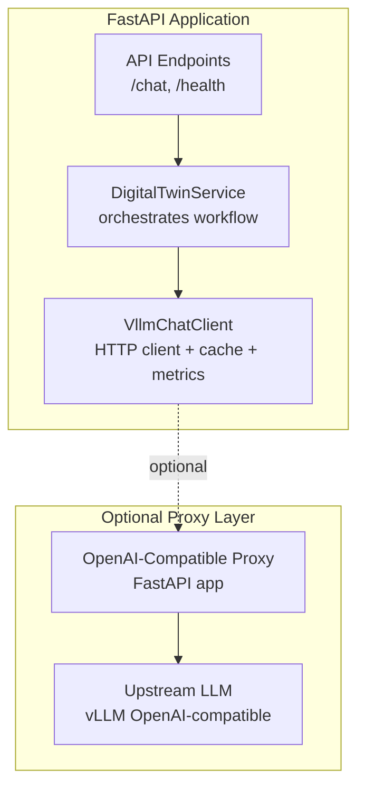
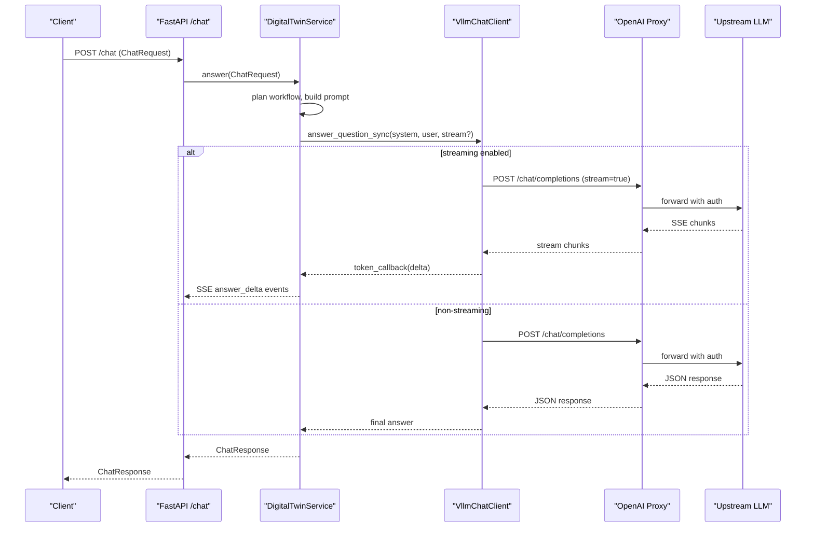
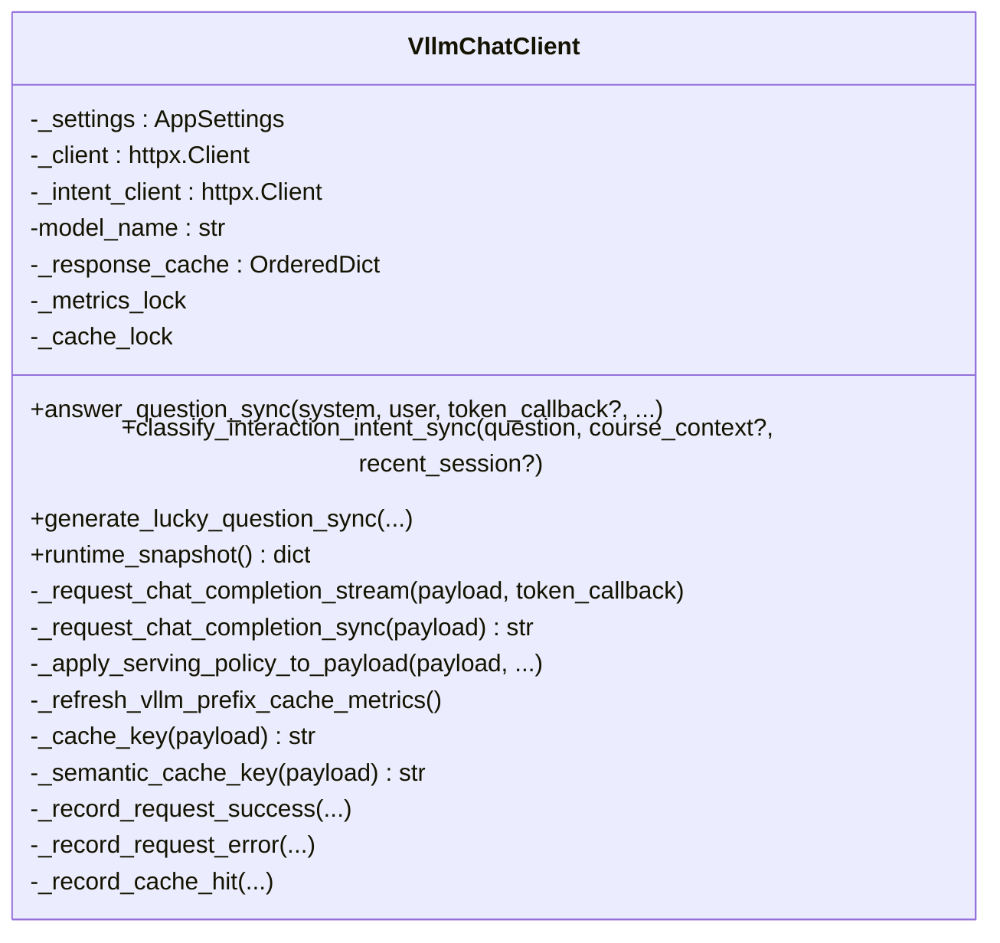
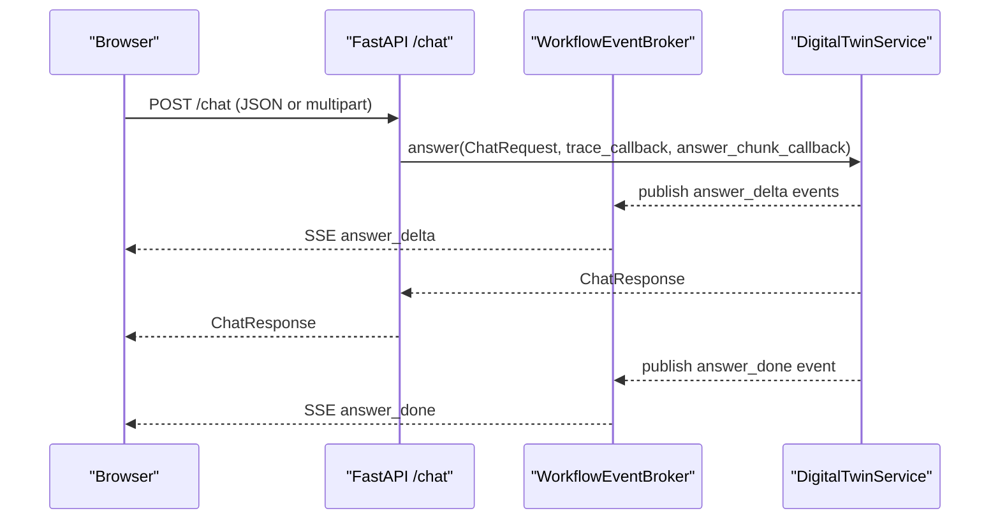
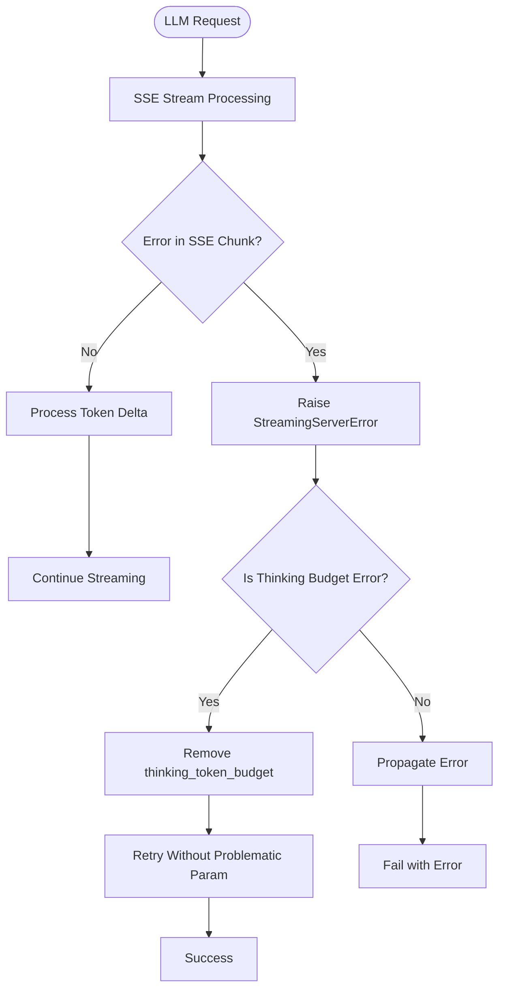
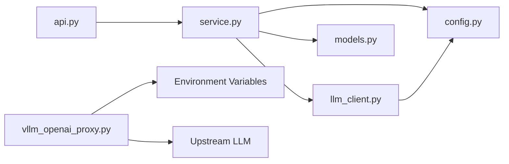
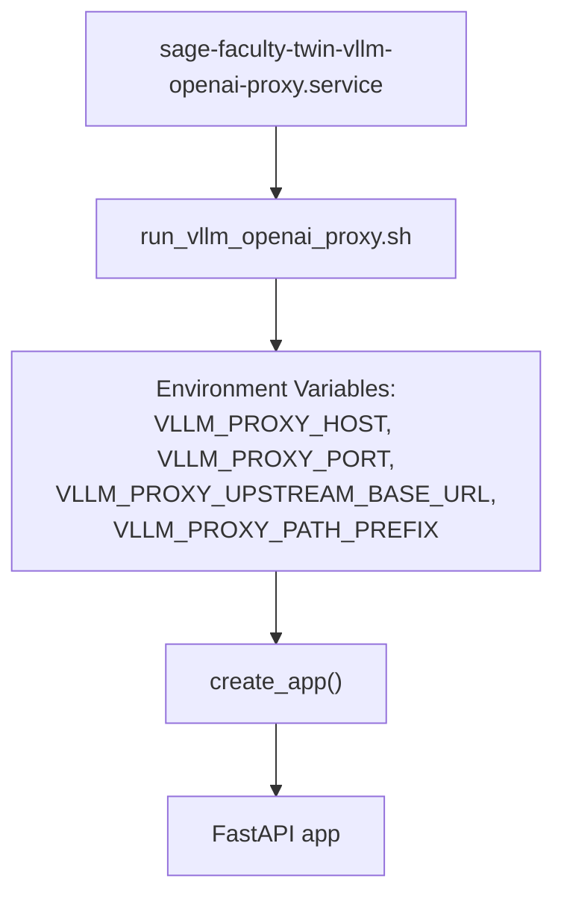

# LLM Client Architecture

<cite>
**Referenced Files in This Document**
- [llm_client.py](file://src/sage_faculty_twin/llm_client.py)
- [vllm_openai_proxy.py](file://src/sage_faculty_twin/vllm_openai_proxy.py)
- [api.py](file://src/sage_faculty_twin/api.py)
- [service.py](file://src/sage_faculty_twin/service.py)
- [config.py](file://src/sage_faculty_twin/config.py)
- [models.py](file://src/sage_faculty_twin/models.py)
- [sage-faculty-twin-vllm-openai-proxy.service](file://deploy/systemd/user/sage-faculty-twin-vllm-openai-proxy.service)
</cite>

## Update Summary
**Changes Made**
- Added comprehensive documentation for the new StreamingServerError exception class
- Enhanced error handling section with automatic retry mechanisms for vLLM SSE error payloads
- Updated troubleshooting guide with specific guidance for thinking token budget configuration issues
- Added graceful fallback mechanisms for missing reasoning configurations
- Expanded error handling documentation with practical examples

## Table of Contents
1. [Introduction](#introduction)
2. [Project Structure](#project-structure)
3. [Core Components](#core-components)
4. [Architecture Overview](#architecture-overview)
5. [Detailed Component Analysis](#detailed-component-analysis)
6. [Enhanced Error Handling and Recovery](#enhanced-error-handling-and-recovery)
7. [Dependency Analysis](#dependency-analysis)
8. [Performance Considerations](#performance-considerations)
9. [Troubleshooting Guide](#troubleshooting-guide)
10. [Conclusion](#conclusion)
11. [Appendices](#appendices)

## Introduction
This document explains the LLM client architecture and the OpenAI-compatible proxy system used by the Sage Faculty Twin platform. It covers the client abstraction layer, connection pooling, request routing, streaming and caching, authentication, and performance optimization strategies. It also provides guidance for integrating new LLM providers, implementing fallback mechanisms, and monitoring latency, while maintaining compatibility with existing workflows.

**Updated** Enhanced with comprehensive error handling documentation covering the new StreamingServerError exception class and automatic retry mechanisms for vLLM SSE error payloads.

## Project Structure
The system centers around a FastAPI application that orchestrates a deterministic workflow pipeline. The LLM client encapsulates HTTP communication with an OpenAI-compatible backend, including streaming, caching, and congestion-aware token shaping. An optional OpenAI-compatible proxy sits in front of the upstream LLM to enforce authentication and route requests.



**Diagram sources**
- [api.py:634-716](file://src/sage_faculty_twin/api.py#L634-L716)
- [service.py:5319-5485](file://src/sage_faculty_twin/service.py#L5319-L5485)
- [llm_client.py:84-155](file://src/sage_faculty_twin/llm_client.py#L84-L155)
- [vllm_openai_proxy.py:123-257](file://src/sage_faculty_twin/vllm_openai_proxy.py#L123-L257)

**Section sources**
- [api.py:90-116](file://src/sage_faculty_twin/api.py#L90-L116)
- [service.py:5319-5485](file://src/sage_faculty_twin/service.py#L5319-L5485)
- [llm_client.py:84-155](file://src/sage_faculty_twin/llm_client.py#L84-L155)
- [vllm_openai_proxy.py:123-257](file://src/sage_faculty_twin/vllm_openai_proxy.py#L123-L257)

## Core Components
- VllmChatClient: HTTP client wrapper for OpenAI-compatible LLM APIs with streaming, caching, metrics, and congestion-aware shaping.
- DigitalTwinService: Orchestrates the chat workflow, integrates retrieval, builds prompts, invokes the LLM, persists memory, and renders responses.
- OpenAI-Compatible Proxy: Optional FastAPI proxy enforcing authentication and forwarding requests to the upstream LLM.
- API Layer: Exposes endpoints for chat, health, and administrative operations.

Key capabilities:
- Streaming responses with incremental token delivery to SSE channels.
- Response caching with exact and semantic similarity-based hits.
- Congestion-aware token budget shaping using upstream metrics.
- Authentication via bearer tokens or x-api-key.
- Structured tracing and telemetry for latency, throughput, and cache hit rates.
- **Enhanced Error Handling**: Automatic detection and recovery from vLLM SSE error payloads with graceful fallback mechanisms.

**Section sources**
- [llm_client.py:84-155](file://src/sage_faculty_twin/llm_client.py#L84-L155)
- [service.py:5319-5485](file://src/sage_faculty_twin/service.py#L5319-L5485)
- [vllm_openai_proxy.py:123-257](file://src/sage_faculty_twin/vllm_openai_proxy.py#L123-L257)
- [api.py:634-716](file://src/sage_faculty_twin/api.py#L634-L716)

## Architecture Overview
The request lifecycle flows from FastAPI endpoints through the service layer to the LLM client, optionally via the OpenAI-compatible proxy. The service constructs prompts, triggers LLM completion (optionally streaming), and executes post-answer stages asynchronously.



**Diagram sources**
- [api.py:634-716](file://src/sage_faculty_twin/api.py#L634-L716)
- [service.py:5319-5485](file://src/sage_faculty_twin/service.py#L5319-L5485)
- [llm_client.py:661-758](file://src/sage_faculty_twin/llm_client.py#L661-L758)
- [vllm_openai_proxy.py:170-251](file://src/sage_faculty_twin/vllm_openai_proxy.py#L170-L251)

## Detailed Component Analysis

### VllmChatClient: Abstraction, Pooling, Routing, and Streaming
- HTTP Clients:
  - One primary client for main model queries.
  - A separate smaller/fast client for intent classification.
  - Both use connection pooling and timeouts configured via AppSettings.
- Streaming:
  - When a token callback is provided, the client enables OpenAI-compatible streaming and forwards each delta to the callback.
  - Streaming bypasses response cache to avoid replaying deltas.
- Caching:
  - Exact cache keyed by serialized payload.
  - Semantic cache keyed by normalized user/system content; similarity threshold determines reuse.
  - TTL and max entries configurable; eviction occurs on insert when capacity exceeded.
- Metrics and Telemetry:
  - Tracks request counts, successes, errors, latency, token usage, and cache hit rates.
  - Periodically refreshes upstream vLLM metrics (prefix cache hits, KV usage, throughput).
- Serving Policy:
  - Adapts max_tokens based on upstream congestion signals (waiting requests, KV cache usage, total requests).
  - Enforces global caps and minimums for interactive deadlines.
- Retry and Backoff:
  - Retries with exponential backoff on timeouts; records errors and last error message.



**Diagram sources**
- [llm_client.py:84-155](file://src/sage_faculty_twin/llm_client.py#L84-L155)
- [llm_client.py:661-836](file://src/sage_faculty_twin/llm_client.py#L661-L836)
- [llm_client.py:1204-1297](file://src/sage_faculty_twin/llm_client.py#L1204-L1297)
- [llm_client.py:1507-1599](file://src/sage_faculty_twin/llm_client.py#L1507-L1599)

**Section sources**
- [llm_client.py:84-155](file://src/sage_faculty_twin/llm_client.py#L84-L155)
- [llm_client.py:661-836](file://src/sage_faculty_twin/llm_client.py#L661-L836)
- [llm_client.py:1204-1297](file://src/sage_faculty_twin/llm_client.py#L1204-L1297)
- [llm_client.py:1507-1599](file://src/sage_faculty_twin/llm_client.py#L1507-L1599)

### OpenAI-Compatible Proxy: Authentication, Routing, and Streaming
- Configuration:
  - Loads settings from environment variables for listen host/port, upstream base URL, path prefix, and API keys.
  - Validates path prefix starts with "/" and upstream base URL is absolute.
- Authentication:
  - Extracts client key from Authorization header (Bearer) or X-API-Key.
  - Rejects requests with invalid API key.
- Routing:
  - Maps incoming request path under the configured prefix to upstream path.
  - Forwards headers excluding hop-by-hop and content-length; sets X-Forwarded-* headers.
- Streaming:
  - Detects stream intent from JSON payload and streams upstream raw bytes to maintain SSE compatibility.
  - Ensures client lifecycle management (open/close) per request when needed.


**Diagram sources**
- [vllm_openai_proxy.py:36-65](file://src/sage_faculty_twin/vllm_openai_proxy.py#L36-L65)
- [vllm_openai_proxy.py:99-114](file://src/sage_faculty_twin/vllm_openai_proxy.py#L99-L114)
- [vllm_openai_proxy.py:170-251](file://src/sage_faculty_twin/vllm_openai_proxy.py#L170-L251)

**Section sources**
- [vllm_openai_proxy.py:36-65](file://src/sage_faculty_twin/vllm_openai_proxy.py#L36-L65)
- [vllm_openai_proxy.py:170-251](file://src/sage_faculty_twin/vllm_openai_proxy.py#L170-L251)

### API Layer: Endpoints, Streaming, and Attachments
- Endpoints:
  - /chat: Accepts ChatRequest, parses multipart/form-data or JSON, enforces timeouts, and streams workflow events via SSE when request_id is provided.
  - /health: Reports service initialization status and model detection.
  - /lucky-question: Generates contextual questions using the intent model.
- Streaming:
  - When enabled, the service pushes answer deltas and final structured response over SSE.
  - Keepalive events prevent edge proxy timeouts during long decoding.
- Attachments:
  - Supports PDF, TXT, MD, CSV, JSON, PY, YAML, LOG with size and character limits.
  - Text extraction with truncation and validation.



**Diagram sources**
- [api.py:634-716](file://src/sage_faculty_twin/api.py#L634-L716)
- [api.py:170-256](file://src/sage_faculty_twin/api.py#L170-L256)
- [service.py:5319-5485](file://src/sage_faculty_twin/service.py#L5319-L5485)

**Section sources**
- [api.py:634-716](file://src/sage_faculty_twin/api.py#L634-L716)
- [api.py:170-256](file://src/sage_faculty_twin/api.py#L170-L256)

### DigitalTwinService: Workflow Orchestration and Post-Answer Execution
- Workflow Planning:
  - Builds a deterministic workflow plan based on request context and policy.
  - Optionally compares with a shadow planner for alternative plans.
- Retrieval and Prompt Building:
  - Retrieves knowledge and conversation memory, applies soft prompt cap with truncation policy.
- LLM Invocation:
  - Delegates to VllmChatClient for answer generation, optionally streaming.
- Post-Answer Fan-Out:
  - Executes memory persistence, artifact draft creation, profile consolidation, follow-up planning, and usefulness scoring in parallel after response rendering.


**Diagram sources**
- [service.py:5319-5485](file://src/sage_faculty_twin/service.py#L5319-L5485)
- [service.py:1354-1479](file://src/sage_faculty_twin/service.py#L1354-L1479)
- [service.py:5000-5080](file://src/sage_faculty_twin/service.py#L5000-L5080)

**Section sources**
- [service.py:5319-5485](file://src/sage_faculty_twin/service.py#L5319-L5485)
- [service.py:1354-1479](file://src/sage_faculty_twin/service.py#L1354-L1479)
- [service.py:5000-5080](file://src/sage_faculty_twin/service.py#L5000-L5080)

### Configuration and Data Models
- AppSettings:
  - Centralized configuration for model names, base URLs, timeouts, retries, cache sizes/ttl, policy thresholds, and feature flags.
- Models:
  - ChatRequest defines input schema with attachments and visitor profiles.
  - ChatResponse defines the final structured response shape.

**Section sources**
- [config.py:9-131](file://src/sage_faculty_twin/config.py#L9-L131)
- [models.py:16-31](file://src/sage_faculty_twin/models.py#L16-L31)
- [models.py:199-200](file://src/sage_faculty_twin/models.py#L199-L200)

## Enhanced Error Handling and Recovery

### StreamingServerError Exception Class
The VllmChatClient now includes a specialized exception class designed to handle critical scenarios where vLLM returns HTTP 200 status codes with embedded error payloads in SSE streams. This addresses a specific issue where thinking token budget configurations are missing, causing the upstream LLM to reject requests despite returning successful HTTP status codes.

#### Exception Characteristics
- **Class Definition**: `StreamingServerError(RuntimeError)`
- **Purpose**: Detect and propagate error events embedded within SSE streams
- **Error Detection**: Identifies error payloads in SSE chunks with HTTP 200 status codes
- **Automatic Recovery**: Enables graceful fallback mechanisms for configuration issues

#### Error Payload Processing
The client processes SSE chunks to detect embedded error payloads:

```python
# vLLM may return HTTP 200 with an error payload
# embedded in the SSE stream (e.g. when
# thinking_token_budget is rejected because
# --reasoning-config was not set at startup).
# Detect this early and surface it as an
# exception so the caller can retry without
# the offending parameter.
sse_error = chunk.get("error")
if isinstance(sse_error, dict):
    err_msg = str(sse_error.get("message", ""))
    err_code = int(sse_error.get("code") or 500)
elif isinstance(sse_error, str) and sse_error:
    err_msg = sse_error
    err_code = 500
else:
    err_msg = ""
    err_code = 0
if err_msg:
    raise StreamingServerError(err_msg, err_code)
```

#### Automatic Retry Mechanisms
The client implements sophisticated retry logic for different error scenarios:

1. **Thinking Token Budget Detection**: Automatically detects when vLLM rejects thinking token budgets due to missing reasoning configuration
2. **Graceful Fallback**: Removes problematic parameters and retries without them
3. **Configuration State Management**: Maintains `_supports_thinking_budget` state to prevent repeated failures

#### Error Recovery Flow


**Diagram sources**
- [llm_client.py:770-788](file://src/sage_faculty_twin/llm_client.py#L770-L788)
- [llm_client.py:667-684](file://src/sage_faculty_twin/llm_client.py#L667-L684)

**Section sources**
- [llm_client.py:53-67](file://src/sage_faculty_twin/llm_client.py#L53-L67)
- [llm_client.py:770-788](file://src/sage_faculty_twin/llm_client.py#L770-L788)
- [llm_client.py:667-684](file://src/sage_faculty_twin/llm_client.py#L667-L684)

## Dependency Analysis
The system exhibits layered dependencies:
- API depends on DigitalTwinService.
- DigitalTwinService depends on VllmChatClient and various stores/services.
- VllmChatClient depends on AppSettings and httpx.
- Optional proxy depends on environment configuration and upstream LLM.



**Diagram sources**
- [api.py:90-116](file://src/sage_faculty_twin/api.py#L90-L116)
- [service.py:5319-5485](file://src/sage_faculty_twin/service.py#L5319-L5485)
- [llm_client.py:84-155](file://src/sage_faculty_twin/llm_client.py#L84-L155)
- [config.py:9-131](file://src/sage_faculty_twin/config.py#L9-L131)
- [vllm_openai_proxy.py:36-65](file://src/sage_faculty_twin/vllm_openai_proxy.py#L36-L65)

**Section sources**
- [api.py:90-116](file://src/sage_faculty_twin/api.py#L90-L116)
- [service.py:5319-5485](file://src/sage_faculty_twin/service.py#L5319-L5485)
- [llm_client.py:84-155](file://src/sage_faculty_twin/llm_client.py#L84-L155)
- [config.py:9-131](file://src/sage_faculty_twin/config.py#L9-L131)
- [vllm_openai_proxy.py:36-65](file://src/sage_faculty_twin/vllm_openai_proxy.py#L36-L65)

## Performance Considerations
- Connection Pooling:
  - Separate clients with distinct limits: larger pool for main model, smaller for intent classification.
- Streaming:
  - Enables low-latency token delivery and SSE keepalive to mitigate proxy timeouts.
- Caching:
  - Exact and semantic caches reduce repeated work; TTL and capacity limits prevent memory growth.
- Token Budget Shaping:
  - Congestion-aware reduction of max_tokens prevents tail latency spikes and improves system stability.
- Soft Prompt Cap:
  - Progressive truncation prioritizes recent memory, knowledge excerpts, and attachments to bound prompt size.
- **Enhanced Error Recovery**:
  - Automatic detection and recovery from SSE error payloads reduces retry overhead and improves system reliability.

## Troubleshooting Guide
Common issues and remedies:
- Authentication failures:
  - Verify DIGITAL_TWIN_API_KEY and upstream API key configuration for the proxy.
- Timeouts:
  - Increase llm_timeout_seconds and adjust llm_retry_attempts/backoff.
- Streaming stalls:
  - Enable DIGITAL_TWIN_CHAT_SSE_KEEPALIVE_SECONDS and ensure STREAM_CHAT_ANSWER is enabled.
- Cache not reducing latency:
  - Adjust cache TTL and max entries; confirm semantic similarity threshold is appropriate.
- Proxy routing errors:
  - Ensure VLLM_PROXY_PATH_PREFIX starts with "/" and upstream base URL is absolute.
- **Thinking Token Budget Errors**:
  - **Issue**: vLLM returns HTTP 200 with embedded error payload when thinking_token_budget is rejected
  - **Cause**: Missing `--reasoning-config` at vLLM startup
  - **Solution**: Start vLLM with `--reasoning-config` or remove `thinking_token_budget` parameter
  - **Detection**: StreamingServerError exception with error message containing "reasoning_config" or "thinking_token_budget"
- **Automatic Recovery**:
  - The client automatically removes problematic parameters and retries
  - Monitor `_supports_thinking_budget` state to verify configuration detection

**Updated** Added comprehensive troubleshooting guidance for the new StreamingServerError exception class and thinking token budget configuration issues.

**Section sources**
- [vllm_openai_proxy.py:36-65](file://src/sage_faculty_twin/vllm_openai_proxy.py#L36-L65)
- [vllm_openai_proxy.py:170-251](file://src/sage_faculty_twin/vllm_openai_proxy.py#L170-L251)
- [config.py:24-26](file://src/sage_faculty_twin/config.py#L24-L26)
- [api.py:127-147](file://src/sage_faculty_twin/api.py#L127-L147)
- [llm_client.py:53-67](file://src/sage_faculty_twin/llm_client.py#L53-L67)
- [llm_client.py:695-714](file://src/sage_faculty_twin/llm_client.py#L695-L714)

## Conclusion
The Sage Faculty Twin platform combines a robust LLM client with a deterministic workflow and optional OpenAI-compatible proxy to deliver responsive, scalable, and observable chat experiences. The client's streaming, caching, and congestion-aware shaping ensure consistent performance, while the proxy centralizes authentication and routing. 

**Updated** The recent enhancements include comprehensive error handling with the new StreamingServerError exception class, automatic detection and recovery from vLLM SSE error payloads, and graceful fallback mechanisms for configuration issues. These improvements significantly enhance system reliability and reduce operational overhead when dealing with upstream LLM configuration problems.

Extending support for new LLM providers involves adhering to the OpenAI-compatible interface, configuring the proxy, and wiring the client accordingly. The enhanced error handling framework ensures that new providers benefit from the same robust error recovery mechanisms.

## Appendices

### Systemd Service for the OpenAI-Compatible Proxy
The proxy can be deployed as a systemd service with environment-driven configuration.



**Diagram sources**
- [sage-faculty-twin-vllm-openai-proxy.service:1-20](file://deploy/systemd/user/sage-faculty-twin-vllm-openai-proxy.service#L1-L20)
- [vllm_openai_proxy.py:123-135](file://src/sage_faculty_twin/vllm_openai_proxy.py#L123-L135)

**Section sources**
- [sage-faculty-twin-vllm-openai-proxy.service:1-20](file://deploy/systemd/user/sage-faculty-twin-vllm-openai-proxy.service#L1-L20)
- [vllm_openai_proxy.py:123-135](file://src/sage_faculty_twin/vllm_openai_proxy.py#L123-L135)

### Error Handling Configuration Parameters
The system includes several configuration parameters that influence error handling behavior:

- **llm_retry_attempts**: Number of automatic retry attempts for failed requests
- **llm_retry_backoff_seconds**: Base delay for exponential backoff between retries
- **thinking_token_budget**: Maximum tokens allocated for reasoning processes
- **auto_disable_thinking_intents**: Comma-separated list of intent categories to disable thinking

These parameters control the balance between error resilience and system performance, allowing administrators to tune the system for their specific deployment requirements.

**Section sources**
- [config.py:25-26](file://src/sage_faculty_twin/config.py#L25-L26)
- [config.py:91-96](file://src/sage_faculty_twin/config.py#L91-L96)