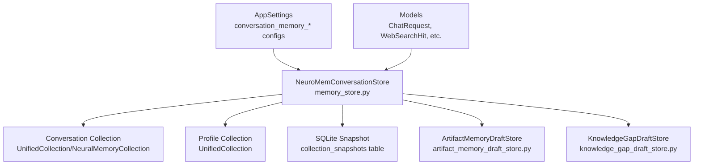
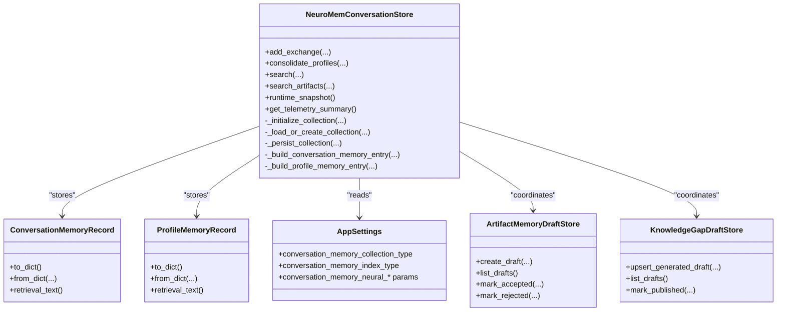
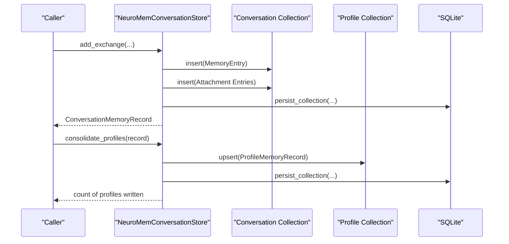
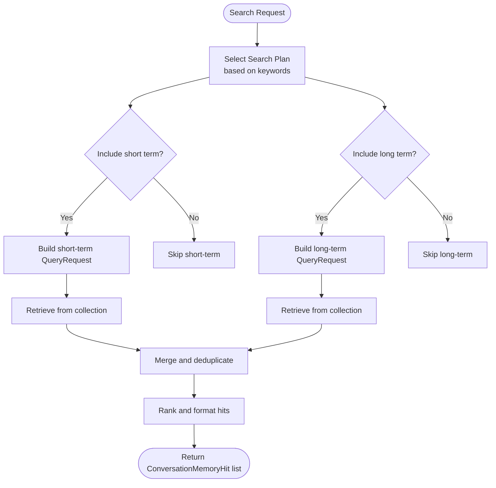
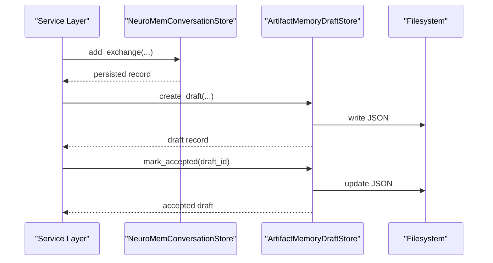
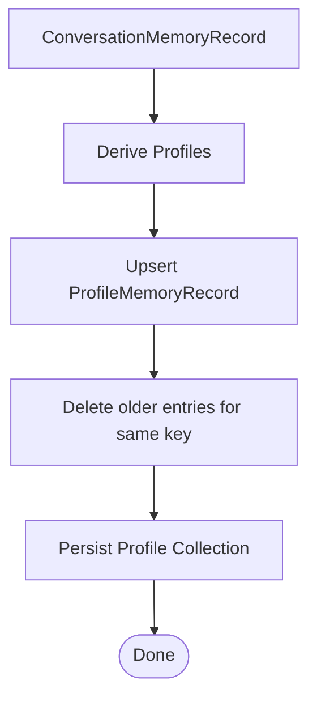
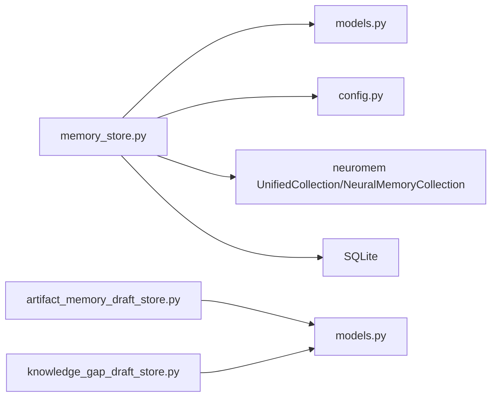

# Memory Collection Extensions

<cite>
**Referenced Files in This Document**
- [memory_store.py](file://src/sage_faculty_twin/memory_store.py)
- [artifact_memory_draft_store.py](file://src/sage_faculty_twin/artifact_memory_draft_store.py)
- [knowledge_gap_draft_store.py](file://src/sage_faculty_twin/knowledge_gap_draft_store.py)
- [models.py](file://src/sage_faculty_twin/models.py)
- [config.py](file://src/sage_faculty_twin/config.py)
- [test_memory_store.py](file://tests/test_memory_store.py)
- [service.py](file://src/sage_faculty_twin/service.py)
</cite>

## Table of Contents
1. [Introduction](#introduction)
2. [Project Structure](#project-structure)
3. [Core Components](#core-components)
4. [Architecture Overview](#architecture-overview)
5. [Detailed Component Analysis](#detailed-component-analysis)
6. [Dependency Analysis](#dependency-analysis)
7. [Performance Considerations](#performance-considerations)
8. [Troubleshooting Guide](#troubleshooting-guide)
9. [Conclusion](#conclusion)
10. [Appendices](#appendices)

## Introduction
This document explains how to extend memory management with custom collection types in the system. It covers the memory store interface, collection registration and selection mechanisms, persistence strategies, the artifact memory system, draft management workflows, and memory consolidation processes. It also provides practical guidance for building specialized memory collections for different data types, implementing custom persistence backends, and adding memory compression techniques. Finally, it outlines lifecycle management, cleanup policies, and performance optimization for large-scale memory operations.

## Project Structure
The memory subsystem centers around a layered conversation memory store backed by the neuromem library, with dedicated stores for drafts and auxiliary data models. Key locations:
- Memory store and collection orchestration: [memory_store.py](file://src/sage_faculty_twin/memory_store.py)
- Artifact memory draft store: [artifact_memory_draft_store.py](file://src/sage_faculty_twin/artifact_memory_draft_store.py)
- Knowledge gap draft store: [knowledge_gap_draft_store.py](file://src/sage_faculty_twin/knowledge_gap_draft_store.py)
- Data models and response types: [models.py](file://src/sage_faculty_twin/models.py)
- Application configuration and environment variables: [config.py](file://src/sage_faculty_twin/config.py)
- Tests validating persistence, migration, and collection behavior: [test_memory_store.py](file://tests/test_memory_store.py)
- Service integration for writing memory after chat completion: [service.py](file://src/sage_faculty_twin/service.py)

**Diagram sources**
- [memory_store.py:223-257](file://src/sage_faculty_twin/memory_store.py#L223-L257)
- [artifact_memory_draft_store.py:97-103](file://src/sage_faculty_twin/artifact_memory_draft_store.py#L97-L103)
- [knowledge_gap_draft_store.py:100-106](file://src/sage_faculty_twin/knowledge_gap_draft_store.py#L100-L106)
- [models.py:16-31](file://src/sage_faculty_twin/models.py#L16-L31)
- [config.py:75-119](file://src/sage_faculty_twin/config.py#L75-L119)

**Section sources**
- [memory_store.py:223-257](file://src/sage_faculty_twin/memory_store.py#L223-L257)
- [artifact_memory_draft_store.py:97-103](file://src/sage_faculty_twin/artifact_memory_draft_store.py#L97-L103)
- [knowledge_gap_draft_store.py:100-106](file://src/sage_faculty_twin/knowledge_gap_draft_store.py#L100-L106)
- [models.py:16-31](file://src/sage_faculty_twin/models.py#L16-L31)
- [config.py:75-119](file://src/sage_faculty_twin/config.py#L75-L119)

## Core Components
- Memory store interface and orchestration:
  - Conversation memory record and profile record data models
  - Search plans, query builders, and retrieval ranking
  - Collection initialization, loading, and persistence
  - Telemetry and runtime snapshots
- Draft stores:
  - Artifact memory drafts for curated material inclusion
  - Knowledge gap drafts for knowledge coverage improvements
- Configuration:
  - Environment-driven selection of collection type and index type
  - Dimensionality and training hyperparameters for neural collections

Key responsibilities:
- Add conversation exchanges and derive consolidated profiles
- Persist collections to SQLite snapshots
- Support artifact-focused retrieval via attachment excerpts
- Manage draft lifecycles for artifact and knowledge gap workflows

**Section sources**
- [memory_store.py:28-121](file://src/sage_faculty_twin/memory_store.py#L28-L121)
- [memory_store.py:223-257](file://src/sage_faculty_twin/memory_store.py#L223-L257)
- [memory_store.py:446-582](file://src/sage_faculty_twin/memory_store.py#L446-L582)
- [memory_store.py:947-977](file://src/sage_faculty_twin/memory_store.py#L947-L977)
- [memory_store.py:1146-1180](file://src/sage_faculty_twin/memory_store.py#L1146-L1180)
- [artifact_memory_draft_store.py:97-179](file://src/sage_faculty_twin/artifact_memory_draft_store.py#L97-L179)
- [knowledge_gap_draft_store.py:100-185](file://src/sage_faculty_twin/knowledge_gap_draft_store.py#L100-L185)
- [config.py:101-119](file://src/sage_faculty_twin/config.py#L101-L119)

## Architecture Overview
The memory system composes two primary collections:
- Conversation collection: short-term, high-recency recall
- Profile collection: long-term stable knowledge per student

Collections are initialized based on configuration, can be unified or neural continual, and indexed with configurable backends. Persistence is handled via SQLite snapshots for durability and fast restarts.

**Diagram sources**
- [memory_store.py:223-257](file://src/sage_faculty_twin/memory_store.py#L223-L257)
- [memory_store.py:28-121](file://src/sage_faculty_twin/memory_store.py#L28-L121)
- [memory_store.py:160-179](file://src/sage_faculty_twin/memory_store.py#L160-L179)
- [artifact_memory_draft_store.py:97-179](file://src/sage_faculty_twin/artifact_memory_draft_store.py#L97-L179)
- [knowledge_gap_draft_store.py:100-185](file://src/sage_faculty_twin/knowledge_gap_draft_store.py#L100-L185)
- [config.py:101-119](file://src/sage_faculty_twin/config.py#L101-L119)

## Detailed Component Analysis

### Memory Store Interface and Collection Management
- Initialization and selection:
  - Auto-selection of collection type and index type based on environment and availability
  - Neural continual vs unified collection support
- Loading and persistence:
  - SQLite-backed snapshot table for raw collection data, config, and index metadata
  - Migration from legacy disk layout to SQLite
- Runtime state:
  - Rebuilding in-memory records and timelines from persisted collections
  - Canonicalization of profile entries to remove duplicates

**Diagram sources**
- [memory_store.py:380-424](file://src/sage_faculty_twin/memory_store.py#L380-L424)
- [memory_store.py:426-444](file://src/sage_faculty_twin/memory_store.py#L426-L444)
- [memory_store.py:1146-1180](file://src/sage_faculty_twin/memory_store.py#L1146-L1180)

**Section sources**
- [memory_store.py:258-335](file://src/sage_faculty_twin/memory_store.py#L258-L335)
- [memory_store.py:947-977](file://src/sage_faculty_twin/memory_store.py#L947-L977)
- [memory_store.py:979-994](file://src/sage_faculty_twin/memory_store.py#L979-L994)
- [memory_store.py:1011-1087](file://src/sage_faculty_twin/memory_store.py#L1011-L1087)
- [memory_store.py:1146-1180](file://src/sage_faculty_twin/memory_store.py#L1146-L1180)
- [memory_store.py:1181-1256](file://src/sage_faculty_twin/memory_store.py#L1181-L1256)

### Search and Retrieval Workflows
- Short-term recall:
  - Recent conversation timeline plus semantic retrieval from the conversation collection
- Long-term recall:
  - Stable profile retrieval weighted by category preferences derived from the query
- Artifact recall:
  - Hybrid ranking combining lexical overlap with attachment excerpts and vector retrieval

**Diagram sources**
- [memory_store.py:757-776](file://src/sage_faculty_twin/memory_store.py#L757-L776)
- [memory_store.py:778-841](file://src/sage_faculty_twin/memory_store.py#L778-L841)
- [memory_store.py:843-917](file://src/sage_faculty_twin/memory_store.py#L843-L917)
- [memory_store.py:1598-1626](file://src/sage_faculty_twin/memory_store.py#L1598-L1626)
- [memory_store.py:1650-1674](file://src/sage_faculty_twin/memory_store.py#L1650-L1674)

**Section sources**
- [memory_store.py:446-489](file://src/sage_faculty_twin/memory_store.py#L446-L489)
- [memory_store.py:757-776](file://src/sage_faculty_twin/memory_store.py#L757-L776)
- [memory_store.py:778-841](file://src/sage_faculty_twin/memory_store.py#L778-L841)
- [memory_store.py:843-917](file://src/sage_faculty_twin/memory_store.py#L843-L917)
- [memory_store.py:1598-1626](file://src/sage_faculty_twin/memory_store.py#L1598-L1626)
- [memory_store.py:1650-1674](file://src/sage_faculty_twin/memory_store.py#L1650-L1674)

### Artifact Memory System and Draft Management
- Artifact memory drafts capture curated materials associated with a conversation exchange and propose inclusion into memory for future retrieval.
- Draft lifecycle:
  - Creation with metadata and initial status
  - Listing and filtering
  - Acceptance or rejection transitions
  - Persistence to JSON files under a drafts directory

**Diagram sources**
- [service.py:1519-1532](file://src/sage_faculty_twin/service.py#L1519-L1532)
- [artifact_memory_draft_store.py:104-141](file://src/sage_faculty_twin/artifact_memory_draft_store.py#L104-L141)
- [artifact_memory_draft_store.py:149-169](file://src/sage_faculty_twin/artifact_memory_draft_store.py#L149-L169)
- [artifact_memory_draft_store.py:171-184](file://src/sage_faculty_twin/artifact_memory_draft_store.py#L171-L184)

**Section sources**
- [artifact_memory_draft_store.py:97-179](file://src/sage_faculty_twin/artifact_memory_draft_store.py#L97-L179)
- [artifact_memory_draft_store.py:180-184](file://src/sage_faculty_twin/artifact_memory_draft_store.py#L180-L184)
- [service.py:1519-1532](file://src/sage_faculty_twin/service.py#L1519-L1532)

### Memory Consolidation Processes
- Derivation of profile records from conversation records
- Upsert semantics preserving latest updates and canonicalizing duplicates
- Persistence of profile collection snapshots

**Diagram sources**
- [memory_store.py:1422-1440](file://src/sage_faculty_twin/memory_store.py#L1422-L1440)
- [memory_store.py:1442-1446](file://src/sage_faculty_twin/memory_store.py#L1442-L1446)
- [memory_store.py:1566-1596](file://src/sage_faculty_twin/memory_store.py#L1566-L1596)
- [memory_store.py:1146-1180](file://src/sage_faculty_twin/memory_store.py#L1146-L1180)

**Section sources**
- [memory_store.py:1422-1440](file://src/sage_faculty_twin/memory_store.py#L1422-L1440)
- [memory_store.py:1442-1446](file://src/sage_faculty_twin/memory_store.py#L1442-L1446)
- [memory_store.py:1566-1596](file://src/sage_faculty_twin/memory_store.py#L1566-L1596)
- [memory_store.py:1146-1180](file://src/sage_faculty_twin/memory_store.py#L1146-L1180)

### Creating Specialized Memory Collections
- Choose collection type:
  - Unified: general-purpose collection with pluggable indexes
  - Neural continual: trainable continual memory for dynamic adaptation
- Configure index type:
  - Auto-selection prefers vector-capable indexes when available
  - Fallback to segment/fifo when vector backends are absent
- Customize neural parameters:
  - Feature dimension, learning rate, weight decay, replay buffer sizes, blending factors, and recency/query overlap biases

Implementation hooks:
- Collection initialization and index addition
- Config normalization and fallback logic
- Type detection and persistence metadata

**Section sources**
- [memory_store.py:258-335](file://src/sage_faculty_twin/memory_store.py#L258-L335)
- [memory_store.py:947-977](file://src/sage_faculty_twin/memory_store.py#L947-L977)
- [memory_store.py:1011-1087](file://src/sage_faculty_twin/memory_store.py#L1011-L1087)
- [memory_store.py:1089-1144](file://src/sage_faculty_twin/memory_store.py#L1089-L1144)
- [config.py:101-119](file://src/sage_faculty_twin/config.py#L101-L119)

### Implementing Custom Persistence Backends
- Current persistence:
  - SQLite snapshot table storing raw collection data, config, and index metadata
  - One-time migration from legacy disk layout
- Extending persistence:
  - Implement a new storage adapter conforming to the collection’s storage interface
  - Provide load/persist routines mirroring the existing SQLite logic
  - Register the adapter in the collection initialization routine

Operational considerations:
- Atomic writes and conflict handling during updates
- Efficient bulk inserts and index rebuilds
- Metadata consistency across indexes

**Section sources**
- [memory_store.py:996-1010](file://src/sage_faculty_twin/memory_store.py#L996-L1010)
- [memory_store.py:1011-1087](file://src/sage_faculty_twin/memory_store.py#L1011-L1087)
- [memory_store.py:1146-1180](file://src/sage_faculty_twin/memory_store.py#L1146-L1180)
- [test_memory_store.py:69-154](file://tests/test_memory_store.py#L69-L154)

### Adding Memory Compression Techniques
- Text clipping and summarization:
  - Attachment excerpts are clipped to a bounded length
  - Profile summaries and evidence are formatted for compact representation
- Tokenization and overlap scoring:
  - Query and attachment tokens are computed to rank artifact candidates
- Index-level compression:
  - Vector backends can leverage quantization or reduced dimensionality
  - BM25 and other lexical indexes compress term dictionaries and posting lists

Recommendations:
- Apply compression consistently in both ingestion and retrieval paths
- Preserve sufficient discriminative signals for downstream tasks
- Monitor retrieval quality and adjust compression aggressiveness

**Section sources**
- [memory_store.py:1829-1833](file://src/sage_faculty_twin/memory_store.py#L1829-L1833)
- [memory_store.py:1770-1791](file://src/sage_faculty_twin/memory_store.py#L1770-L1791)
- [memory_store.py:1793-1827](file://src/sage_faculty_twin/memory_store.py#L1793-L1827)
- [config.py:115-119](file://src/sage_faculty_twin/config.py#L115-L119)

### Memory Lifecycle Management and Cleanup Policies
- Timeline maintenance:
  - Prepending and appending conversation timelines for recency ordering
- Duplicate canonicalization:
  - Removing older profile entries for the same key during upsert
- Legacy migration:
  - Detecting and migrating legacy JSON files, then removing legacy directories
- Telemetry and limits:
  - Bounded telemetry event buffers with automatic trimming

**Section sources**
- [memory_store.py:1447-1457](file://src/sage_faculty_twin/memory_store.py#L1447-L1457)
- [memory_store.py:1566-1596](file://src/sage_faculty_twin/memory_store.py#L1566-L1596)
- [memory_store.py:1217-1256](file://src/sage_faculty_twin/memory_store.py#L1217-L1256)
- [memory_store.py:1286-1319](file://src/sage_faculty_twin/memory_store.py#L1286-L1319)

## Dependency Analysis
- External dependencies:
  - neuromem UnifiedCollection and NeuralMemoryCollection
  - Optional vector backends (e.g., sage_anns) for ANN indexes
- Internal dependencies:
  - Models define request/response shapes used across the system
  - Configuration drives collection/index selection and neural parameters
  - Tests validate persistence, migration, and collection behavior

**Diagram sources**
- [memory_store.py:15-25](file://src/sage_faculty_twin/memory_store.py#L15-L25)
- [memory_store.py:223-257](file://src/sage_faculty_twin/memory_store.py#L223-L257)
- [artifact_memory_draft_store.py:8-9](file://src/sage_faculty_twin/artifact_memory_draft_store.py#L8-L9)
- [knowledge_gap_draft_store.py:8-9](file://src/sage_faculty_twin/knowledge_gap_draft_store.py#L8-L9)
- [models.py:16-31](file://src/sage_faculty_twin/models.py#L16-L31)
- [config.py:101-119](file://src/sage_faculty_twin/config.py#L101-L119)

**Section sources**
- [memory_store.py:15-25](file://src/sage_faculty_twin/memory_store.py#L15-L25)
- [artifact_memory_draft_store.py:8-9](file://src/sage_faculty_twin/artifact_memory_draft_store.py#L8-L9)
- [knowledge_gap_draft_store.py:8-9](file://src/sage_faculty_twin/knowledge_gap_draft_store.py#L8-L9)
- [models.py:16-31](file://src/sage_faculty_twin/models.py#L16-L31)
- [config.py:101-119](file://src/sage_faculty_twin/config.py#L101-L119)

## Performance Considerations
- Index selection:
  - Prefer vector-capable indexes for large-scale retrieval; fall back to BM25 when vector backends are unavailable
- Neural continual tuning:
  - Adjust replay buffer size and batch size for throughput/accuracy trade-offs
  - Calibrate blending and bias parameters for query overlap and recency
- I/O optimization:
  - Batch persistence operations to reduce SQLite overhead
  - Use efficient JSON serialization/deserialization
- Retrieval cost:
  - Tune top_k and filter scopes to balance latency and recall
  - Limit artifact overlap scoring to relevant subsets

[No sources needed since this section provides general guidance]

## Troubleshooting Guide
- Missing optional vector backend:
  - Using explicit ANN index without the required dependency raises a runtime error; switch to “auto” or install the dependency
- Legacy layout migration:
  - After migration, legacy directories are removed; ensure no residual data remains
- Duplicate profile entries:
  - On startup, duplicates are canonicalized; verify final counts and content after reload
- Neural collection type persistence:
  - Collection type is preserved across restarts; confirm runtime snapshot reflects expected type

**Section sources**
- [test_memory_store.py:324-345](file://tests/test_memory_store.py#L324-L345)
- [memory_store.py:1217-1256](file://src/sage_faculty_twin/memory_store.py#L1217-L1256)
- [memory_store.py:1566-1596](file://src/sage_faculty_twin/memory_store.py#L1566-L1596)
- [test_memory_store.py:291-322](file://tests/test_memory_store.py#L291-L322)

## Conclusion
The memory extension framework supports flexible collection types, robust persistence, and integrated draft workflows. By leveraging configuration-driven selection, standardized collection interfaces, and modular persistence adapters, developers can tailor memory behavior for diverse data types and scale efficiently. The artifact and knowledge gap draft systems enable controlled curation and governance of memory content, while telemetry and canonicalization ensure reliable operation at scale.

## Appendices

### Appendix A: Configuration Reference
- Collection type and index type selection
- Neural continual hyperparameters
- Directory paths for drafts and memory storage

**Section sources**
- [config.py:101-119](file://src/sage_faculty_twin/config.py#L101-L119)
- [config.py:75-80](file://src/sage_faculty_twin/config.py#L75-L80)

### Appendix B: Data Model Reference
- Conversation and profile records
- Draft record models and response types
- Request/response shapes for chat and related services

**Section sources**
- [models.py:16-31](file://src/sage_faculty_twin/models.py#L16-L31)
- [models.py:414-429](file://src/sage_faculty_twin/models.py#L414-L429)
- [models.py:709-726](file://src/sage_faculty_twin/models.py#L709-L726)
- [artifact_memory_draft_store.py:12-95](file://src/sage_faculty_twin/artifact_memory_draft_store.py#L12-L95)
- [knowledge_gap_draft_store.py:12-98](file://src/sage_faculty_twin/knowledge_gap_draft_store.py#L12-L98)