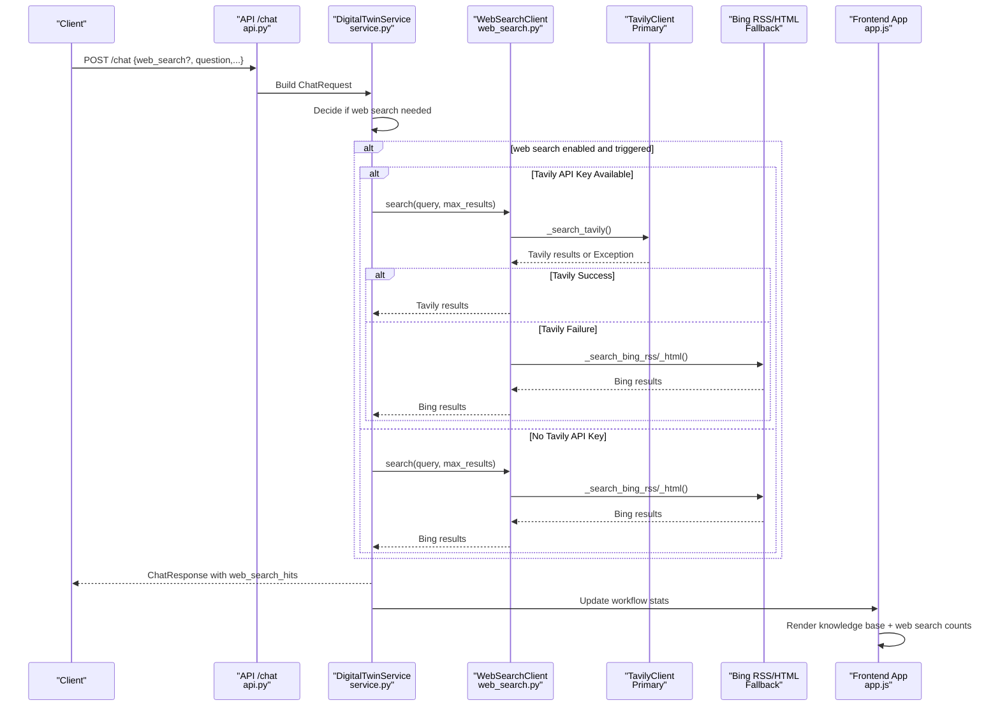
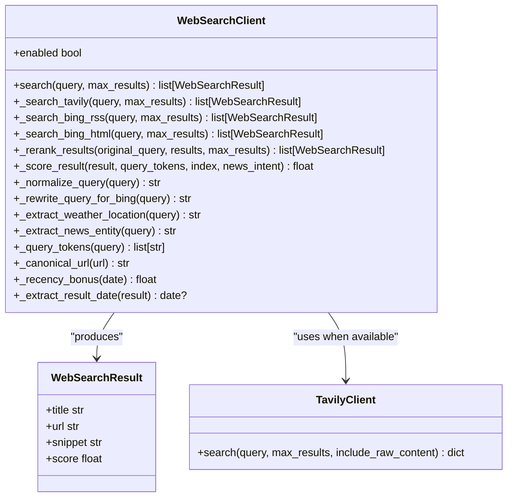
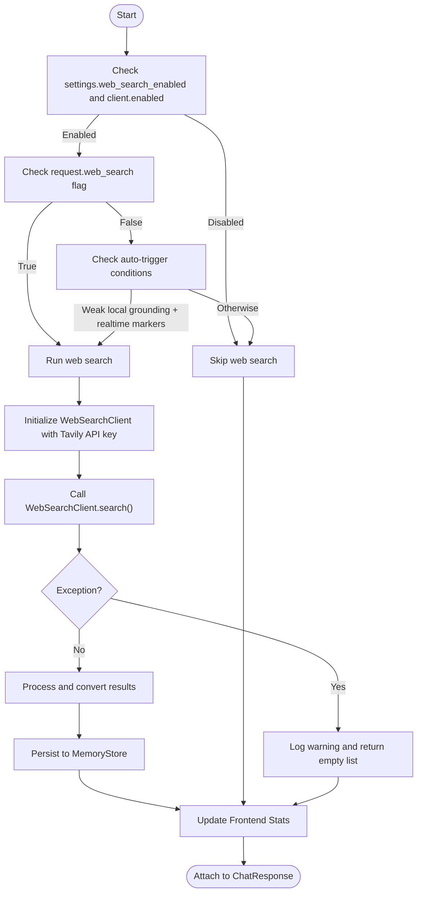
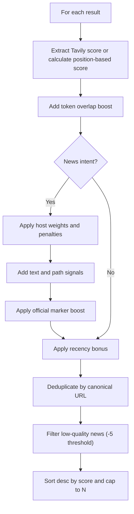
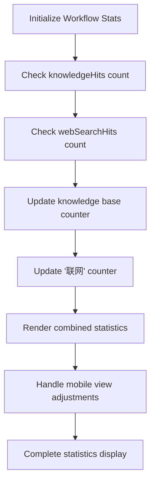
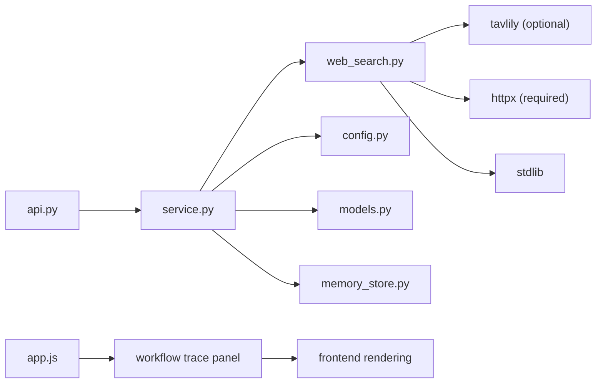

# Web Search Integration

<cite>
**Referenced Files in This Document**
- [web_search.py](file://src/sage_faculty_twin/web_search.py)
- [service.py](file://src/sage_faculty_twin/service.py)
- [models.py](file://src/sage_faculty_twin/models.py)
- [config.py](file://src/sage_faculty_twin/config.py)
- [api.py](file://src/sage_faculty_twin/api.py)
- [app.js](file://src/sage_faculty_twin/web/app.js)
- [memory_store.py](file://src/sage_faculty_twin/memory_store.py)
</cite>

## Update Summary
**Changes Made**
- Updated to reflect the migration from Bing RSS/HTML to Tavily as the primary search engine
- Added comprehensive Tavily API key configuration and fallback mechanism documentation
- Enhanced WebSearchClient architecture documentation with Tavily-specific implementation
- Updated query normalization patterns and fallback logic documentation
- Expanded error handling and retry mechanisms documentation
- Added new section covering Tavily-specific search parameters and result processing

## Table of Contents
1. [Introduction](#introduction)
2. [Project Structure](#project-structure)
3. [Core Components](#core-components)
4. [Architecture Overview](#architecture-overview)
5. [Detailed Component Analysis](#detailed-component-analysis)
6. [Frontend Statistics Display](#frontend-statistics-display)
7. [Dependency Analysis](#dependency-analysis)
8. [Performance Considerations](#performance-considerations)
9. [Troubleshooting Guide](#troubleshooting-guide)
10. [Conclusion](#conclusion)
11. [Appendices](#appendices)

## Introduction
This document explains the web search integration system used by the digital twin assistant. The system has been enhanced with Tavily as the primary search engine, replacing the previous Bing RSS/HTML dual-source approach. The system now features comprehensive query normalization patterns, intelligent fallback mechanisms from Tavily to Bing, and robust error handling. It maintains the dual-search architecture with Tavily as the primary provider and Bing as the fallback, while preserving all existing functionality including query normalization, result ranking, deduplication, recency scoring, and specialized handling for weather and news queries. The system includes enhanced frontend display capabilities showing web search statistics alongside traditional knowledge base hits.

## Project Structure
The web search capability is encapsulated in a dedicated module with Tavily as the primary search provider and Bing as the fallback. The system integrates seamlessly with the chat workflow via the service layer, supporting runtime configuration through environment variables and providing comprehensive statistics display in the frontend application.

```mermaid
graph TB
subgraph "Enhanced Web Search Module"
WS["WebSearchClient<br/>web_search.py"]
TAVILY["TavilyClient<br/>Primary Provider"]
BING["Bing RSS/HTML<br/>Fallback Provider"]
end
subgraph "Service Layer"
SVC["DigitalTwinService<br/>service.py"]
CTX["ChatWorkflowContext<br/>service.py"]
end
subgraph "Models & Config"
M["WebSearchHit<br/>models.py"]
CFG["AppSettings<br/>config.py"]
MEM["MemoryStore<br/>memory_store.py"]
END
subgraph "API"
API["/chat endpoint<br/>api.py"]
end
subgraph "Frontend"
APP["app.js<br/>workflow trace panel"]
STATS["Statistics Display<br/>web search counts"]
END
API --> SVC
SVC --> WS
SVC --> CTX
CTX --> M
CFG --> SVC
CFG --> WS
M --> MEM
APP --> STATS
WS --> TAVILY
WS --> BING
```

**Diagram sources**
- [web_search.py:95-142](file://src/sage_faculty_twin/web_search.py#L95-L142)
- [service.py:629-633](file://src/sage_faculty_twin/service.py#L629-L633)
- [models.py:185-189](file://src/sage_faculty_twin/models.py#L185-L189)
- [config.py:75](file://src/sage_faculty_twin/config.py#L75)
- [api.py:404-405](file://src/sage_faculty_twin/api.py#L404-L405)
- [memory_store.py:68](file://src/sage_faculty_twin/memory_store.py#L68)
- [app.js:6970-6989](file://src/sage_faculty_twin/web/app.js#L6970-L6989)

**Section sources**
- [web_search.py:95-142](file://src/sage_faculty_twin/web_search.py#L95-L142)
- [service.py:629-633](file://src/sage_faculty_twin/service.py#L629-L633)
- [models.py:185-189](file://src/sage_faculty_twin/models.py#L185-L189)
- [config.py:75](file://src/sage_faculty_twin/config.py#L75)
- [api.py:404-405](file://src/sage_faculty_twin/api.py#L404-L405)
- [memory_store.py:68](file://src/sage_faculty_twin/memory_store.py#L68)
- [app.js:6970-6989](file://src/sage_faculty_twin/web/app.js#L6970-L6989)

## Core Components
- **WebSearchClient**: Enhanced with Tavily as primary search provider, featuring intelligent fallback to Bing RSS/HTML when Tavily is unavailable. Includes comprehensive query normalization, result processing, and ranking algorithms.
- **DigitalTwinService**: Orchestrates web search execution with Tavily API key configuration and fallback logic, managing search triggers and result exposure.
- **WebSearchHit**: Pydantic model representing search results with title, URL, snippet, and score attributes.
- **AppSettings**: Provides Tavily API key configuration and web search runtime parameters (enable/disable, timeouts, result limits, auto-trigger).
- **API**: Supports web_search flag for manual triggering and integrates with the enhanced search architecture.
- **MemoryStore**: Persists web_search_hits for audit and analysis purposes.
- **Frontend Application**: Renders comprehensive statistics showing both knowledge base and web search hit counts in real-time.

Key capabilities:
- **Primary Provider**: Tavily as the main search engine with purpose-built AI search capabilities
- **Fallback Mechanism**: Automatic fallback to Bing RSS/HTML when Tavily fails or is unavailable
- **Enhanced Query Processing**: Comprehensive normalization patterns for weather and news queries
- **Robust Error Handling**: Graceful degradation and exception management throughout the search pipeline
- **Configuration Management**: Environment-based Tavily API key configuration with runtime flexibility
- **Statistics Integration**: Real-time display of web search activity in workflow trace panel

**Section sources**
- [web_search.py:95-142](file://src/sage_faculty_twin/web_search.py#L95-L142)
- [service.py:1139-1176](file://src/sage_faculty_twin/service.py#L1139-L1176)
- [models.py:185-189](file://src/sage_faculty_twin/models.py#L185-L189)
- [config.py:75](file://src/sage_faculty_twin/config.py#L75)
- [api.py:404-405](file://src/sage_faculty_twin/api.py#L404-L405)
- [memory_store.py:68](file://src/sage_faculty_twin/memory_store.py#L68)
- [app.js:6970-6989](file://src/sage_faculty_twin/web/app.js#L6970-L6989)

## Architecture Overview
The enhanced system integrates Tavily as the primary search provider with automatic fallback to Bing, providing superior AI-optimized search results while maintaining reliability through fallback mechanisms. The architecture supports environment-based configuration and comprehensive error handling.



**Diagram sources**
- [api.py:404-405](file://src/sage_faculty_twin/api.py#L404-L405)
- [service.py:1139-1176](file://src/sage_faculty_twin/service.py#L1139-L1176)
- [web_search.py:121-141](file://src/sage_faculty_twin/web_search.py#L121-L141)
- [web_search.py:145-168](file://src/sage_faculty_twin/web_search.py#L145-L168)
- [app.js:6970-6989](file://src/sage_faculty_twin/web/app.js#L6970-L6989)

## Detailed Component Analysis

### Enhanced WebSearchClient: Tavily Primary with Bing Fallback
The WebSearchClient has been enhanced with Tavily as the primary search provider and comprehensive fallback logic:

**Primary Provider - Tavily Integration**:
- **API Key Configuration**: Environment-based Tavily API key support with graceful degradation when unavailable
- **AI-Optimized Results**: Purpose-built search results with content scoring and relevance ranking
- **Structured Response Processing**: Direct mapping from Tavily's structured response format to WebSearchResult objects

**Fallback Mechanism**:
- **Automatic Fallback**: Seamless transition from Tavily to Bing when Tavily fails or API key is missing
- **Exception Handling**: Robust error handling with try-catch blocks around Tavily operations
- **Result Quality Preservation**: Maintains result quality through Bing's RSS/HTML scraping

**Enhanced Query Processing**:
- **Comprehensive Normalization**: Advanced query normalization patterns for weather and news detection
- **Intelligent Rewriting**: Context-aware query rewriting for optimal search results
- **Domain-Specific Optimization**: Weather location extraction and news entity identification



**Diagram sources**
- [web_search.py:95-142](file://src/sage_faculty_twin/web_search.py#L95-L142)
- [web_search.py:145-168](file://src/sage_faculty_twin/web_search.py#L145-L168)
- [web_search.py:87-93](file://src/sage_faculty_twin/web_search.py#L87-L93)

**Section sources**
- [web_search.py:95-142](file://src/sage_faculty_twin/web_search.py#L95-L142)
- [web_search.py:145-168](file://src/sage_faculty_twin/web_search.py#L145-L168)
- [web_search.py:179-261](file://src/sage_faculty_twin/web_search.py#L179-L261)
- [web_search.py:264-294](file://src/sage_faculty_twin/web_search.py#L264-L294)
- [web_search.py:296-341](file://src/sage_faculty_twin/web_search.py#L296-L341)

### Service Integration: Enhanced Configuration and Execution
The service layer has been updated to support Tavily API key configuration and enhanced error handling:

**Configuration Management**:
- **Environment-Based Setup**: Tavily API key loaded from environment variables through AppSettings
- **Graceful Degradation**: Automatic fallback when Tavily API key is not configured
- **Parameter Propagation**: Web search settings passed through to WebSearchClient initialization

**Enhanced Error Handling**:
- **Exception Logging**: Comprehensive error logging for web search failures
- **Graceful Degradation**: System continues operation even when web search fails
- **User Experience**: Transparent fallback without disrupting chat flow

**Execution Flow**:
- **Trigger Logic**: Maintains existing auto-trigger and manual override functionality
- **Result Processing**: Converts Tavily results to WebSearchHit format for downstream processing
- **Persistence**: Stores web_search_hits in memory store for audit and analysis



**Diagram sources**
- [service.py:1139-1176](file://src/sage_faculty_twin/service.py#L1139-L1176)
- [service.py:629-633](file://src/sage_faculty_twin/service.py#L629-L633)
- [memory_store.py:68](file://src/sage_faculty_twin/memory_store.py#L68)

**Section sources**
- [service.py:1139-1176](file://src/sage_faculty_twin/service.py#L1139-L1176)
- [service.py:629-633](file://src/sage_faculty_twin/service.py#L629-L633)
- [memory_store.py:68](file://src/sage_faculty_twin/memory_store.py#L68)

### Ranking Algorithm Details
The ranking algorithm has been enhanced to work with Tavily's structured results while maintaining compatibility with Bing fallback:

**Base Score Calculation**:
- **Tavily Integration**: Uses Tavily's native score when available, otherwise calculates position-based scores
- **Position Weighting**: Maintains 50.0 base score minus 6.0 points per position
- **Token Matching**: Enhanced token overlap scoring for query terms in title, snippet, and host

**News-Specific Adjustments**:
- **Host Reputation**: Maintains comprehensive host weighting system for news sources
- **Content Signals**: Preserves positive and negative text token scoring
- **Path Heuristics**: Continues to use article vs aggregate page detection
- **Official Markers**: Maintains entity presence detection for authoritative sources

**Recency Scoring**:
- **Date Extraction**: Enhanced date pattern matching across titles, snippets, and URLs
- **Age-Based Bonuses**: Maintains tiered recency scoring from immediate to 365+ days old
- **Future Date Handling**: Graceful handling of future publication dates

**Deduplication and Filtering**:
- **Canonical URL Logic**: Preserves URL normalization and deduplication
- **News Thresholds**: Maintains -5.0 score threshold for low-quality news results
- **Quality Control**: Ensures only relevant results are returned



**Diagram sources**
- [web_search.py:296-341](file://src/sage_faculty_twin/web_search.py#L296-L341)
- [web_search.py:350-367](file://src/sage_faculty_twin/web_search.py#L350-L367)
- [web_search.py:264-294](file://src/sage_faculty_twin/web_search.py#L264-L294)

**Section sources**
- [web_search.py:296-341](file://src/sage_faculty_twin/web_search.py#L296-L341)
- [web_search.py:350-367](file://src/sage_faculty_twin/web_search.py#L350-L367)
- [web_search.py:264-294](file://src/sage_faculty_twin/web_search.py#L264-L294)

### Weather Queries
Weather query processing has been enhanced with improved location extraction and rewriting:

**Detection and Extraction**:
- **Enhanced Markers**: Expanded weather-related keyword detection including both Chinese and English terms
- **Location Cleaning**: Comprehensive removal of filler phrases and answer-style prompts
- **Punctuation Handling**: Improved punctuation normalization for better location recognition

**Rewriting Logic**:
- **Context-Aware Transformation**: Converts natural language weather queries into optimized search terms
- **Location Focus**: Emphasizes location-based weather forecasting queries
- **Fallback Handling**: Maintains robust fallback for edge cases

**Section sources**
- [web_search.py:16-18](file://src/sage_faculty_twin/web_search.py#L16-L18)
- [web_search.py:464-486](file://src/sage_faculty_twin/web_search.py#L464-L486)
- [web_search.py:212-222](file://src/sage_faculty_twin/web_search.py#L212-L222)

### News Aggregation and Entity Extraction
News query processing maintains its sophisticated entity extraction and scoring mechanisms:

**Entity Extraction**:
- **Advanced Cleaning**: Enhanced removal of answer-style and filler phrases
- **Marker Recognition**: Comprehensive detection of news-related keywords
- **Noun Phrase Preservation**: Maintains meaningful entity names for search optimization

**Scoring System**:
- **Host Weighting**: Maintains detailed host reputation scoring system
- **Content Analysis**: Preserves positive and negative text token detection
- **Path Intelligence**: Continues to distinguish between article and aggregate pages
- **Official Source Detection**: Maintains entity presence detection for authoritative sources

**Section sources**
- [web_search.py:19-21](file://src/sage_faculty_twin/web_search.py#L19-L21)
- [web_search.py:410-421](file://src/sage_faculty_twin/web_search.py#L410-L421)
- [web_search.py:317-341](file://src/sage_faculty_twin/web_search.py#L317-L341)

### Content Filtering and Deduplication
Content filtering and deduplication maintain their robustness with enhanced Tavily integration:

**Deduplication Strategy**:
- **URL Normalization**: Enhanced canonical URL calculation for better duplicate detection
- **Protocol Handling**: Improved handling of HTTP/HTTPS variations
- **Query Parameter Removal**: Better URL cleaning for accurate deduplication

**Quality Filtering**:
- **News Thresholds**: Maintains -5.0 score cutoff for low-quality news results
- **Content Validation**: Ensures results have meaningful title and URL content
- **Length Constraints**: Preserves character limits for title, URL, and snippet fields

**Section sources**
- [web_search.py:386-388](file://src/sage_faculty_twin/web_search.py#L386-L388)
- [web_search.py:280-293](file://src/sage_faculty_twin/web_search.py#L280-L293)
- [web_search.py:154-168](file://src/sage_faculty_twin/web_search.py#L154-L168)

## Frontend Statistics Display

### Enhanced Workflow Trace Panel Integration
The frontend application now features comprehensive statistics display with enhanced web search integration:

**Dual Counter System**:
- **Knowledge Base Counter**: Traditional knowledge base hit count display
- **Web Search Counter**: New '联网' (web search) counter for real-time web search activity
- **Unified Display**: Both counters presented in consistent format ("N 条" - "N items")

**Real-Time Updates**:
- **Dynamic Statistics**: Both counters update automatically as search results are processed
- **Workflow Integration**: Statistics integrate seamlessly with existing workflow trace panel
- **Mobile Responsiveness**: Statistics display adapts to various screen sizes and mobile views

**Enhanced Rendering Logic**:
- **updateWorkflowStats Function**: Centralized function handling both knowledge base and web search statistics
- **Meta Data Resolution**: Enhanced meta data handling for web search hit counts
- **Fallback Handling**: Graceful handling when web search data is not available



**Diagram sources**
- [app.js:6970-6989](file://src/sage_faculty_twin/web/app.js#L6970-L6989)
- [app.js:5892-5908](file://src/sage_faculty_twin/web/app.js#L5892-L5908)

**Section sources**
- [app.js:6970-6989](file://src/sage_faculty_twin/web/app.js#L6970-L6989)
- [app.js:5892-5908](file://src/sage_faculty_twin/web/app.js#L5892-L5908)
- [app.js:6950-7149](file://src/sage_faculty_twin/web/app.js#L6950-L7149)

## Dependency Analysis
The enhanced system maintains clean dependency relationships while adding Tavily integration:

**Core Dependencies**:
- **WebSearchClient**: Depends on Tavily SDK when API key is available, falls back to httpx for Bing
- **DigitalTwinService**: Composes WebSearchClient with Tavily API key configuration
- **AppSettings**: Provides Tavily API key and web search configuration parameters
- **ChatResponse**: Includes web_search_hits for downstream presentation and evaluation
- **MemoryStore**: Persists web_search_hits for audit and analysis purposes
- **Frontend Application**: Renders comprehensive statistics using workflow trace panel infrastructure

**External Dependencies**:
- **Tavily SDK**: Optional dependency for AI-optimized search capabilities
- **httpx**: Required for Bing RSS/HTML fallback functionality
- **Standard Libraries**: Enhanced query processing and result handling



**Diagram sources**
- [service.py:629-633](file://src/sage_faculty_twin/service.py#L629-L633)
- [web_search.py:146](file://src/sage_faculty_twin/web_search.py#L146)
- [config.py:75](file://src/sage_faculty_twin/config.py#L75)
- [models.py:185-189](file://src/sage_faculty_twin/models.py#L185-L189)
- [api.py:404-405](file://src/sage_faculty_twin/api.py#L404-L405)
- [memory_store.py:68](file://src/sage_faculty_twin/memory_store.py#L68)
- [app.js:6970-6989](file://src/sage_faculty_twin/web/app.js#L6970-L6989)

**Section sources**
- [service.py:629-633](file://src/sage_faculty_twin/service.py#L629-L633)
- [web_search.py:146](file://src/sage_faculty_twin/web_search.py#L146)
- [config.py:75](file://src/sage_faculty_twin/config.py#L75)
- [models.py:185-189](file://src/sage_faculty_twin/models.py#L185-L189)
- [api.py:404-405](file://src/sage_faculty_twin/api.py#L404-L405)
- [memory_store.py:68](file://src/sage_faculty_twin/memory_store.py#L68)
- [app.js:6970-6989](file://src/sage_faculty_twin/web/app.js#L6970-L6989)

## Performance Considerations
The enhanced system maintains performance while adding Tavily integration:

**Network Optimization**:
- **Tavily Priority**: Tavily API calls are attempted first for superior AI-optimized results
- **Timeout Management**: Configurable timeout settings for both Tavily and Bing fallback
- **Connection Pooling**: Efficient connection management through httpx client reuse

**Result Processing**:
- **Early Termination**: Results are processed and returned as soon as Tavily succeeds
- **Efficient Parsing**: Optimized result parsing for both Tavily structured responses and Bing HTML/XML
- **Memory Management**: Proper resource cleanup and exception handling

**Fallback Efficiency**:
- **Graceful Degradation**: Minimal performance impact when falling back to Bing
- **Error Isolation**: Exceptions in Tavily calls don't affect overall system performance
- **Caching Opportunities**: Potential for result caching in future implementations

**Frontend Performance**:
- **Statistics Updates**: Efficient DOM updates for both knowledge base and web search counters
- **Real-time Rendering**: Optimized rendering of workflow trace statistics
- **Mobile Optimization**: Responsive design considerations for statistics display

## Troubleshooting Guide
Enhanced troubleshooting guidance for the Tavily-integrated system:

**Tavily Configuration Issues**:
- **API Key Missing**: Verify Tavily API key is configured in environment variables
- **Rate Limiting**: Monitor Tavily API rate limits and implement appropriate retry logic
- **Authentication Errors**: Check Tavily API key validity and account status

**Search Functionality Problems**:
- **Web Search Disabled**: Verify settings.web_search_enabled and client.enabled
- **No Results Returned**: Check query normalization and rewriting logic
- **Fallback Not Working**: Ensure Bing RSS/HTML fallback is functioning properly

**Performance Issues**:
- **Slow Tavily Responses**: Adjust timeout settings and consider rate limiting
- **Memory Usage**: Monitor memory consumption during search operations
- **Network Latency**: Optimize network configuration for Tavily API access

**Error Handling**:
- **Exception Logging**: Review system logs for Tavily API exceptions
- **Graceful Degradation**: Verify fallback mechanism is working correctly
- **Result Processing**: Check for proper conversion from Tavily results to WebSearchHit format

**Statistics Display Issues**:
- **Counter Updates**: Verify workflow trace panel is properly receiving web search hit counts
- **Frontend Rendering**: Check browser console for JavaScript errors in statistics display
- **Meta Data Handling**: Ensure webSearchHits parameter is being passed correctly to updateWorkflowStats

**Section sources**
- [config.py:75](file://src/sage_faculty_twin/config.py#L75)
- [service.py:1139-1176](file://src/sage_faculty_twin/service.py#L1139-L1176)
- [web_search.py:121-141](file://src/sage_faculty_twin/web_search.py#L121-L141)
- [app.js:6970-6989](file://src/sage_faculty_twin/web/app.js#L6970-L6989)

## Conclusion
The enhanced web search integration successfully migrates from Bing RSS/HTML to Tavily as the primary search engine while maintaining robust fallback capabilities. The system now leverages Tavily's AI-optimized search results for superior query understanding and result relevance, with comprehensive error handling and graceful degradation to Bing when needed. The enhanced frontend statistics display provides real-time visibility into both knowledge base and web search activities, creating a unified analytics view for system monitoring. The comprehensive query normalization patterns, intelligent fallback mechanisms, and robust error handling ensure reliable operation across diverse search scenarios while preserving all existing functionality for weather and news query processing.

## Appendices

### Configuring Tavily API Key
**Environment Configuration**:
- Set `tavily_api_key` in environment variables or .env file
- API key is automatically loaded through AppSettings configuration
- System gracefully degrades when API key is not provided

**Implementation Points**:
- Tavily API key is passed to WebSearchClient during service initialization
- Environment-based configuration supports deployment flexibility
- API key security is maintained through environment variable isolation

**Section sources**
- [config.py:75](file://src/sage_faculty_twin/config.py#L75)
- [service.py:629-633](file://src/sage_faculty_twin/service.py#L629-L633)

### Customizing Search Parameters
**Enhanced Configuration Options**:
- **Tavily Integration**: Automatic API key configuration and result processing
- **Fallback Control**: Intelligent fallback from Tavily to Bing when needed
- **Result Limits**: Configurable maximum results with Tavily-specific optimizations
- **Timeout Management**: Separate timeout settings for Tavily and Bing operations

**Implementation Guidance**:
- Tavily-specific parameters are handled automatically in WebSearchClient
- Fallback logic is transparent to service layer configuration
- Result processing maintains compatibility across both providers

**Section sources**
- [config.py:71-75](file://src/sage_faculty_twin/config.py#L71-L75)
- [service.py:1139-1176](file://src/sage_faculty_twin/service.py#L1139-L1176)
- [web_search.py:121-141](file://src/sage_faculty_twin/web_search.py#L121-L141)

### Implementing Custom Ranking Functions
**Enhanced Scoring Capabilities**:
- **Tavily Score Integration**: Native Tavily scoring preserved and utilized
- **Position-Based Fallback**: Maintains position-based scoring when Tavily fails
- **Domain-Specific Tuning**: Enhanced scoring for weather and news queries
- **Quality Filtering**: Improved filtering of low-quality results

**Modification Guidelines**:
- Tavily results use native scoring when available
- Fallback scoring maintains existing algorithms
- News-specific scoring logic preserved and enhanced
- Deduplication and filtering remain effective

**Section sources**
- [web_search.py:154-168](file://src/sage_faculty_twin/web_search.py#L154-L168)
- [web_search.py:296-341](file://src/sage_faculty_twin/web_search.py#L296-L341)
- [web_search.py:280-293](file://src/sage_faculty_twin/web_search.py#L280-L293)

### Extending Supported Domains
**Enhanced Domain Support**:
- **Tavily Coverage**: Leverages Tavily's broad domain coverage for AI-optimized results
- **Bing Fallback**: Maintains comprehensive domain support through Bing RSS/HTML
- **Host Weighting**: Enhanced host reputation system for news sources
- **Path Intelligence**: Improved detection of article vs aggregate pages

**Integration Steps**:
- Tavily provides broad domain coverage automatically
- Bing fallback ensures continued support for specialized domains
- Host weighting system adapted for Tavily result formats
- Path markers continue to distinguish content types effectively

**Section sources**
- [web_search.py:41-79](file://src/sage_faculty_twin/web_search.py#L41-L79)
- [web_search.py:344-348](file://src/sage_faculty_twin/web_search.py#L344-L348)
- [web_search.py:327-339](file://src/sage_faculty_twin/web_search.py#L327-L339)

### Integrating Alternative Search Providers
**Provider Architecture**:
- **Modular Design**: WebSearchClient designed for pluggable search providers
- **Interface Compatibility**: Maintains consistent interface across different providers
- **Fallback Mechanisms**: Built-in fallback logic for provider failures
- **Configuration Flexibility**: Environment-based provider switching

**Integration Considerations**:
- Tavily provides AI-optimized results with structured response format
- Bing fallback ensures reliability and comprehensive coverage
- Error handling and exception management preserved
- Result processing logic adapted for different response formats

**Section sources**
- [web_search.py:145-168](file://src/sage_faculty_twin/web_search.py#L145-L168)
- [service.py:1139-1176](file://src/sage_faculty_twin/service.py#L1139-L1176)

### Building Custom Search Strategies
**Enhanced Strategy Development**:
- **Query Normalization**: Comprehensive patterns for weather and news detection
- **Context-Aware Rewriting**: Intelligent query transformation based on intent
- **Multi-Provider Coordination**: Seamless integration between Tavily and Bing
- **Performance Optimization**: Efficient provider selection and result processing

**Strategy Implementation**:
- Weather location extraction enhanced for better accuracy
- News entity detection improved through advanced cleaning
- Fallback logic optimized for minimal performance impact
- Error handling strategies maintained across all providers

**Section sources**
- [web_search.py:464-486](file://src/sage_faculty_twin/web_search.py#L464-L486)
- [web_search.py:410-421](file://src/sage_faculty_twin/web_search.py#L410-L421)
- [web_search.py:212-222](file://src/sage_faculty_twin/web_search.py#L212-L222)

### Frontend Statistics Enhancement
**Enhanced Statistics Display**:
- **Dual Counter System**: Real-time display of both knowledge base and web search counts
- **Workflow Integration**: Seamless integration with existing workflow trace panel
- **Mobile Responsiveness**: Statistics display adapts to various device sizes
- **Performance Optimization**: Efficient updates without impacting chat experience

**Implementation Highlights**:
- updateWorkflowStats function handles both counter types
- Meta data resolution preserves web search hit information
- Consistent display format ("N 条") for both counter types
- Mobile-first design ensures accessibility across devices

**Section sources**
- [app.js:6970-6989](file://src/sage_faculty_twin/web/app.js#L6970-L6989)
- [app.js:5892-5908](file://src/sage_faculty_twin/web/app.js#L5892-L5908)
- [app.js:6950-7149](file://src/sage_faculty_twin/web/app.js#L6950-L7149)