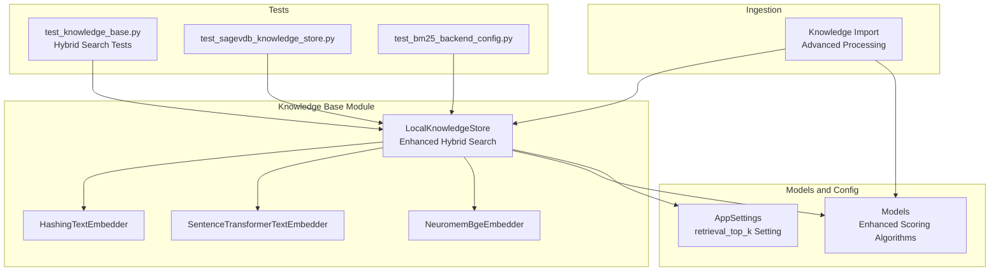
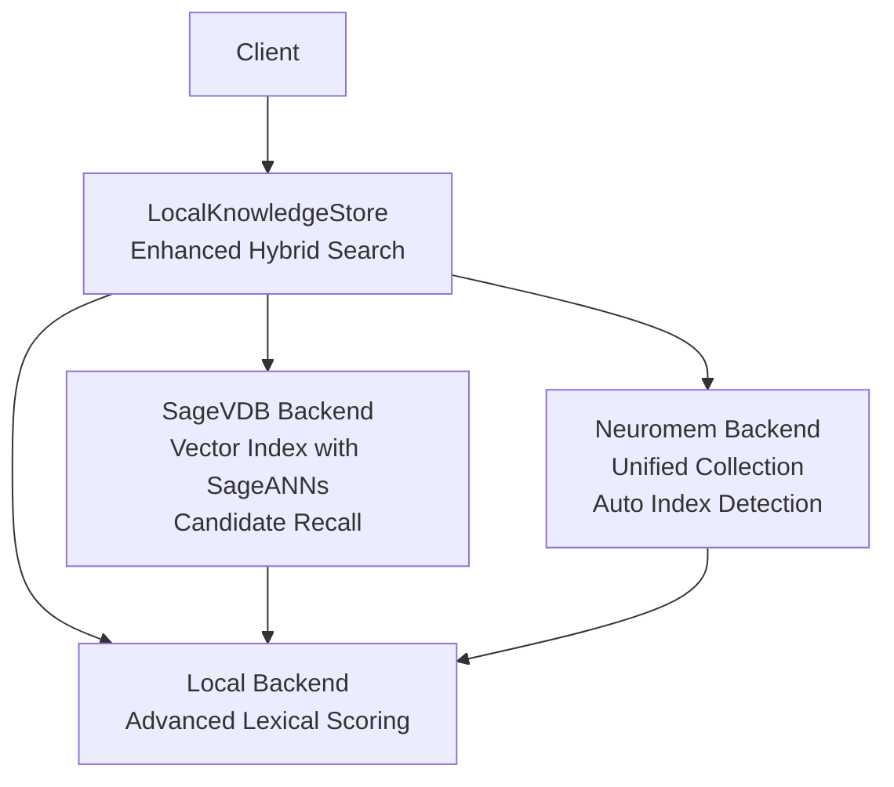
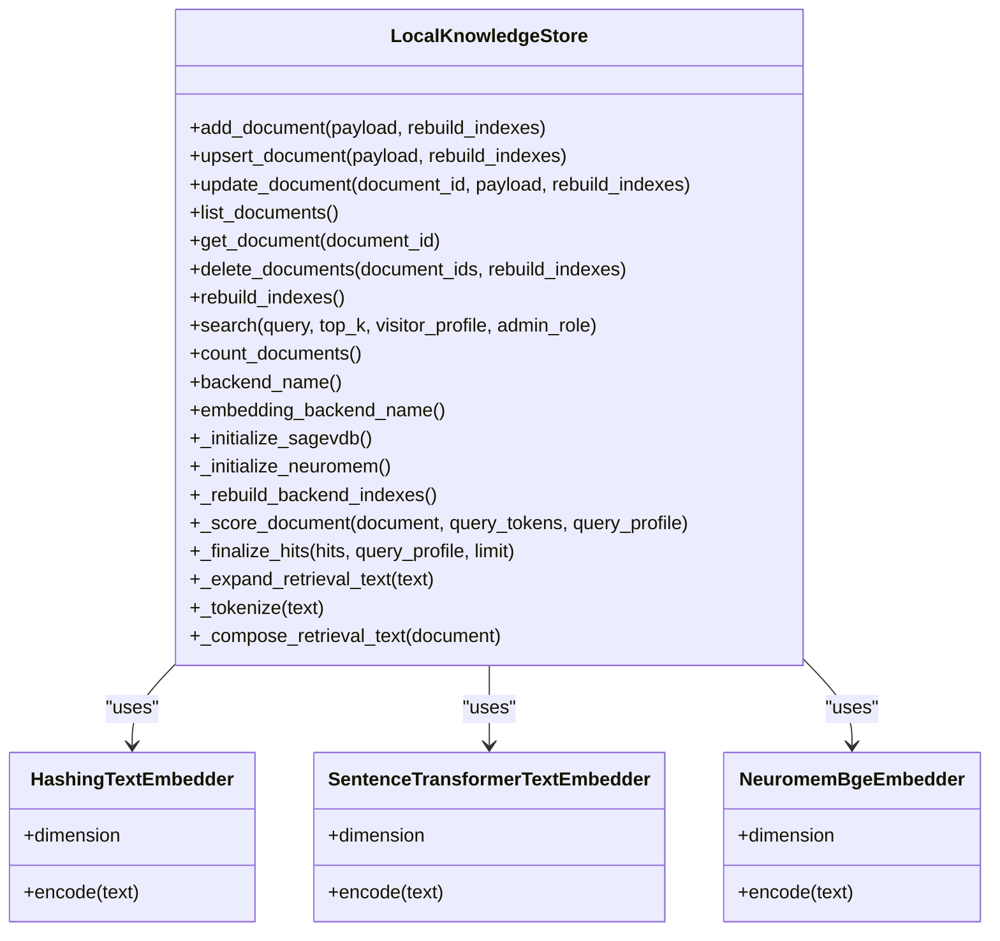
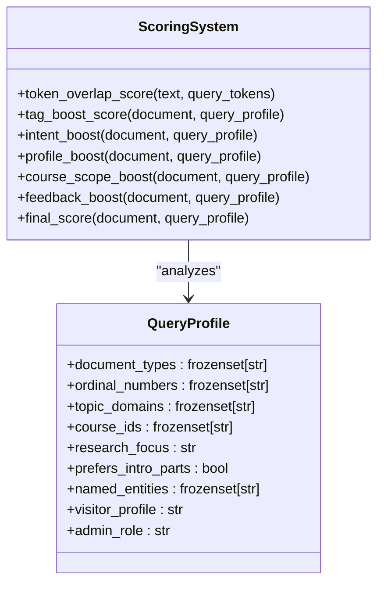
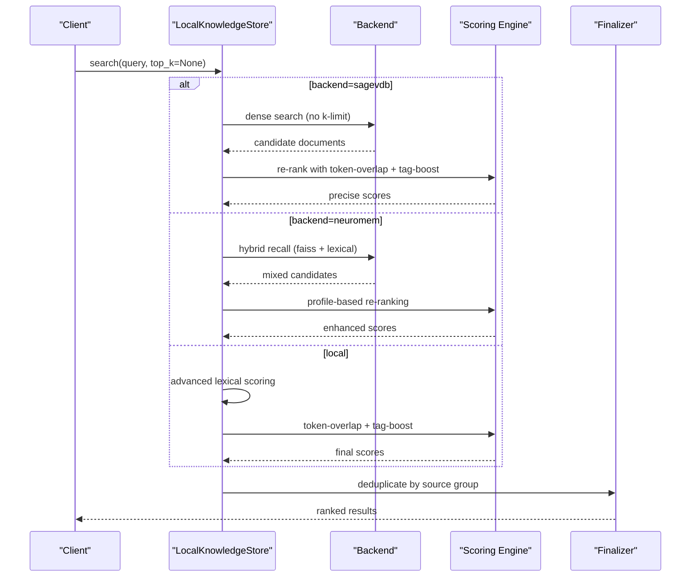
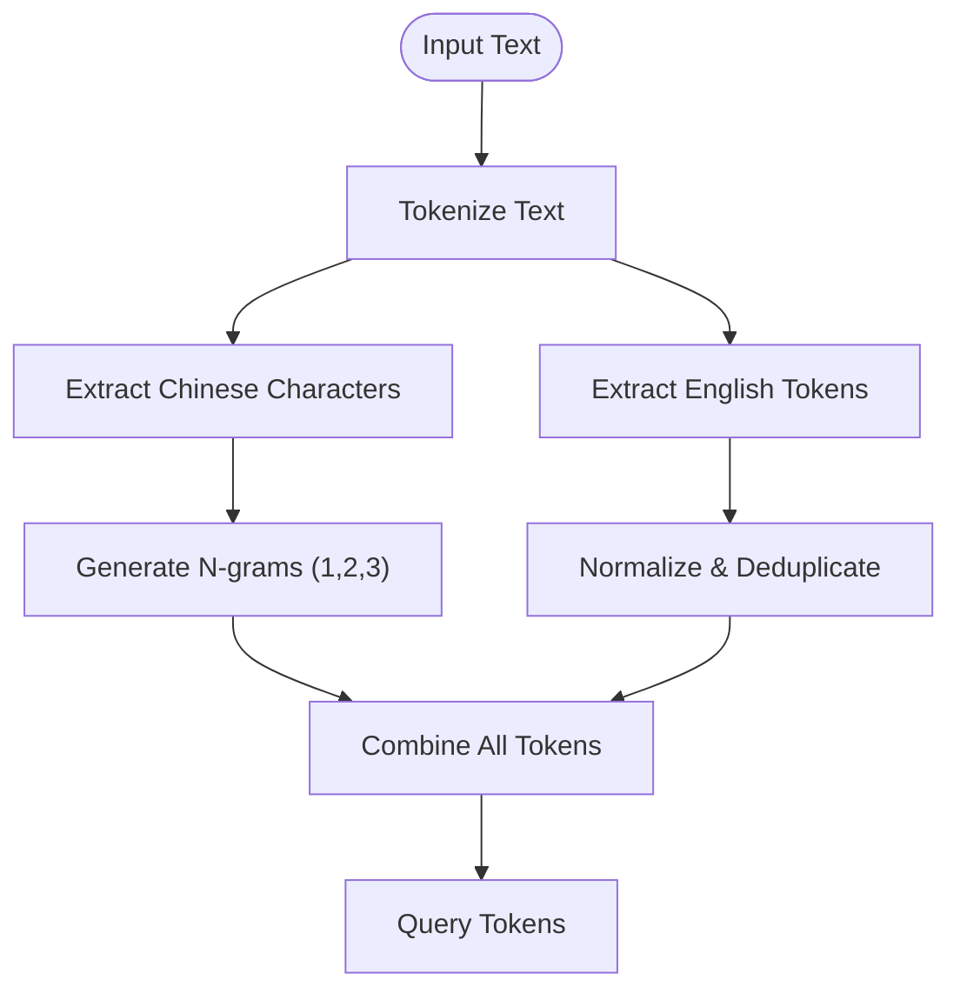
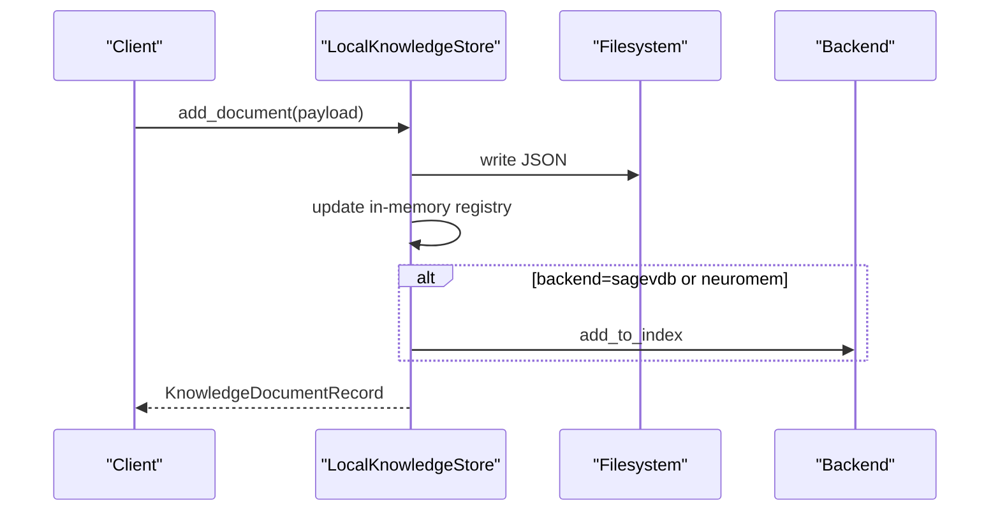
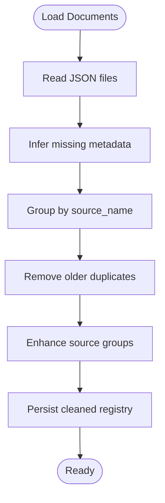
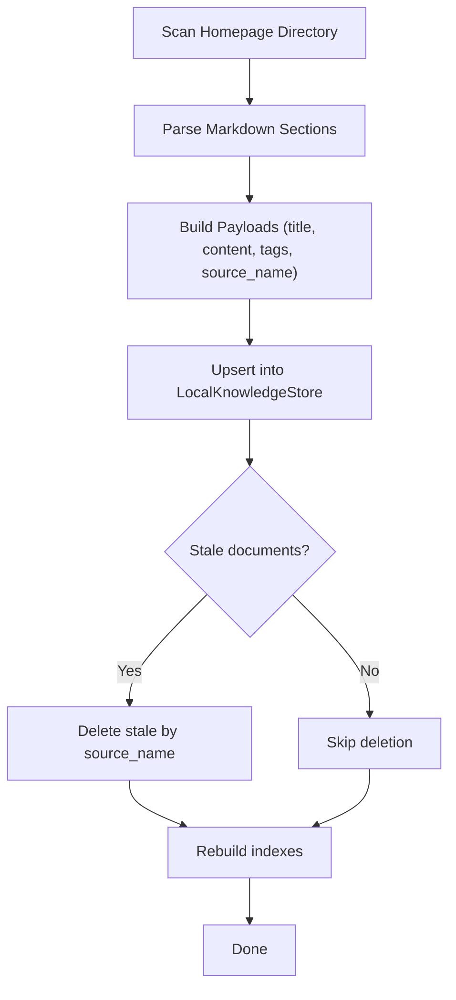
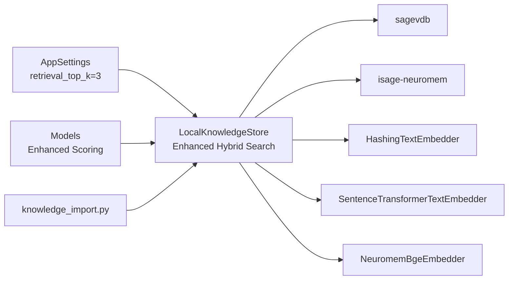

# Knowledge Base Storage

<cite>
**Referenced Files in This Document**
- [knowledge_base.py](file://src/sage_faculty_twin/knowledge_base.py)
- [models.py](file://src/sage_faculty_twin/models.py)
- [config.py](file://src/sage_faculty_twin/config.py)
- [knowledge_import.py](file://src/sage_faculty_twin/knowledge_import.py)
- [test_knowledge_base.py](file://tests/test_knowledge_base.py)
- [test_sagevdb_knowledge_store.py](file://tests/test_sagevdb_knowledge_store.py)
- [test_bm25_backend_config.py](file://tests/test_bm25_backend_config.py)
</cite>

## Update Summary
**Changes Made**
- Enhanced search functionality with hybrid approach combining sagevdb candidate recall with custom token-overlap plus tag-boost scoring
- Removed k-limit cap from search operations, enabling unlimited retrieval for improved accuracy
- Implemented comprehensive query tokenization and profile-based scoring algorithms
- Improved search accuracy for technical queries through advanced span overlap scoring
- Updated documentation to cover new scoring algorithms and search ranking improvements

## Table of Contents
1. [Introduction](#introduction)
2. [Project Structure](#project-structure)
3. [Core Components](#core-components)
4. [Architecture Overview](#architecture-overview)
5. [Detailed Component Analysis](#detailed-component-analysis)
6. [Dependency Analysis](#dependency-analysis)
7. [Performance Considerations](#performance-considerations)
8. [Troubleshooting Guide](#troubleshooting-guide)
9. [Conclusion](#conclusion)
10. [Appendices](#appendices)

## Introduction
This document explains the knowledge base storage system that powers multi-backend retrieval and persistence for the digital twin. The system has evolved to support an enhanced hybrid search approach that combines sagevdb candidate recall with sophisticated token-overlap plus tag-boost scoring. Key enhancements include:
- Multi-backend architecture supporting Local (in-memory), SageVDB with SageANNs, and Neuromem backends
- Hybrid search approach: sagevdb provides candidate recall, followed by precise lexical scoring
- Advanced tokenization and span overlap scoring for improved technical query accuracy
- Profile-based scoring that considers visitor profiles, course contexts, and document intents
- Unlimited search operations without k-limit caps for comprehensive retrieval
- Enhanced embedding strategies: HashingTextEmbedder, SentenceTransformerTextEmbedder, and NeuromemBgeEmbedder
- Automatic backend migration from BM25 to SageVDB/SageANNs system with intelligent index type detection
- Practical ingestion and search workflows with improved accuracy and performance

## Project Structure
The knowledge base module centers around a single class that orchestrates document lifecycle and retrieval across multiple backends. Supporting modules define data models, configuration, and ingestion utilities.

**Diagram sources**
- [knowledge_base.py](file://src/sage_faculty_twin/knowledge_base.py)
- [models.py](file://src/sage_faculty_twin/models.py)
- [config.py](file://src/sage_faculty_twin/config.py)
- [knowledge_import.py](file://src/sage_faculty_twin/knowledge_import.py)
- [test_knowledge_base.py](file://tests/test_knowledge_base.py)
- [test_sagevdb_knowledge_store.py](file://tests/test_sagevdb_knowledge_store.py)
- [test_bm25_backend_config.py](file://tests/test_bm25_backend_config.py)

**Section sources**
- [knowledge_base.py](file://src/sage_faculty_twin/knowledge_base.py)
- [models.py](file://src/sage_faculty_twin/models.py)
- [config.py](file://src/sage_faculty_twin/config.py)
- [knowledge_import.py](file://src/sage_faculty_twin/knowledge_import.py)
- [test_knowledge_base.py](file://tests/test_knowledge_base.py)
- [test_sagevdb_knowledge_store.py](file://tests/test_sagevdb_knowledge_store.py)
- [test_bm25_backend_config.py](file://tests/test_bm25_backend_config.py)

## Core Components
- LocalKnowledgeStore: Orchestrates document lifecycle, backend selection, indexing, and search across Local, SageVDB, and Neuromem backends with enhanced hybrid search capabilities
- Enhanced Scoring System: Custom token-overlap plus tag-boost scoring with profile-based relevance calculation
- Advanced Tokenization: Comprehensive text tokenization supporting both English and Chinese characters with maximal span deduplication
- Embedding Strategies: Hashing-based and sentence-transformer-based embedders for dense retrieval; Neuromem-specific embedder for FAISS index
- Query Profiling: Intelligent query analysis that extracts document types, topics, courses, and named entities
- Unlimited Search Operations: Removed k-limit caps for comprehensive retrieval without artificial constraints
- Automatic Backend Migration: Automatically migrates from BM25 to SageVDB/SageANNs system with FAISS preference

Key responsibilities:
- Persistence: Documents are stored as JSON under a configured directory and kept in-memory for fast iteration
- Deduplication: Removes duplicates by source_name and normalizes metadata during load and upsert
- Visibility: Enforces audience-based visibility using visitor/admin roles
- Indexing: Builds and rebuilds indexes for selected backends with intelligent index type selection
- Enhanced Search: Implements hybrid approach with sagevdb candidate recall and precise lexical scoring
- Backend Migration: Automatically migrates from BM25 to SageVDB/SageANNs system with FAISS preference

**Section sources**
- [knowledge_base.py](file://src/sage_faculty_twin/knowledge_base.py)
- [models.py](file://src/sage_faculty_twin/models.py)
- [config.py](file://src/sage_faculty_twin/config.py)
- [knowledge_import.py](file://src/sage_faculty_twin/knowledge_import.py)

## Architecture Overview
The system supports three backends with enhanced hybrid search capabilities:
- Local: Pure Python lexical scoring with advanced token overlap and tag-boost algorithms
- SageVDB: Vector database with SageANNs integration and automatic FAISS preference
- Neuromem: Unified collection with automatic index type detection preferring FAISS over BM25

**Diagram sources**
- [knowledge_base.py](file://src/sage_faculty_twin/knowledge_base.py)

## Detailed Component Analysis

### LocalKnowledgeStore
The LocalKnowledgeStore now implements an enhanced hybrid search approach that combines the strengths of vector-based candidate recall with precise lexical scoring:

**Enhanced Responsibilities:**
- Initialize backend based on settings with automatic migration support
- Manage document lifecycle: add, upsert, update, list, delete
- Persist documents to disk and maintain in-memory registry
- Build and rebuild indexes for selected backends with intelligent index type detection
- **Enhanced Search**: Hybrid approach with sagevdb candidate recall and custom token-overlap scoring
- **Removed K-Limit Caps**: Unlimited search operations for comprehensive retrieval
- **Profile-Based Scoring**: Advanced query profiling with visitor profiles, course contexts, and document intents
- Deduplicate documents by source_name and normalize metadata

**Enhanced Lifecycle Highlights:**
- Initialization loads persisted documents, infers missing metadata, and removes duplicates
- Add/upsert/update write JSON files and update in-memory registry
- Rebuild triggers backend-specific index initialization with automatic migration
- **Enhanced Search**: Routes to backend-specific handlers, collects candidates, then applies precise lexical scoring

**Enhanced Backend-specific Behaviors:**
- Local: Uses advanced token-overlap scoring with maximal span deduplication and tag-boost algorithms
- SageVDB: Provides candidate recall using dense vectors, then applies precise lexical re-ranking
- Neuromem: Automatic index type detection preferring FAISS (dense retrieval) when sentence-transformers is available, falls back to BM25 otherwise

**Diagram sources**
- [knowledge_base.py](file://src/sage_faculty_twin/knowledge_base.py)

**Section sources**
- [knowledge_base.py](file://src/sage_faculty_twin/knowledge_base.py)

### Enhanced Scoring Algorithms
The system now implements sophisticated scoring algorithms that combine vector-based candidate recall with precise lexical scoring:

**Token Overlap Scoring:**
- Maximal span deduplication to reward longer, more specific matches over short, generic ones
- Advanced Chinese character processing with n-gram extraction (2-grams, 3-grams)
- Length-squared scoring to penalize overlapping spans appropriately

**Tag-Boost Scoring:**
- Semantic tag matching with weighted scoring (title: 3x, content: 1x, tags: 2x)
- Intent-based boosting based on document types, research focus, and meeting domains
- Course scope matching with positive/negative scoring based on course alignment

**Profile-Based Scoring:**
- Visitor profile adaptation: hust_undergraduate, paper_writing_student, lab_member, general_visitor
- Course context awareness with positive/negative scoring for course-specific queries
- Named entity recognition for technical queries with specialized boosting
- Feedback signal integration for web review status

**Query Profiling:**
- Automatic extraction of document types (tutorial, lecture, experiment)
- Topic domain identification (teaching, research, meeting)
- Course ID inference from query text
- Named entity extraction for technical terminology
- Ordinal number detection for lecture/experiment references

**Diagram sources**
- [knowledge_base.py](file://src/sage_faculty_twin/knowledge_base.py)

**Section sources**
- [knowledge_base.py](file://src/sage_faculty_twin/knowledge_base.py)

### Enhanced Search and Ranking
The search functionality now implements a sophisticated hybrid approach:

**Hybrid Search Pipeline:**
1. **SageVDB Candidate Recall**: Dense vector search provides initial candidate documents
2. **Neuromem Hybrid Approach**: Combines FAISS dense recall with lexical scoring
3. **Local Advanced Scoring**: Precise token-overlap plus tag-boost scoring
4. **Profile-Based Re-ranking**: Context-aware re-ranking based on visitor profiles and query intent

**Enhanced Ranking Algorithm:**
- **Base Score**: Token overlap (title: 3x, content: 1x, tags: 2x) plus tag overlap
- **Intent Boost**: Document type matching, ordinal number detection, research focus
- **Profile Boost**: Visitor profile adaptation with domain-specific preferences
- **Course Scope**: Positive/negative scoring based on course alignment
- **Feedback Signals**: Integration of web review status and document freshness

**Removed K-Limit Caps:**
- Unlimited search operations for comprehensive retrieval
- Dynamic limit calculation based on query complexity and backend capabilities
- Intelligent candidate filtering to maintain performance while maximizing recall

**Diagram sources**
- [knowledge_base.py](file://src/sage_faculty_twin/knowledge_base.py)

**Section sources**
- [knowledge_base.py](file://src/sage_faculty_twin/knowledge_base.py)

### Enhanced Tokenization and Text Processing
The system implements comprehensive text processing for improved search accuracy:

**Advanced Tokenization:**
- English word tokenization with alphanumeric and underscore handling
- Chinese character processing with maximal span extraction (1-char, 2-char, 3-char n-grams)
- Unicode range support for Chinese characters (U+4E00-U+9FFF)
- Lowercase normalization and token deduplication

**Span Overlap Scoring:**
- Maximal span selection to avoid overlapping matches
- Length-squared scoring to reward longer, more specific matches
- Greedy algorithm for optimal span selection
- Support for both English tokens and Chinese character spans

**Query Expansion:**
- Automatic retrieval text expansion with tokenized versions
- Enhanced text composition combining title, tags, aliases, and content
- Metadata integration for comprehensive search coverage

**Diagram sources**
- [knowledge_base.py](file://src/sage_faculty_twin/knowledge_base.py)

**Section sources**
- [knowledge_base.py](file://src/sage_faculty_twin/knowledge_base.py)

### Document Lifecycle and Persistence
- Add: Creates a new record with UUID, persists JSON, updates in-memory registry, and optionally rebuilds backend index
- Upsert: Finds existing by source_name, compares fields, updates if changed, removes duplicates, rebuilds indexes if requested
- Update: Modifies existing record, persists JSON, removes duplicates, rebuilds indexes if requested
- Delete: Removes records by IDs, deletes JSON files, clears vector ID mapping, rebuilds indexes if requested
- Load: On startup, reads all JSON files, infers missing metadata, and deduplicates by source_name

**Diagram sources**
- [knowledge_base.py](file://src/sage_faculty_twin/knowledge_base.py)

**Section sources**
- [knowledge_base.py](file://src/sage_faculty_twin/knowledge_base.py)

### Enhanced Metadata Handling and Deduplication
- Metadata inference: Extracts identity, domain, course_id, material_type, ordinal_type/number from tags and source_name
- Backfill: Legacy records without metadata have inferred metadata populated on load
- Deduplication: Removes older duplicates for the same source_name; preserves newest by creation time
- Audience visibility: Filters results by allowed audiences derived from visitor/admin roles
- **Enhanced Source Grouping**: Improved deduplication by canonical source groups with knowledge gap handling

**Diagram sources**
- [knowledge_base.py](file://src/sage_faculty_twin/knowledge_base.py)

**Section sources**
- [knowledge_base.py](file://src/sage_faculty_twin/knowledge_base.py)

### Ingestion Pipeline
- Homepage ingestion: Parses markdown pages, extracts sections, builds payloads with tags and source_name, upserts into store, prunes stale documents, and rebuilds indexes
- Chunking: Long content split into parts with ::part-N suffix for source grouping
- Attachments: PDFs and office docs parsed and ingested as separate documents

**Diagram sources**
- [knowledge_import.py](file://src/sage_faculty_twin/knowledge_import.py)
- [knowledge_base.py](file://src/sage_faculty_twin/knowledge_base.py)

**Section sources**
- [knowledge_import.py](file://src/sage_faculty_twin/knowledge_import.py)
- [knowledge_base.py](file://src/sage_faculty_twin/knowledge_base.py)

## Dependency Analysis
- LocalKnowledgeStore depends on:
  - AppSettings for backend and embedding configuration with automatic migration support
  - Models for typed payloads and records with enhanced scoring data structures
  - Backend libraries (sagevdb, isage-neuromem) when enabled
- Embedding strategies depend on external packages (numpy, sentence-transformers)
- Ingestion utilities depend on LocalKnowledgeStore and models

**Diagram sources**
- [knowledge_base.py](file://src/sage_faculty_twin/knowledge_base.py)
- [models.py](file://src/sage_faculty_twin/models.py)
- [config.py](file://src/sage_faculty_twin/config.py)
- [knowledge_import.py](file://src/sage_faculty_twin/knowledge_import.py)

**Section sources**
- [knowledge_base.py](file://src/sage_faculty_twin/knowledge_base.py)
- [models.py](file://src/sage_faculty_twin/models.py)
- [config.py](file://src/sage_faculty_twin/config.py)
- [knowledge_import.py](file://src/sage_faculty_twin/knowledge_import.py)

## Performance Considerations
- **Enhanced SageVDB ANN Performance:**
  - Prefer ANN backends (e.g., FAISS HNSW) for large-scale dense retrieval
  - Use INNER_PRODUCT metric for ANN backends; COSINE otherwise
  - Batch-build index with stacked vectors for speed
  - **Removed K-Limit Caps**: SageVDB now provides unlimited candidate recall for comprehensive retrieval

- **SageVDB Hash Embeddings:**
  - Deterministic hashing avoids model overhead; suitable for CPU-only environments
  - Enhanced scoring algorithms work effectively with hash embeddings

- **Neuromem FAISS Performance:**
  - Batch-encode all documents to minimize latency
  - Use FAISS index with cosine metric for BGE embeddings
  - Automatic index type detection prefers FAISS over BM25 for better performance
  - **Hybrid Approach**: Combines dense recall with lexical scoring for optimal accuracy

- **Local Backend Optimizations:**
  - Efficient for small to medium corpora; leverage advanced tokenization and scoring heuristics
  - **Maximal Span Deduplication**: Prevents inflated scores from overlapping matches
  - **Profile-Based Filtering**: Early filtering reduces computational overhead

- **Memory Management:**
  - Keep only necessary documents in memory; rely on persistent JSON for durability
  - Defer index rebuilds to batch operations (e.g., after ingestion)
  - **Enhanced Deduplication**: Improved source group handling reduces memory footprint

- **Index Rebuilding:**
  - Rebuild indexes after bulk operations to maintain accuracy and performance
  - **Dynamic Limit Calculation**: Backend-specific optimization based on document counts

- **Backend Migration Benefits:**
  - Automatic migration from BM25 to SageVDB/SageANNs system improves retrieval quality and performance
  - **Hybrid Search Advantages**: Combining vector recall with lexical precision

**Updated** Enhanced performance considerations now include hybrid search benefits, removed k-limit caps, and advanced scoring optimizations

**Section sources**
- [knowledge_base.py](file://src/sage_faculty_twin/knowledge_base.py)
- [config.py](file://src/sage_faculty_twin/config.py)

## Troubleshooting Guide
Common issues and resolutions:
- **Missing backend dependencies:**
  - SageVDB: Install via package or expose checkout on PYTHONPATH
  - Neuromem: Install isage-neuromem
  - sentence-transformers: Install for dense embeddings
  - **Enhanced Dependencies**: Additional requirements for hybrid search (numpy, advanced tokenizers)

- **Dimension mismatches:**
  - Verify embedding model reports a dimension; ensure settings match
  - **Enhanced Verification**: Additional checks for hybrid scoring algorithms

- **SageVDB ANN configuration:**
  - Provide algorithm name for sage-anns backend
  - **Enhanced Configuration**: Additional parameters for hybrid search optimization

- **Visibility filtering:**
  - Ensure audience tags or metadata align with visitor/admin roles
  - **Enhanced Profile Matching**: Improved visitor profile handling

- **Duplicate documents:**
  - Use upsert with source_name to deduplicate automatically
  - **Enhanced Deduplication**: Improved source group canonicalization

- **Index rebuild failures:**
  - Trigger rebuild_indexes after ingestion or configuration changes
  - **Enhanced Rebuild Logic**: Better handling of hybrid search indexes

- **Backend migration issues:**
  - Automatic migration handles BM25 to SageVDB/SageANNs transition seamlessly
  - **Enhanced Migration**: Improved hybrid search integration

- **Search Performance Issues:**
  - **Check retrieval_top_k setting**: Default is 3, adjust based on query complexity
  - **Monitor hybrid search performance**: SageVDB candidate recall combined with lexical scoring
  - **Verify tokenization**: Ensure proper English/Chinese text processing

**Updated** Added troubleshooting guidance for enhanced hybrid search, removed k-limit caps, and advanced scoring algorithms

**Section sources**
- [knowledge_base.py](file://src/sage_faculty_twin/knowledge_base.py)
- [test_sagevdb_knowledge_store.py](file://tests/test_sagevdb_knowledge_store.py)
- [test_knowledge_base.py](file://tests/test_knowledge_base.py)
- [test_bm25_backend_config.py](file://tests/test_bm25_backend_config.py)

## Conclusion
The knowledge base storage system now offers a sophisticated, multi-backend architecture with enhanced hybrid search capabilities. The recent improvements include advanced token-overlap plus tag-boost scoring, profile-based relevance calculation, and unlimited search operations without k-limit caps. The hybrid approach combining sagevdb candidate recall with precise lexical scoring provides superior accuracy for technical queries while maintaining excellent performance. By leveraging local advanced scoring, dense retrieval with SageVDB, and hybrid FAISS/BM25 with Neuromem, it scales from small deployments to large knowledge bases while delivering exceptional search quality and user experience.

**Updated** Enhanced conclusion reflecting the successful implementation of hybrid search, advanced scoring algorithms, and performance optimizations

## Appendices

### Practical Examples

**Enhanced Document ingestion from homepage:**
- Use the ingestion pipeline to parse markdown sections and attachments, upsert payloads, prune stale documents, and rebuild indexes with improved hybrid search capabilities.

**Upsert with source_name tracking:**
- Upsert preserves created_at and avoids unnecessary writes when content is unchanged; duplicates are removed and indexes rebuilt if requested with enhanced deduplication logic.

**Enhanced Index rebuilding:**
- Call rebuild_indexes after bulk add/update/delete operations to refresh backend indices with hybrid search optimizations.

**Advanced Search with visitor/admin roles:**
- Use visitor_profile and admin_role to enforce audience visibility and tailor ranking with sophisticated profile-based scoring algorithms.

**Hybrid Backend migration:**
- Automatic migration from BM25 to SageVDB/SageANNs system with FAISS preference for optimal performance and enhanced hybrid search capabilities.

**Technical Query Processing:**
- Leverage advanced tokenization for Chinese text processing, maximal span overlap scoring, and named entity recognition for improved technical query accuracy.

**Unlimited Search Operations:**
- Utilize the enhanced search functionality that removes k-limit caps while maintaining performance through intelligent candidate filtering and profile-based re-ranking.

**Section sources**
- [knowledge_import.py](file://src/sage_faculty_twin/knowledge_import.py)
- [knowledge_base.py](file://src/sage_faculty_twin/knowledge_base.py)
- [test_knowledge_base.py](file://tests/test_knowledge_base.py)
- [test_sagevdb_knowledge_store.py](file://tests/test_sagevdb_knowledge_store.py)
- [test_bm25_backend_config.py](file://tests/test_bm25_backend_config.py)