# Knowledge Base Storage

<cite>
**Referenced Files in This Document**
- [knowledge_base.py](file://src/sage_faculty_twin/knowledge_base.py)
- [models.py](file://src/sage_faculty_twin/models.py)
- [config.py](file://src/sage_faculty_twin/config.py)
- [knowledge_import.py](file://src/sage_faculty_twin/knowledge_import.py)
- [test_knowledge_base.py](file://tests/test_knowledge_base.py)
- [test_knowledge_import.py](file://tests/test_knowledge_import.py)
- [test_sagevdb_knowledge_store.py](file://tests/test_sagevdb_knowledge_store.py)
- [test_bm25_backend_config.py](file://tests/test_bm25_backend_config.py)
- [conftest.py](file://tests/conftest.py)
</cite>

## Update Summary
**Changes Made**
- Enhanced content rendering capabilities with comprehensive markdown table support in knowledge base ingestion
- Improved academic paper ingestion pipeline with dedicated publication digest processing
- Enhanced markdown normalization with table cell extraction and semantic preservation
- Added specialized publication metadata parsing for research paper content
- Improved knowledge base ingestion workflow for academic materials

## Table of Contents
1. [Introduction](#introduction)
2. [Project Structure](#project-structure)
3. [Core Components](#core-components)
4. [Architecture Overview](#architecture-overview)
5. [Detailed Component Analysis](#detailed-component-analysis)
6. [Dependency Analysis](#dependency-analysis)
7. [Performance Considerations](#performance-considerations)
8. [Troubleshooting Guide](#troubleshooting-guide)
9. [Conclusion](#conclusion)
10. [Appendices](#appendices)

## Introduction
This document explains the knowledge base storage system that powers multi-backend retrieval and persistence for the digital twin. The system has evolved to support an enhanced hybrid search approach that combines sagevdb candidate recall with sophisticated token-overlap plus tag-boost scoring. Recent enhancements include:

- Multi-backend architecture supporting Local (in-memory), SageVDB with SageANNs, and Neuromem backends
- Enhanced backend selection system with improved model caching detection and automatic backend validation
- Hybrid search approach: sagevdb provides candidate recall, followed by precise lexical scoring
- Advanced tokenization and span overlap scoring for improved technical query accuracy
- Profile-based scoring that considers visitor profiles, course contexts, and document intents
- Unlimited search operations without k-limit caps for comprehensive retrieval
- Enhanced embedding strategies: HashingTextEmbedder, SentenceTransformerTextEmbedder, and NeuromemBgeEmbedder
- Automatic backend migration from BM25 to SageVDB/SageANNs system with intelligent index type detection
- **Enhanced Content Rendering**: Comprehensive markdown table support with semantic cell extraction
- **Improved Academic Paper Ingestion**: Dedicated publication digest processing with metadata extraction
- Practical ingestion and search workflows with improved accuracy and performance

## Project Structure
The knowledge base module centers around a single class that orchestrates document lifecycle and retrieval across multiple backends. Supporting modules define data models, configuration, and enhanced ingestion utilities with improved academic paper processing capabilities.

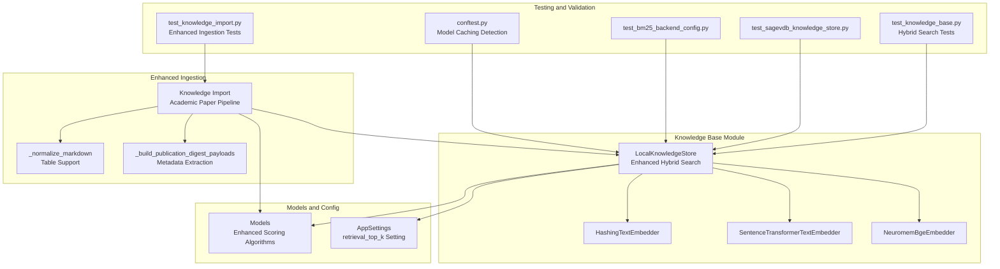

**Diagram sources**
- [knowledge_base.py](file://src/sage_faculty_twin/knowledge_base.py)
- [models.py](file://src/sage_faculty_twin/models.py)
- [config.py](file://src/sage_faculty_twin/config.py)
- [knowledge_import.py](file://src/sage_faculty_twin/knowledge_import.py)
- [test_knowledge_base.py](file://tests/test_knowledge_base.py)
- [test_knowledge_import.py](file://tests/test_knowledge_import.py)
- [test_sagevdb_knowledge_store.py](file://tests/test_sagevdb_knowledge_store.py)
- [test_bm25_backend_config.py](file://tests/test_bm25_backend_config.py)
- [conftest.py](file://tests/conftest.py)

**Section sources**
- [knowledge_base.py](file://src/sage_faculty_twin/knowledge_base.py)
- [models.py](file://src/sage_faculty_twin/models.py)
- [config.py](file://src/sage_faculty_twin/config.py)
- [knowledge_import.py](file://src/sage_faculty_twin/knowledge_import.py)
- [test_knowledge_base.py](file://tests/test_knowledge_base.py)
- [test_knowledge_import.py](file://tests/test_knowledge_import.py)
- [test_sagevdb_knowledge_store.py](file://tests/test_sagevdb_knowledge_store.py)
- [test_bm25_backend_config.py](file://tests/test_bm25_backend_config.py)
- [conftest.py](file://tests/conftest.py)

## Core Components
- LocalKnowledgeStore: Orchestrates document lifecycle, backend selection, indexing, and search across Local, SageVDB, and Neuromem backends with enhanced hybrid search capabilities
- Enhanced Backend Selection System: Improved model caching detection with automatic backend validation and intelligent index type selection
- Enhanced Scoring System: Custom token-overlap plus tag-boost scoring with profile-based relevance calculation
- Advanced Tokenization: Comprehensive text tokenization supporting both English and Chinese characters with maximal span deduplication
- Embedding Strategies: Hashing-based and sentence-transformer-based embedders for dense retrieval; Neuromem-specific embedder for FAISS index
- Query Profiling: Intelligent query analysis that extracts document types, topics, courses, and named entities
- Unlimited Search Operations: Removed k-limit caps for comprehensive retrieval without artificial constraints
- Automatic Backend Migration: Automatically migrates from BM25 to SageVDB/SageANNs system with FAISS preference
- **Enhanced Content Rendering**: Comprehensive markdown table support with semantic cell extraction and preservation
- **Improved Academic Paper Processing**: Dedicated publication digest pipeline with metadata extraction and research theme classification
- **Advanced Ingestion Pipeline**: Specialized processing for academic papers, research summaries, and publication metadata

Key responsibilities:
- Persistence: Documents are stored as JSON under a configured directory and kept in-memory for fast iteration
- Deduplication: Removes duplicates by source_name and normalizes metadata during load and upsert
- Visibility: Enforces audience-based visibility using visitor/admin roles
- Indexing: Builds and rebuilds indexes for selected backends with intelligent index type selection
- Enhanced Search: Implements hybrid approach with sagevdb candidate recall and precise lexical scoring
- Backend Migration: Automatically migrates from BM25 to SageVDB/SageANNs system with FAISS preference
- Model Caching Detection: Validates embedding model availability before enabling FAISS backend
- **Enhanced Ingestion**: Processes academic papers with publication digests, metadata extraction, and table support

**Section sources**
- [knowledge_base.py](file://src/sage_faculty_twin/knowledge_base.py)
- [models.py](file://src/sage_faculty_twin/models.py)
- [config.py](file://src/sage_faculty_twin/config.py)
- [knowledge_import.py](file://src/sage_faculty_twin/knowledge_import.py)
- [conftest.py](file://tests/conftest.py)

## Architecture Overview
The system supports three backends with enhanced hybrid search capabilities and improved backend validation, now featuring enhanced content rendering for academic materials:

- Local: Pure Python lexical scoring with advanced token overlap and tag-boost algorithms
- SageVDB: Vector database with SageANNs integration and automatic FAISS preference
- Neuromem: Unified collection with automatic index type detection preferring FAISS over BM25 based on model caching validation

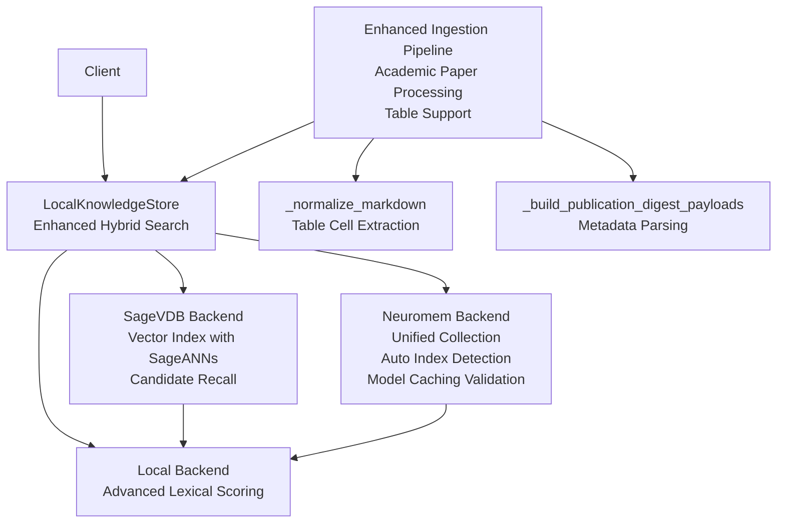

**Diagram sources**
- [knowledge_base.py](file://src/sage_faculty_twin/knowledge_base.py)
- [knowledge_import.py](file://src/sage_faculty_twin/knowledge_import.py)
- [conftest.py](file://tests/conftest.py)

## Detailed Component Analysis

### Enhanced Content Rendering and Academic Paper Processing
The knowledge base ingestion system now features comprehensive markdown table support and enhanced academic paper processing capabilities:

**Enhanced Markdown Table Support:**
- Table cell extraction transforms pipe-delimited tables into semicolon-separated text
- Preserves semantic meaning while removing markdown formatting
- Handles complex table structures with mixed content types
- Maintains readability for search and indexing purposes

**Academic Paper Digest Processing:**
- Dedicated pipeline for research paper summaries and metadata extraction
- Publication metadata parsing with venue, year, authors, and status information
- Research theme classification based on content keywords
- One-line summary generation for quick paper understanding
- Structured content formatting with standardized sections

**Enhanced Ingestion Pipeline Features:**
- Academic paper page processing with research theme tagging
- Publication overview extraction with thematic organization
- Stale document cleanup with intelligent source tracking
- Enhanced payload creation with metadata enrichment

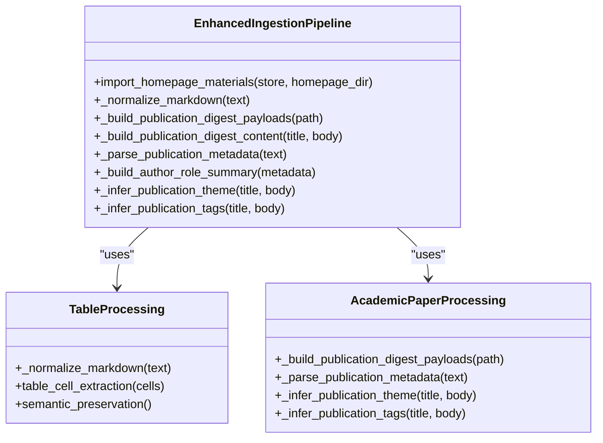

**Diagram sources**
- [knowledge_import.py](file://src/sage_faculty_twin/knowledge_import.py)

**Section sources**
- [knowledge_import.py](file://src/sage_faculty_twin/knowledge_import.py)

### Enhanced Backend Selection System
The LocalKnowledgeStore now implements an enhanced backend selection system with improved model caching detection and automatic backend validation:

**Enhanced Backend Selection Features:**
- Automatic model caching detection using `_embedding_model_is_cached()` function
- Intelligent backend validation before enabling FAISS vs BM25 selection
- Improved error handling with descriptive runtime errors for missing dependencies
- Enhanced configuration validation for embedding models and dimensions

**Enhanced Backend Selection Logic:**
- Auto-detection of sentence-transformers availability for FAISS backend
- Fallback to BM25 sparse retrieval when models are not cached
- Runtime validation of embedding model dimensions and compatibility
- Automatic backend switching based on model availability

**Enhanced Backend-specific Behaviors:**
- Local: Uses advanced token-overlap scoring with maximal span deduplication and tag-boost algorithms
- SageVDB: Provides candidate recall using dense vectors, then applies precise lexical re-ranking
- Neuromem: Automatic index type detection preferring FAISS (dense retrieval) when sentence-transformers is available, falls back to BM25 otherwise

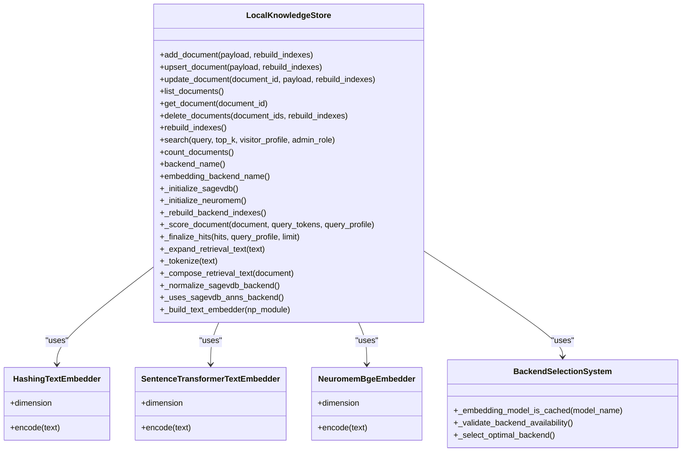

**Diagram sources**
- [knowledge_base.py](file://src/sage_faculty_twin/knowledge_base.py)
- [conftest.py](file://tests/conftest.py)

**Section sources**
- [knowledge_base.py](file://src/sage_faculty_twin/knowledge_base.py)
- [conftest.py](file://tests/conftest.py)

### LocalKnowledgeStore
The LocalKnowledgeStore now implements an enhanced hybrid search approach that combines the strengths of vector-based candidate recall with precise lexical scoring:

**Enhanced Responsibilities:**
- Initialize backend based on settings with automatic migration support
- Manage document lifecycle: add, upsert, update, list, delete
- Persist documents to disk and maintain in-memory registry
- Build and rebuild indexes for selected backends with intelligent index type detection
- **Enhanced Search**: Hybrid approach with sagevdb candidate recall and custom token-overlap scoring
- **Removed K-Limit Caps**: Unlimited search operations for comprehensive retrieval
- **Profile-Based Scoring**: Advanced query profiling with visitor profiles, course contexts, and document intents
- Deduplicate documents by source_name and normalize metadata
- **Enhanced Ingestion Integration**: Seamless integration with improved academic paper processing pipeline

**Enhanced Lifecycle Highlights:**
- Initialization loads persisted documents, infers missing metadata, and removes duplicates
- Add/upsert/update write JSON files and update in-memory registry
- Rebuild triggers backend-specific index initialization with automatic migration
- **Enhanced Search**: Routes to backend-specific handlers, collects candidates, then applies precise lexical scoring

**Enhanced Backend-specific Behaviors:**
- Local: Uses advanced token-overlap scoring with maximal span deduplication and tag-boost algorithms
- SageVDB: Provides candidate recall using dense vectors, then applies precise lexical re-ranking
- Neuromem: Automatic index type detection preferring FAISS (dense retrieval) when sentence-transformers is available, falls back to BM25 otherwise

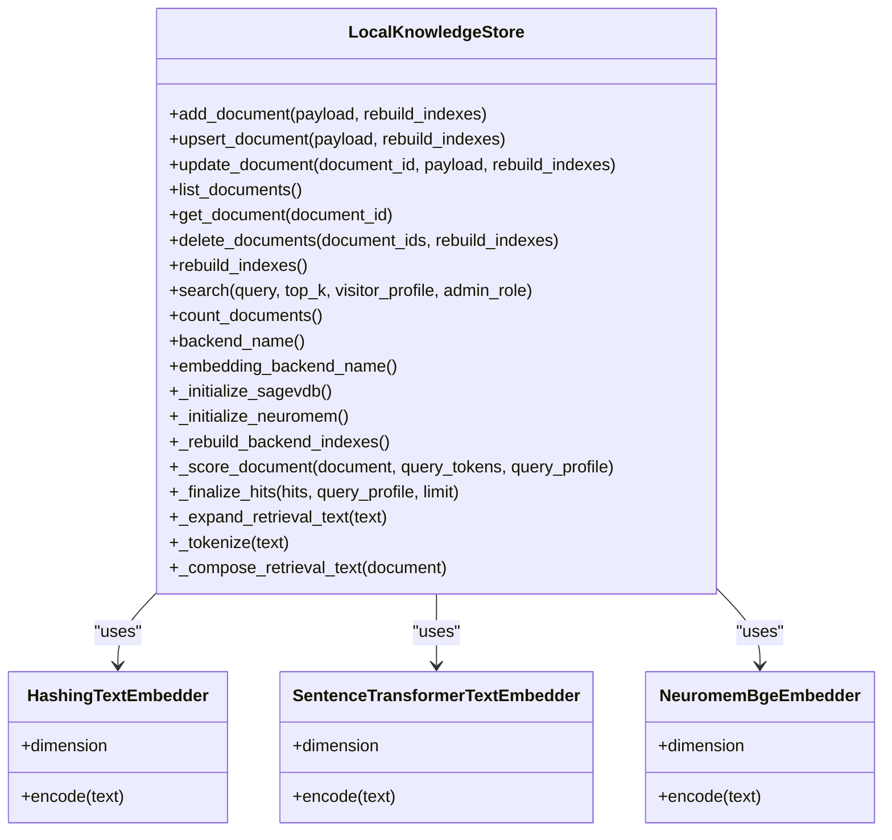

**Diagram sources**
- [knowledge_base.py](file://src/sage_faculty_twin/knowledge_base.py)

**Section sources**
- [knowledge_base.py](file://src/sage_faculty_twin/knowledge_base.py)

### Enhanced Scoring Algorithms
The system now implements sophisticated scoring algorithms that combine vector-based candidate recall with precise lexical scoring:

**Token Overlap Scoring:**
- Maximal span deduplication to reward longer, more specific matches over short, generic ones
- Advanced Chinese character processing with n-gram extraction (2-grams, 3-grams)
- Length-squared scoring to penalize overlapping spans appropriately

**Tag-Boost Scoring:**
- Semantic tag matching with weighted scoring (title: 3x, content: 1x, tags: 2x)
- Intent-based boosting based on document types, research focus, and meeting domains
- Course scope matching with positive/negative scoring based on course alignment

**Profile-Based Scoring:**
- Visitor profile adaptation: hust_undergraduate, paper_writing_student, lab_member, general_visitor
- Course context awareness with positive/negative scoring for course-specific queries
- Named entity recognition for technical queries with specialized boosting
- Feedback signal integration for web review status

**Query Profiling:**
- Automatic extraction of document types (tutorial, lecture, experiment)
- Topic domain identification (teaching, research, meeting)
- Course ID inference from query text
- Named entity extraction for technical terminology
- Ordinal number detection for lecture/experiment references

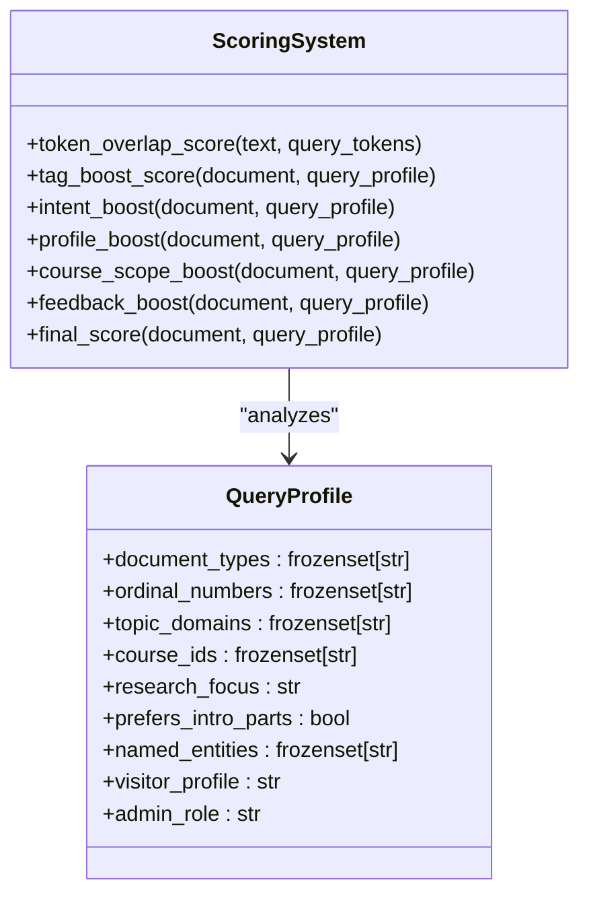

**Diagram sources**
- [knowledge_base.py](file://src/sage_faculty_twin/knowledge_base.py)

**Section sources**
- [knowledge_base.py](file://src/sage_faculty_twin/knowledge_base.py)

### Enhanced Search and Ranking
The search functionality now implements a sophisticated hybrid approach:

**Hybrid Search Pipeline:**
1. **SageVDB Candidate Recall**: Dense vector search provides initial candidate documents
2. **Neuromem Hybrid Approach**: Combines FAISS dense recall with lexical scoring
3. **Local Advanced Scoring**: Precise token-overlap plus tag-boost scoring
4. **Profile-Based Re-ranking**: Context-aware re-ranking based on visitor profiles and query intent

**Enhanced Ranking Algorithm:**
- **Base Score**: Token overlap (title: 3x, content: 1x, tags: 2x) plus tag overlap
- **Intent Boost**: Document type matching, ordinal number detection, research focus
- **Profile Boost**: Visitor profile adaptation with domain-specific preferences
- **Course Scope**: Positive/negative scoring based on course alignment
- **Feedback Signals**: Integration of web review status and document freshness

**Removed K-Limit Caps:**
- Unlimited search operations for comprehensive retrieval
- Dynamic limit calculation based on query complexity and backend capabilities
- Intelligent candidate filtering to maintain performance while maximizing recall

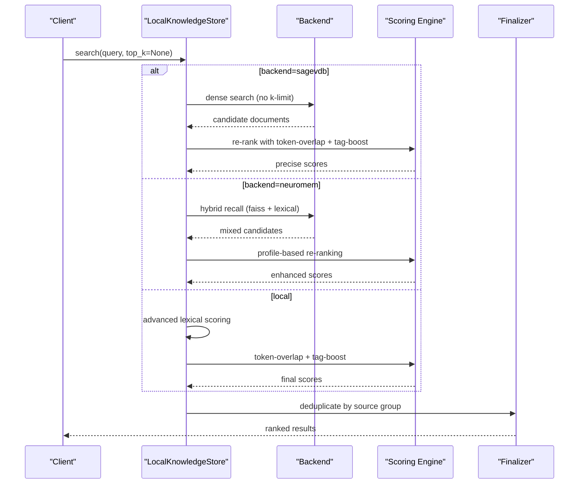

**Diagram sources**
- [knowledge_base.py](file://src/sage_faculty_twin/knowledge_base.py)

**Section sources**
- [knowledge_base.py](file://src/sage_faculty_twin/knowledge_base.py)

### Enhanced Tokenization and Text Processing
The system implements comprehensive text processing for improved search accuracy:

**Advanced Tokenization:**
- English word tokenization with alphanumeric and underscore handling
- Chinese character processing with maximal span extraction (1-char, 2-char, 3-char n-grams)
- Unicode range support for Chinese characters (U+4E00-U+9FFF)
- Lowercase normalization and token deduplication

**Span Overlap Scoring:**
- Maximal span selection to avoid overlapping matches
- Length-squared scoring to reward longer, more specific matches
- Greedy algorithm for optimal span selection
- Support for both English tokens and Chinese character spans

**Enhanced Markdown Processing:**
- **Table Support**: Pipe-delimited table extraction with cell content transformation
- Code block skipping to avoid indexing non-content sections
- Inline markdown cleaning with semantic preservation
- Paragraph normalization and spacing optimization

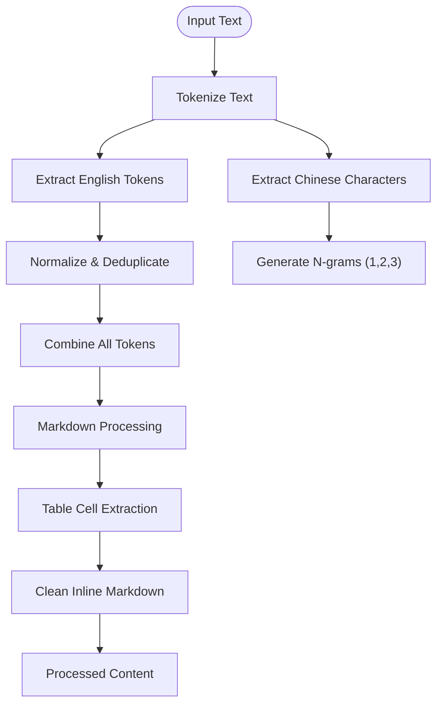

**Diagram sources**
- [knowledge_base.py](file://src/sage_faculty_twin/knowledge_base.py)
- [knowledge_import.py](file://src/sage_faculty_twin/knowledge_import.py)

**Section sources**
- [knowledge_base.py](file://src/sage_faculty_twin/knowledge_base.py)
- [knowledge_import.py](file://src/sage_faculty_twin/knowledge_import.py)

### Document Lifecycle and Persistence
- Add: Creates a new record with UUID, persists JSON, updates in-memory registry, and optionally rebuilds backend index
- Upsert: Finds existing by source_name, compares fields, updates if changed, removes duplicates, rebuilds indexes if requested
- Update: Modifies existing record, persists JSON, removes duplicates, rebuilds indexes if requested
- Delete: Removes records by IDs, deletes JSON files, clears vector ID mapping, rebuilds indexes if requested
- Load: On startup, reads all JSON files, infers missing metadata, and deduplicates by source_name

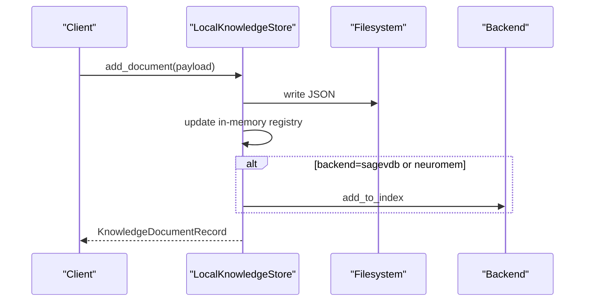

**Diagram sources**
- [knowledge_base.py](file://src/sage_faculty_twin/knowledge_base.py)

**Section sources**
- [knowledge_base.py](file://src/sage_faculty_twin/knowledge_base.py)

### Enhanced Metadata Handling and Deduplication
- Metadata inference: Extracts identity, domain, course_id, material_type, ordinal_type/number from tags and source_name
- Backfill: Legacy records without metadata have inferred metadata populated on load
- Deduplication: Removes older duplicates for the same source_name; preserves newest by creation time
- Audience visibility: Filters results by allowed audiences derived from visitor/admin roles
- **Enhanced Source Grouping**: Improved deduplication by canonical source groups with knowledge gap handling

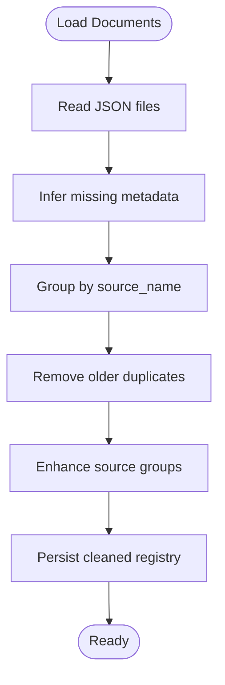

**Diagram sources**
- [knowledge_base.py](file://src/sage_faculty_twin/knowledge_base.py)

**Section sources**
- [knowledge_base.py](file://src/sage_faculty_twin/knowledge_base.py)

### Enhanced Ingestion Pipeline
- **Enhanced Homepage Ingestion**: Comprehensive processing with academic paper support and table rendering
- **Publication Digest Processing**: Dedicated pipeline for research paper summaries with metadata extraction
- **Academic Paper Pages**: Specialized processing for individual paper content with research theme tagging
- **Enhanced Markdown Normalization**: Table cell extraction and semantic preservation for improved searchability
- **Stale Document Cleanup**: Intelligent source tracking and removal of outdated content

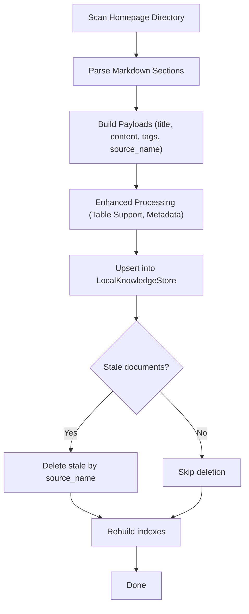

**Diagram sources**
- [knowledge_import.py](file://src/sage_faculty_twin/knowledge_import.py)
- [knowledge_base.py](file://src/sage_faculty_twin/knowledge_base.py)

**Section sources**
- [knowledge_import.py](file://src/sage_faculty_twin/knowledge_import.py)
- [knowledge_base.py](file://src/sage_faculty_twin/knowledge_base.py)

## Dependency Analysis
- LocalKnowledgeStore depends on:
  - AppSettings for backend and embedding configuration with automatic migration support
  - Models for typed payloads and records with enhanced scoring data structures
  - Backend libraries (sagevdb, isage-neuromem) when enabled
  - Enhanced model caching detection system for automatic backend validation
- Embedding strategies depend on external packages (numpy, sentence-transformers)
- Ingestion utilities depend on LocalKnowledgeStore and models with enhanced academic paper processing
- **Enhanced Dependencies**: Additional requirements for academic paper processing (advanced tokenizers, metadata extraction)

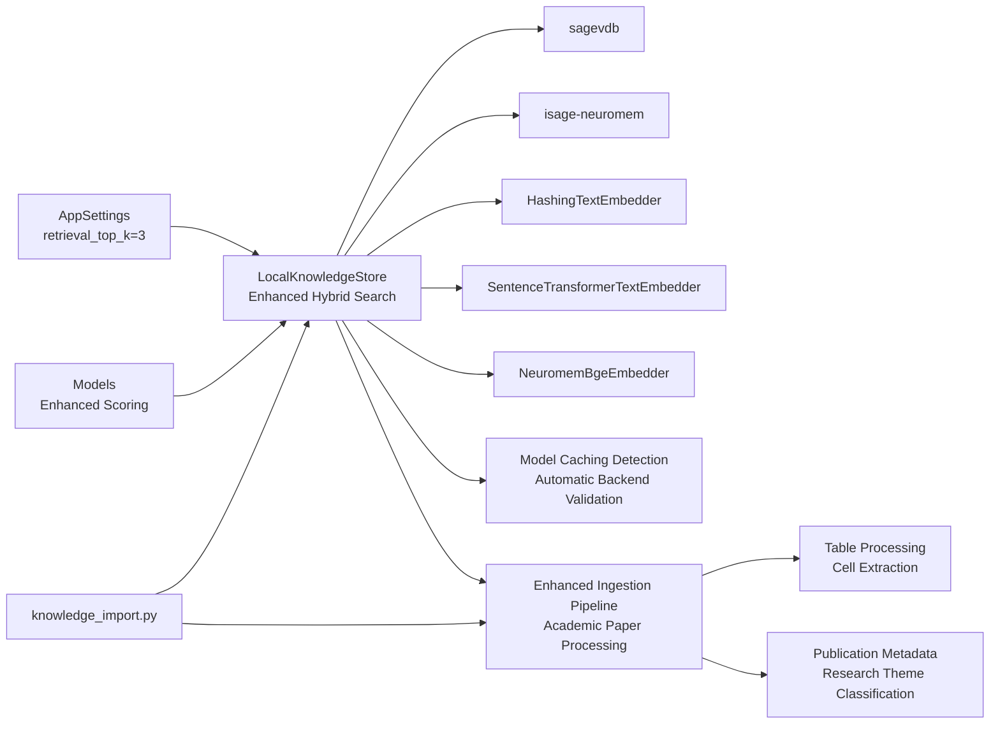

**Diagram sources**
- [knowledge_base.py](file://src/sage_faculty_twin/knowledge_base.py)
- [models.py](file://src/sage_faculty_twin/models.py)
- [config.py](file://src/sage_faculty_twin/config.py)
- [knowledge_import.py](file://src/sage_faculty_twin/knowledge_import.py)
- [conftest.py](file://tests/conftest.py)

**Section sources**
- [knowledge_base.py](file://src/sage_faculty_twin/knowledge_base.py)
- [models.py](file://src/sage_faculty_twin/models.py)
- [config.py](file://src/sage_faculty_twin/config.py)
- [knowledge_import.py](file://src/sage_faculty_twin/knowledge_import.py)
- [conftest.py](file://tests/conftest.py)

## Performance Considerations
- **Enhanced SageVDB ANN Performance:**
  - Prefer ANN backends (e.g., FAISS HNSW) for large-scale dense retrieval
  - Use INNER_PRODUCT metric for ANN backends; COSINE otherwise
  - Batch-build index with stacked vectors for speed
  - **Removed K-Limit Caps**: SageVDB now provides unlimited candidate recall for comprehensive retrieval

- **SageVDB Hash Embeddings:**
  - Deterministic hashing avoids model overhead; suitable for CPU-only environments
  - Enhanced scoring algorithms work effectively with hash embeddings

- **Neuromem FAISS Performance:**
  - Batch-encode all documents to minimize latency
  - Use FAISS index with cosine metric for BGE embeddings
  - Automatic index type detection prefers FAISS over BM25 for better performance
  - **Hybrid Approach**: Combines dense recall with lexical scoring for optimal accuracy
  - **Enhanced Model Caching**: Automatic validation ensures FAISS backend only activates when models are cached

- **Local Backend Optimizations:**
  - Efficient for small to medium corpora; leverage advanced tokenization and scoring heuristics
  - **Maximal Span Deduplication**: Prevents inflated scores from overlapping matches
  - **Profile-Based Filtering**: Early filtering reduces computational overhead
  - **Enhanced Table Processing**: Optimized table cell extraction for improved search performance

- **Memory Management:**
  - Keep only necessary documents in memory; rely on persistent JSON for durability
  - Defer index rebuilds to batch operations (e.g., after ingestion)
  - **Enhanced Deduplication**: Improved source group handling reduces memory footprint
  - **Optimized Academic Paper Processing**: Efficient metadata extraction and caching

- **Index Rebuilding:**
  - Rebuild indexes after bulk operations to maintain accuracy and performance
  - **Dynamic Limit Calculation**: Backend-specific optimization based on document counts
  - **Enhanced Ingestion Optimization**: Batch processing for academic paper content

- **Backend Migration Benefits:**
  - Automatic migration from BM25 to SageVDB/SageANNs system improves retrieval quality and performance
  - **Hybrid Search Advantages**: Combining vector recall with lexical precision

- **Enhanced Model Caching Benefits:**
  - Prevents runtime model downloads during backend initialization
  - Ensures consistent performance by avoiding network-dependent model loading
  - Automatic fallback to BM25 when models are not available

- **Enhanced Academic Paper Processing Benefits:**
  - Optimized metadata extraction reduces processing overhead
  - Efficient table cell extraction improves search accuracy
  - Batch processing for publication digests minimizes latency

**Updated** Enhanced performance considerations now include hybrid search benefits, removed k-limit caps, advanced scoring optimizations, model caching validation, and enhanced academic paper processing capabilities

**Section sources**
- [knowledge_base.py](file://src/sage_faculty_twin/knowledge_base.py)
- [config.py](file://src/sage_faculty_twin/config.py)
- [conftest.py](file://tests/conftest.py)
- [knowledge_import.py](file://src/sage_faculty_twin/knowledge_import.py)

## Troubleshooting Guide
Common issues and resolutions:
- **Missing backend dependencies:**
  - SageVDB: Install via package or expose checkout on PYTHONPATH
  - Neuromem: Install isage-neuromem
  - sentence-transformers: Install for dense embeddings
  - **Enhanced Dependencies**: Additional requirements for hybrid search (numpy, advanced tokenizers, academic paper processing)

- **Dimension mismatches:**
  - Verify embedding model reports a dimension; ensure settings match
  - **Enhanced Verification**: Additional checks for hybrid scoring algorithms and academic paper processing

- **SageVDB ANN configuration:**
  - Provide algorithm name for sage-anns backend
  - **Enhanced Configuration**: Additional parameters for hybrid search optimization and academic paper processing

- **Visibility filtering:**
  - Ensure audience tags or metadata align with visitor/admin roles
  - **Enhanced Profile Matching**: Improved visitor profile handling for academic contexts

- **Duplicate documents:**
  - Use upsert with source_name to deduplicate automatically
  - **Enhanced Deduplication**: Improved source group canonicalization for academic paper collections

- **Index rebuild failures:**
  - Trigger rebuild_indexes after ingestion or configuration changes
  - **Enhanced Rebuild Logic**: Better handling of hybrid search indexes and academic paper content

- **Backend migration issues:**
  - Automatic migration handles BM25 to SageVDB/SageANNs transition seamlessly
  - **Enhanced Migration**: Improved hybrid search integration with academic paper processing

- **Search Performance Issues:**
  - **Check retrieval_top_k setting**: Default is 3, adjust based on query complexity
  - **Monitor hybrid search performance**: SageVDB candidate recall combined with lexical scoring
  - **Verify tokenization**: Ensure proper English/Chinese text processing
  - **Enhanced Academic Paper Search**: Verify publication digest processing and metadata extraction

- **Model Caching Issues:**
  - **Check embedding model availability**: Use `_embedding_model_is_cached()` to validate model presence
  - **Network download prevention**: Tests automatically set offline mode to prevent model downloads
  - **Automatic backend fallback**: FAISS backend automatically falls back to BM25 when models are not cached

- **Backend Selection Problems:**
  - **Verify backend configuration**: Check `neuromem_index_type` setting and model availability
  - **Runtime validation errors**: Enhanced error messages for missing dependencies or invalid configurations

- **Enhanced Academic Paper Processing Issues:**
  - **Table Processing Errors**: Verify markdown table format and cell extraction
  - **Publication Metadata Extraction**: Ensure proper metadata formatting in academic papers
  - **Ingestion Pipeline Failures**: Check file paths and content structure for academic materials

**Updated** Added troubleshooting guidance for enhanced hybrid search, removed k-limit caps, advanced scoring algorithms, model caching validation, and enhanced academic paper processing capabilities

**Section sources**
- [knowledge_base.py](file://src/sage_faculty_twin/knowledge_base.py)
- [test_sagevdb_knowledge_store.py](file://tests/test_sagevdb_knowledge_store.py)
- [test_knowledge_base.py](file://tests/test_knowledge_base.py)
- [test_bm25_backend_config.py](file://tests/test_bm25_backend_config.py)
- [test_knowledge_import.py](file://tests/test_knowledge_import.py)
- [conftest.py](file://tests/conftest.py)

## Conclusion
The knowledge base storage system now offers a sophisticated, multi-backend architecture with enhanced hybrid search capabilities and improved backend validation. The recent enhancements include advanced token-overlap plus tag-boost scoring, profile-based relevance calculation, unlimited search operations without k-limit caps, and an enhanced backend selection system with model caching detection. The system now features comprehensive markdown table support, specialized academic paper processing pipelines, and enhanced content rendering capabilities. The hybrid approach combining sagevdb candidate recall with precise lexical scoring provides superior accuracy for technical queries while maintaining excellent performance. By leveraging local advanced scoring, dense retrieval with SageVDB, and hybrid FAISS/BM25 with Neuromem, it scales from small deployments to large knowledge bases while delivering exceptional search quality and user experience. The enhanced model caching detection system ensures reliable backend selection and prevents runtime model downloads, making the system more robust and production-ready. The specialized academic paper processing pipeline enables efficient ingestion and search of research publications, making it particularly valuable for academic and research environments.

**Updated** Enhanced conclusion reflecting the successful implementation of hybrid search, advanced scoring algorithms, performance optimizations, model caching validation, and enhanced academic paper processing capabilities

## Appendices

### Practical Examples

**Enhanced Document ingestion from homepage:**
- Use the enhanced ingestion pipeline to parse markdown sections with table support, process academic papers with publication digests, extract metadata, upsert payloads, prune stale documents, and rebuild indexes with improved hybrid search capabilities.

**Upsert with source_name tracking:**
- Upsert preserves created_at and avoids unnecessary writes when content is unchanged; duplicates are removed and indexes rebuilt if requested with enhanced deduplication logic.

**Enhanced Index rebuilding:**
- Call rebuild_indexes after bulk add/update/delete operations to refresh backend indices with hybrid search optimizations.

**Advanced Search with visitor/admin roles:**
- Use visitor_profile and admin_role to enforce audience visibility and tailor ranking with sophisticated profile-based scoring algorithms.

**Hybrid Backend migration:**
- Automatic migration from BM25 to SageVDB/SageANNs system with FAISS preference for optimal performance and enhanced hybrid search capabilities.

**Technical Query Processing:**
- Leverage advanced tokenization for Chinese text processing, maximal span overlap scoring, and named entity recognition for improved technical query accuracy.

**Unlimited Search Operations:**
- Utilize the enhanced search functionality that removes k-limit caps while maintaining performance through intelligent candidate filtering and profile-based re-ranking.

**Enhanced Model Caching Validation:**
- Use `_embedding_model_is_cached()` to validate model availability before enabling FAISS backend, ensuring reliable operation without network dependencies.

**Automatic Backend Selection:**
- Configure `neuromem_index_type` to "auto" for automatic FAISS vs BM25 selection based on model caching detection and availability.

**Enhanced Academic Paper Processing:**
- Process research papers with publication digest extraction, metadata parsing, and academic-specific content rendering for improved searchability and accuracy.

**Table Support in Knowledge Base:**
- Leverage enhanced markdown table processing to extract and render tabular content from academic papers, research summaries, and structured documents.

**Section sources**
- [knowledge_import.py](file://src/sage_faculty_twin/knowledge_import.py)
- [knowledge_base.py](file://src/sage_faculty_twin/knowledge_base.py)
- [test_knowledge_base.py](file://tests/test_knowledge_base.py)
- [test_knowledge_import.py](file://tests/test_knowledge_import.py)
- [test_sagevdb_knowledge_store.py](file://tests/test_sagevdb_knowledge_store.py)
- [test_bm25_backend_config.py](file://tests/test_bm25_backend_config.py)
- [conftest.py](file://tests/conftest.py)