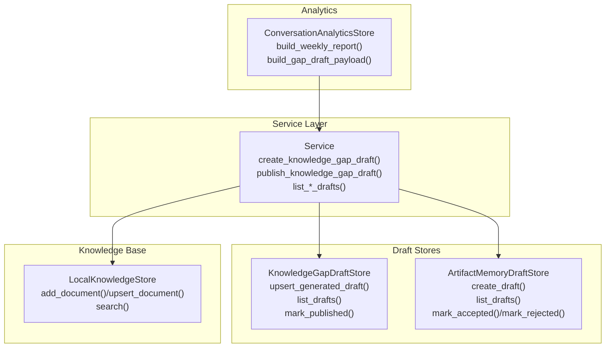
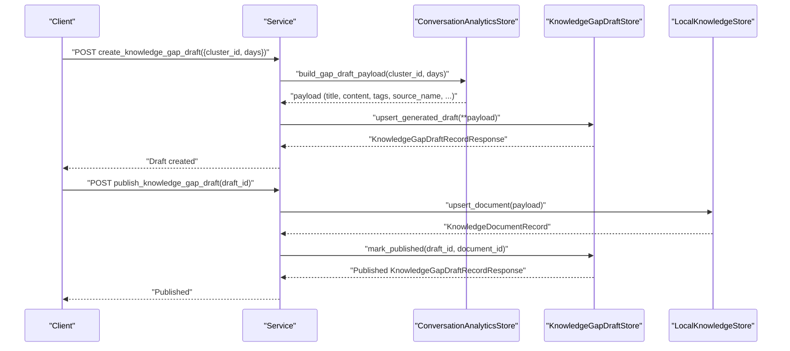
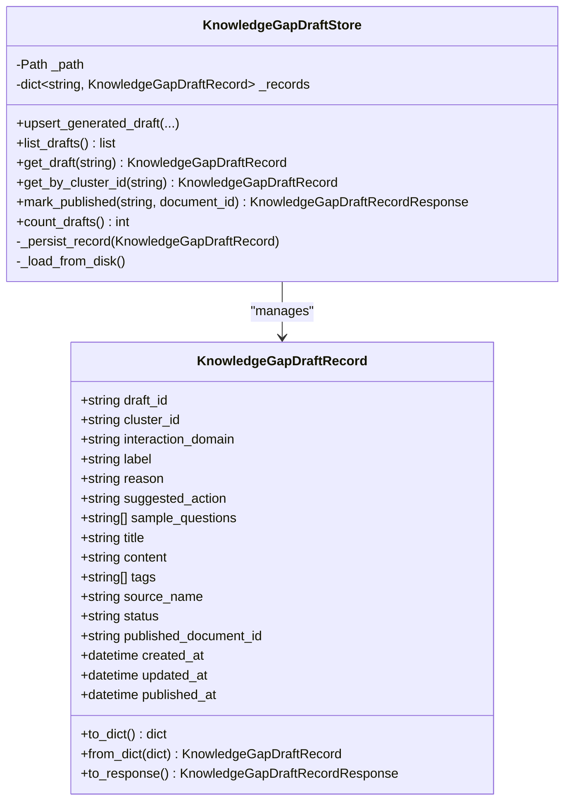
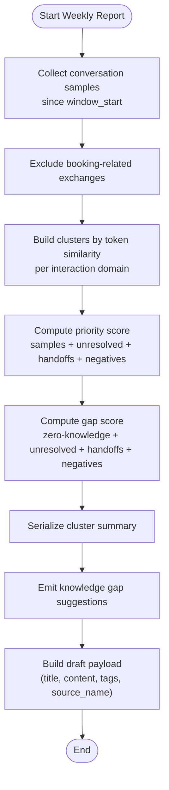
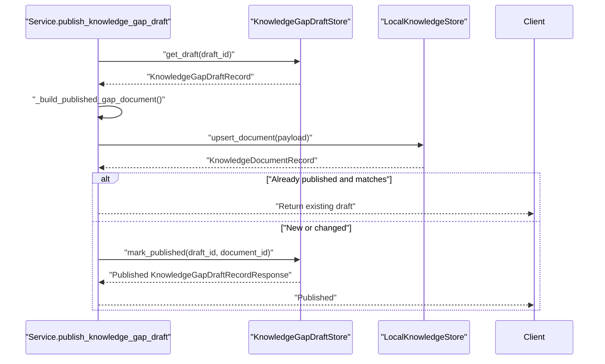
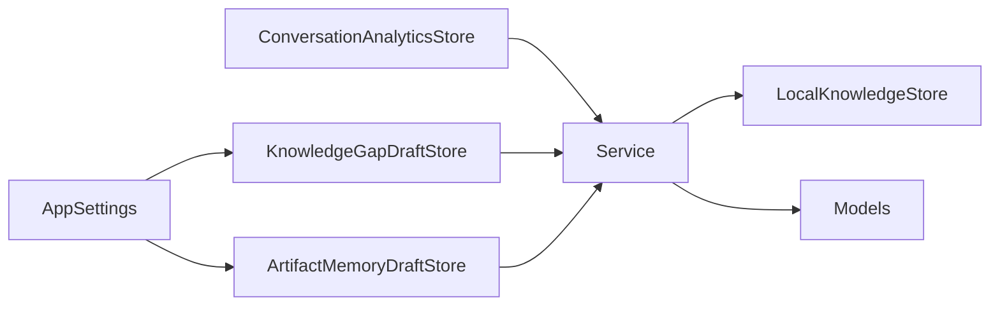

# Knowledge Gap Management

<cite>
**Referenced Files in This Document**
- [knowledge_gap_draft_store.py](file://src/sage_faculty_twin/knowledge_gap_draft_store.py)
- [artifact_memory_draft_store.py](file://src/sage_faculty_twin/artifact_memory_draft_store.py)
- [knowledge_base.py](file://src/sage_faculty_twin/knowledge_base.py)
- [analytics_store.py](file://src/sage_faculty_twin/analytics_store.py)
- [service.py](file://src/sage_faculty_twin/service.py)
- [models.py](file://src/sage_faculty_twin/models.py)
- [config.py](file://src/sage_faculty_twin/config.py)
</cite>

## Table of Contents
1. [Introduction](#introduction)
2. [Project Structure](#project-structure)
3. [Core Components](#core-components)
4. [Architecture Overview](#architecture-overview)
5. [Detailed Component Analysis](#detailed-component-analysis)
6. [Dependency Analysis](#dependency-analysis)
7. [Performance Considerations](#performance-considerations)
8. [Troubleshooting Guide](#troubleshooting-guide)
9. [Conclusion](#conclusion)

## Introduction
This document describes the knowledge gap management system that identifies missing information, generates targeted content drafts, and integrates them into the main knowledge base. It covers:
- Gap detection via analytics clustering and scoring
- Draft lifecycle for knowledge gaps (creation, review, publication)
- Integration with the knowledge base and version control for drafts
- Quality assurance checkpoints and collaborative editing workflows
- Gap reporting mechanisms and stakeholder workflows
- Content completion tracking and prioritization strategies

## Project Structure
The knowledge gap management system spans several modules:
- Analytics engine: builds weekly reports, detects clusters, and suggests gaps
- Draft stores: persist temporary drafts for knowledge gaps and artifact memories
- Knowledge base: stores and indexes published knowledge
- Service layer: orchestrates workflows, validates inputs, and coordinates persistence
- Models and configuration: define data contracts and system settings

**Diagram sources**
- [analytics_store.py:149-260](file://src/sage_faculty_twin/analytics_store.py#L149-L260)
- [knowledge_gap_draft_store.py:100-186](file://src/sage_faculty_twin/knowledge_gap_draft_store.py#L100-L186)
- [artifact_memory_draft_store.py:97-184](file://src/sage_faculty_twin/artifact_memory_draft_store.py#L97-L184)
- [knowledge_base.py:121-337](file://src/sage_faculty_twin/knowledge_base.py#L121-L337)
- [service.py:2496-2574](file://src/sage_faculty_twin/service.py#L2496-L2574)

**Section sources**
- [config.py:79-80](file://src/sage_faculty_twin/config.py#L79-L80)
- [models.py:685-726](file://src/sage_faculty_twin/models.py#L685-L726)

## Core Components
- KnowledgeGapDraftStore: manages JSON-backed drafts for knowledge gaps, supports upsert, listing, and publishing transitions
- ArtifactMemoryDraftStore: manages JSON-backed drafts for artifact memories, supports creation and acceptance/rejection
- ConversationAnalyticsStore: performs clustering, scoring, and gap suggestion generation
- LocalKnowledgeStore: persists and indexes knowledge documents, supports upsert and search
- Service layer: exposes endpoints to create drafts, list drafts, and publish gaps into the knowledge base
- Models and configuration: define request/response contracts and system paths for draft storage

**Section sources**
- [knowledge_gap_draft_store.py:100-186](file://src/sage_faculty_twin/knowledge_gap_draft_store.py#L100-L186)
- [artifact_memory_draft_store.py:97-184](file://src/sage_faculty_twin/artifact_memory_draft_store.py#L97-L184)
- [analytics_store.py:149-260](file://src/sage_faculty_twin/analytics_store.py#L149-L260)
- [knowledge_base.py:121-337](file://src/sage_faculty_twin/knowledge_base.py#L121-L337)
- [service.py:2496-2574](file://src/sage_faculty_twin/service.py#L2496-L2574)
- [models.py:685-726](file://src/sage_faculty_twin/models.py#L685-L726)
- [config.py:79-80](file://src/sage_faculty_twin/config.py#L79-L80)

## Architecture Overview
The system follows a pipeline:
- Analytics collects conversation samples, builds clusters, computes gap scores, and emits suggestions
- A draft is created from a suggestion payload
- Drafts are reviewed and either accepted/rejected (artifact memory) or published into the knowledge base (knowledge gap)
- Published content becomes searchable and discoverable via the knowledge base

**Diagram sources**
- [service.py:2496-2574](file://src/sage_faculty_twin/service.py#L2496-L2574)
- [analytics_store.py:224-260](file://src/sage_faculty_twin/analytics_store.py#L224-L260)
- [knowledge_gap_draft_store.py:107-143](file://src/sage_faculty_twin/knowledge_gap_draft_store.py#L107-L143)
- [knowledge_base.py:167-207](file://src/sage_faculty_twin/knowledge_base.py#L167-L207)

## Detailed Component Analysis

### Knowledge Gap Draft Store
Responsibilities:
- Persist drafts as JSON files under a configured directory
- Upsert drafts based on cluster identity, preserving published state when applicable
- List drafts ordered by recency
- Mark a draft as published and attach the associated document ID

Key behaviors:
- Draft IDs are UUIDs; if a draft exists for the same cluster, it is updated while preserving published status
- Status transitions: draft → published; published drafts remain published
- Persistence is resilient: directories are recreated if missing

**Diagram sources**
- [knowledge_gap_draft_store.py:12-97](file://src/sage_faculty_twin/knowledge_gap_draft_store.py#L12-L97)
- [knowledge_gap_draft_store.py:100-186](file://src/sage_faculty_twin/knowledge_gap_draft_store.py#L100-L186)

**Section sources**
- [knowledge_gap_draft_store.py:100-186](file://src/sage_faculty_twin/knowledge_gap_draft_store.py#L100-L186)

### Analytics Engine for Gap Detection
Responsibilities:
- Build weekly conversation reports
- Cluster similar questions by token similarity and interaction domain
- Compute priority and gap scores
- Generate gap suggestions with reasons and recommended actions
- Produce a structured draft payload for downstream creation

Gap detection algorithm highlights:
- Tokenization supports both Latin and CJK tokens, filters stop words
- Clustering uses Jaccard-like similarity threshold to group questions
- Priority score considers counts of unresolved, negative feedback, human handoffs, and zero-knowledge hits
- Gap score emphasizes absence of knowledge hits and domain-specific heuristics

**Diagram sources**
- [analytics_store.py:149-192](file://src/sage_faculty_twin/analytics_store.py#L149-L192)
- [analytics_store.py:291-352](file://src/sage_faculty_twin/analytics_store.py#L291-L352)
- [analytics_store.py:378-419](file://src/sage_faculty_twin/analytics_store.py#L378-L419)
- [analytics_store.py:224-260](file://src/sage_faculty_twin/analytics_store.py#L224-L260)

**Section sources**
- [analytics_store.py:149-260](file://src/sage_faculty_twin/analytics_store.py#L149-L260)
- [analytics_store.py:291-352](file://src/sage_faculty_twin/analytics_store.py#L291-L352)
- [analytics_store.py:378-419](file://src/sage_faculty_twin/analytics_store.py#L378-L419)

### Knowledge Base Integration and Publishing
Responsibilities:
- Accept new or updated knowledge documents
- Deduplicate by source_name and rebuild indexes when needed
- Support multiple backends (sagevdb, neuromem) with optional embeddings
- Publish knowledge gap drafts by upserting a document and linking the draft to the published ID

Publishing workflow:
- If draft is already published with matching content, return early
- Otherwise upsert document into knowledge base and update draft status and timestamps

**Diagram sources**
- [service.py:2547-2574](file://src/sage_faculty_twin/service.py#L2547-L2574)
- [knowledge_base.py:167-207](file://src/sage_faculty_twin/knowledge_base.py#L167-L207)
- [knowledge_gap_draft_store.py:158-168](file://src/sage_faculty_twin/knowledge_gap_draft_store.py#L158-L168)

**Section sources**
- [service.py:2547-2574](file://src/sage_faculty_twin/service.py#L2547-L2574)
- [knowledge_base.py:167-207](file://src/sage_faculty_twin/knowledge_base.py#L167-L207)

### Artifact Memory Draft Store
Responsibilities:
- Create drafts from conversation artifacts
- Track statuses: draft → accepted or rejected
- Persist as JSON files and support listing

Review procedure:
- Accepted drafts transition to accepted; rejected drafts transition to rejected
- Status transitions enforce constraints to prevent invalid state changes

**Section sources**
- [artifact_memory_draft_store.py:97-184](file://src/sage_faculty_twin/artifact_memory_draft_store.py#L97-L184)
- [service.py:2517-2545](file://src/sage_faculty_twin/service.py#L2517-L2545)

### Collaborative Editing and Review Procedures
- Knowledge gap drafts: created from analytics suggestions; published into knowledge base
- Artifact memory drafts: created from conversations; reviewed and accepted/rejected
- Version control for drafts: JSON files per draft ID; published drafts link to a published document ID
- Quality assurance checkpoints:
  - Draft content completeness (outline, examples, tags)
  - Published document deduplication by source_name
  - Backend index rebuilds after updates

**Section sources**
- [knowledge_gap_draft_store.py:107-143](file://src/sage_faculty_twin/knowledge_gap_draft_store.py#L107-L143)
- [artifact_memory_draft_store.py:104-156](file://src/sage_faculty_twin/artifact_memory_draft_store.py#L104-L156)
- [knowledge_base.py:167-207](file://src/sage_faculty_twin/knowledge_base.py#L167-L207)

### Content Recommendation and Prioritization Strategies
- Cluster-based prioritization: higher counts and more unresolved/handoff/negative signals increase priority
- Gap scoring: emphasizes zero-knowledge hits and domain-specific reasons (e.g., teaching, research, advising)
- Suggested actions: tailored to interaction domains (e.g., tutorial links, paper summaries, checklist templates)
- Tagging: standardized tags for analytics-driven discovery and filtering

**Section sources**
- [analytics_store.py:319-352](file://src/sage_faculty_twin/analytics_store.py#L319-L352)
- [analytics_store.py:394-405](file://src/sage_faculty_twin/analytics_store.py#L394-L405)
- [analytics_store.py:559-591](file://src/sage_faculty_twin/analytics_store.py#L559-L591)

### Gap Reporting Mechanisms and Stakeholder Workflows
- Weekly analytics report includes:
  - Overview metrics (counts, rates)
  - Top clusters with sample questions
  - Knowledge gap suggestions with supporting signals
  - Unresolved questions and handoff categories
- Stakeholders can:
  - Review suggestions and create knowledge gap drafts
  - Approve or reject artifact memory drafts
  - Publish drafts to the knowledge base for broader consumption

**Section sources**
- [analytics_store.py:149-192](file://src/sage_faculty_twin/analytics_store.py#L149-L192)
- [models.py:514-523](file://src/sage_faculty_twin/models.py#L514-L523)

## Dependency Analysis
- KnowledgeGapDraftStore depends on AppSettings for storage path and persists records as JSON
- Service layer composes analytics, draft store, and knowledge base to orchestrate workflows
- KnowledgeBase supports multiple backends and embeddings; publishes documents and rebuilds indexes
- Models define contracts for requests/responses and draft records

**Diagram sources**
- [config.py:79-80](file://src/sage_faculty_twin/config.py#L79-L80)
- [knowledge_gap_draft_store.py:100-105](file://src/sage_faculty_twin/knowledge_gap_draft_store.py#L100-L105)
- [artifact_memory_draft_store.py:97-102](file://src/sage_faculty_twin/artifact_memory_draft_store.py#L97-L102)
- [service.py:2496-2574](file://src/sage_faculty_twin/service.py#L2496-L2574)
- [knowledge_base.py:121-140](file://src/sage_faculty_twin/knowledge_base.py#L121-L140)
- [models.py:685-726](file://src/sage_faculty_twin/models.py#L685-L726)

**Section sources**
- [config.py:79-80](file://src/sage_faculty_twin/config.py#L79-L80)
- [service.py:2496-2574](file://src/sage_faculty_twin/service.py#L2496-L2574)

## Performance Considerations
- Embedding backends: choose appropriate embedding models and backends (sagevdb, neuromem) based on scale and latency requirements
- Index rebuilding: batch operations for FAISS indexing reduce overhead compared to per-document encoding
- Deduplication: remove duplicate documents by source_name to avoid redundant search results
- Retrieval tuning: adjust top_k and backend selection to balance precision and recall

[No sources needed since this section provides general guidance]

## Troubleshooting Guide
Common issues and resolutions:
- Draft not found: ensure the draft_id exists; verify listing endpoints
- Conflict during review: artifact memory drafts can only transition from draft to accepted/rejected; check current status
- Publishing mismatch: if a draft is already published with matching content, publishing returns early; otherwise, upsert occurs and draft status updates
- Missing analytics suggestion: verify cluster_id exists in the weekly report; adjust days window if needed

**Section sources**
- [service.py:2517-2545](file://src/sage_faculty_twin/service.py#L2517-L2545)
- [service.py:2547-2574](file://src/sage_faculty_twin/service.py#L2547-L2574)
- [analytics_store.py:224-260](file://src/sage_faculty_twin/analytics_store.py#L224-L260)

## Conclusion
The knowledge gap management system combines analytics-driven insights with robust draft and publishing workflows. It enables stakeholders to:
- Detect gaps efficiently using clustering and scoring
- Create, review, and publish targeted content
- Integrate seamlessly with the knowledge base and maintain version-aware drafts
- Track completion and prioritize high-impact topics