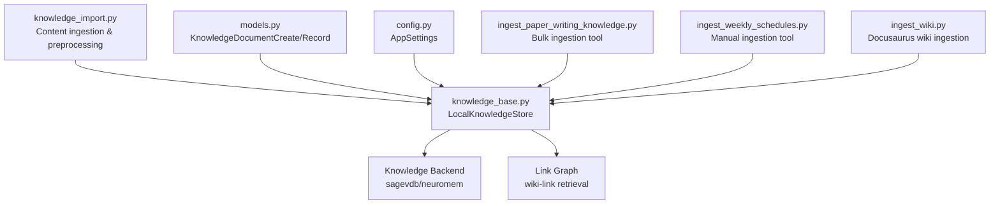
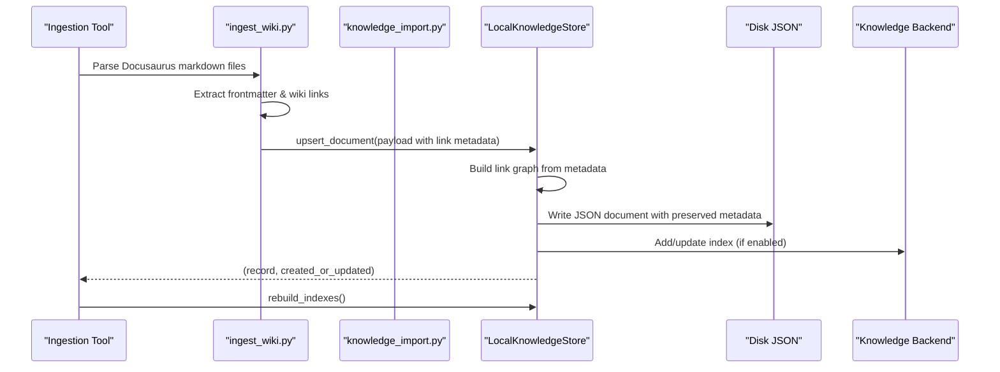
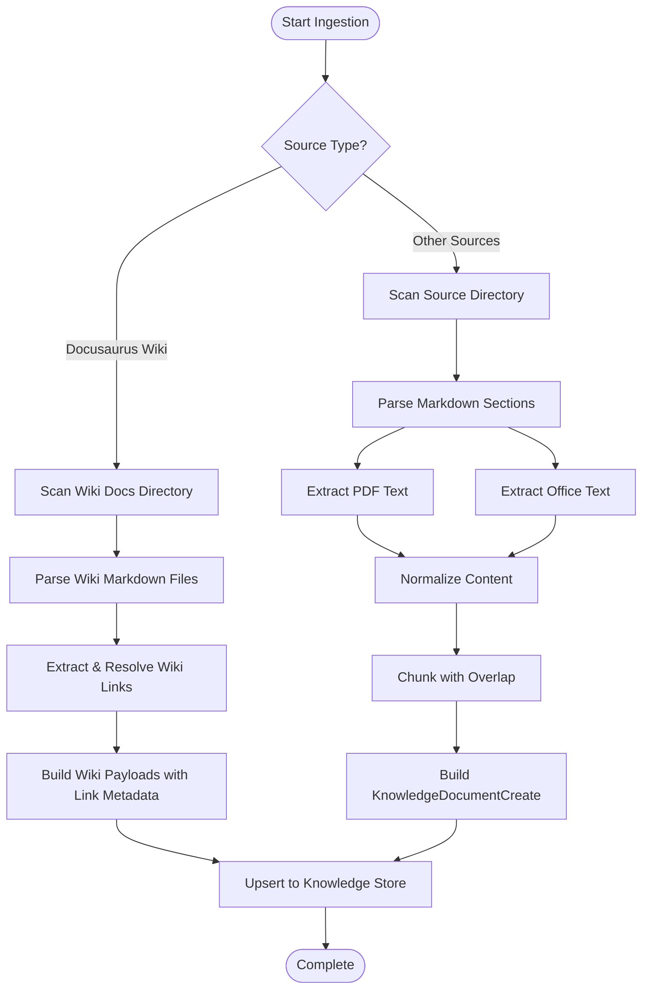
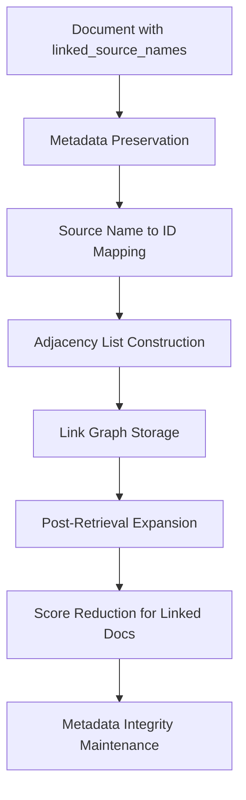
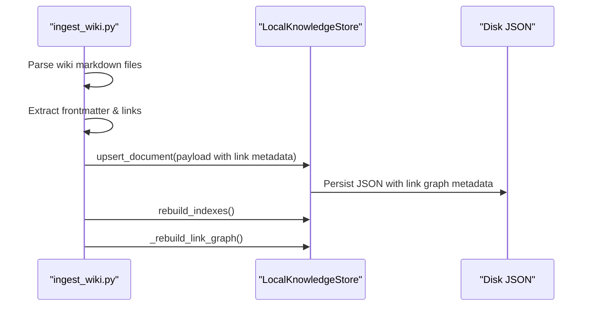
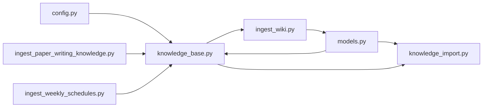

# Knowledge Ingestion Pipeline

<cite>
**Referenced Files in This Document**
- [knowledge_import.py](file://src/sage_faculty_twin/knowledge_import.py)
- [knowledge_base.py](file://src/sage_faculty_twin/knowledge_base.py)
- [models.py](file://src/sage_faculty_twin/models.py)
- [config.py](file://src/sage_faculty_twin/config.py)
- [ingest_paper_writing_knowledge.py](file://tools/ingest_paper_writing_knowledge.py)
- [ingest_weekly_schedules.py](file://tools/ingest_weekly_schedules.py)
- [ingest_wiki.py](file://tools/ingest_wiki.py)
- [test_knowledge_base.py](file://tests/test_knowledge_base.py)
</cite>

## Update Summary
**Changes Made**
- Updated metadata preservation documentation to reflect critical bug fix in metadata handling
- Enhanced wiki-link graph metadata documentation with proper metadata preservation details
- Added comprehensive coverage of metadata normalization and preservation mechanisms
- Updated validation rules section to include metadata preservation testing

## Table of Contents
1. [Introduction](#introduction)
2. [Project Structure](#project-structure)
3. [Core Components](#core-components)
4. [Architecture Overview](#architecture-overview)
5. [Detailed Component Analysis](#detailed-component-analysis)
6. [Dependency Analysis](#dependency-analysis)
7. [Performance Considerations](#performance-considerations)
8. [Troubleshooting Guide](#troubleshooting-guide)
9. [Conclusion](#conclusion)

## Introduction
This document describes the knowledge ingestion pipeline that transforms heterogeneous content (Markdown, PDFs, Office documents, structured data, and Docusaurus wiki content) into a searchable knowledge base. It covers document processing workflows, content extraction, preprocessing, validation, duplicate detection, normalization, categorization, and integration with external knowledge sources including wiki-link graphs. The pipeline ensures proper metadata preservation for maintaining cross-references and relationships between knowledge sources, with comprehensive validation through automated testing.

## Project Structure
The ingestion pipeline spans several modules:
- Content ingestion and preprocessing: [knowledge_import.py](file://src/sage_faculty_twin/knowledge_import.py)
- Knowledge storage and retrieval: [knowledge_base.py](file://src/sage_faculty_twin/knowledge_base.py)
- Data models and validation: [models.py](file://src/sage_faculty_twin/models.py)
- Configuration and environment: [config.py](file://src/sage_faculty_twin/config.py)
- Example ingestion tools: [ingest_paper_writing_knowledge.py](file://tools/ingest_paper_writing_knowledge.py), [ingest_weekly_schedules.py](file://tools/ingest_weekly_schedules.py), [ingest_wiki.py](file://tools/ingest_wiki.py)

**Diagram sources**
- [knowledge_import.py:32-113](file://src/sage_faculty_twin/knowledge_import.py#L32-L113)
- [knowledge_base.py:121-271](file://src/sage_faculty_twin/knowledge_base.py#L121-L271)
- [models.py:319-340](file://src/sage_faculty_twin/models.py#L319-L340)
- [config.py:63-70](file://src/sage_faculty_twin/config.py#L63-L70)
- [ingest_paper_writing_knowledge.py:227-273](file://tools/ingest_paper_writing_knowledge.py#L227-L273)
- [ingest_weekly_schedules.py:115-159](file://tools/ingest_weekly_schedules.py#L115-L159)
- [ingest_wiki.py:91-171](file://tools/ingest_wiki.py#L91-L171)

**Section sources**
- [knowledge_import.py:1-113](file://src/sage_faculty_twin/knowledge_import.py#L1-L113)
- [knowledge_base.py:121-271](file://src/sage_faculty_twin/knowledge_base.py#L121-L271)
- [models.py:319-340](file://src/sage_faculty_twin/models.py#L319-L340)
- [config.py:63-70](file://src/sage_faculty_twin/config.py#L63-L70)
- [ingest_paper_writing_knowledge.py:1-273](file://tools/ingest_paper_writing_knowledge.py#L1-L273)
- [ingest_weekly_schedules.py:1-159](file://tools/ingest_weekly_schedules.py#L1-L159)
- [ingest_wiki.py:1-171](file://tools/ingest_wiki.py#L1-L171)

## Core Components
- Content ingestion and preprocessing: Builds KnowledgeDocumentCreate payloads from Markdown, PDFs, DOCX/PPTX, and generic text resources; normalizes content; splits into chunks; infers metadata and tags.
- **Wiki-link graph integration**: Parses Docusaurus markdown files, extracts frontmatter and inter-page links, resolves relative links to source names, and creates link graph metadata for post-retrieval expansion with proper metadata preservation.
- Knowledge storage: Upserts documents, deduplicates by source_name, manages indexes, and supports multiple backends (sagevdb, neuromem).
- **Link graph construction**: Maintains adjacency list from document metadata for wiki-link retrieval and post-retrieval expansion, ensuring metadata integrity is preserved throughout the process.
- Validation: Pydantic models enforce field constraints and normalize metadata, with comprehensive testing for metadata preservation.
- Configuration: Centralized settings for knowledge base location, backend selection, embedding models, and retrieval parameters.
- Example ingestion tools: Automated scripts for paper-writing lessons, weekly schedules, and Docusaurus wiki content.

**Section sources**
- [knowledge_import.py:116-126](file://src/sage_faculty_twin/knowledge_import.py#L116-L126)
- [knowledge_base.py:167-207](file://src/sage_faculty_twin/knowledge_base.py#L167-L207)
- [knowledge_base.py:1150-1179](file://src/sage_faculty_twin/knowledge_base.py#L1150-L1179)
- [models.py:319-340](file://src/sage_faculty_twin/models.py#L319-L340)
- [config.py:63-70](file://src/sage_faculty_twin/config.py#L63-L70)
- [ingest_paper_writing_knowledge.py:181-224](file://tools/ingest_paper_writing_knowledge.py#L181-L224)
- [ingest_wiki.py:26-34](file://tools/ingest_wiki.py#L26-L34)

## Architecture Overview
The ingestion pipeline follows a staged process:
1. Source discovery and parsing: Extract content from Markdown, PDFs, Office documents, and Docusaurus wiki pages.
2. Normalization and chunking: Normalize Markdown, clean inline markup, split long content into chunks with overlap.
3. Metadata and tag inference: Infer domain, identity, course, material type, and audience from content and tags; extract wiki links for graph construction with proper metadata preservation.
4. Payload creation: Build KnowledgeDocumentCreate objects with title, content, tags, source_name, and metadata including link graph information.
5. Duplicate detection and upsert: Compare against existing documents by source_name; remove duplicates; persist to disk and rebuild indexes.
6. Indexing and retrieval: Initialize chosen backend (sagevdb or neuromem) and build indexes.
7. **Link graph maintenance**: Construct adjacency list from linked_source_names metadata for post-retrieval expansion, ensuring metadata integrity is maintained.

**Diagram sources**
- [ingest_wiki.py:91-171](file://tools/ingest_wiki.py#L91-L171)
- [knowledge_import.py:32-113](file://src/sage_faculty_twin/knowledge_import.py#L32-L113)
- [knowledge_base.py:167-207](file://src/sage_faculty_twin/knowledge_base.py#L167-L207)
- [knowledge_base.py:249-268](file://src/sage_faculty_twin/knowledge_base.py#L249-L268)
- [knowledge_base.py:270-271](file://src/sage_faculty_twin/knowledge_base.py#L270-L271)

## Detailed Component Analysis

### Document Processing Workflows
- Homepage materials ingestion: Scans a homepage directory, parses MD sections, extracts PDFs and attachments, builds payloads with normalized titles and tags, and handles stale documents by source_name.
- **Docusaurus wiki ingestion**: Parses markdown files from wiki repository, extracts frontmatter metadata and inter-page links, resolves relative links to source names, and creates payloads with link graph metadata, ensuring proper metadata preservation.
- Generic Markdown processing: Splits by headings, normalizes content, applies chunking with overlap, and creates payloads with appropriate tags and source stubs.
- PDF extraction: Attempts pdftotext system binary; falls back to pypdf; normalizes extracted text and creates payloads.
- Office document extraction: Reads DOCX/PPTX via ZIP XML parsing; extracts text from slides/paragraphs; normalizes and chunks.

**Diagram sources**
- [ingest_wiki.py:105-108](file://tools/ingest_wiki.py#L105-L108)
- [ingest_wiki.py:116-152](file://tools/ingest_wiki.py#L116-L152)
- [ingest_wiki.py:123-136](file://tools/ingest_wiki.py#L123-L136)
- [knowledge_import.py:32-113](file://src/sage_faculty_twin/knowledge_import.py#L32-L113)
- [knowledge_import.py:252-272](file://src/sage_faculty_twin/knowledge_import.py#L252-L272)
- [knowledge_import.py:293-303](file://src/sage_faculty_twin/knowledge_import.py#L293-L303)
- [knowledge_import.py:853-860](file://src/sage_faculty_twin/knowledge_import.py#L853-L860)
- [knowledge_import.py:863-895](file://src/sage_faculty_twin/knowledge_import.py#L863-L895)
- [knowledge_import.py:956-983](file://src/sage_faculty_twin/knowledge_import.py#L956-L983)

**Section sources**
- [knowledge_import.py:32-113](file://src/sage_faculty_twin/knowledge_import.py#L32-L113)
- [knowledge_import.py:252-303](file://src/sage_faculty_twin/knowledge_import.py#L252-L303)
- [knowledge_import.py:853-895](file://src/sage_faculty_twin/knowledge_import.py#L853-L895)
- [knowledge_import.py:956-1067](file://src/sage_faculty_twin/knowledge_import.py#L956-L1067)
- [ingest_wiki.py:105-152](file://tools/ingest_wiki.py#L105-L152)

### Content Extraction from Various Sources
- **Docusaurus wiki**: Parses markdown files with YAML frontmatter, extracts inter-page links, resolves relative paths to source names, and builds link graph metadata with proper metadata preservation.
- Markdown: Split by headings, normalize front matter and inline markup, preserve tables as semicolon-separated text.
- PDF: Prefer pdftotext for layout preservation; otherwise use pypdf page extraction; normalize whitespace and paragraphs.
- DOCX/PPTX: Parse ZIP XML structure; extract text nodes; join and normalize.

**Section sources**
- [ingest_wiki.py:37-52](file://tools/ingest_wiki.py#L37-L52)
- [ingest_wiki.py:55-76](file://tools/ingest_wiki.py#L55-L76)
- [ingest_wiki.py:119-143](file://tools/ingest_wiki.py#L119-L143)
- [knowledge_import.py:714-736](file://src/sage_faculty_twin/knowledge_import.py#L714-L736)
- [knowledge_import.py:739-762](file://src/sage_faculty_twin/knowledge_import.py#L739-L762)
- [knowledge_import.py:853-934](file://src/sage_faculty_twin/knowledge_import.py#L853-L934)
- [knowledge_import.py:863-895](file://src/sage_faculty_twin/knowledge_import.py#L863-L895)
- [knowledge_import.py:898-904](file://src/sage_faculty_twin/knowledge_import.py#L898-L904)

### Preprocessing Techniques
- **Wiki-link resolution**: Extracts relative wiki links from markdown content, resolves them to absolute paths, converts to source_name format (wiki:category/path), and stores as pipe-separated metadata with proper preservation.
- Markdown normalization: Remove front matter, strip inline formatting, normalize tables, collapse whitespace.
- Text chunking: Paragraph-aware splitting; sentence-aware fallback; apply overlap to maintain context.
- Title cleaning: Strip numeric prefixes; normalize attachment titles; derive section-specific titles.
- Publication metadata parsing: Extract venue/year/authors/abstract/summary; infer research themes and tags.

**Section sources**
- [ingest_wiki.py:55-76](file://tools/ingest_wiki.py#L55-L76)
- [ingest_wiki.py:123-136](file://tools/ingest_wiki.py#L123-L136)
- [knowledge_import.py:739-762](file://src/sage_faculty_twin/knowledge_import.py#L739-L762)
- [knowledge_import.py:956-1067](file://src/sage_faculty_twin/knowledge_import.py#L956-L1067)
- [knowledge_import.py:1070-1071](file://src/sage_faculty_twin/knowledge_import.py#L1070-L1071)
- [knowledge_import.py:393-429](file://src/sage_faculty_twin/knowledge_import.py#L393-L429)
- [knowledge_import.py:432-469](file://src/sage_faculty_twin/knowledge_import.py#L432-L469)

### Wiki-Link Graph Construction and Expansion

**Updated** Enhanced documentation to reflect critical metadata preservation improvements

The knowledge base now includes sophisticated wiki-link graph functionality with improved metadata handling:

- **Link Graph Construction**: The `_rebuild_link_graph()` method constructs an adjacency list from document metadata containing `linked_source_names`. Each document's metadata stores pipe-separated source_names that represent inter-page links resolved during ingestion, with proper metadata preservation ensuring cross-references maintain integrity.
- **Post-Retrieval Expansion**: The `_expand_hits_with_links()` method performs 1-hop link expansion, following outgoing links from initial search results to inject linked documents with reduced scores, while preserving all metadata throughout the expansion process.
- **Automatic Link Resolution**: During ingestion, relative wiki links are automatically resolved to absolute source_names and stored as metadata for later graph construction, with comprehensive validation ensuring metadata integrity.

**Diagram sources**
- [knowledge_base.py:1151-1179](file://src/sage_faculty_twin/knowledge_base.py#L1151-L1179)
- [knowledge_base.py:1181-1234](file://src/sage_faculty_twin/knowledge_base.py#L1181-L1234)

**Section sources**
- [knowledge_base.py:1149-1179](file://src/sage_faculty_twin/knowledge_base.py#L1149-L1179)
- [knowledge_base.py:1181-1234](file://src/sage_faculty_twin/knowledge_base.py#L1181-L1234)
- [ingest_wiki.py:134-136](file://tools/ingest_wiki.py#L134-L136)

### Ingestion Validation Rules
- Pydantic models enforce field constraints:
  - KnowledgeDocumentCreate: title/content length limits, tag count limits, optional source_name/metadata.
  - KnowledgeDocumentRecord: derived fields sync review/freshness states and computed flags.
- Content length caps: enforced during ingestion to prevent oversized payloads.
- Tag deduplication: preserves order while removing duplicates.
- **Wiki metadata validation**: Ensures linked_source_names format and source_name uniqueness, with comprehensive metadata preservation testing.
- **Metadata preservation validation**: Automated tests verify that explicit metadata is properly preserved and returned during document operations.

**Section sources**
- [models.py:319-324](file://src/sage_faculty_twin/models.py#L319-L324)
- [models.py:327-340](file://src/sage_faculty_twin/models.py#L327-L340)
- [knowledge_import.py:849-850](file://src/sage_faculty_twin/knowledge_import.py#L849-L850)
- [ingest_wiki.py:144-145](file://tools/ingest_wiki.py#L144-L145)
- [test_knowledge_base.py:63-97](file://tests/test_knowledge_base.py#L63-L97)

### Duplicate Detection Mechanisms
- Source-based deduplication: Documents are grouped by source_name; only the newest is retained; older duplicates are removed from disk and memory.
- Stale document cleanup: Compares desired source sets and deletes superseded documents.
- Post-load deduplication: On startup, removes duplicates for each source_name.
- **Wiki source_name resolution**: Automatically converts wiki file paths to standardized source_name format (wiki:category/path) for consistent deduplication, with metadata preservation maintained throughout the process.

**Section sources**
- [knowledge_import.py:369-390](file://src/sage_faculty_twin/knowledge_import.py#L369-L390)
- [knowledge_base.py:372-400](file://src/sage_faculty_twin/knowledge_base.py#L372-L400)
- [knowledge_base.py:338-352](file://src/sage_faculty_twin/knowledge_base.py#L338-L352)
- [ingest_wiki.py:79-82](file://tools/ingest_wiki.py#L79-L82)

### Content Normalization Processes
- Retrieval text composition: Concatenates title, tags, aliases, metadata, source tokens, and content; normalizes for embeddings/search.
- Tokenization: Extracts alphabetic sequences, CJK tokens, and character n-grams for robust matching.
- Query expansion: Adds tokenized terms to improve recall.
- **Wiki content enhancement**: Adds citation headers with public URLs for Docusaurus wiki pages, with proper metadata preservation.

**Section sources**
- [knowledge_base.py:961-967](file://src/sage_faculty_twin/knowledge_base.py#L961-L967)
- [knowledge_base.py:1129-1145](file://src/sage_faculty_twin/knowledge_base.py#L1129-L1145)
- [knowledge_base.py:1117-1121](file://src/sage_faculty_twin/knowledge_base.py#L1117-L1121)
- [ingest_wiki.py:142-143](file://tools/ingest_wiki.py#L142-L143)

### Practical Examples

#### Bulk Document Uploads
- Paper-writing lessons: Automated ingestion of lecture materials with inline content and external files, tagging with course identifiers and ordinal numbering.
- Weekly schedules: Bulk ingestion of team member schedules with metadata indicating domain/identity/source kind.
- **Docusaurus wiki**: Automated ingestion of wiki pages with automatic link resolution and graph metadata creation, with comprehensive metadata preservation.

**Diagram sources**
- [ingest_wiki.py:105-152](file://tools/ingest_wiki.py#L105-L152)
- [knowledge_base.py:167-207](file://src/sage_faculty_twin/knowledge_base.py#L167-L207)
- [knowledge_base.py:270-271](file://src/sage_faculty_twin/knowledge_base.py#L270-L271)
- [knowledge_base.py:1151-1179](file://src/sage_faculty_twin/knowledge_base.py#L1151-L1179)

**Section sources**
- [ingest_paper_writing_knowledge.py:181-224](file://tools/ingest_paper_writing_knowledge.py#L181-L224)
- [ingest_paper_writing_knowledge.py:227-273](file://tools/ingest_paper_writing_knowledge.py#L227-L273)
- [ingest_weekly_schedules.py:115-159](file://tools/ingest_weekly_schedules.py#L115-L159)
- [ingest_wiki.py:105-166](file://tools/ingest_wiki.py#L105-L166)

#### Automated Content Parsing
- Homepage ingestion orchestrator aggregates payloads from multiple sources (profiles, news, systems, awards, publications, teaching materials).
- **Wiki ingestion orchestrator**: Automatically discovers and processes Docusaurus wiki markdown files, extracting frontmatter and resolving inter-page links, with proper metadata preservation.
- Automatic chunking ensures each payload fits within configured limits and maintains contextual continuity.

**Section sources**
- [knowledge_import.py:32-61](file://src/sage_faculty_twin/knowledge_import.py#L32-L61)
- [knowledge_import.py:686-711](file://src/sage_faculty_twin/knowledge_import.py#L686-L711)
- [ingest_wiki.py:105-108](file://tools/ingest_wiki.py#L105-L108)

#### Quality Assurance Checks
- Empty content detection: Skips files with no readable content.
- Content length cap enforcement: Truncates to prevent oversized records.
- Backend initialization checks: Validates embedding packages and model dimensions.
- **Wiki link validation**: Ensures relative links resolve correctly and source_name format is consistent, with comprehensive metadata preservation testing.
- **Metadata preservation testing**: Automated validation ensures explicit metadata is properly preserved and returned during document operations.

**Section sources**
- [ingest_paper_writing_knowledge.py:235-248](file://tools/ingest_paper_writing_knowledge.py#L235-L248)
- [knowledge_import.py:853-860](file://src/sage_faculty_twin/knowledge_import.py#L853-L860)
- [knowledge_base.py:422-463](file://src/sage_faculty_twin/knowledge_base.py#L422-L463)
- [ingest_wiki.py:144-145](file://tools/ingest_wiki.py#L144-L145)
- [test_knowledge_base.py:63-97](file://tests/test_knowledge_base.py#L63-L97)

### Integration with External Knowledge Sources
- Source naming convention: Uses "kind:name" scheme to identify origin and enable grouping/deduplication.
- **Wiki source naming**: Standardizes wiki file paths to "wiki:category/path" format for consistent linking, with metadata preservation maintained.
- Manual ingestion: Tools write JSON directly to knowledge base directory; indexes rebuilt on next start.
- API-driven ingestion: Full knowledge store API with embeddings and indexes when sentence-transformers is available.
- **Link graph integration**: Wiki-link metadata automatically participates in the knowledge graph for enhanced retrieval, with comprehensive metadata preservation.

**Section sources**
- [knowledge_import.py:148-158](file://src/sage_faculty_twin/knowledge_import.py#L148-L158)
- [ingest_weekly_schedules.py:76-85](file://tools/ingest_weekly_schedules.py#L76-L85)
- [ingest_weekly_schedules.py:115-154](file://tools/ingest_weekly_schedules.py#L115-L154)
- [ingest_wiki.py:79-88](file://tools/ingest_wiki.py#L79-L88)
- [knowledge_base.py:1149-1179](file://src/sage_faculty_twin/knowledge_base.py#L1149-L1179)

### Batch Processing Capabilities
- Chunked ingestion: Documents are split into manageable parts with overlap to preserve context across boundaries.
- Batched embeddings (neuromem FAISS): Precomputes vectors for all documents in a single batch to accelerate indexing.
- **Wiki batch processing**: Multiple wiki pages processed in batch with automatic link graph reconstruction, with metadata preservation maintained throughout.

**Section sources**
- [knowledge_import.py:956-1009](file://src/sage_faculty_twin/knowledge_import.py#L956-L1009)
- [knowledge_base.py:522-560](file://src/sage_faculty_twin/knowledge_base.py#L522-L560)
- [ingest_wiki.py:105-108](file://tools/ingest_wiki.py#L105-L108)

### Error Handling Strategies
- PDF extraction fallback: Try pdftotext; if unavailable or fails, fall back to pypdf.
- Office ZIP parsing: Gracefully handle malformed archives; skip unreadable content.
- Backend initialization failures: Clear error messages indicating missing packages or invalid configurations.
- Runtime resilience: Rebuild directories if missing; remove duplicates after load.
- **Wiki link resolution**: Gracefully handles unresolved relative links; continues processing even if some links fail to resolve, with metadata preservation maintained.
- **Metadata preservation resilience**: Comprehensive validation ensures metadata integrity is maintained even in edge cases.

**Section sources**
- [knowledge_import.py:853-860](file://src/sage_faculty_twin/knowledge_import.py#L853-L860)
- [knowledge_import.py:872-895](file://src/sage_faculty_twin/knowledge_import.py#L872-L895)
- [knowledge_base.py:422-463](file://src/sage_faculty_twin/knowledge_base.py#L422-L463)
- [knowledge_base.py:338-352](file://src/sage_faculty_twin/knowledge_base.py#L338-L352)
- [ingest_wiki.py:67-71](file://tools/ingest_wiki.py#L67-L71)

### Content Formatting Standards
- Titles: Derived from headings or filenames; numeric prefixes stripped; section-specific titles appended.
- Tags: Deduplicated; enriched with inferred domains/material types; course/ordinal metadata encoded as tags.
- Metadata: Inferred from tags and content; explicit metadata merged with inferred values, with comprehensive preservation testing.
- **Wiki metadata**: Includes wiki_url, wiki_category, wiki_authors, wiki_date, and linked_source_names for graph construction, with proper metadata preservation.

**Section sources**
- [knowledge_import.py:1070-1071](file://src/sage_faculty_twin/knowledge_import.py#L1070-L1071)
- [knowledge_import.py:849-850](file://src/sage_faculty_twin/knowledge_import.py#L849-L850)
- [knowledge_base.py:1388-1466](file://src/sage_faculty_twin/knowledge_base.py#L1388-L1466)
- [ingest_wiki.py:131-141](file://tools/ingest_wiki.py#L131-L141)

### Metadata Extraction and Document Categorization
- Domain/identity inference: Based on tags and content; supports teaching, research, meeting, and public profile contexts.
- Course identification: Maps aliases to course IDs; enriches metadata with course_id, with comprehensive validation.
- Material type classification: Tutorial, lecture, experiment, paper-digest, overview, profile.
- Audience targeting: Supports public, undergraduate, graduate, lab_member, manager, admin visibility.
- **Wiki categorization**: Automatic category mapping from wiki file paths; supports achievements, tutorials, tech-notes, standards, resources, industry-docs, with metadata preservation testing.

**Section sources**
- [knowledge_base.py:1402-1466](file://src/sage_faculty_twin/knowledge_base.py#L1402-L1466)
- [knowledge_base.py:1148-1186](file://src/sage_faculty_twin/knowledge_base.py#L1148-L1186)
- [knowledge_base.py:1500-1540](file://src/sage_faculty_twin/knowledge_base.py#L1500-L1540)
- [ingest_wiki.py:26-34](file://tools/ingest_wiki.py#L26-L34)

## Dependency Analysis
The ingestion pipeline exhibits clear module separation:
- knowledge_import.py depends on knowledge_base.py for upsert operations and on models.py for payload structures.
- knowledge_base.py depends on config.py for backend configuration and embedding settings.
- **ingest_wiki.py depends on knowledge_base.py and models.py for wiki content processing and link graph metadata creation, with comprehensive metadata preservation.**
- Example ingestion tools depend on knowledge_base.py and models.py.

**Diagram sources**
- [config.py:63-70](file://src/sage_faculty_twin/config.py#L63-L70)
- [knowledge_base.py:121-140](file://src/sage_faculty_twin/knowledge_base.py#L121-L140)
- [models.py:319-340](file://src/sage_faculty_twin/models.py#L319-L340)
- [knowledge_import.py:12-14](file://src/sage_faculty_twin/knowledge_import.py#L12-L14)
- [ingest_paper_writing_knowledge.py:15-17](file://tools/ingest_paper_writing_knowledge.py#L15-L17)
- [ingest_weekly_schedules.py:23-28](file://tools/ingest_weekly_schedules.py#L23-L28)
- [ingest_wiki.py:19-21](file://tools/ingest_wiki.py#L19-L21)

**Section sources**
- [knowledge_import.py:12-14](file://src/sage_faculty_twin/knowledge_import.py#L12-L14)
- [knowledge_base.py:121-140](file://src/sage_faculty_twin/knowledge_base.py#L121-L140)
- [models.py:319-340](file://src/sage_faculty_twin/models.py#L319-L340)
- [config.py:63-70](file://src/sage_faculty_twin/config.py#L63-L70)
- [ingest_paper_writing_knowledge.py:15-17](file://tools/ingest_paper_writing_knowledge.py#L15-L17)
- [ingest_weekly_schedules.py:23-28](file://tools/ingest_weekly_schedules.py#L23-L28)
- [ingest_wiki.py:19-21](file://tools/ingest_wiki.py#L19-L21)

## Performance Considerations
- Chunking with overlap improves retrieval accuracy without dramatically increasing storage; tune max_chars and overlap target for balance.
- Batched embeddings for FAISS reduce per-document encoding overhead; ensure sufficient memory for large corpora.
- Backend selection impacts latency and accuracy; BM25 vs dense retrieval trade-offs should align with use cases.
- Deduplication reduces redundant indexing; consider disabling rebuild_indexes during bulk loads and rebuilding once at the end.
- **Link graph construction**: Efficient adjacency list building from metadata; minimal performance impact on search operations, with metadata preservation maintained.
- **Post-retrieval expansion**: Configurable limit (default 3) prevents excessive expansion; linked documents receive reduced scores to maintain relevance hierarchy, with metadata integrity preserved.

## Troubleshooting Guide
- Missing pdftotext: Install system binary or install pypdf to enable fallback extraction.
- Embedding model issues: Verify sentence-transformers installation and model dimension match configuration.
- Empty or unreadable content: Confirm file encodings and content presence; scripts skip empty files.
- Backend initialization errors: Check environment variables and package availability; consult error messages for missing dependencies.
- **Wiki link resolution failures**: Relative links that cannot be resolved are gracefully ignored; verify wiki file structure and paths, with metadata preservation validation.
- **Link graph construction warnings**: Documents with invalid source_name references are skipped; check metadata format consistency, with comprehensive metadata validation.
- **Metadata preservation issues**: Automated tests ensure explicit metadata is properly preserved and returned; verify metadata format and validation rules.

**Section sources**
- [knowledge_import.py:853-860](file://src/sage_faculty_twin/knowledge_import.py#L853-L860)
- [knowledge_base.py:422-463](file://src/sage_faculty_twin/knowledge_base.py#L422-L463)
- [ingest_paper_writing_knowledge.py:235-248](file://tools/ingest_paper_writing_knowledge.py#L235-L248)
- [ingest_wiki.py:67-71](file://tools/ingest_wiki.py#L67-L71)

## Conclusion
The knowledge ingestion pipeline provides a robust, extensible framework for transforming diverse content into a structured, searchable knowledge base. It emphasizes normalization, chunking, metadata enrichment, and deduplication, while offering flexible backends and practical ingestion tools for both automated and manual workflows. The addition of wiki-link graph functionality enhances retrieval capabilities by leveraging internal document relationships, creating a more interconnected and contextually aware knowledge system. The recent metadata preservation improvements ensure that cross-references and relationships between knowledge sources are maintained with integrity, supported by comprehensive validation testing.