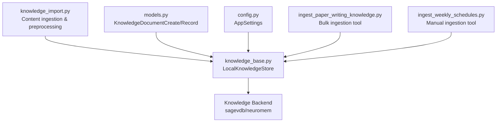
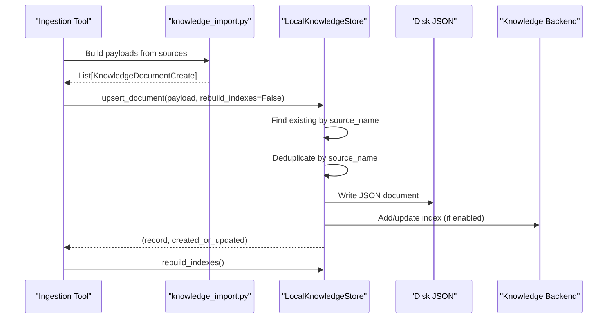
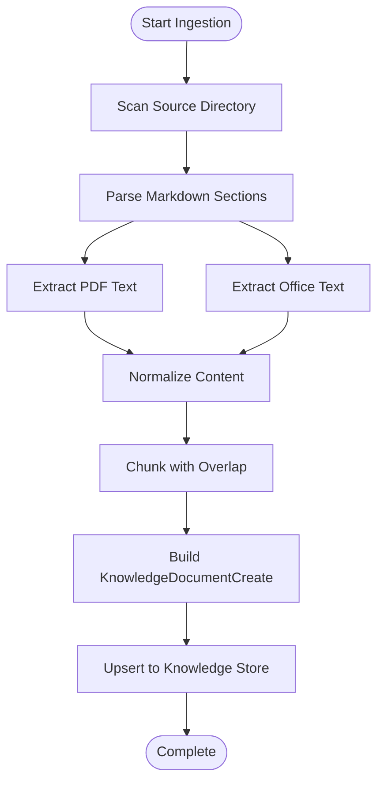
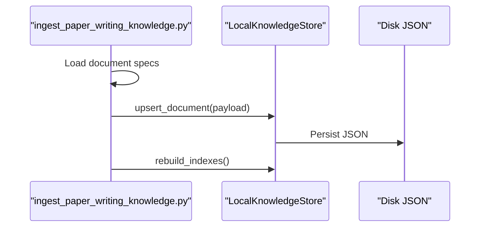
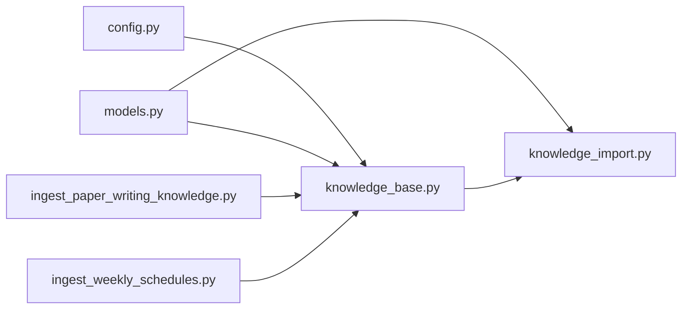

# Knowledge Ingestion Pipeline

<cite>
**Referenced Files in This Document**
- [knowledge_import.py](file://src/sage_faculty_twin/knowledge_import.py)
- [knowledge_base.py](file://src/sage_faculty_twin/knowledge_base.py)
- [models.py](file://src/sage_faculty_twin/models.py)
- [config.py](file://src/sage_faculty_twin/config.py)
- [ingest_paper_writing_knowledge.py](file://tools/ingest_paper_writing_knowledge.py)
- [ingest_weekly_schedules.py](file://tools/ingest_weekly_schedules.py)
</cite>

## Table of Contents
1. [Introduction](#introduction)
2. [Project Structure](#project-structure)
3. [Core Components](#core-components)
4. [Architecture Overview](#architecture-overview)
5. [Detailed Component Analysis](#detailed-component-analysis)
6. [Dependency Analysis](#dependency-analysis)
7. [Performance Considerations](#performance-considerations)
8. [Troubleshooting Guide](#troubleshooting-guide)
9. [Conclusion](#conclusion)

## Introduction
This document describes the knowledge ingestion pipeline that transforms heterogeneous content (Markdown, PDFs, Office documents, and structured data) into a searchable knowledge base. It covers document processing workflows, content extraction, preprocessing, validation, duplicate detection, normalization, categorization, and integration with external knowledge sources. Practical examples demonstrate bulk ingestion, automated parsing, and quality assurance checks, along with batch processing and error handling strategies.

## Project Structure
The ingestion pipeline spans several modules:
- Content ingestion and preprocessing: [knowledge_import.py](file://src/sage_faculty_twin/knowledge_import.py)
- Knowledge storage and retrieval: [knowledge_base.py](file://src/sage_faculty_twin/knowledge_base.py)
- Data models and validation: [models.py](file://src/sage_faculty_twin/models.py)
- Configuration and environment: [config.py](file://src/sage_faculty_twin/config.py)
- Example ingestion tools: [ingest_paper_writing_knowledge.py](file://tools/ingest_paper_writing_knowledge.py), [ingest_weekly_schedules.py](file://tools/ingest_weekly_schedules.py)

**Diagram sources**
- [knowledge_import.py:32-113](file://src/sage_faculty_twin/knowledge_import.py#L32-L113)
- [knowledge_base.py:121-271](file://src/sage_faculty_twin/knowledge_base.py#L121-L271)
- [models.py:319-340](file://src/sage_faculty_twin/models.py#L319-L340)
- [config.py:63-70](file://src/sage_faculty_twin/config.py#L63-L70)
- [ingest_paper_writing_knowledge.py:227-273](file://tools/ingest_paper_writing_knowledge.py#L227-L273)
- [ingest_weekly_schedules.py:115-159](file://tools/ingest_weekly_schedules.py#L115-L159)

**Section sources**
- [knowledge_import.py:1-113](file://src/sage_faculty_twin/knowledge_import.py#L1-L113)
- [knowledge_base.py:121-271](file://src/sage_faculty_twin/knowledge_base.py#L121-L271)
- [models.py:319-340](file://src/sage_faculty_twin/models.py#L319-L340)
- [config.py:63-70](file://src/sage_faculty_twin/config.py#L63-L70)
- [ingest_paper_writing_knowledge.py:1-273](file://tools/ingest_paper_writing_knowledge.py#L1-L273)
- [ingest_weekly_schedules.py:1-159](file://tools/ingest_weekly_schedules.py#L1-L159)

## Core Components
- Content ingestion and preprocessing: Builds KnowledgeDocumentCreate payloads from Markdown, PDFs, DOCX/PPTX, and generic text resources; normalizes content; splits into chunks; infers metadata and tags.
- Knowledge storage: Upserts documents, deduplicates by source_name, manages indexes, and supports multiple backends (sagevdb, neuromem).
- Validation: Pydantic models enforce field constraints and normalize metadata.
- Configuration: Centralized settings for knowledge base location, backend selection, embedding models, and retrieval parameters.
- Example ingestion tools: Automated scripts for paper-writing lessons and weekly schedules.

**Section sources**
- [knowledge_import.py:116-126](file://src/sage_faculty_twin/knowledge_import.py#L116-L126)
- [knowledge_base.py:167-207](file://src/sage_faculty_twin/knowledge_base.py#L167-L207)
- [models.py:319-340](file://src/sage_faculty_twin/models.py#L319-L340)
- [config.py:63-70](file://src/sage_faculty_twin/config.py#L63-L70)
- [ingest_paper_writing_knowledge.py:181-224](file://tools/ingest_paper_writing_knowledge.py#L181-L224)

## Architecture Overview
The ingestion pipeline follows a staged process:
1. Source discovery and parsing: Extract content from Markdown, PDFs, and Office documents.
2. Normalization and chunking: Normalize Markdown, clean inline markup, split long content into chunks with overlap.
3. Metadata and tag inference: Infer domain, identity, course, material type, and audience from content and tags.
4. Payload creation: Build KnowledgeDocumentCreate objects with title, content, tags, source_name, and metadata.
5. Duplicate detection and upsert: Compare against existing documents by source_name; remove duplicates; persist to disk and rebuild indexes.
6. Indexing and retrieval: Initialize chosen backend (sagevdb or neuromem) and build indexes.

**Diagram sources**
- [knowledge_import.py:32-113](file://src/sage_faculty_twin/knowledge_import.py#L32-L113)
- [knowledge_base.py:167-207](file://src/sage_faculty_twin/knowledge_base.py#L167-L207)
- [knowledge_base.py:249-268](file://src/sage_faculty_twin/knowledge_base.py#L249-L268)
- [knowledge_base.py:270-271](file://src/sage_faculty_twin/knowledge_base.py#L270-L271)

## Detailed Component Analysis

### Document Processing Workflows
- Homepage materials ingestion: Scans a homepage directory, parses MD sections, extracts PDFs and attachments, builds payloads with normalized titles and tags, and handles stale documents by source_name.
- Generic Markdown processing: Splits by headings, normalizes content, applies chunking with overlap, and creates payloads with appropriate tags and source stubs.
- PDF extraction: Attempts pdftotext system binary; falls back to pypdf; normalizes extracted text and creates payloads.
- Office document extraction: Reads DOCX/PPTX via ZIP XML parsing; extracts text from slides/paragraphs; normalizes and chunks.

**Diagram sources**
- [knowledge_import.py:32-113](file://src/sage_faculty_twin/knowledge_import.py#L32-L113)
- [knowledge_import.py:252-272](file://src/sage_faculty_twin/knowledge_import.py#L252-L272)
- [knowledge_import.py:293-303](file://src/sage_faculty_twin/knowledge_import.py#L293-L303)
- [knowledge_import.py:853-860](file://src/sage_faculty_twin/knowledge_import.py#L853-L860)
- [knowledge_import.py:863-895](file://src/sage_faculty_twin/knowledge_import.py#L863-L895)
- [knowledge_import.py:956-983](file://src/sage_faculty_twin/knowledge_import.py#L956-L983)

**Section sources**
- [knowledge_import.py:32-113](file://src/sage_faculty_twin/knowledge_import.py#L32-L113)
- [knowledge_import.py:252-303](file://src/sage_faculty_twin/knowledge_import.py#L252-L303)
- [knowledge_import.py:853-895](file://src/sage_faculty_twin/knowledge_import.py#L853-L895)
- [knowledge_import.py:956-1067](file://src/sage_faculty_twin/knowledge_import.py#L956-L1067)

### Content Extraction from Various Sources
- Markdown: Split by headings, normalize front matter and inline markup, preserve tables as semicolon-separated text.
- PDF: Prefer pdftotext for layout preservation; otherwise use pypdf page extraction; normalize whitespace and paragraphs.
- DOCX/PPTX: Parse ZIP XML structure; extract text nodes; join and normalize.

**Section sources**
- [knowledge_import.py:714-736](file://src/sage_faculty_twin/knowledge_import.py#L714-L736)
- [knowledge_import.py:739-762](file://src/sage_faculty_twin/knowledge_import.py#L739-L762)
- [knowledge_import.py:853-934](file://src/sage_faculty_twin/knowledge_import.py#L853-L934)
- [knowledge_import.py:863-895](file://src/sage_faculty_twin/knowledge_import.py#L863-L895)
- [knowledge_import.py:898-904](file://src/sage_faculty_twin/knowledge_import.py#L898-L904)

### Preprocessing Techniques
- Markdown normalization: Remove front matter, strip inline formatting, normalize tables, collapse whitespace.
- Text chunking: Paragraph-aware splitting; sentence-aware fallback; apply overlap to maintain context.
- Title cleaning: Strip numeric prefixes; normalize attachment titles; derive section-specific titles.
- Publication metadata parsing: Extract venue/year/authors/abstract/summary; infer research themes and tags.

**Section sources**
- [knowledge_import.py:739-762](file://src/sage_faculty_twin/knowledge_import.py#L739-L762)
- [knowledge_import.py:956-1067](file://src/sage_faculty_twin/knowledge_import.py#L956-L1067)
- [knowledge_import.py:1070-1071](file://src/sage_faculty_twin/knowledge_import.py#L1070-L1071)
- [knowledge_import.py:393-429](file://src/sage_faculty_twin/knowledge_import.py#L393-L429)
- [knowledge_import.py:432-469](file://src/sage_faculty_twin/knowledge_import.py#L432-L469)

### Ingestion Validation Rules
- Pydantic models enforce field constraints:
  - KnowledgeDocumentCreate: title/content length limits, tag count limits, optional source_name/metadata.
  - KnowledgeDocumentRecord: derived fields sync review/freshness states and computed flags.
- Content length caps: enforced during ingestion to prevent oversized payloads.
- Tag deduplication: preserves order while removing duplicates.

**Section sources**
- [models.py:319-324](file://src/sage_faculty_twin/models.py#L319-L324)
- [models.py:327-340](file://src/sage_faculty_twin/models.py#L327-L340)
- [knowledge_import.py:849-850](file://src/sage_faculty_twin/knowledge_import.py#L849-L850)

### Duplicate Detection Mechanisms
- Source-based deduplication: Documents are grouped by source_name; only the newest is retained; older duplicates are removed from disk and memory.
- Stale document cleanup: Compares desired source sets and deletes superseded documents.
- Post-load deduplication: On startup, removes duplicates for each source_name.

**Section sources**
- [knowledge_import.py:369-390](file://src/sage_faculty_twin/knowledge_import.py#L369-L390)
- [knowledge_base.py:372-400](file://src/sage_faculty_twin/knowledge_base.py#L372-L400)
- [knowledge_base.py:338-352](file://src/sage_faculty_twin/knowledge_base.py#L338-L352)

### Content Normalization Processes
- Retrieval text composition: Concatenates title, tags, aliases, metadata, source tokens, and content; normalizes for embeddings/search.
- Tokenization: Extracts alphabetic sequences, CJK tokens, and character n-grams for robust matching.
- Query expansion: Adds tokenized terms to improve recall.

**Section sources**
- [knowledge_base.py:961-967](file://src/sage_faculty_twin/knowledge_base.py#L961-L967)
- [knowledge_base.py:1129-1145](file://src/sage_faculty_twin/knowledge_base.py#L1129-L1145)
- [knowledge_base.py:1117-1121](file://src/sage_faculty_twin/knowledge_base.py#L1117-L1121)

### Practical Examples

#### Bulk Document Uploads
- Paper-writing lessons: Automated ingestion of lecture materials with inline content and external files, tagging with course identifiers and ordinal numbering.
- Weekly schedules: Bulk ingestion of team member schedules with metadata indicating domain/identity/source kind.

**Diagram sources**
- [ingest_paper_writing_knowledge.py:227-273](file://tools/ingest_paper_writing_knowledge.py#L227-L273)
- [knowledge_base.py:167-207](file://src/sage_faculty_twin/knowledge_base.py#L167-L207)
- [knowledge_base.py:270-271](file://src/sage_faculty_twin/knowledge_base.py#L270-L271)

**Section sources**
- [ingest_paper_writing_knowledge.py:181-224](file://tools/ingest_paper_writing_knowledge.py#L181-L224)
- [ingest_paper_writing_knowledge.py:227-273](file://tools/ingest_paper_writing_knowledge.py#L227-L273)
- [ingest_weekly_schedules.py:115-159](file://tools/ingest_weekly_schedules.py#L115-L159)

#### Automated Content Parsing
- Homepage ingestion orchestrator aggregates payloads from multiple sources (profiles, news, systems, awards, publications, teaching materials).
- Automatic chunking ensures each payload fits within configured limits and maintains contextual continuity.

**Section sources**
- [knowledge_import.py:32-61](file://src/sage_faculty_twin/knowledge_import.py#L32-L61)
- [knowledge_import.py:686-711](file://src/sage_faculty_twin/knowledge_import.py#L686-L711)

#### Quality Assurance Checks
- Empty content detection: Skips files with no readable content.
- Content length cap enforcement: Truncates to prevent oversized records.
- Backend initialization checks: Validates embedding packages and model dimensions.

**Section sources**
- [ingest_paper_writing_knowledge.py:235-248](file://tools/ingest_paper_writing_knowledge.py#L235-L248)
- [knowledge_import.py:853-860](file://src/sage_faculty_twin/knowledge_import.py#L853-L860)
- [knowledge_base.py:422-463](file://src/sage_faculty_twin/knowledge_base.py#L422-L463)

### Integration with External Knowledge Sources
- Source naming convention: Uses "kind:name" scheme to identify origin and enable grouping/deduplication.
- Manual ingestion: Tools write JSON directly to knowledge base directory; indexes rebuilt on next start.
- API-driven ingestion: Full knowledge store API with embeddings and indexes when sentence-transformers is available.

**Section sources**
- [knowledge_import.py:148-158](file://src/sage_faculty_twin/knowledge_import.py#L148-L158)
- [ingest_weekly_schedules.py:76-85](file://tools/ingest_weekly_schedules.py#L76-L85)
- [ingest_weekly_schedules.py:115-154](file://tools/ingest_weekly_schedules.py#L115-L154)

### Batch Processing Capabilities
- Chunked ingestion: Documents are split into manageable parts with overlap to preserve context across boundaries.
- Batched embeddings (neuromem FAISS): Precomputes vectors for all documents in a single batch to accelerate indexing.

**Section sources**
- [knowledge_import.py:956-1009](file://src/sage_faculty_twin/knowledge_import.py#L956-L1009)
- [knowledge_base.py:522-560](file://src/sage_faculty_twin/knowledge_base.py#L522-L560)

### Error Handling Strategies
- PDF extraction fallback: Try pdftotext; if unavailable or fails, fall back to pypdf.
- Office ZIP parsing: Gracefully handle malformed archives; skip unreadable content.
- Backend initialization failures: Clear error messages indicating missing packages or invalid configurations.
- Runtime resilience: Rebuild directories if missing; remove duplicates after load.

**Section sources**
- [knowledge_import.py:853-860](file://src/sage_faculty_twin/knowledge_import.py#L853-L860)
- [knowledge_import.py:872-895](file://src/sage_faculty_twin/knowledge_import.py#L872-L895)
- [knowledge_base.py:422-463](file://src/sage_faculty_twin/knowledge_base.py#L422-L463)
- [knowledge_base.py:338-352](file://src/sage_faculty_twin/knowledge_base.py#L338-L352)

### Content Formatting Standards
- Titles: Derived from headings or filenames; numeric prefixes stripped; section-specific titles appended.
- Tags: Deduplicated; enriched with inferred domains/material types; course/ordinal metadata encoded as tags.
- Metadata: Inferred from tags and content; explicit metadata merged with inferred values.

**Section sources**
- [knowledge_import.py:1070-1071](file://src/sage_faculty_twin/knowledge_import.py#L1070-L1071)
- [knowledge_import.py:849-850](file://src/sage_faculty_twin/knowledge_import.py#L849-L850)
- [knowledge_base.py:1388-1466](file://src/sage_faculty_twin/knowledge_base.py#L1388-L1466)

### Metadata Extraction and Document Categorization
- Domain/identity inference: Based on tags and content; supports teaching, research, meeting, and public profile contexts.
- Course identification: Maps aliases to course IDs; enriches metadata with course_id.
- Material type classification: Tutorial, lecture, experiment, paper-digest, overview, profile.
- Audience targeting: Supports public, undergraduate, graduate, lab_member, manager, admin visibility.

**Section sources**
- [knowledge_base.py:1402-1466](file://src/sage_faculty_twin/knowledge_base.py#L1402-L1466)
- [knowledge_base.py:1148-1186](file://src/sage_faculty_twin/knowledge_base.py#L1148-L1186)
- [knowledge_base.py:1500-1540](file://src/sage_faculty_twin/knowledge_base.py#L1500-L1540)

## Dependency Analysis
The ingestion pipeline exhibits clear module separation:
- knowledge_import.py depends on knowledge_base.py for upsert operations and on models.py for payload structures.
- knowledge_base.py depends on config.py for backend configuration and embedding settings.
- Example ingestion tools depend on knowledge_base.py and models.py.

**Diagram sources**
- [config.py:63-70](file://src/sage_faculty_twin/config.py#L63-L70)
- [knowledge_base.py:121-140](file://src/sage_faculty_twin/knowledge_base.py#L121-L140)
- [models.py:319-340](file://src/sage_faculty_twin/models.py#L319-L340)
- [knowledge_import.py:12-14](file://src/sage_faculty_twin/knowledge_import.py#L12-L14)
- [ingest_paper_writing_knowledge.py:15-17](file://tools/ingest_paper_writing_knowledge.py#L15-L17)
- [ingest_weekly_schedules.py:23-28](file://tools/ingest_weekly_schedules.py#L23-L28)

**Section sources**
- [knowledge_import.py:12-14](file://src/sage_faculty_twin/knowledge_import.py#L12-L14)
- [knowledge_base.py:121-140](file://src/sage_faculty_twin/knowledge_base.py#L121-L140)
- [models.py:319-340](file://src/sage_faculty_twin/models.py#L319-L340)
- [config.py:63-70](file://src/sage_faculty_twin/config.py#L63-L70)
- [ingest_paper_writing_knowledge.py:15-17](file://tools/ingest_paper_writing_knowledge.py#L15-L17)
- [ingest_weekly_schedules.py:23-28](file://tools/ingest_weekly_schedules.py#L23-L28)

## Performance Considerations
- Chunking with overlap improves retrieval accuracy without dramatically increasing storage; tune max_chars and overlap target for balance.
- Batched embeddings for FAISS reduce per-document encoding overhead; ensure sufficient memory for large corpora.
- Backend selection impacts latency and accuracy; BM25 vs dense retrieval trade-offs should align with use cases.
- Deduplication reduces redundant indexing; consider disabling rebuild_indexes during bulk loads and rebuilding once at the end.

## Troubleshooting Guide
- Missing pdftotext: Install system binary or install pypdf to enable fallback extraction.
- Embedding model issues: Verify sentence-transformers installation and model dimension match configuration.
- Empty or unreadable content: Confirm file encodings and content presence; scripts skip empty files.
- Backend initialization errors: Check environment variables and package availability; consult error messages for missing dependencies.

**Section sources**
- [knowledge_import.py:853-860](file://src/sage_faculty_twin/knowledge_import.py#L853-L860)
- [knowledge_base.py:422-463](file://src/sage_faculty_twin/knowledge_base.py#L422-L463)
- [ingest_paper_writing_knowledge.py:235-248](file://tools/ingest_paper_writing_knowledge.py#L235-L248)

## Conclusion
The knowledge ingestion pipeline provides a robust, extensible framework for transforming diverse content into a structured, searchable knowledge base. It emphasizes normalization, chunking, metadata enrichment, and deduplication, while offering flexible backends and practical ingestion tools for both automated and manual workflows.