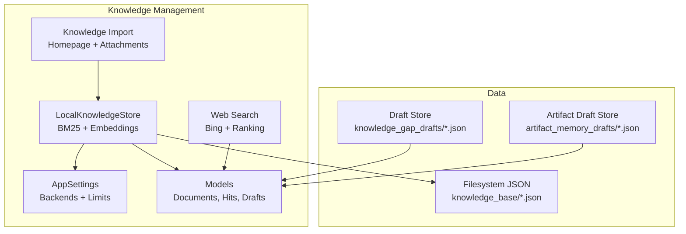
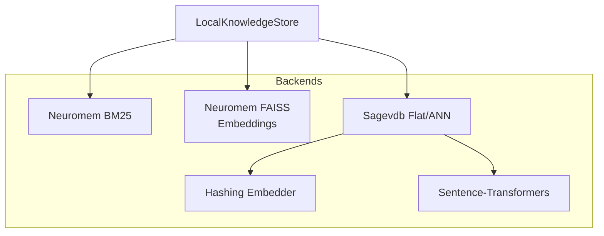
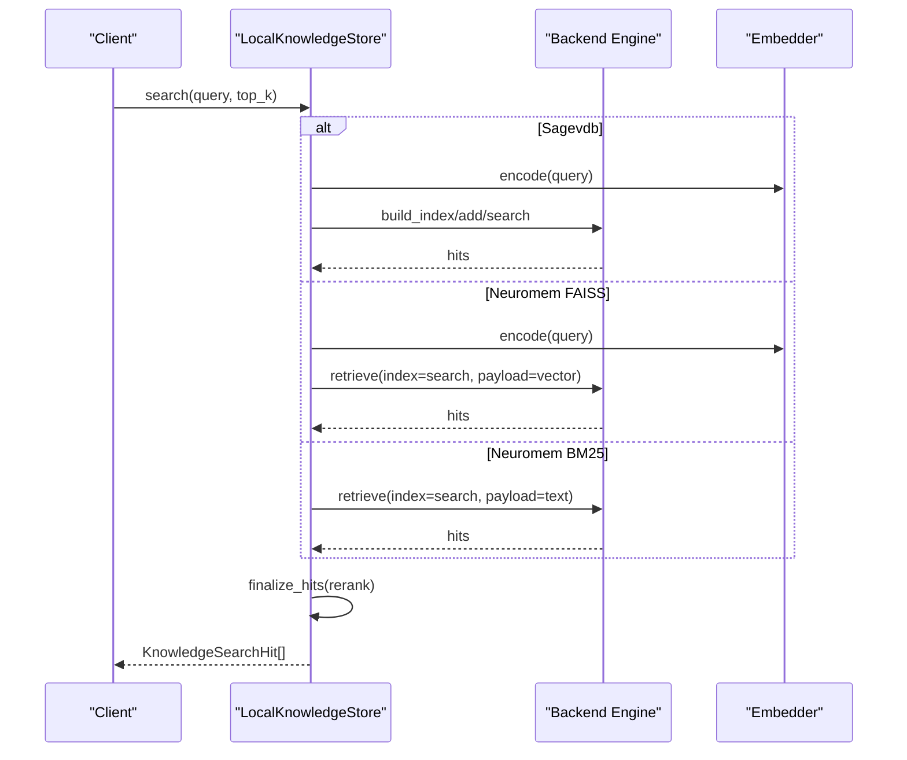
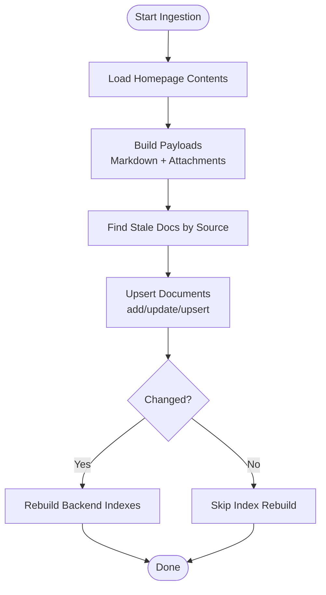
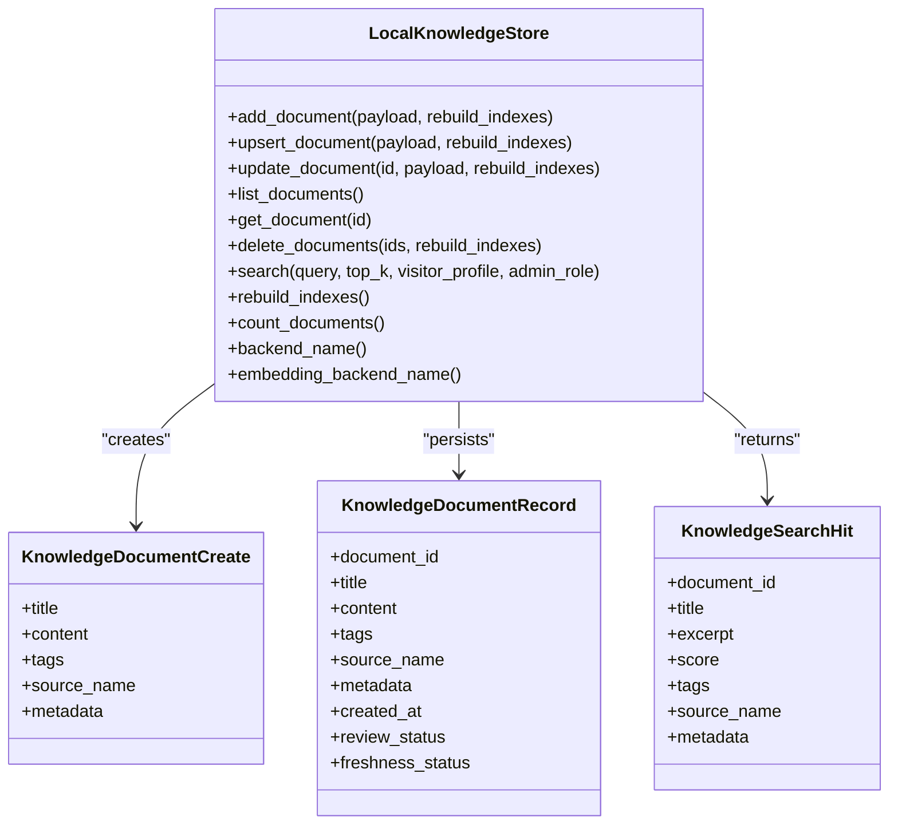
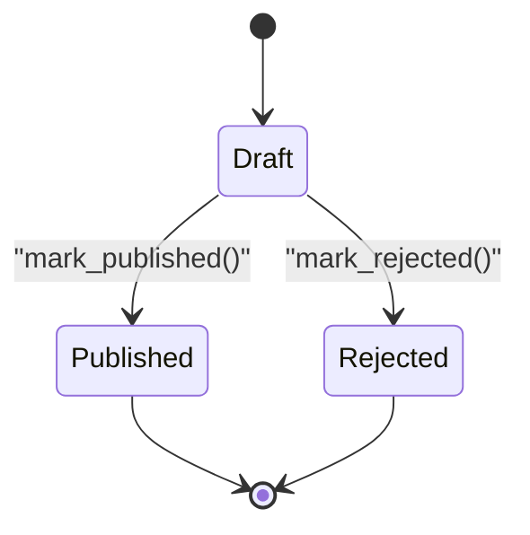
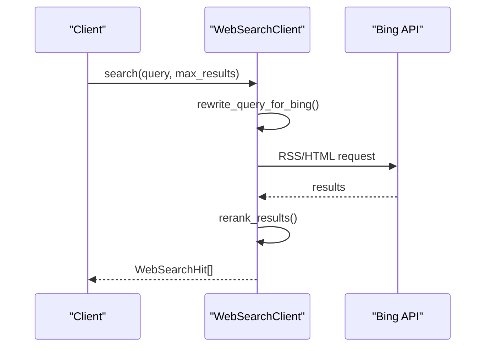
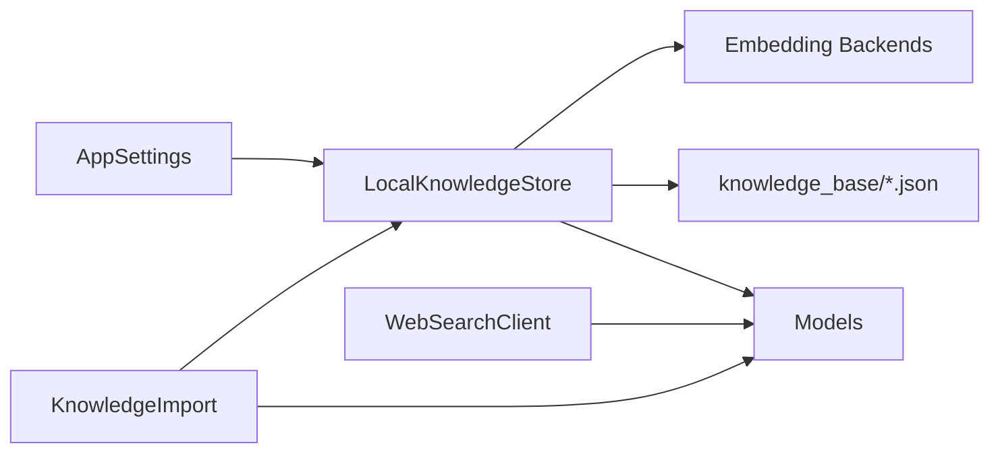

# Knowledge Management

<cite>
**Referenced Files in This Document**
- [knowledge_base.py](file://src/sage_faculty_twin/knowledge_base.py)
- [knowledge_import.py](file://src/sage_faculty_twin/knowledge_import.py)
- [models.py](file://src/sage_faculty_twin/models.py)
- [web_search.py](file://src/sage_faculty_twin/web_search.py)
- [config.py](file://src/sage_faculty_twin/config.py)
- [knowledge_gap_draft_store.py](file://src/sage_faculty_twin/knowledge_gap_draft_store.py)
- [artifact_memory_draft_store.py](file://src/sage_faculty_twin/artifact_memory_draft_store.py)
- [00216cdc-98bd-4ca5-9937-9aca47f9da39.json](file://data/knowledge_base/00216cdc-98bd-4ca5-9937-9aca47f9da39.json)
- [product-outline.md](file://docs/product-outline.md)
- [README.md](file://README.md)
- [test_knowledge_base.py](file://tests/test_knowledge_base.py)
- [test_knowledge_import.py](file://tests/test_knowledge_import.py)
</cite>

## Table of Contents
1. [Introduction](#introduction)
2. [Project Structure](#project-structure)
3. [Core Components](#core-components)
4. [Architecture Overview](#architecture-overview)
5. [Detailed Component Analysis](#detailed-component-analysis)
6. [Dependency Analysis](#dependency-analysis)
7. [Performance Considerations](#performance-considerations)
8. [Troubleshooting Guide](#troubleshooting-guide)
9. [Conclusion](#conclusion)
10. [Appendices](#appendices)

## Introduction
This document explains the knowledge management system that powers the digital faculty twin. It covers the multi-backend architecture supporting BM25 lexical search and semantic embeddings, the ingestion pipeline for diverse content types, hybrid retrieval mechanisms, the knowledge base implementation, document review workflows, and gap identification processes. Practical examples demonstrate content ingestion, search optimization, and knowledge maintenance. Integration with external knowledge sources, caching strategies, performance optimization techniques, and quality assurance processes are included.

## Project Structure
The knowledge management system centers around:
- Knowledge base storage and search (LocalKnowledgeStore)
- Content ingestion from homepage materials and attachments
- Hybrid retrieval combining lexical and dense embeddings
- Review and gap identification workflows
- Supporting models and configuration

**Diagram sources**
- [knowledge_base.py:121-800](file://src/sage_faculty_twin/knowledge_base.py#L121-L800)
- [knowledge_import.py:1-472](file://src/sage_faculty_twin/knowledge_import.py#L1-L472)
- [web_search.py:93-444](file://src/sage_faculty_twin/web_search.py#L93-L444)
- [config.py:63-120](file://src/sage_faculty_twin/config.py#L63-L120)
- [models.py:319-412](file://src/sage_faculty_twin/models.py#L319-L412)
- [knowledge_gap_draft_store.py:100-186](file://src/sage_faculty_twin/knowledge_gap_draft_store.py#L100-L186)
- [artifact_memory_draft_store.py:97-184](file://src/sage_faculty_twin/artifact_memory_draft_store.py#L97-L184)

**Section sources**
- [README.md:1-126](file://README.md#L1-L126)
- [product-outline.md:1-35](file://docs/product-outline.md#L1-L35)

## Core Components
- LocalKnowledgeStore: Multi-backend knowledge store supporting BM25, FAISS-based dense retrieval, and flat index search. Provides add/update/upsert/list/delete/search/rebuild capabilities.
- KnowledgeImport: Ingests homepage Markdown, PDFs, DOCX/PPTX, and attachments into KnowledgeDocumentCreate payloads, deduplicates by source, and rebuilds indexes efficiently.
- WebSearchClient: Optional web search integration using Bing RSS/HTML with query rewriting and news-aware scoring.
- Models: Typed Pydantic models for documents, search hits, reviews, and drafts.
- Configuration: AppSettings defines backends (neuromem vs sagevdb), embedding backends, and retrieval parameters.
- Draft Stores: KnowledgeGapDraftStore and ArtifactMemoryDraftStore for gap identification and artifact memory curation.

**Section sources**
- [knowledge_base.py:121-800](file://src/sage_faculty_twin/knowledge_base.py#L121-L800)
- [knowledge_import.py:1-472](file://src/sage_faculty_twin/knowledge_import.py#L1-L472)
- [web_search.py:93-444](file://src/sage_faculty_twin/web_search.py#L93-L444)
- [models.py:319-412](file://src/sage_faculty_twin/models.py#L319-L412)
- [config.py:63-120](file://src/sage_faculty_twin/config.py#L63-L120)
- [knowledge_gap_draft_store.py:100-186](file://src/sage_faculty_twin/knowledge_gap_draft_store.py#L100-L186)
- [artifact_memory_draft_store.py:97-184](file://src/sage_faculty_twin/artifact_memory_draft_store.py#L97-L184)

## Architecture Overview
The system supports two primary backends:
- Neuromem: Lexical BM25 by default; optional FAISS dense index with sentence-transformers embeddings.
- Sagevdb: Flat or ANN-based index with configurable distance metric and embedding backends (sentence-transformers or hashing).

Hybrid retrieval combines:
- Lexical BM25 scoring for homepage materials and courseware
- Dense semantic vectors for research papers and specialized domains
- Optional web search for current events and weather queries

**Diagram sources**
- [knowledge_base.py:18-118](file://src/sage_faculty_twin/knowledge_base.py#L18-L118)
- [knowledge_base.py:422-521](file://src/sage_faculty_twin/knowledge_base.py#L422-L521)
- [knowledge_base.py:756-800](file://src/sage_faculty_twin/knowledge_base.py#L756-L800)
- [config.py:63-120](file://src/sage_faculty_twin/config.py#L63-L120)

## Detailed Component Analysis

### Multi-Backend Architecture and Hybrid Retrieval
- Backend selection via configuration:
  - knowledge_backend: "neuromem" or "sagevdb"
  - neuromem_index_type: "bm25" or "faiss"
  - sagevdb_embedding_backend: "sentence-transformers" or "hash"
- Embedding backends:
  - HashingTextEmbedder: token-based hashing with blake2b and log-count weighting
  - SentenceTransformerTextEmbedder: sentence-transformers with normalization
  - NeuromemBgeEmbedder: BAAI bge-small-zh-v1.5 for FAISS index
- Search paths:
  - Neuromem BM25: lexical retrieval with BM25 scoring
  - Neuromem FAISS: dense vectors with cosine similarity
  - Sagevdb Flat: numpy-based cosine search
  - Sagevdb ANN: FAISS/HNSW with inner-product metric
- Hybrid ranking: Neuromem FAISS merges lexical and dense scores, then re-ranks by lexical relevance.

**Diagram sources**
- [knowledge_base.py:273-331](file://src/sage_faculty_twin/knowledge_base.py#L273-L331)
- [knowledge_base.py:611-710](file://src/sage_faculty_twin/knowledge_base.py#L611-L710)
- [knowledge_base.py:756-800](file://src/sage_faculty_twin/knowledge_base.py#L756-L800)
- [knowledge_base.py:18-118](file://src/sage_faculty_twin/knowledge_base.py#L18-L118)

**Section sources**
- [knowledge_base.py:121-800](file://src/sage_faculty_twin/knowledge_base.py#L121-L800)
- [config.py:63-120](file://src/sage_faculty_twin/config.py#L63-L120)

### Knowledge Ingestion Pipeline
- Homepage ingestion:
  - Parses Markdown sections, extracts metadata, infers tags and course info
  - Builds payloads for profile, news, systems, awards, resources, publications, and teaching materials
  - Extracts text from PDFs, DOCX, PPTX attachments
- Deduplication:
  - Removes stale documents by source_name and retains newest entries
- Indexing:
  - Batch rebuilds indexes only once per sync to optimize performance

**Diagram sources**
- [knowledge_import.py:32-114](file://src/sage_faculty_twin/knowledge_import.py#L32-L114)
- [knowledge_import.py:369-391](file://src/sage_faculty_twin/knowledge_import.py#L369-L391)
- [knowledge_base.py:141-166](file://src/sage_faculty_twin/knowledge_base.py#L141-L166)

**Section sources**
- [knowledge_import.py:1-472](file://src/sage_faculty_twin/knowledge_import.py#L1-L472)
- [test_knowledge_import.py:13-160](file://tests/test_knowledge_import.py#L13-L160)

### Knowledge Base Implementation
- Storage:
  - Documents persisted as JSON files under knowledge_base_dir
  - Metadata inferred for legacy records and synchronized on load
- Visibility and audience filtering:
  - Visitor/admin profiles control visibility of audience-tagged content
- Search scoring:
  - Tokenization, query expansion, and lexical scoring
  - Finalization with deduplication across adjacent chunks and preference heuristics

**Diagram sources**
- [knowledge_base.py:121-800](file://src/sage_faculty_twin/knowledge_base.py#L121-L800)
- [models.py:319-412](file://src/sage_faculty_twin/models.py#L319-L412)

**Section sources**
- [knowledge_base.py:121-800](file://src/sage_faculty_twin/knowledge_base.py#L121-L800)
- [models.py:319-412](file://src/sage_faculty_twin/models.py#L319-L412)
- [00216cdc-98bd-4ca5-9937-9aca47f9da39.json:1-18](file://data/knowledge_base/00216cdc-98bd-4ca5-9937-9aca47f9da39.json#L1-L18)

### Document Review Workflows and Gap Identification
- Review status and freshness:
  - Derived from metadata and tags; supports feedback-web gating
- KnowledgeGapDraftStore:
  - Generates, lists, and publishes gap drafts linked to clusters
  - Tracks status and published document linkage
- ArtifactMemoryDraftStore:
  - Manages artifact memory drafts with acceptance/rejection lifecycle

**Diagram sources**
- [models.py:379-391](file://src/sage_faculty_twin/models.py#L379-L391)
- [knowledge_gap_draft_store.py:100-186](file://src/sage_faculty_twin/knowledge_gap_draft_store.py#L100-L186)
- [artifact_memory_draft_store.py:97-184](file://src/sage_faculty_twin/artifact_memory_draft_store.py#L97-L184)

**Section sources**
- [models.py:379-391](file://src/sage_faculty_twin/models.py#L379-L391)
- [knowledge_gap_draft_store.py:100-186](file://src/sage_faculty_twin/knowledge_gap_draft_store.py#L100-L186)
- [artifact_memory_draft_store.py:97-184](file://src/sage_faculty_twin/artifact_memory_draft_store.py#L97-L184)

### Web Search Integration
- Optional web search for current events and weather
- Query rewriting and news-aware reranking with recency bonuses
- Results integrated alongside knowledge hits

**Diagram sources**
- [web_search.py:93-444](file://src/sage_faculty_twin/web_search.py#L93-L444)

**Section sources**
- [web_search.py:93-444](file://src/sage_faculty_twin/web_search.py#L93-L444)
- [config.py:71-74](file://src/sage_faculty_twin/config.py#L71-L74)

## Dependency Analysis
- Configuration-driven backends:
  - knowledge_backend selects Neuromem or Sagevdb
  - neuromem_index_type selects bm25 or faiss
  - sagevdb_embedding_backend selects hashing or sentence-transformers
- Cohesion and coupling:
  - LocalKnowledgeStore encapsulates backend-specific logic and embedding selection
  - KnowledgeImport is decoupled from backend and focuses on content extraction and deduplication
  - Models define stable interfaces for search results and document records

**Diagram sources**
- [config.py:63-120](file://src/sage_faculty_twin/config.py#L63-L120)
- [knowledge_base.py:121-800](file://src/sage_faculty_twin/knowledge_base.py#L121-L800)
- [knowledge_import.py:1-472](file://src/sage_faculty_twin/knowledge_import.py#L1-L472)
- [models.py:319-412](file://src/sage_faculty_twin/models.py#L319-L412)
- [web_search.py:93-444](file://src/sage_faculty_twin/web_search.py#L93-L444)

**Section sources**
- [config.py:63-120](file://src/sage_faculty_twin/config.py#L63-L120)
- [knowledge_base.py:121-800](file://src/sage_faculty_twin/knowledge_base.py#L121-L800)
- [knowledge_import.py:1-472](file://src/sage_faculty_twin/knowledge_import.py#L1-L472)
- [models.py:319-412](file://src/sage_faculty_twin/models.py#L319-L412)
- [web_search.py:93-444](file://src/sage_faculty_twin/web_search.py#L93-L444)

## Performance Considerations
- Indexing efficiency:
  - Batched FAISS indexing for Neuromem to avoid repeated per-document encoding
  - Sagevdb ANN builds index from stacked vectors for speed
- Retrieval tuning:
  - retrieval_top_k controls result limits
  - Backend-specific search parameters (k/min/max) tuned per engine
- Caching:
  - LLM cache TTL and capacity configured centrally
- Chunking and deduplication:
  - Adjacent courseware chunks deduplicated to reduce noise and improve relevance

[No sources needed since this section provides general guidance]

## Troubleshooting Guide
- Backend initialization errors:
  - Missing packages for sagevdb or neuromem backends
  - ANN backend requires specific algorithm configuration
- Embedding dimension mismatches:
  - Ensure embedding model reports a dimension and matches configured dimension
- Index rebuild failures:
  - Verify backend availability and correct backend selection
- Audience visibility issues:
  - Confirm visitor/admin roles and audience tags on documents
- Ingestion anomalies:
  - Check stale document removal and payload duplication logic

**Section sources**
- [knowledge_base.py:422-464](file://src/sage_faculty_twin/knowledge_base.py#L422-L464)
- [knowledge_base.py:522-560](file://src/sage_faculty_twin/knowledge_base.py#L522-L560)
- [knowledge_base.py:721-737](file://src/sage_faculty_twin/knowledge_base.py#L721-L737)
- [test_knowledge_base.py:118-141](file://tests/test_knowledge_base.py#L118-L141)
- [test_knowledge_base.py:726-800](file://tests/test_knowledge_base.py#L726-L800)

## Conclusion
The knowledge management system provides a robust, multi-backend architecture supporting both lexical and semantic retrieval, efficient ingestion from diverse sources, and integrated workflows for review and gap identification. Configuration-driven backends and embedding choices enable flexible deployment, while indexing strategies and chunking ensure high-quality, performant search results.

## Appendices

### Practical Examples

- Content ingestion
  - Homepage ingestion creates searchable documents and deduplicates by source
  - Attachments (PDF/DOCX/PPTX) are extracted and indexed as separate documents
  - Example ingestion and search coverage validated by tests

  **Section sources**
  - [test_knowledge_import.py:13-160](file://tests/test_knowledge_import.py#L13-L160)
  - [test_knowledge_import.py:220-256](file://tests/test_knowledge_import.py#L220-L256)
  - [test_knowledge_import.py:389-437](file://tests/test_knowledge_import.py#L389-L437)

- Search optimization
  - Adjust retrieval_top_k and backend selection for domain-specific needs
  - Prefer FAISS for research-heavy domains; BM25 for homepage/courseware
  - Use visitor/admin roles to enforce visibility and tailor results

  **Section sources**
  - [config.py:70-70](file://src/sage_faculty_twin/config.py#L70-L70)
  - [test_knowledge_base.py:679-724](file://tests/test_knowledge_base.py#L679-L724)
  - [test_knowledge_base.py:726-800](file://tests/test_knowledge_base.py#L726-L800)

- Knowledge maintenance
  - Upsert preserves created_at and avoids redundant writes
  - Stale documents removed automatically during ingestion
  - Index rebuilds batched to minimize downtime

  **Section sources**
  - [test_knowledge_base.py:36-57](file://tests/test_knowledge_base.py#L36-L57)
  - [test_knowledge_import.py:439-472](file://tests/test_knowledge_import.py#L439-L472)

- Integration with external knowledge sources
  - Web search for current events and weather
  - Optional integration with calendar providers (planned)

  **Section sources**
  - [web_search.py:93-444](file://src/sage_faculty_twin/web_search.py#L93-L444)
  - [product-outline.md:28-35](file://docs/product-outline.md#L28-L35)

- Caching strategies and performance optimization
  - LLM cache TTL and max entries configured centrally
  - Batched embedding encoding for FAISS index building
  - Deduplication of adjacent chunks reduces redundancy

  **Section sources**
  - [config.py:38-39](file://src/sage_faculty_twin/config.py#L38-L39)
  - [knowledge_base.py:522-560](file://src/sage_faculty_twin/knowledge_base.py#L522-L560)
  - [test_knowledge_base.py:495-570](file://tests/test_knowledge_base.py#L495-L570)

- Content approval workflows and quality assurance
  - Review status derived from metadata/tags
  - Feedback-web gating and freshness tracking
  - Gap drafts and artifact memory drafts support continuous improvement

  **Section sources**
  - [models.py:341-377](file://src/sage_faculty_twin/models.py#L341-L377)
  - [knowledge_gap_draft_store.py:100-186](file://src/sage_faculty_twin/knowledge_gap_draft_store.py#L100-L186)
  - [artifact_memory_draft_store.py:97-184](file://src/sage_faculty_twin/artifact_memory_draft_store.py#L97-L184)